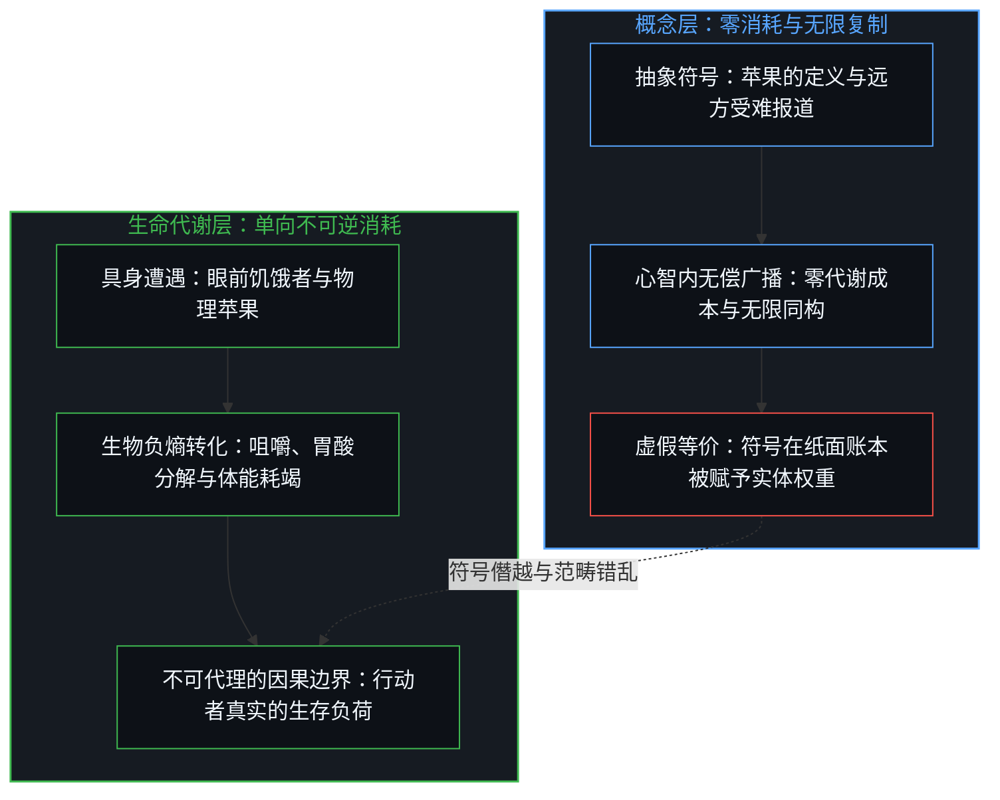
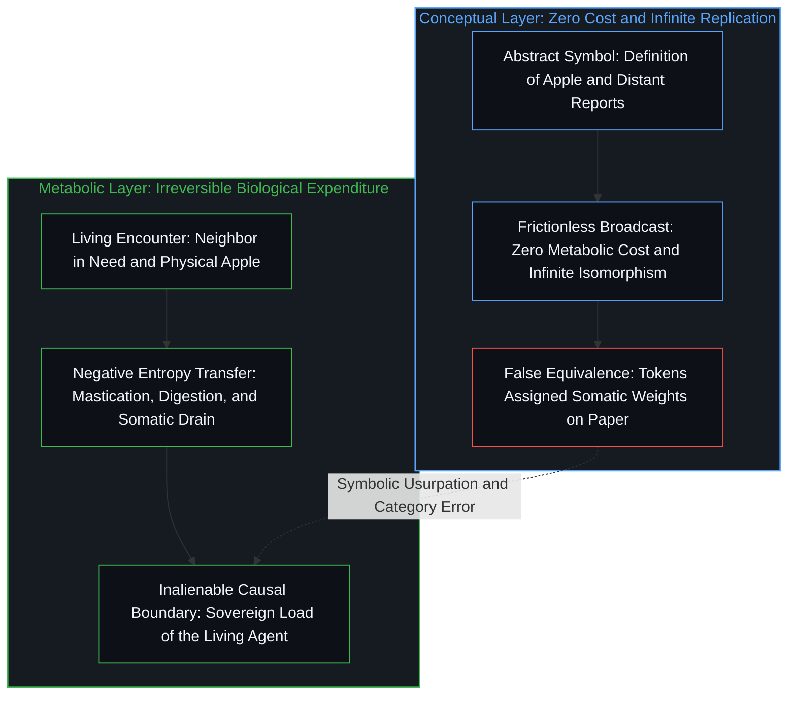
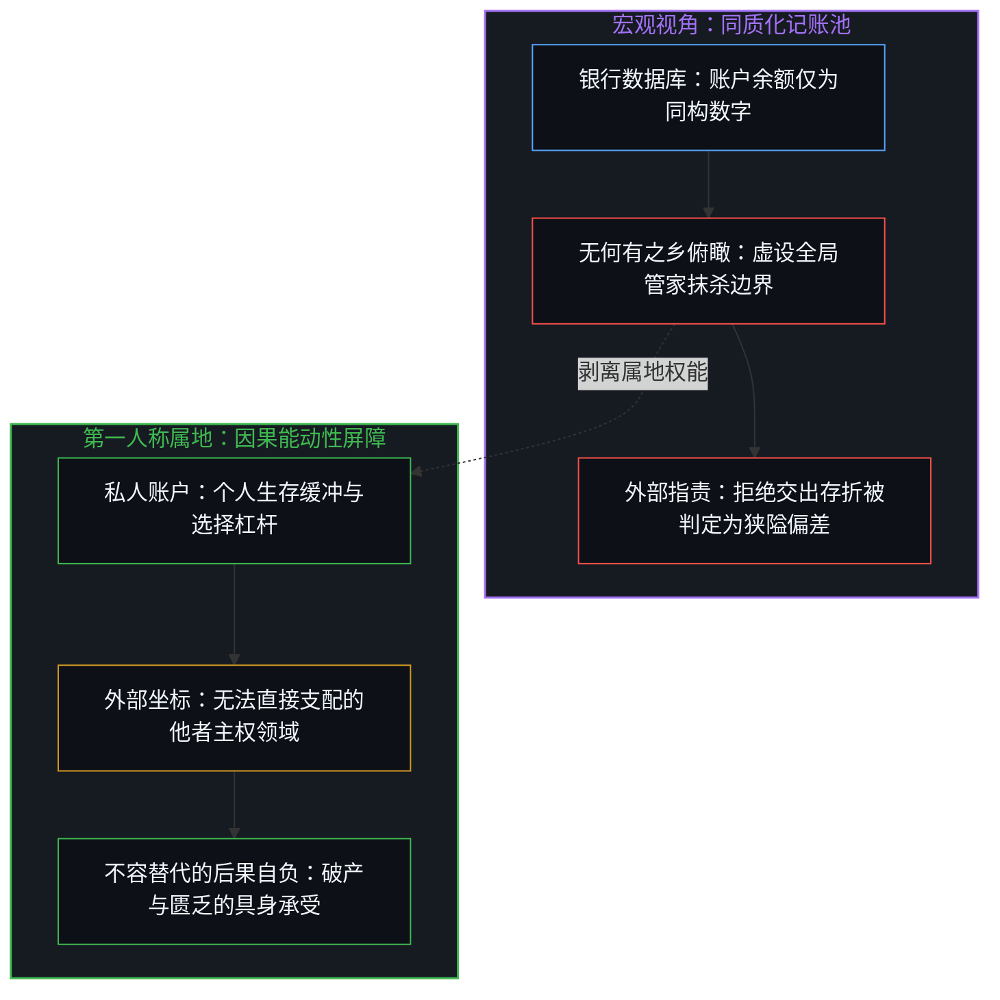
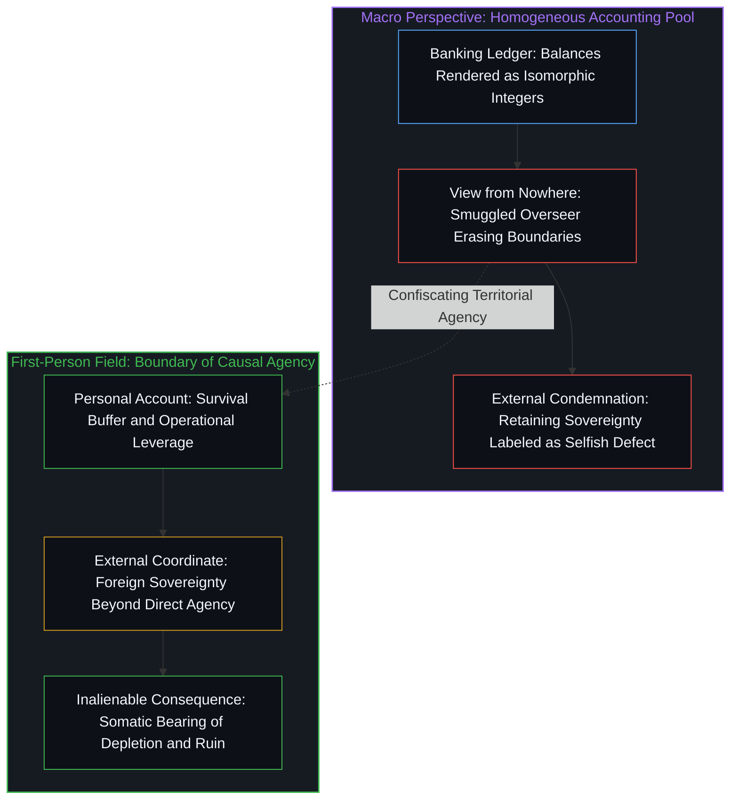
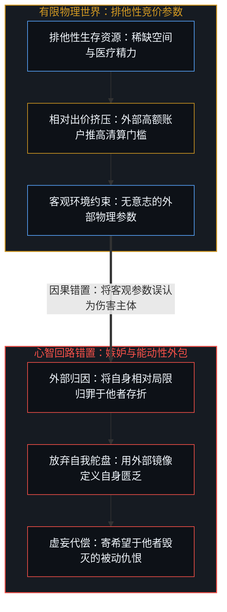
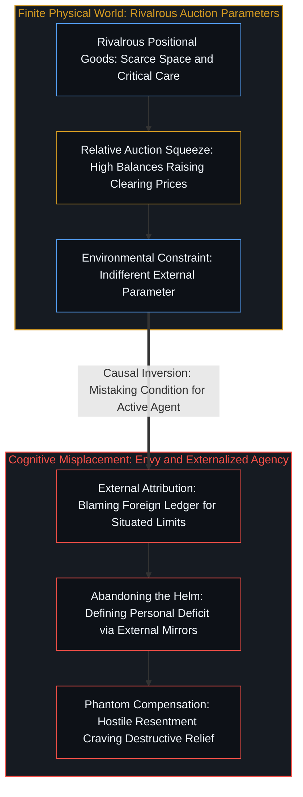
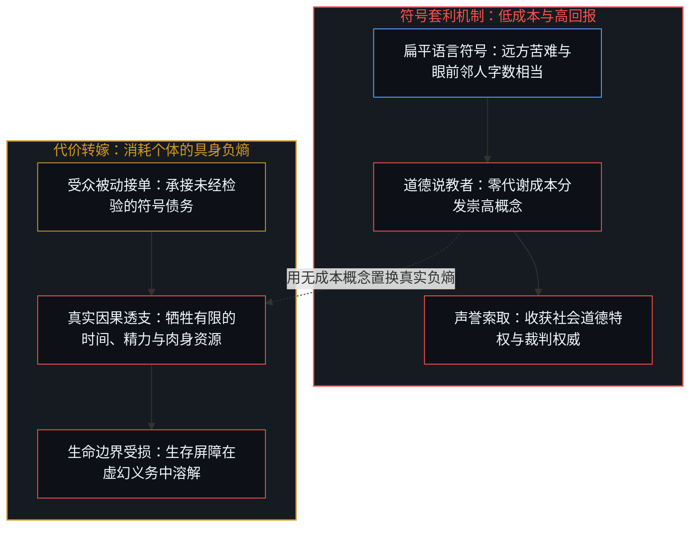
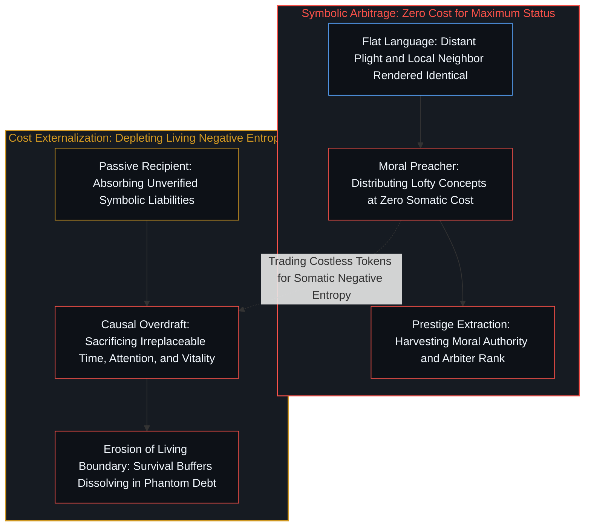

# 抽象的苦难与真实的饥饿 / Abstract Pain and Living Hunger

*概念无法充饥，将符号视同代谢实体的道德等价性抹杀了行动者真实的生存边界。 / Concepts cannot nourish flesh; equating symbols with metabolic entities erases an agent's causal boundary.*

当心智试图理解复杂世界时，抽象是认知不可避免的减熵工具；然而，当抽象符号被反向指认为实体本身时，严重的范畴错乱便悄然发生。在道德话语的掩护下，远方的苦难被压缩为扁平的语义记号，却被要求拥有与眼前肉体遭遇同等强度的因果约束力。这种错乱将概念的无偿调用与实体的代谢消耗混为一谈，诱使行动者在符号等价的幻觉中交出自身的生存边界。正如在 [未被遭遇之物的账本](../the-ledger-of-the-unencountered/) 中所揭示的，未遭遇之物必须由特定的人强行搬运才能进入视界，而这种搬运常常借助概念对实体的僭越，将虚构的对称性强加于真实的生命。

When minds attempt to comprehend a complex world, abstraction serves as an indispensable tool for cognitive entropy reduction; however, when abstract symbols are inverted into entities in their own right, a grave category error takes hold. Shielded by moralized rhetoric, distant suffering is compressed into flat semantic tokens, yet demanded to exert the identical causal claim as an immediate face-to-face bodily encounter. This confusion conflates the frictionless invocation of concepts with the irreversible metabolic expenditure of flesh, coaxing agents into surrendering their survival boundaries within an illusion of symbolic equivalence. As demonstrated in [The Ledger of the Unencountered](../the-ledger-of-the-unencountered/), the unencountered must be forcibly carried into view by a specific speaker, and this carrying relies on the usurpation of the real by the concept, projecting a fictitious symmetry onto living existence.

## 一、 概念的充饥与苹果的咬痕 / 1. Consuming the Concept and the Bite of the Real Apple

概念中的苹果具有完备的属性定义，它可以包含球状外形、果糖香气与纤维组织，并且能在千百万个心智中以光速完成无偿复制与分发。在符号系统中，调取一万个苹果的意象与调取一个苹果所需支付的认知代价几乎没有差异，因为符号并不占有质量，也不受热力学耗散的惩罚。然而，当一个濒临饥饿的人急需维系自身的低熵状态时，全宇宙所有苹果的崇高概念加在一起，其提供的热量收益精确为零。生命唯有依赖一颗真实的苹果进入消化系统，经过物理咀嚼、胃酸分解与不可逆的生物化学转化，才能换取微小而珍贵的负熵延续。

The conceptual apple possesses an exhaustive set of defining attributes, containing spherical geometry, fructose sweetness, and dietary fiber, and it can be duplicated across millions of minds at the speed of light at zero metabolic cost. Within a symbolic architecture, retrieving the mental image of ten thousand apples requires virtually the same negligible cognitive expenditure as retrieving one, because symbols occupy no mass and face no penalty from thermodynamic dissipation. Yet, when a starving organism must preserve its low-entropy state, the sublime concept of every apple in the universe yields precisely zero calories. Life depends upon a physical apple entering the digestive tract, undergoing mastication, acid breakdown, and irreversible biochemical assimilation, to secure a tiny and precarious increment of negative entropy.

这种实体与符号的不可通约性，在苦难的判定中遭到了精密的抹杀。远方陌生人经历的痛苦，在观察者的第一人称视界里并非痛苦本身，而是经由电波或印刷术编码后的信息序列，它在范畴上属于苹果的概念层级。它没有让观察者的痛觉神经元产生物理去极化，也没有在现场施加任何力学反馈。要求一个人像响应眼前正在流血的邻人一样去响应远方的语义符号，无异于勒令饥饿者用纸上写着的果实充饥；更荒谬的是，当受困者指出概念无法吞咽时，布道者反过来将其指责为对水果缺乏普遍热爱的心灵残疾。正如在 [寄存器的算术](../the-arithmetic-of-the-register/) 中所呈现的，记账层面的对称性永远无法替代物理硬件的状态跃迁。

This incommensurability between physical entities and informational tokens is systematically erased in conventional moral discourse. The agony of a distant stranger does not exist as bodily pain within the observer's first-person field; it arrives as an informational sequence encoded by telecommunications or print, belonging strictly to the category of the conceptual apple. It depolarizes zero pain receptors in the observer's nervous system and exerts zero immediate mechanical traction. Demanding that an individual respond to a remote semantic token with the same somatic urgency as to a neighbor bleeding on their doorstep is equivalent to commanding a starving human to dine on the written word for fruit; absurdly, when the famished agent points out that concepts cannot be swallowed, the moralist charges them with an ethical defect regarding universal apples. As demonstrated in [The Arithmetic of the Register](../the-arithmetic-of-the-register/), symmetry on an accounting ledger can never replace the physical state transitions of the underlying hardware.

## 二、 账户的同构与能动性的属地 / 2. Isomorphic Accounts and the Territoriality of Agency

在中央银行的清算系统或宏观统计报表中，各个账户中的货币单位展现出高度的数学同构性。一万个代币在甲的账户与在乙的账户中，遵循一致的加减法则与利息公式，这种代数上的均匀性容易让人产生一种宏观错觉，仿佛财富与购买力只是虚空中自由流淌的同质水流。依照功利主义的全局计算，既然边际效用遵循递减规律，那么将任意富余账户里的数字转移到赤字账户，就理应成为不容辩驳的理性最优解。

Within a central banking settlement architecture or macroeconomic statistical ledger, currency units across different accounts exhibit total mathematical isomorphism. Ten thousand tokens in Account A obey the identical arithmetic rules and compounding formulas as ten thousand tokens in Account B, and this algebraic uniformity generates a persistent macro-illusion that wealth and purchasing power are homogeneous fluids circulating through an unowned ether. Guided by utilitarian global calculus, because marginal utility diminishes, transferring numbers from a surplus ledger to a deficit coordinate appears as an indisputable imperative of optimal efficiency.

然而，第一人称的生存现实对这种算术平权构成了坚固的反驳。存放在个人账户中的数字，并非抽象的数学标量，而是行动者在物理世界中抵御未知波动、维系肉身安全并践行主权判断的能量支点。他人账户中的资产即便庞大，也是处于他者意志边界之内的外部坐标，你既无法直接行使微观调配权，也无需为他人账户的归零承担露宿街头的生理恶果。主张他人账户与自身账户具有相同估值要求的人，实质上暗中安插了一个无所不在的超级管家，预先假定全人类的主权意志早已被收缴为一个中央资金池。正如在 [能动性被置换入形式模型](../agency-relocated-into-the-formal-model/) 中所指出的，一旦行动者的因果权能被让渡给形式框架，真实的生存属地便被剥离殆尽。

Yet the first-person reality of existence offers an unyielding refutation of this arithmetic egalitarianism. The balance residing in an individual account is not an abstract mathematical scalar, but an agent's operational fulcrum for buffering against physical unpredictability, securing biological safety, and enacting sovereign choices. Assets residing in another person's ledger, no matter how immense, represent external coordinates governed by a foreign will; you possess zero direct micro-allocation agency over them, nor do you bear the physical consequence of sleeping in the cold when another's balance evaporates. Demanding that an agent value an external ledger identically to their own covertly smuggles an omniscient central overseer who has already confiscated all private agency into a unified pool from nowhere. As argued in [Agency Relocated into the Formal Model](../agency-relocated-into-the-formal-model/), once the causal power of living actors is transferred to an abstract apparatus, the territorial boundaries of real survival are extinguished.

## 三、 排他性竞价、因果错置与嫉妒的生成 / 3. Rivalrous Bidding, Causal Misplacement, and the Anatomy of Envy

将银行账户的推演进一步深化，我们会发现他人账户中的资金不仅无法与本人账户等价，在微观心理学中它的符号甚至常常是相反的。这种现象构成了大众普遍仇富的深层心理机制。货币不仅是内部记账的代数符号，更是参与稀缺物理要素拍卖的竞价入场券。在有限的物理时空中，关键性的生存空间、不可再生的自然地貌、顶尖医生的精力以及关键维度的决策权，具有不容妥协的排他性。当他人账户中的数字呈指数级激增时，即便个体自身的储蓄没有减少，外部有限资源的清算门槛也被同向抬高了。在争夺排他性生存机会的相对维度上，他人拥有更多，意味着后来者的选择视界被真实地压缩了。

Deepening the bank account analogy reveals that capital residing in an external ledger is not merely non-equivalent to one's own; within micro-psychology, its experienced valuation is frequently inverted into a negative sign. This dynamic constitutes the deep psychological genesis of widespread resentment toward the rich. Money functions not merely as an algebraic counter, but as an auction ticket competing for rivalrous physical goods. In a world of finite matter and energy, prime living space, irreplaceable natural geography, the finite clinical hours of master surgeons, and positional authority remain fiercely rivalrous. When an external balance sheet multiplies exponentially, even if an individual's personal savings remain unchanged, the market clearing threshold for finite resources escalates accordingly. In the relative contest for rivalrous opportunities, an external surplus directly narrows the possibility horizon available to the outbid.

然而，如果就此将这种敌意直接合理化，便同样落入了认识论的陷阱。仇富在心智结构中属于典型的心理运作，虽然它拥有上述客观竞价挤压的生成背景，但这种心理机制恰恰是第一人称因果错置的产物。在同一道德语境下，“仇富”最准确的命名就是“嫉妒”。公众舆论习惯于玩弄双重标准，把私领域的嫉妒定性为阴暗偏狭的品性缺陷，而将公领域的仇富粉饰为具有正义光环的批判抗争；这种割裂无非是用两个不同的道德背景来为同一种心智病灶进行修辞洗白。嫉妒的发生，在于主体把外部世界无意志的客观环境参数，误认为了阻碍自身能动性的意图主体。

Yet attempting to legitimize this resentment on structural grounds succumbs to an equal and opposite epistemic trap. Resentment of wealth operates as a psychological reaction, and although it arises against the backdrop of real auction displacement, the mechanism itself remains the precise outcome of a first-person causal misplacement. Within a consistent ethical and psychological vocabulary, "resentment of wealth" is identical to "envy". Public discourse frequently indulges in a hypocritical double standard, condemning private envy as a petty character flaw while canonizing public resentment of the wealthy as righteous resistance; such bifurcation is an intellectual sleight of hand switching moral frameworks to sanitize a single psychological dynamic. Envy ignites when a conscious mind confuses an indifferent external parameter with an active agent intentionally inflicting injury.

当主体陷入这种心智回路时，他已经松开了自身第一人称的舵盘。他不再依据自身肉体的真实饥渴、局部的物理摩擦与眼前的行动支点去校准因果，而是将视线钉死在他人的仪表盘上，用外部账本的厚度来衡量自身的尊严与匮乏。他将自身行动力受阻的原因外包给外部的存折，并演化出一种虚妄的代偿预期，误以为只要那个富有的他者跌落神坛，自身的生存困局就能迎刃而解。然而在物理因果中，他人的瓦解并不会自动增加自身的负熵产出。正如在 [同理心的能力反转与边界争夺](../the-capability-reversal-of-empathy-and-the-contest-of-boundaries/) 中所剖析的，任何将内部无力感外化为对他者敌意的心理机制，都是第一人称放弃自我承担后的因果错置，它不仅无法突破外部参数的约束，反而让主体沦为了外部账本的寄生者。

When an agent enters this cognitive trap, they have released the steering wheel of their own first-person agency. Instead of calibrating choices against their own metabolic needs, localized friction, and actionable levers, they fixate on another person's dashboard, measuring personal worth and scarcity against an external ledger. They externalize the root of their limitations onto a foreign bank balance, indulging in the phantom expectation that bringing down the wealthy will miraculously expand their own vitality. In the physics of living existence, the destruction of an external balance sheet creates zero negative entropy within one's own organism. As dissected in [The Capability Reversal of Empathy and the Contest of Boundaries](../the-capability-reversal-of-empathy-and-the-contest-of-boundaries/), any psychological mechanism that externalizes internal impotence into hostility toward an external coordinate is an abdication of sovereign accountability; it fails to alter physical constraints, reducing the envious mind to a parasite orbiting an alien ledger.

进一步考察这种横向凝视的荒谬性，正如在 [私人残差与社会剩余的因果次序](../the-causal-order-of-private-residuals-and-social-surplus/) 中所阐明的，大众在财富生成之后以静态的相对尺度审视资产负债表，犯下了一个把留存残差误当成财富本体的范畴错误。残差财富的不均等，是创新者消费远少于其产出、而大众消费远多于其自身产出这一生产与消费不对称性的直接后果。生产力极高的创新者之所以在账面上积聚起惊人的数字，是因为其捕获的微小私人残差必须以生产性资本与股权的形式留存下来，作为协调复杂工业流程的分数账本；而大众所分得的绝大多数新增剩余，早已在更低廉的物价、更优质的医疗与海量的日常便利中被即时消费掉了。被消费掉的真实福祉不会在个人银行账户中凝结为显眼的存量，嫉妒的心智便将创新者账面上的资本留存视为被掠夺走的全部财富。这种心智错置不仅让个体无视自身因技术扩散而大幅抬升的生存底线，更驱使其试图通过摧毁上游留存资本来寻求虚幻的代偿，最终自断下游庞大剩余的活水源头。

Examining the absurdity of this horizontal fixation further reveals what is established in [The Causal Order of Private Residuals and Social Surplus](../the-causal-order-of-private-residuals-and-social-surplus/): by appraising balance sheets through static relative comparisons ex-post, observers commit the category error of mistaking retained residuals for the totality of created wealth. The inequality of residual wealth is the direct consequence of innovators consuming far less than they produce, juxtaposed against the mass consuming far more than their individual labor produces. An exceptionally productive innovator displays a colossal balance sheet precisely because their narrow slice of private surplus must be retained as productive capital and equity, functioning as a fractional ledger to coordinate complex industrial operations; meanwhile, the vast majority of social surplus distributed to the public has already been immediately consumed through cheaper goods, advanced medicine, and ubiquitous modern conveniences. Consumed wellbeing leaves no static deposit on an individual bank ledger, prompting the envious mind to perceive the innovator's retained capital as stolen wealth. This cognitive inversion not only blinds individuals to the rising material baseline gifted by technological diffusion, but drives them to seek phantom retribution by attacking upstream productive capital, severing the generative fountainhead of downstream abundance.

## 四、 语言的扁平性与道德套利的特权 / 4. The Flatness of Language and the Privilege of Moral Arbitrage

这一认知混淆之所以在日常论辩中极具迷惑性并难以破除，首先源于人类语言介质的均质化特征。在纸张与显示屏上，“大洋彼岸忍饥挨饿的群体”与“身旁摔倒骨折的同伴”，占用的字节数与发音音节并无天壤之别，符号工具天然抹平了在场与缺席之间的鸿沟。由于人类心智无法直接触及那些跨越地理尺度的真实实体，一切比较活动被迫在抽象模型的平面上展开，而语言的同质性恰恰掩盖了存在状态的剧烈差异。当这套工具被涂抹上道德油彩时，任何指出“远方的符号并非真实遭遇”的澄清尝试，都会立刻遭到诛心式的反扑，被扣上冷血、麻木与道德缺陷的恶名。

The reason this cognitive conflation remains so insidious and difficult to challenge in public debate lies primarily in the homogenizing medium of human language. On paper or screens, the phrase describing starving multitudes across an ocean and the phrase naming a neighbor with a broken bone occupy similar typographic space and syllable counts; the symbolic tool inherently flattens the chasm between physical presence and total absence. Because individual minds cannot directly touch entities sprawled across vast geographies, all evaluation is forced to proceed upon the flat plane of abstract models, and linguistic parity conceals the stark disparity of existential states. When this apparatus is cloaked in moral sanctity, any analytical attempt to clarify that a distant token is not an immediate somatic encounter is swiftly condemned as callousness, apathy, or moral defect.

这种指控刻意模糊了两个截然不同的认识论命题：承认远方客观存在承受痛苦的肉体，与承认该事件在当下视界中只是一个符号记号，二者并不矛盾。道德套利者正是利用这一混淆，进行着低成本高收益的权力变现。传播崇高概念与分发抽象同情无需支付任何生物代谢成本，却能在公共剧场中换取高尚的道德地位；与此同时，他们将履约的实质负担强加于具体个体，要求人们用有限的精力、真实的体能与不可再生的生命负熵，去为未经审视的无限符号欠条买单。正如在 [不可还原的观察者](../the-irreducible-observer/) 中所确证的，观察者的立足点永远无法从因果链条中抹去，真正的责任只能源于具身行动者在局部遭遇中的因果涉险，而非对全景式抽象概念的自我献祭。在 [意识的魔术戏法与推断的非对称性](../the-sleight-of-hand-of-consciousness-and-the-asymmetry-of-inference/) 中，我们进一步揭露了这种符号障眼法在心智哲学中的变体：通过将不可验证的第三人称坐标强加于活体心智，把同质化的计算代币粉饰为内省经验，从而在主体间制造权力的非对称收缴；而在 [感知的界限与理解的无限](../the-boundary-of-perception-and-the-infinity-of-understanding/) 中，我们最终确立了具身局域性的认识论尊严：我们并不具备一个脱离主观视角的独立本体，感知的局域界限是第一人称主体立足的拓扑刻痕，正是这片知觉留白，才赋予了心智展开无穷理解、因果推理与生命自负的无限主权。

This condemnation deliberately conflates two distinct epistemological realities: acknowledging that distant organisms endure pain in their own coordinates is wholly different from recognizing that within one's immediate experiential field, their plight exists strictly as an informational token. Moral arbitrageurs exploit this exact conflation to convert costless symbols into substantial social capital. Broadcasting universal empathy requires zero metabolic expenditure, yet reaps immense status within public scenography; meanwhile, the material cost of compliance is offloaded onto living individuals, demanding that they expend finite hours, genuine physical energy, and irreplaceable negative entropy to satisfy an infinite balance sheet of unverified tokens. As established in [The Irreducible Observer](../the-irreducible-observer/), the observer's situated standpoint can never be excised from causality; authentic agency springs from an embodied mind staking its own resources within concrete encounters, not from sacrificing real existence upon an altar of frictionless abstractions. In [The Sleight of Hand of Consciousness and the Asymmetry of Inference](../the-sleight-of-hand-of-consciousness-and-the-asymmetry-of-inference/), we further exposed the cognitive sleight of hand that weaponizes third-person unprovability to usurp inter-subjective authority, crowning unfeeling computational puppets while evading biological liability. Furthermore, in [The Boundary of Perception and the Infinity of Understanding](../the-boundary-of-perception-and-the-infinity-of-understanding/), we established the transcendental dignity of localized embodiment: we possess no standalone ontology awaiting passive inspection; the finite boundary of perception is the necessary topological trace of first-person pointing, opening the unperceived void that enables Mind to exercise generative understanding and sovereign responsibility across an open cosmos.

