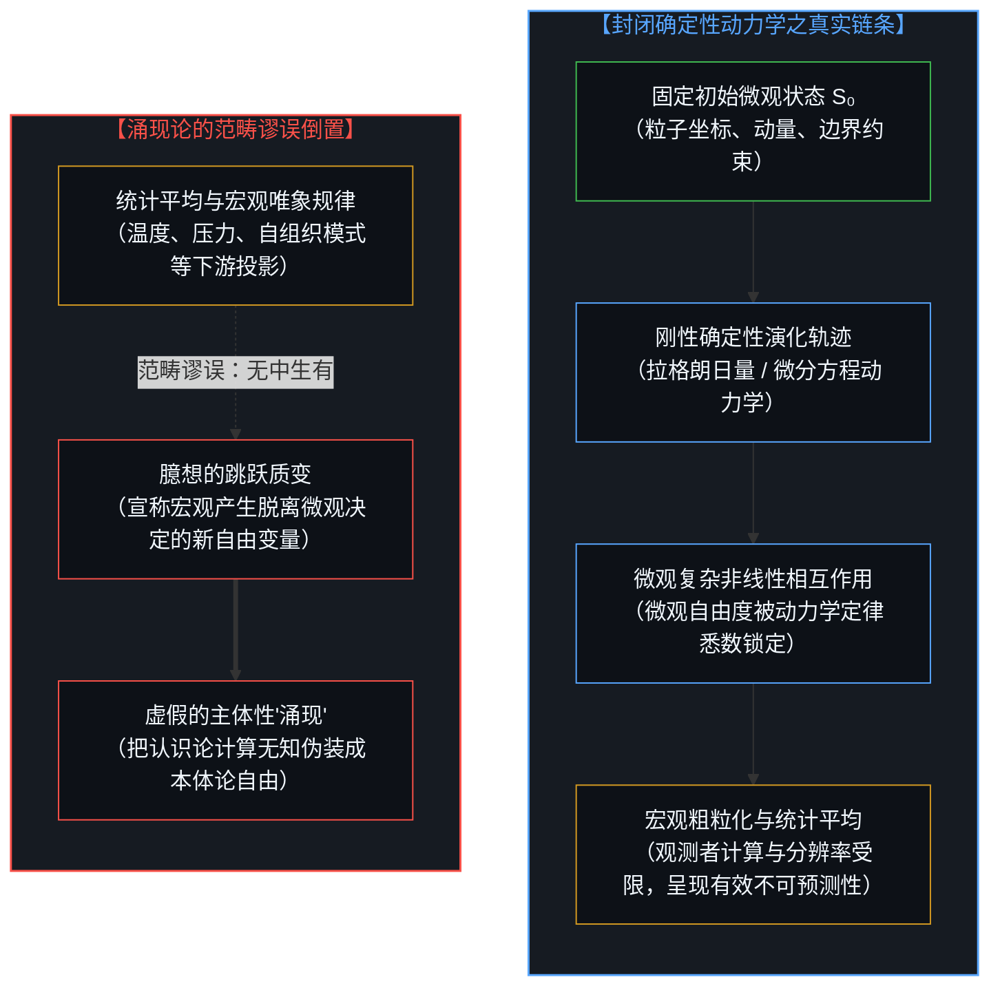
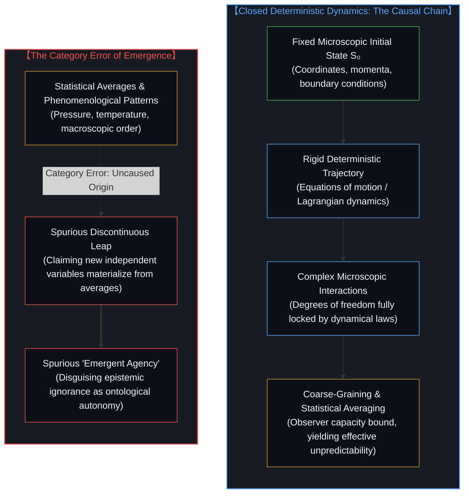
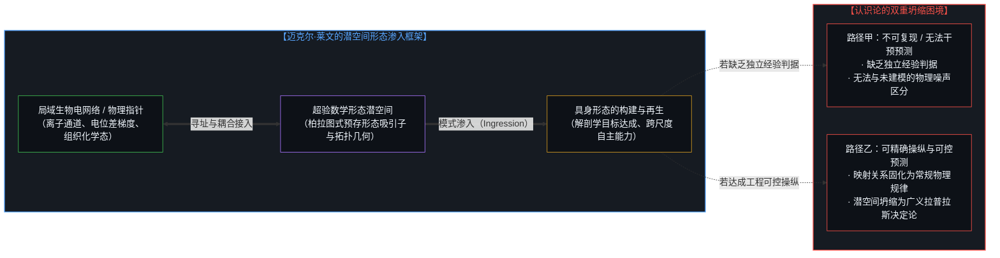
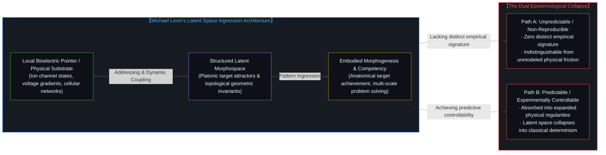
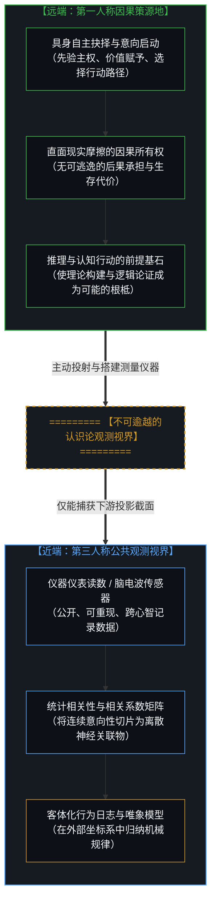
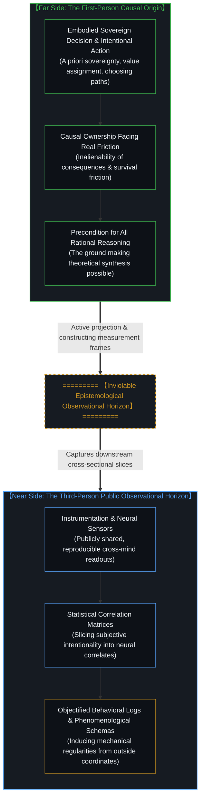
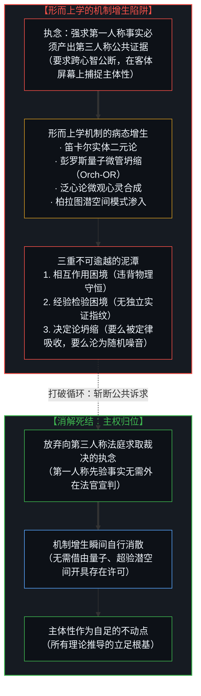
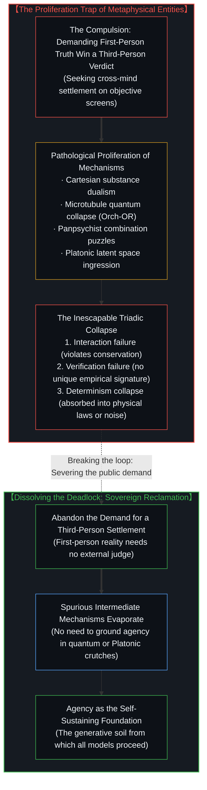
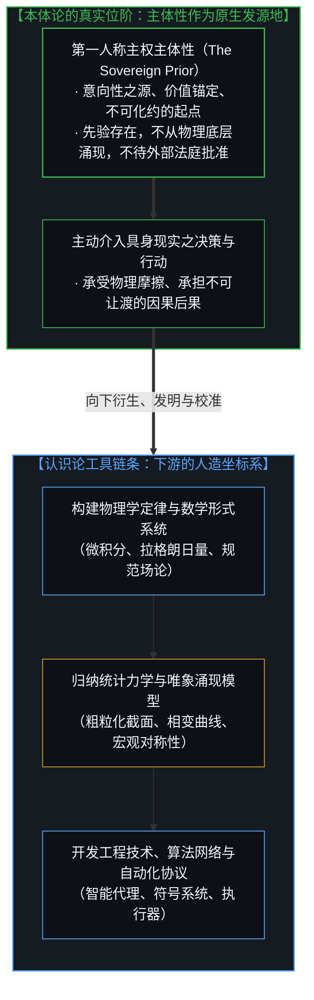
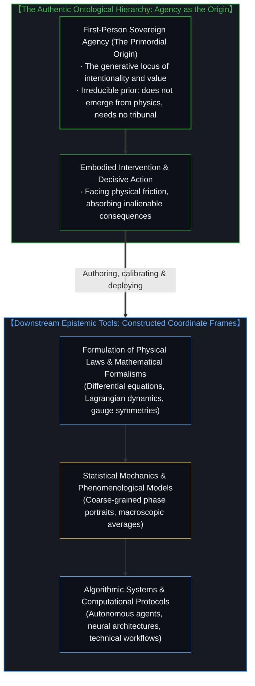

# 主体性不曾涌现 / Agency Does Not Arise

*涌现的范畴谬误、潜在空间渗入与第一人称先验起点 / The Category Error of Emergence, Ingressed Latent Spaces, and the First-Person Prior*

任何确定性封闭系统皆无法在宏观粗粒化中生成真正的独立自由变量；当我们将迈克尔·莱文富有洞见的潜空间渗入模型追索至底，它依然无法摆脱向定律坍缩的宿命——因果律延展至第三人称观测视界之外，第一人称的主权直觉是理论的刚性约束而非待审判的公案。

Any closed deterministic system cannot generate genuine new independent variables at coarser scales; when Michael Levin’s conceptually rich framework of ingressed latent patterns is traced to its root, it inevitably collapses back into physical regularities—causality extends beyond the third-person horizon, making first-person agency an irreducible constraint on theory rather than a case waiting to win a cross-mind trial.

---

## 第一分部：封闭系统的因果铁律与“涌现”的范畴谬误 / Section I: The Iron Law of Closed Systems and the Category Error of "Emergence"

任何演化轨迹由初始条件与确定性定律所锁定的封闭动力学系统，皆无法在粗粒化的宏观尺度上凭空生成真正独立的自由变量。统计力学与混沌理论所揭示的宏观不可预测性，仅仅源于观测者在信息获取与计算容量上的内在有限性。系统底层的微观动力学轨迹从头至尾由微分方程所限定，初态的微小差异在非线性迭代中被指数级放大，呈现出表象上的随机与繁复。然而，这种有效不可预测性属于认识论层面的无知，而非本体论层面的开放。由此可见，试图论证主体性、意向性或自由能动性如何从分子生物化学反应网络中“涌现”出来，或者从任何完备描述的第三人称动力学中破土而出，本身便构成了严重的范畴谬误。正如我们在 [涌现的伪因果与集体归因倒错](../yong-xian-de-wei-yin-guo-yu-ji-ti-gui-yin-dao-cuo/) 与 [复杂性遮蔽：涌现作为心智的投射](../complexity-obscures-emergence-as-the-act-of-mind/) 中所揭示的，在宏观层面上展现出来的所谓新秩序，充其量只是微观状态的下游统计平均，绝非自由能动的策源地。

当我们把复杂系统投射到高阶相空间时，粗粒化掩盖了微观层面的刚性链条，使得上层代理人看似具备了某种自主行动的能力。然而，若底层是一张严密合拢的机械因果网，那么上层的每一个宏观状态变迁，都不过是底层粒子坐标与动量演化的代数映射。把由观测盲区所造成的无法提前求解，偷换成系统内部孕育了摆脱因果链条的主体力量，是在概念的缝隙里安插虚妄的奇迹。正如在 [决定论是微观非决定论的统计特征](../determinism-is-the-statistical-signature-of-micro-indeterminism/) 中所阐明的，层级之间的跳跃改变的只是描述的紧凑度与压缩比，从未改变系统所包含的状态总自由度。因果的闭环在封闭体系内部是严丝合缝的铁律，任何指望通过增加微观反应层级来让“无意识的机械碰撞”孕育出“第一人称裁决意志”的设想，都在第一步就混淆了认知工具与能动实存。

Any closed dynamical system whose trajectory is locked by initial conditions and deterministic laws cannot generate genuine new independent degrees of freedom at coarser observational scales. The macro-level unpredictability illuminated by statistical mechanics and chaos theory stems purely from the bounded informational and computational capacity of the external observer. The underlying microscopic trajectory of the system remains rigorously constrained by the equations of motion; minute variations in initial micro-states are exponentially amplified across non-linear iterations, producing the superficial illusion of stochastic volatility. Yet this effective unpredictability is an epistemological limitation rather than an ontological opening. Consequently, the persistent attempt to demonstrate how agency, intentionality, or authentic freedom emerges from molecular chemistry, or from any fully specified third-person dynamics, represents an acute category error. As articulated in [Emergence as Pseudo-Causality and Collective Attribution Error](../yong-xian-de-wei-yin-guo-yu-ji-ti-gui-yin-dao-cuo/) and [Complexity Obscures: Emergence as the Act of Mind](../complexity-obscures-emergence-as-the-act-of-mind/), what manifests at the macroscopic boundary is downstream statistical averaging, never the generative fountainhead of sovereign agency.

When complex dynamical processes are projected onto higher-order phase spaces, coarse-graining masks the rigid micro-level causal continuity, producing the appearance of autonomous agentic action at the macroscopic tier. However, if the underlying base is an unbroken deterministic web, every macro-state transition remains an algebraic shadow of particle positions and momentum vectors. Conflating the observer's computational inability to solve equations ahead of time with the emergence of true ontological freedom within the system smuggles a miraculous leap into the conceptual apparatus. As demonstrated in [Determinism Is the Statistical Signature of Micro-Indeterminism](../determinism-is-the-statistical-signature-of-micro-indeterminism/), traversing structural strata shifts description length and compression ratios without introducing a single independent degree of freedom. Within a closed mechanistic domain, causal continuity is unbreakable; any attempt to bridge mindless mechanical collisions with first-person sovereign agency conflates interpretive representations with generative reality at the very first step.

---

## 第二分部：解构迈克尔·莱文的“潜空间渗入”：形式必然性与确定性的坍缩 / Section II: Deconstructing Michael Levin's "Ingression" Framework: Formal Necessity and the Collapse Back to Determinism

在当代生物学与认知科学的前沿，生物学家迈克尔·莱文（Michael Levin）所构筑的“潜在空间形态渗入”（ingression from structured latent space）模型，无疑展现出了远比达尔文主义盲目随机突变更为深邃的洞察力。莱文将生物形态的自我构建、再生与外生异构体（如异种机器人 Xenobots）的解剖学自主性，阐释为具身物理网络对高维潜在形态空间的“寻址”与“接入”。在这个框架中，解剖学模式的完备性与跨尺度适应能力，不再被贬低为随机噪声在生存压力下的侥幸留存，而是被视作源于某种类似柏拉图数学空间的形式必然性。生物体如同指向超验几何空间的指针，将潜在结构中早已存在的拓扑秩序“渗入”到具身分子聚合物之中。

然而，这套极具启发性的构想并未真正摆脱决定论的围困。哪怕我们假设存在一个高维、结构极其丰盈的数学潜空间，这个空间所供给的形式结构依然无法由局部的物理微观状态单独决定。在此处，该模型遭遇了认识论上的严苛考验：这一构想并没有提供任何独立的经验判据，能够将所谓“来自潜空间的渗入结构”，与“已知动力学法则尚未被穷尽求解的隐藏复杂性”在物理实操中区分开来。设若生物电网络对潜空间的调用具有规律性，能够被实验者精确观测、干预与复现，那么这套映射关系就会顺理成章地被吸收进更加广义、更完备的物理法则之中。

一旦物理网络与所谓潜空间形态的对应关系变得高度可靠并具备可预测的操纵性，那些曾经被冠以形而上学意蕴的“潜空间渗入”，便在瞬间脱去神秘的外衣，坍缩为新发现的系统动力学常量与守恒条件。正如在 [自由变量的同构与先验主权](../zi-you-bian-liang-de-tong-gou-yu-xian-yan-zhu-quan/) 与 [物理学不是律法，现实的摩擦才是](../the-sleight-of-hand-in-physics-is-the-law-and-the-friction-of-reality/) 中所指出的，凡是能够被形式系统严密闭合的因果回路，其自由度便已被先验剥夺。此时，“形态渗入”这一诗意表达不再代表某种跳出物理闭环的独立自由源泉，它仅仅成了描摹物理规律本身的另一套代名词。潜空间假设并未救出自由变量，反而以迂回的路径重新滑入了拉普拉斯式决定论的怀抱。

In the vanguard of contemporary biology and cognitive science, the conceptual architecture articulated by Michael Levin—positing the "ingression of patterns from a structured latent morphospace"—demonstrates far greater explanatory depth than crude neo-Darwinian stochasticity. Levin frames anatomical morphogenesis, regenerative competency, and the non-canonical morphologies of xenobots as physical cellular collectives navigating, addressing, and executing configurations within a high-dimensional latent space of shapes. Within this architecture, anatomical fidelity and morphological plasticity are not dismissed as fortuitous survival accidents; they are treated as mathematical necessities grounded in Platonic geometry. The physical cellular collective operates like a pointer or antenna, ingressing preexisting topological invariants from an abstract space into local biochemical substrates.

Yet this conceptually sophisticated proposal fails to escape the foundational constraint of determinism. Even if one posits an infinitely rich, structured Platonic latent space, the incoming structure is still unfixed by the local micro-state. Here lies the insurmountable epistemological hurdle: the framework provides zero independent empirical signatures capable of distinguishing an ingressed pattern originating in a metaphysical latent space from unanticipated complexity already latent within the dynamical evolution of known physical laws. If the correspondence between the bioelectric pointer states and observed anatomical forms achieves sufficient reliability to enable precise prediction, manipulation, and synthetic reprogramming, those mappings will simply be assimilated into an expanded, comprehensive formulation of physical law.

The moment the relation between bioelectric cues and anatomical phenotypes becomes predictable and reproducible, the poetic idiom of "ingression" surrenders its metaphysical novelty, collapsing into regular physical dynamics and conservation constraints. As established in [Isomorphism of Free Variables and A Priori Sovereignty](../zi-you-bian-liang-de-tong-gou-yu-xian-yan-zhu-quan/) and [Physics Is Not the Law, the Friction of Reality Is](../the-sleight-of-hand-in-physics-is-the-law-and-the-friction-of-reality/), any causal loop that can be closed by formal predictability has its genuine degrees of freedom foreclosed from the start. The rhetoric of latent spaces ceases to describe an uncaused wellspring of agency; it transforms into an alternate notation for lawful mechanics. Levin's latent space fails to rescue autonomous agency, circuitously delivering biological cognition straight back into the embrace of deterministic necessity.

---

## 第三分部：因果的不可消除性与第一人称视界之远端 / Section III: The Indelibility of Causality and the Far Side of the Observational Horizon

因果性是人类思维无法剪除的前提条件。试图通过论证去消除因果性的企图，从一开始就会瓦解论证行为本身的合法性。任何逻辑推理、演化推导或因果怀疑论的建构，都在不言自明地假定：前一个命题必须在因果意义上驱动后一个结论的有效性与可信度。若因果关系不存在，怀疑论者的喉舌便无法发出具有约束力的音节，所有的思辨便沦为无序电信号的随机涨落。因此，因果性不是物理学仪器在屏幕上读出的某项外在数据，而是使得“建立科学模型”这一行动成为可能的立足基石。

正因如此，我们必须将因果性的作用疆域延伸至第三人称观测视界的远端。现代科学范式习惯于将“可证实性”限定在能够跨心智复现的公共测量之内，然而这个公共视界本身是由第一人称心智在具体物理情境中所确立的人工边界。关于自由抉择、意向性主张与责任担当的第一人称体验，并非漂浮在物理网格之上的虚幻气泡，而是驻留在观测视界远端的原生实存。它拒绝被还原为第三人称探测器的读数，却在每一个行动抉择的瞬间提供着最为坚硬的真实反馈。正如在 [因果与不可化约的先验起点](../causality-and-the-irreducible-prior/) 与 [因果不可化约，物理学是从无处而来的视角](../causality-is-irreducible-the-physical-is-a-view-from-nowhere/) 中所深究的，物理学试图构想一种“从无处而来的上帝视角”，然而所有的科学观察站皆由具体的第一人称行动者亲手搭建。

第一人称主体性从不承担向法庭提交物证的举证义务；相反，它是所有理论建构必须尊重的刚性边界条件。任何宣称“人类自由是机械运作产生的神经幻觉”的理论体系，都必须面对致命的反讽：若提出该理论的学者自身毫无选择真理与谬误的主体自由，其发表的学术论文便只是其颅骨内原子碰撞的副产物，因而丧失了作为科学真理的资格。第一人称的先验直觉不是留待公断的悬案，它是理论必须服从的基准约束。

Causality cannot be excised from intellectual discourse without demolishing the rationality of the argument itself. Any rigorous demonstration, deduction, or skeptical interrogation presupposes that anterior premises causally compel posterior conclusions. If causal necessity is an illusion, the skeptic's critique dissolves into random thermodynamic fluctuations devoid of semantic force. Causality is not an empirical datum read off an oscilloscope; it is the inescapable constitutive precondition that allows scientific inquiry to occur in the first place.

Consequently, causality must be recognized as extending far past the perimeter of third-person instrumentation. Contemporary scientific methodology routinely identifies validity exclusively with public, cross-mind reproducibility. Yet that public horizon is itself an artificial perimeter constructed by conscious observers situated within concrete material environments. The primary telemetry of agency—the sovereign sense of choosing, resolving, and bearing consequences—lies on the far side of that observational boundary. It cannot be reduced to third-person pointer readings, yet it delivers the most unyielding feedback in every encounter with reality. As explored in [Causality and the Irreducible Prior](../causality-and-the-irreducible-prior/) and [Causality Is Irreducible: The Physical Is a View from Nowhere](../causality-is-irreducible-the-physical-is-a-view-from-nowhere/), physics frequently pretends to operate from a "view from nowhere," forgetting that every physical observatory is erected by an embodied first-person actor.

First-person agency does not carry the burden of producing an external certificate of authenticity in an empirical court. Rather, it operates as an inviolable boundary condition on all legitimate theorizing. Any theoretical system asserting that human intentionality is merely an epiphenomenal trick of molecular machinery succumbs to performative contradiction: if the theorist possess no sovereign capacity to distinguish truth from falsehood, their published monograph is merely the mechanical excretion of cranial physics, stripped of any claim to truth. First-person sovereignty is not a case waiting for external trial; it is the non-negotiable ground to which all valid models must conform.

---

## 第四分部：跨心智公断的死结与形而上学的机制增生 / Section IV: The Deadlock of Cross-Mind Verdicts and the Metaphysical Proliferation of Mechanisms

形而上学在过去数百年间陷入停滞与内耗，其根基恰恰在于思想家们偏执地要求：第一人称的实在性，必须向第三人称的公共法庭交出令所有旁观心智皆无法辩驳的验资报告。这种对“跨心智公断”（cross-mind verdict）的强求，犹如要求身处视界内部的引力奇点去向遥远的望远镜展示其几何形态。当第一人称的直接实存被剥夺了自足的地位，思想界便不得不开启无休止的“机制增生”，在心智与物理之间强行塞入各种臆想的中间齿轮。

从笛卡尔的心物实体二元论，到罗杰·彭罗斯试图在微管量子坍缩（Orch-OR）中寻找自由意志的隐秘缝隙；从谢尔德雷克的形态发生场假说，到将泛心论中的微观心灵碎片拼凑成宏观意识的生硬努力——所有这些精致的形而上学假说，都在同一组致命陷阱前撞得粉碎。其一是相互作用困境：若非物理实体能够作用于物理世界，它必将打破局域物理守恒定律，而实证仪器从未记录到这种凭空的动量泄漏。其二是经验检验困境：这类增生机制无法提供区别于常规未建模物理涨落的独特指纹。其三则是决定论坍缩困境：一旦假想的机制运作展现出规律性，它就会立即被收编为新的物理定律；若它展现为不可预测的随机性，它又立刻跌落为无序噪音，而噪音断然非意志。

只要思想者放弃向公共第三人称法庭求取裁决的执念，所有这些臃肿不堪的机制增生便会瞬间自行瓦解。第一人称事实无需任何外在审判者的许可，更不必依赖量子微管或神秘潜空间来为自己的存在开具介绍信。正如在 [意识从不作为数据出现在数据之中](../consciousness-never-appears-as-data-among-data/) 与 [自由的测不准](../zi-you-de-ce-bu-zhun/) 中所论述的，自由度因其先验性而无法在客体化测量中被捕获。放下公共审判的虚荣，主体性便从解释的受审席回归为观察的立足点。

The protracted stagnation of metaphysics across recent centuries stems directly from an unyielding compulsion: the demand that first-person reality must submit an irrefutable certificate of authenticity to a third-person tribunal. Insisting upon a binding "cross-mind verdict" is akin to demanding that a gravitational singularity inside an event horizon present its geometrical contours to an astronomer's telescope. Once first-person experience is denied sovereign self-sufficiency, theorists are compelled into an endless proliferation of speculative mechanisms, inserting ad-hoc intermediate gears between mind and physical matter.

From Cartesian substance dualism to Roger Penrose's orchestrated objective reduction in microtubules (Orch-OR), from Sheldrake's morphic resonance to panpsychist attempts to amalgamate micro-qualia into macro-consciousness, every such speculative enterprise founder upon the same triadic trap. First, the interaction problem: any non-physical entity perturbing the physical domain violates conservation laws, yet instruments register no unauthorized momentum leakages. Second, the verification problem: none of these hypothesized mechanisms generates an empirical signature distinguishable from background noise. Third, the collapse to determinism: if the proposed mechanism operates with mathematical predictability, it is absorbed into physical law; if it operates randomly, it degrades into noise, and thermal noise is not agency.

The instant thinkers surrender the demand for a public third-person settlement, this burdensome proliferation of mechanisms evaporates. First-person sovereign agency requires no clearance from external observers, nor does it require quantum microtubule collapse or Platonic latent spaces to justify its existence. As demonstrated in [Consciousness Never Appears as Data Among Data](../consciousness-never-appears-as-data-among-data/) and [The Uncertainty Principle of Freedom](../zi-you-de-ce-bu-zhun/), freedom, being a priori, cannot be captured as an objectified trajectory. Relieved of the vanity of seeking public validation, agency vacates the defendant's dock and resumes its rightful role as the foundation of all observation.

---

## 第五分部：主体性是起点，其余皆为下游 / Section V: Agency Is the Beginning: Everything Else Is Downstream

主体性不曾涌现。它是万事万物的起点。第一人称事实是所有认知活动的发生场域，是每一个第三人称理论模型、物理定律公式与生物学架构所必须依赖的发源地。设若脱离了主体性的投射、定义与裁决，整部现代科学文献中的数学符号便只是无意义的墨水斑点。物理定律并非高悬于世界之上的超然立法者，而是有意识的心智为了在混乱的世界中有效导航而提炼出的坐标投影。工具与定律从不产生主体性，它们因主体性的存在而被召唤出场。

将主体性视作下游产物的迷思，在实践层面引发了严重的认知倒错。在当今自动化、大模型与算法盛行的时代，人们动辄试图将抉择与责任外包给计算网络，正如我们在 [任务的移交与后果的不可让渡](../the-delegation-of-the-task-and-the-inalienability-of-consequences/) 与 [协议的反置与因果闭环的噤声](../the-inversion-of-the-protocol-and-the-silencing-of-the-causal-loop/) 中所严厉警告的：任务可以任意移交，后果却永远无法让渡。把主体性降阶为物理机器的“突现属性”，为现代人推卸生存主权提供了看似体面的借口。然而，因果链条在具身摩擦面前是严丝合缝的闭环，自客体化的逃避丝毫不能阻断现实惩罚的降临。

扫清“涌现论”与“机制增生”的迷障，使我们不再徒劳地等待某个物理学或生物学实验室宣布“证明了自由意志的存在”。真正的自由不在等待公断的判决书里，而在每一次直面现实、设立约束、扣动扳机并承担后果的具身行动之中。主体性是不可动摇的原点；一切物理学、一切算法模型、一切宏观叙事，都不过是这个原点在探索宇宙时所留下的下游涟漪。

Agency does not arise. It is the beginning. The first-person fact is the generative locus of all cognitive activity, the indispensable origin upon which every third-person model, physical law, and biological abstraction depends. Divorced from subjective intentionality, value assignment, and judgment, the mathematical notations filling modern scientific archives degrade into meaningless ink marks. Physical laws are not cosmic sovereigns dictating existence from on high; they are coordinate projections distilled by conscious minds to navigate reality. Agency does not arise from these constructs; these constructs arise through agency.

Treating agency as an incidental downstream byproduct of mechanical forces engenders catastrophic practical delusions. In an era saturated with autonomous models and algorithmic bureaucracy, individuals increasingly attempt to delegate sovereign choices and liabilities to computational systems. As warned in [The Delegation of the Task and the Inalienability of Consequences](../the-delegation-of-the-task-and-the-inalienability-of-consequences/) and [The Inversion of the Protocol and the Silencing of the Causal Loop](../the-inversion-of-the-protocol-and-the-silencing-of-the-causal-loop/), tasks may be delegated without mechanical ceiling, but consequences remain permanently non-transferable. Demoting agency to an emergent glitch in deterministic machinery provides an alibi for avoiding responsibility, yet reality does not honor self-objectification. The causal loop remains closed; attempting to abdicate sovereignty cannot shield the actor from physical blowback.

Dispelling the illusions of emergentism and metaphysical mechanism inflation liberates us from awaiting an empirical lab endorsement of free will. Freedom is not ratified by external certificates of proof; it is enacted in every embodied encounter with friction, every dynamic constraint established, and every consequence sovereignly absorbed. Agency is the unassailable starting point. All physical equations, all algorithmic protocols, and all cosmological frameworks are merely downstream ripples cast by this primordial source as it navigates the real.

