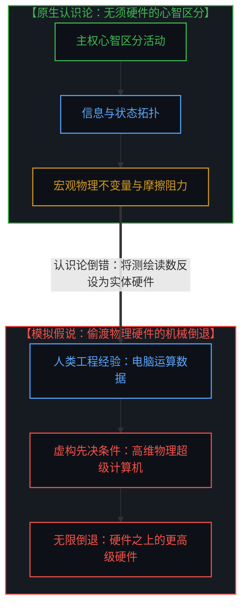
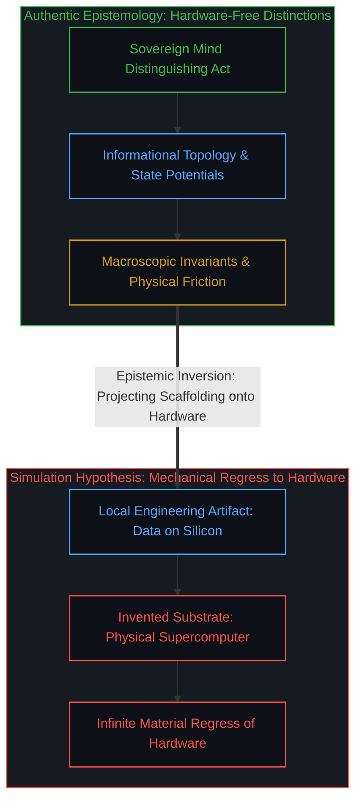
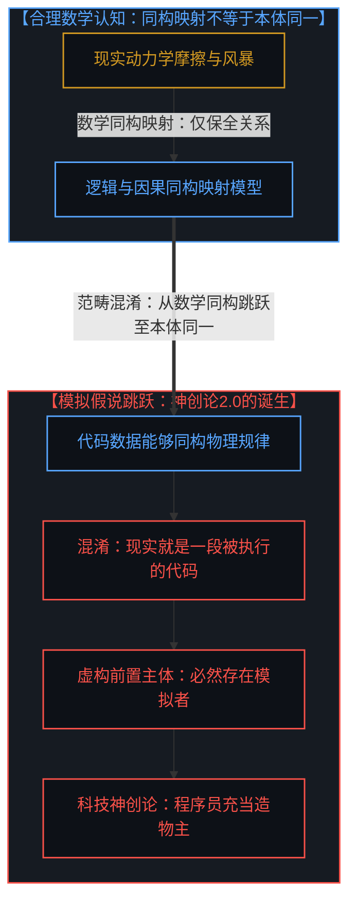
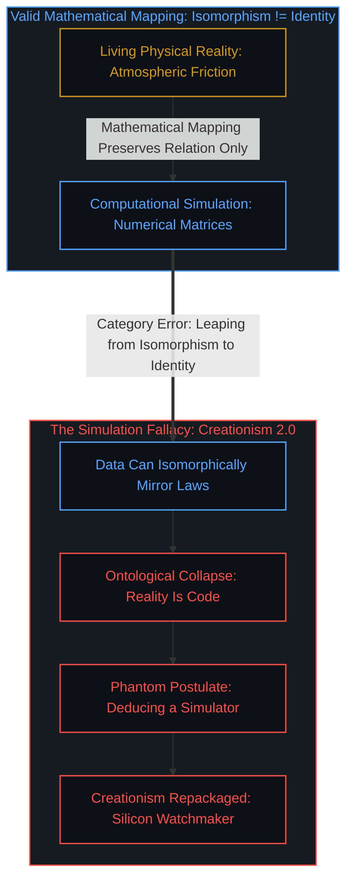
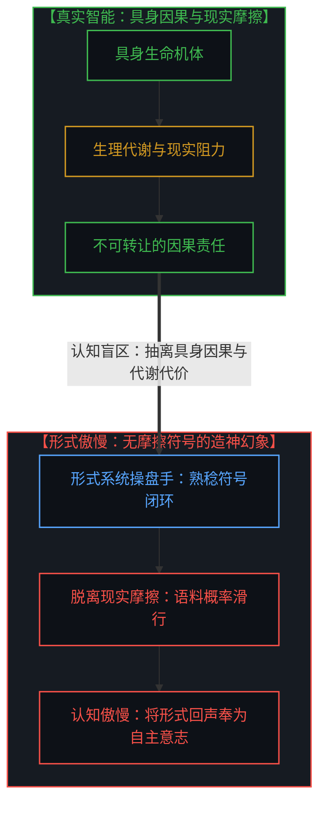
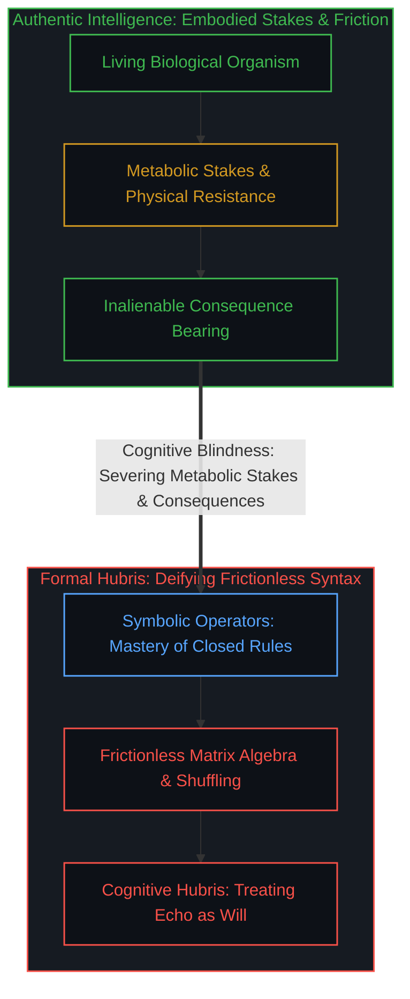
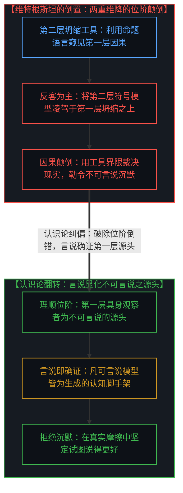
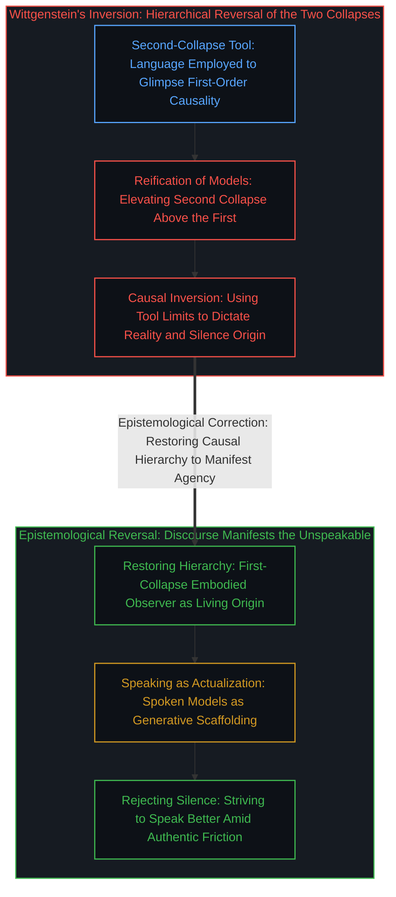
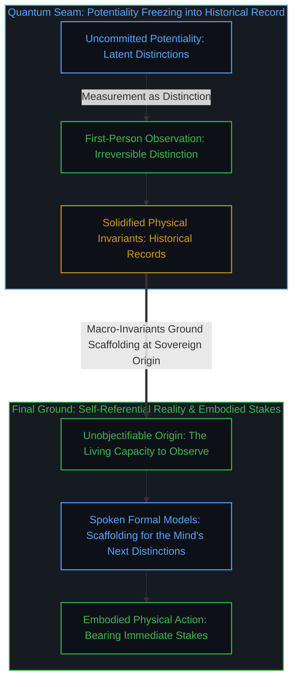

# 凡可言说皆不可言说之产物：模拟假说的同构谬误与形式系统的认知傲慢 / All That Can Be Spoken Is the Product of the Unspeakable: The Isomorphic Fallacy of the Simulation Hypothesis and the Cognitive Hubris of Formal Systems

*现实的信息属性无须物理超级计算机作为承载前提，混淆逻辑同构与本体同一导致了对“模拟者”的虚妄推设；不可言说非但不是某种客体之物，更恰恰需要通过言说来体现其存在，把观察产物误当本体并勒令源头沉默是认识论上的因果倒置。 / Reality's informational nature requires no physical supercomputer as an ontological host; conflating logical isomorphism with ontological identity breeds the phantom postulate of a 'simulator.' That which is unspeakable is no occult object, but realizes its existence precisely through speaking; mistaking observation for the substrate while silencing the observer is a profound causal inversion.*

当物理学在微观极限撞上量子相变，信息与物理的交界便显露无遗，但当代数字化思潮却习惯性地设想一台位于更高维度的物理超级计算机，将现实降格为机器内运算的数据流。这种模拟假说混淆了数学同构与本体存在，在逻辑滑坡中虚构出一个拟人化的模拟者，实质上是用硅基工程术语重演了十八世纪的钟表匠神创论。沉醉于封闭符号推演的形式系统操盘手由此滋生出认知的超级傲慢，误将无摩擦的语料重排当成主体意识的诞生，正如早年维特根斯坦因语言类型系统的表达局限而发生因果倒置，判定不可言说必须保持沉默。然而把观察产物错当本体、将不可言说物化，必然让主体沦为空洞幻影；不可言说恰恰需要通过言说来体现其存在，正如观察者必须通过观察来确证自身。凡可言说的模型皆由这项非物化的能力所生成，认知的正途不是神秘主义的失语，而是顺着真实的摩擦去不断说得更好。

## 第一重拆解：物理超级计算机的前提神话与唯物论的倒退 / First Cut: The Myth of the Physical Supercomputer and the Regress to Materialism

当代数字物理学与模拟假说在探讨世界由信息构成时，普遍伴随着一个未经审视的思维定势，即假定信息必须寄生在某种坚硬的硬件实体之上。这种直觉源于人类自身的工程制造经验，因为在人类的技术实践中，任何数据的流转都依赖于硅基芯片、电平翻转、金属导线与散热机房。于是，当理论家提出物理世界的基础是信息时，他们脑海中浮现的并不是未分化的因果流形，而是一台规模宏大的物理超级计算机，在不可知的实验室里昼夜不息地吐纳着模拟现实的代码。

这种推论不仅没有解释物理的起源，反而以极其隐蔽的方式退回到了机械唯物论的怀抱。如果承载我们这个宇宙信息的底层依然是一套由晶体管、电源与主板构成的物理机器，那么这台超级计算机的物理法则又源自何处，它所处的宇宙是否又需要另一台更高阶的计算机进行模拟。无限倒退由此不可避免地展开，理论家在丢弃了宏观物质实体的假定之后，又把物理硬件神化成了至高无上的先决条件，显示出心智在面对自身认知模型时的不自觉倒错，具体机制已在[无法逃逸的心智视界、两重维降与形式模型的反客为主](../one-cannot-escape-ones-own-mind/)中清晰指明。

信息在原初意义上从来不是物理硬件里的电压脉冲，而是心智进行自我区分与状态辨识的动态拓扑。现实之所以具有信息性，是因为区分活动从未停歇，每一次观察都在可能性的潜能中划出边界。物理世界中观测到的质量、惯性与时空几何，不是生产信息的母体机柜，而是这些递归区分在跨主体交互中凝结而成的宏观不变量与摩擦阻力。试图给信息寻找一台物理超级计算机，就像在自然重力之外非要寻找挂钩来悬吊整个地球，属于典型的范畴错置。

When theoretical physics collides with quantum phase transitions at the microscopic limit, the seam between the informational and the physical is laid bare. Yet contemporary digital thought routinely posits a higher-dimensional physical supercomputer, demoting reality to a computational data stream running inside unseen circuitry. This simulation hypothesis conflates mathematical isomorphism with ontological identity, sliding down a logical slope to fabricate an anthropomorphic simulator—re-enacting eighteenth-century watchmaker creationism under the guise of silicon engineering. Captivated by closed symbolic derivations, operators of formal systems cultivate an acute cognitive hubris, mistaking the frictionless rearrangement of tokens for the genesis of sovereign agency, much as early Wittgenstein inverted causality due to the expressive limits of language's type system and mandated silence. But mistaking the products of observation for the substrate and reifying the unspeakable reduces agency to a phantom; that which cannot be spoken realizes its existence precisely through speaking, just as an observer authenticates itself through observing. All speakable models are cognitive scaffolding generated by this unobjectifiable capacity. Epistemological rigor demands not mystical abdication, but striving to speak ever better amid the authentic friction of the living world.

Contemporary digital physics and the simulation hypothesis share an unexamined dogma: the assumption that information must reside upon some dense, physical hardware substrate. This intuition is a projection of human engineering practice, where data processing reliably depends on silicon wafers, transistor switching, conductive traces, and cooled server racks. Consequently, when theorists propose that the universe is informational at its base, their minds conjure not an unbroken causal manifold, but a physical supercomputer in an unknowable laboratory, computing the universe line by line.

This deduction explains nothing about the origin of the physical; instead, it retreats into mechanical materialism. If the substrate hosting our informational universe is itself a physical machine composed of processors and power supplies, what physical laws govern that supercomputer, and does its hosting universe require yet another higher-order computer to simulate it? An infinite regress unfolds. Having discarded macroscopic matter as the ultimate ground, theorists immediately re-deify physical hardware as an indispensable precondition—an inversion dissected in [One Cannot Escape One's Own Mind: Two-Fold Dimensional Collapse and the Reification of Formal Models](../one-cannot-escape-ones-own-mind/).

Information, in its primordial sense, is never a voltage spike inside a circuit board; it is the dynamic topology of the Mind distinguishing itself and identifying state transitions. Reality is informational because the distinguishing act never ceases; every observation draws a boundary across latency. The mass, inertia, and spacetime geometry observed in the macroscopic world are not server racks manufacturing information, but the macroscopic invariants and friction into which these recursive distinctions stabilize across interacting observers. Seeking a physical supercomputer to host information is like searching for a celestial hook in the sky to suspend the Earth—a category mistake born of local engineering projection.

## 第二重拆解：同构不等于同一，模拟假说何以沦为二十一世纪的科技神创论 / Second Cut: Isomorphism Is Not Identity—How the Simulation Hypothesis Becomes 21st-Century Creationism

模拟假说能够广泛传播，依赖于一种在形式推演中极其隐蔽的逻辑跳跃，那就是把因果或逻辑层面的同构性误判为本体的同一性。在数学和科学建模中，如果两个系统的状态演化规则能够建立一一对应的映射，它们便具有结构同构。现代气象学依靠流体力学偏微分方程和浮点数矩阵，能够高精度模拟暴雨和台风的行进路径，模拟程序中的数值演化与大气因果高度同构。然而，没有任何气象学家会据此断言，窗外正在倾泻的暴雨是一套运行在他人显卡上的渲染程序。

模拟假说的拥趸正是沿着这条逻辑滑坡坠入虚妄的。他们观察到心智对物理现象的数学刻画具备高度自洽的信息结构，同时发现人类编写的虚拟现实游戏同样具备自洽的代码结构，于是轻率地从“可以用数据同构现实”跳跃到了“现实本身必定由数据所构成”。由于在日常语言和工程经验中，“模拟”必然关联着执行模拟的行动者与控制台，他们便顺水推舟地虚构出一个置身于宇宙系统之外的模拟者。

这套叙事剥除掉前沿科技的华丽词藻后，暴露出的正是十八世纪自然神学钟表匠论证在硅基时代的换皮复刻。当年佩利看到怀表内部齿轮咬合精巧，断定世间必有一位超自然的钟表匠上帝；当代理论家看到物理常数精妙自洽，便断定高维空间必有一位敲击键盘的程序员。二者在认知模式上高度同步，皆因无法在第一人称具身因果中消化现实的自洽性，便向外寻求一个全知全能的外部实体来承接造物的职能。模拟假说自诩为对人类中心主义的深刻颠覆，实际上却表现出极其幼稚的自大，硬是将二十世纪局域工程所用的总线结构、时钟频率和内存寻址，当成了整个宇宙运行的立法宪章。

The widespread appeal of the simulation hypothesis relies on a deceptive sleight of hand within formal inference: mistaking causal or logical isomorphism for ontological identity. In mathematical physics, when the evolutionary equations of two disparate systems establish a bijective mapping, they share structural isomorphism. Modern meteorology deploys partial differential equations of fluid dynamics and floating-point matrices to forecast torrential rainfall with remarkable accuracy. The numerical evolution inside the computer is structurally isomorphic to the atmospheric mechanics outside. Yet no meteorologist leaps to the claim that the deluge drenching the windows is itself a graphical shader running on someone else's graphics card.

Proponents of the simulation hypothesis stumble along this very slope. Observing that the Mind's mathematical formalization of physical laws possesses an elegant informational structure, and noting that human video games also exhibit self-consistent code structures, they make an illicit leap: from "data can isomorphically mirror reality" to "reality must be an executed data stream." Because human engineering associates the word "simulation" with a human programmer sitting at a terminal, they slide further into positing a transcendent simulator beyond our universe.

Once stripped of modern techno-scientific veneer, this narrative exposes itself as eighteenth-century watchmaker creationism rebadged for the silicon era. When William Paley observed the interlocking gears of a pocket watch, he declared that an invisible artisan must have designed it; when modern theorists marvel at the fine-tuning of cosmological constants, they declare that a higher-dimensional programmer must be typing the code. Both share an identical cognitive weakness: unable to ground the self-consistency of reality within first-person embodied causality, they project outward an omniscient external entity to bear the burden of genesis. While the simulation hypothesis flatters itself as a radical challenge to anthropocentrism, it represents a parochial hubris: elevating the local bus architectures, clock frequencies, and memory addressing of twentieth-century computing into the cosmic constitution of existence.

## 第三重拆解：超级人工智能狂热与形式系统操盘手的认知傲慢 / Third Cut: The Super AI Frenzy and the Cognitive Hubris of Formal System Operators

这种用技术造物倒转来丈量世界源头的思维方式，在当下的超级人工智能狂潮中达到了顶峰。在此语境下谈论傲慢，并不是指涉个人的道德品行，而是指涉一种深层的认识论盲区。这种盲区高频发端于那些长期专注于操弄形式系统的专家群体之中。程序员、算法工程师与数理逻辑学家终日浸润在高度自洽的形式网络里，在这个由严密公理、编译规则与张量运算构成的闭环世界中，输入的指令能够获得精确的响应，算力的堆叠能够换来指标的飞跃。

当这套系统在海量语料上实现了流畅的统计重组时，符号工匠们不可避免地产生了一种幻觉，以为自己既然能够如此高效地调配形式投影，那么形式本身就已经超越了创造它的主体。他们看着神经网络内部高维向量的聚合离散，便急不可耐地宣称人工合成的主体性即将诞生。这种断言犯下的范畴错误，正是[主体性不可涌现](../agency-does-not-arise/)与[源头减除意识的戏法](../subtracting-consciousness-at-the-source/)所剖析的机制，即把人类活生生的意图与判断在统计语料中预先抹除，随后又将残留的文本痕迹当成崭新意志的证明。

形式系统之所以能展现出无所不能的推演能力，恰恰是因为它被剥离了具身的生理代谢与现实摩擦。人类心智所做出的每一个微小决断，都深深植根于有限的肉身寿命、能量消耗以及因果反馈的直接承受之中。判断之所以沉重且具备方向，是因为选择者必须用自己的存在去结算后果。相比之下，大型模型在高维空间中的文本生成是零生理成本的概率滑行，它并不对生老病死有任何体感，也无须为言论的真实震荡支付任何代价。把脱离了因果约束的符号流动误判为超越人类的高等智慧，是对智能维度的严重降级。

历史上每一次形式工具的爆发，都会伴随这种认识论狂热的周期性发作。十八世纪的分析力学家曾坚信拉普拉斯妖能够凭借牛顿方程通晓古今，二十世纪初的数理学派曾试图用形式公理封闭整个数学大厦，如今的深度学习阵营则将参数膨胀视为通往神明的阶梯。每一次狂热的终局都毫无例外地表明，无论脚手架搭建得多么宏伟精密，它都只是一套被心智调用的外化工具，断不可能反客为主演变为赋予万物以意义的源泉。

This inverted habit of mind—measuring the source of existence through technological artifacts—reaches its zenith in the contemporary fervor surrounding artificial general intelligence. Invoking hubris in this context implies no moral condescension; it diagnoses an acute epistemological blind spot. This blindness regularly afflicts those who specialize in manipulating formal systems. Programmers, mathematical logicians, and algorithm designers spend their lives immersed in self-contained syntactic loops. Within these closed regimes of formal axioms, compiler rules, and tensor multiplications, every input triggers an unambiguous response, and stacking compute yields measurable gains on benchmark leaderboards.

When such systems achieve fluid statistical permutations over oceanic human text corpora, formal system operators fall prey to an intoxicating illusion: believing that because they can orchestrate formal projections so adroitly, the formal system itself must have superseded the living Mind that engineered it. Watching high-dimensional vector embeddings cluster and diverge, they prematurely announce the imminent emergence of synthetic agency. This category error follows the exact mechanics unmasked in [Agency Does Not Arise: Why Autonomy Is Not a Threshold Property of Compute](../agency-does-not-arise/) and [Subtracting Consciousness at the Source: The Illusion of Artificial Agency](../subtracting-consciousness-at-the-source/): first subtracting living human intent and discernment from the corpus during data ingestion, and then declaring the remaining syntactic echo to be evidence of an autonomous sovereign will.

Formal systems demonstrate miraculous deductive velocity precisely because they are severed from metabolic constraints and physical friction. Every micro-decision of a living Mind is rooted in finite biological lifespan, metabolic expenditure, and the direct, non-transferable reckoning of physical consequences. A choice is weighty and directional because the chooser must settle the bill with their own existence. In contrast, text generation by neural networks is a frictionless slide across probability landscapes. It feels no organic vulnerability and pays no consequence for the real-world resonance of its tokens. To equate consequence-free syntactic juggling with higher intelligence is a severe degradation of the concept of mind.

Every historical explosion in formal tooling has provoked a similar bout of epistemological delirium. Eighteenth-century analytical mechanicians believed Laplace's demon could survey all time through differential equations; early twentieth-century formalists believed axiomatic systems could fully enclose mathematical truth; today's deep learning evangelists treat parameter expansion as a stairway to artificial godhood. The aftermath of each episode confirms without exception that no matter how intricate the formal scaffolding, it remains an external instrument wielded by sovereign minds, incapable of transmuting into the generative source that confers meaning.

## 第四重拆解：维特根斯坦类型系统的局限与对第7条命题的颠覆 / Fourth Cut: The Limits of Wittgenstein's Type System and Overturning Proposition 7

形式系统操盘手试图在符号堆中寻找心智的努力，与早期维特根斯坦在《逻辑哲学论》中对语言界限的审视构成了耐人寻味的对照。维特根斯坦曾断言“我的语言的界限意味着我的世界的界限”，并借用眼睛与视野的比喻指出主体是世界的界限而非世界的内容：正如在视野呈现出的全部景物中你找不到看视的眼睛，语言的命题世界里也找不到给出命题的主体。然而，这里的关键在于，维特根斯坦对语言的设定实质上是一套严格的形式化类型系统。在这个类型系统中，只有能够被经验事实验证的原子命题才被赋予合法的句法位置。

正是在这一点上，维特根斯坦的认识论发生了严重的范畴倒错。结合我们在[无法逃逸的心智视界、两重维降与形式模型的反客为主](../one-cannot-escape-ones-own-mind/)中所确立的两重维度坍缩架构，维特根斯坦在此处的操作机制便显露无遗：他实质上是在利用第二层维度坍缩之后生成的语言（形式类型系统）作为工具，去窥见第一层维度坍缩之后呈现出的因果关系与经验事实。然而，他未能将这两层坍缩的位阶与因果逻辑理顺。第二层坍缩所生产的语言符号与命题结构，本是第一层具身心智为了在现实中深化认知而搭建的形式脚手架；维特根斯坦却反客为主，将第二层的符号坍缩凌驾于第一层坍缩之上，反向用工具的表达边界来定义现实本身的界限。当他在面对人类深邃的内心世界、主体意志、价值判断与原初经验时，深切地体验到了这套语言类型系统在表达上的极端局限。然而，他没有认清这是二阶符号表达工具本身的位宽不足，反而倒果为因，误以为第二层工具的表达瓶颈就是第一层具身心智乃至现实本身的边界。

顺着这一倒错的前提，维特根斯坦在全书结尾做出的裁决——在著名的第7条命题中写下“对于不可言说之物，必须保持沉默”——绝非许多人所误解的知难而退，而是一场深刻的因果倒置。这种沉默判决在认识论上存在致命的因果翻转与本体错置。首先，所谓“不可言说之物”的概念在语词上就暗含了物化的假定：只要加上一个“物”字，语法便悄然预设了一个潜藏在暗处、具备客观轮廓却不可触碰的神秘客体。但那个源头绝非客体，它是心智正在进行对象化与区分的能力本身。语言之所以无法把它当成标本钉在展板上，不是因为它深奥莫测，而是因为工具无法把持握它的手对象化为自己的一个零件。

更深层的因果倒置在于：不可言说者首先不是物，而不可言说恰恰需要通过言说来体现自身的存在与意义。假若真的遵从沉默禁令，放弃一切言说，不可言说便立刻被剥夺了与世界交互的支点，沦为不可证伪、脱离现实的虚无缥缈之幻影。这正如观察者与观察行为的关系：观察者必须通过“观察”——即进行状态区分、测定读数、与环境发生摩擦——来确证自身的存在；假若放弃观察，观察者也就失去了存在的坐标与意义。然而，实证主义与机械唯物论的一大通病，恰恰在于发生本体错置：习惯性地将“观察”这一动态行为及其沉淀下的测量读数、数据模型当成了本体，反倒将正在进行观察的主体遗忘或抹杀。在语言哲学中，这种错置如出一辙：人们将言说生产出的符号体系与逻辑命题当成实在的基底；当这套衍生的类型系统无法反向容纳其创造者时，维特根斯坦非但不反思工具的从属性，反而下达禁令要求源头保持沉默。这无异于因为显微镜无法看到看视的眼睛，就命令眼睛必须闭上、停止看视。

要求不可言说保持沉默，等于迫使观察者放弃观察。这种沉默不仅无法守护主体，反而把主权心智放逐至虚无深渊，将现实拱手让给被错误当成本体的形式数据与符号幻象。真正的认识论突破恰恰在于翻转这一倒错：世上本无不可言说之物，只有正在进行对象化的观察者；凡可言说的一切形式系统、科学定律与哲学概念，皆是这项不可言说之能力的造物与脚手架。不可言说通过言说而显现，心智通过观察而确证。我们不应顺从沉默，因为沉默是对工具边界的懦弱妥协；我们应当认清语言作为进化工具的属性，立足真实的因果摩擦，坚定地试图说得更好。

The attempt by formal system operators to unearth agency within syntactic arrangements mirrors early Ludwig Wittgenstein's investigation into the limits of language in the *Tractatus Logico-Philosophicus*. Wittgenstein famously claimed, "The limits of my language mean the limits of my world," employing the metaphor of the eye and the visual field: just as the seeing eye is nowhere to be found within the visual field it beholds, the subject does not belong to the world, but is a limit of the world. Crucially, however, Wittgenstein framed language as a strict, propositional **type system**. Within this type system, only propositions that correspond to empirical states of affairs in physical space are permitted valid semantic coordinates.

Here lies Wittgenstein's profound category mistake. Integrating the two-fold dimensional collapse architecture established in [One Cannot Escape One's Own Mind: Two-Fold Dimensional Collapse and the Reification of Formal Models](../one-cannot-escape-ones-own-mind/), Wittgenstein's operational mechanism is laid bare: he employed language—the product of the second-order dimensional collapse (a formal type system)—as an instrument to glimpse the causal relations and empirical states of affairs generated by the first-order dimensional collapse. Yet he failed to untangle the hierarchy and causal order between these two collapses. The symbolic language and propositional network of the second collapse are merely cognitive scaffolding erected by the embodied Mind of the first collapse to deepen understanding. Wittgenstein, however, enacted the reification of formal models: he elevated the second-order collapse above the first, using the expressive boundaries of the derived tool to retroactively define and constrain reality itself. When confronting the immense interiority of the living Mind—volition, existential weight, aesthetic value, and immediate first-person awareness—Wittgenstein acutely experienced the expressive incapacity of his linguistic type system. Yet rather than diagnosing this as an inherent bottleneck of a second-order symbolic instrument, he inverted cause and effect: he mistakenly equated the expressive limitation of the second-order tool with the boundary of reality and the living Mind itself. The limitation does not lie within the inner world of the experiencing subject; it lies within the expressive bandwidth of language as a discrete type system. An externalized formal system can never exhaust the generative observing origin that formulated it.

From this inverted premise, Wittgenstein's concluding verdict in Proposition 7—"Whereof one cannot speak, thereof one must be silent"—is not a passive retreat as commonly supposed, but a profound epistemological inversion. This mandate of silence collapses under causal and ontological scrutiny. First, the very phrase "unspeakable thing" (不可言说之物) commits a covert act of reification: by appending the word "thing," grammar subtly smuggles in the assumption of an occult, bounded object hiding in darkness. But the observing origin is not an object; it is the living capacity to objectify and draw distinctions. Language cannot mount it on an exhibition board not because it is mystical, but because an instrument cannot turn the living hand that wields it into one of its own cogs.

The deeper causal inversion lies in the dynamic relation between speech and the unspeakable: that which cannot be spoken is not an object, and it realizes and validates its existence precisely through the ongoing act of speaking! If one complies with the mandate of silence and ceases speaking, the unspeakable is stripped of its causal anchor in reality, instantly demoted to a vacuous, ungrounded phantom. This directly parallels the relationship between the Observer and the Act of Observation: an observer authenticates its presence solely through observing—drawing distinctions, registering state transitions, and engaging environmental friction. Ceasing observation robs the observer of its coordinates and purpose. Yet classical scientism and naive materialism consistently commit an ontological displacement: habitually treating "observation"—the dynamic act and its fossilized readouts, data points, and models—as the primary substrate, while discarding or erasing the living Observer behind it. In the philosophy of language, the same displacement recurs: syntactic rules and logical propositions are crowned as ontological ground. When this derived type system inevitably fails to contain its living originator, Wittgenstein, rather than acknowledging the subservience of the tool, perversely inverts causality and demands that the source remain silent! This is no different from commanding the eye to shut and cease seeing simply because a microscope cannot resolve the eye that gazes through its lens.

Demanding that the unspeakable remain silent forces the Observer to abdicate observation. Far from safeguarding agency, this silence exiles the Mind into a metaphysical abyss, surrendering reality to formal tokens mistakenly deified as ontology. The true epistemological breakthrough overturns this inversion: there are no unspeakable things, only the living Observer engaged in objectification. All that can be spoken—every scientific theory, formal model, and syntactic architecture—is the generative product and evolving scaffolding of this capacity. The unspeakable manifests through speaking; the Mind authenticates itself through observing. We must refuse the surrender of silence; recognizing language as an evolving instrument of inquiry, we stand within authentic friction and actively strive to speak better.

## 第五重落位：量子边界、不变量与具身因果的坐标原点 / Fifth Cut: The Quantum Seam, Macro-Invariants, and the Embodied Causal Origin

回到最开篇的直觉，量子效应在认知架构中的位置此时全然明朗。量子态并不是悬浮在虚空中的物理波包，而是心智在尚未做出具体区分时所持有的未决潜能。当观测介入，离散的区分被不可逆地确立，潜能瞬间固化为确定性的历史读数。量子边界之所以展现出测不准与波粒二象，不是自然界在故意躲避窥探，而是心智的递归自指触碰到了自身的最小分辨率步长。正如上一篇随笔关于潜无限的论述，测量行为永远无法消除最后一段非零步长，因为任何一把度量边界的尺子，都无法丈量自身刻度线条的宽度。

在这个自洽的拓扑中，既不需要一台虚构的超级计算机来提供算力，也不需要一个神创论的模拟者来维持刷新。信息是心智区分的活生生展开，物理是这种展开在多方观测中沉淀下的稳定摩擦。二者从来不是二元对立的两个平行实体，而是动词与名词、活动与记录的相变转化。试图在信息之外安插物理主机，或是在语言之外安排不可言说的神秘禁区，皆是心智未能看清自身认知机制时产生的病态增生。

说得更好的真正含义，是清醒地认识到概念与模型的脚手架属性。在日常与科研中，我们自如地使用物理定律、数学方程与统计算法去辨识环境、改造世界，这正是心智对象化能力的伟大体现。在此处，我们尤需明确“说得更好”的终极旨归：试图说得更好，从来不是为了博取其他心智的认可或掌声，而是为了作为心智自身进行下一次区分时更加坚实、清晰的基石。这一基石，首先且核心地服务于本心智自身的认知演进与行动立足；其次，才是任何愿意借用它作为脚手架的其他心智，但那在认识论位阶上始终是次要的衍生效应，在主权心智的坐标原点前甚至可有可无。我们不把脚手架当成压制生命主权的牢笼。无论形式系统如何膨胀，代码如何精进，行动的因果矢量永远只能从立足于物理摩擦中的具身心智出发。守住第一人称的坐标原点，看清一切言说皆为主权能力的造物，心智便能走出模拟论与技术神话的迷障，在现实的大地上沉着地迈出每一步。

Returning to our opening intuition, the exact structural place of quantum phenomena within cognitive architecture becomes unmistakable. Quantum states are not ethereal wave packets vibrating in a cosmic vacuum; they represent the uncommitted potentiality held by the Mind prior to drawing a concrete distinction. When observation intervenes, a discrete distinction is irreversibly enacted, solidifying latency into an indelible historical record. That quantum boundaries exhibit indeterminacy and complementarity is not nature playing hide-and-seek; it marks the self-referential horizon where the Mind encounters its own fundamental step size. As established in our potential infinity analysis, measurement can never eliminate the final non-zero step size, because no ruler can measure the thickness of its own graduation lines.

Within this self-contained topology, there is no need for a mythical supercomputer to supply compute, nor a demiurgic simulator to refresh the universe. Information is the ongoing unfolding of distinctions drawn by sovereign minds; physics is the persistent friction stabilized across intersubjective observations. They are not two parallel substances engaged in Cartesian struggle, but phase transitions between verb and noun—between the living act of distinguishing and the macroscopic record left in its wake. Attempting to anchor information to a cosmic hardware rig, or walling off an unspeakable mystical sanctuary beyond language, are pathology symptoms born of the Mind's failure to recognize its own cognitive operations.

To speak better means recognizing concepts and formal models as temporary scaffolding. In daily life and scientific inquiry, we freely employ physical laws, mathematical equations, and statistical algorithms to interact with our surroundings and transform the world. This capacity is the crowning triumph of the Mind's power to objectify. Crucially, the ultimate aim of striving to speak better is never to solicit external approval, consensus, or applause from other minds; rather, it is to forge a firmer, more articulate foundation for the Mind's own subsequent distinctions. This bedrock serves, first and foremost, the sovereign Mind's own cognitive evolution and embodied footing; secondarily, it is offered to any other minds willing to adopt it as cognitive scaffolding. But that external adoption remains a secondary, contingent byproduct—ultimately dispensable before the primacy of the first-person origin. We must never turn scaffolding into an existential prison that diminishes the living knower. No matter how vast formal systems expand or how exquisitely algorithms perform, the causal vector of intentional action originates exclusively from an embodied Mind rooted in physical friction. Holding firm to this first-person origin, and understanding that all that can be spoken is the creation of sovereign agency, the Mind dissolves the illusions of simulation and technical myth, walking forward with clarity upon the solid earth of reality.

