# 凡可言说皆不可言说之产物：模拟假说的同构谬误与形式系统的认知傲慢 / All That Can Be Spoken Is the Product of the Unspeakable: The Isomorphic Fallacy of the Simulation Hypothesis and the Cognitive Hubris of Formal Systems

*现实的信息属性无须物理超级计算机作为承载前提，混淆逻辑同构与本体同一导致了对“模拟者”的虚妄推设；真正不可言说的从来不是某种神秘之物，而是赋予一切形式以意义的对象化能力本身。*

当物理学在微观极限撞上量子相变，信息与物理的交界便显露无遗，但当代数字化思潮却习惯性地设想一台位于更高维度的物理超级计算机，将现实降格为机器内运算的数据流。这种模拟假说混淆了数学同构与本体存在，在逻辑滑坡中虚构出一个拟人化的模拟者，实质上是用硅基工程术语重演了十八世纪的钟表匠神创论。沉醉于封闭符号推演的形式系统操盘手由此滋生出认知的超级傲慢，误将无摩擦的语料重排当成主体意识的诞生，正如早年维特根斯坦将观察者当成世界不可触碰的界限而判定沉默。然而不可言说的从来不是某种躲在阴影里的客体，而是心智正在进行对象化与区分的活生生活动；凡可言说的模型皆由这项非物化的能力所生成，认知的正途不是神秘主义的失语，而是顺着真实的摩擦去不断说得更好。

## 第一重拆解：物理超级计算机的前提神话与唯物论的倒退

当代数字物理学与模拟假说在探讨世界由信息构成时，普遍伴随着一个未经审视的思维定势，即假定信息必须寄生在某种坚硬的硬件实体之上。这种直觉源于人类自身的工程制造经验，因为在人类的技术实践中，任何数据的流转都依赖于硅基芯片、电平翻转、金属导线与散热机房。于是，当理论家提出物理世界的基础是信息时，他们脑海中浮现的并不是未分化的因果流形，而是一台规模宏大的物理超级计算机，在不可知的实验室里昼夜不息地吐纳着模拟现实的代码。

这种推论不仅没有解释物理的起源，反而以极其隐蔽的方式退回到了机械唯物论的怀抱。如果承载我们这个宇宙信息的底层依然是一套由晶体管、电源与主板构成的物理机器，那么这台超级计算机的物理法则又源自何处，它所处的宇宙是否又需要另一台更高阶的计算机进行模拟。无限倒退由此不可避免地展开，理论家在丢弃了宏观物质实体的假定之后，又把物理硬件神化成了至高无上的先决条件，显示出心智在面对自身认知模型时的不自觉倒错，具体机制已在[无法逃逸的心智视界、两重维降与形式模型的反客为主](../one-cannot-escape-ones-own-mind/)中清晰指明。

信息在原初意义上从来不是物理硬件里的电压脉冲，而是心智进行自我区分与状态辨识的动态拓扑。现实之所以具有信息性，是因为区分活动从未停歇，每一次观察都在可能性的潜能中划出边界。物理世界中观测到的质量、惯性与时空几何，不是生产信息的母体机柜，而是这些递归区分在跨主体交互中凝结而成的宏观不变量与摩擦阻力。试图给信息寻找一台物理超级计算机，就像在自然重力之外非要寻找挂钩来悬吊整个地球，属于典型的范畴错置。

```mermaid
graph TD
    classDef default fill:#0d1117,stroke:#30363d,stroke-width:1px,color:#f0f6fc;
    classDef mind fill:#0d1117,stroke:#3fb950,stroke-width:1.5px,color:#3fb950;
    classDef failure fill:#0d1117,stroke:#f85149,stroke-width:1.5px,color:#f85149;
    classDef scaffold fill:#0d1117,stroke:#d29922,stroke-width:1.5px,color:#d29922;
    classDef model fill:#0d1117,stroke:#58a6ff,stroke-width:1.5px,color:#58a6ff;

    subgraph S_True ["原生认识论：无须硬件的心智区分"]
        M1["主权心智区分活动<br/>Living Distinguishing Act"]:::mind
        M2["信息与状态拓扑<br/>Informational Topology"]:::model
        M3["宏观物理不变量与摩擦<br/>Macroscopic Physical Invariants"]:::scaffold
        M1 --> M2 --> M3
    end

    subgraph S_Fallacy ["模拟假说：偷渡物理硬件的机械倒退"]
        F1["人类工程经验：电脑运行数据<br/>Human Engineering Experience"]:::model
        F2["虚构先决条件：高维物理超级计算机<br/>Mythical Physical Supercomputer"]:::failure
        F3["无限倒退：硬件之上的更高级硬件<br/>Infinite Regress of Hardware"]:::failure
        F1 --> F2 --> F3
    end

    style S_True fill:#161b22,stroke:#3fb950,stroke-width:1.5px,color:#3fb950
    style S_Fallacy fill:#161b22,stroke:#f85149,stroke-width:1.5px,color:#f85149
```

```mermaid
graph TD
    classDef default fill:#0d1117,stroke:#30363d,stroke-width:1px,color:#f0f6fc;
    classDef mind fill:#0d1117,stroke:#3fb950,stroke-width:1.5px,color:#3fb950;
    classDef failure fill:#0d1117,stroke:#f85149,stroke-width:1.5px,color:#f85149;
    classDef scaffold fill:#0d1117,stroke:#d29922,stroke-width:1.5px,color:#d29922;
    classDef model fill:#0d1117,stroke:#58a6ff,stroke-width:1.5px,color:#58a6ff;

    subgraph S_True_EN ["Authentic Epistemology: Hardware-Free Distinctions"]
        ME1["Sovereign Mind Distinguishing<br/>Living Self-Referential Act"]:::mind
        ME2["Informational Topology<br/>Potentiality of Distinctions"]:::model
        ME3["Physical Macro-Invariants<br/>Stabilized Friction & Geometry"]:::scaffold
        ME1 --> ME2 --> ME3
    end

    subgraph S_Fallacy_EN ["Simulation Hypothesis: Mechanical Regress to Hardware"]
        FE1["Local Engineering Artifact<br/>Computers Processing Data Streams"]:::model
        FE2["Invented Substrate Premise<br/>Higher-Dimensional Supercomputer"]:::failure
        FE3["Infinite Material Regress<br/>Hardware Explaining Hardware"]:::failure
        FE1 --> FE2 --> FE3
    end

    style S_True_EN fill:#161b22,stroke:#3fb950,stroke-width:1.5px,color:#3fb950
    style S_Fallacy_EN fill:#161b22,stroke:#f85149,stroke-width:1.5px,color:#f85149
```

## 第二重拆解：同构不等于同一，模拟假说何以沦为二十一世纪的科技神创论

模拟假说能够广泛传播，依赖于一种在形式推演中极其隐蔽的逻辑跳跃，那就是把因果或逻辑层面的同构性误判为本体的同一性。在数学和科学建模中，如果两个系统的状态演化规则能够建立一一对应的映射，它们便具有结构同构。现代气象学依靠流体力学偏微分方程和浮点数矩阵，能够高精度模拟暴雨和台风的行进路径，模拟程序中的数值演化与大气因果高度同构。然而，没有任何气象学家会据此断言，窗外正在倾泻的暴雨是一套运行在他人显卡上的渲染程序。

模拟假说的拥趸正是沿着这条逻辑滑坡坠入虚妄的。他们观察到心智对物理现象的数学刻画具备高度自洽的信息结构，同时发现人类编写的虚拟现实游戏同样具备自洽的代码结构，于是轻率地从“可以用数据同构现实”跳跃到了“现实本身必定由数据所构成”。由于在日常语言和工程经验中，“模拟”必然关联着执行模拟的行动者与控制台，他们便顺水推舟地虚构出一个置身于宇宙系统之外的模拟者。

这套叙事剥除掉前沿科技的华丽词藻后，暴露出的正是十八世纪自然神学钟表匠论证在硅基时代的换皮复刻。当年佩利看到怀表内部齿轮咬合精巧，断定世间必有一位超自然的钟表匠上帝；当代理论家看到物理常数精妙自洽，便断定高维空间必有一位敲击键盘的程序员。二者在认知模式上高度同步，皆因无法在第一人称具身因果中消化现实的自洽性，便向外寻求一个全知全能的外部实体来承接造物的职能。模拟假说自诩为对人类中心主义的深刻颠覆，实际上却表现出极其幼稚的自大，硬是将二十世纪局域工程所用的总线结构、时钟频率和内存寻址，当成了整个宇宙运行的立法宪章。

```mermaid
graph TD
    classDef default fill:#0d1117,stroke:#30363d,stroke-width:1px,color:#f0f6fc;
    classDef mind fill:#0d1117,stroke:#3fb950,stroke-width:1.5px,color:#3fb950;
    classDef failure fill:#0d1117,stroke:#f85149,stroke-width:1.5px,color:#f85149;
    classDef scaffold fill:#0d1117,stroke:#d29922,stroke-width:1.5px,color:#d29922;
    classDef model fill:#0d1117,stroke:#58a6ff,stroke-width:1.5px,color:#58a6ff;

    subgraph S_Isomorphism ["合理数学认知：同构映射不等于本体同一"]
        I1["现实动力学摩擦<br/>Atmospheric/Physical Reality"]:::scaffold
        I2["逻辑与因果同构映射<br/>Isomorphic Formal Model"]:::model
        I1 -.->|"数学映射<br/>Mapping"| I2
    end

    subgraph S_Collapse ["模拟假说跳跃：神创论2.0的诞生"]
        C1["代码能够同构规律<br/>Software Mirrors Law"]:::model
        C2["混淆：现实就是一段被跑的代码<br/>Conflating Model with Ground"]:::failure
        C3["虚设造物主：必然存在模拟者<br/>Inventing the 'Simulator'"]:::failure
        C4["神创论翻版：外星程序员敲键盘<br/>Watchmaker Creationism 2.0"]:::failure
        C1 --> C2 --> C3 --> C4
    end

    style S_Isomorphism fill:#161b22,stroke:#58a6ff,stroke-width:1.5px,color:#58a6ff
    style S_Collapse fill:#161b22,stroke:#f85149,stroke-width:1.5px,color:#f85149
```

```mermaid
graph TD
    classDef default fill:#0d1117,stroke:#30363d,stroke-width:1px,color:#f0f6fc;
    classDef mind fill:#0d1117,stroke:#3fb950,stroke-width:1.5px,color:#3fb950;
    classDef failure fill:#0d1117,stroke:#f85149,stroke-width:1.5px,color:#f85149;
    classDef scaffold fill:#0d1117,stroke:#d29922,stroke-width:1.5px,color:#d29922;
    classDef model fill:#0d1117,stroke:#58a6ff,stroke-width:1.5px,color:#58a6ff;

    subgraph S_Isomorphism_EN ["Valid Mathematical Mapping: Isomorphism != Identity"]
        IE1["Living Physical Reality<br/>Atmospheric Friction & Storms"]:::scaffold
        IE2["Computational Simulation<br/>Differential Numerical Array"]:::model
        IE1 -.->|"Mathematical Mapping<br/>Preserves Relation Only"| IE2
    end

    subgraph S_Collapse_EN ["The Simulation Fallacy: Creationism 2.0"]
        CE1["Data Can Isomorph Reality<br/>Formal Models Mirror Dynamics"]:::model
        CE2["Ontological Collapse<br/>Asserting Reality Is Data Stream"]:::failure
        CE3["Phantom Entity Construction<br/>Deducing the 'Simulator'"]:::failure
        CE4["Creationism Repackaged<br/>Silicon Watchmaker in the Sky"]:::failure
        CE1 --> CE2 --> CE3 --> CE4
    end

    style S_Isomorphism_EN fill:#161b22,stroke:#58a6ff,stroke-width:1.5px,color:#58a6ff
    style S_Collapse_EN fill:#161b22,stroke:#f85149,stroke-width:1.5px,color:#f85149
```

## 第三重拆解：超级人工智能狂热与形式系统操盘手的认知傲慢

这种用技术造物倒转来丈量世界源头的思维方式，在当下的超级人工智能狂潮中达到了顶峰。在此语境下谈论傲慢，并不是指涉个人的道德品行，而是指涉一种深层的认识论盲区。这种盲区高频发端于那些长期专注于操弄形式系统的专家群体之中。程序员、算法工程师与数理逻辑学家终日浸润在高度自洽的形式网络里，在这个由严密公理、编译规则与张量运算构成的闭环世界中，输入的指令能够获得精确的响应，算力的堆叠能够换来指标的飞跃。

当这套系统在海量语料上实现了流畅的统计重组时，符号工匠们不可避免地产生了一种幻觉，以为自己既然能够如此高效地调配形式投影，那么形式本身就已经超越了创造它的主体。他们看着神经网络内部高维向量的聚合离散，便急不可耐地宣称人工合成的主体性即将诞生。这种断言犯下的范畴错误，正是[主体性不可涌现](../agency-does-not-arise/)与[源头减除意识的戏法](../subtracting-consciousness-at-the-source/)所剖析的机制，即把人类活生生的意图与判断在统计语料中预先抹除，随后又将残留的文本痕迹当成崭新意志的证明。

形式系统之所以能展现出无所不能的推演能力，恰恰是因为它被剥离了具身的生理代谢与现实摩擦。人类心智所做出的每一个微小决断，都深深植根于有限的肉身寿命、能量消耗以及因果反馈的直接承受之中。判断之所以沉重且具备方向，是因为选择者必须用自己的存在去结算后果。相比之下，大型模型在高维空间中的文本生成是零生理成本的概率滑行，它并不对生老病死有任何体感，也无须为言论的真实震荡支付任何代价。把脱离了因果约束的符号流动误判为超越人类的高等智慧，是对智能维度的严重降级。

历史上每一次形式工具的爆发，都会伴随这种认识论狂热的周期性发作。十八世纪的分析力学家曾坚信拉普拉斯妖能够凭借牛顿方程通晓古今，二十世纪初的数理学派曾试图用形式公理封闭整个数学大厦，如今的深度学习阵营则将参数膨胀视为通往神明的阶梯。每一次狂热的终局都毫无例外地表明，无论脚手架搭建得多么宏伟精密，它都只是一套被心智调用的外化工具，断不可能反客为主演变为赋予万物以意义的源泉。

```mermaid
graph TD
    classDef default fill:#0d1117,stroke:#30363d,stroke-width:1px,color:#f0f6fc;
    classDef mind fill:#0d1117,stroke:#3fb950,stroke-width:1.5px,color:#3fb950;
    classDef failure fill:#0d1117,stroke:#f85149,stroke-width:1.5px,color:#f85149;
    classDef scaffold fill:#0d1117,stroke:#d29922,stroke-width:1.5px,color:#d29922;
    classDef model fill:#0d1117,stroke:#58a6ff,stroke-width:1.5px,color:#58a6ff;

    subgraph S_LivingMind ["真实智能：具身因果与现实摩擦"]
        L1["具身生命机体<br/>Embodied Organism"]:::mind
        L2["生理代谢与现实阻力<br/>Metabolic Friction & Stakes"]:::scaffold
        L3["不可转让的因果责任<br/>Inalienable Consequence Bearing"]:::mind
        L1 --> L2 --> L3
    end

    subgraph S_FormalHubris ["形式傲慢：无摩擦符号的造神幻象"]
        H1["符号操盘手：熟稔形式闭环<br/>Formal System Manipulators"]:::model
        H2["脱离现实摩擦：统计权重重组<br/>Frictionless Statistical Shuffling"]:::failure
        H3["认知傲慢：将回声奉为新神明<br/>Super Epistemological Hubris"]:::failure
        H1 --> H2 --> H3
    end

    style S_LivingMind fill:#161b22,stroke:#3fb950,stroke-width:1.5px,color:#3fb950
    style S_FormalHubris fill:#161b22,stroke:#f85149,stroke-width:1.5px,color:#f85149
```

```mermaid
graph TD
    classDef default fill:#0d1117,stroke:#30363d,stroke-width:1px,color:#f0f6fc;
    classDef mind fill:#0d1117,stroke:#3fb950,stroke-width:1.5px,color:#3fb950;
    classDef failure fill:#0d1117,stroke:#f85149,stroke-width:1.5px,color:#f85149;
    classDef scaffold fill:#0d1117,stroke:#d29922,stroke-width:1.5px,color:#d29922;
    classDef model fill:#0d1117,stroke:#58a6ff,stroke-width:1.5px,color:#58a6ff;

    subgraph S_LivingMind_EN ["Authentic Intelligence: Embodied Stakes & Friction"]
        LE1["Living Biological Agent<br/>First-Person Sovereign Mind"]:::mind
        LE2["Metabolic Stakes & Resistance<br/>Direct Physical Friction"]:::scaffold
        LE3["Inalienable Consequence Bearing<br/>Ground of Meaning & Agency"]:::mind
        LE1 --> LE2 --> LE3
    end

    subgraph S_FormalHubris_EN ["Formal Hubris: Deifying Frictionless Syntax"]
        HE1["Symbolic Operators<br/>Mastery over Closed Rules"]:::model
        HE2["Frictionless Matrix Algebra<br/>Uncommitted Next-Token Prediction"]:::failure
        HE3["Super Cognitive Blindness<br/>Mistaking Shadow for Generative Mind"]:::failure
        HE1 --> HE2 --> HE3
    end

    style S_LivingMind_EN fill:#161b22,stroke:#3fb950,stroke-width:1.5px,color:#3fb950
    style S_FormalHubris_EN fill:#161b22,stroke:#f85149,stroke-width:1.5px,color:#f85149
```

## 第四重拆解：维特根斯坦的视野之喻与对第7条命题的颠覆

形式系统操盘手试图在符号堆中寻找心智的努力，与早期维特根斯坦在《逻辑哲学论》中对语言界限的审视构成了耐人寻味的对照。维特根斯坦写下“我的语言的界限意味着我的世界的界限”，并极其清醒地指出了主体与世界的几何关系。主体并不属于世界，而是世界的一个界限。正如眼睛与视野的比喻，在视野呈现出的全部景物中，你无论如何也找不到那只看视的眼睛，视野中的任何特征都无法推导出它是被一只眼睛所摄入的。

当今的形式主义者面对由全人类文本铸成的高维视野，其盲目程度远甚于维特根斯坦的时代。他们在视野内部翻箱倒柜，试图把语言库里最高频的关联结构加冕为自我意识，却忘却了视野本身恰恰是那只未曾现身的眼睛所撑开的。数据、标记、命题与公式，皆是观察者落笔投下的阴影，在阴影构成的画卷中寻找光源本身，注定是徒劳无功的范畴倒错。

然而，维特根斯坦在洞察到这一点后，却在全书的终点做出了一个令人扼腕的退缩。他写下“对于不可言说之物，必须保持沉默”，将所有超出命题科学界限的生命意义、主体与价值全盘推入不可言说的神秘之境。这种判决在认识论上是不成立的，因为所谓不可言说之物的概念，在被命名的瞬间就暗中完成了物化的设定。只要用了一个物字，语法便悄然预设了一个潜藏在暗处、具备轮廓却无法触摸的神秘客体。

但那个源头绝非一个物，它是将万物进行对象化的能力本身，是正在进行的观察活动。语言无法把它作为标本钉在展板上，不是因为它深奥莫测，而是因为工具无法把持握它的手物化为自己的构件。如果因此陷入沉默，心智便会沦落为虚无主义的囚徒，要么任由形式主义者以言说的独占权剥夺主体的地位，要么在神秘主义面前放弃理性的权柄。真正的认识论突破在于看清：凡可言说的一切形式、理论与定律，皆是这项不可言说之能力的结晶与产物。我们不应保持沉默，而是应当凭借不断进化的脚手架，在现实摩擦中试图说得更好。

```mermaid
graph TD
    classDef default fill:#0d1117,stroke:#30363d,stroke-width:1px,color:#f0f6fc;
    classDef mind fill:#0d1117,stroke:#3fb950,stroke-width:1.5px,color:#3fb950;
    classDef failure fill:#0d1117,stroke:#f85149,stroke-width:1.5px,color:#f85149;
    classDef scaffold fill:#0d1117,stroke:#d29922,stroke-width:1.5px,color:#d29922;
    classDef model fill:#0d1117,stroke:#58a6ff,stroke-width:1.5px,color:#58a6ff;

    subgraph S_Wittgenstein ["维特根斯坦的局限：物化陷阱与神秘沉默"]
        W1["观察者是世界的界限<br/>Subject Is Limit of the World"]:::mind
        W2["误判为'不可言说之物'<br/>Misreified as 'Unspeakable Thing'"]:::failure
        W3["形而上学失语：必须保持沉默<br/>Proposition 7: Silence Fallacy"]:::failure
        W1 --> W2 --> W3
    end

    subgraph S_Reconstruction ["认识论翻转：凡可言说皆非物之产物"]
        R1["非物：对象化与观察能力本身<br/>Not an Object: The Ability to Objectify"]:::mind
        R2["一切可言说皆为其生成的脚手架<br/>All Spoken Is Its Generative Product"]:::scaffold
        R3["勇毅的认识论姿态：试图说得更好<br/>Active Striving to Articulate Better"]:::mind
        R1 --> R2 --> R3
    end

    style S_Wittgenstein fill:#161b22,stroke:#f85149,stroke-width:1.5px,color:#f85149
    style S_Reconstruction fill:#161b22,stroke:#3fb950,stroke-width:1.5px,color:#3fb950
```

```mermaid
graph TD
    classDef default fill:#0d1117,stroke:#30363d,stroke-width:1px,color:#f0f6fc;
    classDef mind fill:#0d1117,stroke:#3fb950,stroke-width:1.5px,color:#3fb950;
    classDef failure fill:#0d1117,stroke:#f85149,stroke-width:1.5px,color:#f85149;
    classDef scaffold fill:#0d1117,stroke:#d29922,stroke-width:1.5px,color:#d29922;
    classDef model fill:#0d1117,stroke:#58a6ff,stroke-width:1.5px,color:#58a6ff;

    subgraph S_Wittgenstein_EN ["Wittgenstein's Trap: Reification & Mystical Silence"]
        WE1["The Eye and the Visual Field<br/>Subject as the World's Limit"]:::mind
        WE2["Grammatical Reification<br/>Assuming an 'Unspeakable Thing'"]:::failure
        WE3["Philosophical Abdication<br/>Whereof One Cannot Speak, Silent"]:::failure
        WE1 --> WE2 --> WE3
    end

    subgraph S_Reconstruction_EN ["The Epistemological Reversal: All Spoken Is Product"]
        RE1["Not an Object (非物)<br/>The Living Capacity to Objectify"]:::mind
        RE2["Generative Scaffolding<br/>Formal Models Created by Mind"]:::scaffold
        RE3["Active Asymptotic Articulation<br/>Endeavoring to Speak Better"]:::mind
        RE1 --> RE2 --> RE3
    end

    style S_Wittgenstein_EN fill:#161b22,stroke:#f85149,stroke-width:1.5px,color:#f85149
    style S_Reconstruction_EN fill:#161b22,stroke:#3fb950,stroke-width:1.5px,color:#3fb950
```

## 第五重落位：量子边界、不变量与具身因果的坐标原点

回到最开篇的直觉，量子效应在认知架构中的位置此时全然明朗。量子态并不是悬浮在虚空中的物理波包，而是心智在尚未做出具体区分时所持有的未决潜能。当观测介入，离散的区分被不可逆地确立，潜能瞬间固化为确定性的历史读数。量子边界之所以展现出测不准与波粒二象，不是自然界在故意躲避窥探，而是心智的递归自指触碰到了自身的最小分辨率步长。正如上一篇随笔关于潜无限的论述，测量行为永远无法消除最后一段非零步长，因为任何一把度量边界的尺子，都无法丈量自身刻度线条的宽度。

在这个自洽的拓扑中，既不需要一台虚构的超级计算机来提供算力，也不需要一个神创论的模拟者来维持刷新。信息是心智区分的活生生展开，物理是这种展开在多方观测中沉淀下的稳定摩擦。二者从来不是二元对立的两个平行实体，而是动词与名词、活动与记录的相变转化。试图在信息之外安插物理主机，或是在语言之外安排不可言说的神秘禁区，皆是心智未能看清自身认知机制时产生的病态增生。

说得更好的真正含义，是清醒地认识到概念与模型的脚手架属性。在日常与科研中，我们自如地使用物理定律、数学方程与统计算法去辨识环境、改造世界，这正是心智对象化能力的伟大体现。但我们不把脚手架当成压制生命主权的牢笼。无论形式系统如何膨胀，代码如何精进，行动的因果矢量永远只能从立足于物理摩擦中的具身心智出发。守住第一人称的坐标原点，看清一切言说皆为主权能力的造物，心智便能走出模拟论与技术神话的迷障，在现实的大地上沉着地迈出每一步。

```mermaid
graph TD
    classDef default fill:#0d1117,stroke:#30363d,stroke-width:1px,color:#f0f6fc;
    classDef mind fill:#0d1117,stroke:#3fb950,stroke-width:1.5px,color:#3fb950;
    classDef failure fill:#0d1117,stroke:#f85149,stroke-width:1.5px,color:#f85149;
    classDef scaffold fill:#0d1117,stroke:#d29922,stroke-width:1.5px,color:#d29922;
    classDef model fill:#0d1117,stroke:#58a6ff,stroke-width:1.5px,color:#58a6ff;

    subgraph S_QuantumPhase_EN ["Quantum Seam: Potentiality Freezing into Historical Record"]
        QE1["Uncommitted Potentiality<br/>Wavefunction as Latent Distinctions"]:::model
        QE2["First-Person Collapse<br/>Irreversible Living Act of Distinction"]:::mind
        QE3["Solidified Physical Invariants<br/>Historical Consensus Traces"]:::scaffold
        QE1 -->|"Observation as Distinction"| QE2 --> QE3
    end

    subgraph S_EmbodiedCausality_EN ["Final Ground: Self-Referential Reality & Embodied Stakes"]
        CE1["Unobjectifiable Origin<br/>The Living Capacity to Observe"]:::mind
        CE2["Spoken Formal Models<br/>Generative Epistemological Scaffolding"]:::model
        CE3["Embodied Physical Action<br/>Bearing Immediate Living Stakes"]:::mind
        CE1 --> CE2 --> CE3
    end

    style S_QuantumPhase_EN fill:#161b22,stroke:#58a6ff,stroke-width:1.5px,color:#58a6ff
    style S_EmbodiedCausality_EN fill:#161b22,stroke:#3fb950,stroke-width:1.5px,color:#3fb950
```

