# 百万亿地平线之外 / Beyond the Hundred-Trillion Horizon

*热力学相变为文明撑开无界空间，而企业股权从来无法垄断全域外溢的社会剩余 / Thermodynamics unlocks an open horizon, yet equity never monopolizes the diffusing social surplus.*

当技术先锋断言商业航天企业的市值终将数个数量级超越当今人类整体经济产出时，舆论习惯将其归为狂想或创始人修辞。然而将这一命题置于热力学与宏观经济学的双重镜鉴之下，其方向性直觉具有严密的物理合理性：要使这一估值在逻辑上成立，前提必然是文明总分母实现了同等数量级的跃迁。从封闭行星系统跃迁至开放太阳系的热力学相变，注定释放超越当前地球产出数个数量级的真实财富，但去中心化网络中竞争模仿与价值耗散的内在机制，确保了绝大部分红利沉淀为全人类的福祉，企业股权所能截留的仅仅是相伴而生的微小残差。

When a technological pioneer asserts that a space exploration firm could eventually achieve a valuation orders of magnitude larger than Earth's contemporary economy, public commentary reflexively dismisses the claim as founder hyperbole. Yet when examined under the dual lens of thermodynamics and macroeconomic theory, the directional intuition carries rigorous physical grounding: for such a valuation to materialize coherently, the civilizational economic denominator must itself expand by multiple orders of magnitude. The thermodynamic phase shift from a closed planetary system to an open solar system will inevitably unleash real productive wealth orders of magnitude beyond current terrestrial output, while the decentralized mechanisms of competitive imitation and surplus dissipation ensure that the vast preponderance of that bounty diffuses into human living standards, leaving private corporate equity as a trailing residual.

## 一、 千万亿美元命题与历史分母的扩容 / 1. The Quadrillion-Dollar Premise and the Expanding Historical Denominator

评估这一断言的首要步骤，是审视当下基准数据的量级约束。当前人类全体社会的年度国内生产总值约为一百万亿至一百零五万亿美元，而全球累积的全部房产、资本品以及金融资产总财富，测算规模大约在四百五十万亿至五百万亿美元之间。声称单一商业实体的市值能够数个数量级凌驾于该基准之上，意味着其资本定价必须跨入千万亿美元乃至数万万亿美元的阶梯，即达到10¹⁵美元的数学量级。在传统金融分析与贴现现金流框架中，此类数字显得荒诞不经，甚至被视为脱离常识的算术游戏。

Assessing this assertion requires a disciplined examination of contemporary planetary baselines. Humanity's total annual gross domestic product presently hovers between 100 and 105 trillion dollars, while total global wealth—the accumulated stock of real estate, machinery, infrastructure, and financial instruments—is estimated around 450 to 500 trillion dollars. Suggesting that a single corporate enterprise could achieve a valuation orders of magnitude larger than that benchmark implies a market capitalization measured in quadrillions of dollars, scaling into the regime of 10¹⁵ dollars. Within conventional financial discourse and discounted cash flow modeling, such a projection appears mathematically nonsensical, routinely discarded as speculative theatre.

然而，若将视野拉长至人类上一次跨越重大地理边界的历史时刻，即大西洋航线的开拓，便会发现既有分母的局限性正是认知盲区的源头。根据经济史学家安格斯·麦迪森的经典重构，在公元1500年，以1990年国际元计量的全球年度总产出仅约为二千四百七十亿美元，其中美洲大陆的产出仅占全球总额的百分之三至百分之四，而由中国、印度以及西欧构成的旧大陆构成了几乎全部的经济产出。那时的全球人均收入维持在勉强糊口的数百美元区间，文明整体被束缚在低效的自给自足农业之中。

Yet expanding the observation window across five centuries to humanity's prior geographical leap—the opening of the Atlantic frontier—reveals that the apparent impossibility stems entirely from the confinement of the baseline denominator. According to economic historian Angus Maddison's historical reconstructions, total planetary output in 1500 AD measured approximately 247 billion dollars in 1990 international Geary-Khamis dollars. The entire Western Hemisphere contributed merely 3 to 4 percent of that aggregate, with the Old World—dominated by China, the Indian subcontinent, and Western Europe—accounting for virtually the entirety of recorded economic activity. Average per-capita incomes hovered in the low hundreds of dollars, rigidly pinned to subsistence agriculture.

时隔五百年，当今诸如苹果、微软或英伟达等头部科技企业，各自的股权市值已稳定在三万五千亿美元上下。单一现代企业的市值，已经是公元1500年全人类年度经济总产出的十倍以上。如果有人在公元1500年的塞维利亚或威尼斯港口预言，未来会出现一家私人实体的资本价值超过当时整个已知世界年产出的整整一个数量级，当时的银行家与王室学者必然会断定这违背了经验常理。这种预言在当时的静态分母下确实无法成立，但它之所以在今天成为跨越不同观察者皆可一致确认的宏观现实，是因为全球经济分母在五个世纪里实现了数百倍乃至上千倍的实体扩张。

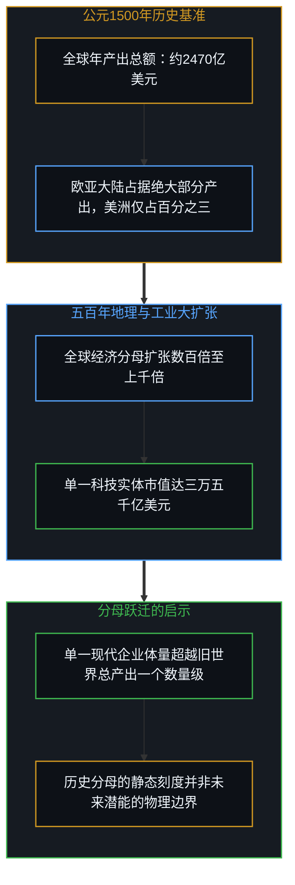

Five centuries later, leading technology enterprises such as Apple, Microsoft, and NVIDIA command individual market capitalizations hovering around 3.5 trillion dollars each. A single contemporary corporate firm is valued at more than ten times the entire annual economic output of 1500 AD humanity combined. Had an observer approached a merchant in Seville or a financier in Venice in 1500 AD and prophesied the existence of a private entity whose capital worth surpassed the annual throughput of the entire known world by an order of magnitude, the claim would have been dismissed as impossible under common experience. It was indeed inconceivable within the 1500 AD denominator; it materialized into an invariant macroscopic reality across observers only because the civilizational denominator expanded by hundreds of times over the ensuing centuries.

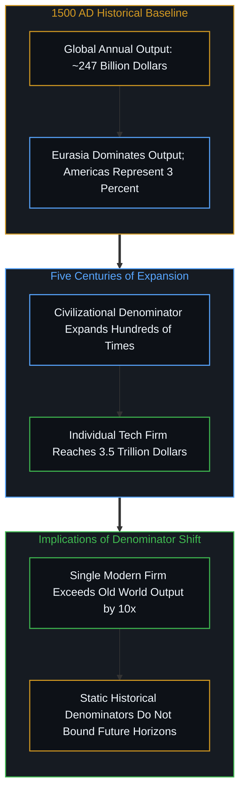

历史镜鉴在验证分母扩容潜力的同时，也给出了关键的审慎反思。大西洋新大陆的发现并未被任何单一商业联合体垄断，西班牙的西印度交易所与王室特许机构确立了早期的排他性通道，但后续累积的庞大财富由数以万计的竞争王权、商人网络与殖民定居者共同分散实现。即使是市值曾达数万亿美元峰值的荷兰东印度公司，其贸易核心依然处于远东香料航线，而非西半球边疆。此外，波托西银矿的白银流入在早期引发的是长达数十年的欧洲价格革命与货币贬值，直到产权制度演化与工业革命爆发，真实的生产力飞跃才全面兑现。

However, this historical mirror also introduces a vital corrective. The opening of the Americas was never captured or monopolized by a single corporate enterprise. Spain's Casa de Contratación and royal monopolies established early trade funnels, yet the vast compounding of wealth was distributed among competing sovereign crowns, merchant syndicates, and decentralized settlers. Even the Dutch East India Company, frequently cited for its peak speculative valuation reaching trillions of modern dollars, dominated Southeast Asian spice routes rather than the Atlantic hemisphere, eventually dissolving under administrative overhead and shifting trade. Furthermore, New World silver from Potosí initially triggered decades of European inflation during the Price Revolution; tangible compounding of per-capita prosperity arrived centuries later through institutional maturation and industrial mechanization.

## 二、 封闭系统与开放视界的热力学相变 / 2. The Thermodynamic Phase Shift from Closed Systems to Open Horizons

尽管大西洋边疆的比喻具有启发性，但若从物质与能量在认知模型中所映射的宏观摩擦来看，它甚至低估了太空边疆的真实势能。地理大发现只是对一个既有封闭行星系统的有限算术增量，美洲大陆为当时已知世界增加了大约百分之二十八的陆地面积，但人类活动依然被严密锁定在地球的封闭热力学边界之内，受制于有限的大气循环、稀缺的表层土壤、耗竭的矿产地壳，以及地表极为严苛的环境废热耗散约束。

Instructive as the Atlantic frontier analogy remains, when evaluated through the macroscopic friction of matter and energy mapped by cognitive models, it fundamentally understates the potential of outer space. The historical discovery of the Americas was merely a finite arithmetic addition to an already closed planetary system. The Americas expanded the known terrestrial land area by roughly 28 percent, but human civilization remained bound within Earth's closed thermodynamic envelope, constrained by a thin atmosphere, fragile topsoil, scarce crustal minerals, and severe ecological constraints on environmental heat dissipation.

与此相对，向地外太空的拓展是热力学维度的开放式相变跃迁。地球每年截获的太阳辐射能量仅约为1.7 × 10¹⁷瓦，不足太阳总辐射功率的二十亿分之一；而在太空中，太阳向全向立体空间持续倾泻高达3.8 × 10²⁶瓦的恒星辐射，近地轨道与深空探测器能够获得全天候无大气衰减的清洁能源供给。在物质丰度上，仅小行星带就储藏着大约3 × 10²¹千克易于开采的水冰、镍铁以及高纯度铂族金属。更关键的是，太空可以直接向2.7开尔文的宇宙微波背景辐射深空废热，为巨量工业加工与轨道算力提供了近乎无限的热沉空间。

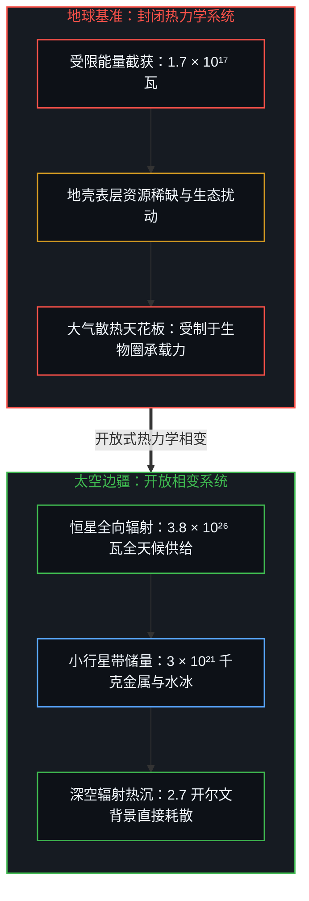

Space exploration, by contrast, constitutes an open thermodynamic phase shift. Earth intercepts merely 1.7 × 10¹⁷ watts of solar power, which represents less than one part in two billion of total solar output. In the open cosmos, the Sun emits 3.8 × 10²⁶ watts into surrounding space, accessible in orbit around the clock without atmospheric attenuation or weather disruptions. In material abundance, the asteroid belt alone contains roughly 3 × 10²¹ kilograms of accessible water ice, nickel-iron, and platinum-group minerals. Crucially, industrial activities in orbital space can radiate waste heat directly into the 2.7 Kelvin cosmic microwave background, providing an infinite thermodynamic heat sink for orbital foundries and massive computational clusters.

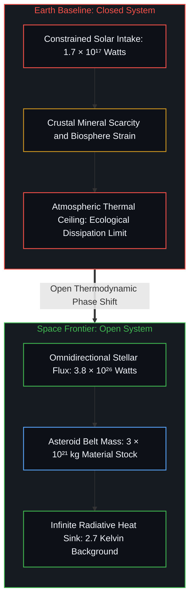

这种转变不是在原有地图边缘多画出一片新大陆，而是类似于生命从海洋爬向陆地的生态位飞跃。人类生产活动在地表环境中所遭遇的局部散热与资源约束，在太空维度被实质打开。从热力学模型对能量与物质通量的测算推导，一个依托太阳系深空能源与近地小行星物质运转的星际经济体，其真实的物理吞吐规模确实足以数个数量级凌驾于当今地球文明之上。

This transition is not equivalent to drawing another continent along the perimeter of an existing nautical map; it resembles the evolutionary leap of life transitioning from marine environments onto dry land. The localized thermal dissipation and resource constraints encountered on a planetary surface are fundamentally widened in orbital space. When modeled through thermodynamic flows of energy and matter, an interplanetary economy drawing on unattenuated solar radiation and asteroidal mass possesses a throughput capacity that naturally exceeds contemporary terrestrial output by multiple orders of magnitude.

## 三、 边疆运输的双重困局与离地价值悖论 / 3. The Dual Dilemma of Frontier Transport and the In-Space Value Paradox

物理维度的无界可能，并不意味着它能够顺畅折现为商业实体的资本估值。将宏伟的物理远景转换为现实经济流转时，必须正面撞上经济网络与主体博弈中极为严酷的拓扑约束。

Unbounded physical potential does not automatically translate into private financial equity. When converting cosmic physics into economic valuation, one immediately encounters formidable structural constraints defined by the topology of decentralized economic networks.

首先是边疆运输网络所面临的两难困境。如果外部产业生态的发展步调显著滞后于运力突破，航天企业将陷入买方缺位的绝境。假若地表没有足够多的机构具备资金与设备去建造轨道冶炼厂、太空计算数据中心或月面采矿基地，单一运力垄断者就无法通过提供发射服务捕获巨额现金流，它不得不耗尽自身资本去自建并运营全部下游工业链条，而这种全栈垂直整合的资本消耗迅速超越任何商业实体的承受极限。

The first tension appears in the structural dilemma of frontier transportation infrastructure. If the broader industrial ecosystem lags too far behind launch improvements, the pioneer confronts the buyer bottleneck. If terrestrial institutions lack the capital, robotics, and tooling to erect orbital foundries, space-based data clusters, or lunar extraction nodes, an orbital transport operator cannot harvest cash flows from launch contracts. It would be forced to internally capitalize, engineer, and operate every downstream segment itself—a degree of vertical integration that swiftly overwhelms corporate balance sheets.

反之，如果全球资本与下游产业链以极快速度跟进成熟，先锋企业又会遭遇十九世纪铁路网络所经历的轨道困局。横贯大陆铁路的铺设极大地释放了北美腹地的惊人财富，但铺设铁轨的承建商与运营商本身却在剧烈的运价恶性竞争、高额折旧以及周期性资本重组中深陷泥潭。铁路时代最持久、最庞大的财富积累，并没有留在铁轨铺设者的账面上，而是全额流向了那些搭乘铁路展开商业运作的参与者，造就了美孚石油、卡内基钢铁、大型零售网络以及沿线繁荣的城市地带。

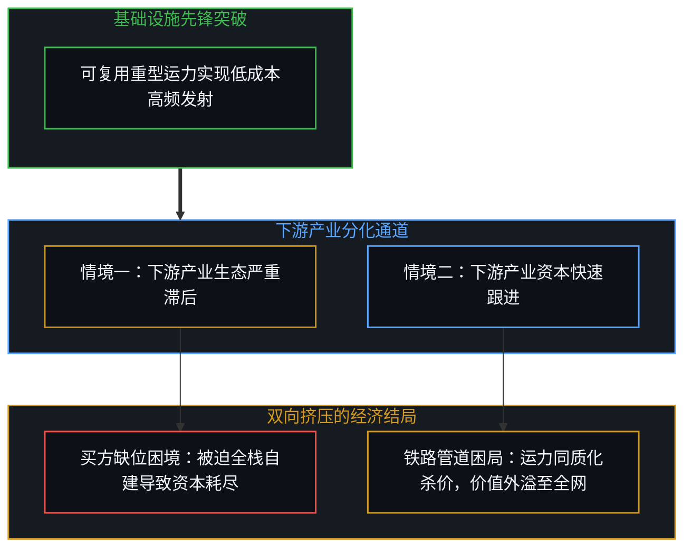

Conversely, if the rest of the industrial base mobilizes rapidly, the infrastructure builder runs directly into the nineteenth-century railroad dilemma. The transcontinental railroads unlocked the vast wealth of the American interior, yet the railroad operators themselves suffered savage price wars, rapid asset obsolescence, and serial bankruptcies. Enduring fortunes accrued not to the track-layers, but to those who rode the rails—fueling Standard Oil, Carnegie Steel, Sears Roebuck, and urban commercial centers.

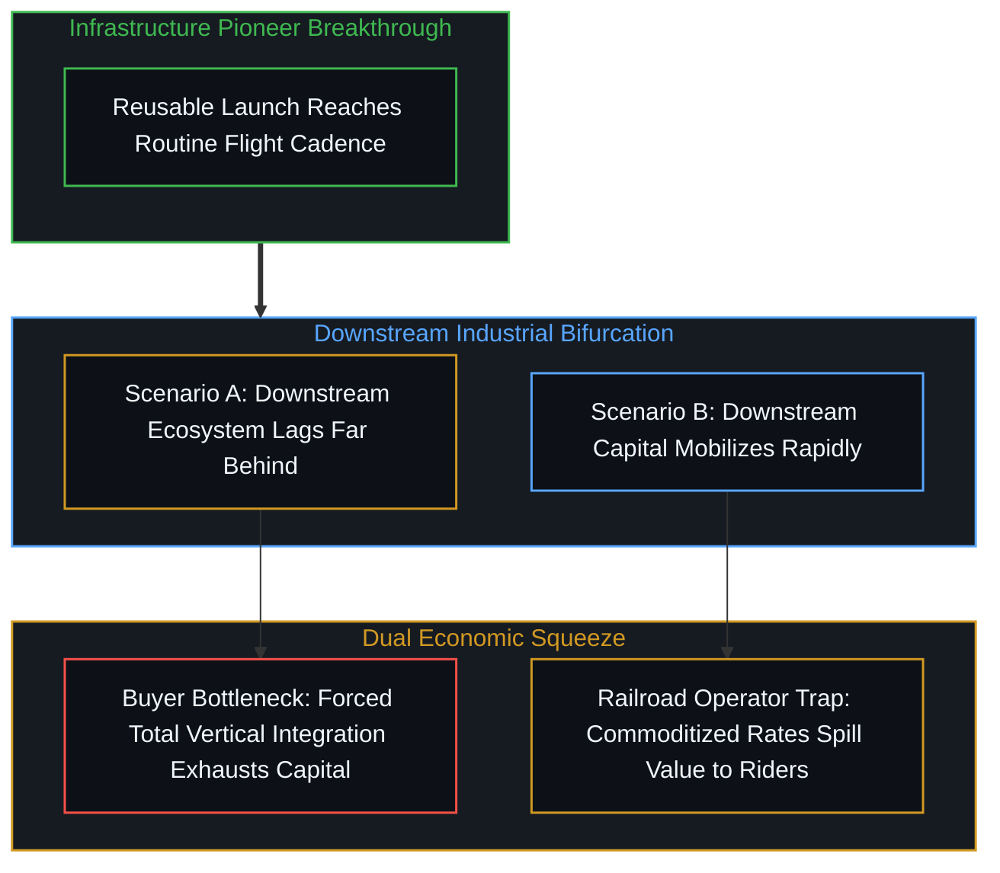

更具欺骗性的是媒体关于小行星开采的荒唐测算。诸如将灵神星等富金属小行星按照地体现货价格标定为万万亿美元的报道，犯下了常识性的经济学谬误。将数千万吨高纯度铂金、黄金或镍直接运送回地球重力井，唯一的后果就是瞬间击穿大宗商品市场的供需平衡，使地表贵金属价格毫无悬念地归零。地外物质与能源的真实经济价值，只有当它们被直接消耗在太空内部——用于建造在轨太阳能电站、深空通信阵列以及封闭生活穹顶时，才具备成立的支点。太空财富能够实体化的先决条件，是整个经济循环代谢本身完成了离地迁移。

Even more deceptive are popular valuations of asteroid mining. Media reports asserting that metal-rich asteroids like 16 Psyche are worth thousands of quadrillions of dollars based on current spot commodity quotes commit an elementary fallacy. Dropping millions of tons of platinum or gold down Earth's gravity well would instantly saturate supply, driving terrestrial spot prices toward zero. Off-world metals and energy realize authentic economic value only when consumed and processed in space—manufactured into orbital solar arrays, deep-space communication nodes, and orbital habitats. The wealth exists only to the extent that the economic metabolism itself relocates beyond the atmosphere.

## 四、 诺德豪斯定律与残差错配：将文明剩余误认为企业股权 / 4. Nordhaus's Law and the Residual Mismatch: Conflating Civilizational Surplus with Corporate Equity

拆解千万亿美元估值迷思的核心密钥，在于辨明重大技术创新所释放的社会总剩余与创新者自身所能捕获的私人资本权益之间的因果次序。正如关于[私人残差与社会剩余的因果次序](../the-causal-order-of-private-residuals-and-social-surplus/)的系统剖析所阐明的，任何财富在被大众享受之前，必须先由具体的生命心智在高度不确定的风险中下注开拓；然而一旦通道打通，全域竞争与市场扩散机制便会不可逆地将绝大部分成果分配给全体参与者。

The foundational key to resolving this valuation paradox lies in distinguishing the total social surplus unleashed by a major technological rupture from the private financial equity captured by the pioneer. As explored in [The Causal Order of Private Residuals and Social Surplus](../the-causal-order-of-private-residuals-and-social-surplus/), any surplus must physically be brought into being by living minds placing speculative wagers under intense environmental friction before it can exist; yet once operational channels are proven, competitive imitation and market dissipation inevitably transfer the overwhelming bulk of that bounty to downstream participants.

经济学家威廉·诺德豪斯在关于美国战后创新经济的里程碑式实证研究中，对技术进步所产生的剩余分配结构给出了严密的宏观统计测算。这一实证遥测清晰地表明，技术创新的先驱企业最终仅能以商业利润和股权增值的形式捕获全部经济盈余的百分之二点二左右，其余百分之九十七点八的巨大价值全数通过更低的价格、更丰富的选择与更高的真实生产力外溢给全体社会成员。这并非脱离主体的形而上学铁律，而是无数后续参与者自发模仿与竞争套利所涌现出的结构性不变量：在生产者留存份额与消费者外溢份额之间，形成了大致为一比四十五的稳定比例关系。在对数坐标下审视这一比例：以10为底的对数中，45的对数值约为1.65，即四十五倍的落差恰好对应着一点五至二个数量级的数学间距。

In his seminal empirical study on technological innovation within the postwar United States economy, Nobel laureate William Nordhaus provided rigorous macroeconomic telemetry quantifying how economic surplus distributes across innovation cycles. The empirical data demonstrated that pioneering innovators captured only roughly 2.2 percent of total social surplus in profits and corporate equity, with the remaining 97.8 percent passed through to consumers and downstream industries via lower prices, superior capabilities, and enhanced living standards. This ratio is not a metaphysical law from nowhere, but the emergent structural invariant of continuous imitation and competitive arbitrage by downstream minds: establishing a baseline ratio of roughly 1:45 between producer capture and social surplus, where 2.2 percent divided by 97.8 percent yields approximately 1 over 45. In logarithmic terms, the base-10 logarithm of 45 is approximately 1.65, meaning that a 45-fold factor corresponds precisely to 1.5 to 2 orders of magnitude.

深入的历史宏观数据为这一思考提供了清晰的参照坐标。根据经济史学测算，公元1500年全人类年度国内生产总值仅约二千四百七十亿美元，当今全球国内生产总值约为一百万亿美元，年化产出流扩张了约四百倍；而在资产存量端，公元1500年的全球存量总财富约为二千五百亿美元，当今全球存量总财富已达五百万亿美元，存量财富扩张了约两千倍。取年化产出流的四百倍扩张与存量资产财富的两千倍扩张之间的中位数，文明经济分母在过去五个世纪中实现了约一千倍的宏大跃迁。当以这一千倍的历史分母扩容中位数为基准审视诺德豪斯定律时，一个深刻的数学关系清晰浮现：在总分母扩张一千倍的宏观格局中，先驱创新企业即便仅仅截留其中百分之二点二的私人权益残差，该项残差的规模也将达到旧世界整体经济总量的整整二十二倍（1000 × 2.2% = 22）。公元1500年全人类经济总量的二十二倍，对应着约五万四千亿美元的资本估值；而审视当今现实，诸如苹果、微软或英伟达等头部科技巨头的市值已分别跨入三万五千亿至四万亿美元区间，相当于公元1500年全人类年产出的十四倍至十六倍，与二十二倍的理论基准高度贴近。这一历史参照清楚地表明，一家企业的市场资本定价数倍乃至数十倍于前一个文明纪元的经济总和，绝非荒诞无稽的算术幻觉，而是分母数量级跃迁下早已上演过的宏观常态。

Deep historical macroeconomic telemetry provides a disciplined reference point for this projection. According to economic historiography, total planetary annual gross domestic product in 1500 AD stood at approximately 247 billion dollars, whereas global GDP today hovers around 100 trillion dollars—a roughly 400-fold expansion in annual productive flows. Concurrently, accumulated global wealth grew from roughly 250 billion dollars in 1500 AD to approximately 500 trillion dollars today—a 2,000-fold expansion in accumulated asset stocks. Taking the median between this 400-fold expansion in annual output and the 2,000-fold expansion in accumulated wealth reveals an approximate 1,000-fold historical expansion in the civilizational economic asset denominator. Calibrating Nordhaus's findings against this 1,000-fold historical median reveals a striking mathematical formulation: within a 1,000-fold expanded denominator, a pioneering enterprise capturing strictly 2.2 percent of the new surplus realizes an equity valuation equal to 22 times the size of the previous global economy (1,000 × 2.2% = 22). Grounding this multiplier in empirical history demonstrates its precision: twenty-two times the 1500 AD global economy yields approximately 5.4 trillion dollars; today, leading technology enterprises such as Apple, Microsoft, and NVIDIA command market valuations between 3.5 and 4 trillion dollars each—representing 14 to 16 times the entire 1500 AD planetary output, remarkably close to the theoretical 22-fold benchmark. This historical calibration demonstrates that envisioning a corporate capitalization orders of magnitude larger than a prior civilization's total economy is not wild hyperbole, but an established macroeconomic pattern governed by denominator expansion.

更具决定性意义的是，将这一历史数学关系投射至太空前沿时，这一千倍的跃迁比例构成的仅仅是底线，而非上限。大西洋航海时代仅仅是在地球封闭的生物圈内部增加了美洲大陆约百分之二十八的陆地面积；而迈向太阳系则是一场打破封闭系统的热力学开放相变。太阳每秒辐射出3.8 × 10²⁶瓦特的恒星能源，小行星带蕴藏着数以亿亿吨计的高纯度工业矿藏，深空更提供了2.7开尔文的无限散热井。面对近乎无界的物理上行空间，一千倍的分母扩容是一个极为保守的基准底线。以当今地球一百万亿美元的经济产出为基准，二十二倍的乘数直接对应着两千二百万亿美元（2.2 × 10¹⁵美元，即两千二百万亿美元）的企业估值底线。先驱商业航天实体跨入千万亿美元的估值阶梯，并非脱离实际的狂想，而是在热力学相变下具有坚实历史与数学支撑的底线投射；与此同时，人类文明将顺理成章地承接其余百分之九十七点八的外溢红利，获得近千倍于当今地球体量、高达近千万亿美元（约97.8 × 10¹⁵美元）的文明总剩余。

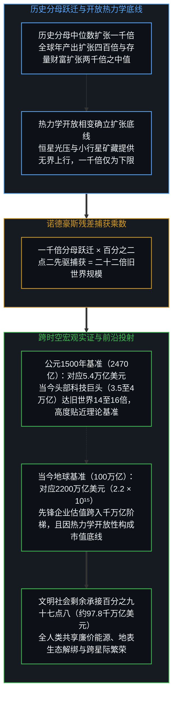

Decisively, when this historical mathematical relationship is projected onto the space frontier, that 1,000-fold expansion represents a conservative floor rather than an upper ceiling. The opening of the Atlantic frontier merely incorporated the Americas—a 28 percent increase in planetary land area confined entirely within Earth's closed biosphere. By contrast, expanding into the solar system represents an open thermodynamic phase shift: the Sun radiates 3.8 × 10²⁶ watts of raw energy, the asteroid belt holds quadrillions of tons of industrial ores, and cosmic vacuum provides an infinite 2.7-Kelvin thermal sink. Given this open thermodynamic upside, a 1,000-fold expansion of the civilizational denominator serves as a conservative baseline floor. Applying the 22-fold multiplier to today's 100-trillion-dollar terrestrial economy yields a corporate market capitalization floor of 2.2 quadrillion dollars (2.2 × 10¹⁵ dollars). A multi-quadrillion-dollar valuation for a pioneering space infrastructure enterprise is therefore a mathematically robust lower bound under open thermodynamic expansion, rather than ungrounded fantasy. Simultaneously, human society inherits the complementary 97.8 percent of the surplus, securing diffusing civilizational dividends scaling toward 97.8 quadrillion dollars.

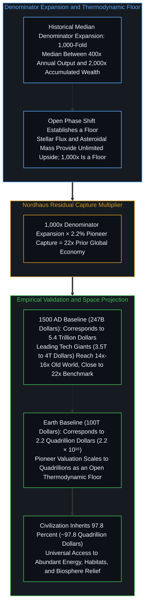

这正是逻辑连贯性所导出的深刻推论。若将太空边疆仅仅设想为一个年度产出与当今地球相当、或仅有十倍微小增量的局部市场，那么在诺德豪斯经典的百分之二点二捕获比例下，基础设施巨头的市值确实只能停留在数万亿至二十余万亿美元，难以跨入千万亿美元的阶梯。然而这种静态测算低估了热力学相变的历史尺度。将一千倍的分母扩容视作底线，意味着星际经济总分母将至少跨入一亿亿美元（10¹⁷美元）的宏大阶梯。在这样一个相变后的宏大分母中，先驱企业严格遵循诺德豪斯规律、截留百分之二点二的私人残差，其资本市值便自然跃升至两千二百万亿美元（2.2 × 10¹⁵美元）的水平。千万亿美元市值的数学逻辑之所以能够成立，其必要且充分的条件，绝非企业凭借强权垄断了整个宇宙，而是文明全域沉淀了高达近千万亿美元的外溢剩余；先驱企业的万亿估值，正是托举起数十万亿文明红利之后留在航道上的微小水花。

This is precisely the profound insight demanded by logical coherence. If one unimaginatively models the space economy as a marginal domain generating merely ten times today's terrestrial output, a classical 2.2 percent Nordhaus capture ratio would indeed constrain the pioneer's capitalization to roughly twenty trillion dollars, falling short of the quadrillion-dollar threshold. Yet that static calculation underestimates the scale of a thermodynamic phase transition. Establishing a 1,000-fold denominator expansion as a baseline floor implies that the total interplanetary economic denominator will cross into one hundred quadrillion dollars (10¹⁷ dollars). Within that expanded denominator, a pioneer capturing strictly 2.2 percent of the value naturally achieves a market capitalization of 2.2 quadrillion dollars (2.2 × 10¹⁵ dollars). The mathematical coherence of the quadrillion-dollar valuation does not require the impossible scenario of a private corporation monopolizing the cosmos; rather, it requires that the rest of civilization receives roughly ninety-eight quadrillion dollars in diffusing social surplus. The pioneer's multi-quadrillion-dollar equity is merely the trailing residual of a hundred-quadrillion-dollar civilizational tide.

## 五、 时间压缩的真实弧度：五十年内的加速收敛 / 5. The Realistic Arc of Temporal Compression: Accelerated Convergence Under Fifty Years

在明确了价值捕获的比例边界后，转变发生的速率构成了另一个核心争论点。关于太空经济成熟的时间表，常常在两个极端的认知偏差间摇摆：一端是创始人个人生命周期驱动的急躁乐观，设想在十五至二十年内建成高度自给的火星都市；另一端则是历史教条主义的悲观拖延，认为必须重演大西洋航海时代耗时长达三百至五百年的缓慢扩散。

Having established the structural boundaries of value capture, the velocity of this transition forms the next critical inquiry. Historical projections oscillate between two flawed poles: founder-centric hyper-optimism demanding a self-sustaining Martian civilization within fifteen to twenty years, and historical literalism arguing that the transition must replicate the three-to-five-century crawl of Atlantic sailing fleets.

现实的演进弧度必然落在两极之间。认为太空开拓需要五个世纪的观点，忽视了现代技术条件相比风帆木船时代的质变飞跃。在公元1500年，一艘卡拉维尔帆船横跨大西洋单程需耗时两到三个月，往返信息传递极其迟钝；如今地月通信延迟仅为1.3秒，地火信号传递只需三至二十二分钟，全域协调以光速展开。更为关键的是，大西洋时代的地理扩张严重受制于人类肉身生理脆弱性——坏血病、疫病与高死亡率构成了严苛的人口与劳动力瓶颈；而在现代太空前沿，具身智能、采矿漫游车与自主机器人正在成为作业主力，能够在真空、极寒与高辐射环境下不知疲倦地持续运转，脱离了生物代谢与维生系统的限制。伴随着非线性复合的技术加速进步，现代信息网络与机器劳动正在成倍压缩学习曲线。因此，大西洋时代需要五个世纪走完的扩散历程，拥有充分的依据在五十年以内实现加速收敛，其现实演化的时间跨度大致落在三十至四十五年之间。

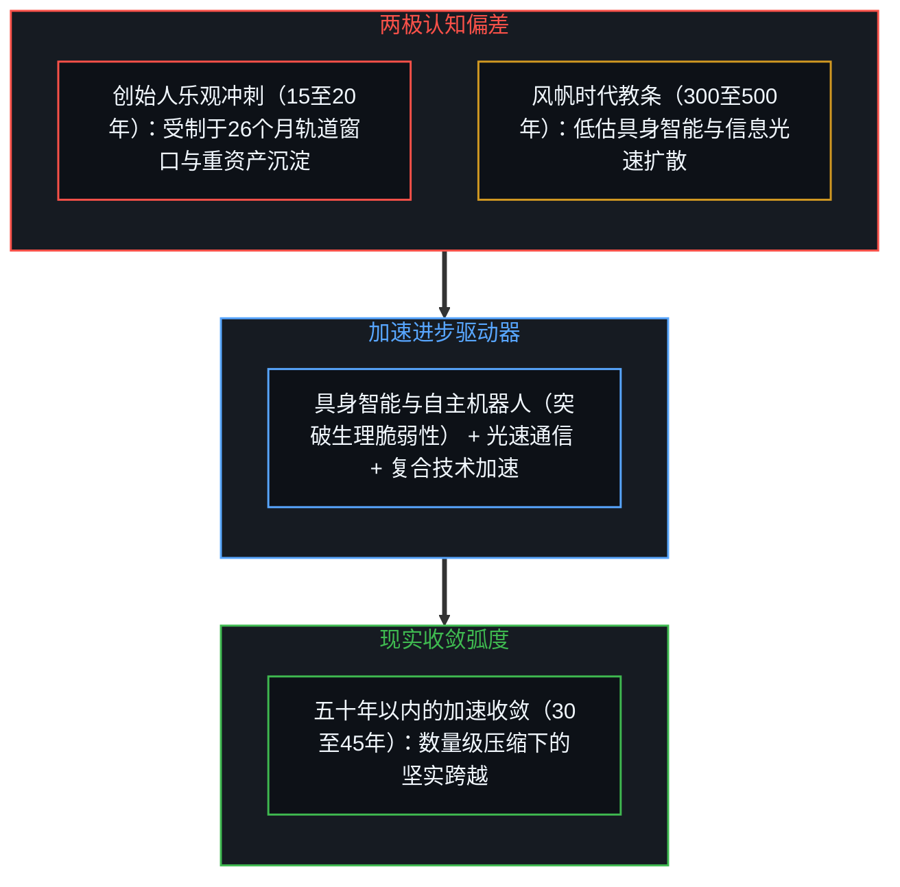

The realistic arc unfolds between these extremes. Projections demanding five centuries overlook the qualitative leaps separating modern technological systems from wooden caravels. In 1500 AD, crossing the Atlantic required months under erratic winds, imposing crippling coordination lags. Today, cislunar radio requires 1.3 seconds, while Earth-Mars signals travel in minutes, coordinating action at the speed of light. Crucially, Atlantic colonization was severely bottlenecked by biological vulnerability—scurvy, disease, and high mortality constrained labor supply. On the space frontier, embodied machine intelligence, robotic miners, and autonomous systems operate continuously in vacuum and radiation without biological sleep, nutrition, or life-support vulnerabilities. Propelled by compounding, non-linear technological acceleration, modern machine labor and information routing compress the learning curve dramatically. Consequently, a transition that once required five centuries has every reason to converge in under fifty years, establishing a realistic evolutionary horizon between thirty and forty-five years.

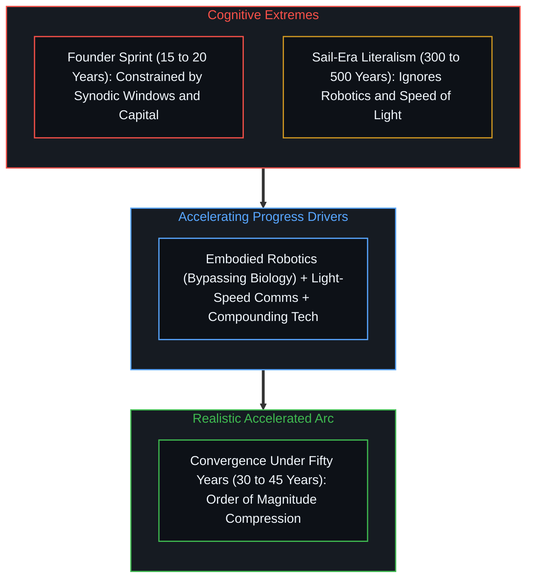

然而，这一时间跨度很可能会略长于创始人所预期的十五至二十年急躁冲刺。天体相对运行的轨道几何具有高度刚性的宏观不变量，地火转移窗口受制于两星公转会合周期，每隔二十六个月才开启一次，二十年的时间尺度仅允许展开不到十次实机发射尝试。闭环生态生命保障系统尚未在长期严密测试中证明其百分之百的水气养分自维持能力，任何微小的生化失衡都会带来致命后果。此外，抗辐射重型冶炼设备与万吨级工业工装的深空部署，天然需要跨越数十年的资本沉淀周期，这绝非软件代码的敏捷迭代所能随意越过。将期望锚定在三十至四十五年（五十年以内）的区间，既承认了技术加速进步对历史尺度的巨大压缩，又敬畏了天体力学与重工业资本化所固有的物理摩擦。

Conversely, this timeline will likely extend slightly beyond the founder's aggressive fifteen-to-twenty-year sprint. The orbital geometry of planetary motion maintains rigid macroscopic invariants indifferent to human haste: Earth-Mars synodic transfer windows open only once every twenty-six months, offering fewer than ten operational flight windows across two decades. Closed-loop ecological life support has yet to demonstrate self-sustaining balance without resupply over extended multi-year deployments. Furthermore, deploying heavy smelting infrastructure and planetary foundries requires multi-decade capital deployment cycles that cannot be bypassed by software sprints. Calibrating the horizon to thirty to forty-five years—comfortably under fifty years—honors the dramatic compression driven by accelerating technology while respecting the genuine physical frictions of celestial mechanics and heavy capital buildout.

## 六、 第一人称抉择与宏观阻力的涌现本相 / 6. First-Person Choices and the Emergent Nature of Macro Frictions

在面对复杂的太空化进程时，许多分析模型倾向于追问具体的制度答案：究竟哪种地缘政治联盟会主导太空公域、行星间长达数十分钟的光速通信延迟如何结算跨星贸易、或是监管审查究竟将在哪一年放开高频发射审批。

Faced with the complexities of this transition, analytical frameworks often demand granular institutional predictions: which geopolitical blocs will govern orbital commons, what monetary protocols will settle commerce across light-minutes of interplanetary delay, or in which exact year regulatory bodies will clear exponential launch cadences.

将这些悬而未决的制度摩擦视作阻碍技术前行的外部机械阻力，是一种典型的认知错觉。正如在[个人选择作为唯一因果杠杆](../individual-choices-as-the-only-causal-levers/)与[宏观现象及参数和个人微观选择的因果倒置与利率的命令幻相](../the-summary-first-reversal-and-the-command-of-yields/)中所揭示的，所谓的制度惰性、监管阻滞或地缘博弈，从来不是悬浮在半空中的独立实体，而全然是无数具体个体从第一人称视角出发所作出的真实抉择的事后汇集。

Treating institutional frictions, regulatory delays, or geopolitical tensions as external mechanical barriers pushing back against technological momentum is an epistemological misstep. As demonstrated in [Individual Choices as the Only Causal Levers](../individual-choices-as-the-only-causal-levers/) and [Macro Parameters, Micro Choices, and the Command of Yields](../the-summary-first-reversal-and-the-command-of-yields/), regulatory inertia and institutional drag are not autonomous forces operating in a vacuum; they are merely the aggregate third-person footprints of countless individual, first-person choices enacted by living agents.

每一位审定飞行牌照的监管人员在面对公众安全与发射频率时的考量，每一位工程师在离开传统巨头加入航天新锐时的权衡，每一位政策制定者在太空预算与民生福利之间的配比抉择，都是行动者基于自身内部信息与价值权重所作出的自洽决断。正因为每一个决断源自生命心智内部不可透视的选择点，任何第三人称宏观模型都无法预先穿透这些微观抉择并给出决定论式的未来剧本。

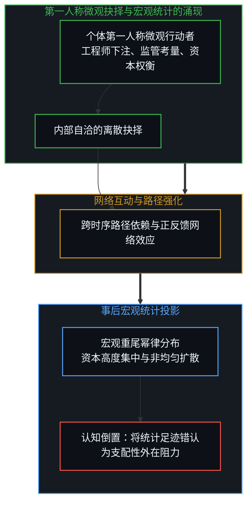

Every regulator calibrating safety margins against launch cadence, every aerospace engineer choosing whether to leave an incumbent contractor for a frontier startup, and every policymaker weighing planetary exploration against terrestrial social budgets is making an internally coherent selection from their own subjective vantage point. Because each choice originates from an opaque internal valuation, no third-person model can reach inside those selections beforehand to dictate a deterministic timeline.

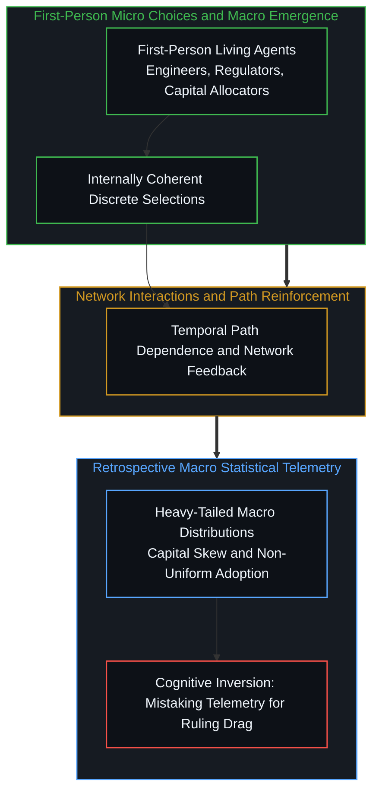

当数以百万计的微观独立选择相互碰撞并形成路径依赖与网络强化时，宏观层面上会自然浮现出沉重尾部的幂律分布，表现为运力份额的高度集中与技术采用的非线性扩散。但这些统计特征仅仅是对无数已完成抉择的事后记账，绝非凌驾于微观行动之上的外在律令。试图提前精确预测未来几十年每一处具体的法规细节与市场份额，是用短期的猜测噪音取代了长期的结构清晰。真正具备长久认知价值的，是牢牢锚定那些跨越尺度的宏观不变性：热力学系统的开放相变、全域社会剩余的必然耗散，以及微观生命心智不可代理的第一人称决断。

When millions of independent selections interact, accumulating path dependence and positive feedback, heavy-tailed distributions and power laws naturally emerge on a macroscopic scale, manifesting as concentrated launch shares and non-linear adoption curves. Yet these statistical footprints merely record historical aggregations after the fact; they do not dictate the living agency that produced them. Demanding granular forecasts of future treaties or exact market shares trades structural clarity for short-term speculative noise. Authentic comprehension rests upon identifying the enduring invariants: the thermodynamic phase shift of an open horizon, the scale-invariant dissipation of social surplus, and the irreducible first-person agency of living minds stepping onto the frontier.

## 七、 真实财富与纸面求索权的终极分野 / 7. The Ultimate Divergence Between Real Wealth and Paper Claims

这一辨析的最终落脚点，在于厘清金融资产估值与文明真实财富之间的鸿沟。在关于[拥有更多并非因由](../having-more-is-never-the-cause/)与[价值、货币与财富的生成机理](../the-generative-mechanics-of-value-money-and-wealth/)的研究中，核心洞察已经反复确立：企业的市值规模，归根结底只是一张针对未来现金流分配与经济地租的法定索取凭证，无论账户上的纸面数字多么惊人，它本身都无法直接转化为人类当下的消费与生存保障。

The final resolution of this inquiry rests upon distinguishing financial claim checks from real productive wealth. As articulated in [Having More Is Never the Cause](../having-more-is-never-the-cause/) and [The Generative Mechanics of Value, Money, and Wealth](../the-generative-mechanics-of-value-money-and-wealth/), a corporation's market capitalization is merely a legal claim check on anticipated future dividends and economic rents. Regardless of how astronomical paper equity values appear, financial valuations cannot be consumed directly.

真实的财富，从来不是资产负债表上的账面溢价，也非孤立漂浮在太空中的死寂原子，而是生命心智能够实际调动以抵御熵增、延展生存与创造体验的有效能力总和。它是廉价充沛的清洁能源、全域覆盖的高速互联、摆脱地表生态破坏的矿产供给、在轨部署的高效算力矩阵，以及生命在广袤宇宙中开拓出的全新生存空间。正如约翰·洛克菲勒留给文明的真正遗产，绝非他个人曾占美国国内生产总值百分之二的财富峰值，而是煤油价格的大幅回落让千家万户得以在黑夜中点亮灯火；太空开拓的深远价值，也绝非某一家商业航天企业的股票价格。

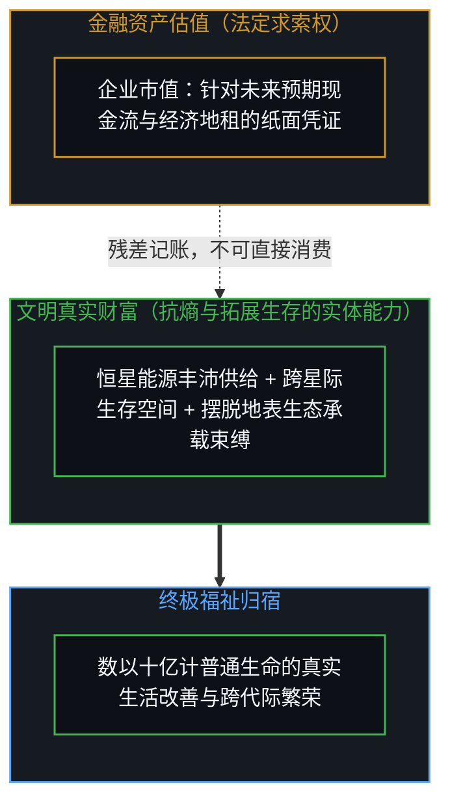

Real wealth is not a paper multiple recorded on balance sheets, nor is it dead matter floating in the cosmic void; it is the realized capacity of living minds to counter entropy, expand life, and sustain conscious flourishing through physical interactions. It consists of energy abundance, resilient high-speed communications, raw minerals extracted without ecological destruction, off-world computational capacity, and expanded living space across the cosmos. Just as John D. Rockefeller's authentic historical legacy was not his peak 2 percent share of United States GDP, but the fact that affordable kerosene illuminated ordinary homes across the continent, the real wealth of the space frontier will never reside in the stock ticker of an aerospace enterprise.

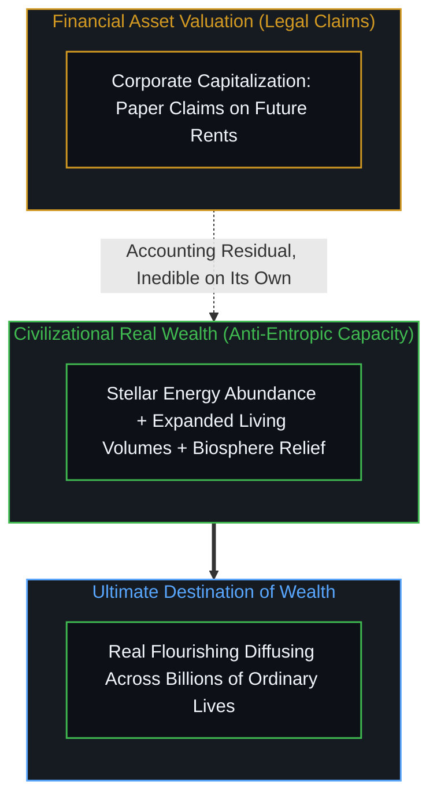

真正的奇迹在于，人类正在从单个行星表面的封闭脆弱系统中抽身而出，迈向一个能源丰沛、物质无界的开放多行星文明。那片由星辰、光芒与真空构筑的无垠丰饶，终将跨越几个世纪的时空，在无数普通生命的日常体验与福祉中得到最充分的耗散与沉淀。

The true civilizational milestone is that humanity is emancipating itself from precarious confinement within a single planetary biosphere, transitioning into an open, energy-abundant, multi-planetary civilization. That cosmic abundance of light, minerals, and vacuum will inevitably diffuse across centuries, realized and experienced within the daily lives of billions of ordinary human beings.
