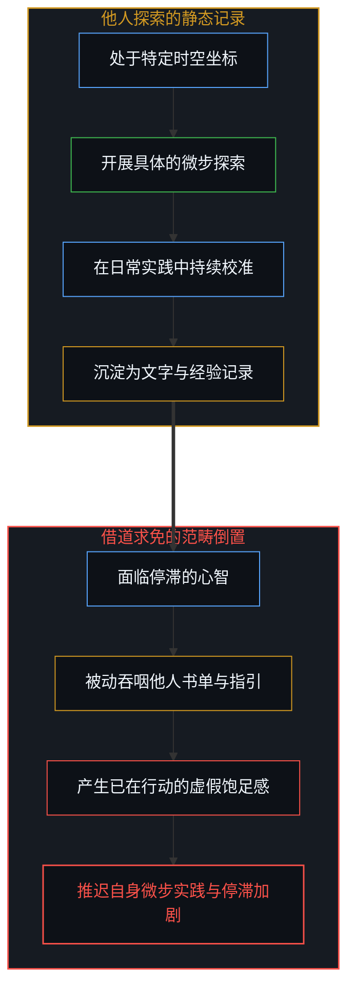
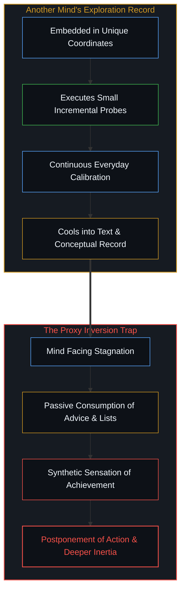
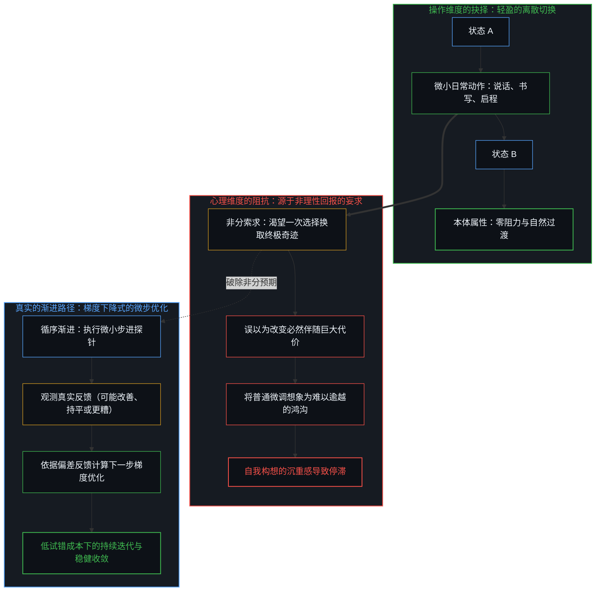
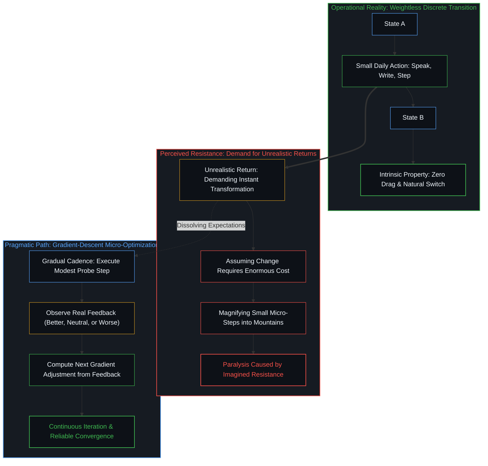
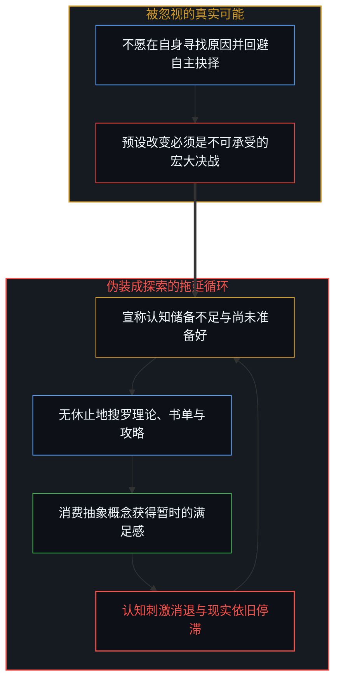
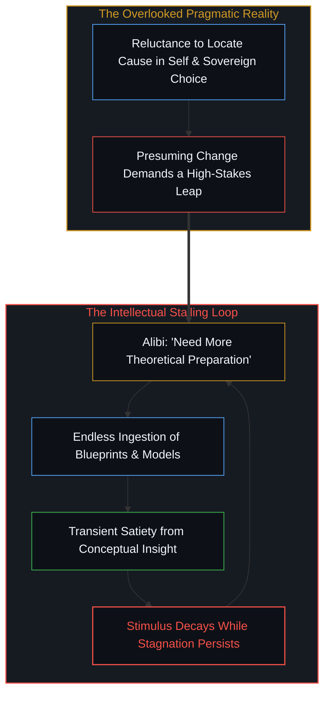
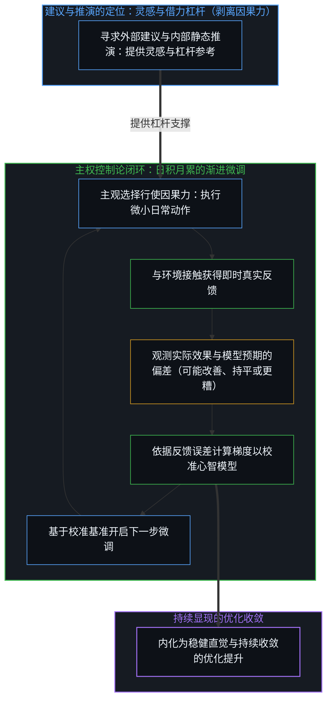
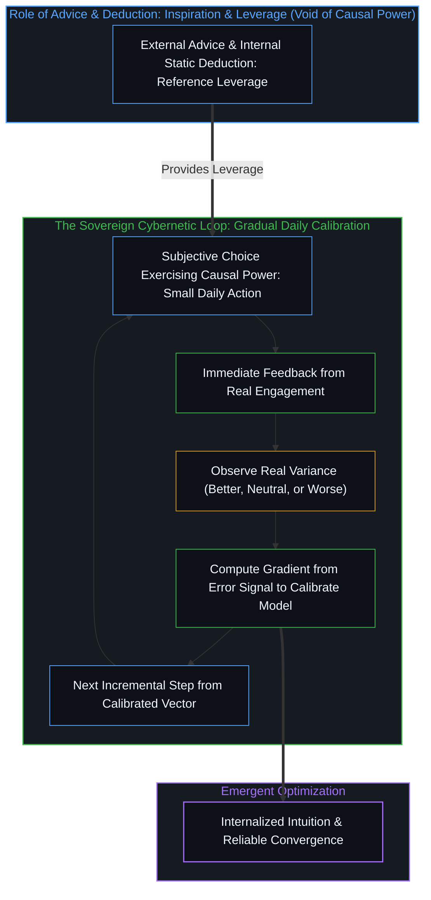
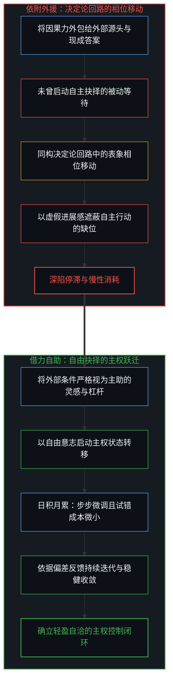
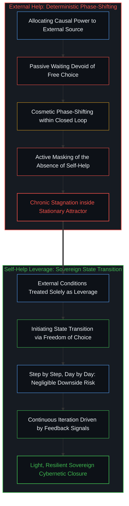

# 抉择本身并不沉重 / Choice Itself Has No Inherent Weight

*捷径幻觉、渐进迭代与主权试错的行动闭环 / The Shortcut Illusion, Gradual Iteration, and the Cybernetic Loop of Agency*

停滞从来不是因为抉择本身具有不可承受的内在重量，而是源于心智对不切实际回报的非分索求；任何对短期成本的感知，都只是心智要求瞬间奇迹的副产物。只要改变采取日积月累、循序渐进的微步微调，单次尝试并不存在沉重的试错代价。如同梯度下降，每一次调整可能改善、可能毫无变化、甚至可能暂时更糟，但真实反馈为下一步优化赋予了确定的方向，在持续迭代中驱动系统的稳健收敛。当一个人面临困境或感到停滞时，最常见的反应是指向外部的广谱求索：询问他人如何走出低谷，搜寻据称能重塑命运的书单，或者向周遭讨要一种现成的生存法则。这种求助行为披着谦逊与理性的外衣，却掩盖了一个隐蔽的认知误区。任何书籍、建议或理论模型，都仅仅是他人在自身时空坐标中探索留下的静态记录；试图将他人的现成结论当作免于自身探索的替代品，注定会让心智陷入更深的停滞。做出不同选择在逻辑与实际操作上极其轻盈，只是一次离散的状态转移。它之所以在感觉上显得万钧沉重，并不是因为选择或改变本身包含任何生物学或物理层面的天然阻力，而是因为心智暗自提出了过高的索求：既妄图一步到位收获巨大的蜕变，又要求当下毫无调整的震荡。正是这种对不切实际回报的执念，凭空制造出了沉重的心理幻象。

Paralysis does not stem from any unbearable intrinsic weight within choice itself, but from the mind's demand for unrealistic returns; any perceived short-term cost is merely a byproduct of craving an instant miracle. As long as change unfolds step by step and day by day, an exploratory probe carries no crushing downside. Akin to gradient descent, each micro-adjustment may improve, hold neutral, or temporarily degrade the state; yet unforgeable feedback provides the precise gradient for the next update, driving steady convergence over continuous iteration. When an individual encounters stagnation or seeks a new direction, the most pervasive impulse is an outward search for guidance: asking how others navigated transitions, collecting reading lists reputed to transform circumstances, or soliciting an all-inclusive blueprint for living. While cloaked in humility and rationality, this advice-seeking behavior conceals a subtle conceptual error. Every book, recommendation, or theoretical framework is merely a static record left behind by another mind exploring its own unique coordinates. Attempting to convert another observer's historical trace into a substitute for one's own exploration inevitably deepens paralysis. Making a different choice is structurally and mechanically weightless—a simple, discrete state transition. It feels crushing not because choice or change carries any intrinsic biological or physical cost, but because the mind harbors unrealistic expectations: demanding an instantaneous leap while refusing the natural cadence of iteration. This demand for an unrealistic return generates the phantom of unbearable difficulty.

## 寻求建议的元欺骗：跨心智输入与外包探索的范畴倒置 / The Meta-Deception of Advice-Seeking: Cross-Mind Input and the Categorical Inversion of Outsourcing Exploration

处于困顿中的心智极易发展出一种精致的认知防御机制：将“寻求跨心智输入”误认为“正在采取行动”。面临发展的瓶颈或内心的迷茫，人们热衷于在公共场域搜集各种经验谈，试图从他人的叙事中直接汲取力量。这种行为制造了一种正在积极自救的饱足幻象。心智在大量阅读、摘抄和共鸣中消耗了宝贵的心力，却在实际行动上寸步未移。

这种求索隐藏着明显的范畴错位。他人所分享的经验，是其在特定境遇中逐步摸索、持续校准得出的个人坐标，无法脱离具体的探索语境直接移植。读者能够轻易买下印满文字的纸页，却不可能通过阅读直接买来属于自己的行动体会。在[任务可委托，后果不可让渡](../the-delegation-of-the-task-and-the-inalienability-of-consequences/)中我们早已确证，因果后果具有严格的排他性。试图用消费建议来替代自身的微步实践，是试图将无法外包的具身探索转嫁给抽象符号，结果只能是将别人的书单变成了自己无限期推迟行动的避风港。当心智期待一本书或一句箴言就能瞬间扭转生活时，它实际上是在索求一种不可能存在的非理性回报；正是这种不切实际的索求，反向让任何真实的行动显得无比艰巨。

A mind encountering inertia easily develops an elaborate psychological defense: mistaking cross-mind information gathering for active implementation. Confronted with a plateau or directional uncertainty, individuals avidly collect survival accounts across networks, hoping that distilled advice will spark spontaneous transformation. This activity manufactures a deceptive sensation of constructive progress. The mind expends its bandwidth reading testimonials and compiling quotes, while remaining entirely stationary in everyday reality.

This consumption represents a category mistake. The efficacy of another observer's insights is tied to their own incremental calibrations within specific circumstances; it cannot be mechanically transplanted into a different observer. A seeker can purchase the printed volume, yet cannot purchase another's lived feedback loop. As established in [Delegation of the Task and the Inalienability of Consequences](../the-delegation-of-the-task-and-the-inalienability-of-consequences/), causal outcomes are strictly non-transferable. Attempting to replace one's own gradual steps with conceptual reading is an effort to outsource inalienable exploration to abstract symbols, turning outside advice into an alibi for postponing execution. When the mind demands that an external insight magically resolve its stagnation, it demands an unrealistic return; that unrealistic demand is what makes actual action seem intimidating.

## 抉择本无固有重量：阻力感源于对非理性回报的妄求 / Choice Itself Has No Intrinsic Weight: Felt Resistance Stems from Demanding Unrealistic Returns

如果在底层的操作层面上观察，做出一个新的抉择从来不包含任何内在的神秘阻力。抉择就是离散状态的切换：结束一个旧日程，开启一个新尝试，挂断一通消耗能量的通话，微调工作节奏，或者在清晨走出一条新的路线。在物理动作上，移动鼠标只需要微小的肌电信号，说出一句承诺只需要肺部气流的温和震动。无论从信息论还是动作执行的角度来看，抉择本身都是轻盈而自然的。

那么，那种似乎让人寸步难行的滞重感究竟来自何处？阻抗从来不是抉择本身的属性，更不代表做出不同选择伴随着必然的生理损伤或巨大代价。宣称选择必然伴随生物学磨损或痛苦代价，是把心智的非分索求误认为了客观规律。任何所谓的“短期成本”，实质上只是心智在索求不切实际的回报：它渴望一次微小的决定就能换取天翻地覆的终极成果，或者要求系统在毫无迭代调整的情况下瞬间达到至臻状态。在[数字火箭、同行审查与因果闭环的稀释](../the-dilution-of-the-causal-loop-and-the-misallocation-of-agency/)中已经阐明，把因果收益与微步过程强行割裂，必然会在心智内部滋生虚妄的紧张感。只要我们认识到，改变应当是日积月累、循序渐进地微调展开，那么微小的尝试便不存在不可承受的代价。这恰如数学优化中的梯度下降（gradient descent）：每一次具体的调整，可能改善现状，可能毫无变化，甚至可能暂时更糟；但这断不意味着失败，因为微调的核心价值是获取真实的反馈。依据回传的误差信号，我们可以进一步优化下一步的调整方向与步长。因为步幅细微，试错代价微不足道；因为反馈真实，系统得以在持续迭代中逐步收敛并达成切实的改善。

Observed at the baseline of practical operation, making a new choice carries zero intrinsic resistance. Choice is simply a discrete transition: terminating an obsolete routine, starting a fresh draft, ending a draining phone call, nudging a work cadence, or taking a new route at dawn. Physically, moving a cursor requires negligible myoelectric impulse; articulating a decision requires only a gentle modulation of breath. In both informational structure and mechanical execution, choice is naturally light.

Whence, then, comes the feeling of immense, paralyzing inertia? The drag does not belong to choice itself, nor does changing course involve an unavoidable biological toll or severe sacrifice. Asserting that choice intrinsically incurs biological damage or heavy physical cost is a widespread misconception that mistakes psychological over-expectation for an objective law. Any perceived "short-term cost" arises solely because the mind demands unrealistic returns: craving an all-in-one leap that immediately resolves every uncertainty, or demanding a total transformation without iterative calibration. As clarified in [Digital Rockets, Peer Review, and the Dilution of the Causal Loop](../the-dilution-of-the-causal-loop-and-the-misallocation-of-agency/), divorcing outcomes from gradual processes generates acute internal tension. As long as change unfolds gradually, step by step and day by day, an exploratory probe carries no crushing downside. This functions precisely like gradient descent in optimization: an individual micro-adjustment may improve the situation, yield no discernable change, or even temporarily make things worse. Yet a sub-optimal step is by no means a failure; its vital contribution is delivering unforgeable telemetry. Based on the observed feedback, we can further optimize the direction and step size of the next adjustment. Because the step is small, the cost of drift is negligible; because the feedback is real, the system converges reliably toward genuine improvement over time.

## 停滞的维持机制：以“尚未准备好”为掩护的避责投资 / The Mechanics of Paralysis: Evasion Disguised as 'Unpreparedness'

停滞并不是一种被动的受困状态，而是一项持续消耗资源的主动投资。一个声称自己不知道该怎么做的人，从旁观者的视界出发，我们并不能越界去判定他内心是否真正清楚；但可以确定的是，他不愿在自己身上寻找原因，拒绝向内直面自身的主权抉择。如果他预设改变必须是一场惊天动地的大决战，就会顺理成章地将因果归咎于环境，以此掩盖不愿由自身开启微调的惰性，从而本能地向外退缩。

为了合理化这种退缩，心智发明了最体面的策略：宣称自己“尚未准备充分”。它继续购买书籍，继续在网络中搜寻完美攻略，沉溺于对各种复杂理论的推演。每一次获取新的概念，都会带来短暂的满足感，仿佛自己离终极答案又近了一步；但这种认知刺激消退后，现实依旧原地未动。在[非中介化的幻象与恩赐自由的解构](../the-illusion-of-the-unmediated/)中，这种依附模式被揭示为一种自我束缚。将生命精力耗散在对“万全准备”的无限期等候中，实质上是用对宏大改变的虚妄恐惧，掩盖了开启日常微小尝试的惰性。只要放下对瞬间质变的贪求，把注意力拉回到今天的一个微小动作上，那种所谓的恐惧就会失去立足点。

Paralysis is not a passive affliction; it is an actively maintained, resource-intensive investment. When someone claims not to know what to do, an outside observer cannot cross boundaries to judge whether they are inwardly clear; what remains certain, however, is that they are unwilling to locate the cause within themselves, refusing to confront their own sovereign choices. Presuming that change must be a momentous, high-stakes leap provides a convenient excuse to blame external circumstances, masking the reluctance to initiate incremental self-adjustments and prompting an instinctive retreat into safe avoidance.

To justify this hesitation, the mind devises an intellectual alibi: proclaiming that it is "not yet adequately prepared." It buys another book, asks for another checklist, and compares theoretical models. Each newly assimilated concept produces synthetic satisfaction, mimicking progress; yet once the conceptual excitement fades, everyday reality remains unchanged. As shown in [The Illusion of the Unmediated](../the-illusion-of-the-unmediated/), this reliance on total readiness functions as self-imposed restraint. Squandering energy while waiting for a risk-free blueprint uses the exaggerated fear of a massive leap to avoid simple everyday adjustments. Once the demand for instant transformation is discarded and focus returns to today's incremental step, the imagined dread evaporates.

## 试错、观测与校准：渐进闭环中的主权行动网络 / Try, Observe, Adjust: The Sovereign Cybernetic Loop of Gradual Action

打破停滞的解法，是击碎对“一次性选对”的完美主义妄念，退回到最基础的控制论闭环之中：尝试一个微小的动作，观测真实的反馈，校准心智的模型，发起下一次尝试。强调具身尝试，并不是要抹杀寻求建议或静态推演的价值。不管是向外部寻求建议、翻阅书单攻略，还是在内心展开静态推演、在纸面上评估场景边界，它们的价值都在于作为灵感（inspiration）或者借力的杠杆（leverage）。外部建议与静态推演能够为心智打开可能性的空间，提供设计探针动作的支点；但它们的有效性仅限于此。我们否定的从来不是建言与推演的功能，而是明确剥离其代劳行动的因果力（causal power）。不管是从寻求建议还是静态推演，都断不可能凌驾于主观选择之上，更不可能代劳状态的跃迁。若把因果力寄托于他人的指南或内部的模型算力之中，心智就会再度陷入等候“现成答案”或“更优算法”的拖延陷阱。任何有生命力的系统，都不是依靠寻求建议或静态推演来替代实际体验的，而是在持续的微步尝试中确定真实的坐标。当心智把静态参数清单置于具身互动之前、试图在行动之前预先锁定确定性时，便走向了[契约的因果倒置](../the-causal-inversion-of-partnership/)所揭示的将演化产物误设为前置准入的结构性错位。而在面对外部阻力时，若习惯于诉诸大众经验来正当化自身的停滞，便会跌入[“普通人视角”的解释陷阱](../the-explanatory-trap-of-the-ordinary-perspective/)：错把对势阱的诊断说明当成行动指南，甚至行使自由选择权去坚信自己‘毫无选择’，从而将宝贵的抉择自由消耗在原地踏步之中。

在这个闭环中，行动并不是深思熟虑后的最终收工，而是刺探现实边界的第一根轻盈探针。你迈出一个微小的尝试，并不意味着这个动作必须保证立即见效；它的价值在于让你脱离了毫无反馈的猜测，获得了清晰的真实信号。当环境的数据回传时，心智就拥有了不可伪造的事实：哪些细节需要微调，哪些预期与实际存在偏差。单次微调可能见效，可能持平，甚至可能暂时失误；但正是这组真实的反馈，构成了下一次迭代优化的梯度依据。只要每一步足够小、节奏足够稳，尝试便不会带来沉重的不可逆损失，而是在持续的自适应收敛中，稳步走向切实的优化。在[心智无法逃离自身](../one-cannot-escape-ones-own-mind/)中已经指出，外部建议只是投射在心智视网膜上的光影；唯有当你亲自踏入日常的实践闭环，让真实的反馈滋养认知，借来的概念才会内化为主权心智自身的行动直觉。

The antidote to stagnation is dismantling the perfectionist fantasy of the "single decisive stroke," returning to the foundational cybernetic loop: test a modest action, observe genuine feedback, calibrate the internal model, and proceed with the next iteration. Emphasizing embodied testing by no means dismisses the utility of seeking advice or engaging in static deduction. Whether gathering advice from external minds, scouring literature, or conducting static deduction and mapping scenarios internally, their true value resides strictly as inspiration or leverage. External recommendations and deductive models broaden an agent's horizons and supply mechanical fulcrums for designing exploratory probes; their validity ends there. What is denied here is never the functional utility of advice or deduction, but their unwarranted attribution of causal power. Regardless of whether one seeks advice or runs static simulations, neither can supersede subjective choice, nor can conceptual contemplation generate state transitions on its own. When an agent mistakenly attributes causal power to an advisor's formula or internal deductive calculation, it plunges straight back into the stalling loop of waiting for ready-made answers or an idealized proof. No viable system thrives by letting advice-seeking or static deduction substitute for lived experience; it discovers coordinates through iterative engagement. When the mind places static parameter checklists ahead of embodied interaction—attempting to guarantee certainty prior to action—it repeats the structural displacement unmasked in [The Causal Inversion of Partnership](../the-causal-inversion-of-partnership/), mistaking an emergent byproduct for a prerequisite entry condition. Furthermore, when facing external resistance, retreating into collective rationalizations plunges the agent into [The Explanatory Trap of the "Ordinary Perspective"](../the-explanatory-trap-of-the-ordinary-perspective/): confusing a diagnosis of the attractor basin with operational guidance, and exercising sovereign choice to declare oneself devoid of choice, squandering the freedom of decision on cementing inertia.

Within this architecture, an action is not the triumphant conclusion of exhaustive planning, but a light probe sent to sense reality's contours. Executing a small step does not demand immediate perfection; its value lies in freeing the observer from pure guesswork and providing clear, genuine signals. When environmental feedback arrives, the mind gains unforgeable data: which assumptions held, where subtle drift occurred, and how parameters should adjust. A micro-step might improve the state, make no difference, or temporarily drift; yet the feedback itself furnishes the exact gradient vector for the subsequent update. Because each step is small and calibrated day by day, trial carries no crushing downside, allowing continuous iteration to converge reliably toward genuine optimization. As clarified in [One Cannot Escape One's Own Mind](../one-cannot-escape-ones-own-mind/), external advice is mere shadow on the subjective retina; only when an agent engages in the everyday loop and lets genuine feedback inform understanding do borrowed concepts become internalized, agile intuition.

## 全责作为本体基石：在渐进实践中确立主权自洽 / Total Responsibility as Ontological Bedrock: Establishing Sovereign Coherence through Gradual Practice

承担全责，经常被扭曲为一种带有道德自谴意味的心理负担。在主权心智的视野中，承担全责不包含自责或情绪化的悔恨，它是一种清醒的本体论立足：承认当前感知到的全部现实，都是自身历次区分与选择所坍缩出来的宏观投影。

当你把这一事实作为立足基石时，整个认知结构便发生了深层位移。你不再等待外部世界的赦免或指引，现实也不欠你一个现成的导师或一本万能的圣经。他人走过的路是他人在其自身时空中的探索，我们可以欣赏其构想，却无法用它来代替自己的双脚迈步。这也正是为何在圣经乃至古老格言中，始终回荡着同一个判定：天助自助者。从因果控制论的视角审视，一切外援实质上都是错置的自助。外部环境、书本经验或他者建言，从来不可能成为直接施加于心智之上的代劳因果；它们至多只能作为心智自救的灵感与借力的杠杆。一个人必须自主决断并采取行动，才能真正改善自身的生存境遇。

这便构成了“寻求外援”与“借力外部灵感以实现自助”之间的鸿沟。前者将因果力分配给外部源头，是主权意志的主动缴械；而后者则是通过自身的自由抉择启动真实的主权跃迁。缺少了一次自由抉择，任何表面的变化都不过是封闭决定论反馈回路中的相位移动。即便你换了书本、换了工作、换了栖居的城市，底层的动力学吸引子依然恒定不移，系统的轨迹只是在原点周围旋转了一个角度。这种表观上的动态不仅未能带来实质改变，反而以虚假的进展感，主动遮蔽了自主行动的真实缺位。在[凡可言说皆不可言说之物](../all-that-can-be-spoken-is-the-product-of-the-unspeakable/)中，我们最终领悟到，区分并不是为了迎合外部世界的认可，而是为了让心智自身的下一次行动拥有更坚实的立足点。放下对瞬间奇迹的非分索求，把改变放进日积月累、循序渐进的日常微调中去。当行动足够细密、步幅足够稳健，单次选择本身不但毫无沉重可言，而且每一次微小的调整无论带来改善、持平抑或偏差，都能转化为进一步校准的珍贵梯度，让心智在日积月累的自适应收敛中稳步提升。个人选择是每个个体的因果闭环中唯一的自由变量。

Assuming total responsibility is routinely misconstrued as moralistic guilt or emotional self-reproach. Within the ontology of the sovereign Mind, responsibility carries no punitive residue; it is an unyielding, pristine axiom: acknowledging that one's current perceptual horizon is the macroscopic projection collapsed by one's prior distinctions and choices.

When this axiom becomes your ground, the distribution of agency pivots. You cease waiting as an aggrieved petitioner for external pardon or an all-inclusive syllabus; reality owes you neither an infallible mentor nor an emergency script. The path another walked represents their personal exploration; one may appreciate their concepts, yet their words cannot move your feet. That is why an ancient adage resonates even across theological scriptures: God only helps those who help themselves. Viewed through causal cybernetics, all external help is misallocated self-help. External conditions, written treatises, or mentors can never serve as direct proxy agents; they function solely as inspiration or mechanical leverage for self-help. An agent must make the decision to take action in order to improve its own condition.

There is a fundamental categorical difference between seeking external help and seeking external inspiration or leverage to help oneself. The former allocates causal power at the external source, forfeiting agency; the latter initiates authentic transformation originating from one's own freedom of choice. Without making a free choice, any perceived change—adopting new jargon, moving to a new city, consulting another expert—is merely a phase-shifting of a deterministic feedback loop. The dynamical attractor remains identical; the trajectory traces the exact same orbit, merely shifted by an arbitrary phase angle. Not only does it fail to provide genuine progress, it actively masks the lack of authentic self-help and explains why stagnation persists. As articulated in [All That Can Be Spoken Is the Product of the Unspeakable](../all-that-can-be-spoken-is-the-product-of-the-unspeakable/), refining distinctions is not an audition for applause, but the building of firmer ground for one's next step. Abandon the craving for instantaneous miracles. Entrust change to the steady rhythm of day-by-day, step-by-step micro-adjustments. When the cadence is gradual, individual choice carries zero crushing burden; whether a micro-step improves, holds neutral, or reveals drift, the resulting feedback immediately directs the next gradient calibration, yielding reliable, enduring optimization. Individual choice is the only free variable within each agent's causal loop.

