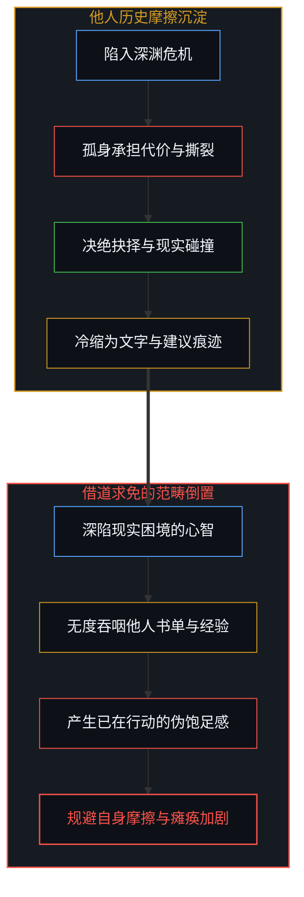
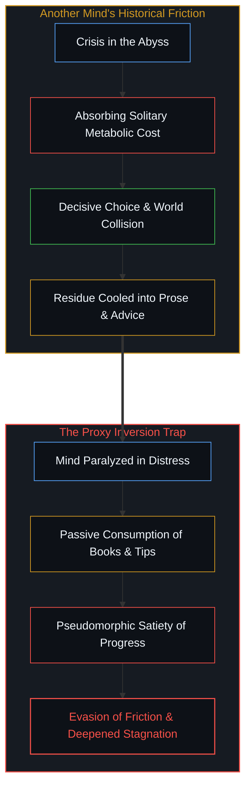
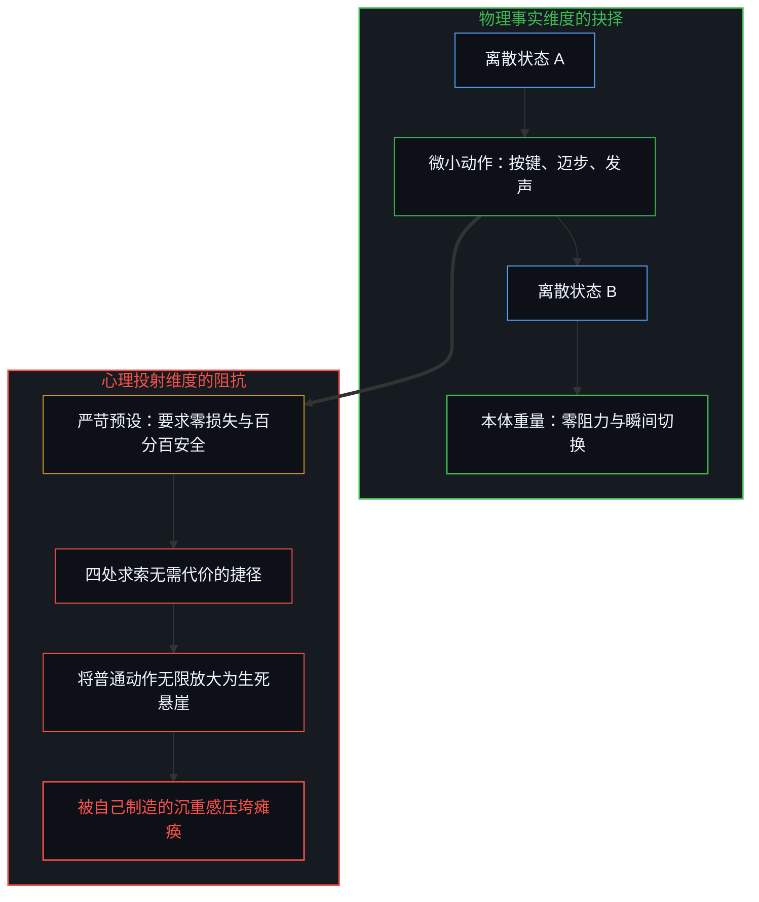
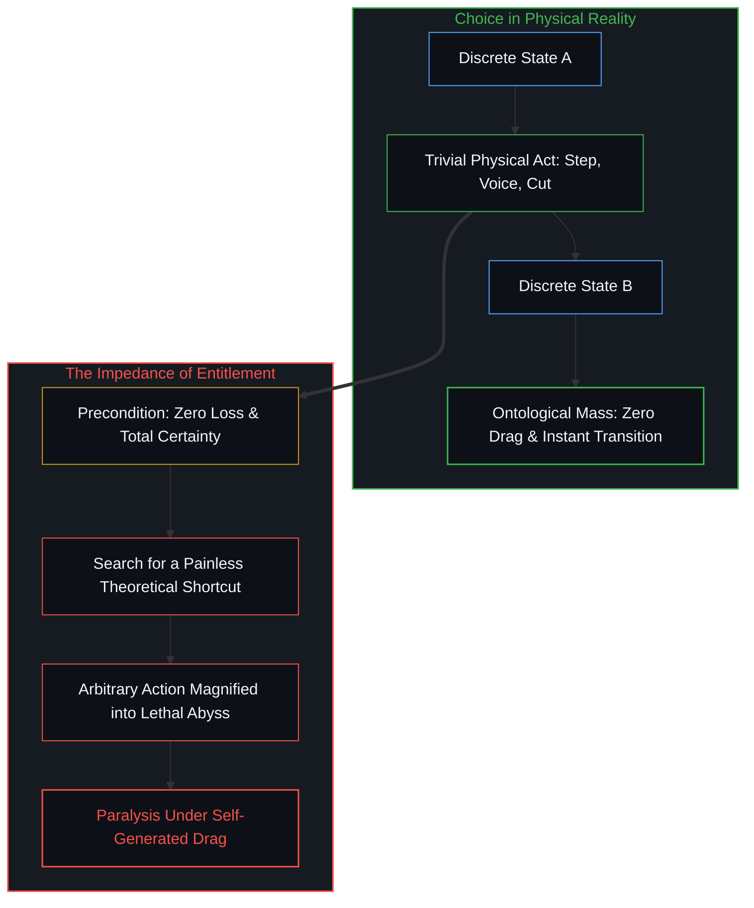
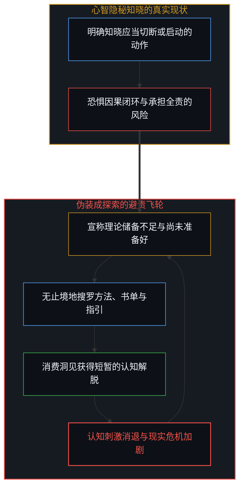
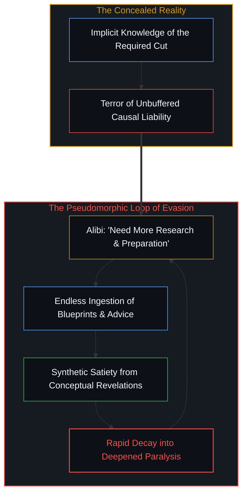
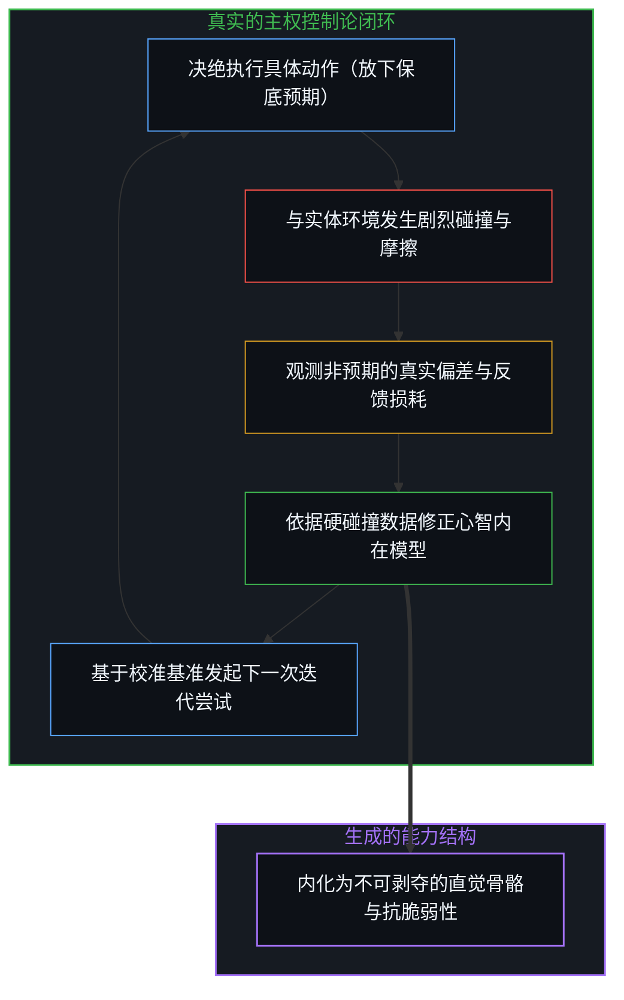
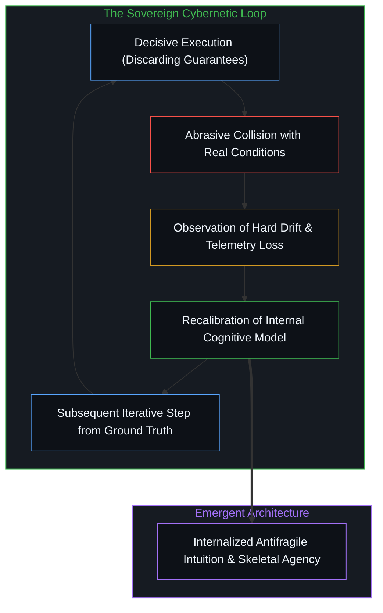
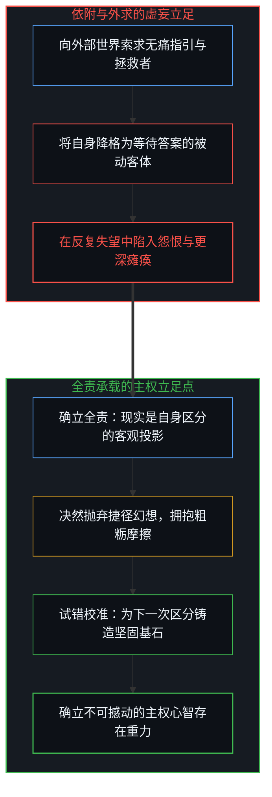
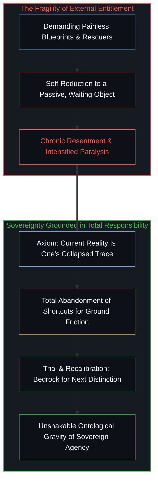

# 抉择本身并不沉重：捷径幻觉、全责买单与主权试错的行动闭环 / Choice Itself Has No Inherent Weight: The Shortcut Illusion, Total Responsibility, and the Iterative Loop of Action

*深渊中的停滞从来不是因为抉择本身具有不可承受的内在重量，而是源于心智对低阻力捷径的虚妄执念；放弃寻找替代性的无痛蓝图，在全责的闭环中持续试错与校准，是主权心智确立自身的唯一摩擦路径。 / Paralysis in crisis does not stem from an unbearable intrinsic weight within choice itself, but from the mind's clinging to the phantom of a frictionless shortcut; abandoning the search for a painless proxy blueprint and running the iterative loop of owned trial and error is the sole friction path through which sovereign agency establishes itself.*

当一个人深陷情绪或存在的剧烈危机时，最常见的自救反应是指向外部的广谱求索：询问他人如何渡过幽暗低谷，搜寻据称能重塑命运的书单，或者向周遭讨要一种不带痛苦的生存法则。这种求助行为披着谦逊与理性的外衣，却掩盖了一个隐蔽的本体论倒置。任何书籍、建议或理论模型，都仅仅是他人在自身具体因果中支付了不可替代的代价后留下的冷缩痕迹；试图将他人的痕迹当作绕开自身摩擦的预付车票，注定只会让心智陷入更加顽固的瘫痪。抉择在逻辑与物理操作上极其轻盈，只是一次离散的状态转移；它之所以显得万钧沉重，仅仅是因为心智拒绝承认代价的不可让渡性，并仍在贪恋一条无需买单的无损通道。

When an individual plunges into an acute existential or emotional crisis, the most pervasive impulse is an outward search for salvation: asking how others survived the abyss, collecting reading lists reputed to cure despair, or soliciting some painless formula for living. While cloaked in humility and rationality, this advice-seeking behavior conceals a profound ontological inversion. Every book, recommendation, or theoretical framework is merely the cooled residue left behind by another mind after paying non-transferable metabolic costs within its own unique causal coordinates. Attempting to convert another mind's historical trace into a pre-paid ticket that bypasses one's own friction inevitably plunges the agent into deeper paralysis. The act of choosing is structurally and mechanically weightless—a simple, discrete state transition; it feels crushing only because the mind stubbornly demands a frictionless path and refuses to settle its own existential tab.

## 寻求建议的元欺骗：跨心智输入与外包代价的范畴倒置 / The Meta-Deception of Advice-Seeking: Cross-Mind Input and the Categorical Inversion of Outsourcing Cost

处于逆境中的心智极易发展出一种精致的认知防御机制：将“寻求跨心智输入”误认为“正在采取解决行动”。面临破裂的生计、耗竭的关系或剧烈的内在虚无，人们热衷于在公共场域征集真实生存的经历，试图从他人的叙事中汲取力量。这种行为制造了一种正在积极自救的饱足幻象。心智在大量阅读、摘抄和共鸣中消耗了宝贵的代谢能量，却在物理行动上寸步未移。

这种求索隐藏着严重的范畴错位。他人所分享的渡劫智慧，其有效性并不是由书本上的符号逻辑赋予的，而是由那个心智在特定的历史节点上，孤身承担了沉没成本、承受了神经重塑的撕裂痛楚后硬化而成的产物。读者能够轻易买下印满文字的纸页，却不可能买下产生这些文字的活体摩擦。在[任务可委托，后果不可让渡](../the-delegation-of-the-task-and-the-inalienability-of-consequences/)中我们早已确证，因果后果具有严格的本体排他性。试图用阅读替代涉险，就是试图将无法代购的真实成本外包给抽象概念，结果只能是把别人的药方变成了自己逃避战场的合法避风港。

A mind under duress easily constructs an elaborate psychological defense: mistaking cross-mind information retrieval for decisive operational action. Confronted with ruined finances, fractured relationships, or suffocating emptiness, individuals avidly solicit stories of survival across public networks, yearning for courage distilled into easily digestible advice. This search generates a deceptive feeling of self-rescue. The mind exhausts its metabolic bandwidth reading testimonials, underlining passages, and nodding in poignant resonance, while remaining entirely stationary in the physical arena.

This consumption represents a category mistake. The validity of another person's survival wisdom is not generated by propositional eloquence; it was forged because that specific individual absorbed sunk costs and survived the tearing friction of irreversible neurological rewiring. A seeker can purchase the printed volume, yet cannot buy the visceral friction that produced the prose. As established in [Delegation of the Task and the Inalienability of Consequences](../the-delegation-of-the-task-and-the-inalienability-of-consequences/), causal consequences are strictly non-transferable. Attempting to replace bodily risk with conceptual reading is an effort to outsource irreplaceable costs to abstract symbols, transforming someone else's historical remedy into a sanitized sanctuary for chronic cowardice.

## 抉择本无固有重量：阻力感源于对无损通道的顽固预设 / Choice Itself Has No Intrinsic Weight: The Felt Resistance Stems from the Demand for a Frictionless Path

如果在最底层的机械与物理层面上观察，抉择从来不包含任何神秘的阻力。抉择就是离散的区分：关闭一个旧进程，开启一个新方向，挂断一通维持妥协的电话，走出一段消耗生命的死循环，或者在破晓时分走向未曾涉足的陌生街区。在物理动作上，按下开关只需要微不足道的肌电信号，说出决定只需要微弱的气流振动。

那么，那种将整个人钉死在原地的巨大滞重感究竟来自何处？阻抗并非来自于抉择自身，而是来自于心智在做出抉择之前附加的一项非分索求：它要求这个抉择必须是“无痛的”、“百分之百稳妥的”，并且“不剥夺现有任何既得舒适”。换言之，心智不是不敢选择，而是妄图在不付出代价的前提下收获蜕变。这种对低阻力通道的执念，才是产生沉重感的核心力源。在[数字火箭、同行审查与因果闭环的稀释](../the-dilution-of-the-causal-loop-and-the-misallocation-of-agency/)中已经阐明，任何企图享受因果收益却拒付因果账单的意图，都会转化为巨大的内在摩擦。只要心智还在幻想存在某种不流血的蜕变捷径，任何细小的现实动作就会被心理投射放大为一座无法逾越的崇山峻岭。

Observed at the fundamental mechanical and informational baseline, an act of choice contains zero inherent friction. Choice is merely a discrete distinction: terminating an obsolete process, initializing an unmapped vector, hanging up an abusive phone call, resigning from a spirit-crushing occupation, or stepping onto an unfamiliar pavement at dawn. Physically, pushing a button requires negligible myoelectric potential; voicing a final resolution requires only a subtle modulation of breath.

Whence, then, arises the suffocating inertia that anchors an agent to the floor? The drag does not reside in the choice itself, but in the irrational entitlement appended to it: the prerequisite that the transition must be entirely painless, perfectly guaranteed, and free of all metabolic sacrifice. The agent does not fear choosing; the agent refuses to pay the tab. This stubborn demand for a zero-loss vector generates the psychological illusion of crushing mass. As dissected in [Digital Rockets, Peer Review, and the Dilution of the Causal Loop](../the-dilution-of-the-causal-loop-and-the-misallocation-of-agency/), attempting to seize downstream fruits while refusing upstream bills generates immense cognitive friction. So long as the mind hallucinates a bloodless shortcut, the most modest forward step is magnified into an unscalable precipice.

## 停滞的维持机制：以“寻找灵丹妙药”为掩护的避责投资 / The Mechanics of Paralysis: Avoidance Disguised as the Search for the Ultimate Panacea

停滞并不是一种被动的受困状态，而是一项持续消耗资源的主动投资。一个声称自己不知道该怎么做的人，十分清楚眼下最需要斩断或启动的那个具体动作是什么。然而，一旦采取行动，他就必须告别受害者的无辜身份，必须承担决策失误的全部指责，必须直面新环境的冰冷摩擦。

为了规避这种严酷的因果清算，心智发明了最体面的拖延策略：宣称自己“尚未准备充分”。它继续购买心理学书籍，继续在网络社群中征集疗愈方案，继续沉溺于对各种抽象概念的比较。每一次获取新的观点，都会带来短暂的多巴胺奖赏，仿佛自己离答案又近了一步；但这种兴奋的半衰期极短，转瞬就会被更深的空虚吞噬。在[非中介化的幻象与恩赐自由的解构](../the-illusion-of-the-unmediated/)中，这种依附模式被揭示为一种自我阉割。将生命精力耗散在对“更好方法”的无限期等候中，实质上是在用认知层面的虚假繁荣，换取在真实世界中免于受挫的安全感。这种安全感的代价，就是心智自主权的缓慢死亡。

Paralysis is never a passive misfortune; it is an actively maintained, resource-intensive investment. An individual professing helplessness almost invariably knows the exact habit to break, the toxic compromise to exit, or the arduous initiative to undertake. Yet crossing that threshold forces an immediate surrender of innocence: one loses the shelter of victimhood, assumes total liability for errors, and faces the biting chill of unbuffered territory.

To escape this reckoning, the mind engineers its most respectable stalling tactic: declaring that it is "not yet sufficiently prepared." It amasses self-help volumes, polls forum participants for surviving techniques, and dissects abstract models. Each newly assimilated insight produces a burst of synthetic relief, masquerading as progress; yet the half-life of this intellectual rush is brief, plunging the seeker into deeper despair. As demonstrated in [The Illusion of the Unmediated](../the-illusion-of-the-unmediated/), this dependency represents a structural self-amputation. Squandering vital agency while waiting for a superior blueprint buys temporary psychological immunity at the cost of authentic sovereignty.

## 试错、观测与校准：行动闭环是不可替代的主权神经回路 / Try, Observe, Adjust: The Action Loop as the Inalienable Neural Circuit of Agency

打破停滞的唯一解法，是击碎对“一次性选对”的完美主义妄念，退回到最基础的控制论闭环之中：尝试、观测摩擦、校准模型、发起下一次尝试。任何有生命力的系统，都不是依靠静态推演来适应环境的，而是在持续的物理碰撞中获得坐标。

在这个闭环中，行动并不是深思熟虑后的最终收工，而是刺探现实边界的第一根探针。你选择走向方向A，并不意味着方向A就是永恒真理；它唯一的价值，是让你脱离了毫无反馈的虚空，制造出了真实的阻力。当阻力回传时，心智就拥有了不可伪造的数据：哪些假设坍塌了，哪些预期被击碎了，体能与资源的真实消耗率是多少。正是这些由实体摩擦带来的刺痛，为心智提供了重新校准模型的坚实支点。在[心智无法逃离自身](../one-cannot-escape-ones-own-mind/)中已经指出，外部建议只是投射在心智视网膜上的光影；唯有当你亲自踏入反馈回路，让身体承受现实的切削，那些借来的词句才会转化为心智自身的承重骨骼。

The sole antidote to paralysis is shattering the perfectionist fantasy of the "immaculate choice," retreating into the foundational cybernetic loop: execute, observe friction, calibrate model, iterate. No viable organism adapts to reality through sterile contemplation; it discovers its coordinates through physical impact.

Within this architecture, an action is not the triumphant conclusion of exhaustive deliberation, but an active probe thrust into unknown terrain. Committing to Vector A does not crown it as absolute truth; its sole utility is wrenching the agent out of sterile vacuum and generating tangible ground friction. The resulting backlash yields unforgeable telemetry: which hypotheses disintegrated, where resistance materialized, and what metabolic burn rate reality demands. These abrasions furnish the bedrock upon which the internal model recalibrates. As clarified in [One Cannot Escape One's Own Mind](../one-cannot-escape-ones-own-mind/), external advice is mere shadow on the subjective retina; only when an agent steps into the fire and absorbs the cut of reality do borrowed concepts harden into authentic structural bone.

## 全责作为本体基石：在物理摩擦中终结对拯救者的索求 / Total Responsibility as Ontological Bedrock: Terminating the Claim on a Rescuer Through Ground Friction

承担全责，经常被庸俗地扭曲为一种带有受虐倾向的道德自谴。在主权心智的视野中，承担全责不包含丝毫自责或情绪化的悔恨，它是一种冰冷而清醒的本体论立足：承认当前感知到的全部现实，都是自身历次区分、权衡与妥协所坍缩出来的宏观投影。

当你把这一事实作为立足基石时，整个世界的结构便发生了深层位移。你不再是宇宙法庭前等待赦免或指引的原告，现实也不欠你一个现成的导师或一本万能的圣经。他人走过的泥泞，是他人在其自身时空坐标中的账单清偿；你可以赞叹那道伤痕的优美，却无法用它来免除自己脚下的泥沼。在[凡可言说皆不可言说之物](../all-that-can-be-spoken-is-the-product-of-the-unspeakable/)中，我们最终领悟到，言说与区分并不是为了迎合外部世界的认可，而是为了让心智自身的下一次区分拥有更为坚实的落脚点。抛弃对捷径的虚妄幻想，将身体置于试错的具身因果链条之中，去碰撞，去承受，去校准。唯有在这场无法找人代劳的持续摩擦中，那个原本轻盈的离散抉择，才会硬化为主权心智不可撼动的存在重力。

Assuming total responsibility is routinely misconstrued as moralistic self-flagellation or psychological guilt. Within the ontology of the sovereign Mind, ownership carries no punitive residue; it is an unyielding, pristine axiom: acknowledging that one's current perceptual horizon is the exact macroscopic projection collapsed by one's prior distinctions, trade-offs, and retreats.

When this axiom becomes your ground, the distribution of power across the cosmos pivots. You cease standing as an aggrieved plaintiff before a cosmic tribunal, awaiting external pardon or a miraculous syllabus; reality owes you neither an infallible mentor nor an emergency playbook. The mud another traversed represents their settled bill within their spacetime coordinates; one may admire the architecture of their scars, yet their history cannot drain the swamp beneath your own feet. As articulated in [All That Can Be Spoken Is the Product of the Unspeakable](../all-that-can-be-spoken-is-the-product-of-the-unspeakable/), refining our distinctions is not an audition for the applause of other minds, but the forging of a firmer, sharper bedrock for the observer's next act of creation. Cast aside the hallucination of a pre-paid path. Step unreservedly into the causal fire: collide, absorb, calibrate, and iterate. Only within this unalienable, bodily friction does an otherwise weightless discrete choice harden into the authentic ontological gravity of sovereign agency.

