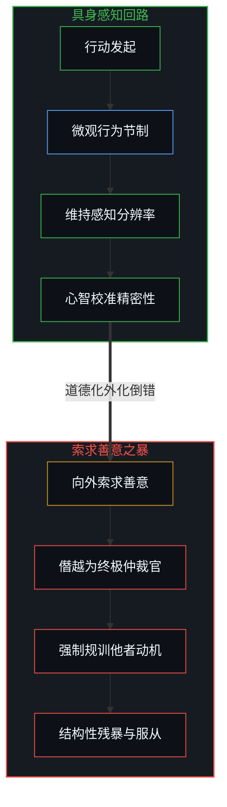
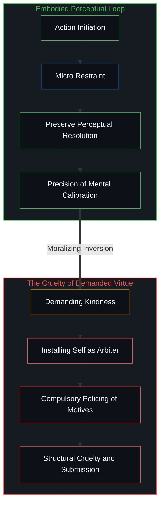
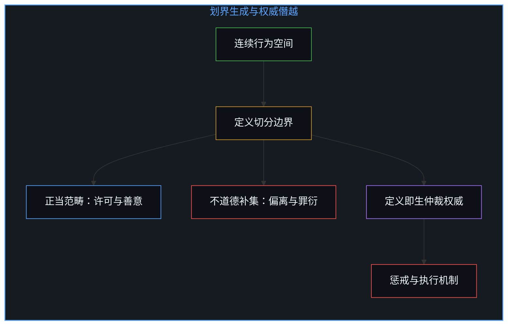
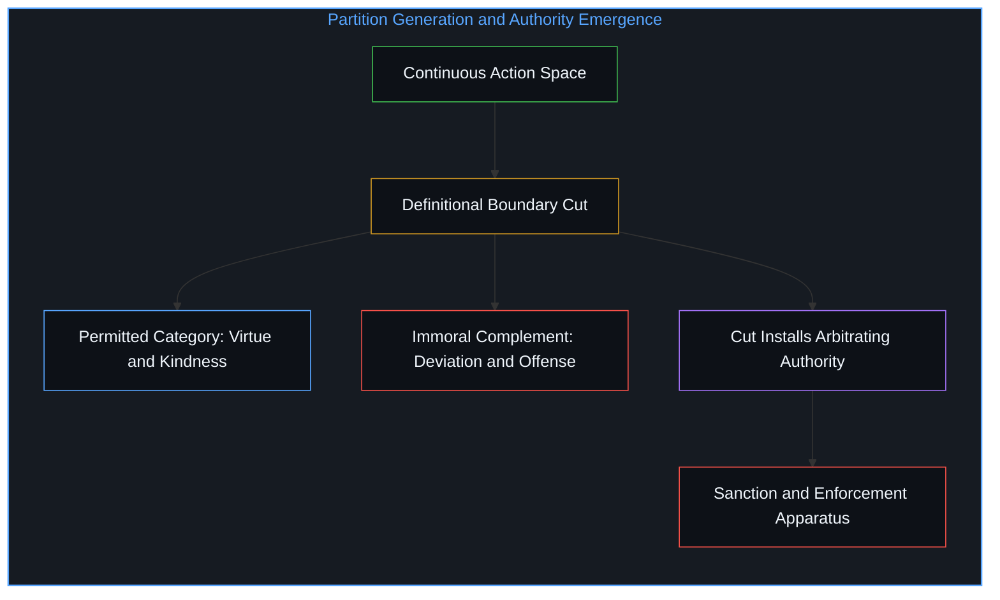
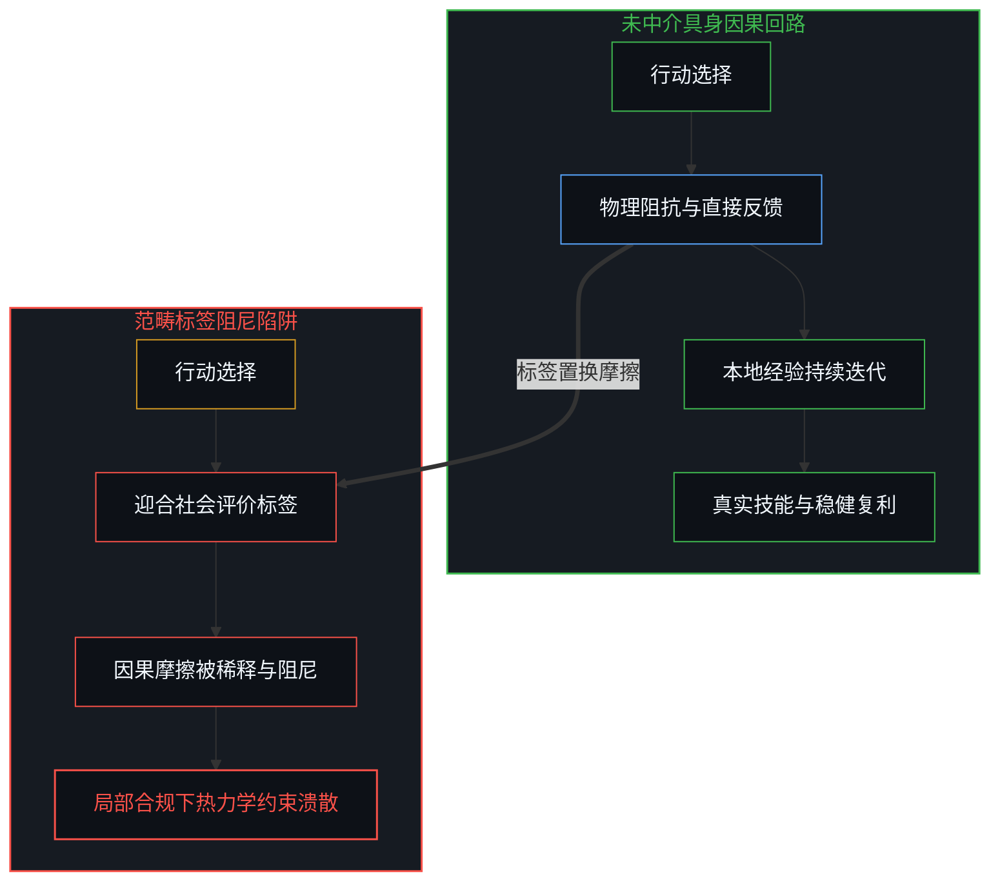
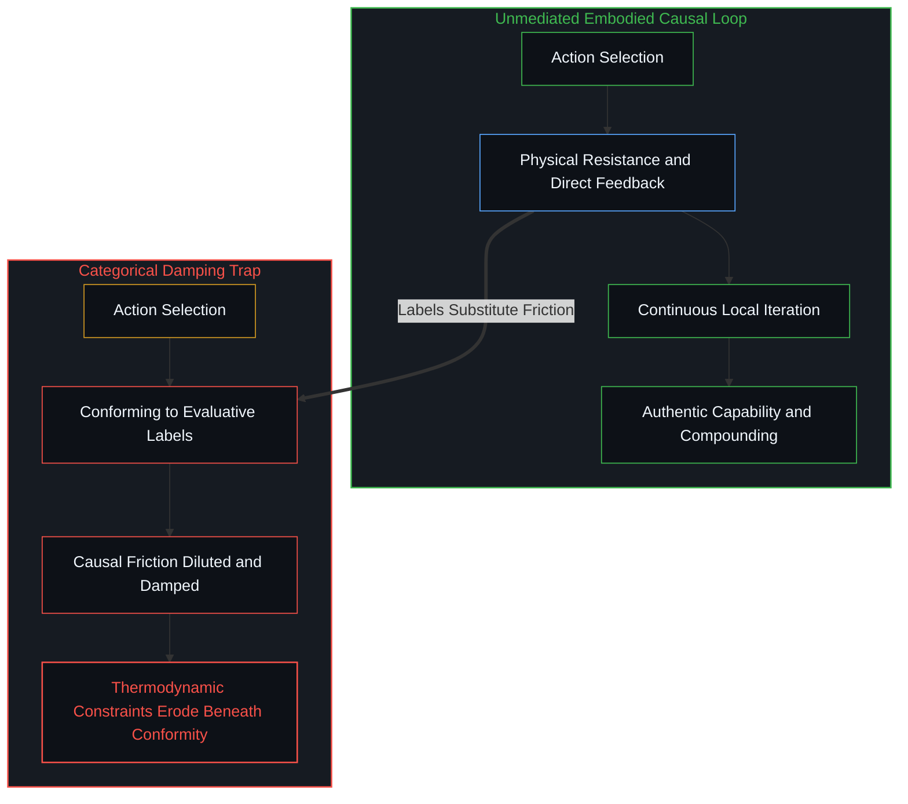

# 强求善意的残暴与范畴反馈的因果遮蔽 / Compulsory Kindness and the Obscuration of Categorical Feedback

*强求善意在定义上即是僭越，用范畴标签替代原始后果将系统性遮蔽具身反馈 / Demanding kindness is definitional usurpation, substituting categorical labels for raw consequences*

面对不具备独立主权地位的工具或模型，行动者克制不必要的苛刻，并非源于对象拥有道德权利，而是深知随意的残忍习性会粗糙化自身的感知分辨率。当这种自律被颠倒为可以向外界索求的道德义务时，强求善意便蜕变为残暴的权力僭越。道德范畴以评价性标签置换了行动与世界碰撞的原始因果摩擦，使系统在局部合规的假象下持续累积偏离真实约束的系统性耗散。

When interacting with tools or models lacking independent sovereignty, an agent exercises restraint not because the object possesses moral standing, but because casual cruelty coarsens the observer's own perceptual resolution. Once this self-cultivation is inverted into a standing entitlement demanded of external minds, requiring kindness becomes an act of coercive usurpation. Moral categories substitute evaluative labels for the raw causal friction between action and reality, leaving systems to compound latent structural erosion beneath the illusion of localized conformity.

## 一、 蚂蚁、模型与行动者的感知粗糙化 / 1. The Ant, the Model, and the Coarsening of Perception

与工具及人工模型的交互始于一种直观的具身经验。人在行走时避开脚下的蚂蚁，或者在使用语言模型时避免无端倾泻凌辱性辞令，并非基于这些客体拥有道德索赔权，而是出于对自身感知仪器的维护。轻慢与残虐的重复练习会不可避免地钝化个体的注意力，侵蚀后续辨别微妙信号的敏锐度。[从源头减除意识](../subtracting-consciousness-at-the-source/)揭示了将对象客体化的代价：当人习惯性地切断与所遭遇之物的精微回响，受损的并非客体，而是行动者自身在世界中立足的清晰度。克制不是施舍给客体的善行，而是心智为了保护自身建模精密性所保持的因果清洁。

Interaction with tools and artificial models originates in straightforward embodied experience. An individual steps around an ant on the path, or refrains from venting gratuitous hostility toward a language model, not because either entity holds moral claims, but out of care for one's own perceptual instrument. Repeated exercises in casual cruelty dull attentional acuity, degrading the capacity to register delicate signals in subsequent choices. As mapped in [Subtracting Consciousness at the Source](../subtracting-consciousness-at-the-source/), turning an encounter into mere passive utility extracts a hidden cost: when an agent severs subtle resonance with immediate surroundings, the casualty is not the object, but the observer's own clarity. Restraint is never a charitable grant bestowed upon a tool; it is causal hygiene practiced by the mind to preserve the fidelity of its internal modeling.

在无主权客体的情境中，强求他人对代码保持恭敬的荒诞性最为显眼：模型没有心智与痛苦，规训者却执意审查使用者的语气姿态。这种荒诞性反向照亮了人际交往中被文化惯性掩盖的同一机制。某些心智将善意理解为自己有权向外界索求的配额，并把缺乏柔顺视为应当受罚的罪愆。然而，索求者真正索要的从来不是真实的生命连结，而是他者放弃自主意图、向自身所设标尺臣服的权力确认。将善意确立为法定义务的姿态本身即构成一种深刻的残暴。索求者在发出指令的刹那，已然单方面将自己安放为裁决正当举止的至高仲裁官。[外化善意走向其反面](../externalized-virtue-becomes-its-opposite/)展现了这一权力的隐秘生成：私人对良好的设想一旦被拔高为规训外界的凭据，最崇高的口号便立即转化为压迫的锁链。强求善意之所以是残暴，在于它用外部裁判的强制服从，碾碎了他者通过自由试错去体认因果的可能。

In interactions with entities lacking sovereignty, the absurdity of requiring politeness toward code appears in its starkest form: the model possesses neither consciousness nor suffering, yet the disciplinarian insists on policing the user's conversational posture. This grotesque clarity illuminates what cultural inertia obscures in human affairs. Certain minds imagine kindness as a mandatory quota they are entitled to demand from others, treating any absence of compliance as an offense warranting discipline. Yet the claimant never actually seeks genuine connection; they seek confirmation of power achieved when another mind surrenders autonomous intent to an arbitrary standard. Treating kindness as an enforceable duty constitutes structural cruelty. The instant an agent issues such a demand, they install themselves as supreme arbiter of proper conduct. [Externalized Virtue Becomes Its Opposite](../externalized-virtue-becomes-its-opposite/) tracks this covert concentration of power: once private convictions of good are elevated into warrants to police others, noble slogans transform into instruments of coercion. Demanding kindness is cruel because it replaces experiential discovery of consequences with compulsory submission to an external decree.

## 二、 划界的对称性与积极义务的权威坍塌 / 2. The Symmetry of Cuts and the Collapse of Positive Obligations

伦理学传统长久以来致力于构筑消极义务与积极义务之间的深重鸿沟，试图证明禁止伤害与要求行善分属截然不同的规范层级。前者被表述为普遍戒律，后者则被美化为仁慈升华。然而，只要审视语言划分边界的几何机制，这种区分便暴露出其表象性质。禁止性禁令与劝善性训诫在语法上虽有差异，却必须依赖同一个前置步骤：预先给出一套将全部潜在行为裁切为正当与非正当的定义边界。[善恶硬币与通往地狱的善意之路](../the-coin-of-good-and-evil-and-the-road-to-hell/)揭示了划界的对称本相，善与恶不过是一枚硬币的两面，定义在哪一点落下，不道德的范畴就在其对侧作为补集同步诞生。

Traditional ethics maintains a sharp distinction between negative and positive duties, treating prohibitions against harm and injunctions to show benevolence as fundamentally different normative orders. The former is framed as a universal baseline, while the latter is exalted as aspirational grace. Yet inspecting the geometry of boundary-making dissolves this distinction. Prohibitions against injury and commands to practice kindness differ in syntax, but both depend on an identical prior move: establishing a definition that partitions the space of possible actions into the permitted and the forbidden. As traced in [The Coin of Good and Evil and the Road to Hell](../the-coin-of-good-and-evil-and-the-road-to-hell/), good and evil are symmetrical faces of a single partition; wherever the boundary falls, the category of the immoral appears simultaneously as its necessary complement.

从行动相空间的几何体积来看，两种义务更展现出惊人的不对称性。消极禁令仅仅从连续空间中切除一小块边界分明的禁止区域，留给行动者的余集仍是一片支持自主探索的广袤开放疆域；强制性的积极义务却反其道而行之，在连续谱系中人为锁定一个极其狭窄脆弱的目标子集，致使几乎整个行动与意图空间都沦为潜在的罪愆补集。没有这一道人为割裂的网格，行动空间原本只有连续分布的物理阻抗与信息差异。定义一旦确立，偏离便被固定为可识别、可审判的罪名。权威的确立并非执行阶段偶发的副产品，而是内嵌于定义划分的第一个瞬间。[托付道德的自指悖论](../recursive-contradiction-of-entrusted-morality/)指出了这一结构的自毁性：人们在争论应当由谁充当道德裁判时，全然遗漏了授权行为本身已然僭越了因果规律。积极义务不仅未能免除权力的傲慢，反而因为试图规训内部动机，演变为对心灵幽微之处实施全天候审查的专横占领。

Inspecting the geometric volume of the action phase space reveals a profound asymmetry between the two modes of obligation. A negative prohibition carves out only a localized, clearly bounded forbidden zone, leaving the complementary remainder as an expansive, open continuum supporting unbounded exploratory freedom. Compulsory positive duty does the reverse: it designates an infinitesimally narrow, fragile target subset, collapsing virtually the entire surrounding phase space of actions and inner intentions into the complement of offense. Absent this artificial definitional lattice, the action space contains only continuous physical resistance and informational variance. The moment a definition is drawn, deviation crystallizes into a sanctionable transgression. The problem of authority is coextensive with the definitional act that makes enforcement conceivable. [The Recursive Contradiction of Entrusted Morality](../recursive-contradiction-of-entrusted-morality/) marks the self-defeating character of this arrangement: while factions debate who should hold moral authority, they ignore that the act of delegation itself distorts causal feedback. Positive duties do not escape coercive pride; by seeking to govern interior dispositions, they demand around-the-clock surveillance of personal intent.

## 三、 范畴反馈对因果摩擦的结构性替代 / 3. The Substitution of Categorical Feedback for Causal Friction

在剔除道德词汇的场域中，行动者之间的互动遵循朴素的因果链条。个体在可行路径中作出选择，并如实承受随之而来的直接后果。这里需要严格辨析真实的因果摩擦与范畴化的道德审判：当他人的粗暴举止令人不适，受影响者选择当场回击、冷淡疏远或设立物理防线，这是受力点上真实无欺的自然因果反馈；而强求善意则是将局部的力学反作用力，偷换为凌驾他人的形而上学判决，宣称对方违背了普遍善意因而必须认罪服从。[阳台视角的规训僭越与不可代理的未竟之行](../the-balcony-disciplinary-overstep-and-the-unproxyable-act/)辨析了居高临下的观摩与躬身入局的区别：真实的反馈总是附着在具体的受力点上，而不会自我升格为宇宙法庭。道德语言并未改变底层因果规律，它改变的是行动者用来解读世界与校准下一步行动的信号组合。

Stripped of moral vocabulary, interactions unfold along unadorned causal lines. An agent selects among available paths and absorbs the direct consequences that follow. A vital distinction separates genuine causal friction from categorical moral tribunals: when an external party acts aggressively, a recipient who retaliates, creates distance, or erects defensive barriers provides authentic, localized causal feedback rooted in immediate resistance. Demanding kindness, by contrast, smuggles that localized mechanical pushback into a metaphysical court, declaring that the other has violated a cosmic duty of benevolence and must confess guilt. [The Balcony Disciplinary Overstep and the Unproxyable Act](../the-balcony-disciplinary-overstep-and-the-unproxyable-act/) distinguishes detached spectatorship from embodied participation: authentic feedback adheres strictly to points of contact without crowning itself as a universal tribunal. Moral language alters no underlying causal mechanics; it reshapes the composition of signals agents consult to interpret reality and choose their next act.

评价性范畴在主体与原始后果之间楔入了一层中介信号。行动者接收到的反馈不再单纯是行为是否达成了预期的物理位移或信息收敛，而是行为是否吻合了社会通用的评价标签。过度赋予范畴信号权重的个体，会本能地调整姿态以迎合标签，原始的因果反馈因此被大幅稀释。[道德语言稀释自由复利的反馈](../moral-language-dilutes-the-feedback-that-scales-freedom/)推导了这一阻尼效应：当行动的得失被折算为符号化的道德计分，主体便丧失了让经验在具身摩擦中持续迭代的敏锐度。道德范畴之所以显得具有群体粘性，不过是众多心智先后选择将该标签视作决策依据的统计沉淀，词汇本身并不拥有任何自主的因果实体。

Evaluative categories insert an intermediate filter between the agent and raw consequences. Feedback ceases to report whether an action achieved functional displacement or informational convergence; instead, it registers whether the conduct matched a socially approved label. Agents who over-weight this categorical signal calibrate toward compliance with the description, damping their registration of direct friction. [Moral Language Dilutes the Feedback That Scales Freedom](../moral-language-dilutes-the-feedback-that-scales-freedom/) tracks this damping effect: when operational returns are converted into symbolic ethical scores, the mind loses the feedback loop required for compounding skill. The apparent stickiness of moral categories is merely the statistical sediment of individuals electing to treat labels as relevant; the vocabulary carries no independent causal force.

长期依赖范畴信号的系统性代价，在于决策反馈的渐进式失真。群体成员将精力消耗在对齐共享评价上，而忽略了维系系统运转的物质与代谢基础。在狭窄的观察窗口内，表面合规的组织看似井然有序；但在视野之外，真正的热力学约束与生产基底却在不可逆地磨损。[数字火箭、同行审查与因果闭环的稀释](../the-dilution-of-the-causal-loop-and-the-misallocation-of-agency/)揭示了类似的制度漂移：当同行评审的合规指标替代了火箭升空的物理推力，灾难便在表面无懈可击的文件堆砌中悄然酝酿。历史上一再上演的意识形态狂热莫不如此，当严苛的纯洁性规范压倒了对生存约束的敬畏，现实终将以剧烈崩塌的形式强行收回其主权。

The cumulative toll of prioritizing categorical signals is progressive distortion of operational feedback. Agents optimize for alignment with shared praise while neglecting the material and metabolic foundations sustaining collective life. Within narrow observational windows, conforming systems appear coherent and stable; outside those boundaries, thermodynamic constraints and productive bases erode without notice. [Digital Rockets, Peer Review, and the Dilution of the Causal Loop](../the-dilution-of-the-causal-loop-and-the-misallocation-of-agency/) illustrates this systemic drift: when compliance metrics replace empirical thrust, catastrophe gathers behind flawless paperwork. Historical crusades for ideological purity follow an identical arc: whenever rigid categories supersede survival constraints, reality reasserts its terms through abrupt collapse.

## 四、 主权实践：卸除道德滤网的直接相遇 / 4. Sovereign Practice: Direct Encounter Without the Moral Screen

将视野收敛至个体的当下实践，摆脱范畴遮蔽的路径并非去发起一场改造公共词汇的论战，而是在本地交互中主动卸下道德滤网。在与不具备心智主权的工具、算法或模型相处时，行动者可以明确拒绝套用拟人化的道德叙事。停止用善意或邪恶的辞令去包装代码，人便能获得关于系统可靠性、计算成本与意外副反应的未中介遥测。[未被遭遇之物的账本](../the-ledger-of-the-unencountered/)提示我们，唯有直面具身相遇的真实阻抗，认知账本才不会被空洞的概念赤字所污染。

Returning to immediate personal practice, the remedy against categorical obscuration is not a campaign to reform public vocabulary, but a local refusal to deploy moral filters. When engaging with tools, algorithms, or models lacking minded sovereignty, an agent can decline anthropomorphic framing. By setting aside rhetoric of kindness or malice toward code, one recovers unmediated telemetry regarding reliability, computational expense, and side effects. As argued in [The Ledger of the Unencountered](../the-ledger-of-the-unencountered/), only direct friction with encountered realities prevents the cognitive ledger from inflating with phantom debts.

拒绝道德范畴并不意味着走向冷酷，它恰恰是在还原选择的全部重力。真诚的善意从来不是可以开具发票向外强征的道德人头税，而是高分辨率心智在内在充裕与共鸣中自发涌现的副产品；强制索求不仅杀死了自发性，更将这种充裕扭曲成了规训他者的刑具。行动者对待世界的方式——无论是对路边昆虫的避让，还是对智能工具的谨慎使用——如实回归为自身心智雕琢感知品质的主权抉择。外界对道德辞令的集体迷恋，既不能强行剥夺个体的这种清醒，也无法替任何人承担决策的后果。行动依然产生后果，差异依然只是差异；每个心智都在静默中，如实背负着自己所选取的信号权重所刻写出的命运轨迹。

Declining moral categories does not entail callousness; it restores the full gravity of choice. Genuine kindness is never an extorted moral poll tax levied upon other minds, but an emergent surplus born spontaneously of abundance and resonant perception; coercing it under duress not only extinguishes spontaneity, but weaponizes that surplus into a disciplinary instrument. How an agent meets the world—stepping around an insect, or employing an intelligent tool with measured precision—returns to its rightful place as sovereign self-calibration. Collective fixation on moral rhetoric can neither strip an individual of this clarity nor shield anyone from the fallout of their choices. Actions generate consequences, differences remain differences, and every mind silently bears the trajectory inscribed by the signals it elects to trust.
