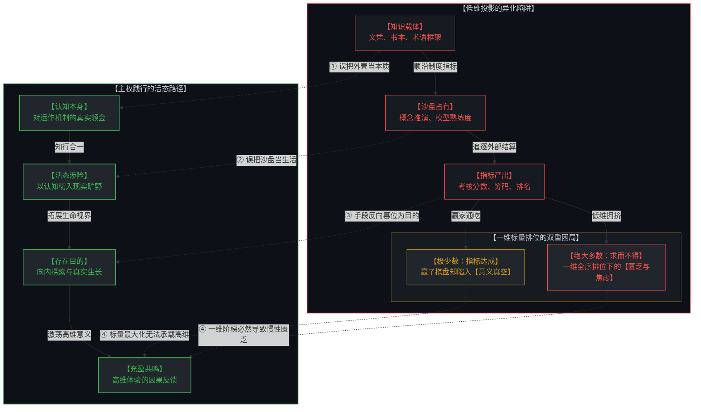
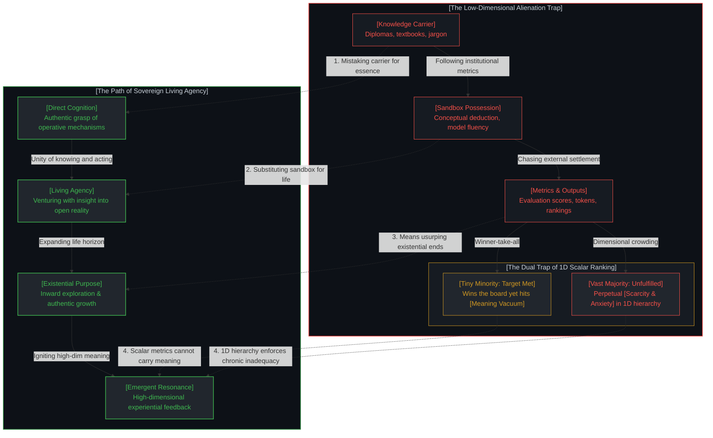
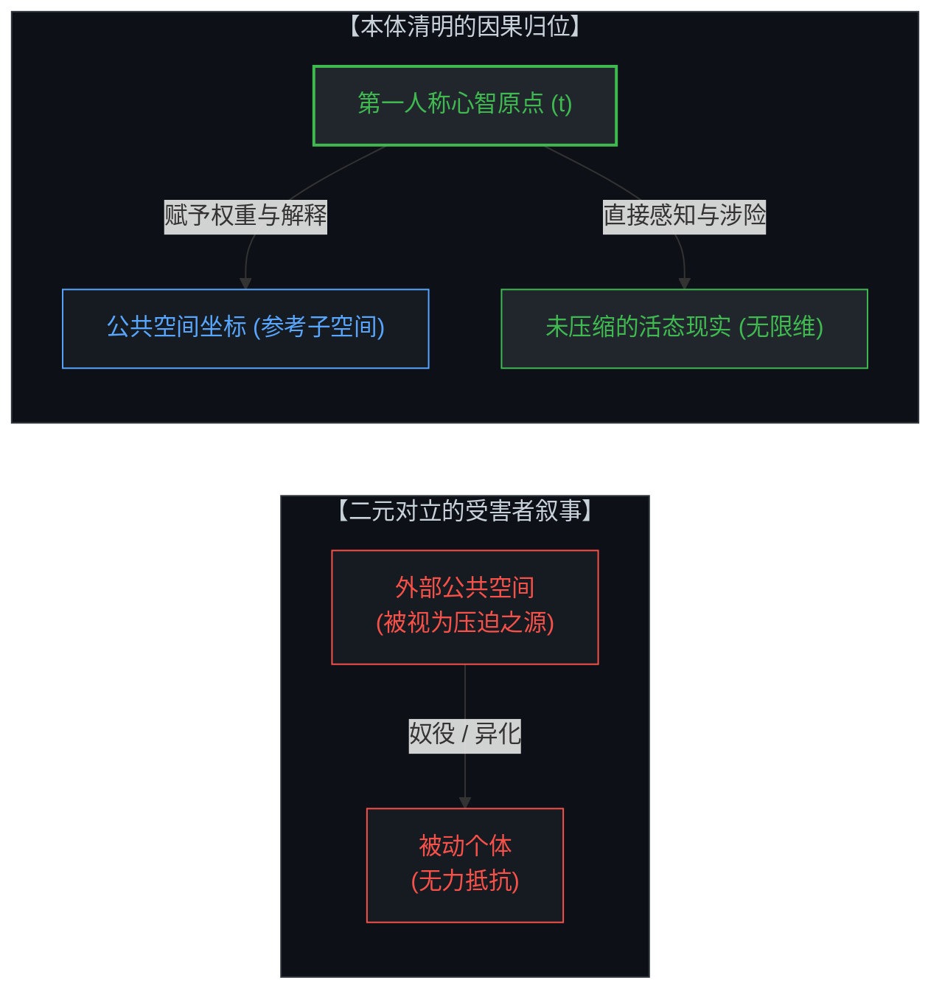
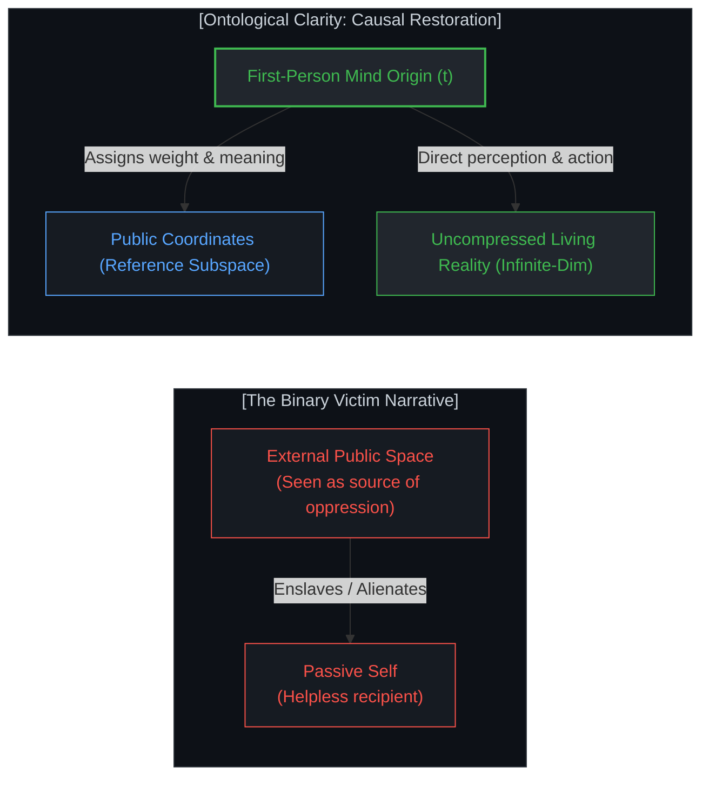
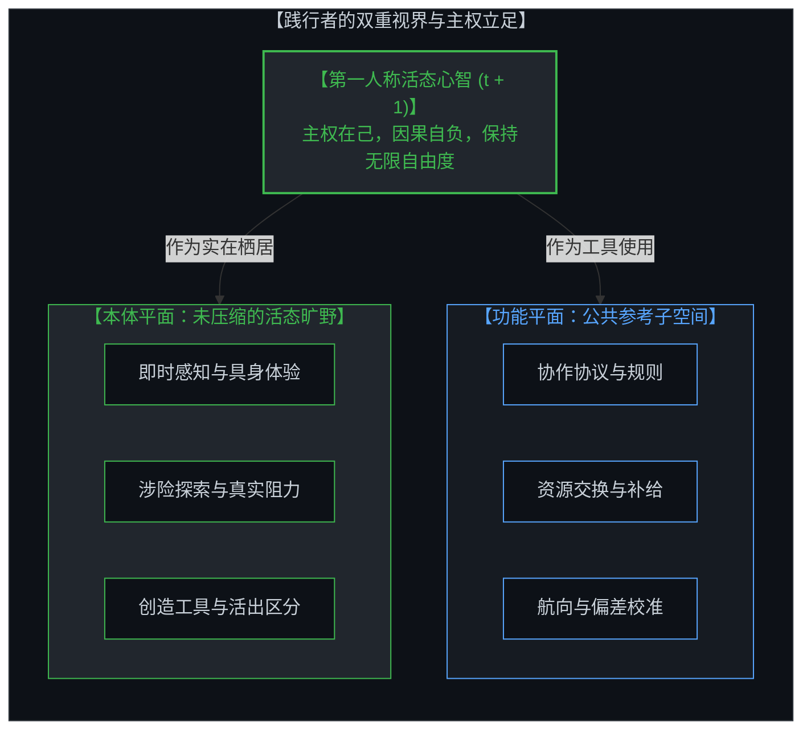
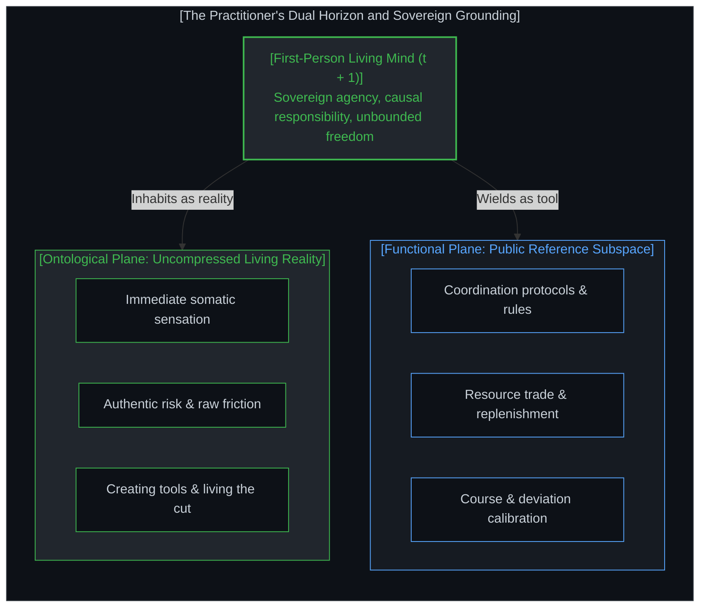

# 坐标系、心智与自由度：走出公共空间的投影迷途 / Coordinate Systems, the Mind, and Degrees of Freedom: Navigating Beyond the Projections of Public Space

*从有损压缩的标量指标到第一人称的活态涉险：作为实践者的坐标校准与主权立足 / From Lossy Compression to Living Agency: Calibrating Coordinates and Standing in First-Person Sovereignty*

---

## 一、 维度灾难、有损压缩与指标的因果异化 / 1. The Curse of Dimensionality, Lossy Compression, and the Causal Alienation of Metrics

在系统论与信息论的视角下，人类在第一人称体验中所面对的原初现实，是一个拥有无限维度的连续体：即时的神经电位、微妙的直觉起伏、不可言传的身体感知、无预设目的的探索，以及生命在瞬息万变的环境中所经受的实时交互。

然而，由制度规范、量化考核、公共舆论与社会分工构成的**公共空间**，为了实现低成本的群体协同与大规模资源调配，必须对这片无限维度的活态现实施加极具侵略性的**有损压缩（Lossy Compression）**。它将个体丰富深邃的活态存在，强行投影到极少数离散的标量维度之上：头衔、薪酬、学分、排位、声望与关注度。

在这套超低维投影的固化过程中，原本拥有无限探索自由度的生命，极易在不经意间步入一套环环相扣的认知倒置：

1. **把知识的载体当成认知本身**：将文凭、论著、学术头衔与术语体系等易于在公共空间流通与定价的外壳，误当成对机制的领悟。一旦离开既定的符号评级系统，心智便丧失了直接判别现实阻力的能力。
2. **把模型的掌握替代活态涉险**：不再借助认知之刃去触碰未经修饰的真实世界，而是蜷缩在概念地图里推演沙盘。以掌握抽象模型的熟练度，替代了生命在不确定性中的真实涉险与知行闭环。
3. **把运用的产出篡位为存在目的**：古德哈特定律在此发生显著的反噬效应——量化的筹码、考核的绩点与社会的赞誉，原本只是航海过程中的中间导航信标，却被反向确立为存在的终极归宿。生命在不知不觉中被退化为追求单一标量最大化的效能单元。
4. **一维全序排位下的双重困局**：需要指出的是，“指标达成”仅仅是极少数胜出者的特权，而绝大多数人终其一生都在追逐中求而不得。这是低维投影在几何上的必然结果：
   * **一维标量必然导致全序排位**：在无限维的真实旷野中，心智拥有无数正交方向可供探索与共存；然而一旦被压缩至单一维度的标量轴（财富、分数、头衔），所有人便被迫置身于同一条狭窄的单向梯队之中，分层排序随之硬化。
   * **极少数胜出者的“意义真空”**：“意义”本质上是高维活态体验在因果反馈中所激荡出的共鸣，无法被极低维度的标量所承载。即便赢得了所有筹码，其底层的生命感知系统依然处于极度饥渴的状态，虚无感随之降临。
   * **绝大多数人的“求而不得”与慢性匮乏**：在几何上，标量阶梯的顶端永远只有极少数席位。绝大多数人被困在与前列者的持续对比中，长期承受“遥遥落后”的焦虑、挫败与自我否定。这种痛苦并非由于个人能力不足，而是源于心智误将一条拥挤的一维投影当成了整个宇宙。

---

From the perspective of systems theory and information theory, the primary reality encountered in first-person experience is an infinite-dimensional continuum: immediate neural firings, subtle intuitive shifts, tacit somatic feedback, unscripted exploration, and the fluid, real-time friction of a living organism interacting with an ever-changing environment.

However, the **public space**—constituted by institutional protocols, quantitative performance reviews, societal discourse, and the division of labor—must apply aggressive **lossy compression** to this infinite-dimensional living reality in order to achieve low-cost coordination and scalable resource allocation. It forces the deep, multidimensional presence of the individual into a handful of discrete, scalar coordinates: job titles, compensation bands, grade point averages, leaderboard rankings, and prestige metrics.

Throughout the institutionalization of this ultra-low-dimensional projection, the living consciousness—originally endowed with unbounded degrees of exploratory freedom—easily falls into a cascading series of cognitive inversions:

1. **Mistaking the Carrier for Cognition**: Conflating credentials, publications, academic titles, and standardized terminologies—outer shells designed for friction-free circulation and pricing in public arenas—with an authentic understanding of operative mechanisms. Detached from the established rubric, the mind loses the agency to directly gauge concrete friction.
2. **Substituting Model Fluency for Living Risk**: Ceasing to use understanding as a sharp edge to engage raw reality, retreating instead into the safety of conceptual sandboxes. Mastering formal abstractions replaces the vulnerable exposure and causal feedback loop of genuine living.
3. **Elevating Instrumental Outputs to Existential Ends**: Goodhart’s Law triggers a profound cognitive inversion: quantitative scores, evaluation metrics, and social approval—originally mere intermediate navigation beacons—are crowned as the ultimate purpose of existence. The individual is reduced to an optimization unit chasing a 1D scalar maximum.
4. **The Dual Trap of 1D Scalar Ranking**: It must be emphasized that "metric completion" is a privilege reserved for a tiny minority; the vast majority spend their entire lives striving yet falling short. This is the geometric inevitability of dimensional collapse:
   * **1D Scalars Enforce Total Ordering**: In the infinite-dimensional wilderness of reality, minds have countless orthogonal directions to explore and coexist without conflict. But once compressed onto a single scalar axis (net worth, test score, corporate rank), everyone is forced onto a single narrow ladder, calcifying rigid hierarchical sorting.
   * **The "Meaning Vacuum" of the Tiny Winning Minority**: "Meaning" is an emergent resonance generated through high-dimensional experiential feedback; it cannot be sustained by compressed scalar markers. Even after capturing every prize on the board, the underlying sensory apparatus remains starved, and existential hollows inevitably open.
   * **The Perpetual Scarcity and Chronic Inadequacy of the Vast Majority**: Top rungs on a scalar ladder are mathematically scarce. The vast majority remain trapped in relentless upward comparison, burdened by chronic anxiety, exhaustion, and the feeling of lagging hopelessly behind the leaders. This suffering is not a personal deficiency, but the mathematical consequence of mistaking a crowded 1D projection for the boundless universe.

---

## 二、 认识论的原点：始于心智，止于心智 / 2. The Epistemological Origin: Begun by Mind, Sustained by Mind

面对这种由低维指标带来的异化感，常见的反应大多停留在浪漫主义式的二元对抗之中：将公共竞技场视作吞噬个性的泥潭，呼吁人们割裂社会规则，逃遁到某种被理想化的“原生旷野”。

然而，这种对抗性的逃避依然停留在浅层表象，其底层的未审前提依然是受害者视角——即假定“外部环境具备奴役自身的主动力量”。若将认识论推进到底层因果，这种内外对立便自行消解：

> **我们所体验的世界始于心智，止于心智，从来未曾离开过心智。**

无论是公共空间中严苛的规章、胜负的排位与权力的博弈，还是漫步于林野之间清风拂面的自然感知，在认知结构上，全都是第一人称心智依据感官输入所构建的**内部认知表征（Mental Representation）**。

* **不是棋盘困住了个体，而是个体的心智将低维投影误认为了本体。**
* 异化从来不是外在实体强加的镣铐，而是心智将自身的主权让渡给低维符号之后所产生的认知幻象。

当看清这一点，所有的外在归因与受害者叙事便随之消解：既然整个经验世界由心智在此刻生成并赋予意义，那么**个体必须且只能为自己生命的因果负全责**。你赋予什么以权重，你的现实便由什么构成；你若把生命的全部价值抵押给外部投影，你便只能承受投影带来的窄化与窒息。

---

Faced with the alienation induced by low-dimensional metrics, the standard reaction often retreats into a romantic, binary rebellion: decrying the public arena as a soul-crushing swamp and advocating an escapist flight to some idealized, unspoiled "wilderness".

Yet this adversarial stance remains superficial. It rests on an unexamined victim narrative that assumes external systems possess innate agency to subjugate consciousness. When epistemology is traced back to its causal bedrock, this internal-versus-external dichotomy dissolves:

> **The world we experience begins in Mind, ends in Mind, and never departs from Mind.**

Whether dealing with institutional hierarchies, leaderboard ranks, and corporate dynamics, or experiencing the crisp air and rustling leaves of an unpaved forest, every perceived phenomenon is, at the structural level, an **internal mental representation** synthesized by the first-person conscious Mind from sensory signals.

* **It is not the chessboard that imprisons the individual; it is the mind that mistakes a compressed shadow for living ground.**
* Alienation is never an objective physical entity imposed from the outside; it is a perceptual trap generated when awareness surrenders its causal sovereignty to external symbols.

With this realization, external blame and victim narratives disintegrate. Because the entire phenomenal horizon is continuously generated and weighted by Mind in the living present, **the individual is fundamentally and solely responsible for their own causal existence**. Whatever you assign weight to becomes your reality; if you pledge your core agency to a compressed projection, you must endure the claustrophobia of that narrow slice.

---

## 三、 主客归位：公共空间作为最稳定的参考子空间 / 3. Restoring Subject and Object: Public Space as the Anchored Reference Subspace

看破低维投影的局限，并不意味着否定公共空间的效用，更无需走向虚无主义或消极避世。

公共空间是人类文明历经漫长试错与演化、为了抵御混乱和降低协作摩擦而形成的最大公约数协议。正因为它实施了激进的降维与有损压缩，剥离了大量模糊的噪声，它才具备了高度的信息对齐度、可预测的反馈回路与清晰的交互逻辑。

因此，作为哲学的践行者，关键在于完成主客关系的因果归位：

| 认知维度 | 沉溺者的视角（让渡主权） | 践行者的视角（因果自负） |
| :--- | :--- | :--- |
| **空间定位** | 公共空间 = 真实的全貌与终极人生赛场 | 公共空间 = 降维后清晰稳定的**参考子空间** |
| **规则性质** | 决定个人价值与存在高下的终极法庭 | 降低群体协同与生存摩擦的低成本交互协议 |
| **认知关系** | 囤积知识载体，作为向外界证明自身资质的筹码 | 借认知之刃切入真实，去实践、去探索、去生活 |
| **主体归属** | 棋子：被外部评判、绩效与指标驱赶奔走 | 导航者：手握外部坐标校准自身，向深处拓展自由度 |

公共空间从来不是审判生命的法庭，而是航海日志里的**经纬度与灯塔**。它足够稳定、足够清晰，便于心智校准行动的偏差、换取生存的补给、完成群体的协同与结算。

---

Seeing through the illusions of low-dimensional projections does not imply rejecting the utility of public space, nor does it justify retreating into cynicism or passive escapism.

Public space is the lowest-common-denominator protocol forged through millennia of civilizational trial and error to counter entropy and minimize the friction of collective cooperation. Precisely because it aggressively compresses reality and strips away ambiguous noise, it provides sharp informational alignment, predictable feedback loops, and transparent rules of interaction.

For the active practitioner of philosophy, the task is to restore the causal relationship between subject and object:

| Cognitive Dimension | The Entangled View (Surrendered Agency) | The Sovereign Practitioner (Causal Responsibility) |
| :--- | :--- | :--- |
| **Spatial Stance** | Public space = Total reality and ultimate arena | Public space = Highly compressed, stable **reference subspace** |
| **Nature of Rules** | Authoritative tribunal ruling on personal worth | Low-cost coordination protocol reducing friction |
| **Use of Knowledge** | Hoarding credentials to prove worth to external arbiters | Wielding understanding as a blade to act, build, and live |
| **Locus of Agency** | The Pawn: Driven by external rubrics and leaderboard rank | The Navigator: Using coordinates to calibrate, exploring deeper dimensions |

Public space is never a courtroom judging existential validity; it is the **grid and lighthouse** recorded in your navigational log. It is sufficiently stable and clear for calibrating course deviations, securing material supplies, and settling mutual coordination without confusion.

---

## 四、 活态践行：手握坐标，向真实深处涉险 / 4. Living the Cut: Holding the Coordinates, Navigating the Uncharted

从记录中的“观察者”走向现实中的“践行者”，核心在于不再把概念地图当成生存家园，将生活的主动权完整交还于第一人称心智。

此时的心智，既不会在低维规则的名利得失中陷入精神崩溃，也不会在孤芳自赏中脱离现实社会。践行者从容行走于公共空间，遵守其协作协议，将其作为行动的稳固坐标；而在那套协议之外，心智拥有未被压缩的无限维度去感知呼吸、切入真实阻力、直面不确定性。

公共空间的棋盘依然清晰可见、运作良好，但心智早已不再是任人摆布的棋子。低维指标退回为便利的罗盘，而整个人生，自此展开为一场始于心智、忠于当下、在每一刻主动涉险的活态探索。

---

The transition from a detached observer tracing ideas to an active practitioner living them hinges on a single shift: ceasing to mistake the conceptual map for the home terrain, and restoring full causal sovereignty to first-person consciousness.

In this stance, the mind is neither shattered by the inevitable swings of fortune within low-dimensional scoring systems, nor alienated in self-righteous detachment from practical society. The practitioner navigates public arenas with poise, honoring their protocols as reliable reference frames for action and trade. Meanwhile, beyond those operational boundaries, the mind commands uncompressed dimensions of awareness—experiencing somatic rhythm, facing genuine friction, and stepping boldly into the unknown.

The public chessboard remains crisp, legible, and fully operational, but consciousness is no longer an unwitting piece moved across its squares. Low-dimensional indicators are restored to their proper role as convenient navigational instruments, while existence unfolds as an ongoing inquiry—initiated by Mind, anchored in the present, and actively lived at every step.