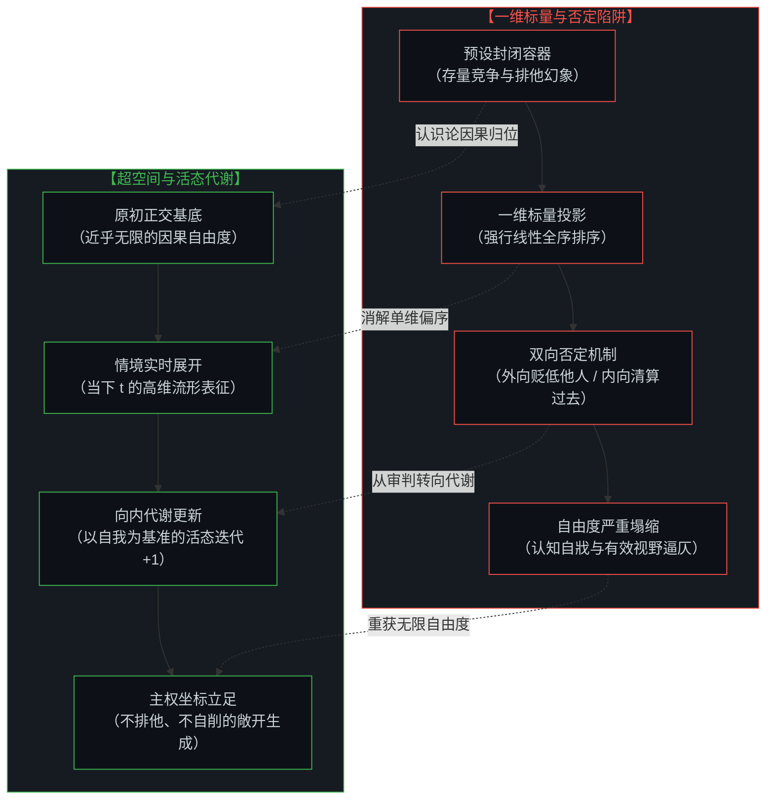
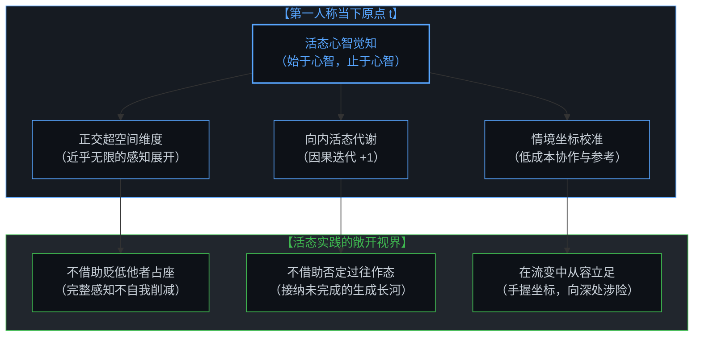

# 流动中的坐标：关于“否定”、降维与心智的自我锚定 / Coordinates in Flux: On Negation, Dimensional Collapse, and the Mind's Self-Anchoring

*从自指审判的元反思陷阱，到超空间的正交展开：看清否定机制中的自我削减，在无尽流变中立足活态代谢的原点。 / From the meta-reflexive trap of recursive judgment to the orthogonal expansion of hyperspace: tracing how negation reduces the self, while anchoring sovereign agency in living metabolic renewal.*

在公共交流与社交场域中，对“贬低他人是一种低成本优越感”的反思时常引发广泛共鸣，然而这一命题在确立的瞬间便滑入了自指的怪圈——借由定义他人的“低成本”，自身已悄然占领了道德与智识的高地。紧随其后的无论是向外指认他人，还是向内清算过去的自己，本质上都在依赖“否定”来换取一维标量轴上的相对排位。在底层近乎无限的正交自由度中，万物本无全局高下，所谓的优越感不过是将丰富流形强行压入一维数轴后的自戕性损耗。正如在 [坐标系、心智与自由度](../coordinate-systems-mind-and-degrees-of-freedom/) 中所厘清的，公共坐标是航海的经纬与参考，而非定罪生命的法庭；唯有将否定从审判的法庭还原为活态系统的内向代谢引擎，心智才能在变动的现实中确立坐标，在不向外排挤、不向内削减的从容中，向无尽的可能敞开。

In public discourse, critiques exposing denigration as a "low-cost bid for superiority" evoke instant resonance, yet the proposition instantly entangles itself in a recursive self-referential trap—by classifying others' behavior as "low-cost," it tacitly secures its own moral and intellectual high ground. Subsequent reactions, whether pointing accusing fingers outward or moralistically purging one's past self, rely on the identical psychological reflex: manufacturing a sense of standing through negative comparison along a 1D scalar axis. Within the vast orthogonal degrees of freedom rendered by Mind, states simply differ without inherent scalar hierarchy; superiority is merely the self-destructive friction of crushing multidimensional reality onto a single line. As established in [Coordinate Systems, the Mind, and Degrees of Freedom](../coordinate-systems-mind-and-degrees-of-freedom/), public coordinates serve as navigational references rather than tribunals judging human worth; only by transforming negation from a punitive courtroom into the internal metabolic engine of a living cognitive system can the mind anchor a sovereign reference coordinate in flux—maintaining boundless degrees of freedom without outward exclusion or inward self-reduction.

---

## 一、 递归的审判席 / 1. The Recursive Tribunal

面对“贬低”这一现象，心智极易滑入层层嵌套的惯性之中。

起点源于命题本身的自指矛盾：以宣判他人的优越感为“低成本”，率先占据了认知的评判席位；
随之而来的第一种惯性是显性的转移：指认“身边到处是这样的人”。这种指认看似在剖析贬低，实则是借由对贬低者的声讨，顺理成章地占领道德优势，暗中置换出一份廉价的优越感；
第二种惯性则更为隐蔽，常常包裹在“深刻自省”的表象里：坦承“过去也曾如此”。在许多情境下，这种对过往的清算，并非真正开放的内省，而是通过踩踏“过去的自己”，来确立并确认“现在的自己”有多么清醒和通透。其底层逻辑依然在依赖否定来换取排位，只不过视角由向外投射转为了向内切割。

更具张力的是思辨层面的递归风险：一旦试图去归纳、定义何为“显性覆辙”与“隐性覆辙”，心智便很容易走向另一个隐秘的裁判席——以一种洞察全局的姿态，在概念的制高点上索取更高维度的智性优越感。

这种层层嵌套的“元反思陷阱”揭示出一个核心命题：为何一旦涉及认知与评价，心智无论是指向他人、指向过去的自身，还是指向思辨行为本身，都会不由自主地陷入靠“否定”来锚定位置的冲动？正如在 [大倒置的消解与活态哲学的开端](../the-dissolution-of-the-great-reversal/) 中所揭示的，只要心智把因果效力让渡给外部符号或静态标尺，就会不自觉地借助贬低外物来维系虚假的立足点。

When encountering the phenomenon of "denigration," consciousness easily slides into a multi-layered recursive trap.

The initial fracture stems from the self-referential paradox of the proposition itself: by categorizing someone else's bid for superiority as "low-cost," the speaker immediately assumes an unearned intellectual high ground.
Next comes the first overt inertia—projecting outward: declaring that "people like this are everywhere." While masquerading as ethical reflection, this condemnation of denigrators conveniently seizes moral altitude, covertly manufacturing a cheap sense of superiority.
The second inertia is more covert, frequently cloaked in the guise of profound self-examination: admitting that "I used to do this in the past." In many settings, this retrospective reckoning is not an open inquiry, but an aggressive stepping on one's past self to validate how lucid and enlightened the current self has become. Its operative mechanism still depends on negative comparison to extract a sense of standing, merely redirecting the weapon from an external target to an internal fracture.

Even more acute is the recursive risk at the level of philosophical inquiry: the moment one attempts to formalize and label these overt and covert traps, the intellect easily ascends another hidden tribunal—demanding a higher-tier intellectual superiority from the conceptual summit.

This nested meta-reflexive snare uncovers a fundamental question: why does the mind, whenever evaluating reality, reflexively grasp at "negation" to anchor its own position—whether directed at others, at its own historical footprints, or at the act of reflection itself? As explored in [The Dissolution of the Great Reversal and the Inception of a Living Philosophy](../the-dissolution-of-the-great-reversal/), whenever agency is outsourced to static external scales, the mind instinctively relies on diminishing external objects to prop up a counterfeit sense of ground.

---

## 二、 封闭容器与自我的削减 / 2. The Closed Container and the Inward Self-Reduction

这种冲动的根源，在于心智习惯于借助“否定”来完成排他性的自我确立。

用“否定”去立足的前提，是潜意识中将现实预设成了一个固定、封闭的容器。在这个存量有限的硬壳结构里，容积恒定不变。因此，当下的存在要确立自身，就必须在空间内挤出位置——要么将“他者”排挤出去，要么将“过去的形态”从版图中抹除。否定他人，便成了心智在存量竞争幻觉中最省力、最直观的立足途径。

然而，这本身是一种将现实物化的幻象。现实与心智的场域本是敞开且持续流动的。

心智所看见的“别人”，从来不是独立于心智之外的客观孤岛，而是心智自身在特定情境下选择投射与映射的显现，是经由他者所映照出的心智自身的一部分。心智所能感知、体验与理解的边界，构成了其认知的全部疆域。在敞开的流动中，通过割裂并排斥他人来确立自己，在逻辑上是无法自洽的。

每一次出于优越感的否定，看似压低了对方，实则是在心智自身的完整地图上人为割去了一块盲区。否定他人，本质上是在向内自我削减。越是急于借助排他来占座，心智所占据的有效视野反而越发逼仄。在 [破除概念的僭越](../po-chu-gai-nian-de-jian-yue/) 中我们看到，概念的牢笼正是由这种向内切割的排他性划界所筑成。

The root of this compulsion lies in the habitual reliance on negation to establish an exclusive self-identity.

Anchoring oneself through negation rests on the subconscious assumption that reality is a rigid, closed container. Within such a zero-sum, fixed-volume shell, space is strictly finite. For the present self to secure standing, it feels compelled to carve out room by force—either by expelling the other or by aggressively erasing past iterations of itself. Denigrating others thus becomes the most frictionless, reflexive tactic for claiming territory within the illusion of zero-sum competition.

Yet this premise is an objectified illusion. The field of consciousness and reality is inherently open and continuously generating.

The "other" perceived by awareness is never an isolated, freestanding object existing in an external void; it is a cognitive projection rendered by the mind within a specific situational context—a mirror reflecting an aspect of the mind's own operational field. The boundaries of what consciousness perceives, experiences, and understands define the total domain of its world. Within an open continuum, attempting to secure oneself by amputating and rejecting others is logically incoherent.

Every act of negation driven by a bid for superiority appears to diminish the other, but in truth, it cuts a blind spot into the mind's own territory. Negating the other is an act of inward self-reduction. The more desperately one relies on exclusion to seize a seat, the more suffocatingly narrow one's effective horizon becomes. As demonstrated in [Dismantling the Usurpation of Concepts](../po-chu-gai-nian-de-jian-yue/), the cage of rigid abstractions is forged precisely by this self-amputating boundary-making.

---

## 三、 降维排序：心智损耗的几何图景 / 3. Dimensional Collapse and Scalar Sorting: The Geometry of Cognitive Dissipation

从深层的因果拓扑来看，万物本只有“不同”，并无“高下”。

即使是心智感知中那些“非线性且开放的流形”，本质上也只是接近无限的正交二阶超空间（orthogonal binary hyperspace）在特定观测下的投影或统计表象。在这近乎无穷正交自由度的底层基底中，任何差异都只是状态在不同维度的正交展开与分布，在信息结构上根本不存在一个全局的标量偏序。

所谓的“高下”，实质是心智在统计表象之上，实施的又一次粗暴压缩——把原本在超空间投影中展开的丰富表象，强行压缩至一维的单轴线上进行线性排序。

任何低维投影都会不可逆地造成信息丢失与自由度的严重塌缩。而具有破坏性的损耗在于，这种压缩是自指且递归的：
心智对他人做出单维排序；
进而反思到这一行为，又为了确立清醒而对“过去的自己”再次压缩；
最后甚至试图对“这种递归反思”本身进行高下界定。

每一轮基于否定的排序，都是一次维度的自我折叠。心智不断舍弃掉自身广阔的自由度，把感知力收缩为一根逼仄的标尺。那些说出口的话最终落在自己脚下，像一道正在缩小的影子，这并非文学的比喻，而是心智在递归压缩中的必然代价：为了在一维数轴上占稳一个“比别人更靠前”的位置，代价是心智自身自由度的整体塌陷。

From the perspective of causal topology, things in reality exhibit qualitative differentiation, never inherent scalar hierarchy.

Even the rich, non-linear open manifolds perceived by awareness are projections or statistical macro-symptoms of a near-infinite orthogonal binary hyperspace under specific observation frames. Within this foundational manifold of vast orthogonal degrees of freedom, differences represent orthogonal distributions across distinct dimensions; in terms of informational structure, no global scalar partial ordering exists.

What humans label "superiority" or "rank" is a crude dimensional collapse—forcing the rich multi-axis projections of hyperspace onto a single 1D line for linear comparison.

Every low-dimensional projection irreversibly bleeds informational entropy and destroys degrees of freedom. The most destructive dissipation is that this compression is recursive and self-referential:
The mind subjects others to a 1D scalar ranking;
Reflecting on this, it subjects its own past self to another 1D compression to validate its newfound lucidity;
Eventually, it attempts to assign hierarchical value to the act of meta-reflection itself.

Each round of negation-driven sorting folds and collapses the mind's internal dimensions. Consciousness continually surrenders its vast degrees of freedom, shrinking perception into a rigid ruler. The judgments uttered end up falling at one's own feet like a shrinking shadow. This is not poetic metaphor, but the geometric price of recursive compression: in fighting for a position further ahead on a 1D line, the price paid is the catastrophic collapse of the mind's own degrees of freedom.

---

## 四、 生成的代谢，而非固化的标杆 / 4. Generative Metabolism, Not a Rigid Yardstick

既然如此，“否定”在心智的发展中究竟扮演着怎样的角色？

日常认知容易将“否定”视作一种排他性的截断。向外排斥他人，是对认知视野的自我限制；但向内的自我审视，性质却有所不同。

向内的审视并非对主体的审判与定罪，而是生成的起点。一个具备自省能力的认知系统之所以能够进化，正在于能够以自身为基准，在情境的反馈中持续迭代、修正与更新。失去这种向内的审视与更新，心智就会停滞并板结。

认知的偏差发生在功能的混淆：心智容易将本该作为代谢引擎的“自我审视”，中途拦截下来，改造成标榜“新阶段更优越”的尺度。于是，主体急于站在当下的台阶上，向后踩踏过去的痕迹，借此宣告自身已经抵达了某种终局与高台。

然而，正如 [登高并未离开地面](../climbing-does-not-leave-the-ground/) 所阐明的，心智的发展并非塑像的铸造——不需要通过砸碎旧模具来证明新版本的价值。主体始终处于情境的生成之中，是一条川流不息的河。在这条流动的长河里，根本不存在一个可以驻足停滞、被永久焊死的固化锚点。

What, then, is the genuine function of "negation" in the evolution of consciousness?

Ordinary thinking treats negation as an exclusionary truncation. Outward rejection of others restricts one's cognitive field; inward self-examination, however, operates on an entirely different footing.

Inward reflection is not a punitive trial of the subject, but the starting point of generation. A reflective cognitive system evolves precisely because it uses its own state as a reference baseline, continuously iterating, refining, and updating (+1) against situational friction. Without this inward self-examination and renewal, consciousness petrifies into rigidity.

The cognitive distortion arises from functional confusion: the mind hijacks what should serve as an internal metabolic engine and weaponizes it into a yardstick to advertise the superiority of its new state. Standing upon the latest stair, the subject stomps backward onto its past footprints, proclaiming that it has arrived at some enlightened final plateau.

Yet, as articulated in [Climbing Does Not Leave the Ground](../climbing-does-not-leave-the-ground/), the development of mind is not the casting of a bronze statue—it does not need to shatter earlier molds to prove the value of its current iteration. Awareness is an ongoing generation within context, an ever-flowing river. Within this current, no frozen, permanently welded anchor exists.

---

## 五、 确立，但不必固定 / 5. Anchored in Flux, Sovereign Without Fixation

回到认知坐标的建立：在一个外部信号与即时反馈高度密集的时代，心智该如何在变动的环境中保留一个属于自己的位置？

答案不在于筑起一座不可动摇的堡垒去宣示正确，而在于放下借助“否定”与“排序”来强行占座的执念。

心智所照见的世界原本完整，若能接纳其流转与敞开，便无须借由贬低他者来确认立足点；认知的成长是一场持续的生成，若能正视其未完成的状态，便无须借由否定过去来维持道德或智识上的虚荣。

坐标在当下这一刻可以被清晰地确立——它是超空间统计表象中基于具体情境的实时展开与观察；但它不需要被压缩为一维的刻度，更不需要被固定为一座审判的高台。当下的觉察不是面向历史的终审判决，而是心智朝向未来时，一个保持延展、保持敏锐的活态参考原点。

Returning to the establishment of cognitive coordinates: in an era saturated with external noise and rapid feedback, how does consciousness maintain its own ground within a shifting environment?

The resolution does not lie in erecting an immovable fortress to proclaim righteousness, but in releasing the compulsion to seize territory through negation and scalar ranking.

The world illuminated by consciousness is fundamentally whole; when one embraces its openness and flux, there is no need to denigrate others to secure ground. Cognitive growth is a continuous generation; when one honors its unfinished nature, there is no need to despise past iterations to sustain moral or intellectual vanity.

A coordinate can be clearly anchored in the present moment—it is a real-time manifestation and observation derived from hyperspace within a specific context. Yet it never needs to be crushed into a 1D scalar ranking, nor frozen into a rigid judgment seat. Present awareness is not a final verdict passed upon history, but a living, sovereign reference origin facing the future with expanding sensitivity and boundless degrees of freedom.
