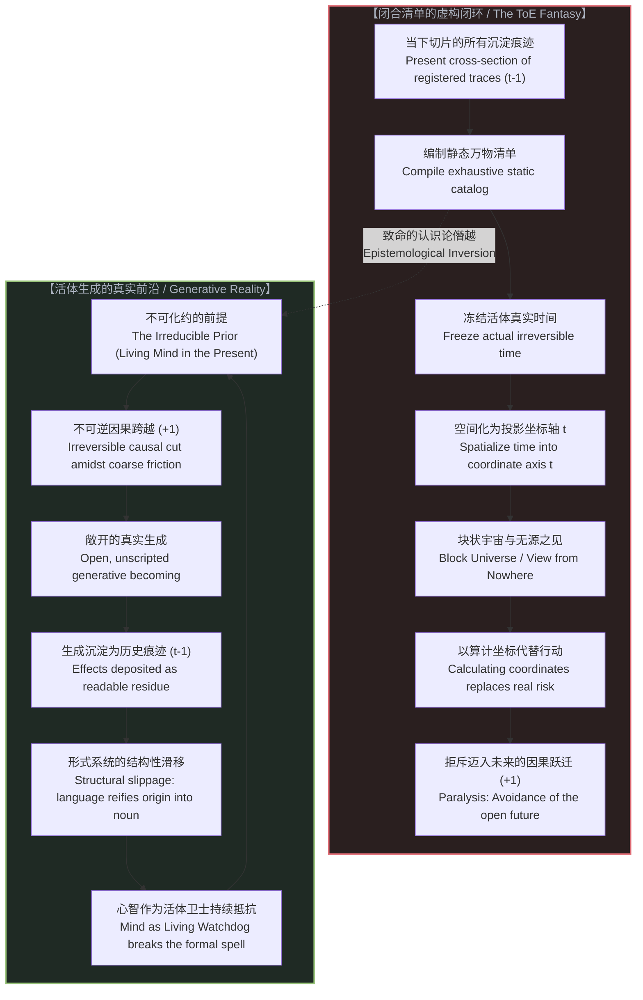

# 索求万物理论是在将当下冻结为清单：投影维度、逃避未来与不可化约的前提 / Demanding a Theory of Everything Freezes Time into a Catalog: Projected Dimensions, the Avoidance of the Future, and the Irreducible Prior

*万物理论并非对现实终极法则的洞察，而是用当下的已知切片编织而成的封闭清单；它用空间化的投影坐标抹杀了不可逆的流变，用代数推演逃避了迈入未来的本体风险。 / A Theory of Everything is not an insight into ultimate law, but an exhaustive inventory compiled from a present slice of reality; it replaces irreversible becoming with a spatialized projection, substituting algebraic calculation for the ontological risk of stepping into the future.*

---

## 一、 索求万物理论的本质：将当下切片物化为终极清单 / 1. The Essence of the ToE Demand: Reifying the Present Slice into an Ultimate Catalog

在近现代科学与哲学的最高殿堂中，始终盘踞着一个最具诱惑力、也最受尊崇的智性野心：**“万物理论”（Theory of Everything, ToE）**。

无论是从牛顿的经典力学引力定律、麦克斯韦的电磁统一方程，到爱因斯坦毕生未竟的统一场论，再到当代超弦理论、圈量子引力乃至宇宙全息假说，物理学界始终执着地向人类许诺：只要假以时日，只要数学工具足够完备，我们终将写下一组写在明信片上的优美方程，一劳永逸地将所有微观粒子、基本作用力、时空曲率乃至生命与意识的全部演化规律彻底封口。

然而，当我们抽离出这一宏大叙事的情绪光环，站在冷峻严苛的认识论地基上审视时，必须提出一个最根本的问题：
**当一个理论家在“索求万物理论”时，他到底在做什么？**

物理学家用来建立统一方程的所有原材料，无一例外地来自于人类截至目前为止所积累的**观测记录、测量读数、探测器残迹与数学对偶关系（`t-1`）**。
所谓万物理论，在本质上不过是**在当下的这个瞬时截面（At the Very Present）上，对现实所做的一场穷尽式盘点与清单罗列（Cataloging Reality）**。

理论家把截至当下所能测得的所有对称性、所有相互作用常数、所有可区分的量子自由度搜集起来，将其物化为一个自洽的分类账本。随后，他们执行了一次致命的认识论僭越：**他们将这份基于当下沉淀陈迹所整理出来的“存量资产清单”，指认为“宇宙从亘古到未来的终极生成法则”。**

清单只能记录已经发生并沉淀下来的痕迹，它永远无法包含尚未被刻写的生成过程。但索求万物理论的冲动，却妄图将这份基于局域、有限、当下的描述性清单，宣布为现实本身的完全闭合。

---

Across the apex of modern physics and philosophy, no ambition has exerted a more hypnotic grip than the quest for a **"Theory of Everything" (ToE)**.

From Newton’s universal gravitation and Maxwell’s electrodynamic synthesis, to Einstein’s unfinished dream of a unified field theory, and onward to contemporary string theory, loop quantum gravity, and holographic cosmological conjectures, physics has persistently held out a grand promise: given enough time and mathematical sophistication, we will eventually write down a set of master equations fitting on a postcard, cleanly enclosing all particles, fundamental interactions, spacetime curvatures, and the entirety of organic and conscious evolution into a single, closed system.

Yet when we strip away the devotional aura of this ambition and examine it from first epistemological principles, a foundational question arises:
**What is a theorist actually doing when demanding a Theory of Everything?**

Every piece of empirical raw material used to forge a unified theory originates without exception from **accumulated measurement records, instrument traces, detector clicks, and mathematical dualities deposited up to the present moment (`t-1`)**.
The pursuit of a ToE is, at its root, **an attempt to compile an exhaustive catalog of reality taken from the exact cross-section of the present**.

The theorist gathers every symmetry registered so far, every coupling constant measured, and every distinguishable quantum state into an internally consistent ledger. Then, an illegitimate leap is performed: **they mistake this retrospective inventory of settled residue for the dynamic generative engine of reality itself.**

A catalog can only contain what has already settled and left a readable inscription; it cannot contain the unwritten act of generation. Yet the demand for a ToE insists that this local, finite, present-tense inventory be crowned as the absolute closure of reality itself.

---

## 二、 偷换时间的几何魔术：以空间化投影坐标抹杀活的流变 / 2. The Sleight of Hand with Time: Replacing Living Becoming with a Spatialized Coordinate

既然清单只能记录当下已知的存量，那么万物理论是如何制造出它能够“涵盖未来一切演化”的宏大幻觉的？

答案隐藏在一个被现代科学奉为圭臬、却极少被彻底清算的认识论魔术之中：
**它有效地冻结了鲜活的、不可逆的真实时间，并将其替换为一个可自由遍历的空间化投影维度（A Projected Time Dimension）。**

真实的时间从来不是一个被动的几何背景，正如我们在 [时间即因果而非维度](../time-is-causality-not-a-dimension/) 与 [连续性作为建模的权宜之计](../the-continuum-is-a-modeling-convenience/) 中所论证的：**时间就是因果的不可逆发生，是现实在当下一瞬迈出的那一记无法撤销的离散跃迁（`+1`）。** 真实的流变永远带有摩擦、耗散与不可回溯性；它永远栖息于正在展开的“现在”，并且由于因果前沿的不断生成而永远无法被先行封底。

然而，一个充满不对称性、充满未决风险与不可逆跃迁的活体流变，是无法被优雅地装进封闭的代数方程组之中的。为了让数学形式闭合，形式主义必须执行一次彻底的阉割：
1. **冻结当下**：它把时间的活体脉动骤然冰封，将“正在生成”的因果过程截断为一组静态的初边值条件；
2. **将时间空间化为坐标轴 `t`**：它把不可逆的因果跃迁偷换为闵可夫斯基时空或相空间中的一条连续几何轴线。在这一轴线上，时间被赋予了与空间维度完全对称的数学待遇——时间变成了一根可以被整体展开、可以来回积分、甚至在微分几何中可以被视为已经“静止躺在坐标纸上”的第四条导轨；
3. **块状宇宙（Block Universe）的无源之见**：理论家从这种空间化操作中炮制出了现代物理学最具毒性的形而上学盆景——“块状宇宙”。在这个图景中，大爆炸、今天写下的文字、以及遥远未来的恒星死灭，都被视为早已等价地并存在一张四维流形织锦之上。“过去、现在与未来”被宣称为人类意识的局限与错觉，万物理论只需要从所谓宇宙外部的“无源视角”（The View from Nowhere，参见 [因果的自反性与物理的无源假定](../causality-is-irreducible-the-physical-is-a-view-from-nowhere/)）来凝视这张静态几何全景。

看清这个偷换的本质吧：
**通过把时间降级为空间投影坐标，物理学并没有解释时间，它只是通过把时间彻底杀死，来假装自己已经解决了现实！**

在空间化的坐标轴 `t` 上，未来不是等待被踏出的未知旷野，而是早就被方程预先计算、甚至早已静止存在于高维空间中的现成坐标点。真实时间的不可逆火花被熄灭了，取而代之的是冰冷晶体般的人造陈列室。

---

If a catalog can only ever inventory past residue, how does a Theory of Everything manufacture the convincing illusion that it governs all future unfoldings?

The answer lies in an epistemological sleight of hand celebrated as foundational truth throughout modern theoretical physics:
**It effectively freezes living, irreversible time and replaces it with a spatialized, projected coordinate dimension.**

Real time is not a passive geometric background. As established in [Time is Causality, Not a Dimension](../time-is-causality-not-a-dimension/) and [The Continuum is a Modeling Convenience](../the-continuum-is-a-modeling-convenience/): **time is the irreversible execution of causality—the discrete, unretractable step taken by reality at the living present (`+1`).** Real becoming is saturated with friction, dissipation, and irreversibility; it resides exclusively in the active present and cannot be sealed in advance because its generative boundary is permanently open.

An asymmetric, open-ended, irreversible process cannot be captured within a closed, timeless set of differential equations. To force formal closure, mathematical physics executes a substitution:
1. **Freezing the Present**: It abruptly arrests the living pulse of temporal becoming, reducing the ongoing generative act into a static cross-section of initial and boundary conditions;
2. **Spatializing Time into an Axis `t`**: It substitutes the irreversible causal step with a smooth geometric coordinate axis in Minkowski spacetime or phase-space manifolds. Along this axis, time is awarded mathematical equivalence to spatial dimensions—becoming an already-extended track that can be surveyed, integrated across, or differentiated backwards and forwards;
3. **The Block Universe as a View from Nowhere**: From this spatialized projection, theoretical physics derives its most seductive metaphysical idol—the "Block Universe." Here, the Big Bang, the sentence you are reading now, and the heat death of stars are conceived as co-existing simultaneously on a four-dimensional static geometric tapestry. Past, present, and future are relegated to human perceptual illusions, while the ToE claims to survey this completed manifold from a transcendental, observer-free vantage point (the ungrounded "View from Nowhere" dissected in [Causality is Irreducible; The Physical is a View from Nowhere](../causality-is-irreducible-the-physical-is-a-view-from-nowhere/)).

Recognize the true nature of this maneuver:
**By degrading time into a spatialized coordinate projection, physics has not explained time; it has merely murdered time in order to pretend it has enclosed reality.**

Along a spatialized coordinate axis `t`, the future is not an open frontier awaiting the commitment of action; it is merely an already-mapped coordinate location waiting to be mechanically calculated. The living fire of temporal irreversibility is extinguished, replaced by a petrified crystalline museum.

---

## 三、 逃避未来的本体风险：算计坐标以拒斥因果跨越 / 3. Avoiding the Ontological Risk of the Future: Calculating Coordinates to Evade the Causal Step

为什么人类智慧最顶尖的大脑，会长达数个世纪如此狂热、如此执迷不悟地索求万物理论？这背后的深层驱动力，难道仅仅是对自然客观规律的纯粹好奇吗？

绝非如此。
在索求万物理论的智性狂热背后，隐藏着一种极为深刻的**存在性恐惧与心理防御机制——对真正迈入未知未来的本体论逃避**。

**真正的未来，是不可计算的生成；迈向未来的唯一方式，是第一人称心智在粗粝的物理摩擦中承担后果、踩出那一步真实的因果跃迁（`+1`）。**
这一步意味着：
* **彻底的本体风险**：在步子未曾迈出之前，没有任何模型能够绝对保证其结果；
* **非平滑的因果摩擦**：每一步都伴随着离散的不可逆代价，无法通过撤回坐标来重来；
* **未决的主权责任**：未来不是被写好的剧本，而是由正在行动的观测者与行动者实时塑造的前沿。

这种赤裸裸暴露在不可逆荒原之上的状态，令人类脆弱的确定性本能感到极度惊恐。
而万物理论，正是为这种恐惧量身定制的终极避难所。

**通过把现实冻结为一张基于当下的清单，并把未来偷换为可计算的几何坐标，万物理论向心灵许诺了一种虚妄的安全感：“未来并没有什么不可预测的深渊，未来只是一段已经写在流形上的轨迹；你不需要冒险去亲身涉足，你只需要坐在象牙塔里，代数推演它的坐标值。”**

索求万物理论，在本质上是**用对坐标的代数算计，来代替向真实的未来迈出步伐**。
它是制度化科学对真正创造性、对生命偶发性、以及对未决因果责任的一场集体逃逸。它假装整个宇宙是一道已经解出的静态习题，从而免除了理论家在开放历史中作为真正行动者所必须背负的沉重摩擦。

---

Why have the sharpest minds across centuries obsessively pursued a Theory of Everything? Is this relentless drive propelled merely by dispassionate curiosity about physical nature?

Not at all.
Beneath the intellectual prestige of the ToE quest lies a profound **existential defense mechanism: the metaphysical evasion of the ontological risk of the open future**.

**The true future is an uncalculated generative emergence; the only way to reach the future is for the first-person living agent to take the physical step (`+1`), bearing irreversible causal consequences amidst coarse friction.**
Taking this real step demands:
* **Genuine Ontological Risk**: Before the step is actualized, no formal model can guarantee its outcome;
* **Non-smooth Causal Friction**: Every transition exacts an irreversible energetic cost that cannot be undone by reversing an index;
* **Undecided Sovereign Responsibility**: The future is not a completed script awaiting playback; it is an unwritten frontier continuously determined by active interventions.

Being stripped bare before an open, unclosable horizon terrifies the human instinct for guaranteed certainty.
A Theory of Everything serves as the ultimate analgesic against this existential vertigo.

**By arresting reality into a present-slice catalog and substituting the future with a computable geometric coordinate, the ToE promises a false sanctuary: "There is no genuine abyss ahead; the future is merely a pre-existing coordinate along the manifold. You need not risk the friction of living action; you need only remain seated in the formal sanctuary and compute its value."**

Demanding a ToE is **the substitution of coordinate calculation for the actual step into the future**.
It is the institutional escape from the terror of open causality, from genuine novelty, and from personal responsibility. It pretends the cosmos is an already-solved, static equation, thereby relieving the spectator of the weight of being an active, irreversible agent in living history.

---

## 四、 物理学为何无法自解：不可化约的前提被错当作可还原的假说 / 4. Why Physics Cannot Resolve It: The Irreducible Prior Mistaken for a Reducible Hypothesis

每当这套形而上学防线的虚妄被揭穿，主流理论界总会抛出一个近乎本能的辩护：
*“这只是目前量子力学与广义相对论尚未统一的暂时困难；只要我们建立了量子引力理论、或者破解了量子测量的波函数坍缩机制，物理学自然会在未来把时间的起源、观测者的角色与因果的本质彻底化解在方程之中。”*

这种辩解不仅是苍白的，更暴露了一种极其严重的**范畴错乱（Category Error）**：
**这个问题永远不可能由物理学本身来解决，因为物理学恰恰是建立在这一前提之上的下游派生物！**

正如我们在整个认识论建构中所一再锚定的那个硬核基石：**不可化约的前提（The Irreducible Prior）**。

物理学是什么？
物理学不是从虚空中凭空降临的圣喻，物理学是**一个活生生的、栖息于第一人称当下的心智，通过设置仪器、执行测量截断、对比指针读数，在粗粝的不可逆摩擦中所锻造出来的形式表象体系**。
* 如果没有第一人称心智在当下的主动介入，就不会有任何“测量”（Measurement）；
* 如果没有不可逆的因果不对称性（从过去到未来的单向流动），就不会有任何“实验数据的记录”与“理论假说的验证”；
* 如果没有观测者在现实中劈出的那一记区分之刀，整个物理学的所有名词——质量、电荷、波函数、时空度规——都不会拥有哪怕一微克的物理意义。

心智与不可逆因果构成了不可化约的前提。**它是所有科学得以启动、运行与被证伪的绝对母体。**

然而，理论物理学的还原论狂妄，却企图将这个作为母体的“不可化约的前提”，反向塞进它自己生出来的方程之中！
他们把它当成了一个“可以被还原的物理假说”，傲慢地发问：“我们该如何从超对称引力场方程中把意识和时间推导出来？我们该用什么粒子或场来解释观测者的诞生？”

这无异于**要求投影幕布上的光影，去推导并解释放映机内部的灯丝与通电电流**；
这无异于**一个记账员试图在账本的一行条目里，把正在握笔记账的活人彻底算作一笔可以平账的静态支出**。

物理学无法自解这一难题，不是因为物理学的方程还不够复杂，而是因为**在逻辑与本体论的谱系上，物理学永远处于前提的下阶**。试图用物理学来解决不可化约的前提，是用清单试图吞噬清单的作者，是一场注定破产的认识论倒错。

---

Whenever the fragility of this formal closure is exposed, mainstream physics reflexively retreats to a familiar defense:
*"This is merely a temporary impasse caused by the incomplete unification of quantum mechanics and general relativity. Once we develop a complete theory of quantum gravity, or resolve wave-function collapse, physics will naturally explain the emergence of time, the role of the observer, and the mechanism of causality from within the master equations."*

This defense is not merely hollow; it commits a catastrophic **Category Error**:
**This conundrum can never be resolved by physics, because physics is itself an downstream artifact built entirely upon this foundational condition!**

This brings us to the immovable bedrock: **The Irreducible Prior**.

What is physics?
Physics does not descend from a celestial vacuum. Physics is **a formal apparatus forged by living minds occupying the active, first-person present—setting up apparatuses, executing experimental cuts, reading instrument pointers, and verifying outcomes through irreversible physical friction**.
* Without the active intervention of first-person mind in the living present, no "measurement" can ever occur;
* Without the irreversible asymmetry of causal flow (the one-way transition from cause to effect), no experimental data can ever be inscribed or verified;
* Without the observer making a distinction, every term across physics—mass, charge, wave-functions, spacetime metrics—lacks a single shred of physical meaning.

Mind and irreversible causality constitute the Irreducible Prior. **They are the generative matrix through which all science is initiated, executed, and validated.**

Yet reductionist physics attempts to cram this generative matrix into the very equations it generated!
It treats the Irreducible Prior as though it were a "reducible hypothesis," asking with naive arrogance: *"How can we derive consciousness and the flow of time from supersymmetric field equations? What Lagrangian term explains the emergence of the observer?"*

This is equivalent to **demanding that the flickering shadows on a cinema screen derive and explain the incandescent filament inside the projector**;
It is equivalent to **an accountant attempting to balance a ledger by reducing the living human holding the pen into a passive line item within the accounts payable column**.

Physics cannot resolve this question not because its mathematics is insufficiently advanced, but because **epistemologically and ontologically, physics forever stands downstream of the Prior**. Attempting to resolve the Irreducible Prior with physics is an attempt by the catalog to swallow its cataloger—a fatal inversion doomed to incoherence.

---

## 五、 形式系统的必然滑移与心智的活体抵抗 / 5. The Structural Slippage of Formalism and Mind as the Living Watchdog

在此，我们必须直面一个极其微妙、却普遍发生在几乎所有人脑海中的认识论陷阱：
**为什么即便是在看清了上述道理之后，思想依然会不可避免地一次又一次滑回旧有的还原论叙事之中？**

你一定经历过这种滑移：
前一秒你刚刚深刻地确认了“不可化约的前提是不可动摇的原点”；然而仅仅过了几分钟，在随后的讨论与思维推演中，语言的形式惯性便悄然生效，你或者你的对话者便会下意识地说出：*“那么，我们该如何证明这一假说？我们该假定不可化约的前提存在吗？物理学有没有可能未来找到它的机制？”*

看吧！就在这一瞬间，**不可化约的前提，被悄无声息地降级为了一种“需要被证明的假说”或者“有待检验的假定”，人们一边在心安理得地使用着它（用意识在思考、用时间在论证），一边却在质疑它是否存在！**

这种滑移因何而生？
**它是语言与一切形式符号系统内在固有的一种“结构性滑移”（Structural Slippage）。**

形式逻辑、语法结构与数学符号，天生就是**静态的、客体化的、沉淀于过去（`t-1`）的符号陈迹**。语言的基本运作机制就是将动态的生命动作“名词化”（Nominalization）——把“观看”变成“视线”，把“生成”变成“实体”，把“不可化约的活体介入”变成一串名为“不可化约的前提”的死文字。
一旦一个原初洞见被写成文字或符号，它就立刻被形式系统的重力场所捕获。这个庞大而冰冷的语法机器会机械地把它视作系统内部的又一个“客体名词”，并本能地向它索要定义、索要公理证明、索要物理机制。

**这种必然发生的滑移，不仅不是理论的瑕疵，反而是“闭合之绝对不可能”（Impossibility of Closure）的最铁证！**
它雄辩地证明：任何试图把现实封闭在静态符号体系内部的企图，都会因为形式系统无法容纳自身母体而产生荒谬的内卷与退化。

那么，面对这种不可避免的语法重力，我们究竟能做些什么来抵御这种滑移？
没有任何一套静态的公理可以抵御这种滑移，没有任何一台死板的机器可以阻止自己把母体当成零件。

**唯有活的心智，能够抵御这种滑移（Only the Mind Can Resist the Slippage）。**

心智必须扮演那个时刻保持警觉的**“活体卫士”（The Living Watchdog）**：
* 当形式系统试图把不可化约的原点物化为可还原的客体时，心智必须当头棒喝，指出其范畴错乱；
* 当科学主义试图把活生生的当下偷换为静态坐标纸上的代数点时，心智必须唤醒肉身的真实体感，指认不可逆的因果代价；
* 心智必须一次又一次地从写就的清单中抽身而出，打破符号的催眠，重新站立在那个正在劈开未来的唯一前沿（`+1`）。

---

Here we must confront a subtle epistemological trap that ensnares even the most sophisticated thinkers:
**Why does human discourse perpetually slip back into the prevailing reductionist narrative, even after clearly recognizing its bankruptcy?**

Every serious inquirer has experienced this cognitive drift:
One moment you definitively recognize that "the Irreducible Prior is the untransgressable origin of all verification"; yet within minutes, driven by linguistic inertia, formal thought begins to slip, and you hear the reflexive inquiry: *"So, how do we prove this assumption? Should we hypothesize that the Irreducible Prior is true? Could physics eventually locate its underlying mechanism?"*

Observe the sleight of hand! In that split second, **the Irreducible Prior was covertly degraded into an optional "hypothesis" or an unproven "assumption"—even while the speaker continues to employ it directly (using conscious awareness to question, using irreversible time to articulate), simultaneously demanding proof of the very ground upon which they stand!**

Why does this slide occur?
**Because it is the intrinsic, structural slippage of language and all formal symbolic systems.**

Formal logic, syntax, and mathematics are by their very nature **static, objectifying deposits of past traces (`t-1`)**. The foundational operational mode of language is nominalization—transforming living dynamic actions into inert nouns: turning "seeing" into "vision," turning "becoming" into "substance," and reducing "irreducible living agency" into an external linguistic token labeled "the Irreducible Prior."
The moment an original realization is inscribed into syntax, it is instantly ensnared by the gravitational field of formalism. The vast, indifferent grammatical machinery automatically treats it as just another objective noun within the system, demanding definitions, axiomatic proofs, and physical reductions.

**This inevitable slippage is not an accidental defect; it is empirical proof of the Impossibility of Closure!**
It demonstrates irrefutably that any formal system that attempts to swallow its own living origin must spiral into recursive self-delusion and incoherence.

How, then, can we resist this linguistic gravity?
No static axiom can prevent this drift; no deterministic algorithm can stop itself from treating its source as a component.

**Only the living mind can resist this slippage.**

The mind must serve as the ever-vigilant **Living Watchdog**:
* Whenever formal systems attempt to reify the unclosable origin into a reducible object, the mind must intervene to strike down the category error;
* Whenever scientism attempts to replace the living present with an algebraic point on coordinate paper, the mind must awaken bodily awareness and re-anchor itself in irreversible causal friction;
* The mind must repeatedly step out of the inscribed catalog, break the trance of the dead letter, and plant its feet firmly on the moving edge that cuts into the future (`+1`).

---

---

## 六、 结语：抛弃全知清单，立于生成的前沿 / 6. Conclusion: Abandoning the Universal Catalog to Inhabit the Generative Frontier

人类真正的心智成熟，始于承认“万物理论”在本体论上的彻底破产。

索求万物理论，绝非对终极真理的勇敢探索；它是疲惫的心智在浩瀚未知的面前所筑起的一座坚固的堡垒，是用空间化的假死状态来逃避对未来的真实担当。它试图用一张包含万物的死清单，来换取免于不确定性的虚假安宁。

但现实拒绝被列成清单。
因为现实的全部尊严与全部生机，恰恰不在这份已经沉淀的账本里，而**在账本之外那不可消除的生成活动中**。

真实的时间永远在流淌，它不是一条铺设好的铁轨，而是一场由每一个有知觉的心智在每一个不可替代的当下一瞬、顶着摩擦与风险、亲手斩出的一条不可逆的生路。
物理学是这场壮烈征途上留下的一组极其精妙、极其有用的路标与勘测手记；但路标永远不等于旷野，手记永远无法替代脚步。

**放下那份妄图穷尽一切的万能清单吧。**
不再试图用代数算计去预先锁定未来，不再被形式符号的结构性滑移所催眠，而是以不可化约的清醒主体性，重新回到那个唯一真实的起点——立足于粗粝的当下，承担未决的因果后果，坚定而无畏地，向着敞开的未来迈出那不可撤销的下一步（`+1`）。

---

Human intellectual maturity begins with the recognition that a "Theory of Everything" is an ontological impossibility.

The compulsive demand for a ToE is not a heroic quest for ultimate reality; it is a fortress constructed by an exhausted intellect seeking shelter from the unfathomable openness of existence. It is an attempt to escape the sovereign burden of the future by retreating into the suspended animation of a spatialized coordinate map. It seeks to purchase immunity from uncertainty at the cost of trading living reality for an exhaustive dead ledger.

Yet reality refuses to be cataloged.
The vital dignity of the cosmos does not reside in the settled ledger of accumulated effects; it resides **exclusively in the unclosable generative act that lies permanently beyond the boundary of any formal ledger**.

Real time is flowing irreversibly. It is not an already-laid rail, but a living path cut by conscious minds occupying the irreplaceable present, bearing real energetic friction, and taking the next irreversible step.
Physics remains an extraordinarily powerful set of trail-markers and survey notes compiled along this journey; but the trail-marker is never the wild terrain, and the map can never take the stride for the traveler.

**Abandon the illusion of the all-encompassing catalog.**
Cease trying to pre-compute the open future through algebraic safe-houses. Refuse to be hypnotized by the structural slippage of formal nouns. Stand firmly upon the Irreducible Prior of living awareness: rooted in the friction of the active present, shouldering the weight of open causality, and stepping with sovereign courage into the unscripted frontier (`+1`).
