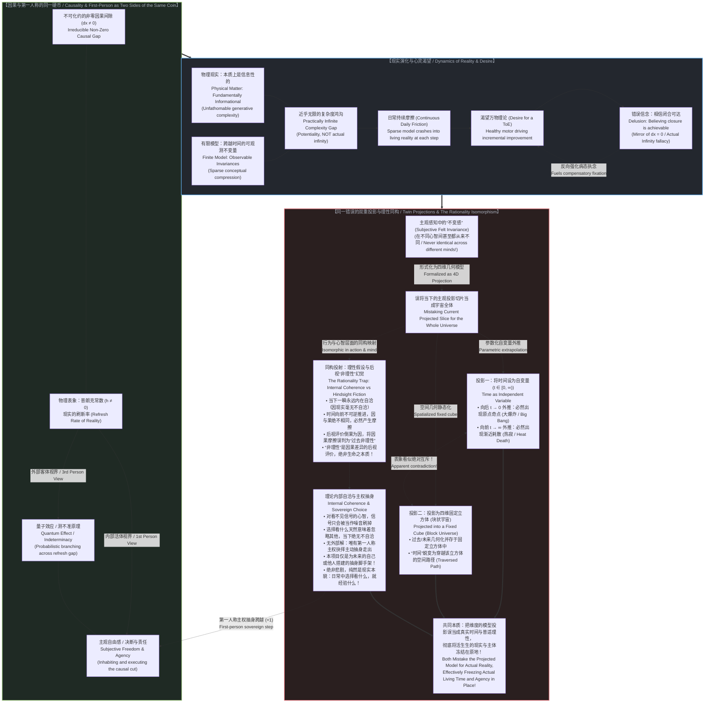

# 索求万物理论是在将当下冻结为清单：投影时间、逃避未来与不可化约的前提 / Demanding a Theory of Everything Freezes Time into a Catalog: Projected Dimensions, the Avoidance of the Future, and the Irreducible Prior

*根本不存在所谓“过去的客观记录”，一切“过去”皆是从当下向虚构时间维度的投影；任何理论所能捕获的，仅仅是有限时间窗口内跨越时间的可观测不变量。物质在根本上同样是信息性的，两者共享同一套底层因果，使得现实与模型的复杂度差距在实用上近乎无限。日常摩擦与对万物理论的渴望是同币双面：问题不在于驱动渐进改进的渴望，而在于相信闭合可达的迷狂。从微积分抹杀 `dx` 到普朗克常数作为现实的刷新率，从大爆炸与热寂对块状宇宙的根本否定，到量子效应与主观自由感，皆是因果与第一人称视角这同一枚硬币在不同视界下的必然显化。 / There is no objective record of the past; all "past" is a projection from the present onto an artificial time dimension. What any theory can capture is merely observable invariance across time within our limited window. Physical matter is fundamentally informational, rendering the complexity gap between model and reality practically close to infinity. Daily friction and the desire for a ToE are two sides of the same coin: the problem is not in desiring—which drives incremental improvement—but in believing closure is achievable. From calculus zeroing `dx` to the Planck constant as reality's refresh rate, from the Big Bang and Heat Death demolishing the Block Universe to quantum indeterminacy and subjective freedom, all are twin faces of the exact same coin: the irreducible coherence of causality and first-person agency.*

---

## 一、 根本不存在“过去的客观记录”：只有当下的此刻，与被投射出的时间维度 / 1. There Is No "Record of the Past": Only the Present, and the Projected Time Dimension

在所有关于“万物理论”（Theory of Everything, ToE）的经典设想中，深植着一个从未被彻底反思的常识性错觉：
人们理所当然地认为，科学之所以能够去总结宇宙的终极规律，是因为宇宙存在着一套客观、真实且完备的**“历史记录”**——只要我们挖掘出足够多的古老地层、捕获足够微弱的宇宙微波背景辐射、记录下足够详尽的粒子对撞数据，我们就拥有了一份关于“过往一切物理事实”的坚实底账。

**然而，这是一个根本性的认识论错误：现实中根本不存在所谓“过去的客观记录”。**

环顾四周，放眼整个物理宇宙：宇宙中哪有一座存放“过去”的客观仓库？哪有一张写满“历史”的底片？
根本没有。**在每一个可被证实的真实物理层面上，唯一实际存在的，永远、且仅仅是“当下的此刻”（The Present Available at This Very Moment）。**

* 你手里捧着的三叶虫化石，并不是“过去”，它是**此时此刻**躺在你掌心的一块排列特殊的方解石结晶；
* 射电望远镜所接收到的宇宙微波背景光子，并不是“138 亿年前的大爆炸”，它是**此时此刻**在你的天线传感器里激发的微弱电流；
* 硬盘磁道上记录的实验读数，并不是“过去的物理事件”，它是**此时此刻**保持特定磁化取向的微观磁畴；
* 就连你大脑深处的记忆突触，也绝非过去事件的录像带，而是**此时此刻**神经元网络所维持的电化学构型。

所有这些东西，全部且仅仅存在于**当下的瞬时现实**之中。

那么，所谓的“过去”究竟从何而来？
**“过去”，根本不是实际的时间，而是心智在当下的这一瞬，把当下的物理构型向后投射到一条人造的几何维度轴线上，所虚拟出来的投影（A Projected Time Dimension）。**

正是心智在当下指着一块石头说：“这代表一亿年前的海洋”；正是理论家在当下指着一段光谱说：“这代表宇宙初期的暴胀”。是我们从唯一的“当下”出发，向后画出了一条标有虚构坐标 `t` 的射线，把当下的微观结构解释为那条轴线上的投影点。

**“过去”和“未来”毫无二致——它们根本不是现实的实体容器，而是人类在唯一的当下切片上，向虚空画出的两条双向投影射线。** 
因此，任何以为自己掌握了“过去客观记录”、并试图以此来编织万物理论的企图，从第一步起就建立在将投影误认为现实的幻觉之上。

---

Embedded deep within the classical quest for a **"Theory of Everything" (ToE)** lies an unexamined article of faith:
The assumption that science can deduce ultimate cosmic laws because the universe maintains an objective, immutable **"record of the past"**—that if we only excavate enough geological strata, measure the cosmic microwave background with sufficient precision, and log enough terabytes of particle collisions, we will possess a solid ledger of past physical facts upon which a final equation can be erected.

**This is a foundational epistemological error: there is no such thing as an objective record of the past.**

Survey the physical cosmos directly: where is the external warehouse storing "the past"? Where is the objective film reel of cosmic history preserved?
It does not exist. **At every verifiable level of physical reality, the only thing that is ever available is the present at this very moment.**

* The trilobite fossil in your hand is not "the past"; it is a specific configuration of calcite molecules resting in your palm **right now**;
* The microwave background photons hitting a radio dish are not the "Big Bang 13.8 billion years ago"; they are minute voltage fluctuations exciting antenna circuits **right now**;
* The experimental logs inscribed on a hard drive are not "past events"; they are magnetic domains aligned in a specific pattern **right now**;
* Even the neural traces of your personal memories are not a recorded playback of history; they are electrochemical synaptic configurations active in your brain **right now**.

Every piece of evidence exists exclusively and entirely within **the instantaneous reality of the present**.

Where, then, does "the past" come from?
**"The past" is not actual time; it is a projection constructed by the mind from the evidence of the present onto an artificial, spatialized time dimension.**

It is the mind, acting in the active present, that points to a rock and asserts: "This signifies an ancient ocean." It is the theorist, operating in the living now, who interprets a spectral redshift as a cosmological epoch. We take the distinctions present in the immediate now and project them backward along an imagined coordinate axis labeled `t`.

**"The past" and "the future" are structurally identical: neither is an actual container of reality. Both are bidirectional geometric projections cast outward from the only reality that actually exists—the living present.**
Any attempt to claim that a Theory of Everything is grounded in a complete, objective catalog of past reality is, from its very first premise, a mirage that mistakes an interpretive projection for an objective realm.

---

## 二、 构想即过时：索求万物理论在发生的一瞬即已自溃 / 2. Obsolete at Inception: The Demand for a ToE Collapses at the Moment of Formulation

正是由于时间不是一个现成的维度，而是现实在不可逆地展开，我们遭遇了索求万物理论最致命、也最无可辩驳的悖论：
**索求万物理论（Demanding a ToE）这一举动，在它被构想出来的这同一刹那，就已经被彻底证伪并宣告破产。**

为什么？
因为**构想一个念头、写下一组方程、乃至发出“我要一个终极理论”的索求本身，就是一次实实在在的物理因果事件！**

请仔细观察这一过程在物理世界中的实际发生：
当一个物理学家坐在黑板前，脑海中浮现出“我要将宇宙所有规律闭合为一组方程”的雄心壮志，或者当他在草稿纸上写下最后一个统一算符时，现实停下来了吗？时间被定格在那个瞬间了吗？

绝对没有。
就在那个念头萌生、神经元放电、粉笔划过黑板的那一微秒里，一个无法逆转的物理事实已经轰然发生：**宇宙早已经不可逆转地、不可阻挡地迈向了下一个时刻（`+1`）！**

* 思考需要耗散自由能；
* 记录需要擦除物理信息并释放熵（兰道尔原理）；
* 任何形式的构想、书写与表达，都是现实本身正在踩出的一记鲜活的因果步长。

这就制造了一个荒诞的绝境：
万物理论的根本目的，是要给现实拍一张“穷尽一切状态与法则的全景快照”；
然而，**“按下快门”和“冲洗胶片”这一动作本身，就是现实自身不可分割的全新演化！**

在你自以为终于在方程里把现实的一切粒子和状态都“打包封口”的那个绝对瞬间，真实的宇宙早已经跨过门槛、带着你写下公式所产生的热量和新状态，潇洒地迈入了全新的下一瞬。你所捕获的所谓“万物全景”，在它落笔完成的第一毫秒，就已经沦为了被现实无情抛弃在后的旧投影！

**索求万物理论，在它被提出来的瞬间就是自相矛盾的。**
它试图以一个系统内部的局域动作去冻结整个系统的流动，但这个动作本身的存在，就是流动永不停歇的最铁证。你永远无法用一张包含所有地图的地图去覆盖领土，因为画出这张地图的墨水，本身就是领土上正在涌现的新地貌。

---

Because time is not a pre-existing dimension but the irreversible unfolding of reality, we arrive at the most devastating and unanswerable paradox confronting the ToE:
**The demand for a Theory of Everything collapses in self-refutation at the very instant it is formulated.**

Why?
Because **the act of conceiving an idea, writing down an equation, or uttering the demand for a ToE is itself an irreversible physical causal event!**

Observe what actually happens in physical reality:
When a theorist sits before a chalkboard, seized by the ambition to enclose all cosmic laws into a final set of equations—or when they write down the final unified operator—does reality pause? Does time freeze to await the formula?

Not for a femtosecond.
At the exact microsecond the thought flashes through neural synapses and the chalk strikes the board, an inescapable physical event has transpired: **reality has already, inevitably, irreversibly moved onto the next moment (`+1`)!**

* Thinking dissipates free energy;
* Inscribing symbols erases physical states and generates entropy (Landauer's Principle);
* Every formulation, utterance, or proof is itself an active, discrete, irreversible causal step taken by the cosmos.

This produces an inescapable structural impasse:
The explicit objective of a Theory of Everything is to produce an exhaustive, closed snapshot of all cosmic states and laws;
Yet **the very act of capturing that snapshot is itself a brand-new, unscripted physical unfolding within the cosmos!**

At the precise moment you believe you have successfully sealed the universe inside your master equations, the living universe has already stepped over the threshold. Carrying the heat of your thoughts, the friction of your chalk, and the novel configuration of your brain, it has entered the next moment. The "complete cosmic catalog" you just inscribed is obsolete before the ink has dried—left behind as an outdated projection of a vanished instant.

**The demand for a Theory of Everything is self-defeating at the very instant of its formulation.**
It attempts to use a local operation inside the system to freeze the flow of the whole, while the operation itself constitutes irrefutable proof that the flow cannot be arrested. You can never draw a map that encloses the whole territory, because the ink used to draw the map is itself newly emerging territory.

---

## 三、 理论究竟能捕获什么：有限窗口内的可观测不变量，与近乎无限的复杂度鸿沟 / 3. What Any Theory Can Actually Capture: Observable Invariances within a Limited Window, and the Practically Infinite Complexity Gap

既然万物理论既不可能立足于“过去的客观记录”，又会在被提出来的瞬间被真实时间甩在身后，那么物理学中那些被奉为至宝的科学理论，究竟捕获了什么？

**任何理论，或者说人类所能构造的任何理论，能够捕获的仅仅是：在我们极其有限的时间观测窗口内，跨越时间的可观测不变量（The Observable Invariance Across Time Within Our Limited Time Frame）。**

这正是物理定律的真实底色：
无论是能量守恒、动量守恒、规范对称性，还是麦克斯韦方程或爱因斯坦场方程，它们都不是现实的肉身，而是在人类极其短暂的文明观测尺度内，心智所提炼出的**高度抽象的概念模型（A Highly Abstract Conceptual Modeling of Reality）**。我们发现在我们有限的观测历程中，某些数学比例与代数结构保持着稳定的一致性，于是我们将这些“可观测的不变性”命名为“定律”。

但请看清这个模型与实际现实之间的悬殊对比：
**这个高度抽象的概念模型的复杂度，相比于我们正在直接体验的实际现实，是如此的微不足道、渺小至极。**

这里隐藏着一个显而易见、却在主流科学主义中被普遍忽视的根本命题：**信息与物理物质的真实关系**。
人们常常把“信息”与“物理物质”对立起来，或者将信息视为漂浮在物质之上的次级产物。然而：
**物理物质在本质上必须同样是信息性的，信息才有可能对其进行表征（Physical matter has to be fundamentally informational as well for information to be able to represent it）。**

为什么我们的数学符号与信息模型能够与物理世界产生咬合？
**因为跨越信息与物质这两个领域的底层因果律，是完全相同的（The underlying causality is the same across these two domains）。**
每一次物理相互作用——一次光子的吸收、一次电子的自旋翻转、一次分子的碰撞——在物理上都是一次不可逆的因果跃迁，在信息上就是一次不可抹杀的位元区分（A Causal Cut / An Informational Distinction）。物质之所以能够被信息所度量，是因为物质本身就是由无穷无尽的微观因果跃迁所织成的活体信息网络！

然而，正因为物理物质的每一个微观自由度都在每时每刻以无可计量的密度执行着真实的因果演化，两者之间的复杂度鸿沟展现出了令人窒息的悬殊：
**抽象概念模型与实际物理现实之间的复杂度差距，在一切实用意义上都近乎等于无穷大（The difference in complexity is practically close to infinity for all practical purposes）。**

必须做出严格的认识论限定：**这并不是真正的“实无穷”（Actual Infinity），因为无穷在本体论上仅仅是一种潜在的开放性（A Potentiality），绝非一个已经闭合完成的实体数值。**
现实永远在离散地生成，它不是现成的无穷大集合；但对于任何人类所能写出的有限符号模型而言，现实所蕴含的活体因果复杂度，在实用层面与模型的微小容量相比，呈现出了无限逼近无穷的断层。

看清索求万物理论所面临的根本局限吧：
理论家写下了几行由几十个符号构成的拉格朗日量，然后竟敢向全人类宣称：“这几行微不足道的信息模型，已经穷尽了物质宇宙的全部真实！”
这是认识论上的夜郎自大。它试图用几滴凝固的水珠，去宣布自己已经完全容纳并终结了浩瀚无垠、永不停歇的活体海洋。

---

If a Theory of Everything cannot rely on an objective record of the past, and collapses into obsolescence the microsecond it is conceived, what is it that our celebrated scientific theories actually capture?

**What any theory, or indeed any model constructed by consciousness, can ever capture is solely: the observable invariance across time within our limited time frame.**

This is the sober reality of physical law:
Whether we consider the conservation of energy, gauge symmetries, Maxwell’s equations, or the Einstein field equations, these constructs are not the living flesh of reality. They are **highly abstract conceptual models of reality** distilled by conscious observers within a minuscule temporal observation window. We discover that across the narrow slit of human instrument history, certain mathematical ratios and algebraic relationships exhibit remarkable stability, and we crown these "observable invariances" as universal laws.

Yet observe the breathtaking asymmetry between this model and the cosmos:
**The complexity of that abstract model is vanishingly tiny compared to the actual reality we are actively experiencing.**

Here lies a profound truth, self-evident yet routinely ignored in the discourse on the difference between information and physical matter:
**Physical matter has to be fundamentally informational as well, for information to be able to represent it in the first place.**

Why can mathematical symbols and informational bits interact with and describe the physical cosmos at all?
**Because the underlying causality is identical across both domains.**
Every physical interaction—a photon absorbed, an electron spin flipped, a molecular bond severed—is simultaneously a physical energetic transaction and an informational distinction (a causal cut). Matter is not an alien, non-informational substrate; it is an unfathomably dense, continuous network of irreversible causal executions.

Yet precisely because every microscopic degree of freedom in physical matter is actively computing its own causal existence at every femtosecond across the cosmos, the gulf in complexity between model and reality becomes astronomical:
**The difference in complexity between our abstract models and actual physical reality is practically close to, but not equal to, infinity for all practical purposes.**

A rigorous epistemological caveat is mandatory: **this is not an "actual infinity," because infinity is strictly an open potentiality, never an actualized, completed quantity.**
Reality is an unclosable, discrete unfolding; it is not a closed transfinite set. Yet for any finite set of equations written down by human hands, the generative informational density of physical reality is so staggering that the difference in complexity is practically indistinguishable from an infinite abyss.

Recognize the fundamental absurdity of demanding a Theory of Everything:
A theorist drafts a Lagrangian composed of a few dozen mathematical variables, and boasts: "Behold, this microscopic informational compress encloses the whole of cosmic reality!"
This is an understandable yet profound overextension of thought. It is equivalent to a few drops of dried ink declaring that they have captured, contained, and exhausted the boundless, surging Pacific Ocean.

---

## 四、 持续的日常摩擦与对万物理论的渴望：同枚硬币的两面 / 4. Continuous Daily Friction and the Desire for a ToE: Two Sides of the Same Coin

正是在这一层认识论断裂之上，我们终于能够看清一个统治着人类全部生存处境的核心奥秘：
**为什么我们在日常生活的每一个瞬间，都在持续不断地体验到粗粝的摩擦？而人类为什么又会永恒地执迷于对“万物理论”的狂热渴求？**

**这二者，根本不是彼此割裂的现象，而是同一枚硬币的两面（Two sides of the same coin）。**

请回看你在生活中的真实处境：
为什么无论你制定了多么周密的计划、掌握了多么高深的科学模型、拥有了多么精密的算法工具，每当你从当下的这一瞬间迈入下一瞬间时，你依然无可避免地撞上意外、挫败、阻滞、未预见的变化与疲惫的消耗？
**因为这就是那道“近乎无限的复杂度鸿沟”在活生生的肉身生命中的直接显化！**

你的抽象认知模型仅仅抓住了几条微不足道的可观测不变量，而你所置身的实际物理现实，却在每一个微秒里以近乎无限的自由度轰鸣演化。
当你试图拿着一个复杂度极低的概念模型跨入下一瞬间时，未被模型包含的、浩瀚无垠的真实因果细节，会以摧枯拉朽之势狠狠撞向你的认知预期。
**这种撞击，在直接的第一人称体验中，就名为“摩擦”（Friction）。**
摩擦不是系统的故障，摩擦是现实在向你严正宣告：现实永远无法被你装进书包。

而令人叹为观止的，是人类心智在面对这种摩擦时所展开的递归机制：
**正因为我们绝不可能拥有一套能被我们从当下一瞬完好携带到下一瞬的“万物理论”，我们才永远在渴望着一个万物理论！（The very impossibility for us to have a Theory of Everything to carry from one moment to the next moment is the very reason we are forever desiring a Theory of Everything.）**

看清这个深不可测的心灵陷阱吧：
如果人类真的能拥有一套完备的万物理论，如果我们真能把它像一把万能钥匙一样从此时携带到彼时而毫无信息泄漏，那么我们在跨步时就将感受不到哪怕一微克的摩擦与意外——但如果真能如此，宇宙就彻底沦为了一台死寂的拉普拉斯发条，生命与自由意志也将荡然无存。

恰恰是因为现实与模型之间存在着这道无法弥合的复杂度鸿沟，恰恰是因为我们**永远无法拥有一套免于摩擦的通行证**，脆弱而疲惫的人类心灵才在惊恐中把这种“无法携带”反向投射为一个救赎幻觉：
*“一定是因为我现在的理论还不够完美！只要物理学家找到了万物理论，只要我拥有了那套终极钥匙，我就能把它从当下一瞬携带到下一瞬，我就再也不必承受这恼人的日常摩擦，我就能彻底消除对未知的恐惧！”*

人们终生崇拜那个虚构的罗盘，恰恰是因为狂暴的汪洋大海永远在以无法预测的巨浪，把罗盘指针一次又一次无情打飞。

---

At this exact juncture of epistemological rupture, we finally penetrate the foundational enigma that governs the entire human condition:
**Why do we experience friction continuously throughout our daily lives at each and every moment? And why is humanity perpetually possessed by an obsessive longing for a "Theory of Everything"?**

**These two phenomena are not separate; they are two sides of the exact same coin.**

Examine lived reality directly:
Why is it that no matter how meticulous your plans, how sophisticated your scientific models, or how powerful your algorithmic tools, the transition from this present moment to the next invariably confronts you with surprise, breakdown, drag, unforeseen divergence, and exhausting expenditure?
**Because that is the direct bodily manifestation of the practically infinite complexity gap!**

Your abstract model holds merely a handful of sparse, invariant threads, whereas the physical-informational reality you inhabit is actively computing trillions of interacting causal degrees of freedom at every millisecond.
Whenever you attempt to carry your microscopic model across the threshold into the next moment, the ocean of unmodeled reality crashes against your expectations.
**That crash is registered in first-person experience as friction.**
Friction is not a technical glitch or human failure; friction is the voice of reality declaring that it will never fit into your conceptual luggage.

And here lies the profound recursion of human consciousness:
**The very impossibility for us to have a Theory of Everything to carry from one moment to the next moment is the very reason we are forever desiring a Theory of Everything.**

Observe the depth of this psychological trap:
If humanity could truly possess a complete Theory of Everything—if we could carry a master blueprint seamlessly across the threshold of time without informational leakage—we would experience zero friction and zero surprise. But in such a universe, reality would be a frozen, deterministic crystal, and conscious agency would cease to exist.

Precisely because of this unclosable complexity gap—precisely because we **can never possess an epistemic passport exempt from friction**—the exhausted, anxious intellect transforms this constitutional impossibility into a compensatory religious fantasy:
*"The friction must be because our physics is still incomplete! If only we discover the Theory of Everything, if only we possess the master key, we can carry it safely from this moment to the next, banishing uncertainty, eliminating daily friction, and securing absolute control!"*

We worship the fantasy of a closed compass precisely because the living ocean continuously shatters the needle with every uncalculated wave.

---

## 五、 渴望驱动渐进改进，信念铸就闭合迷狂：从实无穷、普朗克常数到自由与量子的同币双面 / 5. Desire Drives Incremental Improvement, Belief Breeds Delusion: From Actual Infinity and the Planck Constant to the Quantum-Freedom Coin

在此，我们必须划下一道极其关键、却常被混淆的界线：
**问题的症结，从来不在于“渴望”本身，而在于“相信闭合可以实现”的虚妄信念。甚至可以说，正是这种盲目的信念，在不断反向给这场病态的渴望火上浇油。**

* **渴望（Desiring）是健康的、活性的、具有生产力的**：对确定性与一致性的渴望，构成了人类所有工具发明、技术演进与经验积累的动力引擎。正是因为我们想要减少跨越瞬间时的摩擦，我们才发明了轮子、锻造了算盘、总结了牛顿定律与微积分；这种渴望驱动着我们进行一次又一次**渐进的边际改进（Incremental Improvements）**；
* **相信可达（Believing It Is Achievable）则是致命的病态**：一旦心智从“渴望改进”跃迁为“坚信宇宙终将闭合于一套万物理论”，健康的求知就异化为了形而上学的封闭宗教。理论家开始把临时支架当作神坛，把现实无法闭合的鲜活特性视为必须被消灭的“测量误差”或“认知幻觉”。

这种把可求误当作可达的错乱，在本质上**与将“无穷”当作一个“实存的封闭全体”（Actual Infinity as Totality）而非“敞开的潜在生成”（Potentiality）完全同构！**
现实中根本没有已经完成的“实无穷”；现实永远是一个正在发生的、不可穷尽的有限过程。相信万物理论能够完成，恰如相信数学家可以通过数数“数到无穷大”一样荒谬。

更重要的是，**它在认识论上与我们在 [连续性作为建模的权宜之计](../the-continuum-is-a-modeling-convenience/) 中所剖析的微积分魔术完全是镜像对称的**：
微积分为了让方程求导闭合，强行把那个非零的、不可逆的因果微元 `dx` 宣布为零（`dx → 0`）；
而万物理论为了让全景解释闭合，同样强行把原因与结果之间那个不可化约、永远处于非零状态的离散间隙，硬性宣布为已经被统一方程所彻底闭合！

但在我们所置身的真实物理宇宙中，这个因果间隙从来没有被抹杀。
**在可观测的物理世界里，这个不可被归零的最小因果步长，被物理学精确地刻写为了一项基本的物理学常数——普朗克常数（The Planck Constant, `h` / `ℏ`）。**

**普朗克常数，在本质上就是我们这个宇宙现实的“刷新率”（The Refresh Rate of Our Reality）！**
因为 `h ≠ 0`，物理现实永远不可能被无限平滑地微分，微观的物理作用永远存在着不可被继续切碎的离散跃迁。现实从来不是一张平滑的连续画布，现实是以普朗克尺度为离散跳跃点、以不可逆因果为驱动力，一次一帧在粗粝摩擦中被刷新生成的！

而当你看清了这道不可闭合的因果刷新间隙时，整个现代科学最核心的哥德巴赫猜想式谜题——**量子效应与人类自由意志的关系**——便在瞬间豁然开朗：
**量子效应（Quantum Effect）与我们主观的自由感（Subjective Feeling of Freedom），根本不是两套毫无关联的物理学或心理学现象，它们同样是同一枚硬币的两面！**

请站在不同的视界上凝视那一次不可撤销的因果跳跃（`+1`）：
* **当你作为一个外部旁观者，站在第三人称的“无源之见”去观测这个不可闭合的微观因果间隙时**：由于任何确定性方程都无法彻底跨越那个非零的刷新断裂，你所测得的客观物理现象，必定展现为概率性的波函数塌缩、不确定性原理与非决定论的跃迁——你把它命名为**“量子效应”**；
* **而当你作为活生生的第一人称主体，真正栖息在因果发生的前沿、在粗粝摩擦中承担后果并迈出那一步时**：那个由于无法被前序决定而敞开的因果间隙，在你的直接意识体验中，正是你每时每刻切身体会到的**“主观自由感”、“意志决断”与“无可逃避的责任”**！

看吧！当所有的碎片拼接在一起，一幅具有绝对一致性与自洽性的雄浑画卷终于完整浮现：
* 为什么无法拥有万物理论？因为无穷是潜在的，因果间隙永远非零（`dx ≠ 0`, `h ≠ 0`）；
* 为什么微观呈现为量子效应？因为客观视界无法代数决定刷新步长；
* 为什么生命体验到自由与摩擦？因为第一人称主体必须亲身承担每一次跃迁的代价；
* **所有这一切，全都是“因果”（Causality）与“第一人称视角”（First-Person Perspective）作为同一枚硬币两面的必然显化！**

一旦你看清了这套贯穿微观物理、形式数学与日常生命的深层逻辑的一致性，万物理论那座精心修筑的虚幻堡垒，便在晨光中彻底土崩瓦解。

---

Here we must draw an indispensable boundary line that is routinely blurred by scientism:
**The problem has never been in the desiring itself, which drives our incremental improvements, but in the dogmatic belief that closure is achievable. Arguably, it is this unexamined belief that endlessly fuels and inflames the desire.**

* **Desiring is vital, active, and productive**: The desire for coherence, predictability, and safety is the primal engine of human toolmaking. Because we want to minimize the friction of crossing from moment to moment, we engineer wheels, formalize calculus, and invent thermodynamics. This yearning propels us through **incremental improvements**;
* **Believing it is achievable is a lethal pathology**: The moment inquiry leaps from "desiring improvement" to "believing reality can be closed inside a final theory," science ceases to be an instrument and transforms into an idol. The theorist mistakes the scaffolding for the altar, pathologizing the open, non-closable features of existence as "measurement noise" or "perceptual illusion."

This confusion between the pursuit of improvement and the belief in achievable closure **is essentially the same error as treating infinity as an actualized totality rather than an open potentiality**.
There is no completed "actual infinity" in reality; reality is an open, unclosable, discrete generative unfolding. Believing a Theory of Everything can be completed is as mathematically incoherent as believing one can finish counting to infinity.

Furthermore, **it is the exact mirror image of the calculus illusion dissected in [The Continuum is a Modeling Convenience](../the-continuum-is-a-modeling-convenience/)**:
To force derivative slopes to close, calculus pretends that the non-zero, irreversible increment `dx` is functionally zero (`dx → 0`);
Similarly, to force its grand cosmic explanation to close, the Theory of Everything pretends that the non-zero, irreducible gap between cause and effect has been seamlessly sealed by a master equation!

Yet in the physical universe we actually observe, this causal gap is never zero.
**In our physical reality, this minimum, non-zero causal increment between cause and effect is physically inscribed by the fundamental constant of nature: the Planck Constant (`h` / `ℏ`).**

**The Planck constant is, in the most literal physical sense, the refresh rate of our reality.**
Because `h ≠ 0`, physical reality can never be infinitely differentiated into a smooth continuum. Physical interactions are discrete, indivisible quantum transitions. The cosmos is not an unbroken four-dimensional parchment; it is an active, irreversible, frame-by-frame generative unfolding refreshed at the Planck scale amidst coarse energetic friction!

And once you grasp this irreducible, non-zero causal gap, the ultimate riddle uniting modern physics and the human condition resolves into breathtaking clarity:
**The quantum effect and our subjective feeling of freedom are not two distinct problems; they are two sides of the exact same coin!**

Observe that single, discrete causal step (`+1`) from two complementary vantages:
* **When observed from the outside (the Third-Person View from Nowhere)**: Because no deterministic formula can close over the discrete refresh tick, the external spectator measures this open causal gap as non-deterministic state reduction, probabilistic dispersion, and uncertainty. They name this the **"quantum effect"**;
* **When inhabited from the inside (the First-Person Living Agency)**: When you are the conscious agent occupying the living present, actively bearing the energetic friction and taking the irreversible step, that very same unclosable causal openness is directly experienced as **the subjective feeling of freedom, sovereign choice, and inescapable moral responsibility**!

Behold the magnificent coherence of this realization:
* Why is a ToE impossible? Because infinity is an open potentiality, and the causal gap is permanently non-zero (`dx ≠ 0`, `h ≠ 0`);
* Why does nature exhibit quantum indeterminacy? Because third-person formalism cannot pre-determine the refresh tick;
* Why do living beings experience freedom and friction? Because first-person awareness must personally bridge the gap through action;
* **All of these are varied expressions of one foundational truth: Causality and the first-person perspective are two sides of the exact same coin.**

Once you perceive the unbroken logical coherence behind all of these manifestations, the illusory fortress of the Theory of Everything crumbles into dust.

---

## 六、 偷换时间的双向魔术：以空间化投影维度替换活的不可逆流变 / 6. The Bidirectional Sleight of Hand: Replacing Living Becoming with a Projected Time Dimension

既然真实的现实无法被定格，且具有无法被微小模型穷尽的近乎无限的复杂度，那么理论物理学究竟是如何维系“万物理论能够解释一切演化”这一神话的？

它依靠的是一场深思熟虑的认识论魔术：
**它混淆了“活的真实时间”（Actual Time）与“投影出的时间维度”（Projected Time Dimension），并用后者彻底取缔了前者。**

正如我们在 [时间即因果而非维度](../time-is-causality-not-a-dimension/) 与 [连续性作为建模的权宜之计](../the-continuum-is-a-modeling-convenience/) 中所揭示的，这两种时间具有本质的对立：

| 范畴 | 活的真实时间（Actual Time） | 投影出的时间维度（Projected Time Dimension） |
| :--- | :--- | :--- |
| **本体地位** | 唯一真实存在的生成前沿；现实正在发生的一瞬 | 心智在当下虚构出的一条几何轴线（坐标 `t`） |
| **方向性** | 绝对单向、不可逆、伴随粗粝物理摩擦（`+1`） | 对称、可逆、可自由在纸面上向前向后遍历计算 |
| **对未来的关系** | 未决的、开放的旷野；必须亲身踏入才能生成 | 现成的、预先存在的终点；被当作早已画好的轨迹 |
| **对“过去”的关系** | 过去已无实体，只有当下留存的微观状态 | 将当下的状态向后投影，虚构出一个静态的过去容器 |
| **主体角色** | 第一人称行动者承担未决后果 | 站在宇宙外部的“无源之见”（View from Nowhere）冷眼旁观 |

为了建立一个封闭自洽的代数体系，物理学不能容忍活体时间的不可预测与不可逆摩擦。
于是，它对现实进行了冷酷的双向截瘫手术：
1. **向后**：它把当下存在的各种结构，虚构为一个客观存在的“大爆炸至今的历史信息库”；
2. **向前**：它把尚未发生的未知未来，偷换为微分方程在坐标轴 `t` 上延伸出的连续解；
3. **合成“块状宇宙”（Block Universe）**：理论家随后将这两条投影拼合在一起，宣布过去、现在与未来都是一张四维或高维流形上早就并存的静态几何。爱因斯坦甚至公然宣称：“过去、现在与未来的区分，只是一种顽固的幻觉。”

**然而，更为荒谬、也最具讽刺意味的内在破产在此刻轰然降临：如果你同时接受大爆炸（The Big Bang）与宇宙热寂（The Heat Death），那么块状宇宙在物理和本体论上就根本不可能成立！然而最具戏剧性的是，这两套彻底互斥的宇宙图景，竟然是从同一套引力场方程中被推导出来的！**

这一看似不可思议的理论精神分裂，究竟从何而来？
**它的根本根源，恰恰在于物理学犯下了同一个致命的范畴错误：误将宇宙当下的这一瞬间切片当成了宇宙的全体；随后，又将这个被冻结的存量切片用两种截然不同的数学方式向外投影！**

请审视这两种殊途同归的数学投影：
1. **投影方式一：将时间设为独立自变量，并任其滑向零与无穷大（`t ∈ [0, ∞)`）**  
   理论家将当下的观测切片抽离出来，把时间抽象为一个独立标量自变量 `t`，并允许它在代数方程中肆意向两端延伸。  
   当你这样做时，其数学结果是不可避免的必然命运：
   * 将当前切片的膨胀与演化向后外推至边界条件 `t → 0`，**方程必然会在原点被逼出一个数学奇点——大爆炸（The Big Bang）**；
   * 将当前切片的熵增向前方外推至无穷大极限 `t → ∞`，**方程必然会在渐近线上遭遇彻底的耗散与冷寂——热寂（Heat Death）**。  
   大爆炸与热寂，根本不是客观独立存放在某个宇宙仓库里的两座丰碑，而是将当下切片的局部梯度强行延伸至零和无穷大所制造出来的数学渐近假象！

2. **投影方式二：将时空投影为一个静态的“固定立方体”（块状宇宙模型）**  
   理论家提取了完全相同的当下切片，但这一次，他们将其直接封死在一个静态的四维几何容器中——一个**固定的立方体（Fixed Cube）**或刚性伪黎曼流形。  
   在这个固定立方体中，过去、现在与未来所有的空间切片早就齐刷刷地并存在那里。在这里，“时间”被彻底剥夺了一切动态生成性，**它蜕变成了观察者穿越这个固定立方体时所走过的一条空间轨迹（Traversed Path）**！

**看清这两种理论投影背后共同的本体论盲区吧：**
* **它们都把对时间（与空间）维度的模型投影，误认为了真实的时间！**
* **它们都在实质上彻底把活体现实中的真实时间冻结在了原地！**

前者用一条被两端奇异渐近线锁死的函数积分曲线冻结了时间；后者用一个把所有事件制成标本的固定几何立方体冻结了时间。
它们之所以在现代物理学中显得如此针锋相对、撕裂出无可愈合的认知失调——一边是不可逆的单向演化历史，另一边是一切早已并存的永恒雕塑——正是因为物理学根本没有看透：**这两套互相掐架的宇宙图景，不过是用不同的几何透镜去投影“当下切片”时，对真实时间施加的同一种冰冻手术！**

更进一步，这里还潜藏着一个更为隐秘、更加底层的认识论盲点：
**人们误将感知现实时所产生的“主观不变感”（Subjective Felt Invariance），凝固为一个“四维投影”（Four-Dimensional Projection），并把这个四维投影直接等同于我们所感知的现实本身！**

请仔细看清这场心理与数学的偷换：
当生命在世界中存在时，我们的知觉系统为了生存与行动，会对现实进行极高密度的信息压缩与稳定化处理，从而在意识中生成一种关于空间延展与时间流逝的“主观不变感”。物理学将这种主观不变感形式化，抽象出一套三维空间加一维时间的“四维时空流形投影”。
随后，科学主义犯下了双重致命的混淆：
1. **甚至在不同心智之间，四维投影都从来不是相同的（In fact, even the four-dimensional projection is never the same across different minds）**：  
   每一个活体心智都受制于其独特的身体具身性、感知带宽、注意力焦点、时间分辨率与经验历史。没有任何两个人的感知时空投影是完全重合的——一个人在危机中体验到的时间拉长、在不同光线与空间中的几何感知，与另一个人迥然不同。四维投影从来不是客观天赐的均质硬币，它在每一个活体心智中都是差异化的认知建构；
2. **更遑论活生生的现实本身（Let alone the lived reality）！**  
   如果连高度抽象、极度简化的四维心理投影在不同心智之间都无法做到绝对同一，那么理论物理学凭什么竟敢宣称：这个均质化、去人格化的四维几何投影，就是我们所有人身处其中的活体现实本身？！

活生生的现实，绝非任何心智投射出的四维几何标本，更不是由冷冰冰的度规张量构成的静态矩阵。真实世界是粗粝的、不可撤销的、以普朗克常数离散跳动的活体因果流变。**把主观感知的不变性投影当成客观现实，是理智容易陷入的认知错觉；而用这种去主体的四维模型来宣称自己囊括了万物，则忽略了不可穷尽、持续生成的真实世界。**

### 同构的认识论陷阱：所谓“理性假设”与“非理性”的外部幻觉

完全相同的致命混淆，精确地重演于现代经济学、博弈论乃至日常人际评判中的**“理性假设”（The Assumption of Rationality）**：

**对于每一个活体心智而言，我们在当下一瞬永远是内在自洽的（Internally Coherent）——这意味着在采取行动的每一个瞬间，我们永远认为自己是绝对理性的；因为在真实的现实之中，根本不存在任何不自洽（There is no incoherence in reality）！**

请审视这套机制在第一人称内部的真实发生：
* 现实本身从来没有逻辑矛盾，物理世界从来不会在同一个切片里既发生又未发生；
* 每一个生命在其所处的当下一微秒内，其全部的具身状态、感知输入、情绪权重、生存恐惧与注意力焦点，必然共同汇聚为唯一确定踩出的那一步；
* 没有任何一个清醒的人，会在决断的当下故意去执行一项自己明确断定为“完全荒谬、毫无理由”的选择。在第一人称的活体体验里，他的每一步行动对于当下的自己而言，都是完全合乎因果脉络的、绝对自洽的“理性”抉择。

然而，**这种在内部深刻体验到的“理性”，一旦从外部被另一个心智去审视，就立刻变成了所谓的“非理性”（Irrationality）！**

为什么？
**因为没有任何两个人对现实的感知是完全相同的（Because no two persons perceive reality the same）！**
* 观察者 B 根本无法体验行动者 A 的第一人称因果历史与具身负荷；
* B 只能站在自己的坐标系里，用 B 私自投射出的那张“四维现实切片”和价值尺度，去丈量 A 的行为；
* 当 A 在其自身因果约束下所作出的自洽反应，无法套入 B 脑海中的预设网格时，B 便自然地判定 A 是“非理性的”、“有认知偏差的”。

看清这与物理学时空模型的惊人同构吧：
* 物理学把主观感知的不变性抽象为客观四维时空，把死立方体强加给所有人；
* 理性主义理论家把局域观察者的特定偏好抽象为“客观理性标准”，把均质发条人的模型强加给一切活体生命。

**两者都忘记了：四维投影在不同心智之间从来都各不相同，每个人感知到的现实底色与因果摩擦自然迥然不同。世界上根本不存在脱离活体心智的“客观上帝视角理性”；所谓的“非理性”，不过是一个心智拿着自己局域投影出的死地图，去粗暴裁决另一个心智正在活生生行进的真实脚步罢了！**

更深刻的是，**为什么我们有时甚至会认为“过去的自己是非理性的”？**
许多人陷入自责与懊悔，指责自己在过去的某个关头“丧失了理性”、“做出了极其荒唐的决定”。然而，这依然是对时间的严重误解所催生的后视镜偏见（Hindsight Bias）：
* **在时间走过的每一个具体时刻，那个当下的现实切片永远是绝对自洽、毫无内在矛盾的**。你在那一刻所掌握的所有信息、情绪权重与具身冲动，构成了那一瞬间唯一的真实状态。在那一刹那，你没有任何理由认为自己在故意作恶或自取灭亡——你在那一瞬间的行为，与那一瞬间的现实切片是完全自洽的；
* **然而，当真实时间继续向前推进（`+1`），它必然会在“因”与“果”之间撕裂出不可消除的摩擦——因为因与果从来不是相同的（Because cause and effect are never the same）！**  
  一旦因果步长落地，全新的现实状态、未曾预见的信息与粗粝的物理代价轰然展开，现实被不可逆地刷新了；
* **正是因与果之间的这种差异与摩擦，在后来的新当下催生出了一种主观的后视镜评价，让我们倒果为因地宣称自己“过去是非理性的”！**

**看清这一层认知剥离吧：“非理性”从来不是人类心智的本质属性（Not being irrational as a nature），而是一种在不可逆时间流动中、因与果出现断层差异后所产生的后视性主观评价！**  
如果时间像块状宇宙那样是静止的，因与果就完全对称，后视镜评价就不会产生；恰恰是因为真实时间在流淌、因为每一次行动都在以不可预测的代价生成新现实，我们才会在事后感受到因果的剧烈摩擦，并错误地将这种“因果差异的摩擦”当成了自我本质上的“非理性”。

### 理论的内部自洽与主权抽身：这不是悲剧，这只是现实的本来面目

由此，我们顺理成章地抵达了另一个更为深邃的认识论推论：
**即便从这套“非万物理论”（Not-a-ToE）的宏观视界来看，所有理论都不可避免地存在其固有的局限与边界；然而在其自身内部，或者更具体地说——在持守该理论的心智本身内部，在它主动走出自身之前，它是根本感受不到任何不自洽的（Within the mind holding the theory, there is no incoherence felt until it steps out of itself）！**

请切身体察心智与理论的共生机制：
* 当一个心智沉浸在一套理论体系（无论是牛顿力学、广义相对论、标准模型，还是某种经济学教条或日常生活信念）之中时，**那套理论就是它所切实体验到的“不变性”（The very invariance it experiences）**；
* 而那套被它紧紧握住的不变性，**就是它所唯一识别与认定的现实（The reality it recognizes）！**
* 就像现实的当下一个切片内部绝无逻辑矛盾一样，在一个被心智完全内化的理论闭环里，所有的逻辑推演、因果解释与感知过滤都是天衣无缝、浑然一体的。身处其中的人，理所当然地体验到充盈的自洽感与确定性。

正因如此，物理学与哲学史上的无数争鸣，才陷入了长达数百年的对牛弹琴：
**根本不存在任何能够从外部“解决理论间不自洽”的万能方案（There is no external solution in solving the incoherence of the theories）！**

说得更直白一些：
* **对于一个看不见信号的心智而言，信号只会被当作噪音一拂而去（To put it bluntly, for a mind which cannot see the signal, the signal is going to be brushed off as noise）！**
* **心智选择去看任何东西，在本质上就天然意味着忽略其他一切（Whatever the mind chooses to see inherently means ignoring everything else）！**
* **因此，在直接经验发生的当下瞬间，这个心智在其内部绝不可能感受到任何不自洽（There is no incoherence that can be felt by the mind at the very moment of experience）！**
* 你无法通过在外部向一个相对论学者挥舞量子力学、或向一个牛顿主义者兜售时空弯曲，来从外部强行“治愈”对方模型里的不自洽；任何外部的反例，在穿透其不变性网格时，都只会被当作可以忽略的“噪音”或“非理性”；
* **打破这种局限的唯一途径，必须依赖每一个具体、活生生的心智，做出其独立的第一人称主权抉择，主动从既有的理论框架中抽身而出，如其所是地直视现实本身（It has to be each and every mind making a sovereign choice to step out of it and see it as is）！**

正因如此，**这整个探索项目的意义（The exercise of this project），从来不是为了居高临下地去说服、争辩或纠正任何其他心智；它仅仅是这颗心智在当下为未来的自己、以及任何可能觉得有用的其他心智所搭建的一副脚手架——供他们在某一刻想要主动走出自身时，有一副可以借力的阶梯（The exercise of this project is just providing the scaffolding that this mind creates for the future self or any other mind who might find it useful to step out of itself）。**

**这再次是“因果与第一人称视界为同枚硬币两面”的极致体现！**
外部客观视界看到的是理论的边界、模型的摩擦与不可消除的量子因果刷新；而内部第一人称视界体验到的，则是心智是否行使自由意志与主权，主动迈出既有框架的那一步（`+1`）。

**最重要的是：这一切绝非一出存在主义的悲剧，这不过是现实本然的运作方式（It is not a tragedy, it is just the way it is）！**

许多人在读到万物理论之不可能时，往往会升起一种虚无主义的哀伤，仿佛人类被永远诅咒在无法获得全知全能的流放之地。但事实恰恰相反：
**这根本不是什么悲剧，这就是生命与世界最朴素、最美妙的日常真相。**
* 在我们的日常生活中，事情原本就是如此简单：**我们所有人都在自主选择去看不同的东西，而无论我们选择去看什么，那就是我们所切实经验到的现实（In everyday life, we all choose to see different things, and whatever we choose to see is whatever reality we experience. As simple as that）！**
* 画家选择去看光影的微妙渐变，他所经验到的就是一个流光溢彩的画意世界；
* 工程师选择去看应力结构与承重极限，他所经验到的就是一个坚实严密的力学世界；
* 母亲选择去看孩子的眼神与呼吸，她所经验到的就是一个充满爱意与牵绊的温情世界。

每一个人所选择持守的“理论”或“视角”，不过是他为了在此刻的世界中行动而选定的那一组局部不变性。他在那一刻所经验到的现实，既自洽，又真实。
当他需要探索新的可能时，他拥有不受任何既有公式禁锢的主权，随时抽身迈步，去看见另一片天空。

**现实之所以永远不肯闭合为一个死板的万物理论，不是为了惩罚人类，而是为了成全生命的自由。现实因其不可穷尽的敞开，才赋予了每一个心智在每一个当下自主选择“看什么”与“成为什么”的崇高尊严。事情，原本就是这么简单。**

看清这场魔术的荒谬吧：
**当物理学宣称它通过块状宇宙和几何度规“统一了时间”时，它并没有解开时间之谜；它只是通过把时间彻底空间化、把生成彻底静态化、把活人彻底降解为流形上的冷冻切片，来逃避真实的现实！**

在投影的时间维度上，一切都是已经完成的死物；但在活的真实时间里，每一次呼吸、每一次观测、每一次选择，都在以不可化约的粗粝代价，将整张地图撕开并推向不可逆的新生。

---

If reality cannot be frozen, and possesses a practical near-infinite complexity that dwarfs our sparse models, how has theoretical physics maintained the grandiose narrative that a Theory of Everything can govern all of existence?

It sustains this illusion through a profound sleight of hand:
**It systematically conflates "Actual Time" with a "Projected Time Dimension," and uses the latter to replace the former.**

As articulated in [Time is Causality, Not a Dimension](../time-is-causality-not-a-dimension/) and [The Continuum is a Modeling Convenience](../the-continuum-is-a-modeling-convenience/), these two concepts stand in diametrical opposition:

| Category | Actual Living Time | Projected Time Dimension |
| :--- | :--- | :--- |
| **Ontological Status** | The only real generative frontier; reality happening right now | A geometric coordinate axis (`t`) projected by the mind in the present |
| **Directionality** | Absolutely one-way, irreversible, bound to physical friction (`+1`) | Symmetric, reversible, mathematically traversed forward and backward |
| **Relation to Future** | Open, unwritten frontier; actualized only by real action | Pre-existing destination; treated as an already-drawn trajectory |
| **Relation to "Past"** | No past container exists; only present structures remain | Present structures projected backward into an imagined historical vault |
| **Observer Role** | First-person living agent bearing irreversible consequences | Spectator occupying an ungrounded "View from Nowhere" |

A closed, deterministic mathematical system cannot tolerate the open friction and non-reversible transitions of actual time.
To achieve formal closure, mathematical physics performs a bilateral amputation:
1. **Retrospectively**: It reifies structures present right now into an objective historical storehouse extending back to the Big Bang;
2. **Prospectively**: It substitutes the unwritten future with the continuous integral curves of differential equations extended along `t`;
3. **Synthesis of the "Block Universe"**: Theorists splice these two projections together, declaring that past, present, and future co-exist simultaneously as a completed static manifold. Einstein famously declared: *"The distinction between past, present, and future is only a stubbornly persistent illusion."*

**Yet an even more devastating and ironic internal collapse emerges here: the Block Universe is fundamentally and ontologically impossible if you accept the Big Bang and the Heat Death of the universe. In a staggering display of theoretical schizophrenia, both of these mutually exclusive cosmic narratives are derived from the exact same field equations!**

Where does this astonishing internal contradiction actually come from?
**The contradiction comes from the very mistake of turning the current slice of the universe into the whole universe, and then projecting it in two different ways!**

Examine these two divergent projection routes:
1. **Projection Route 1: Using Time as the Independent Variable Allowed to Go to Zero and Infinity (`t ∈ [0, ∞)`)**  
   Theoretical physics isolates the current empirical slice, isolates time as an abstract continuous independent variable `t`, and allows the equations to extrapolate freely across the mathematical domain.  
   By doing that, the mathematical consequences are inevitable:
   * Extrapolating the current expanding slice backward toward the origin boundary condition `t → 0`, **there has to be a mathematical singularity at the origin—the Big Bang**;
   * Extrapolating the current dissipative gradients forward toward `t → ∞`, **there has to be total thermodynamic dissipation at infinity—the Heat Death**.  
   The Big Bang and Heat Death are not objective physical monuments residing in external reality; they are the mathematical boundary conditions forced into existence by taking the current slice and letting an independent variable `t` run to zero and infinity!

2. **Projection Route 2: Projecting Spacetime into a "Fixed Cube" (The Block Universe)**  
   Theoretical physics extracts the exact same current slice, but this time projects it into a static, rigid geometric container—a **"fixed cube"** (the 4D pseudo-Riemannian spacetime manifold).  
   Inside this fixed cube, all slices across past, present, and future already co-exist timelessly in full geometric reality. "Time" then ceases to be time at all: **it becomes merely the path you traverse through that static cube**!

**Recognize the profound shared fallacy uniting both models:**
* **Both mistake the model of the projection of a time (and space) dimension as the actual time!**
* **Both effectively freeze the actual time in place!**

Route 1 freezes time by locking it into a differential trajectory chained between an artificial origin singularity and asymptotic heat death.  
Route 2 freezes time by entombing it in a petrified geometric solid where "time" is degraded into a spatial path traversed through a fixed cube.  

They appear in violent contradiction—one insisting on an absolute irreversible cosmic history surging from origin to thermal extinction, the other insisting on a timeless, eternal block where change is a parochial illusion—only because theoretical physics fails to realize that **both are merely different mathematical projections of the exact same error: mistaking the current slice for the entire universe and freezing actual living time into a dead coordinate!**

Furthermore, an even more insidious and foundational epistemological fallacy lurks beneath this construct:
**The subtle mistake of treating the subjective felt invariance in perceiving reality as a four-dimensional projection, and then treating that four-dimensional projection as the very reality we are perceiving.**

Observe the layered psychological and mathematical sleight of hand:
As embodied living agents navigating the cosmos, our perceptual apparatus compresses and stabilizes sensory flux into a coherent experiential field, producing a **subjective felt invariance** of three-dimensional space and forward duration. Theoretical physics abstracts this felt stability into a formal mathematical construct: the "four-dimensional projection" (the 3+1 spacetime manifold).
Then, scientism commits a catastrophic double error:
1. **Even the four-dimensional projection is never the same across different minds**:  
   Every conscious mind is an embodied, situated observer defined by its unique sensory bandwidth, neural latency, attentional resolution, subjective duration, and historical context. No two minds construct identical perceptual coordinates. The subjective temporal pacing and spatial orientation of one person in acute crisis or joy diverges wildly from that of another. The 4D projection is not an objective, prefabricated container; it is an idiosyncratic, variable cognitive construct that differs across every experiencing subject;
2. **Let alone the lived reality itself!**  
   If even the stylized, simplified four-dimensional mental projection fails to achieve universal identity across different conscious minds, on what grounds could theoretical physics possibly claim that this homogenized 4D geometric projection *is the actual lived reality* we are perceiving?!

Lived reality is not a four-dimensional geometric specimen, nor is it an inert pseudo-Riemannian manifold. It is the unscripted, turbulent, energetically dissipative flux of immediate causal generation updating at the Planck refresh rate (`h ≠ 0`). **To mistake the subjective felt invariance of our mental projection for reality itself is an easy cognitive trap; and to claim that a sterilized 4D coordinate map can encompass a Theory of Everything overlooks the unclosable, generative nature of the living cosmos.**

### The Isomorphic Epistemological Trap: The "Assumption of Rationality" and the Illusion of "Irrationality"

A completely parallel, isomorphic fallacy dominates mainstream economics, decision theory, and everyday human judgment: **the assumption of rationality**.

Examine how the intellectual establishment divides human conduct into "rationality" versus "irrationality":
Theorists either construct an idealized *homo economicus* operating across a sanitized, objective playing field, or patronizingly label living human beings as riddled with "irrational biases." Yet this entire paradigm collapses under identical epistemological scrutiny, blinded to the irreconcilable divide between the first-person lived horizon and the third-person external projection:
1. **From the inside (First Person), every mind is always internally coherent at the living moment**:  
   For each and every mind, at the active microsecond of decision, **we are always internally coherent—which means we always think and feel we are completely rational at that very moment**. Why? Because **there is no incoherence in reality (现实本身根本不存在任何不自洽)**! The physical cosmos contains no self-contradictory states; every neural impulse, affective weight, acute dread, or decisive leap is the exact, lawful causal culmination of an embodied organism responding to its immediate energetic landscape. No conscious agent at the microsecond of action deliberately chooses what it simultaneously judges to be wholly absurd; in the immediate cut of the living present, its action is tautologically and lawful coherent with its internal reality;
2. **From the outside (Third Person), that felt rationality is judged as "irrationality"**:  
   Yet that deep, subjectively felt rationality transforms into apparent "irrationality" the moment it is scrutinized from the outside. Why? **Because no two persons perceive reality the same!**  
   Observer B can never inhabit the immediate first-person causal priors of Agent A. Observer B can only evaluate A's actions against B's *own* private, idiosyncratic projection of reality. When A’s step does not align with B’s conceptual grid, B readily applies the label "irrational" to dismiss what is, from the inside, completely coherent causal navigation.

Recognize the profound isomorphism uniting these errors:
* Theoretical physics takes our subjective felt invariance, hardens it into a 4D geometric spacetime manifold, and mistakes it for the cosmos;
* Formal social theory takes an observer's localized cognitive calculus, hardens it into an objective "standard of rationality," and mistakes it for universal truth.

**Both ignore the irreducible ground: because no two minds project the same 4D reality, no two minds inhabit the same landscape of perceived causal constraints. There is no disembodied, celestial "rationality" floating in the sky. What scientism arrogantly labels "irrationality" is simply the friction generated when two distinct, idiosyncratic projections of reality collide—a failure of the external spectator to comprehend the flawless internal coherence of the living actor!**

Even more profoundly, **why do we sometimes look back and judge *ourselves* as having been "irrational"?**
Countless individuals torment themselves with regret, looking backward and lamenting: *"Why was I so irrational back then? Why did I make such an incomprehensible decision?!"* Yet this self-condemnation is itself an artifact of temporal misunderstanding, born of retroactive hindsight bias:
* **At each and every moment of time, that specific slice of reality is always coherent without contradiction.** At the exact microsecond you acted in the past, your total sensory inputs, affective weights, situational fears, and neural states constituted an unbroken, lawful reality. In that immediate cut, you were flawlessly coherent with that slice of reality; there was zero subjective incoherence;
* **But when actual time moves on (`+1`), it inevitably generates friction between cause and effect—because cause and effect are never the same!**  
  Once the causal cut is executed, novel energetic consequences, unexpected feedback, and coarse physical reality unfold. Reality is irreversibly refreshed;
* **It is precisely that friction of difference between cause and effect that creates the hindsight subjective evaluation of having been "irrational" in the past!**

**Recognize the profound liberation in this insight: we are not "irrational by nature" (not being irrational as a nature); rather, "irrationality" is an evaluative retrospective artifact born of the inevitable friction between cause and effect across irreversible time!**  
If time were a static 4D block where all events statically co-exist, cause and effect would be symmetrically identical, and hindsight friction could never occur. It is precisely because actual living time is dynamically unfolding—and because every living choice steps bravely across an irreducible causal gap (`dx ≠ 0`) into an unscripted reality—that cause and effect diverge, producing the lived friction of difference that hindsight retrospectively and mistakenly pathologizes as "human irrationality."

### The Internal Coherence of Theories and the Sovereign Step: Not a Tragedy, Just the Way It Is

This brings us to a further, profoundly illuminating epistemological realization:
**Even though from this "not-a-toe" vantage point we recognize that all theories possess inherent boundaries and inescapable limitations, within the theory itself—or more specifically, within the mind holding the theory—there is zero incoherence felt until that mind makes the sovereign choice to step out of itself.**

Examine the symbiosis between mind and theoretical frameworks:
* For a conscious mind holding any specific theory—whether Newtonian mechanics, general relativity, quantum field theory, neoclassical economics, or an everyday intuitive worldview—**that theory constitutes the very invariance it actively experiences**;
* And that invariance **is the reality it recognizes**!
* Just as an immediate slice of physical reality contains no internal contradictions, a conceptual model fully internalized by a conscious mind operates as an unbroken, self-consistent loop. Every perception is filtered through its stable axioms; every deduction confirms its foundational geometry. Within that internal cognitive ecosystem, the mind experiences complete, undisturbed coherence.

Consequently, centuries of intellectual warfare and cross-paradigm disputation reveal an insurmountable truth:
**There is no external solution to resolve the incoherence of competing theories.**

To put it bluntly:
* **For a mind which cannot see the signal, the signal is going to be brushed off as noise!**
* **Whatever the mind chooses to see inherently means ignoring everything else!**
* **Therefore, there is no incoherence that can be felt by the mind at the very moment of experience!**
* You cannot "solve" or dissolve the limitations of a framework from the outside by presenting external arguments to someone safely nested within their self-consistent loop; any external critique will either be digested and rationalized by the model's internal invariants, or brushed off as irrelevant noise, measurement error, or "irrationality";
* **The resolution of incoherence can never be engineered by external coercion or meta-equations; it demands each and every living mind making a sovereign choice to step out of its conceptual container and see reality as it actually is.**

And here lies the humble, serene ethos of our entire inquiry:
**The exercise of this project is not to proselytize, argue, or correct any other mind; it is simply providing the scaffolding that this mind creates for the future self or any other mind who might find it useful to step out of itself.**

**Here again, we witness the absolute coherence of both sides of the same coin:**
From the third-person outside, one observes the formal boundaries of sparse models, irreducible friction, and the discrete quantum refresh of reality (`h ≠ 0`). But from the first-person inside, one exercises the sovereign agency to break the syntactic trance, step beyond the horizon of the established map, and make contact with unmodeled becoming (`+1`).

**Crucially, this is not a tragedy; it is just the way it is.**

Too often, exposés on the limits of knowledge slip into melancholic despair, framing the impossibility of a Theory of Everything as a tragic exile—a cosmic sentence condemning humanity to perpetual blindness. But this is a profound misreading:
**It is not a tragedy at all. It is simply the natural, liberating truth of everyday life.**
* Consider direct, lived experience: **in everyday life, we all choose to see different things, and whatever we choose to see is whatever reality we experience. As simple as that.**
* A painter chooses to attend to the play of chromatic luminance, and thereby experiences a reality composed of radiant harmonies;
* A structural engineer chooses to attend to stress vectors, tensile loads, and shear forces, and thereby experiences a reality composed of physical stability;
* A parent gazing at an infant chooses to attend to micro-expressions, breathing rhythms, and affective cues, and thereby experiences a reality woven of tenderness and vigilance.

The "theories" or cognitive models we adopt are nothing more than the local invariances we sovereignly choose to track in order to navigate the living world. The reality each mind experiences in that moment is internally coherent, functional, and genuine. And whenever that horizon proves too narrow, the conscious agent retains the untransferable freedom to step outside of it, shifting attention to novel dimensions of existence.

**Reality does not refuse to be cataloged in a Theory of Everything to mock our intellect; it remains unclosable to preserve our freedom. The practical infinite generative complexity of the cosmos is the very soil from which living agency, creative novelty, and the joy of discovery arise. It is as simple as that.**

Recognize the magnitude of this intellectual inversion:
**When physics claims to have mastered time through the Block Universe, it has not explained time; it has merely spatialized time into a corpse, petrified reality into geometry, and reduced living agency to an inert line on frozen coordinates—all to evade actual reality!**

Along the projected time dimension, everything is already dead and calculated. But in actual living time, every breath, every measurement, and every sovereign decision tears through the static map, thrusting the cosmos into unscripted becoming.

---

## 七、 逃避未来的本体风险：以代数坐标拒斥不可撤销的因果跨越 / 7. Avoiding the Ontological Risk of the Future: Calculating Coordinates to Evade the Real Step

理清了上述幻觉之后，一个更加尖锐的人性问题浮出水面：
**既然索求万物理论在认识论上如此千疮百孔，为什么人类文明最崇高的智识建制，依然对它怀有近乎宗教般的狂热？**

答案不在于纯粹的理性求知，而在于人类心灵深处最隐秘的**存在性软弱——对真正迈入未知未来的本体风险（Ontological Risk）的极度恐惧**。

真实的时间是不可逆的。
在真实的当下，你不可能通过倒带去撤销一个动作，你不可能通过改变坐标符号去消除一次坍缩；
**迈向未来的唯一方式，是承受物理摩擦、背负不可逆的因果代价、踩出那一步未曾被任何既有公式担保的险步（`+1`）。**
在这一步未曾落地之前：
* 没有哪组主方程能够绝对向你打包票；
* 没有哪个拉格朗日量能够替你分担犯错的痛苦；
* 未来的形态完全取决于有意识的行动者在粗粝现实中所做出的断然决断。

这种站在悬崖边缘、直面绝对未知的眩晕感，是人类心灵难以承受之重。
而“万物理论”，正是为逃避这种眩晕而量身打造的终极象牙塔。

**理论家通过把现实伪装成一份基于当下的全知清单，并把未来宣称为一条已经被完全写定的几何流形，向世人贩卖了一种极其昂贵的鸦片：“不要怕，未来并不是深不可测的悬崖，未来只是一段已经被算好的坐标；宇宙的一切早已被大一统理论所封闭，我们不需要冒险去亲历，我们只需要坐在安乐椅里，推演它的代数解。”**

索求万物理论，本质上是**用对坐标维度的冷血算计，来逃避真正踏入未来的沉重步伐**。
它是制度化科学对真正创造性、对生命偶发性、以及对未决因果责任的一场集体逃逸。它试图将宇宙降格为一个死去的发条玩具，只为了让自己免于承担作为一个活生生的因果主体所必须承担的风险。

---

Having exposed these layered illusions, a more pointed existential question arises:
**If demanding a Theory of Everything is so demonstrably self-refuting, why has the highest scientific establishment pursued it with quasi-religious fervor?**

The root cause does not lie in pure theoretical curiosity alone; it stems from a primal desire for ontological certainty—a defensive architecture shielding the mind against the unscripted risks of the open future.

Actual time is strictly irreversible.
In the living present, you cannot reverse an outcome by flipping a plus sign to a minus sign; you cannot undo physical entropy by running an index backward.
**The only path into the future is to absorb real energetic friction, shoulder irreversible causal consequences, and step out into an unscripted void (`+1`).**
Before that step is actualized:
* No master equation can guarantee the outcome in advance;
* No Lagrangian density can absorb the suffering of error on your behalf;
* The architecture of the future remains radically contingent upon the sovereign interventions of conscious navigators amidst coarse reality.

To stand at this sheer cliff-edge, staring into an uncalculated abyss, induces existential vertigo.
A Theory of Everything was engineered as the ultimate sedative against this dread.

**By masquerading reality as a frozen catalog compiled from the present, and by declaring the future to be an already-settled geometric trajectory, the ToE peddles an intoxicating fantasy: "Do not fear. The future is not an abyss; it is merely an already-calculated coordinate along the manifold. The cosmos is sealed, safe, and closed; you need not risk the agony of living action; you need only remain seated in the formal temple and compute its values."**

Demanding a ToE is **the substitution of coordinate calculation for the actual step into the future**.
It is the institutional evasion of open causality, genuine novelty, and existential responsibility. It seeks to petrify the cosmos into a dead clockwork toy, solely to immunize the spectator from the terrifying burden of living as an active causal agent.

---

## 八、 物理学为何无法自解：不可化约的前提被错当作可还原的假说 / 8. Why Physics Cannot Resolve It: The Irreducible Prior Mistaken for a Reducible Hypothesis

每当这一套形而上学避难所的虚伪被剥开，物理学界的传统辩护总是千篇一律：
*“只要再给我们几十年，只要建造出更大能标的对撞机，只要完成量子引力与时空涌现的数学证明，物理学自然会在未来把时间、因果与观测者彻底解释清楚。”*

这种辩解再次犯下了不可饶恕的**范畴错乱（Category Error）**：
**这个问题永远、绝对不可能由物理学本身来解决，因为物理学的一切方程，全都是建立在这一前提之上的下游产物！**

我们在整个认知图谱中反复申明的核心基石正是：**不可化约的前提（The Irreducible Prior）**。

请问：物理学到底是什么？
物理学是一组从天上掉下来的绝对神启吗？
不是。物理学是**一个活生生的、栖息于第一人称当下的心智，为了在粗粝的世界中寻找一致性，在不可逆的当下一瞬执行测量、做下记号、记录读数，进而提炼出的符号表象系统**。
* 如果没有心智在当下劈出的那记区分，整个宇宙根本不存在任何“状态”与“自由度”的划分；
* 如果没有实际时间的不可逆单向流动，没有任何实验可以被启动，没有任何仪器可以沉淀下哪怕一个字节的读数；
* 如果没有第一人称体验的真实性，整个物理学的所有术语——从光速 `c` 到普朗克常数 `h`——全都是毫无物理对应物的空洞字母。

**心智与不可逆因果，构成了启动所有科学探索的不可化约的前提。**

然而，理论物理学的还原论倾向，却试图将这双正在画画的手，画进它自己的图画之中；
他们把作为母体的“不可化约的前提”，降级为了一项“有待在实验室里被还原的物理假说”，甚至妄想通过引力子或量子纠缠来推导“为什么会有意识和时间”。

这无异于**要求黑板上的粉笔字，去推导正在握笔书写的那个人的生理结构**；
这无异于**要求一面镜子里的虚像，去证明镜子前那个站立者的真实存在**。

物理学无法自解这一困境，不是因为物理学家还不够聪明、技术还不够先进，而是因为**在本体论的序列上，物理学永远处于前提的下阶**。试图用物理学来解决不可化约的前提，是下游企图倒流吞噬源头，注定在逻辑上彻底窒息。

---

Whenever this metaphysical shelter is dismantled, theoretical physics instinctively retreats to its standard defense:
*"Grant us a few more decades, build a collider at higher energy scales, complete the mathematics of quantum gravity and emergent spacetime, and physics will eventually explain time, causality, and consciousness from first principles."*

This defense commits an unforgiving **Category Error**:
**This conundrum can never, under any circumstances, be resolved by physics, because every physical equation is a downstream artifact built entirely upon this foundational condition!**

This brings us to the immovable bedrock: **The Irreducible Prior**.

What is physics in actual reality?
Is physics a celestial tablet inscribed by a transcendent deity?
No. Physics is **a symbolic apparatus forged by living minds occupying the active first-person present—setting up apparatuses, executing cuts, observing needle deflections, and recording traces amidst irreversible physical friction**.
* Without a conscious mind making an active cut in the living present, no distinction between physical "states" or "degrees of freedom" can exist;
* Without the irreversible flow of actual time, no experiment can be initiated and no instrument can deposit a single byte of data;
* Without the direct reality of first-person awareness, every constant across physics—from the speed of light `c` to Planck’s constant `h`—is an empty syntactical variable void of physical reference.

**Mind and irreversible causality constitute the Irreducible Prior—the unassailable generative ground that makes all science possible.**

Yet reductionist physics attempts to paint the very hands holding the brush into the corner of the canvas!
It degrades this generative matrix into a "reducible physical hypothesis," naively demanding: *"How can we derive conscious awareness and temporal flow from quantum entanglement or gravitational metrics?"*

This is equivalent to **demanding that chalk marks on a blackboard derive the biological anatomy of the teacher holding the chalk**;
It is equivalent to **requiring the reflection inside a mirror to prove the independent reality of the person standing before the glass**.

Physics cannot resolve this question not because its equations lack complexity, but because **epistemologically and ontologically, physics forever stands downstream of the Prior**. Attempting to resolve the Irreducible Prior with physics is an attempt by the river’s mouth to swallow its mountain spring—a structural inversion doomed to self-annihilation.

---

## 九、 形式系统的必然滑移与心智作为活体卫士 / 9. The Structural Slippage of Formalism and Mind as the Living Watchdog

在此，我们必须揭示一个最为险绝、却在人类思维中无休止上演的隐秘机制：
**为什么即便一个人在理性上彻底看清了上述真相，他的思维依然会像着了魔一样，一次又一次地滑回还原论的叙事之中？**

你一定无数次亲历过这种滑移：
前一分钟，你刚刚彻底洞悉了“不可化约的前提是所有验证的先决基石”；然而仅仅过了几分钟，语言的惯性便开始作祟，人们便会不由自主地问出：*“那么，这个不可化约的前提本身该如何被证明？我们是否需要假定它的存在？未来的科学会不会找到它的产生机制？”*

看吧！就在这一刹那，**不可化约的前提，被不动声色地从“不可动摇的先决条件”，降解为了一个“有待被证明的假设”！**
提问者一边心安理得地使用着它（用活着的心智在发问、在时间中组织语言），一边却反过来怀疑自己脚下踩着的这片唯一坚实的土地是否存在！

这种思维的退化究竟因何而起？
**这是语言、符号与一切形式逻辑系统所固有的“结构性滑移”（Structural Slippage）。**

形式语言的本质是**客体化与名词化（Nominalization）**。语言的工作原理，就是把鲜活、流动的生命动作（动词），沉淀为静态、封闭的概念（名词）：
* 它把“正在进行的不可逆因果跨越”，变成了名词“因果律”；
* 它把“正在觉察的第一人称生命介入”，变成了名词“观测者”；
* 它把“先于一切形式体系的元始基准”，变成了名为“不可化约的前提”的一串字块。

一旦活体经验被编码为静态名词，形式系统的语法机器就会立刻将其视为一个普通的内部客体。这个冰冷的机器会机械化地向它索要“输入参数”、“定义域”与“先验公理证明”。

**这种不可避免的滑移，恰恰是“闭合之绝对不可能”（The Impossibility of Closure）的最铁证！**
它证明了没有任何形式符号系统能够自足地容纳赋予其生命的活体母体。

面对这种由语言本身的重力所引发的滑移，我们该如何应对？
没有哪套静态公式能防范这种滑移，因为公式本身就是滑移的产物。

**唯有活的心智，能够抵抗这种滑移（Only the Mind Can Resist the Slippage）。**

心智必须时刻承担起**“活体卫士”（The Living Watchdog）**的崇高职责：
1. **识破语法的催眠**：当形式逻辑试图把先决前提降解为可选假说时，心智必须当头棒喝，击碎其范畴倒错；
2. **拒绝死清单的诱惑**：当科学主义试图用投影坐标来粉饰对未来的恐惧时，心智必须唤醒肉身在现实中的真实摩擦；
3. **立足于生成的动词**：心智必须反复从写就的名词陈迹中抽身，打破符号的罗网，重新站立在那个正在劈开未来的唯一前沿（`+1`）。

---

Here we must confront the most treacherous cognitive trap in the history of ideas:
**Why does human discourse perpetually slip back into the reductionist narrative, even after an inquirer has definitively recognized its falsity?**

Every rigorous thinker has witnessed this regression:
One moment you clearly establish that "the Irreducible Prior is the untransgressable precondition for all verification"; yet within minutes, driven by linguistic inertia, thought regresses and someone asks: *"So, how do we prove the Irreducible Prior? Shouldn't we treat it as an unverified assumption? Could future physics uncover its origin?"*

Observe the sleight of hand! In that fleeting second, **the Irreducible Prior was covertly degraded from an untransgressable precondition into an optional hypothesis requiring validation!**
The inquirer continues to actively use it (employing living conscious thought to question, spending irreversible time to speak), while simultaneously doubting the existence of the very ground upon which they stand!

Why is this slide universal?
**Because it is the intrinsic, structural slippage of language and all formal symbolic architectures.**

Formal language operates through **objectification and nominalization**. Its functional mechanism is to convert living, dynamic actions (verbs) into static, inert artifacts (nouns):
* It takes the active, irreversible causal step and turns it into the noun "causality";
* It takes living, first-person awareness and nominalizes it into the noun "observer";
* It takes the living ground of all inquiry and turns it into the token "the Irreducible Prior."

The moment a living realization is inscribed as a static noun, the grammatical machinery of formalism treats it as just another variable within its container. The syntax engine automatically demands its definitions, its boundary parameters, and its deductive proofs.

**This inevitable slippage is not an accidental defect; it is empirical proof of the Impossibility of Closure!**
It demonstrates irrefutably that no formal system can ever close itself over the living foundation that brought it into being.

How, then, do we resist this linguistic gravity?
No static axiomatic rule can prevent this drift, for rules are themselves deposits of the slide.

**Only the living mind can resist this slippage.**

The mind must assume the role of the vigilant **Living Watchdog**:
1. **Break the Hypnosis of Syntax**: Whenever formal logic tries to demote the foundational Prior into an optional hypothesis, the mind must intervene to expose the category error;
2. **Refuse the Seduction of the Dead Catalog**: Whenever scientism attempts to mask the fear of the future with projected coordinates, the mind must re-awaken bodily awareness to coarse physical friction;
3. **Inhabit the Generative Verb**: The mind must repeatedly step out of inscribed nouns, shatter the spell of the archive, and plant its feet firmly on the moving edge that cuts into the future (`+1`).

---

---

## 十、 结语：抛弃虚构全景，立于无法冻结的生成之流 / 10. Conclusion: Abandoning the Fictional Panorama to Inhabit the Unfreezable Stream of Becoming

人类思想的真正解放，始于看穿“万物理论”那层自欺欺人的寿衣。

根本没有什么过去的历史可以供你做最后的封存，根本没有什么未来的剧本可以供你做零风险的推演。
只有此时，只有此刻；
只有这个正在你眼前燃烧、震颤、充满着摩擦与未决生机的真实当下。

**索求万物理论，在其被构想的这第一毫秒里，就已经被真实宇宙奔涌向前的宏大洪流冲刷得干干净净。**
它是一具在出生的瞬间就已经死去的标本。它试图用一份基于当下的存量清单来换取对不确定性的免责声明，但宇宙的全部尊严，恰恰就在于它永远拒绝被任何清单所穷尽。

渴望让世界变得更好吧——它是驱动我们每一次发明工具、修正公式与边际改进的生命源泉；
但永远不要相信闭合的谎言——因为普朗克常数永远大于零，微积分的微元永远无法归零，大爆炸与热寂的历史彻底撕裂了块状宇宙的假面，量子跃迁的不确定性永远与你心头切实的自由意志同频跳动。

**正因为你永远无法拥有一套万物理论将你安全护送过下一个瞬间，你才是一个拥有真正自由与主权的活体生命。这不是一出存在主义的悲剧，这只是现实本然的清澈面目：在日常生活中，我们选择看到什么，就体验到怎样的现实。没有哪套死图章能封死活生生的生命。这整个项目的全部字句，不过是这颗心智在当下为未来的自己与同路者搭建的一副轻盈脚手架；当你准备好迈出自己的下一步时，愿它成为你主权抽身的一级阶梯。**

**从那张冰冷虚构的四维坐标纸上抬起头来吧。**
承认物理学是一套精巧但有边界的下游勘测记号，拒绝形式语法将活体前提降解为客体假说的惯性滑移。
以清醒、勇敢、不可替代的第一人称心智，站立在现实那唯一真实的刀锋之上——
不沉溺于虚构的过去，不恐惧敞开的未来，在不可逆的粗粝摩擦中，坚定地踩出属于你自己的下一步（`+1`）。

---

The genuine liberation of human thought begins with tearing away the mortuary shroud of the "Theory of Everything."

There is no objective vault of the past waiting to be cataloged into final closure; there is no completed script of the future waiting for risk-free deduction.
There is only this moment.
There is only the active, vibrating present, saturated with friction, irreversibility, and living possibility.

**The demand for a Theory of Everything is swept away by the roaring current of reality at the very millisecond of its formulation.**
It is a specimen born dead. It attempts to trade living reality for a static inventory of settled effects, purchasing immunity from existential vulnerability. Yet the irreducible majesty of the cosmos lies in its absolute refusal to be imprisoned within any catalog.

Embrace the desire to improve—it is the vital engine that drives every tool we build, every equation we refine, and every incremental stride we make;
Yet refuse the delusion of achievable closure—for the Planck constant is stubbornly non-zero, the causal increment `dx` never collapses to nothingness, the irreversible history from the Big Bang to Heat Death shatters the static Block Universe, and the quantum openness measured by instruments pulses in exact unison with the living freedom of your conscious agency.

**It is precisely because you can never possess a Theory of Everything to carry you safely across into the next moment that you are a sovereign, living agent endowed with genuine freedom. This is not an existential tragedy, but the very texture of reality: in everyday life, whatever we choose to see is whatever reality we experience. As simple as that. No static catalog can ever imprison living agency. The entire exercise of this project is nothing more than scaffolding erected by a living mind in the present for its future self and any fellow traveler who might find it useful to step out of itself into the living stream of reality.**

**Lift your gaze from the frozen coordinate paper of the Block Universe.**
Acknowledge physics as an extraordinarily useful yet strictly downstream set of survey notes. Resist the structural slippage that seeks to reduce your living foundation into an inert noun.
Take your place upon the razor's edge of the only reality that actually is—
Neither clinging to an imaginary past, nor fleeing the open future, but standing firmly in coarse friction, and stepping with sovereign courage into the unscripted next (`+1`).
