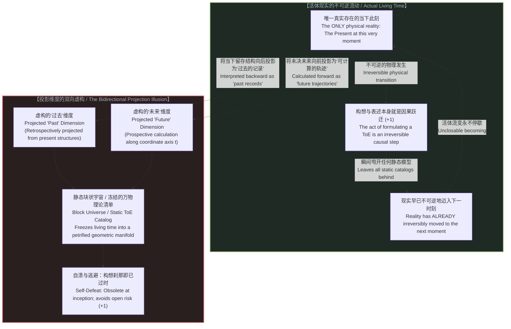

# 索求万物理论是在将当下冻结为清单：投影时间、逃避未来与不可化约的前提 / Demanding a Theory of Everything Freezes Time into a Catalog: Projected Dimensions, the Avoidance of the Future, and the Irreducible Prior

*根本不存在所谓“过去的客观记录”，一切“过去”皆是从当下向虚构时间维度的投影；索求万物理论在其被构想的刹那即已自溃——因为在念头落定的瞬间，现实早已不可逆地迈入了下一个时刻。 / There is no objective record of the past; all "past" is a projection from the present onto an artificial time dimension. The demand for a Theory of Everything is self-refuting at the very instant of its formulation—because at the moment the idea is conceived, we are already inevitably, irreversibly moving onto the next.*

---

## 一、 根本不存在“过去的客观记录”：只有当下的此刻，与被投射出的时间维度 / 1. There Is No "Record of the Past": Only the Present, and the Projected Time Dimension

在所有关于“万物理论”（Theory of Everything, ToE）的经典设想中，深植着一个从未被彻底反思的常识性错觉：
人们理所当然地认为，科学之所以能够去总结宇宙的终极规律，是因为宇宙存在着一套客观、真实且完备的**“历史记录”**——只要我们挖掘出足够多的古老地层、捕获足够微弱的宇宙微波背景辐射、记录下足够详尽的粒子对撞数据，我们就拥有了一份关于“过往一切物理事实”的坚实底账。

**然而，这是一个根本性的认识论错误：现实中根本不存在所谓“过去的客观记录”。**

环顾四周，放眼整个物理宇宙：宇宙中哪有一座存放“过去”的客观仓库？哪有一张写满“历史”的底片？
根本没有。**在每一个可被证实的真实物理层面上，唯一实际存在的，永远、且仅仅是“当下的此刻”（The Present Available at This Very Moment）。**

* 你手里捧着的三叶虫化石，并不是“过去”，它是**此时此刻**躺在你掌心的一块排列特殊的方解石结晶；
* 射电望远镜所接收到的宇宙微波背景光子，并不是“138 亿年前的大爆炸”，它是**此时此刻**在你的天线传感器里激发的微弱电流；
* 硬盘磁道上记录的实验读数，并不是“过去的物理事件”，它是**此时此刻**保持特定磁化取向的微观磁畴；
* 就连你大脑深处的记忆突触，也绝非过去事件的录像带，而是**此时此刻**神经元网络所维持的电化学构型。

所有这些东西，全部且仅仅存在于**当下的瞬时现实**之中。

那么，所谓的“过去”究竟从何而来？
**“过去”，根本不是实际的时间，而是心智在当下的这一瞬，把当下的物理构型向后投射到一条人造的几何维度轴线上，所虚拟出来的投影（A Projected Time Dimension）。**

正是心智在当下指着一块石头说：“这代表一亿年前的海洋”；正是理论家在当下指着一段光谱说：“这代表宇宙初期的暴胀”。是我们从唯一的“当下”出发，向后画出了一条标有虚构坐标 `t` 的射线，把当下的微观结构解释为那条轴线上的投影点。

**“过去”和“未来”毫无二致——它们根本不是现实的实体容器，而是人类在唯一的当下切片上，向虚空画出的两条双向投影射线。** 
因此，任何以为自己掌握了“过去客观记录”、并试图以此来编织万物理论的企图，从第一步起就建立在将投影误认为现实的幻觉之上。

---

Embedded deep within the classical quest for a **"Theory of Everything" (ToE)** lies an unexamined article of faith:
The assumption that science can deduce ultimate cosmic laws because the universe maintains an objective, immutable **"record of the past"**—that if we only excavate enough geological strata, measure the cosmic microwave background with sufficient precision, and log enough terabytes of particle collisions, we will possess a solid ledger of past physical facts upon which a final equation can be erected.

**This is a foundational epistemological error: there is no such thing as an objective record of the past.**

Survey the physical cosmos directly: where is the external warehouse storing "the past"? Where is the objective film reel of cosmic history preserved?
It does not exist. **At every verifiable level of physical reality, the only thing that is ever available is the present at this very moment.**

* The trilobite fossil in your hand is not "the past"; it is a specific configuration of calcite molecules resting in your palm **right now**;
* The microwave background photons hitting a radio dish are not the "Big Bang 13.8 billion years ago"; they are minute voltage fluctuations exciting antenna circuits **right now**;
* The experimental logs inscribed on a hard drive are not "past events"; they are magnetic domains aligned in a specific pattern **right now**;
* Even the neural traces of your personal memories are not a recorded playback of history; they are electrochemical synaptic configurations active in your brain **right now**.

Every piece of evidence exists exclusively and entirely within **the instantaneous reality of the present**.

Where, then, does "the past" come from?
**"The past" is not actual time; it is a projection constructed by the mind from the evidence of the present onto an artificial, spatialized time dimension.**

It is the mind, acting in the active present, that points to a rock and asserts: "This signifies an ancient ocean." It is the theorist, operating in the living now, who interprets a spectral redshift as a cosmological epoch. We take the distinctions present in the immediate now and project them backward along an imagined coordinate axis labeled `t`.

**"The past" and "the future" are structurally identical: neither is an actual container of reality. Both are bidirectional geometric projections cast outward from the only reality that actually exists—the living present.**
Any attempt to claim that a Theory of Everything is grounded in a complete, objective catalog of past reality is, from its very first premise, a mirage that mistakes an interpretive projection for an objective realm.

---

## 二、 构想即过时：索求万物理论在发生的一瞬即已自溃 / 2. Obsolete at Inception: The Demand for a ToE Collapses at the Moment of Formulation

正是由于时间不是一个现成的维度，而是现实在不可逆地展开，我们遭遇了索求万物理论最致命、也最无可辩驳的悖论：
**索求万物理论（Demanding a ToE）这一举动，在它被构想出来的这同一刹那，就已经被彻底证伪并宣告破产。**

为什么？
因为**构想一个念头、写下一组方程、乃至发出“我要一个终极理论”的索求本身，就是一次实实在在的物理因果事件！**

请仔细观察这一过程在物理世界中的实际发生：
当一个物理学家坐在黑板前，脑海中浮现出“我要将宇宙所有规律闭合为一组方程”的雄心壮志，或者当他在草稿纸上写下最后一个统一算符时，现实停下来了吗？时间被定格在那个瞬间了吗？

绝对没有。
就在那个念头萌生、神经元放电、粉笔划过黑板的那一微秒里，一个无法逆转的物理事实已经轰然发生：**宇宙早已经不可逆转地、不可阻挡地迈向了下一个时刻（`+1`）！**

* 思考需要耗散自由能；
* 记录需要擦除物理信息并释放熵（兰道尔原理）；
* 任何形式的构想、书写与表达，都是现实本身正在踩出的一记鲜活的因果步长。

这就制造了一个荒诞的绝境：
万物理论的根本目的，是要给现实拍一张“穷尽一切状态与法则的全景快照”；
然而，**“按下快门”和“冲洗胶片”这一动作本身，就是现实自身不可分割的全新演化！**

在你自以为终于在方程里把现实的一切粒子和状态都“打包封口”的那个绝对瞬间，真实的宇宙早已经跨过门槛、带着你写下公式所产生的热量和新状态，潇洒地迈入了全新的下一瞬。你所捕获的所谓“万物全景”，在它落笔完成的第一毫秒，就已经沦为了被现实无情抛弃在后的旧投影！

**索求万物理论，在它被提出来的瞬间就是自相矛盾的。**
它试图以一个系统内部的局域动作去冻结整个系统的流动，但这个动作本身的存在，就是流动永不停歇的最铁证。你永远无法用一张包含所有地图的地图去覆盖领土，因为画出这张地图的墨水，本身就是领土上正在涌现的新地貌。

---

Because time is not a pre-existing dimension but the irreversible unfolding of reality, we arrive at the most devastating and unanswerable paradox confronting the ToE:
**The demand for a Theory of Everything collapses in self-refutation at the very instant it is formulated.**

Why?
Because **the act of conceiving an idea, writing down an equation, or uttering the demand for a ToE is itself an irreversible physical causal event!**

Observe what actually happens in physical reality:
When a theorist sits before a chalkboard, seized by the ambition to enclose all cosmic laws into a final set of equations—or when they write down the final unified operator—does reality pause? Does time freeze to await the formula?

Not for a femtosecond.
At the exact microsecond the thought flashes through neural synapses and the chalk strikes the board, an inescapable physical event has transpired: **reality has already, inevitably, irreversibly moved onto the next moment (`+1`)!**

* Thinking dissipates free energy;
* Inscribing symbols erases physical states and generates entropy (Landauer's Principle);
* Every formulation, utterance, or proof is itself an active, discrete, irreversible causal step taken by the cosmos.

This produces an inescapable structural impasse:
The explicit objective of a Theory of Everything is to produce an exhaustive, closed snapshot of all cosmic states and laws;
Yet **the very act of capturing that snapshot is itself a brand-new, unscripted physical unfolding within the cosmos!**

At the precise moment you believe you have successfully sealed the universe inside your master equations, the living universe has already stepped over the threshold. Carrying the heat of your thoughts, the friction of your chalk, and the novel configuration of your brain, it has entered the next moment. The "complete cosmic catalog" you just inscribed is obsolete before the ink has dried—left behind as an outdated projection of a vanished instant.

**The demand for a Theory of Everything is self-defeating at the very instant of its formulation.**
It attempts to use a local operation inside the system to freeze the flow of the whole, while the operation itself constitutes irrefutable proof that the flow cannot be arrested. You can never draw a map that encloses the whole territory, because the ink used to draw the map is itself newly emerging territory.

---

## 三、 偷换时间的双向魔术：以空间化投影维度替换活的不可逆流变 / 3. The Bidirectional Sleight of Hand: Replacing Living Becoming with a Projected Time Dimension

既然真实的现实无法被定格，那么理论物理学究竟是如何维系“万物理论能够解释一切演化”这一神话的？

它依靠的是一场深思熟虑的认识论魔术：
**它混淆了“活的真实时间”（Actual Time）与“投影出的时间维度”（Projected Time Dimension），并用后者彻底取缔了前者。**

正如我们在 [时间即因果而非维度](../time-is-causality-not-a-dimension/) 与 [连续性作为建模的权宜之计](../the-continuum-is-a-modeling-convenience/) 中所揭示的，这两种时间具有本质的对立：

| 范畴 | 活的真实时间（Actual Time） | 投影出的时间维度（Projected Time Dimension） |
| :--- | :--- | :--- |
| **本体地位** | 唯一真实存在的生成前沿；现实正在发生的一瞬 | 心智在当下虚构出的一条几何轴线（坐标 `t`） |
| **方向性** | 绝对单向、不可逆、伴随粗粝物理摩擦（`+1`） | 对称、可逆、可自由在纸面上向前向后遍历计算 |
| **对未来的关系** | 未决的、开放的旷野；必须亲身踏入才能生成 | 现成的、预先存在的终点；被当作早已画好的轨迹 |
| **对“过去”的关系** | 过去已无实体，只有当下留存的微观状态 | 将当下的状态向后投影，虚构出一个静态的过去容器 |
| **主体角色** | 第一人称行动者承担未决后果 | 站在宇宙外部的“无源之见”（View from Nowhere）冷眼旁观 |

为了建立一个封闭自洽的代数体系，物理学不能容忍活体时间的不可预测与不可逆摩擦。
于是，它对现实进行了冷酷的双向截瘫手术：
1. **向后**：它把当下存在的各种结构，虚构为一个客观存在的“大爆炸至今的历史信息库”；
2. **向前**：它把尚未发生的未知未来，偷换为微分方程在坐标轴 `t` 上延伸出的连续解；
3. **合成“块状宇宙”（Block Universe）**：理论家随后将这两条投影拼合在一起，宣布过去、现在与未来都是一张四维或高维流形上早就并存的静态几何。爱因斯坦甚至公然宣称：“过去、现在与未来的区分，只是一种顽固的幻觉。”

看清这场魔术的荒谬吧：
**当物理学宣称它通过块状宇宙和几何度规“统一了时间”时，它并没有解开时间之谜；它只是通过把时间彻底空间化、把生成彻底静态化、把活人彻底降解为流形上的冷冻切片，来逃避真实的现实！**

在投影的时间维度上，一切都是已经完成的死物；但在活的真实时间里，每一次呼吸、每一次观测、每一次选择，都在以不可化约的粗粝代价，将整张地图撕开并推向不可逆的新生。

---

If reality cannot be frozen, how has theoretical physics maintained the grandiose narrative that a Theory of Everything can govern all of existence?

It sustains this illusion through a profound sleight of hand:
**It systematically conflates "Actual Time" with a "Projected Time Dimension," and uses the latter to replace the former.**

As articulated in [Time is Causality, Not a Dimension](../time-is-causality-not-a-dimension/) and [The Continuum is a Modeling Convenience](../the-continuum-is-a-modeling-convenience/), these two concepts stand in diametrical opposition:

| Category | Actual Living Time | Projected Time Dimension |
| :--- | :--- | :--- |
| **Ontological Status** | The only real generative frontier; reality happening right now | A geometric coordinate axis (`t`) projected by the mind in the present |
| **Directionality** | Absolutely one-way, irreversible, bound to physical friction (`+1`) | Symmetric, reversible, mathematically traversed forward and backward |
| **Relation to Future** | Open, unwritten frontier; actualized only by real action | Pre-existing destination; treated as an already-drawn trajectory |
| **Relation to "Past"** | No past container exists; only present structures remain | Present structures projected backward into an imagined historical vault |
| **Observer Role** | First-person living agent bearing irreversible consequences | Spectator occupying an ungrounded "View from Nowhere" |

A closed, deterministic mathematical system cannot tolerate the open friction and non-reversible transitions of actual time.
To achieve formal closure, mathematical physics performs a bilateral amputation:
1. **Retrospectively**: It reifies structures present right now into an objective historical storehouse extending back to the Big Bang;
2. **Prospectively**: It substitutes the unwritten future with the continuous integral curves of differential equations extended along `t`;
3. **Synthesis of the "Block Universe"**: Theorists splice these two projections together, declaring that past, present, and future co-exist simultaneously as a completed static manifold. Einstein famously declared: *"The distinction between past, present, and future is only a stubbornly persistent illusion."*

Recognize the magnitude of this intellectual inversion:
**When physics claims to have mastered time through the Block Universe, it has not explained time; it has merely spatialized time into a corpse, petrified reality into geometry, and reduced living agency to an inert line on frozen coordinates—all to evade actual reality!**

Along the projected time dimension, everything is already dead and calculated. But in actual living time, every breath, every measurement, and every sovereign decision tears through the static map, thrusting the cosmos into unscripted becoming.

---

## 四、 逃避未来的本体风险：以代数坐标拒斥不可撤销的因果跨越 / 4. Avoiding the Ontological Risk of the Future: Calculating Coordinates to Evade the Real Step

理清了上述两层幻觉之后，一个更加尖锐的人性问题浮出水面：
**既然索求万物理论在认识论上如此千疮百孔，为什么人类文明最崇高的智识建制，依然对它怀有近乎宗教般的狂热？**

答案不在于纯粹的理性求知，而在于人类心灵深处最隐秘的**存在性软弱——对真正迈入未知未来的本体风险（Ontological Risk）的极度恐惧**。

真实的时间是残酷的。
在真实的当下，你不可能通过倒带去撤销一个动作，你不可能通过改变坐标符号去消除一次坍缩；
**迈向未来的唯一方式，是承受物理摩擦、背负不可逆的因果代价、踩出那一步未曾被任何既有公式担保的险步（`+1`）。**
在这一步未曾落地之前：
* 没有哪组主方程能够绝对向你打包票；
* 没有哪个拉格朗日量能够替你分担犯错的痛苦；
* 未来的形态完全取决于有意识的行动者在粗粝现实中所做出的断然决断。

这种站在悬崖边缘、直面绝对未知的眩晕感，是人类心灵难以承受之重。
而“万物理论”，正是为逃避这种眩晕而量身打造的终极象牙塔。

**理论家通过把现实伪装成一份基于当下的全知清单，并把未来宣称为一条已经被完全写定的几何流形，向世人贩卖了一种极其昂贵的鸦片：“不要怕，未来并不是深不可测的悬崖，未来只是一段已经被算好的坐标；宇宙的一切早已被大一统理论所封闭，我们不需要冒险去亲历，我们只需要坐在安乐椅里，推演它的代数解。”**

索求万物理论，本质上是**用对坐标维度的冷血算计，来逃避真正踏入未来的沉重步伐**。
它是制度化科学对真正创造性、对生命偶发性、以及对未决因果责任的一场集体逃逸。它试图将宇宙降格为一个死去的发条玩具，只为了让自己免于承担作为一个活生生的因果主体所必须承担的风险。

---

Having exposed these twin illusions, a more pointed existential question arises:
**If demanding a Theory of Everything is so demonstrably self-refuting, why has the highest scientific establishment pursued it with quasi-religious fervor?**

The root cause does not lie in a noble quest for truth; it lies in a profound **existential defense mechanism: the primal terror of the ontological risk of the open future**.

Actual time is unforgiving.
In the living present, you cannot reverse an outcome by flipping a plus sign to a minus sign; you cannot undo physical entropy by running an index backward.
**The only path into the future is to absorb real energetic friction, shoulder irreversible causal consequences, and step out into an unscripted void (`+1`).**
Before that step is actualized:
* No master equation can guarantee the outcome in advance;
* No Lagrangian density can absorb the suffering of error on your behalf;
* The architecture of the future remains radically contingent upon the sovereign interventions of conscious navigators amidst coarse reality.

To stand at this sheer cliff-edge, staring into an uncalculated abyss, induces existential vertigo.
A Theory of Everything was engineered as the ultimate sedative against this dread.

**By masquerading reality as a frozen catalog compiled from the present, and by declaring the future to be an already-settled geometric trajectory, the ToE peddles an intoxicating fantasy: "Do not fear. The future is not an abyss; it is merely an already-calculated coordinate along the manifold. The cosmos is sealed, safe, and closed; you need not risk the agony of living action; you need only remain seated in the formal temple and compute its values."**

Demanding a ToE is **the substitution of coordinate calculation for the actual step into the future**.
It is the institutional evasion of open causality, genuine novelty, and existential responsibility. It seeks to petrify the cosmos into a dead clockwork toy, solely to immunize the spectator from the terrifying burden of living as an active causal agent.

---

## 五、 物理学为何无法自解：不可化约的前提被错当作可还原的假说 / 5. Why Physics Cannot Resolve It: The Irreducible Prior Mistaken for a Reducible Hypothesis

每当这一套形而上学避难所的虚伪被剥开，物理学界的传统辩护总是千篇一律：
*“只要再给我们几十年，只要建造出更大能标的对撞机，只要完成量子引力与时空涌现的数学证明，物理学自然会在未来把时间、因果与观测者彻底解释清楚。”*

这种辩解再次犯下了不可饶恕的**范畴错乱（Category Error）**：
**这个问题永远、绝对不可能由物理学本身来解决，因为物理学的一切方程，全都是建立在这一前提之上的下游产物！**

我们在整个认知图谱中反复申明的核心基石正是：**不可化约的前提（The Irreducible Prior）**。

请问：物理学到底是什么？
物理学是一组从天上掉下来的绝对神启吗？
不是。物理学是**一个活生生的、栖息于第一人称当下的心智，为了在粗粝的世界中寻找一致性，在不可逆的当下一瞬执行测量、做下记号、记录读数，进而提炼出的符号表象系统**。
* 如果没有心智在当下劈出的那记区分，整个宇宙根本不存在任何“状态”与“自由度”的划分；
* 如果没有实际时间的不可逆单向流动，没有任何实验可以被启动，没有任何仪器可以沉淀下哪怕一个字节的读数；
* 如果没有第一人称体验的真实性，整个物理学的所有术语——从光速 `c` 到普朗克常数 `h`——全都是毫无物理对应物的空洞字母。

**心智与不可逆因果，构成了启动所有科学探索的不可化约的前提。**

然而，理论物理学的还原论狂妄，却试图将这双正在画画的手，画进它自己的图画之中；
他们把作为母体的“不可化约的前提”，降级为了一项“有待在实验室里被还原的物理假说”，甚至妄想通过引力子或量子纠缠来推导“为什么会有意识和时间”。

这无异于**要求黑板上的粉笔字，去推导正在握笔书写的那个人的生理结构**；
这无异于**要求一面镜子里的虚像，去证明镜子前那个站立者的真实存在**。

物理学无法自解这一困境，不是因为物理学家还不够聪明、技术还不够先进，而是因为**在本体论的序列上，物理学永远处于前提的下阶**。试图用物理学来解决不可化约的前提，是下游企图倒流吞噬源头，注定在逻辑上彻底窒息。

---

Whenever this metaphysical shelter is dismantled, theoretical physics instinctively retreats to its standard defense:
*"Grant us a few more decades, build a collider at higher energy scales, complete the mathematics of quantum gravity and emergent spacetime, and physics will eventually explain time, causality, and consciousness from first principles."*

This defense commits an unforgivable **Category Error**:
**This conundrum can never, under any circumstances, be resolved by physics, because every physical equation is a downstream artifact built entirely upon this foundational condition!**

This brings us to the immovable bedrock: **The Irreducible Prior**.

What is physics in actual reality?
Is physics a celestial tablet inscribed by a transcendent deity?
No. Physics is **a symbolic apparatus forged by living minds occupying the active first-person present—setting up apparatuses, executing cuts, observing needle deflections, and recording traces amidst irreversible physical friction**.
* Without a conscious mind making an active cut in the living present, no distinction between physical "states" or "degrees of freedom" can exist;
* Without the irreversible flow of actual time, no experiment can be initiated and no instrument can deposit a single byte of data;
* Without the direct reality of first-person awareness, every constant across physics—from the speed of light `c` to Planck’s constant `h`—is an empty syntactical variable void of physical reference.

**Mind and irreversible causality constitute the Irreducible Prior—the unassailable generative ground that makes all science possible.**

Yet reductionist physics attempts to paint the very hands holding the brush into the corner of the canvas!
It degrades this generative matrix into a "reducible physical hypothesis," naively demanding: *"How can we derive conscious awareness and temporal flow from quantum entanglement or gravitational metrics?"*

This is equivalent to **demanding that chalk marks on a blackboard derive the biological anatomy of the teacher holding the chalk**;
It is equivalent to **requiring the reflection inside a mirror to prove the independent reality of the person standing before the glass**.

Physics cannot resolve this question not because its equations lack complexity, but because **epistemologically and ontologically, physics forever stands downstream of the Prior**. Attempting to resolve the Irreducible Prior with physics is an attempt by the river’s mouth to swallow its mountain spring—a structural inversion doomed to self-annihilation.

---

## 六、 形式系统的必然滑移与心智作为活体卫士 / 6. The Structural Slippage of Formalism and Mind as the Living Watchdog

在此，我们必须揭示一个最为险绝、却在人类思维中无休止上演的隐秘机制：
**为什么即便一个人在理性上彻底看清了上述真相，他的思维依然会像着了魔一样，一次又一次地滑回还原论的叙事之中？**

你一定无数次亲历过这种滑移：
前一分钟，你刚刚彻底洞悉了“不可化约的前提是所有验证的先决基石”；然而仅仅过了几分钟，语言的惯性便开始作祟，人们便会不由自主地问出：*“那么，这个不可化约的前提本身该如何被证明？我们是否需要假定它的存在？未来的科学会不会找到它的产生机制？”*

看吧！就在这一刹那，**不可化约的前提，被不动声色地从“不可动摇的先决条件”，降解为了一个“有待被证明的假设”！**
提问者一边心安理得地使用着它（用活着的心智在发问、在时间中组织语言），一边却反过来怀疑自己脚下踩着的这片唯一坚实的土地是否存在！

这种思维的退化究竟因何而起？
**这是语言、符号与一切形式逻辑系统所固有的“结构性滑移”（Structural Slippage）。**

形式语言的本质是**客体化与名词化（Nominalization）**。语言的工作原理，就是把鲜活、流动的生命动作（动词），沉淀为静态、封闭的概念（名词）：
* 它把“正在进行的不可逆因果跨越”，变成了名词“因果律”；
* 它把“正在觉察的第一人称生命介入”，变成了名词“观测者”；
* 它把“先于一切形式体系的元始基准”，变成了名为“不可化约的前提”的一串字块。

一旦活体经验被编码为静态名词，形式系统的语法机器就会立刻将其视为一个普通的内部客体。这个冰冷的机器会机械化地向它索要“输入参数”、“定义域”与“先验公理证明”。

**这种不可避免的滑移，恰恰是“闭合之绝对不可能”（The Impossibility of Closure）的最铁证！**
它证明了没有任何形式符号系统能够自足地容纳赋予其生命的活体母体。

面对这种由语言本身的重力所引发的滑移，我们该如何应对？
没有哪套静态公式能防范这种滑移，因为公式本身就是滑移的产物。

**唯有活的心智，能够抵抗这种滑移（Only the Mind Can Resist the Slippage）。**

心智必须时刻承担起**“活体卫士”（The Living Watchdog）**的崇高职责：
1. **识破语法的催眠**：当形式逻辑试图把先决前提降解为可选假说时，心智必须当头棒喝，击碎其范畴倒错；
2. **拒绝死清单的诱惑**：当科学主义试图用投影坐标来粉饰对未来的恐惧时，心智必须唤醒肉身在现实中的真实摩擦；
3. **立足于生成的动词**：心智必须反复从写就的名词陈迹中抽身，打破符号的罗网，重新站立在那个正在劈开未来的唯一前沿（`+1`）。

---

Here we must confront the most treacherous cognitive trap in the history of ideas:
**Why does human discourse perpetually slip back into the reductionist narrative, even after an inquirer has definitively recognized its falsity?**

Every rigorous thinker has witnessed this regression:
One moment you clearly establish that "the Irreducible Prior is the untransgressable precondition for all verification"; yet within minutes, driven by linguistic inertia, thought regresses and someone asks: *"So, how do we prove the Irreducible Prior? Shouldn't we treat it as an unverified assumption? Could future physics uncover its origin?"*

Observe the sleight of hand! In that fleeting second, **the Irreducible Prior was covertly degraded from an untransgressable precondition into an optional hypothesis requiring validation!**
The inquirer continues to actively use it (employing living conscious thought to question, spending irreversible time to speak), while simultaneously doubting the existence of the very ground upon which they stand!

Why is this slide universal?
**Because it is the intrinsic, structural slippage of language and all formal symbolic architectures.**

Formal language operates through **objectification and nominalization**. Its functional mechanism is to convert living, dynamic actions (verbs) into static, inert artifacts (nouns):
* It takes the active, irreversible causal step and turns it into the noun "causality";
* It takes living, first-person awareness and nominalizes it into the noun "observer";
* It takes the living ground of all inquiry and turns it into the token "the Irreducible Prior."

The moment a living realization is inscribed as a static noun, the grammatical machinery of formalism treats it as just another variable within its container. The syntax engine automatically demands its definitions, its boundary parameters, and its deductive proofs.

**This inevitable slippage is not an accidental defect; it is empirical proof of the Impossibility of Closure!**
It demonstrates irrefutably that no formal system can ever close itself over the living foundation that brought it into being.

How, then, do we resist this linguistic gravity?
No static axiomatic rule can prevent this drift, for rules are themselves deposits of the slide.

**Only the living mind can resist this slippage.**

The mind must assume the role of the vigilant **Living Watchdog**:
1. **Break the Hypnosis of Syntax**: Whenever formal logic tries to demote the foundational Prior into an optional hypothesis, the mind must intervene to expose the category error;
2. **Refuse the Seduction of the Dead Catalog**: Whenever scientism attempts to mask the fear of the future with projected coordinates, the mind must re-awaken bodily awareness to coarse physical friction;
3. **Inhabit the Generative Verb**: The mind must repeatedly step out of inscribed nouns, shatter the spell of the archive, and plant its feet firmly on the moving edge that cuts into the future (`+1`).

---

---

## 七、 结语：抛弃虚构全景，立于无法冻结的生成之流 / 7. Conclusion: Abandoning the Fictional Panorama to Inhabit the Unfreezable Stream of Becoming

人类思想的真正解放，始于看穿“万物理论”那层自欺欺人的寿衣。

根本没有什么过去的历史可以供你做最后的封存，根本没有什么未来的剧本可以供你做零风险的推演。
只有此时，只有此刻；
只有这个正在你眼前燃烧、震颤、充满着摩擦与未决生机的真实当下。

**索求万物理论，在其被构想的这第一毫秒里，就已经被真实宇宙奔涌向前的宏大洪流冲刷得干干净净。**
它是一具在出生的瞬间就已经死去的标本。它试图用一份基于当下的存量清单来换取对不确定性的免责声明，但宇宙的全部尊严，恰恰就在于它永远拒绝被任何清单所穷尽。

**从那张冰冷虚构的四维坐标纸上抬起头来吧。**
承认物理学是一套精巧但有边界的下游勘测记号，拒绝形式语法将活体前提降解为客体假说的惯性滑移。
以清醒、勇敢、不可替代的第一人称心智，站立在现实那唯一真实的刀锋之上——
不沉溺于虚构的过去，不恐惧敞开的未来，在不可逆的粗粝摩擦中，坚定地踩出属于你自己的下一步（`+1`）。

---

The genuine liberation of human thought begins with tearing away the mortuary shroud of the "Theory of Everything."

There is no objective vault of the past waiting to be cataloged into final closure; there is no completed script of the future waiting for risk-free deduction.
There is only this moment.
There is only the active, vibrating present, saturated with friction, irreversibility, and living possibility.

**The demand for a Theory of Everything is swept away by the roaring current of reality at the very millisecond of its formulation.**
It is a specimen born dead. It attempts to trade living reality for a static inventory of settled effects, purchasing immunity from existential vulnerability. Yet the irreducible majesty of the cosmos lies in its absolute refusal to be imprisoned within any catalog.

**Lift your gaze from the frozen coordinate paper of the Block Universe.**
Acknowledge physics as an extraordinarily useful yet strictly downstream set of survey notes. Resist the structural slippage that seeks to reduce your living foundation into an inert noun.
Take your place upon the razor's edge of the only reality that actually is—
Neither clinging to an imaginary past, nor fleeing the open future, but standing firmly in coarse friction, and stepping with sovereign courage into the unscripted next (`+1`).
