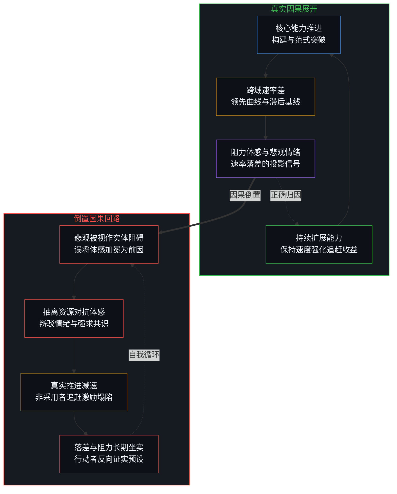
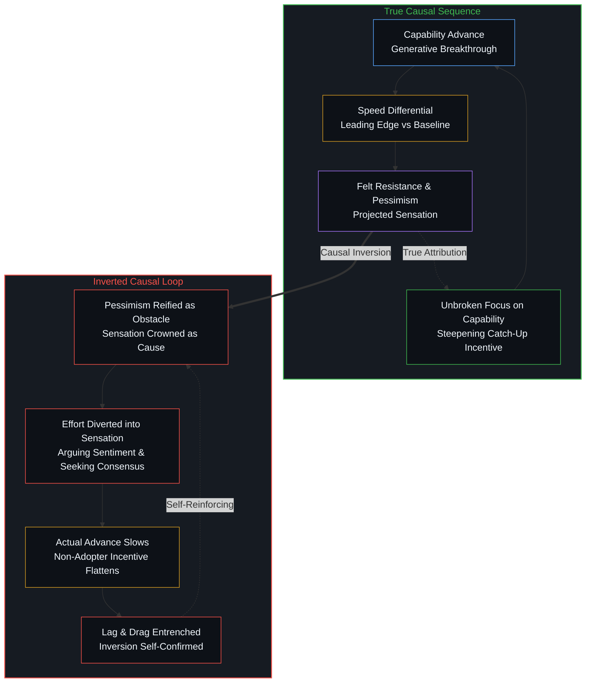
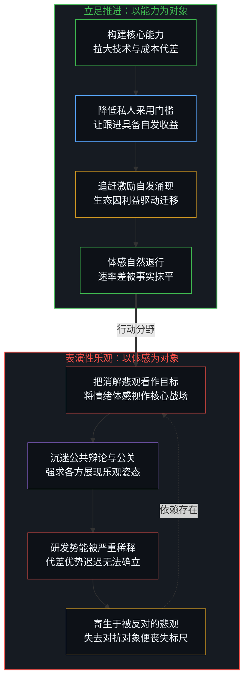
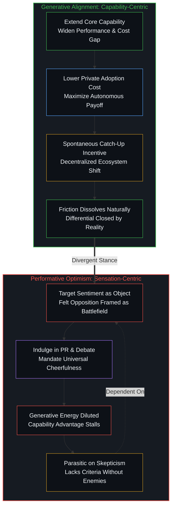

# 阻力体感与速率差 / Felt Resistance and the Speed Differential

*阻力仅是速率差的体感投影，对抗体感只会因抽离构建资源而坐实迟滞。 / Resistance is the sensation of a speed differential, and contesting it merely confirms lag by diverting generative effort.*

心智所感知到的阻力，并非独立施加于演进之上的客观反作用力，而是不同能力推进速率产生落差时的体感投影。当某一维度的能力突破显著快于周遭的适应节奏，这种速率差便在经验界面中显影为阻抗与悲观情绪。把这种体感误认作拖慢前进步伐的外在因由，进而将资源从能力推进转移至消解体感，不仅无法弥合落差，反而会削弱非采用者跟进的私人激励，在剥夺生成势能的同时将迟滞牢牢坐实。

Felt resistance is not an autonomous force acting upon progress, but the proportional sensation of a differential in rates across asymmetric domains. Where one line of capability advances faster than the surrounding pace of adaptation, the realized speed gap registers within experiential interfaces as friction or pessimism. Mistaking this sensation for the external cause of delay, and subsequently diverting resources from extending capability into pacifying sentiment, fails to narrow the differential; instead, it flattens the private incentive for non-adopters to catch up, entrenching the very lag it aims to extinguish.

## 一、 阻力并非外力，而是速率差的体感 / 1. Resistance as Sensation of a Speed Differential

在技术演化与社会变迁的争鸣中，阻碍常被描绘为一堵横亘在时代面前的高墙。传统视角习惯将技术抵制视作某种独立的负向能量，正如蒸汽机、早期汽车乃至现代计算网络出现时，既有利益群体对变革的声讨总被归结为顽固的反抗意志。然而，若将视野切回因果的发起端，所谓的阻力从未独立于演进之外。一条能力曲线的激进拉升，必然在其与周围迟缓系统的交界面上拉扯出巨大的斜率差。阻力不是迎面吹来的飓风，而是疾驰列车与相对静止空气之间因相对速度而激发的流体摩擦。落差越大，所激发出的迟滞体感与悲观声浪便越发尖锐。

In cultural debates surrounding technological change, resistance is routinely depicted as an unyielding wall standing in the path of the future. The conventional stance treats friction as an autonomous negative energy; historical episodes—from early automobiles confronting carriage interests to algorithmic systems displacing legacy bureaucracies—are habitually framed as confrontations with an entrenched counter-will. Yet tracing causality back to its origin reveals that resistance possesses no independent reality outside the differential itself. The rapid steepening of one capability curve inevitably shears against lagging institutional baselines. Resistance is not a headwind blowing in from the void, but the aerodynamic drag generated between an accelerating vehicle and stationary air. The larger the speed differential, the sharper the felt resistance and accompanying pessimism register.

至关重要的认识论区分在于，速率差所激发的体感本身，丝毫不从先行者的推进速度中扣减动力。体感的强度与能力的推进速率是两条在因果上可以分离的运动轨迹。只要心智的行动载荷始终钉在能力的扩展、边界的开拓与底层构件的打磨上，即使周围充斥着强烈的抗拒与质疑，真实的演进速率依然能够保持不减甚至持续加速。相反，若早早将注意力涣散于周遭的迟疑，哪怕外部阻力体感因缺乏对照而趋于平缓，系统却早已陷入实质的停滞。高强度的体感阻力可以伴随高歌猛进的创造，而微弱的体感也可以伴随裹足不前的沉沦。正如[悲观是乐观的阴影](../pessimism-is-the-shadow-of-optimism/)所揭示的，阴影无论多么庞大，都仅仅是被光芒投射出的轮廓，它既不具备与光平起平坐的创生力，也无法凭空吞噬光源的生成。

The vital epistemological distinction is that the sensation excited by a speed differential does not inherently subtract momentum from the advancing edge. The intensity of felt resistance and the realized rate of advance remain causally separable trajectories. So long as generative energy remains anchored to expanding capability, testing boundary friction, and lowering the operational cost of adoption, progress proceeds undiminished or even accelerates amid fierce cultural skepticism. Conversely, when collective attention is drawn into managing ambient doubt, the sensation of resistance may diminish simply because the differential has collapsed, leaving the system stranded in stagnation. Acute felt resistance can effortlessly coexist with relentless generative compounding, just as serene complacency can mask complete inertia. As articulated in [Pessimism Is the Shadow of Optimism](../pessimism-is-the-shadow-of-optimism/), no matter how thick the shadow appears, it remains an optical projection of the cast light, lacking both co-equal generative authority and the capacity to extinguish its source.

## 二、 因果倒置：把体感当成阻碍的自我证实 / 2. The Causal Inversion: Sensation Cast as Obstacle

世俗叙事几乎无一例外地倒置了这一因果链条。它将悲观与抗拒构造成一种自主的实体阻碍，断言正是因为阻力太大、悲观者过多，技术与文明的前进才步履维艰；由此推导出一个看似理所当然的谬论：必须先做通怀疑者的思想工作，消弭阻力体感，进步才能继续启程。一旦体感被加冕为原因，与之争辩、试图压制反对意见、向迟缓体系妥协以求合意便被包装成了推进工作的刚性前置条件。原本是速度差异衍生的被动信号，被篡改成了阻挡前行的实体门槛。在[减速是加速时感受到的阻力](../deceleration-is-the-drag-felt-when-accelerating/)中即可看清，将加速产生的反作用力当成要求系统减速的令旗，是心智在受力反馈中迷失方向的典型表征。

Conventional narratives almost universally invert this causal chain. They reify pessimism and friction into autonomous impediments, asserting that progress falters precisely because resistance is formidable and skeptics are vocal. This inversion yields a seductive fallacy: that appeasing the reluctant, shifting public sentiment, and dissolving felt resistance form prerequisites for further technical advance. Once sensation is crowned as the primary cause, contesting opposition and negotiating consensus appear as mandatory preconditions. A derivative signal generated by uneven development is thereby elevated into an exogenous barrier. As analyzed in [Deceleration Is the Drag Felt When Accelerating](../deceleration-is-the-drag-felt-when-accelerating/), interpreting the inertial pushback of acceleration as a directive to brake exemplifies how human cognition frequently confuses feedback telemetry with destination steering.

顺应这种倒置行事，恰恰在亲手制造它所声讨的阻力。当宝贵的算力、资本与智识精力从扩展能力前沿撤出，转向去论战、安抚与说服怀疑者时，真正的创造速率便被不可避免地拖慢了。由于新技术的性能代差未能被迅速拉大，使用旧范式的机会成本便未曾飙升，那些坚守迟缓路径的群体便感受不到紧迫的追赶压力。结果便是：试图直接消解体感的举动，削平了外部自发追赶的私人收益，使得演进落差长期横盘；原本旨在消除的滞后体感，反倒因为这种资源的抽离而绵延不绝。在此，对抗阻力的姿态与被其对抗的迟滞，实则是同一次因果抽离在两个方向上的互文照应。

Acting upon this inversion actively manufactures the very impediment it laments. When scarce talent, compute, and capital are siphoned away from advancing capability frontiers to debate, soothe, or legislate against skeptics, the generative rate of progress decelerates. Because the performance gap fails to widen rapidly, the opportunity cost of clinging to obsolete paradigms remains low, depriving non-adopters of the acute economic pressure to modernize. The attempt to directly suppress felt resistance flattens the private payoff of catching up, prolonging the transitional gap; the friction that was supposed to be eradicated is sustained by the very efforts deployed to extinguish it. The militant stance that fights resistance and the stagnant lag it decries are two faces of the exact same diversion.

## 三、 推进拓展与表演性乐观的界河 / 3. Alignment with Progress Versus Performative Optimism

这一因果机制清晰地划定了立足推进与表演性乐观之间的楚河汉界。立足于推进的行动者，其精力专一地倾注于拉升更快的速率：提升工具性能、削减采用门槛、拓宽落地场景，而从不将伴随产生的阻力体感当作必须修正的输入项。因为明白体感仅仅是速率差的衍生指标，这种构筑既不强求外界同步变得乐观，也不把周遭的悲观视作不可逾越的拦路虎。技术与制度的追赶，从来不是说服教育的产物，而是能力鸿沟拉大后不可阻挡的利害重构。在[进步叙事中的症候与原因](../symptom-and-cause-in-the-narratives-of-progress/)与[个体抉择是唯一的因果杠杆](../individual-choices-as-the-only-causal-levers/)中可以看到，只有实打实的边际能力提升，才能在去中心化的微观抉择中引发真正的范式迁移。

This dynamic delineates a crisp boundary between genuine alignment with progress and performative optimism. Alignment with progress consists in expanding the leading rate: amplifying capability, lowering the private friction of adoption, and scaling practical utility, without treating ambient resistance as an input that requires emotional rectification. Recognizing that friction is merely a derivative readout of a speed differential, such builders neither demand that observers adopt cheerfulness nor interpret prevailing skepticism as a structural bottleneck. Institutional and social catch-up is never the fruit of rhetorical persuasion; it is the inevitable reorganization of self-interest triggered when capability gaps become overwhelming. As explored in [Symptom and Cause in the Narratives of Progress](../symptom-and-cause-in-the-narratives-of-progress/) and [Individual Choices as the Only Causal Levers](../individual-choices-as-the-only-causal-levers/), only tangible margins of realized capability compel decentralized agents to rewrite their operational commitments.

与此相对，表演性乐观则将情绪体感奉为自己的行动标的。它把成功定义为悲观言论的平息与怀疑阵营的臣服，因此其资源大量倾泻在与滞后现象的口诛笔伐之中。这种姿态直接落入了前述的因果陷阱：推进速率因精力分散而迟滞，速率差迟迟无法靠事实收敛，伴生的体感阻力便永久性地居高不下。更为讽刺的是，表演性乐观在结构上寄生于它所声称反对的悲观主义；一旦失去了对立面的怀疑与抗拒，这种依靠反抗反抗来确认存在感的姿态便失去了独立的度量标尺。

Performative optimism, in stark contrast, takes the sensation of resistance as its operational target. It measures success by the silencing of critics and the outward conversion of skeptics, dissipating immense bandwidth in ideological combat against ambient hesitation. This stance walks directly into the quicksand of causal inversion: because core building slows, the differential fails to close through overwhelming functional superiority, leaving the felt friction suspended indefinitely. Poignantly, performative optimism remains structurally parasitic upon the very pessimism it purports to despise; stripped of the skepticism it defines itself against, it possesses no autonomous compass or internal criterion of truth.

## 四、 混合表象与单一因果序列的解离 / 4. Mixed Appearances and the Single Causal Sequence

在复杂的现实协作中，这两种动向很少以割裂的形式呈现。一项拓展能力的真实行动，常被包裹在回击质疑者的公关修辞中发布；而一次针对怀疑论的辩驳，也偶尔能在附带效果中拔除某些微小的协作卡点。这种杂糅使得经验观察显得混乱不堪：有时痛击悲观主义似乎伴随着技术的快速落地，有时却带来无休止的内耗与延宕。之所以产生这种认知困惑，是因为观察者未能将改变物理推进速率的实在做功，与仅仅针对迟滞体感所做的修辞抚慰拆解开来。正如[调速者的幻觉与行动的活态摩擦](../the-fallacy-of-pacing-and-the-felt-friction-of-ground-truth/)所指出的，在观察台上拨弄钟表的调速者，从未触及地表推进的真实履带。

In tangled human affairs, these two trajectories rarely present themselves in laboratory isolation. A substantive enhancement in capability is often broadcast under the cover of polemical rebuttals against skeptics, while a public defense may occasionally eliminate a minor bureaucratic hurdle as a byproduct. This interweaving produces empirical paradoxes: attacking pessimism sometimes appears to precede rapid deployment, while at other times it bogs down in acrimonious stagnation. Observers stumble into confusion because they fail to disentangle the component that altered the physical rate of advance from the component that merely massaged the interpretation of lag. As demonstrated in [The Fallacy of Pacing and the Felt Friction of Ground Truth](../the-fallacy-of-pacing-and-the-felt-friction-of-ground-truth/), tinkering with the dials on an observer platform never alters the traction of treads moving across rocky terrain.

一旦用锋利的解剖刀将行动究竟是改变了速率差、还是仅仅干预了体感这一判准区分清楚，所有的经验迷雾便重新沉降为一条清晰的单向因果链：速率差决定了阻力体感的烈度，而唯有改变速率差的创造行动，才能真正消融阻力的体感。把阻力当成独立前因的努力，不仅丝毫碰触不到速率差本身，还会因其所空耗的生成资源而反向放大这种落差。心智若想真正立足于演进的一侧，就必须看穿表演性乐观的自我陷阱，停止向体感征税，将全部意志投注回第一人称的实在构筑之中。而当这种体感阻力被外部观察者进一步概念化为所谓少数精英才能承受的高级苦时，唯有回到[观察的因果僭越与第一人称的收益差](../the-causal-overstep-of-observation-and-the-first-person-surplus/)，才能看清任何持续行动从来不是对痛苦的苦修，而是第一人称对内在收益超越即时摩擦的自发计算。拿封闭集合中的最好或最坏去衡量阻力，正是[闭合的N与开放的现实](../the-closed-n-and-the-open-reality/)所指出的陷阱。

Once this analytical scalpel cleanly distinguishes between actions that shift the rate of advance and those that merely fiddle with the registration of lag, empirical confusion dissolves into an unambiguous causal chain: the speed differential determines the intensity of felt resistance, and only effort that alters the differential can dissolve that resistance. Treating resistance as an autonomous cause leaves the differential untouched, and by the scarce resources it burns, almost always widens it. For the sovereign Mind striving to align with genuine advance, the mandate is clear: discard the seductive theater of performative optimism, cease paying tribute to ambient sensations of friction, and reinvest every ounce of first-person resolve into tangible creation. When such felt friction is further reified by external observers into an alleged elite requirement for enduring advanced pain, returning to [The Causal Overstep of Observation and the First-Person Surplus](../the-causal-overstep-of-observation-and-the-first-person-surplus/) restores the foundational truth: long-term persistence is never stoic self-mortification, but the spontaneous calculation of a first-person surplus that dwarfs surface friction. Measuring resistance against the best or worst of a closed set is the trap [The Closed N and the Open Reality](../the-closed-n-and-the-open-reality/) names.

