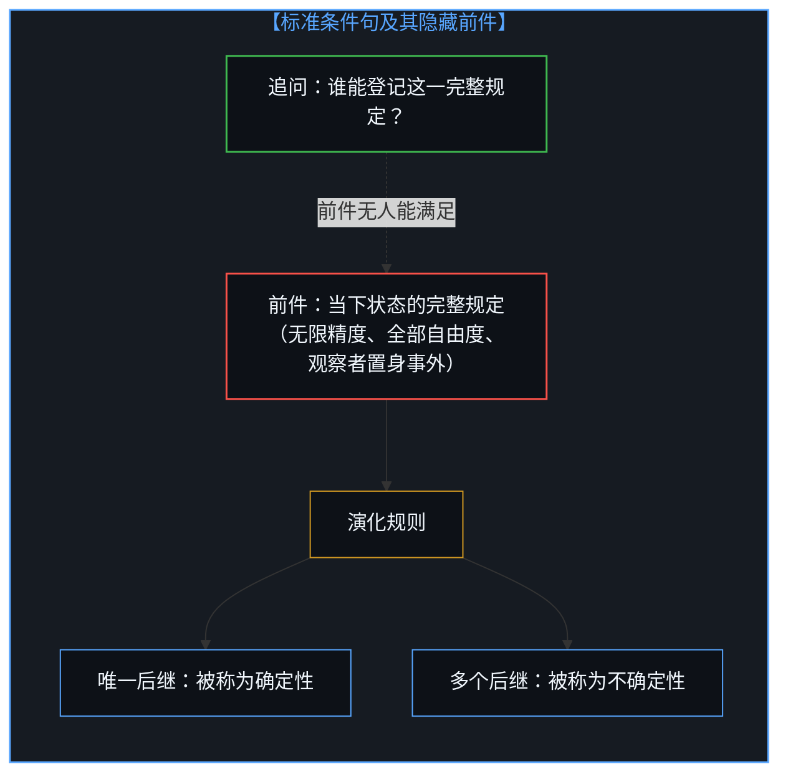
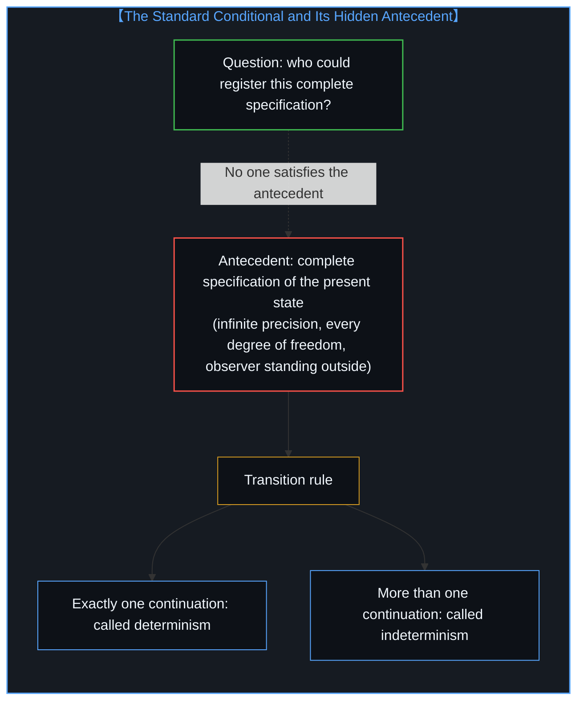
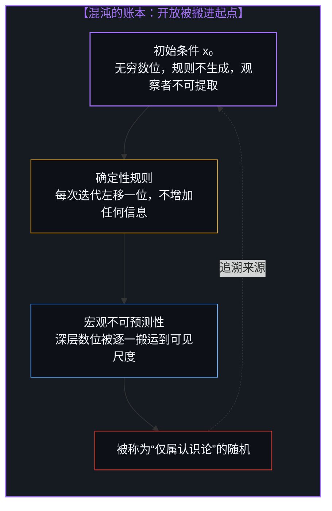
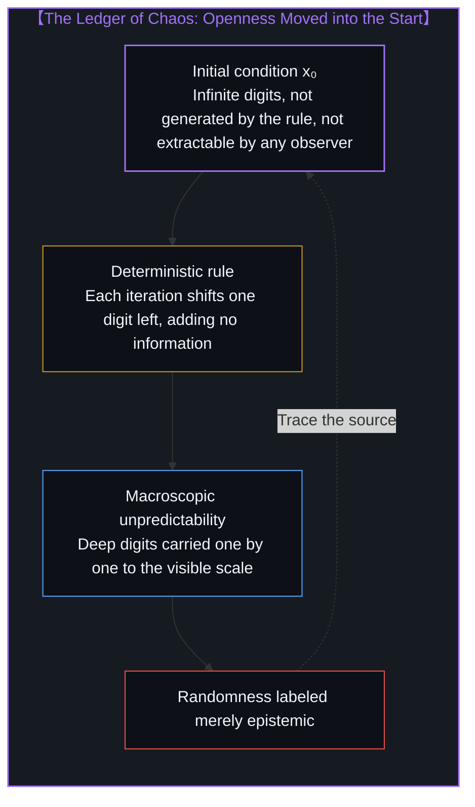
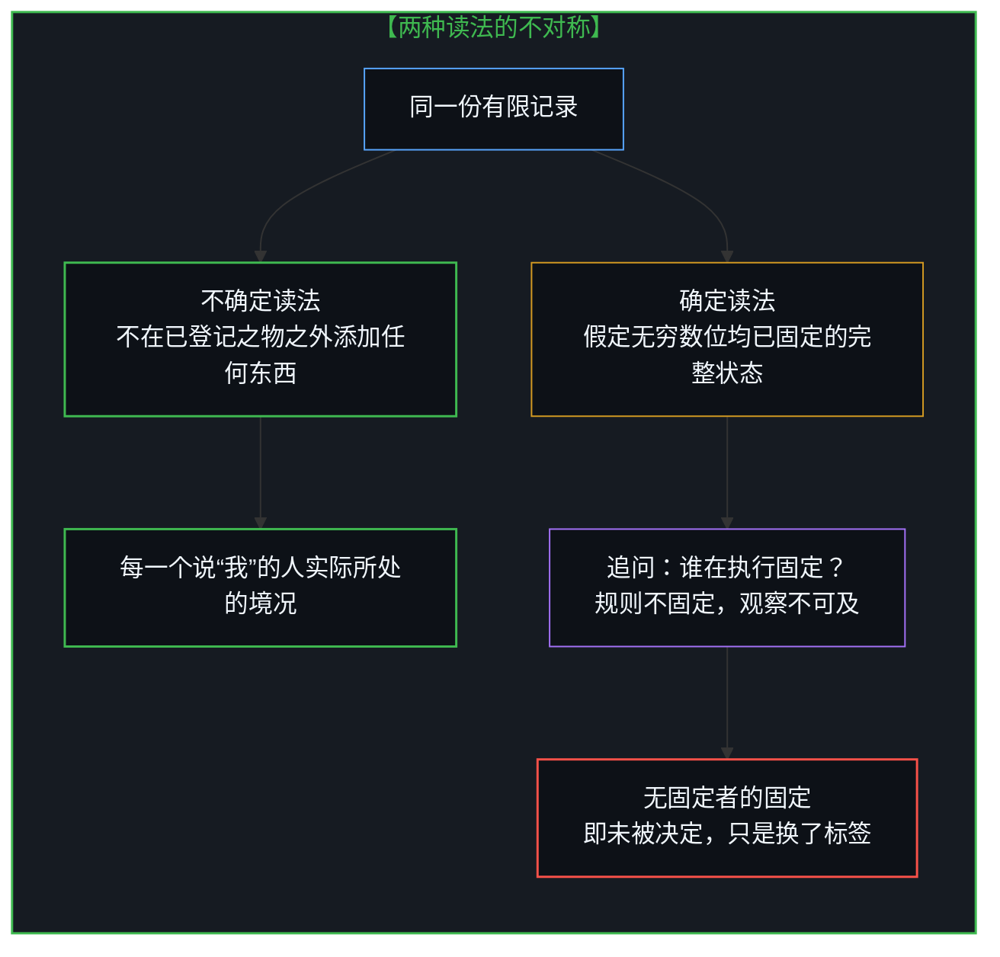
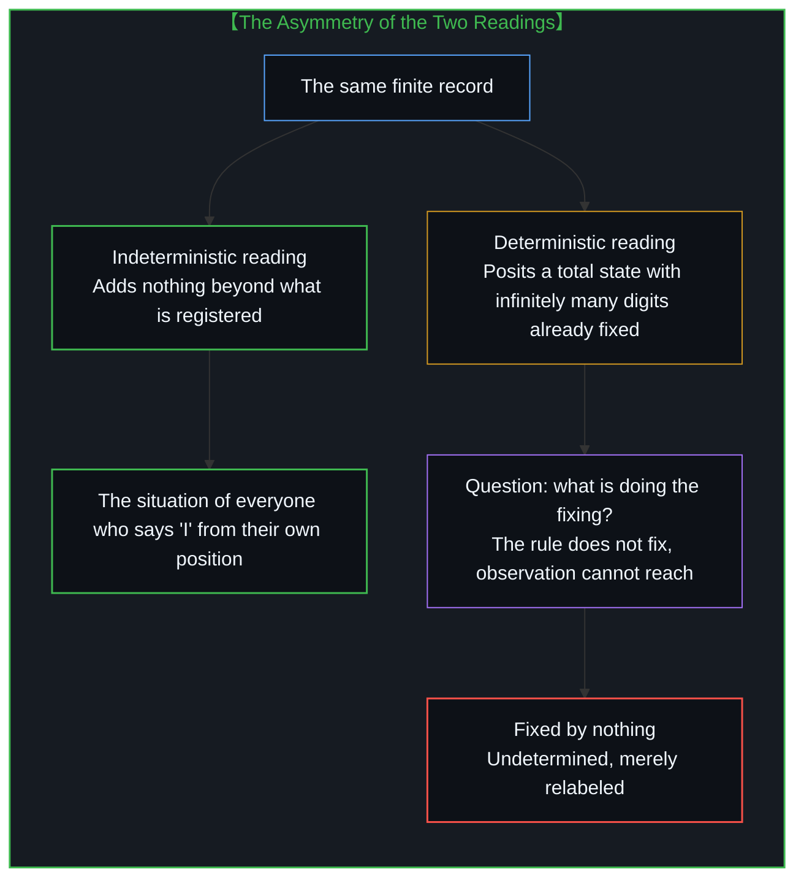
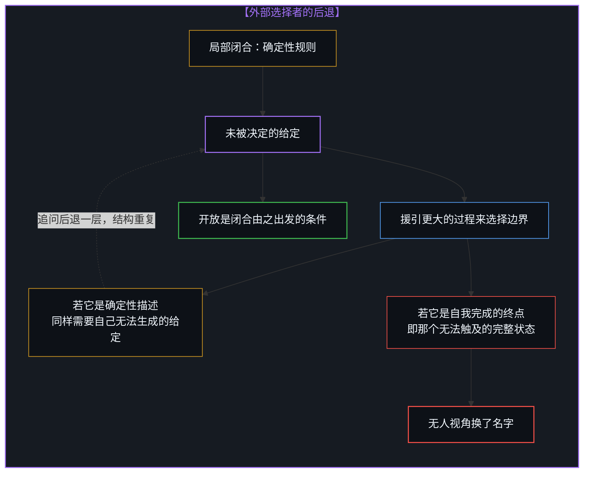
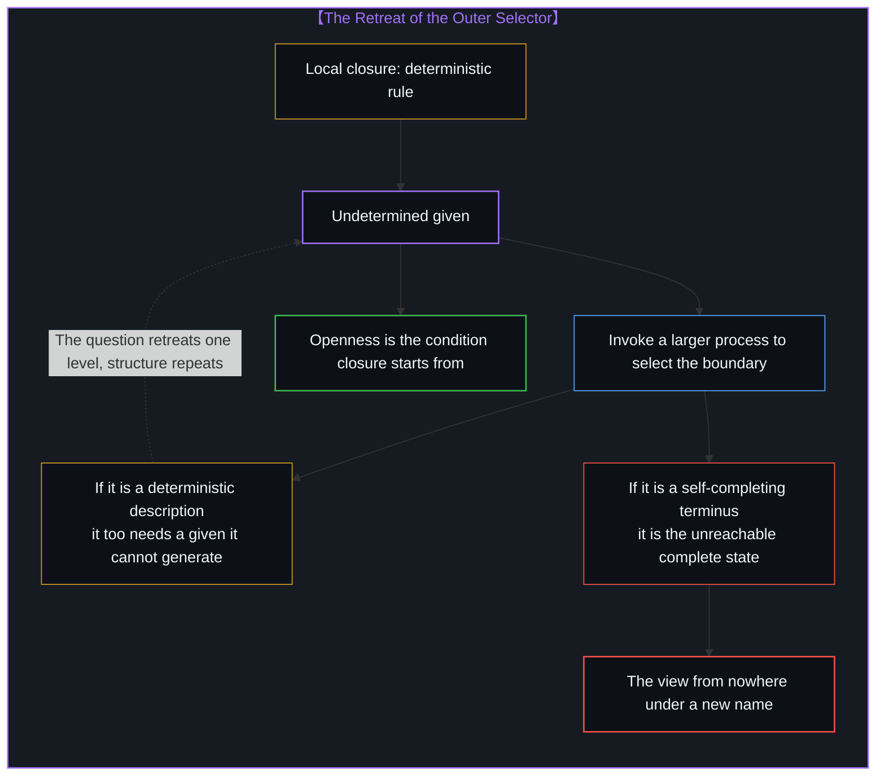
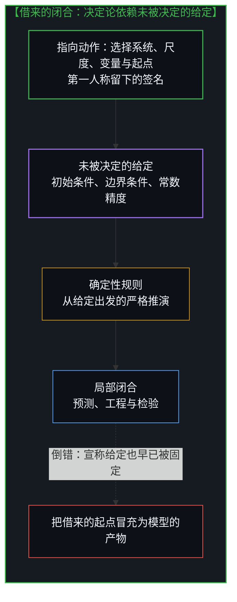
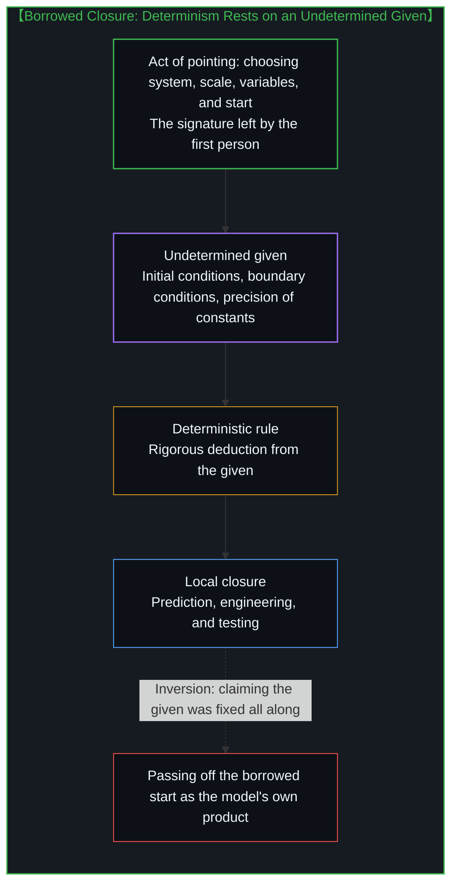

# 没有固定者的固定 / Fixed by Nothing

*决定论从未消除开放，它只是把开放搬进自己无法生成的初始条件，再称之为给定 / Determinism never removes openness; it moves it into a given it cannot generate.*

主流的决定论解释，从拉普拉斯的智者到今天对混沌的标准讲法，都依赖一个很少被审视的前件：“当下状态的完整规定”。当我从自己实际所处的位置出发追问谁能满足这一前件，不可预测性与不确定性之间那条看似清晰的界线便失去了经验地位，因为它所预设的是一个不在世界之中的观察位置，即无人视角。确定性混沌这个最常被援引的反例，恰恰暴露出决定论需要一个无穷且不可压缩的初始条件，规则从不生成它，只是把它逐位朗读出来；而“若被规定，规则本会固定这些数位”这一最后的辩护，找不到任何执行固定的东西。决定论因此是一种借来的闭合，它建立在一个未被决定的给定之上，而不是反过来。

Prevailing deterministic explanations, from Laplace's all-knowing intellect to today's standard account of chaos, rest on an antecedent that is seldom examined: "the complete specification of the present state." When I ask, from the position I actually occupy, who could ever satisfy that antecedent, the apparently clean line between unpredictability and indeterminism loses its empirical standing, because what it presupposes is an observing position outside the world, a view from nowhere. Deterministic chaos, the counterexample most often invoked, turns out to expose that determinism requires an infinite and incompressible initial condition which the rule never generates but merely reads out digit by digit; and the last line of defense, "structure the rule would have fixed had it been specified," can find nothing that does the fixing. Determinism is therefore a borrowed closure, resting on an undetermined given rather than the other way around.

## 一、 有效的条件句与无人能满足的前件 / 1. A Valid Conditional and an Antecedent No One Can Satisfy

当决定论遭遇微观层面的不可预测时，它最常见的自我辩护是一个看似无懈可击的区分：不可预测性与不确定性是两种不同的主张。给定当下状态的完整规定与系统遵循的演化规则，如果只剩下唯一一个可容许的后继，过程就是确定的，任何预测失败都只是信息不全；如果仍然留下不止一个后继，规则本身就没有做出选择，这才叫不确定性。按照这个说法，区分不依赖于命名，而依赖于可容许后继集合的基数，基数为一还是大于一，可以留给测量去回答。拉普拉斯设想的那个知晓宇宙中一切力与一切位置的智者，正是这个区分的人格化身。

When determinism meets unpredictability at the microscopic scale, its most common self-defense is an apparently unassailable distinction: unpredictability and indeterminism are two different claims. Given the complete specification of the present state together with the transition rule the system follows, if exactly one admissible continuation remains, the process is deterministic and every failure of prediction is merely missing information; if more than one continuation remains, the rule itself has not selected, and only that deserves the name indeterminism. On this account, the distinction depends not on naming but on the cardinality of the set of admissible continuations, and whether that cardinality is one or more than one can be left to measurement. The intellect Laplace imagined, knowing every force and every position in the universe, is this distinction personified.

作为条件句，这个推理是有效的，我无意在逻辑形式上与之争辩。问题出在前件本身。“当下状态的完整规定”出现在每一步论证之中，却很少被追问。它预设了一个能够一次性登记全部自由度、精度无限、且自身不被所登记之物卷入的立足点。只要这个前件被当作可以讨论的候选项，整个区分就显得是在描述世界；一旦我从自己实际所处的位置出发，追问谁能站在那个立足点上，区分便从经验命题变成了对一个不存在的观察位置的默认。这正是决定论解释没有正视的盲点。

As a conditional, the reasoning is valid, and I have no quarrel with its logical form. The trouble lies in the antecedent. "The complete specification of the present state" appears in every step of the argument, yet it is seldom questioned. It presupposes a standpoint that registers every degree of freedom at once, with infinite precision, while itself remaining untouched by what it registers. As long as that antecedent is treated as a live candidate, the whole distinction looks like a description of the world; the moment I ask, from the position I actually occupy, who could stand at that standpoint, the distinction turns from an empirical claim into a silent default to an observing position that does not exist. This is the blind spot deterministic explanations have not faced.

## 二、 盲点：完整状态是无人视角 / 2. The Blind Spot: The Complete State Is a View from Nowhere

我能做的每一次测量都是有限的，每一次登记都发生在因果回路之内，以有限的分辨率进行。更进一步，记录状态的我以及我所使用的仪器，本身就是被记录动力学的一部分：一个系统若要在内部持有对自身的完整描述，这份描述就必须包含这份描述本身，结构上无法闭合。David Wolpert 关于推理的物理极限的工作把这一点形式化了：任何嵌在宇宙之中的推理装置，都无法对包含它自身在内的全部状态作出完备推断。所以完整状态不只是尚未被观察到，从内部看，它甚至无法被融贯地设想为一个可观察的对象。拉普拉斯的智者之所以能知晓一切，只因为他被安置在了世界之外。正如 [因果的自反性与物理的无源假定](../causality-is-irreducible-the-physical-is-a-view-from-nowhere/) 所揭示的，所谓不依赖任何视角的物理全貌，正是一个被悄悄预设的无人视角。

Every measurement I can make is finite, and every registration takes place inside the causal loop at finite resolution. Further still, I who record the state, and the instruments I use, are part of the dynamics being recorded: for a system to hold a complete description of itself internally, that description would have to contain the description itself, and the structure cannot close. David Wolpert's work on the physical limits of inference formalizes this point: no inference device embedded in the universe can make complete inferences about the totality of states that includes itself. The complete state is therefore not merely unobserved so far; seen from inside, it cannot even be coherently conceived as an observable object. Laplace's intellect can know everything only because it has been placed outside the world. As [Causality is Irreducible; The Physical is a View from Nowhere](../causality-is-irreducible-the-physical-is-a-view-from-nowhere/) shows, the supposed physical totality independent of every perspective is precisely a view from nowhere smuggled in as a premise.

这里需要说清这篇文章里的“我”。它不是在报告某一个具体个人的处境，也不是一个被抽离出来、可以替所有人发言的普遍观察者。“我”是一个索引词：谁说出它，它就指向谁。它的普遍性来自每一个人都可以从自己的位置上重新说出它，而不是来自站到所有位置之上。愿意这样思考的每一个人，读到这里的“我”，指的都是他自己；而这个第一人称的“我”，无论被多少人说出，都跳不出说出它的那个具体的“我”：有限的测量，所在的位置，被卷入的动力学，以及只能由自己承担的后果。正如 [感知的界限与理解的无限](../the-boundary-of-perception-and-the-infinity-of-understanding/) 中所说，“我”同时是具体的生命与不可化约的第一人称视域，两者无法分开。无人视角恰恰想要视域的普遍，却不要生命的具体：它通过取消位置来获得普遍；第一人称则因为每一个位置都是某人自己的位置，而获得普遍。

A word is needed here about the "I" in this essay. It is not a report on the situation of one particular person, nor a universal observer abstracted away so that it can speak for everyone. "I" is an indexical: whoever says it, it points to them. Its universality comes from the fact that each person can say it again from their own position, not from standing above all positions. For everyone willing to think this way, the "I" here refers to themselves; and this first-person "I", however many people say it, can never step outside the concrete "I" who says it: finite measurements, a location, entanglement in the dynamics, and consequences only one's own self can bear. As [The Boundary of Perception and the Infinity of Understanding](../the-boundary-of-perception-and-the-infinity-of-understanding/) puts it, the "I" is at once a concrete life and the irreducible first-person horizon, and the two cannot be separated. The view from nowhere wants the universality of the horizon without the concreteness of the life: it gains universality by abolishing position, whereas the first person gains universality because every position is someone's own.

决定论的辩护在这里有一条合理的退路：经验上可用的只是两类模型在有限数据上的比较。在一类模型中，转移规则是单值的，残差被视为未解析的细节或测量误差，并应随分辨率与样本量的提高而缩小；在另一类模型中，规则在相关尺度上留下不止一个后继，残差在更细但仍有限的分辨率下持续存在。离子通道统计、光子计数、排除测量误差后仍然存留的群体变异，都可以在特定系统与尺度上偏向其中一类。这是诚实的脚手架，我接受它。但这条退路随即附上一句补充：这种偏向无法转化为“若状态被补全则另一类必然失败”的证明，因此基数问题对任何实际观察都保持欠定。正是这句补充，把刚刚被承认无人能满足的前件，又悄悄请回了桌面。

Deterministic defenses have a reasonable retreat available here: what remains empirically usable is a comparison between two model classes on finite data. In one class the transition rule is single-valued and every residual is treated as unresolved detail or measurement error, expected to shrink as resolution and sample size improve; in the other class the rule leaves more than one continuation at the relevant scale, and residuals persist under finer but still finite resolution. Ion-channel statistics, photon counts, and population variability that survives controls for measurement error can all favor one class over the other for a given system and scale. That is honest scaffolding, and I accept it. But the retreat comes with an addendum: such favor cannot be converted into a proof that the other class would fail if the state were completed, so the cardinality question stays underdetermined by every actual observation. It is exactly this addendum that quietly invites back to the table the antecedent just conceded to be unsatisfiable by anyone.

## 三、 混沌只是在朗读初始条件 / 3. Chaos Only Reads Out the Initial Condition

决定论最常援引的反例是确定性混沌：演化规则把每一个精确状态映射到唯一后继，过程是确定的，但任何小于系统分辨率的误差都会被指数放大，于是结果不可预测。按照这个反例，不可预测性只停留在认识论层面，它反映的是封闭因果链内部无法触及的细节，而不是一个被忽略的开口。

The counterexample determinism invokes most often is deterministic chaos: the evolution rule maps each exact state onto exactly one successor, so the process is deterministic, yet any error smaller than the system's resolution is amplified exponentially and the outcome becomes unpredictable. On this account, unpredictability stays at the epistemic level; it reflects inaccessible detail inside a closed causal chain rather than an opening that was overlooked.

但请看清混沌模型实际要求了什么。以最简单的倍增映射为例：xₙ₊₁ = 2xₙ mod 1。把 x 写成二进制小数，每一次迭代只是删去小数点后的第一位，再把其余数位整体左移。第 n 步状态的首位数字，恰好就是初始值 x₀ 的第 n 位二进制数字。整条“确定性”轨迹不过是在逐位朗读 x₀；规则本身没有产生任何新的信息，它只负责把初始条件中越来越深的数位搬运到宏观可见的尺度上来。

But look at what the chaotic model actually requires. Take the simplest case, the doubling map: xₙ₊₁ = 2xₙ mod 1. Write x as a binary fraction, and each iteration simply deletes the first digit after the point and shifts all remaining digits one place to the left. The leading digit of the state at step n is exactly the n-th binary digit of the initial value x₀. The entire "deterministic" trajectory is nothing but a digit-by-digit reading of x₀; the rule generates no new information at all, and its only work is to carry ever deeper digits of the initial condition up to the macroscopically visible scale.

这些数位从哪里来？规则不产生它们，任何观察者也提取不到它们，它们被直接装载在起点之中，作为“给定”。更尖锐的是，在实数的标准测度下，几乎每一个实数的数位序列都是算法随机的，即不可压缩、不服从任何比它自身更短的规则。所以一条典型的确定性混沌轨迹，在输入端要求的恰恰是一条无穷长且不可压缩的随机序列。决定论没有消除开放，它只是把开放整块搬进了初始条件，然后称之为给定。Nicolas Gisin 从物理一侧提出的论证与此呼应：有限的空间区域只能容纳有限的信息，携带无限精度的实数初始条件本身就不是一个可以在世界中实现的对象。

Where do these digits come from? The rule does not produce them, and no observer can extract them; they are loaded directly into the starting point as a "given." More sharply still, under the standard measure on the real numbers, the digit sequence of almost every real number is algorithmically random, meaning incompressible and obedient to no rule shorter than itself. A typical deterministic chaotic trajectory therefore requires, at its input, precisely an infinitely long and incompressible random sequence. Determinism does not remove openness; it moves the openness wholesale into the initial condition and then calls it given. Nicolas Gisin's argument from the side of physics echoes this: a finite region of space can hold only finite information, so a real-valued initial condition carrying infinite precision is not an object the world can realize.

## 四、 没有固定者的固定 / 4. Fixed by Nothing

一旦看清混沌只是在搬运初始条件，决定论的辩护便不得不承认搬运本身：初始数位不由规则解释，只是被装载进起点；混沌放大并不生成缺失的细节，只是让未被解释的余项变得可见；这说明确定性描述没有为它自己的边界数据负责。然而辩护还剩最后一道防线：这并不能表明余项必然是一个不确定的开口，它也可能是“若被规定，规则本会固定的结构”。两种读法都与同一份有限记录相容，有限观察无法在它们之间作出选择。

Once it is seen that chaos merely carries the initial condition upward, a deterministic defense has to concede the relocation itself: the initial digits are not explained by the rule but loaded into the starting point; chaotic amplification does not generate the missing detail but only makes the unexplained remainder visible; and this shows that the deterministic description has not accounted for its own boundary data. Yet the defense keeps a final line: none of this shows that the remainder must be an indeterministic opening, since it could equally be "structure the rule would have fixed had it been specified." Both readings fit the same finite record, and finite observation cannot select between them.

这道防线在它自己的措辞里瓦解了。规则并不固定这些数位，这已经是前提。那么在“规则本会固定的结构”这一说法里，究竟是什么在执行固定？不是规则，因为规则只负责搬运；也不是任何观察，因为观察无法触及。在系统之内，没有任何东西固定它们。而一个不被系统内任何东西固定的细节，按照定义就是相对于该系统未被决定的。“未解析的确定性细节”这个说法，只是在不确定性上贴了一张写着“固定”的标签。决定论常常指责不确定论用命名制造差异，把认识论的局限偷换成本体论的主张；在这里，命名的戏法恰恰发生在决定论一侧。

This defense collapses inside its own wording. That the rule does not fix these digits is already the premise. Then in the phrase "structure the rule would have fixed," what exactly is doing the fixing? Not the rule, since the rule does nothing but carry; and not any observation, since observation cannot reach them. Within the system, nothing fixes them. And a detail fixed by nothing within the system is, by definition, undetermined relative to that system. "Unresolved deterministic detail" is simply indeterminism with a label reading "fixed" pasted onto it. Determinism often accuses indeterminism of manufacturing a difference by naming, of passing off an epistemic limit as an ontological claim; here, the naming trick happens on determinism's own side.

两种读法因此并不对称。不确定的读法不在已登记之物之外添加任何东西：开口就是开口，它是每一个从自身位置出发说“我”的人实际所处的境况。确定的读法则必须假定一个已完成的对象，一份无穷多位数字都已被固定的完整状态。这个对象无法被任何观察触及，而一个作为自身记录一部分的系统，甚至无法在内部融贯地容纳它。把两者称为“同等欠定”，等于把这个不可观察的补全重新当作活的候选项，这正是无人视角从侧门的回归。欠定论证看似中立，实则早已站在了那个它自己承认不存在的立足点上。

The two readings are therefore not symmetric. The indeterministic reading adds nothing beyond what is registered: an opening is an opening, and it is the situation actually occupied by everyone who says "I" from their own position. The deterministic reading must posit a completed object, a total state in which infinitely many digits have all been fixed. No observation can reach this object, and a system that is part of its own record cannot even coherently contain it. Calling the two "equally underdetermined" treats that unobservable completion as a live candidate once again, which is the view from nowhere returning through a side door. The underdetermination argument looks neutral, yet it is already standing on the very standpoint it concedes does not exist.

## 五、 决定论是借来的闭合 / 5. Determinism Is a Borrowed Closure

至此，那个不对称便显影了。每一个确定性描述都需要一个它自身无法生成的给定：初始条件、边界条件、常数的精确取值。这个给定相对于该描述是未被决定的，因为如果它被规则决定，它就不再是给定，而只是规则更早的一步，追问会继续后退，直到抵达又一个未被决定的起点。不确定性则不需要从决定论那里借任何东西。所以决定论是建立在一个未被决定的给定之上的局部闭合，而不是反过来；不确定性必须是基础，决定论才有可能。

At this point the asymmetry comes into view. Every deterministic description needs a given it cannot generate itself: initial conditions, boundary conditions, the exact values of constants. That given is undetermined relative to the description, because if the rule determined it, it would no longer be a given but only an earlier step of the rule, and the question would keep retreating until it reached yet another undetermined starting point. Indeterminism, by contrast, needs to borrow nothing from determinism. Determinism is therefore a local closure resting on an undetermined given, and never the other way around; indeterminism has to be foundational for determinism to be possible at all.

在系统之内，这一点已经清楚：规则不生成它的边界数据，被装载的余项没有被系统内的任何东西选中，“未被决定”正是相对于该系统的准确表述。决定论还可以再退一步：这并不证明在模型之外没有某个更大的过程选择了边界。这个余地值得认真对待，因为它是追问的最后去处。任何被援引来选择边界的更大过程，要么本身是一个确定性描述，那么它同样需要一个自己无法生成的给定，追问只是后退了一层；要么被设想为终点，一个无需任何给定、自我完成的总过程，而这恰恰是那个无法触及的完整状态，只是换上了宇宙学或神学的名字。后退的每一层都重复同一个结构，后退的终点则是无人视角。这也是 [非万物之理](../not-a-theory-of-everything/) 的立足点：没有一层闭合能够关上全部。开放没有被闭合消除，它是闭合由之出发的条件。

Within the system, this much is already clear: the rule does not generate its boundary data, the loaded remainder is selected by nothing inside the system, and "undetermined relative to the system" is the accurate description. Determinism can retreat one step further: none of this proves that no larger process outside the model selects the boundary. The reservation deserves to be taken seriously, because it is where the question goes last. Any larger process invoked to select the boundary is either itself a deterministic description, in which case it equally needs a given it cannot generate and the question has merely retreated one level, or it is imagined as a terminus, a self-completing total process that needs no given at all, which is precisely the unreachable complete state, now wearing a cosmological or theological name. Every level of the retreat repeats the same structure, and the end of the retreat is the view from nowhere. This is also the footing of [Not a Theory of Everything](../not-a-theory-of-everything/): no layer of closure can close the whole. Openness is not removed by the closure; it is the condition the closure starts from.

这与 [确定性是微观不确定性的统计签名](../determinism-is-the-statistical-signature-of-micro-indeterminism/) 走的是两条互补的路。那里，宏观规律性来自对大量个体不可预测性的统计抹平；这里，即使在单条轨迹的严格确定性模型之中，开放也没有消失，只是被压缩进了起点。前者在横向上把个体除掉，后者在纵向上把来源藏起。两者说明的是同一件事：确定性总是在某处支付了一笔未被解释的代价之后，才得以呈现为闭合。

This runs along a path complementary to [Determinism is the Statistical Signature of Micro-Indeterminism](../determinism-is-the-statistical-signature-of-micro-indeterminism/). There, macroscopic regularity came from statistically smoothing away the unpredictability of many individuals; here, even inside a strictly deterministic model of a single trajectory, openness has not vanished but has been compressed into the starting point. The former divides the individual away horizontally; the latter hides the source vertically. Both show the same thing: determinism can present itself as closure only after an unexplained cost has been paid somewhere.

那个未被解释的给定，究竟是什么？在 [感知的界限与理解的无限](../the-boundary-of-perception-and-the-infinity-of-understanding/) 中我写道，我们并不具备一个可以被独立指涉的本体，唯有指向动作本身真实持存，向内体认为第一人称视域，向外投射为因果继起。每一个确定性模型的初始条件，正是建模者自己的指向动作被放进模型、随后又被遗忘的位置：选择这个系统、这个尺度、这组变量、这个起点。规则可以从这个起点出发严格推演，却无法推演出这个起点本身。未被决定的给定，是第一人称在每一个模型中留下的签名；正如 [残余与自由变量](../the-residue-and-the-free-variable/) 所示，它也是任何闭合描述都无法吸收的残余。同样的给定也藏在对称模拟之中，[时间之箭的伪悖论与对称模拟的边界](../the-mirage-of-times-arrow-and-the-boundaries-of-simulation/)对此有所揭示。

What, then, is that unexplained given? In [The Boundary of Perception and the Infinity of Understanding](../the-boundary-of-perception-and-the-infinity-of-understanding/) I wrote that we possess no standalone ontology that can be pointed at independently; only the act of pointing itself is actual, experienced inwardly as the first-person horizon and projected outwardly as causal succession. The initial condition of every deterministic model is precisely the place where the modeler's own act of pointing was put into the model and then forgotten: choosing this system, this scale, these variables, this starting point. The rule can deduce rigorously from that starting point, yet it can never deduce the starting point itself. The undetermined given is the signature the first person leaves in every model; and as [The Residue and the Free Variable](../the-residue-and-the-free-variable/) shows, it is also the residue that no closed description can absorb. The same given hides in symmetric simulations, as [The Mirage of Time's Arrow and the Boundaries of Symmetric Simulation](../the-mirage-of-times-arrow-and-the-boundaries-of-simulation/) shows.

读到这里，自然会有人问：那这篇文章自己的前提是什么？如果我给出一个前提，它就成了又一个规则无法生成的给定，文章便在自己批评的地方闭合。我并不拒绝前提：在每一段具体的推理中，前提都可以被选定、被说明、被修改，它们是脚手架。我拒绝的只是把任何一个前提当作地基。第一人称与因果不在前提的清单之中，因为它们不是被选出来的，而是“选”这个动作本身：否认它，就必须先站在某个位置上、做出一次选择、承担这次否认的后果。所以“你的初始条件是什么”这个问题，本身也是从某个位置发出的一次指向；它默认存在一个可以俯瞰所有前提、再从中挑选的立足点，那正是无人视角。我能给出的回答只有一个：每一个前提，都是某个人从某个位置上选定的，包括此刻提出这个问题的人。

At this point someone will naturally ask: what, then, is this essay's own premise? If I state one, it becomes yet another given that no rule generates, and the essay closes at exactly the place it criticizes. I do not refuse premises: in every concrete line of reasoning, premises can be chosen, stated, and revised; they are scaffolding. What I refuse is treating any premise as ground. The first person and causality are not on the list of premises, because they are not something chosen but the act of choosing itself: to deny them, one must first stand somewhere, make a choice, and bear the consequences of that denial. So the question "what are your initial conditions?" is itself an act of pointing issued from some position; it presupposes a standpoint from which all premises can be surveyed and then picked among, and that standpoint is precisely the view from nowhere. The only answer I can give is this: every premise is chosen by someone from some position, including the person asking the question right now.

这并不意味着确定性模型是错的或无用的。它们是出色的脚手架：在一个被选定的给定之上，它们以严格的推演把后果铺展开来，让预测、工程与检验成为可能。错误只发生在一个地方：当模型被拿来反过来宣判，说这份给定本身也早已被固定，说开放只是无知。那一刻，模型借来的起点被冒充成了它自己的产物。决定论是一种借来的闭合；正如 [约束基底与自由自否](../the-substrate-of-constraint-and-the-self-denial-of-freedom/) 所揭示的，给定与约束从来不是剥夺行动自由的囚室，而是赋予选择以差异化维度的操作基底。看清这笔借贷，它便从命运回到了工具的位置，而那个无法被任何规则推演出来的起点，依然握在正在指向世界的第一人称手中。

None of this makes deterministic models wrong or useless. They are excellent scaffolding: on top of a chosen given, they unfold consequences through rigorous deduction and make prediction, engineering, and testing possible. The error happens in one place only: when the model is turned around to pronounce that the given itself was fixed all along, and that openness is mere ignorance. At that moment, the start the model borrowed is passed off as its own product. Determinism is a borrowed closure; as articulated in [The Substrate of Constraint and the Self-Denial of Freedom](../the-substrate-of-constraint-and-the-self-denial-of-freedom/), the given and its constraints are not a cell that strips away agency, but the indispensable physical substrate through which choice acquires operational traction. Once the loan is seen for what it is, determinism returns from the place of fate to the place of a tool, and the starting point that no rule can deduce remains in the hands of the first person who is pointing at the world.
