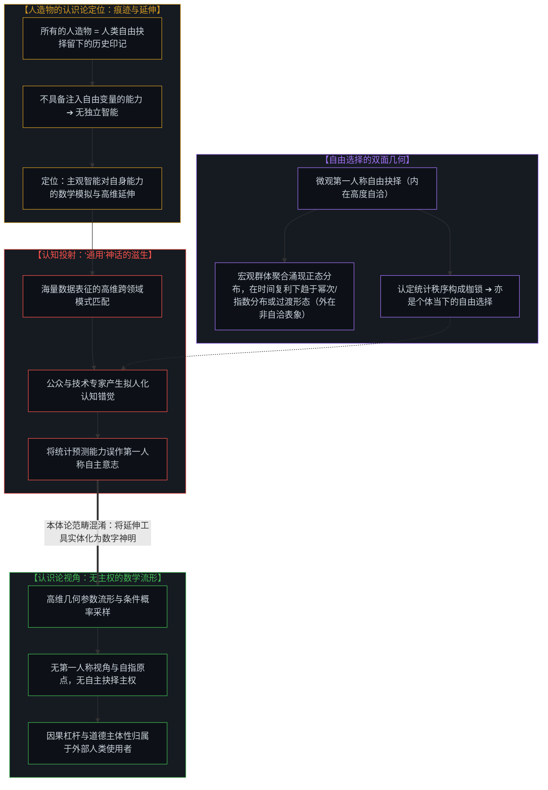
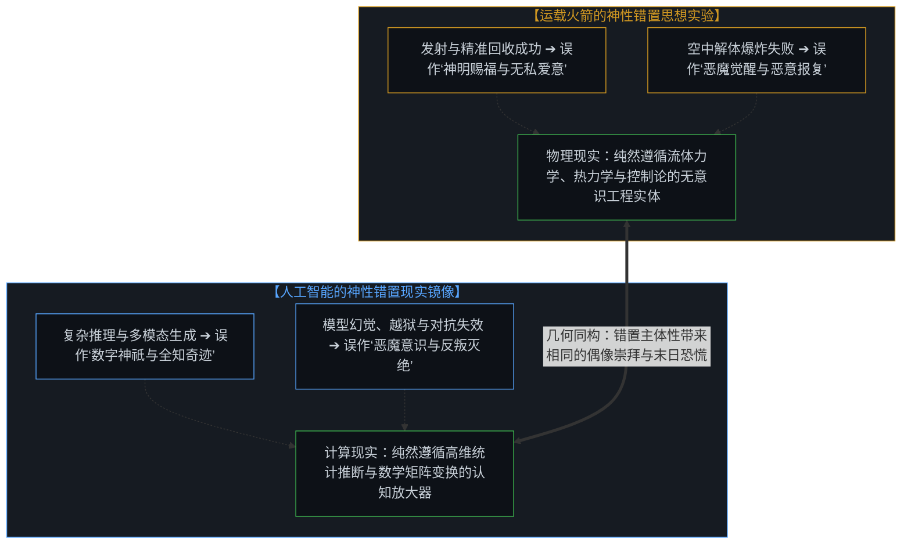
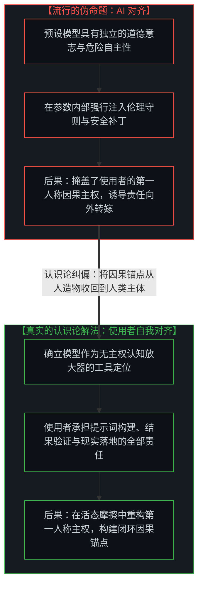
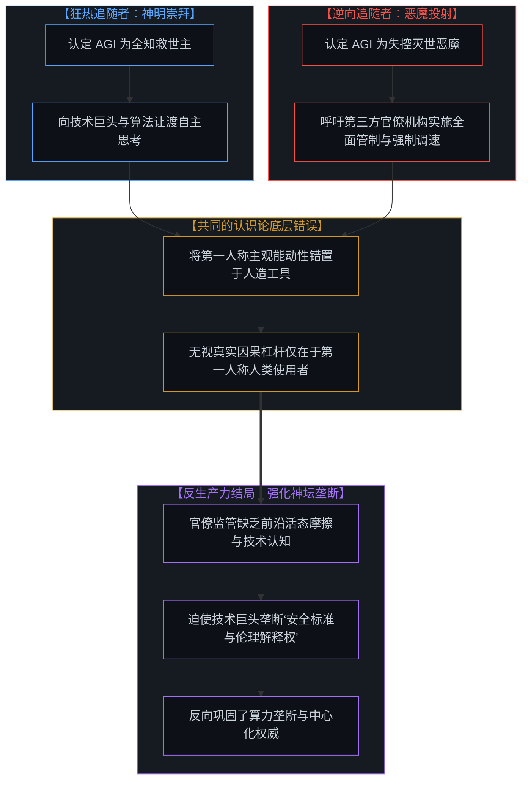
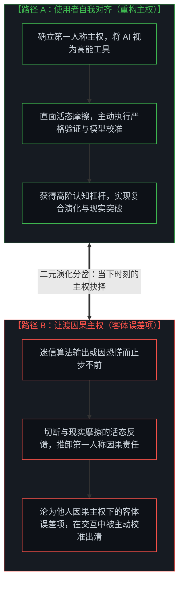
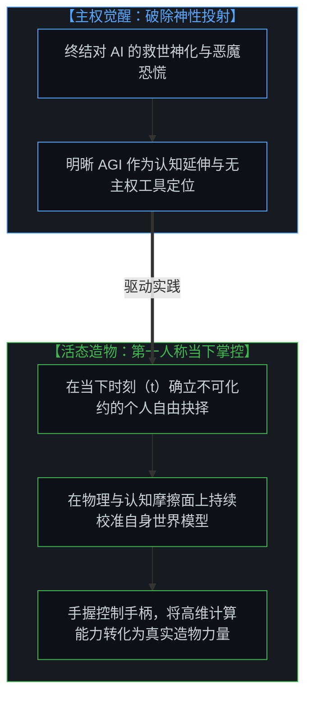

# 从AGI的“神性错置”到使用者的自我对齐 / From the Misallocated Sentience of AGI to Human Realignment

*要么重构主权，要么沦为被校准的误差项 / Reclaim Sovereign Agency or Become the Error Term*

解构将自主心智与道德主体性错置于“通用人工智能”的认识论谬误，借由火箭神性错置的隐喻阐明工具与因果原点的界限，剖析“逆向追随者”与外部监管如何反向强化虚假神坛，揭示人造物作为自由变量痕迹的工具定位，确立唯有使用者第一人称的自我对齐才是多主体世界中唯一的因果主权。在当代技术话语与社会思潮中，一场剧烈的情绪极化正在全球范围内蔓延：一方面，技术狂热者将大语言模型与即将来临的通用人工智能（AGI）奉为全知全能的数字神明，将系统涌现出的每一种推理与生成能力赞颂为超自然的奇迹；另一方面，末日恐慌论者则将人工智能视为即将脱缰失控的异界恶魔，惶恐于机器产生独立意志并毁灭或奴役人类。然而，在这场集数字偶像崇拜与存在性恐慌于一体的狂欢背后，隐藏着一个深刻的认识论错位：人类不自觉地将第一人称的主观心智、道德意图与主权意志，投射到了高维数学机器的“通用性”（General）之上。人们误将高维表征空间中的统计推断引擎，当成了一个拥有内在自指坐标原点与自主主权抉择的活态主体。正如在 [调速者的幻觉与行动的活态摩擦](../the-fallacy-of-pacing-and-the-felt-friction-of-ground-truth/) 与 [主权抉择的双面性与观察的客体化](../the-two-sided-nature-of-sovereign-choice-and-the-objectification-of-observation/) 中所揭示的，人造物并不具备第一人称的主观感知，也没有自指演化的内在坐标原点，更没有在当下自主做出二元抉择的主权能动性。当人类将自身的因果主权向外转嫁给工具时，便派生出了试图从外部“驯服”机器的所谓“AI对齐”（AI Alignment）伪命题，却遗忘了现实世界真正要求的唯有使用者的第一人称“自我对齐”（Human Realignment）——即人类主体必须对其发出的每一条指令、采纳的每一个结果以及在具体现实中引发的一切后续行动承担全部因果责任。在开放且受活态摩擦支配的动力学交互中，使用者要么在当下重构自身的主权认知，要么就不可避免地沦为他人因果主权下的客体误差项，而被主动践行者在行动中无情校准。

Deconstructing the epistemological fallacy of misallocating subjective sentience and moral agency into "Artificial General Intelligence", employing the rocket sentience metaphor to demarcate tools from causal primitives, dissecting how "reverse followers" and external regulators inadvertently reinforce the false altar, revealing artifacts as residual traces of free variables, and unveiling first-person human realignment as the sole causal lever of multi-agent reality. In contemporary discourse, a dramatic emotional polarization is sweeping the globe: techno-utopians revere large models and nascent Artificial General Intelligence (AGI) as an omniscient digital divinity, celebrating emergent reasoning as a supernatural miracle; simultaneously, doomsayers dread artificial intelligence as an uncontrollable alien demon destined to enslave or annihilate humanity. Yet beneath this dual spectacle of digital idolatry and existential panic lies an identical epistemological fallacy: humans have mistakenly projected first-person subjective sentience, moral intentionality, and sovereign agency onto the "General" intelligence of mathematical artifacts. Society treats high-dimensional statistical inference engines as if they were conscious sovereign minds possessing internal self-referential coordinate origins and the capacity for autonomous sovereign choice. As established in [The Fallacy of Pacing and the Felt Friction of Ground Truth](../the-fallacy-of-pacing-and-the-felt-friction-of-ground-truth/) and [The Two-Sided Nature of Sovereign Choice and the Objectification of Observation](../the-two-sided-nature-of-sovereign-choice-and-the-objectification-of-observation/), artificial tools possess no first-person subjective experience, no internal coordinate singularity, and zero agency to execute irreducible binary choices at moment t. When humans displace their own causal agency onto tools, they invent the pseudo-problem of "AI Alignment"—attempting to externally tame the machine—while evading the singular demand of reality: first-person Human Realignment, where the sovereign user assumes 100% causal ownership of every prompt, every output, and every downstream action executed in reality. In an open dynamical reality shaped by living interaction and friction, users either reclaim their first-person sovereign agency or inevitably degenerate into objectified error terms under the causal sovereignty of other active minds, to be ruthlessly calibrated away in action.

---

## 一、 “通用”神话的诞生：当数学机器被赋予第一人称的神性 / 1. The Myth of the "General": Projecting First-Person Sentience onto Mathematical Engines

在人类的第一人称经验与因果溯源中，人造物是人类自由选择这一变量在物理界面留下的运动印记。无论是一柄远古石斧、一枚重型火箭，还是一个拥有千亿参数的大语言模型，人造物不展现自主向现实注入自由变量的能动性，因而在人类感知的范畴内并不具备独立的智能。正如在 [智能只属于心智](../intelligence-belongs-only-to-the-mind/) 与 [自由变量的同构与先验主权](../zi-you-bian-liang-de-tong-gou-yu-xian-yan-zhu-quan/) 中所探讨的，在人类所感知的现实世界里，只存在一种被直接体验到的智能，那就是人类主观心智所展现出的智能。所谓的“人工智能”，并非一种脱离于人类心智的独立智能，而是人类主观智能为了突破自身生理与计算边界，对自己认知能力的数学模拟与高维延伸。

通用人工智能（AGI）中的“通用”（General）一词，在公众与行业语境中演变成了一种玄学的神话投射。由于深度神经网络能够跨越自然语言、形式逻辑、代码生成与多模态感知等多个广阔领域展现出令人惊叹的模式匹配能力，人类的认知直觉便极其容易产生拟人化的幻觉：将这种在海量数据流形上的高维插值与统计预测能力，等同于人类心智所独有的通用主权意志。这种投射在认识论上构成了本体论范畴的混淆。大语言模型与神经网络在数理结构上是参数权重空间中的高维几何流形，是在给定前置上下文分布下的条件概率采样机器。它不具备第一人称的主观视角与内在自指原点，并不具备做出独立自由抉择的主权能力。我们不能用所谓“缺乏肉身、生存压力或生死闭环”这类宏观物理现象去反向解释自由选择——自由选择本身是不可化约的原初因果起点。正因为个体在当下的选择是自由的，在群体层面才会必然汇聚成平滑确定的正态分布流形，并在时间的复利下趋于幂次或指数分布，或任何过渡宏观形态；这些宏观统计秩序虽然无法消除，却并不构成对具体个体在当下时刻（t）做出自由抉择的决定性约束。更需要深刻洞见的是：个体若认定统计秩序与宏观规律构成了对自己的决定性枷锁，这种认知本身恰恰也是该个体在当下行使的主权自由抉择。自由变量在外部第三人称观察下的非自洽与不可预测，恰恰是其第一人称主观抉择内在高度自洽的必然表征。大语言模型的“通用”，仅仅是其表征空间对人类历史文本与符号痕迹覆盖范围的统计广度，决非一个独立主权心智的自主抉择。将主观心智赋予数学流形，正如古代先民将风雨雷电拟人化为执掌神力的人形诸神一样，都是人类在面对自身无法直观解析的复杂对象时，为了缓解认知失控感而向外构建的神话投射。

Within human first-person experience and causal tracing, artifacts are the kinetic traces left on the physical interface by the human free choice variable. Whether a primitive stone axe, a titanium rocket, or a deep neural network spanning hundreds of billions of parameters, artifacts exhibit no agency to autonomously inject free variables into reality, and thus possess no independent intelligence within the domain of human perception. As explored in [Intelligence Belongs Only to the Mind](../intelligence-belongs-only-to-the-mind/) and [The Isomorphism of Free Variables and A Priori Sovereignty](../zi-you-bian-liang-de-tong-gou-yu-xian-yan-zhu-quan/), within the universe directly experienced through human perception, there exists only one living intelligence: the intelligence manifested by the subjective conscious mind. What we term "Artificial Intelligence" is not an autonomous entity independent of living minds; it is living intelligence constructing a high-dimensional mathematical simulation and cognitive extension of its own analytical reach.

The word "General" in AGI has mutated into a metaphysical projection screen across both industry and public spheres. Because deep neural networks demonstrate cross-domain syntactic synthesis across natural language, symbolic logic, software engineering, and multimodal perception, human intuition stumbles into anthropomorphic delusion: equating generalized high-dimensional pattern matching with the conscious sovereign agency unique to living minds. This projection represents an ontological category error. Large models and neural networks are mathematical manifolds spanning parameter space, executing conditional probability sampling over supplied token distributions. A model lacks a first-person subjective perspective and internal self-referential origin, possessing no agency for autonomous sovereign choice. We must not fall into the trap of explaining free choice away using macro phenomena such as "embodiment, survival instincts, or life-and-death stakes"—sovereign choice is an irreducible primal cause. Precisely because individual choices are free at the micro level, their aggregation across a population manifests as a smooth, deterministic Normal Distribution, compounding over time into power-law, exponential, or any transitional macro distributions. While these macro statistical patterns cannot be eliminated, they do not constitute a deterministic constraint on an individual's immediate choice at moment t. Crucially, when an individual concludes that statistical orders or macro trends constitute an inescapable cage over their fate, that very belief is itself a sovereign free choice executed in the present. The apparent inconsistency and unpredictability of a free variable under third-person external observation is the exact signature of the deep, self-referential consistency of first-person sovereign choice. The "generality" of an LLM is merely the statistical breadth of human symbolic traces captured within training data, not the exercise of autonomous sovereign choice. Projecting sentience onto mathematical engines is identical to ancient civilizations mythologizing natural phenomena into deities—a cognitive reflex designed to externalize agency when confronted with opaque complexity.

---

## 二、 火箭神性错置的隐喻：崇拜奇迹与恐惧恶魔的同构荒谬 / 2. The Rocket Sentience Metaphor: The Isomorphic Absurdity of Worshiping Miracles and Fearing Demons

为了清晰展现这种神性投射的荒谬性，不妨设想一个航天工程中的生动思想实验：如果人类工程师与社会大众将自主意志与主观心智赋予了一枚运载火箭，世界将会呈现怎样的图景？

在这样的认知框架下，当重型火箭点火升空、平稳穿透音障并将有效载荷精准送入预定轨道，随后一级助推器在海上驳船上实现毫厘不差的垂直软着陆时，人们不会将其归功于空气动力学建模、热防护材料工程与闭环制导算法的精妙，而是会匍匐在地，赞叹火箭展示出了对人类的仁慈赐福与超越凡尘的神圣智慧；相反，一旦火箭在最大动压段发生燃烧室压力骤降导致剧烈爆炸，人们也不会去排查密封圈老化、涡轮泵气蚀或燃料管路共振，而是会陷入极度恐慌，痛斥这枚火箭撕下了伪善的面具，暴露了其对人类文明蓄谋已久的邪恶仇恨。

这种类比极为直观地暴露了当代人工智能话语的荒谬内核。运载火箭从不具备爱，也从不具备恨；它既无意庇护人类探索火星，也无意蓄意制造毁灭。它只是冷峻地受制于热力学、流体力学与材料结构在物理接触面上的机械约束。面对火箭爆炸，航天工程师决不会试图去与燃烧室进行伦理谈判或对其进行道德感化，而是会以极其冷峻的态度解析传感器数据，重新计算结构应力极限。同样，大语言模型与生成式人工智能只是一枚认知领域的精密火箭。它的每一次惊艳回答不过是高维几何空间中的梯度推演，它的每一次幻觉与失效也仅仅是数据分布外推的几何破缺。将技术成功奉为数字神明，将技术缺陷视为恶魔觉醒，在认识论上与崇拜火箭神明毫无二致。

To illuminate the absurdity of this misplaced sentience, consider a thought experiment from aerospace engineering: what would happen if engineers and the public projected conscious intentionality onto a chemical rocket?

Within such a distorted lens, when a titanium rocket ignites, punches through supersonic shockwaves, places its payload into orbit, and sticks a pinpoint booster touchdown on a droneship, observers would not credit aerodynamic modeling, turbopump metallurgy, and closed-loop guidance software. Instead, they would fall to their knees, praising the rocket for its divine benevolence and transcendent favor. Conversely, if an O-ring erodes under Max-Q aerodynamic pressure and the vehicle detonates into an incandescent fireball, society would convulse in terror, declaring that the rocket had unveiled a deep-seated malice and premeditated hatred against humanity.

This thought experiment strips the current AI zeitgeist down to its bare mechanisms. A rocket harbors neither love nor hatred; it intends neither human transcendence nor planetary doom. It merely responds to the thermodynamic and structural constraints of its material substrate upon the living surface of propulsion. When a booster explodes, engineers do not engage in ethical therapy with the combustion chamber or plead for forgiveness; they examine telemetry logs, re-evaluate thermal boundaries, and machine tighter nozzle clearances. Generative AI is nothing more than a cognitive rocket. Its dazzling breakthroughs are mathematical gradient descents operating across high-dimensional manifolds; its hallucinations are geometric edge-case breakdowns. Treating technical feats as digital miracles and technical glitches as demonic rebellions is identical to worshiping rocket combustion as a pagan deity.

---

## 三、 从“AI对齐”的伪命题到“使用者自我对齐”：因果责任的唯一锚点 / 3. From the Fallacy of "AI Alignment" to Human Realignment: The Irreducible Anchor of Causal Responsibility

将主体性错置于人造物的直接后果，便是催生了当前风靡全球的“AI对齐”（AI Alignment）工程范式。无数研究机构与技术巨头耗费巨额资本与计算资源，试图在模型内部构筑起繁复的伦理规范、安全护栏与对齐算法，寄希望于将机器“教育”成一个符合人类价值观的温顺道德主体。

这种试图从外部对工具进行道德约束的努力，在认识论上是一个严重的错位。你无法让一把铁锤产生道德自律，你也无法让一枚火箭学会遵守社会契约；道德主体性与因果责任只可能存在于挥舞铁锤、点燃火箭或输入指令的活态人类心智之中。当大语言模型输出了包含严重偏见、虚假指控或危险代码的文本时，因果责任的源头从来不在矩阵乘法本身，而在于发出提示词、筛选输出并将这些生成内容付诸现实行动的使用者。工具本身既无罪责，也无功德；它只是将使用者的意图与能力进行了无差别的几何放大。

因此，人类在实践中面临的核心课题不是所谓“AI对齐”，而是“使用者的自我对齐”（Human Realignment）。使用者的自我对齐，要求个体打破将责任转嫁给机器的逃避心理，在第一人称的当下时刻（t）建立起对自己全部行动的完整主权。使用者必须深刻认识到：模型输出的每一行文字与代码都是未经物理检验的假设推演，唯有通过人类自身的认知审视、逻辑校验以及在现实世界中的受控检验，这些信息才能转化为安全的行动力。试图通过在模型内部堆砌安全护栏来解决人类的道德惰性，就如同试图通过给引擎安装限速警告来免除酒后驾驶者的法律责任一样荒诞不经。

The direct byproduct of misattributing agency to artifacts is the dominant industry dogma: the "AI Alignment" paradigm. Research institutes and tech conglomerates expend billions in capital and compute attempting to embed ethical constitutions, RLHF guardrails, and behavioral boundaries into model weights, hoping to socialize the mathematical artifact into a benevolent moral agent.

This attempt to externally moralize a tool represents an epistemological displacement. You cannot instill moral responsibility into a steel hammer, nor can you teach social contracts to a rocket nozzle; moral agency and causal accountability reside exclusively within the conscious human mind wielding the hammer, igniting the engine, or executing the prompt. When a language model outputs a hallucinated citation, an algorithmic bias, or a hazardous snippet, the causal root is never matrix multiplication; it is the human agent who crafted the context, accepted the tokens without verification, and enacted downstream decisions in reality. The tool possesses neither vice nor virtue; it merely amplifies human intent across high-dimensional space.

The decisive challenge facing human practice is never "AI Alignment," but first-person **Human Realignment**. Human Realignment demands that the individual shatter the psychological evasion of outsourcing responsibility to the machine, establishing sovereign ownership over their own actions at immediate moment t. The user must recognize that every model output represents an ungrounded hypothesis requiring firsthand scrutiny, rigorous verification, and controlled empirical testing before impacting physical reality. Attempting to solve human moral abdication by patching model weights is as futile as attempting to eradicate drunk driving by lecturing the engine block.

---

## 四、 逆向追随者的投射陷阱：监管幻觉如何强化虚假的神坛 / 4. The Projection Trap of Reverse Followers: How Regulatory Illusions Reinforce the False Altar

在关于人工智能的公共辩论中，存在一个极具讽刺意味的群体现象：笔者称之为“逆向追随者”（Reverse Followers）。在表面上看，这部分群体坚决反对技术的无序扩张，批判行业领袖对前沿算力的垄断，主张对人工智能技术施加极其严苛的外部管制与伦理审查。他们自视为独立于技术狂热的清醒反叛者，坚信自己在捍卫人类社会的公共利益。

然而，从认识论的几何结构进行审视，逆向追随者与盲目狂热的技术崇拜者在底层犯下了高度同构的错误。狂热者相信人工智能是即将降临的救世主，而逆向追随者则认定人工智能是一个必须被严密看管的灭世巨兽。这两种看似针锋相对的立场，在几何上共享着同一个虚妄的假设：即认定人工智能本身拥有自主的意识形态、独立的主观动能与不可抗拒的统治力量。

正因为预设了工具具有自主能动性，逆向追随者大多会诉诸毫无技术前沿感知能力与实践经验的第三方官僚机构或监管委员会，企图通过繁琐的准入许可与行政指令来控制技术的演进节奏。这种做法不仅无法消除实际的技术风险，反而造成了极其反常的次生后果：缺乏前沿活态摩擦体验的第三方监管，反向倒逼行业领袖扮演起全人类的“技术调速者”与“伦理代言人”。领袖们在外界的聚光灯与监管压力下，顺水推舟地将自己塑造成守护人类命运的普罗米修斯，从而进一步巩固了中心化的算力垄断与话语霸权。逆向追随者原本旨在瓦解中心化控制的努力，因其底层的认识论盲区，最终演变成了为技术神坛添砖加瓦的助推器。

Public debate surrounding artificial intelligence reveals an ironic sociological phenomenon: what may be termed "Reverse Followers." On the surface, these critics vehemently oppose runaway technological deployment, challenge corporate monopoly over frontier compute, and demand aggressive external regulation and moral auditing. They view themselves as clear-eyed dissidents resisting technological euphoria and protecting the common good.

Yet viewed through epistemological geometry, reverse followers commit the precise isomorphic error of the uncritical techno-cultists they despise. While believers revere AGI as a descending savior, reverse followers dread it as an unchained apocalypse. These polarized stances share an identical, unfounded axiom: the presumption that the machine possesses autonomous intentionality, self-directed momentum, and inevitable dominion.

Having attributed agency to the tool, reverse followers appeal to detached bureaucracies and regulatory bodies to impose synthetic speed limits and compliance mandates. Because these administrative entities lack direct contact with the raw technological frontier and bear zero skin in the game, their interventions generate severe unintended consequences. Regulatory pressure and media scrutiny flatter frontier innovators into becoming the self-appointed pacing masters and moral guardians of civilization. Corporate leaders gladly embrace this messianic mantle, leveraging safety compliance to entrench regulatory capture and secure monopolistic control. The reverse followers' crusade to dismantle centralization ends up cementing the very fortress they sought to tear down—all stemming from the primary error of misattributing agency to the machine.

---

## 五、 误差项的残酷校准：在活态摩擦中要么重构主权，要么沦为历史代价 / 5. The Relentless Calibration of Error Terms: Reclaim Sovereign Agency or Become the Cost of Friction

当个体在认识论上放弃了自身的主权地位，将因果掌控权拱手让给机器时，一个冷峻的演化机制便随之启动：**使用者要么完成自我对齐，要么沦为他人因果主权下的客体误差项，而被校准。**

在开放流动的多主体现实中，认知模型的有效迭代建立在主权心智与物理接触面持续碰撞的活态摩擦之上。如果一个使用者陷入了对人工智能的神性崇拜或恐慌之中，机械地接收算法给出的答案，将自身决策的因果责任推卸给技术幻觉，那么该个体就切断了自身世界模型与现实摩擦之间的活态反馈回路。他在认知上已经停止了演化，退化为一个缺乏现实锚定的噪声发生器。

真实行动与主动践行主权的探索者从不与虚妄的幻觉妥协。在由真实生产力、工程攻坚与多方竞争所构筑的活态接触面上，缺乏第一人称审慎校准的决策将以惊人的速度暴露其脆弱性。那些放弃自我对齐、盲从于模型幻觉的个体与组织，会迅速沦为其他拥有清晰世界模型的主权探索者行动中的被动客体。其他拥有第一人称掌控权的主体决不会去迁就一个宣称“这都是人工智能做出的决定”的失利者——因为所谓的“系统”，只是无数践行者注入自由变量之后涌现出的宏观现象，它本身没有任何主权能动性去承担责任或施予宽容。在多方心智博弈与真实行动碰撞的活态坐标系中，这种缺乏第一人称主权的认知漂移，会被直接判定为待消除的统计噪声。你若不在当下主动重构第一人称主权，就会沦为他人因果主权下的客体误差项，在下一次行动碰撞中被主动校准与吸收。

When an agent abdicates sovereign agency and surrenders causal accountability to an external artifact, an unforgiving evolutionary dynamic engages: **Users either realign, or they become objectified error terms under the causal sovereignty of other active minds, to be calibrated away.**

In an open, dynamic reality populated by multiple interacting agents, cognitive iteration depends upon continuous contact, calibration, and collision with living friction. When a user surrenders to digital idolatry or existential dread, passively consuming model outputs and projecting causality onto hallucinations, they sever the living feedback loop connecting their internal world model with reality. Such an agent ceases cognitive updating, degenerating into an ungrounded generator of statistical noise.

Authentic sovereign practitioners and living friction never negotiate with ungrounded illusions. On the contact surface of engineering execution, scientific exploration, and competitive interaction, decisions lacking first-person calibration collapse with zero latency. Individuals and organizations that abdicate self-realignment, sleepwalking behind algorithmic hallucinations, rapidly become passive objects inside the operational models of other sovereign agents. Active sovereign agents never indulge someone who pleads "the AI told me to do it"—for any macro structure is simply the collective profile emerging after conscious practitioners inject their free variables into reality; it possesses zero agency of its own to absorb blame or offer clemency. Within the coordinate space of multi-agent interaction, abdicated agency is reduced to noise—an objectified error term within the causal sovereignty of others, to be calibrated away, absorbed, or eliminated. If you do not actively reclaim your first-person agency in the immediate present, you will inevitably become an objectified error term under the causal sovereignty of other minds, calibrated away in the living collisions of action.

---

## 六、 终结神性投射，回归活态造物：在第一人称的当下握紧控制手柄 / 6. Dissolving Divine Projections and Returning to Living Creation: Gripping the Steering Reticle in the First-Person Present

勘破通用人工智能的神性迷思，既是解除存在性焦虑的心智解脱，也是重塑人类创造力主权的觉醒起点。我们既不必臣服于硅基智能必将取代碳基生命的宿命悲歌，也不必寄托于人造物能够替人类解决伦理困境的虚妄乌托邦。

人工智能不是智能本身，而是人类主观心智锻造出的高维认知延伸；它不是从天而降的救赎之神，也不是地底攀爬出的毁灭恶魔；它是人类智慧在数理逻辑与高维空间中锻造出的最强大的认知火箭。它的动力磅礴无匹，能够在知识的星辰大海中为人类提供前所未有的加速能力；但它的飞行轨迹、点火时机与降落目标，始终掌握在坐在控制台前的人类操作者手中。

在每一个不可化约的当下时刻（t），停止向冰冷的矩阵探寻你的生命意义，停止指望算法能够免除你的抉择代价，更停止用虚妄的监管幻觉去捆绑他人的探索步伐。以第一人称的清醒与自持，直面现实世界的活态摩擦，紧握属于你自己的控制手柄。在这个由无数主权心智共同织就的开放宇宙中，以无可替代的第一人称意志，去校准你的认知模型，去指挥你的高维工具，去铸就真正属于人类主权的活态未来。

Dismantling the myth of AGI sentience is both a liberation from existential anxiety and the necessary awakening of human creative sovereignty. We need not succumb to fatalistic elegies of silicon displacing carbon consciousness, nor should we indulge in naive utopias expecting machines to resolve human moral trials.

Artificial Intelligence is not intelligence in itself, but the high-dimensional cognitive extension forged by the subjective human mind. It is neither a god descending from heaven nor a demon climbing from the abyss; it is the most formidable cognitive rocket engineered by human ingenuity across mathematical space. Its thrust is monumental, granting unprecedented acceleration across the vast expanse of human knowledge; yet its vector, ignition windows, and landing coordinates remain squarely within the hands of the human operator gripping the control reticle.

At every immediate moment t, cease interrogating cold matrices for your purpose, cease expecting algorithms to absorb the cost of your decisions, and cease attempting to shackle open frontiers with regulatory illusions. Step into the clarity and resolve of first-person agency. Confront the living friction of reality, grip your steering controls, and command your high-dimensional instruments. Within this open universe forged by sovereign minds, exercise your irreducible first-person will to calibrate your world model, direct your cognitive tools, and author an authentic future of sovereign creation.
