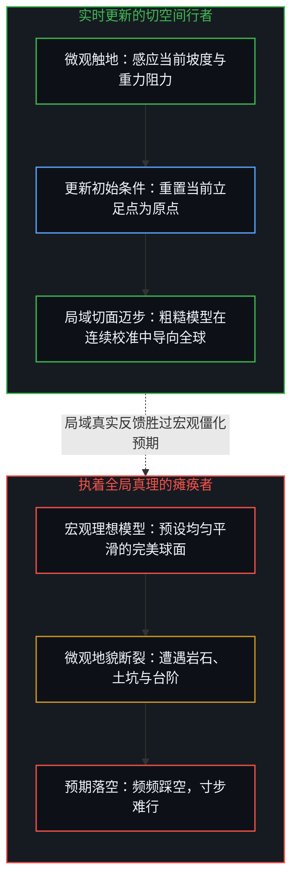
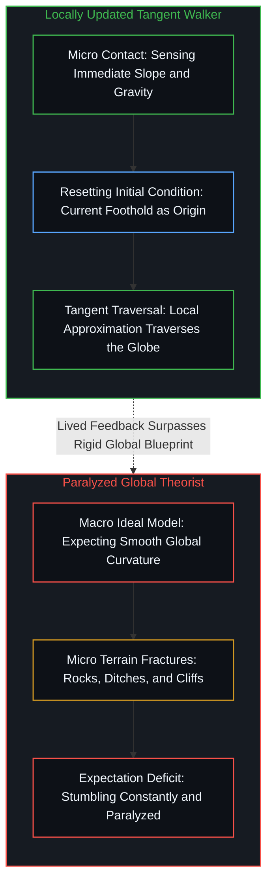

# 路口的转向与地平说的行动悖论 / Turning at the Crossroad and the Flat-Earth Action Paradox

*微观受力中实时刷新的脚步，胜过任何停滞而完美的全局理论。 / Continuous micro-recalibration under lived friction surpasses any frozen, perfect global doctrine.*

在探索现实与行动决策的过程中，人们容易受困于一种认知迷雾：误以为成败取决于掌握多么庞大的全局理论，或是自作聪明地算计捷径。真实的物质世界充满了交织重叠的次要噪音，常常掩盖了底层的因果脉络。优秀的虚构叙事之所以能够揭示深刻的规律，正是因为它在严密的因果闭环中完成了变量隔离。《阿甘正传》便是一个因果实验：一个智力设定极其简单的人物，凭借第一人称因果驱动，在不确定的环境中稳步构筑起坚实的行动闭环。理解阿甘的逻辑、剖析地平说信徒的行动悖论，并破除在路口向他人打听转向经验的迷思，将重新厘清心智在现实中的立足方式。

In the course of navigating reality and making choices, minds routinely succumb to cognitive distortion: presuming that agency depends upon mastering vast global models or calculating clever shortcuts. The material world remains saturated with overlapping ambient noise, obscuring primary causal dynamics. Fictional storytelling clarifies deep principles precisely because it isolates variables within a closed narrative laboratory. *Forrest Gump* functions as an intentional causal experiment: a protagonist with minimal cognitive complexity who, through disciplined first-person actuation, builds a resilient loop amid uncertainty. Examining Gump's logic, unpacking the action paradox of the flat-earther, and abandoning the habit of inquiring which way winners turned at the crossroads reframes how consciousness establishes traction with reality.

## 一、 虚构叙事的变量隔离 / 1. Variable Isolation in Fictional Narrative

现实世界难以被清晰复盘，是因为机遇、人际网络、智力与时代红利等变量深度交织。旁观者习惯于将行动者的跨越归因于智谋过人或精通博弈规则，这种解释常常掩盖了行动的第一性原理。《阿甘正传》通过将主角的智商设定推向极简，剔除了凭借复杂算计与高阶理论获胜的假设。面对意外与挫折，常人心智会本能地启动情绪防御，将大量注意力消耗在怨天尤人或寻找制度漏洞上；阿甘对现实没有任何道德化的抱怨，他直接接受当下的物理事实。

Worldly trajectories resist tidy post-mortems because luck, social networks, talent, and macroeconomic tailwinds entangle into intractable knots. Observers routinely attribute outcomes to strategic brilliance or game-theoretic savvy, obscuring the primary mechanics of action. *Forrest Gump* isolates these factors by reducing the protagonist's intellectual capacity to an irreducible baseline, eliminating the explanation of victory through intricate calculation. When confronted with reversals, the standard mind triggers emotional defenses, dissipating energy on blame or bargaining for exceptions. Gump bypasses moralizing resentment, taking material facts as given starting points.

无论身处前线、暴风雨还是乒乓球台前，阿甘的决策机制始终如一：面对眼前确凿的事实，为了实现清晰的当下意图，下一步动作应当是什么。阿甘从不试图构筑一套解释整个宇宙的全局图景，他将注意力锁定在每一个微观时刻的动态适应上。这种自洽推进的姿态，构成了抵御复杂环境的最强因果底座。在[痕迹与行动](../the-mark-and-the-act/)中，行动先于痕迹显现；而在[攀登从未离开地面](../climbing-does-not-leave-the-ground/)中，任何攀升都依托于具体的立足点。

Whether pinned in combat, navigating hurricanes, or standing before a table tennis match, Gump's operational cadence never wavers: given the landing fact of this moment, what physical actuation serves the immediate intention. He builds no overarching dogma to capture the cosmos; his cognitive capacity remains devoted to localized calibration. This self-consistent momentum forms an immovable causal foundation across turbulent landscapes. In [The Mark and the Act](../the-mark-and-the-act/), actuation precedes visible trace; in [Climbing Does Not Leave the Ground](../climbing-does-not-leave-the-ground/), every ascent depends strictly upon immediate foothold.

## 二、 地平说信徒为什么掉不下地球 / 2. Why the Flat-Earther Never Falls off the Edge

一个常被当作笑谈的思想实验是：在航天器早已俯瞰地球的时代，为什么地平说的拥护者依然能够在陆地上生活、旅行甚至环游世界，却从来不会从大地的边缘掉下去。从认识论的角度来看，这揭示了一个深刻的行动机制。地平说的全局模型显然是错误的，但在日常行走的场景下，这一荒谬理论并不妨碍其正常生活。一个理论只要允许在具体受力中对其前提进行务实修正，就能在适宜的边界内无限拓展其适用范围。

A classic thought experiment asks why flat-earth believers navigate terrestrial journeys, explore continents, and encircle the planet without tumbling into the void. Epistemologically, this illuminates a crucial operational dynamic. While their global model is manifestly mistaken, in the domain of ground traversal the error creates no practical impediment. A model that permits pragmatic updates to its premises through material friction can extend its functional scope indefinitely across its valid domain.

地平说的拥护者之所以没有走动的问题，是因为他每一次出发的初始条件都更新了。在微观迈步的尺度上，大地在几何上等同于局部的切空间；行者每迈出一步，身体重心与地面碰撞产生的触觉、坡度与重力反馈，都在将坐标原点与水平基准重新刷新到当前的立足点上。相反，如果一个理论家将大地设定为一个理想的完美球面，并按照这个平滑曲率的预期去迈步，他就会在现实的乱石、泥坑与台阶面前频频踩空、寸步难行。真实的大地从来不是几何平滑的球体，执着于宏观真理的全局闭合，反而抹杀了应对局部粗糙度的具身感知。

The flat-earth believer faces no impediment in walking because every single departure updates its initial conditions. At the scale of micro-steps, the ground is geometrically equivalent to a local tangent space; with each step, the tactile slope and gravitational resistance of foot meeting terrain refresh the coordinate origin and level plane to the immediate foothold. Conversely, if a theorist models the Earth as an ideally smooth sphere and steps forward according to that uniform curvature, they stumble repeatedly over jagged rocks, mud pits, and curbs, paralyzed by ground realities. The physical earth is never an immaculate sphere; clinging to macro-closure blinds the mind to the embodied friction of the immediate terrain.

地平说模型唯有在参与航空工程、编写惯性导航算法或规划跨洋大圆航线时，才会成为致命的瓶颈。高度压缩的成熟理论就像一架现代飞机，如果目的地已经铺设了成熟航线，搭乘工具显然比徒步高效得多。然而陷阱在于，当心智试图走向未被开辟的未知地带时，周围并不存在现成的航线；如果因为完美的理论飞机尚未降临而拒绝迈步，对理论的执念便异化为了行动的阻碍。在[未经自我审视的批判者](../the-unexamined-critic/)中，任何宏大理论在回折到自身时都呈现出局部的切面属性；在[切平面的行者与完美球面的踩空者](../the-walking-tangent-and-the-stumbling-sphere/)中，这一机制展现为流形切空间的连续拼接与初始条件的动态重置；而在[没有天才能够解决知识问题](../no-genius-can-solve-the-knowledge-problem/)中，全局规划永远无法替代分散在各处的局部勘测。

The flat-earth hypothesis becomes crippling only when one designs aircraft, writes inertial navigation algorithms, or plots great-circle flight paths. A mature conceptual system functions like a passenger aircraft: where established runways exist, taking the flight outpaces walking by orders of magnitude. The hazard arises when venturing into unmapped territory lacking flight paths; refusing to step forward until an immaculate theoretical craft arrives turns intellectual precision into operational paralysis. In [The Unexamined Critic](../the-unexamined-critic/), universal doctrines reveal their localized tangent status under self-reference; in [The Walking Tangent and the Stumbling Sphere](../the-walking-tangent-and-the-stumbling-sphere/), this dynamic manifests as the continuous stitching of tangent manifolds through real-time recalibration of initial conditions; in [No Genius Can Solve the Knowledge Problem](../no-genius-can-solve-the-knowledge-problem/), no centralized cartography substitutes for distributed territorial sensing.

## 三、 路口归因谬误与事后叙事破产 / 3. Crossroad Attribution Fallacy and Narrative Bankruptcy

当后来者向成功的前辈请教经验时，最常问的问题是当年究竟是因为在哪个路口向左转还是向右转才取得成果。这种请教在前提上脱离了时空基准。向左转还是向右转，取决于当时所处的具体十字路口。将先行者在特定坐标下的转向动作生搬硬套到另一个路口，在逻辑上必然导致方向的严重漂移。先行者在事后复盘时，也极易陷入后视镜幻觉，将一条偶然踏出的轨迹粉饰为必然的成功公式。

Inquirers routinely ask established pioneers whether turning left or right at a particular juncture determined their success. Such questions misunderstand spatial coordinates. The wisdom of an angular turn depends entirely upon the specific intersection where one stands. Superimposing an action taken at origin A onto crossroads B inevitably produces disorientation. Pioneers themselves routinely succumb to hindsight bias during retrospectives, varnishing an accidental path into an infallible formula.

真实的推进从来不是一条静态路线，而是在整个行进过程中，面对未知的岔路持续尝试并根据地面反馈做出微观调整的能力。如果观察者不能将外部案例转化为对自己当下坐标的第一人称决策，那么听取再多的经验故事，也只是在收集无法落地的死信息。在[成功的几何学：有限游戏陷阱](../the-geometry-of-success/)中，终点线的幻觉掩盖了行走的演化；在[成功学](../cheng-gong-xue/)中，事后总结的叙事与导致前行的动力存在着因果断裂。

Authentic movement is never a frozen route, but the adaptive capacity to test choices at unknown intersections and adjust posture against ground feedback. Without translating external stories into first-person calculations for one's own coordinates, accumulating case studies amounts to gathering inert data. In [The Geometry of Success](../the-geometry-of-success/), finish-line illusions mask continuous motion; in [Theories After Success](../cheng-gong-xue/), retrospective storytelling fractures cleanly from the real engines of progress.

## 四、 结果的副产物属性与动态自洽 / 4. Outcomes as Byproducts and Dynamic Self-Consistency

理解了这一因果机制，外部评价与世俗定义的成功便不再是行动的轴心。阿甘从奔跑到出海，从未将成为商业典范当作目标，外部收获只是作为副产物自然降临。若将这种行事风格当作获取名利的技巧来模仿，便跌入了因果倒置的陷阱，使视线再次被外部裁判所绑架。

Internalizing this mechanic detaches the mind from external scorecards. Gump never set commercial acclaim as his objective; worldly returns emerged as incidental byproducts. Imitating his demeanor as a technique for social advancement falls into causal inversion, subordinating perception to external arbiters once again.

对于追求自洽生命的主体而言，可靠的锚点在于专注于对自身具有内在逻辑与探索意义的事物，并通过微观尝试与纠偏使自身逐步靠近目标。在行进中若决定探索不同的领域，甚至在半途转向，都是理智而自洽的选择。这是属于第一人称的探险，无需向任何外部观众证明自身的正确。在[所有权与配得感](../ownership-and-self-worthiness/)中，承受真实后果才能沉淀资产；而在[决策与后果不可分割的先验](../the-irreducible-prior-of-decision-and-consequence/)中，选择与承载始终是同一硬币的双面。

For an agent pursuing self-consistency, the steady anchor is attending to what carries coherent significance, moving toward it via micro-adjustments against material resistance. Pivoting mid-course or charting fresh territory remains legitimate; as a first-person journey, it owes no explanations to spectator balconies. In [Ownership and Self-Worthiness](../ownership-and-self-worthiness/), compounding takes root only when consequences re-enter the actor's ledger; in [The Irreducible Prior of Decision and Consequence](../the-irreducible-prior-of-decision-and-consequence/), choosing and carrying remain indivisible sides of a single token.

## 五、 他人作为反射镜面而非终极目标 / 5. Others as Diagnostic Mirrors Rather than Final Judges

如同追随阿甘奔跑的行客一样，大众会自发编织出宏大的哲学、宗教或社会学理由来解释奔跑者的意图。大众头脑中的投射只是其自身心智状态的显影，与奔跑者脚下的具体感觉毫无关联。过度在意外界眼光的心智，容易将他人眼中的形象错认为真实的自我，进而将获得外部赞誉异化为行动的终点。

Like the crowds trailing Gump across highways, onlookers construct elaborate ideologies to explain the runner's motives. These mental projections reflect the spectators' internal landscapes, bearing zero relation to the sensory feedback beneath the runner's soles. Minds over-sensitized to external attention mistake projected images for their authentic state, converting third-party applause into a false terminal goal.

必须厘清他人反馈在因果系统中的位置。外界的反应应当被视作一组探测环境与认知维度的原始数据，充当诊断盲区的反射镜面，协助自己校准下一步的步伐；但不能将他人的赞同或批评视为判定自我价值的法庭。在[收不回的目光与知识的因果倒置](../shou-bu-hui-de-mu-guang-yu-zhi-shi-de-yin-guo-dao-zhi/)中，注意力外泄导致结构涣散；在[高维信息的离散折射与认知分层](../gao-wei-xin-xi-de-li-san-zhe-she/)中，镜面反馈呈现离散梯度；而在[错置的因果与心智编译器](../cuo-zhi-de-yin-guo-yu-xin-zhi-bian-yi-qi/)中，向外部借取尺度只会引发内部编译崩溃。

Feedback from peers must be situated correctly inside the causal chain. External reactions serve as raw data revealing environmental contours, acting as mirrors that disclose blind spots and inform the next step. They cannot be enthroned as supreme tribunals determining intrinsic worth. In [The Inward Eye and the Natural Spread of Structure](../shou-bu-hui-de-mu-guang-yu-zhi-shi-de-yin-guo-dao-zhi/), dispersed attention erodes architecture; in [Discrete Refraction of High-Dimensional Information](../gao-wei-xin-xi-de-li-san-zhe-she/), diagnostic feedback exhibits tiered resolution; in [Misplaced Causality and the Mind's Compiler](../cuo-zhi-de-yin-guo-yu-xin-zhi-bian-yi-qi/), borrowing external yards causes cognitive runtime failure.

## 六、 泥泞中的前行 / 6. Walking Through the Mud

现实世界没有终极裁判，也不存在预设的标准地图。不必执着于在书斋中等待一张毫无瑕疵的全局图景，也不必在每一个岔路口打听虚妄的通关秘籍。理论的宏大闭合无法替代脚底与大地的真实触碰。

Reality provides no celestial referee and offers no omniscient map. One need not remain frozen in an armchair waiting for a frictionless model, nor interrogate passersby at every crossing for secret formulas. Theoretical perfection can never substitute for the tactile meeting of foot and stone.

跨出围栏，踩进泥泞，将心智的算力交还给当下第一人称的微观决策。如同那位在晨曦中握紧铅垂线前行的赶路人，任凭身旁碎裂的镜面折射出喧嚣的投影，行者的脚步只对踩住的泥土与前方显现的地平线负责。在[破除概念的僭越](../po-chu-gai-nian-de-jian-yue/)中，概念的僭妄终将被现实的重力所瓦解；唯有那些在受力中不断刷新初始条件的脚步，能够真实地丈量大地的辽阔。

Step past the railing, walk through the mud, and assign cognitive capacity to the immediate first-person calculation. Like a traveler gripping a plumb line at daybreak while fractured mirrors cast clamorous shadows, the walker answers only to the soil beneath their boots and the horizon opening ahead. In [Breaking Conceptual Overstep](../po-chu-gai-nian-de-jian-yue/), imperial abstractions collapse under the weight of material friction; only footsteps that refresh their initial conditions against resistance truly traverse the vastness of the Earth.
