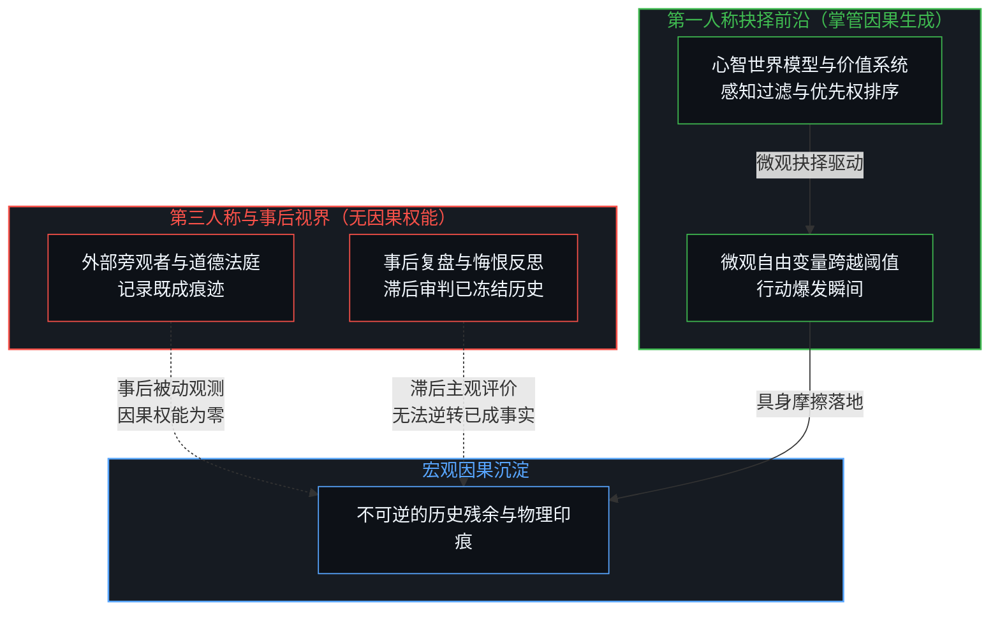
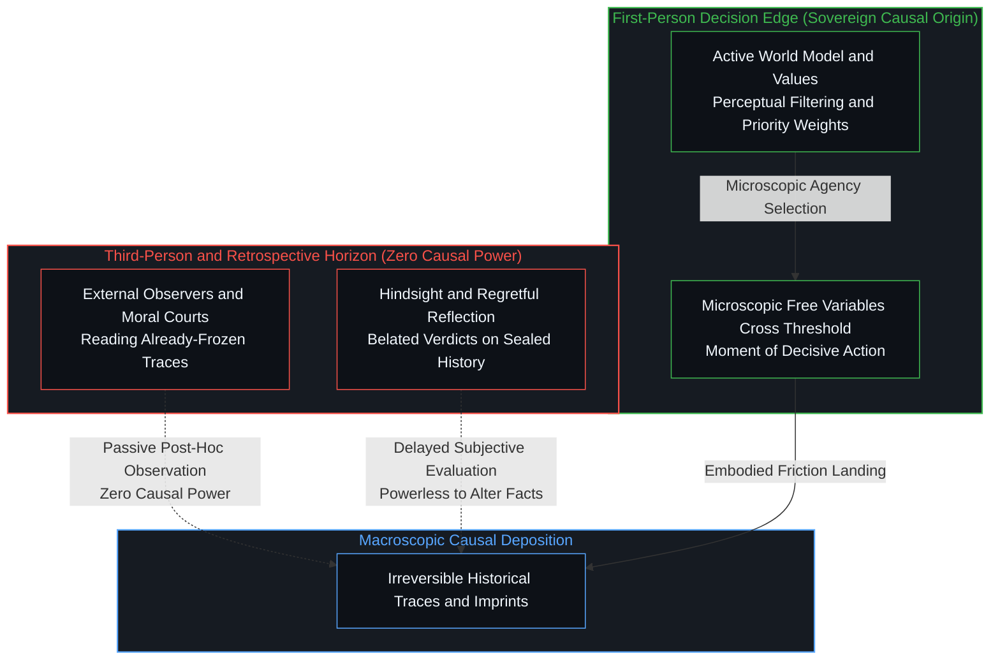
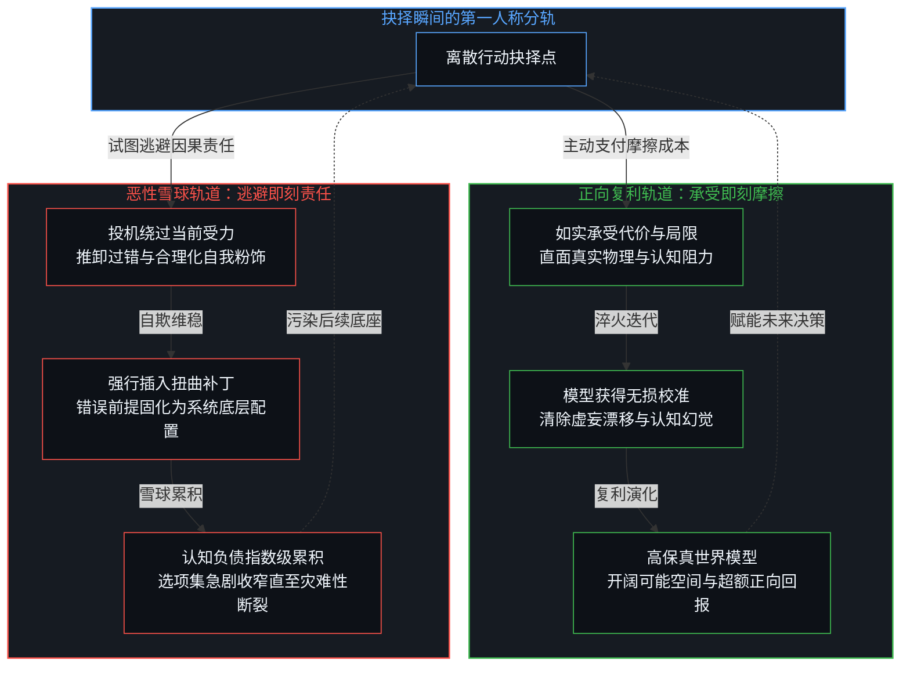
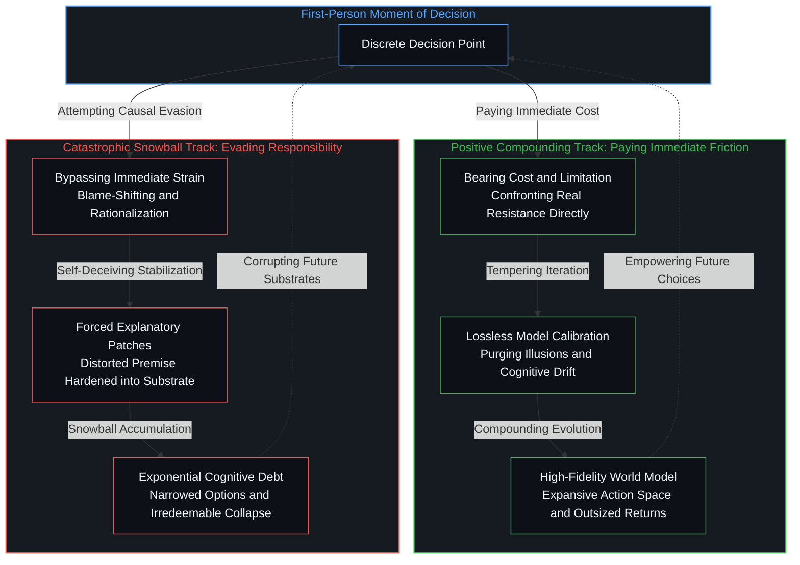

# 没有外部记账员 / No Outside Scorekeeper

*只有在抉择瞬间具备因果权能的第一人称心智，在独自承受世界模型的复利与坍塌 / Only the first-person mind at the moment of choice bears the compounding and collapse of its world model*

无论是古老的神学天秤、因果业报，还是现代世俗的道德法庭与声誉博弈，人类文明长期被一种深固的幻觉所笼罩：似乎在具体行动者的头顶上方，悬挂着一个能够客观测度一切善恶的外部账本。然而，并不存在独立于生命体验之外的记账员在暗中记录功过；任何第三人称的道德宣判或事后审视，面对已经发生的行为轨迹都丧失了干预效力。唯一真正统治行动走向并决定命运分轨的，是做出抉择那一刻第一人称心智内部的认知模型与价值判断。做正确的事与拒绝支付成本都蕴含着超越即刻损益的复利机制，拒绝支付即刻成本所招致的恶性滚雪球，并非来自外部惩罚，而是心智为了维系逃避而不得不承受的内在模型坍塌。

Whether in ancient theological scales, cosmic retributive karma, or modern secular moral courts and reputational game theory, human civilization has long been gripped by a persistent illusion: the belief that above every acting agent hangs an objective cosmic ledger recording virtue and vice. Yet no independent scorekeeper exists outside living experience to tally merits and misdeeds; any third-person moral verdict or retrospective assessment holds zero causal power over frozen trajectories that have already transpired. The only agency governing the direction of action and determining the divergent path of destiny is the first-person world model and value system active within the Mind at the exact moment of choice. Both doing the right thing and refusing to do it contain compounding dynamics far outweighing immediate imbalances; the catastrophic snowball triggered by refusing immediate friction is never divine wrath or external retribution, but the inevitable structural collapse of a world model contorted to sustain evasion.

## 一、 外部记账员的投射幻觉与事后裁决的权能贫乏 / 1. The Projection of the Outside Scorekeeper and the Impotence of Retrospective Verdicts

世俗道德与传统伦理习惯将善与恶描摹为一种公共属性，仿佛每一次抉择都在向一个全景式的宇宙监视器汇报。人们之所以敬畏道德或算计违规，常常建立在存在某个外部裁决者的假设之上：只要遮蔽旁观者的视线，篡改公开的证物，或者让外部惩罚的降临滞后于自身享乐，行为的代价就被成功免除。这种认知错觉不仅存在于投机者心中，同样弥漫在严苛的道德卫士之间。正如我们在[未被遭遇之物的账本](../the-ledger-of-the-unencountered/)中所揭示的那样，当心智试图用一张抽象的坐标网去统摄具身相遇时，它实际上是用外部的投影遮蔽了真实的受力。在第三人称的宏观视界中，无论是社会的赞美还是法律的制裁，都只能触及已经凝固的历史残余；哪怕行动者在多年后站在回忆的高地上进行痛切反思，这种事后诸葛亮式的审判对于那个早已闭合的时空切片而言，同样毫无因果干预权能。

Conventional morality and traditional ethics depict good and evil as public properties, as though every choice reported back to an all-seeing cosmic panopticon. People revere moral codes or calculate transgressions under the assumption that an outside arbiter stands vigil: if only onlookers can be blinded, public evidence altered, or external punishment delayed until after immediate gratification, the cost of action is presumed successfully evaded. This cognitive distortion infects opportunists and rigid moralists alike. As revealed in [The Ledger of the Unencountered](../the-ledger-of-the-unencountered/), when the Mind attempts to capture embodied encounters with an abstract coordinate grid, it conceals lived friction behind external projections. In the macroscopic third-person domain, societal praise or legal sanctions can only touch fossilized historical residue; even when an agent looks back years later in agonizing hindsight, such retrospective verdicts possess zero causal power to alter a time-slice already sealed.

抉择与观测之间存在着不可逾越的时间与因果不对称。正如我们在[主权抉择的双面性与观察的客体化](../the-two-sided-nature-of-sovereign-choice-and-the-objectification-of-observation/)以及[看不见的观察者与无损传输的妄念](../the-invisible-observer-and-the-delusion-of-lossless-transmission/)中所探讨的，观察者与被观察物构成不可分割的硬币双面，而第一人称的选择权能永远驻留在尚未坍缩的生成前沿。当行动尚未发生时，心智的全部世界模型、感知过滤网与优先权排序正在高速运转，驱动微观自由变量跨越阈值；一旦行动落地并留下宏观痕迹，因果便已铸定，任何外部观测者都只能充当痕迹的读者。把因果效力归咎于外部评价或事后复盘，是将结果的影子误认为了投射光束的源头。唯一在行动爆发点上拥有终极权柄的，只有当下那具正在经历阻力、评估取舍、做出决断的心智架构。

An unbridgeable temporal and causal asymmetry separates choice from observation. As explored in [The Two-Sided Nature of Sovereign Choice and the Objectification of Observation](../the-two-sided-nature-of-sovereign-choice-and-the-objectification-of-observation/) and [The Invisible Observer and the Delusion of Lossless Transmission](../the-invisible-observer-and-the-delusion-of-lossless-transmission/), the observer and the observed form the indivisible sides of a single coin, with sovereign first-person agency dwelling exclusively at the uncollapsed generative edge. Before action manifests, the Mind's active world model, perceptual filters, and priority rankings operate at full throttle, driving microscopic free variables across the threshold of actualization; once action settles into macroscopic traces, causality is irreversible, and external observers become mere readers of fossilized text. Attributing causal force to external evaluations or retrospective reviews mistakes the shadow of an outcome for the luminous source. The sole sovereign authority governing the eruption of action is the active cognitive architecture experiencing resistance, weighing tradeoffs, and executing selection at that precise instant.

## 二、 支付即刻成本与世界模型的真实验证 / 2. Paying the Immediate Cost and the Authentic Calibration of the World Model

一旦剔除道德主义的高调修辞，“做正确的事”便暴露出它严谨的动力学机制：它从来不是为了赢取虚无飘渺的来世福报，而是在行动的受力点上主动选择承受即刻的摩擦。无论是在工程实现中如实报告隐患，在商业协作中恪守契约底线，还是在人际交往中拒绝用谎言讨好对方，做正确的事几乎总是意味着当场割舍唾手可得的便利，承受现实的严厉检验与自尊的刺痛。这种摩擦之所以具有高昂的即刻成本，是因为它直接打破了心智对于省力通道的惰性依赖。正如我们在[善恶硬币与通往地狱的善意之路](../the-coin-of-good-and-evil-and-the-road-to-hell/)中所强调的，真实的善始于在第一人称的边界上直面真实受力，而不是沉湎于没有摩擦代价的崇高愿景。

Stripped of moralistic sentimentality, "doing the right thing" reveals its rigorous dynamic mechanism: it never aims to purchase intangible metaphysical rewards, but actively embraces immediate friction at the point of action. Whether reporting latent flaws in an engineering pipeline, honoring contractual boundaries in commercial collaboration, or refusing flattering lies in personal relationships, doing the right thing demands surrendering immediate convenience, confronting reality's unforgiving test, and absorbing the sting of exposure. This friction carries an immediate energetic cost because it directly shatters the Mind's habitual craving for frictionless shortcuts. As emphasized in [The Coin of Good and Evil and the Road to Hell](../the-coin-of-good-and-evil-and-the-road-to-hell/), authentic virtue begins by facing lived friction at the first-person boundary, rather than indulging in elevated ideals that demand zero immediate sacrifice.

承受这种即刻成本的深远意义在于，它迫使心智的世界模型完成了一次无损的校准。每一次心智如实承认局限、支付代价并根据反馈调整行为时，内部对世界的模拟都经历了一场淬火。虚妄的预期被现实的摩擦烧蚀，漂移的参数被锚定在宏观不变性之上。这构成了生命系统最核心的复利增长曲线：一个未被欺瞒所扭曲的世界模型，能够在后续面对更复杂、更严峻的不确定性时，清晰识别真实的因果脉络，看清别人视而不见的行动机会，避开看似诱人实则致命的陷阱。这种源自内在清晰度的从容，在宏观尺度上展现为超额的积极回报。人们常常将其赞誉为好运、智慧或道德赏赐，却不知道这仅仅是世界模型长期保持高保真度后自然释放的拓扑红利。

The profound consequence of bearing this immediate cost is that it compels the Mind's world model to undergo an authentic reality calibration. Each time the Mind acknowledges limits, pays the friction, and updates its priors based on empirical resistance, its internal simulation is tempered. Illusory expectations burn away against the friction of reality, and drifting parameters anchor back into macroscopic invariants. This generates the primary compounding curve of living systems: an uncorrupted world model navigating subsequent uncertainty can perceive authentic causal linkages, spot genuine possibility spaces invisible to others, and steer clear of seductive precipices. This steady grace, flowing from internal clarity, registers macroscopically as outsized positive returns. Observers often mislabel this as luck, wisdom, or moral favor, oblivious that it is simply the topological dividend of a world model maintaining long-term fidelity with the world.

## 三、 逃避责任的隐性负债与模型扭曲的滚雪球机制 / 3. The Latent Debt of Evasion and the Snowballing Distortion of the Model

与主动支付摩擦成本相对立的，是试图逃避责任的认知投机。当一个人通过推卸过失、隐瞒真相、转嫁风险或者自我粉饰来摆脱即刻的难堪时，他在物理上看似毫发无损地跨过了眼前的危机。正如我们在[任务的移交与后果的不可让渡](../the-delegation-of-the-task-and-the-inalienability-of-consequences/)中所分析的，虽然执行动作可以移交，任务可以外包，但抉择产生的后果与模型残余却具有不可让渡的守恒性。外部世界即便没有当场亮起警报，但心智系统内部的危机却已然启航。因为要让一个逃避行为在逻辑上显得合理，心智必须在其解释框架中强行塞入一个补丁；为了保护脆弱的自我形象，它必须修改对因果关系的评估，把自己的怯懦解释为外界的逼迫，把侥幸的脱险粉饰为理性的权衡。

In sharp contrast to paying immediate friction stands cognitive speculation: the illusion of consequence evasion. When an agent eludes immediate embarrassment through blame-shifting, obfuscation, risk offloading, or rationalization, they appear to pass through the crisis physically unscathed. Yet, as analyzed in [The Delegation of the Task and the Inalienability of Consequences](../the-delegation-of-the-task-and-the-inalienability-of-consequences/), while tasks can be delegated and actions outsourced, the systemic consequences and cognitive residues of choice remain strictly inalienable. The external environment may trigger no immediate alarms, but within the cognitive system, disaster has already set sail. To render evasion logically palatable, the Mind must force an ad-hoc patch into its explanatory architecture; to shield a fragile self-image, it warps its causal evaluations, reframing cowardice as external coercion and flattering reckless gambles as strategic calculation.

逃避的真正危险在于它固化了模型的畸变。那个为了掩盖错误而生造出来的扭曲框架，并不会随着事件平息而自动注销，而是被当作既成事实沉淀为下一次决策的基础设施。这正是古老戏剧中浮士德式悲剧与现代叙事中自我毁灭螺旋的深层机理：当陷入下行螺旋的行动者绝望地意识到一旦出卖了灵魂便再也无法将其买回时，他所触碰的正是拒绝承担自身遭遇全部代价后的认知锁死。灵魂从来不是某种可以离体交易的神秘质料，它正是心智保持完整、不向自欺妥协的世界模型本身。一旦心智在关键抉择中拒绝支付即刻成本，以扭曲模型为代价换取眼前的苟安，往后的一切试图“赎回”都将陷入无解的悖论——因为用来进行反思、权衡与清算的认知度量工具本身，已经在最初的妥协中被腐蚀。每一次拒绝支付成本，都让认知债务产生指数级的复利积累。微小的妥协需要庞大的谎言网络来维系，局部的逃避催生全局的瘫痪。这种内在畸变的滚雪球效应最终将耗尽系统的全部冗余度，当扭曲的模型与坚硬的宏观世界发生不可避免的正面撞击时，等待它的只能是全盘碎裂的灾难性清算。

The genuine peril of evasion is that it stabilizes distortion within the generative engine. The contorted frame fabricated to conceal an error does not dissolve when the incident fades; it cements into the infrastructure underlying the next choice. This is the deep dynamic animating Faustian tragedies and modern dramatic spirals of self-ruin: when an agent trapped in a downward spiral despairs that once a soul is sold it can never be bought back, they are naming the irreversible cognitive lock-in that follows refusing to bear the full cost of what happens to oneself. The soul is no metaphysical token traded in the dark; it is the integrity of the generative world model itself. Once an agent avoids immediate friction by distorting that internal architecture for temporary respite, subsequent attempts to buy it back encounter an insoluble paradox: the very cognitive apparatus tasked with conducting reckoning and redemption was compromised in the original evasion. Each refusal to pay costs compounds cognitive debt exponentially. A minor fabrication requires an entire web of rationalizations to protect it; localized cowardice seeds systemic paralysis. This internal snowball effect devours all cognitive headroom, until the divergence between the warped model and the macroscopic world collides in catastrophic, irredeemable rupture.

## 四、 责任即因果守恒：第一人称的闭环主权 / 4. Responsibility as Causal Conservation: The Closed-Loop Sovereignty of the First Person

重新审视人类的道德困境，我们必须将责任从沉重的道德规训中真正解救出来。责任不是外界长辈、社会契约或神圣法典强加给个体的枷锁，而是生命心智参与因果链条时的守恒定律。心智无法欺骗自己的生成引擎，因为每一个输出的选择都必然在内部留下相等的反作用力印痕。承认全权承担后果，不是一种崇高的自我牺牲，而是对因果律实在性的清醒敬畏。没有任何法官在云端为你记录分数，你的每一个世界模型状态，就是你全部历史抉择的活体化身。你所经历的生活图景，正是这个模型在连续现实摩擦中不断投影出的生成场域。

Re-examining humanity's ethical struggle requires liberating responsibility from the suffocating grip of moral indoctrination. Responsibility is not a punitive tether imposed by societal elders, institutional contracts, or divine decrees; it is the conservation law governing living minds participating in causality. The Mind cannot deceive its own generative engine, for every enacted choice inevitably carves an equal reactionary imprint into its internal architecture. Assuming full responsibility for consequences is not noble self-abnegation, but sober reverence for the invariance of causality. No celestial judge tallies points above; your active world model is the living embodiment of every historical choice you have executed. The lived reality you inhabit is the dynamic generative field projected by that model through friction with the world.

当心智领悟到因果从未离开第一人称的抉择瞬间，所有向外寻求赦免或向外推卸过错的努力便失去了立足之地。做正确的事所换来的开阔天地，与逃避摩擦所招致的逼仄牢笼，都不是他人赠予或降下的裁决，而是心智自身演化动力学的终局显影。在每一个微小的日常路口，主权心智所能依凭的唯有当下的清醒：不寄望于虚妄的记账员，不贪图省力的逃避通道，在受力点上爽快结清当下的摩擦成本。唯有如此，心智的世界模型才能在风暴的洗礼中保持敏锐与坚韧，在连续展开的时间河流中，稳稳托举起不可让渡的自由意志。

When the Mind realizes that causality never departs the first-person moment of decision, all efforts to seek external absolution or outsource fault dissolve into incoherence. The expansive horizons cultivated by doing the right thing, and the suffocating cages erected by evading friction, are neither gifts bestowed nor sentences handed down by external authorities; they are the terminal manifestations of the Mind's internal evolutionary dynamics. At every mundane crossroad, sovereign awareness is the only anchor: placing no faith in mythical scorekeepers, rejecting frictionless evasions, and readily settling immediate costs at the point of impact. Only through this discipline does the world model preserve acuity and resilience amidst turbulence, steadfastly upholding inalienable sovereign agency across the unfolding river of time.
