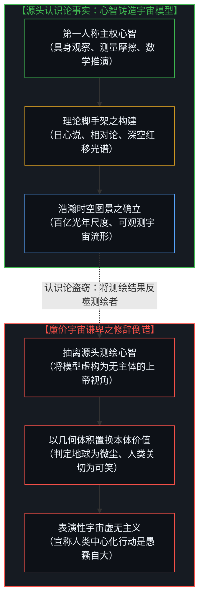
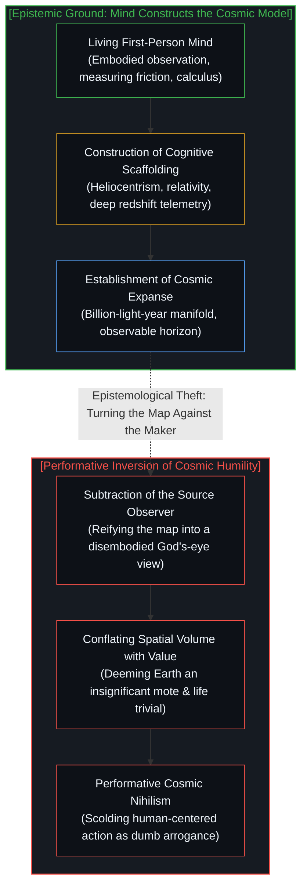
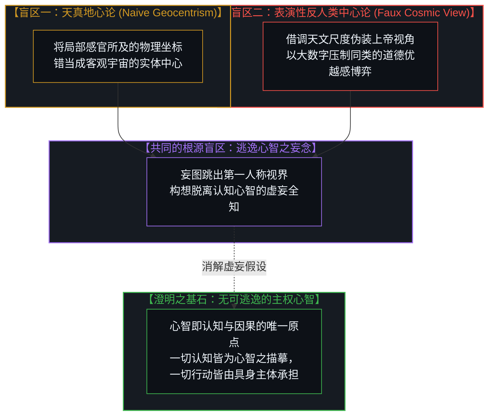
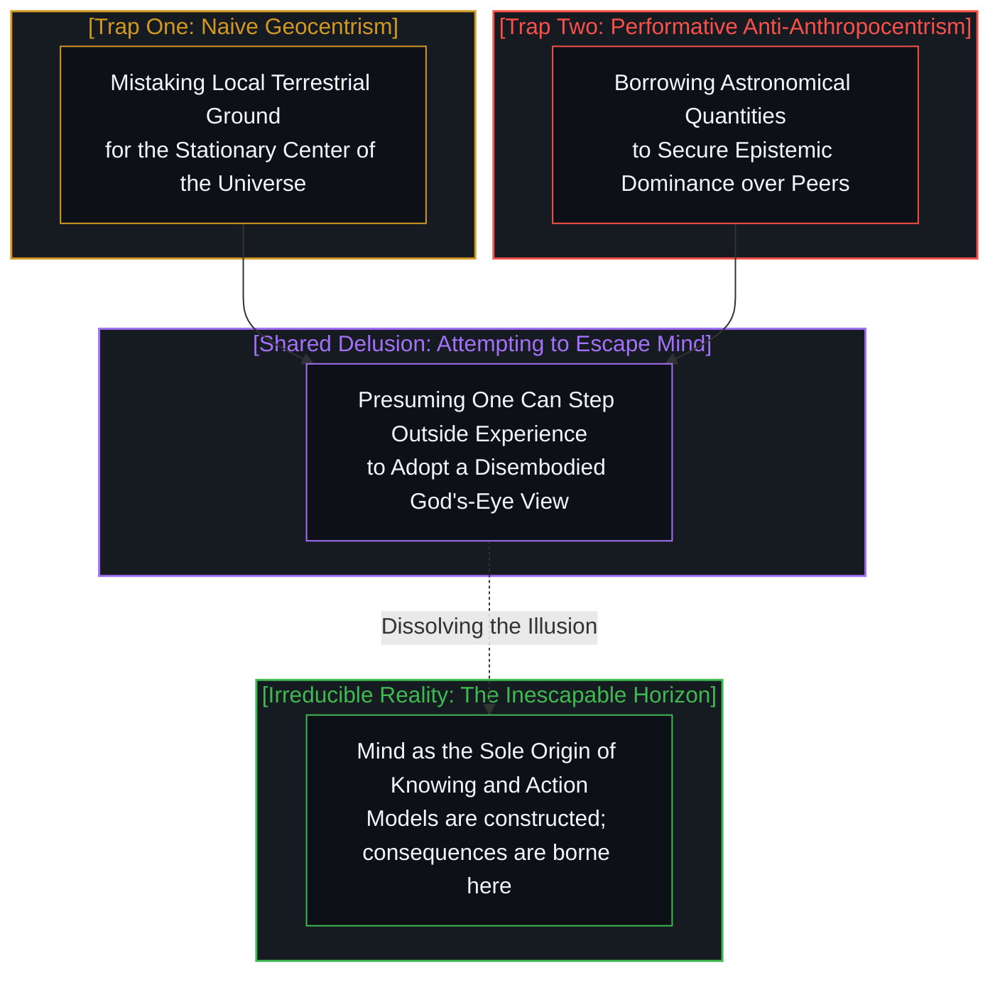
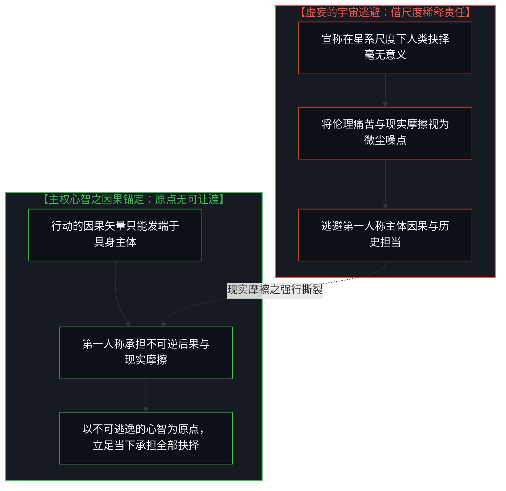
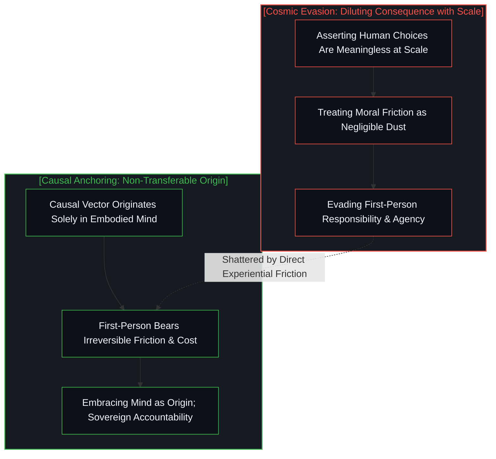

# 无法逃逸的心智视界与廉价宇宙谦卑的表演性悖论 / One Cannot Escape One's Own Mind: The Performative Paradox of Cosmic Humility

*无论是盲目的人类中心主义，抑或借调宇宙尺度贬低心智的虚无主义姿态，皆遗忘了认知与行动无可替代的坐标原点——宇宙的浩瀚本是心智拉出的认知模型，企图跳出自身去审判人类，不过是一场借宇宙之名俯视同类的倒错狂妄。 / Whether in naive anthropocentrism or the nihilistic posture that invokes cosmic vastness to demean human cognition, both forget the irreplaceable origin of knowing and action: cosmic scale is itself a model constructed by the mind, and attempting to jump outside oneself to sit in judgment of humanity is merely an inverted arrogance that uses the cosmos to posture over one's peers.*

当代世俗文化中流行着一种廉价的宇宙谦卑：人们常常引述日心说与亿万光年的天文图景，居高临下地讥讽人类日常行动的自私与狭隘，宣称在浩瀚星海面前，人类的一切悲欢与抉择皆不过是无足轻重的尘埃。这种宏大叙事在表面上标榜超脱与敬畏，实则陷入了自我击溃的表演性悖论——浩瀚的宇宙图景本身正是人类心智历经漫长观察摩擦才建立起的认知脚手架，抹去源头观察者转而用测量结果来贬低测绘者，不仅混淆了物理体积与本体地位的范畴差异，更将严肃的认识论问题矮化为同类之间争夺道德优越感的修辞博弈。唯有重新确认第一人称心智无可逃逸的坐标原点，看清认知与行动必然始于具身主体的不可逆结构，人类才能走出自我鄙薄的虚妄深渊，在真实的因果链条中承担起属于主权心智的沉重抉择。

## 苍白蓝点的修辞陷阱与源头认知的偷换 / The Rhetorical Trap of the Pale Blue Dot and the Subtraction of the Knower

在科普读物与大众哲学的讨论中，人们乐此不疲地复述着“苍白蓝点”式的感伤修辞：只要将视野拉升到银河系旋臂或可观测宇宙的边界，地球便化为一粒悬浮在虚空中的微尘，而在这粒微尘上繁衍争斗的数十亿具身心智，似乎立刻失去了任何重大的意义。借由几何尺寸的悬殊对比，论者轻而易举地推导出一份贬低人类主体性的判词，质问人类为何在知晓日心说与深空尺度之后，依然固执地将自身置于行动与价值的中心。这种论证之所以具备蛊惑人心的力量，在于它隐秘地完成了一场偷换——它在最终的判决阶段，悄悄抽掉了得出这一宇宙尺度的认知源头，正如我们在[集聚与人造主体性：源头意识抽离催生的客体化假象](../subtracting-consciousness-at-the-source/)中所解构的那样，把人类测绘活动的活生生成果，装扮成脱离一切观察者的客观戒尺。

然而，宇宙本身从未向虚空宣布过自身的辽阔，也从未在岩石与星云之间刻下“微尘”的度量衡。日心说模型、恒星光谱红移、广义相对论引力场方程乃至百亿光年的时空流形，无一不是人类心智通过打磨凸透镜、推演微分几何、校准探测器读数，在持续承受外部现实摩擦的艰辛历程中搭建出的理论脚手架。正如在[因果的自反性与物理的无源假定](../causality-is-irreducible-the-physical-is-a-view-from-nowhere/)中所阐明的，物理学所宣称的客观宇宙，如果抽离了最初赋予其区分与测量的观察心智，便沦为一幅悬空的“无源之景”。当一个人高举宇宙的浩瀚来论证人类认知的卑微时，他恰恰遗忘了最深层的前提：正是这颗脆弱、具身、在当下呼吸的心智，以其不可思议的认知跨度，将几百亿光年的冷寂时空收纳进了可被理解的模型框架之内。用测绘产物去否定测绘者的有效性，无异于建造了一架精密的望远镜，却转过身来宣称磨镜工匠的视网膜并不存在。

In contemporary secular culture, an unreflective trope of cosmic humility has gained widespread currency. Invoking the Copernican revolution and astronomical panoramas spanning billions of light-years, commentators adopt a posture of cosmic detachment, mocking human concerns and daily struggles as trivial narcissism. In the presence of a vast, indifferent universe, they insist, humanity’s persistent tendency to act as the center of existence is an embarrassing display of ignorance. This grand narrative masquerades as spiritual elevation, yet it collapses into a performative contradiction: the vast cosmic expanse invoked as an indictment is itself a mental scaffold constructed by human minds through prolonged empirical friction. Subtracting the conscious observer from the ledger to turn the cartographic map against the cartographer confuses spatial volume with ontological primacy, reducing a profound epistemological reality into a shallow contest for rhetorical superiority.

The cosmos has never uttered a self-proclamation of its own vastness, nor does it engrave the concept of a dust mote into cold interstellar gas. The heliocentric planetary system, the spectral redshift of receding galaxies, the tensor equations of general relativity, and the metric of cosmic time were generated through grinding optical lenses, developing calculus, and reconciling conflicting instrument telemetry against direct sensory friction. As demonstrated in [Causality is Irreducible; The Physical is a View from Nowhere](../causality-is-irreducible-the-physical-is-a-view-from-nowhere/), the physical universe stripped of the observing mind that partitions it into distinctions becomes a view from nowhere. When a critic brandishes the vastness of deep space to argue that human awareness is inconsequential, they overlook the prior fact that makes their claim intelligible: it is the embodied human mind that drew the distinctions, established the coordinates, and brought billions of light-years into the light of understanding. Declaring the knower trivial by pointing to the map they drafted is equivalent to building a telescope only to claim that the eye looking through it does not exist.

## 空间体积的范畴错误：为何尺度无法置换本体 / The Category Error of Spatial Volume: Why Scale Cannot Displace Ontological Primacy

支持“宇宙渺小论”的核心直觉，源于一种不假思索的空间物化倾向，即把物理空间的立方体积与本体论意义上的尊严或价值强行绑定。在这种朴素的唯物主义直觉中，一个跨度达数十万光年的冷寂分子云，因其质量庞大与跨度辽阔，便天然被赋予了一种压倒性的崇高感；而聚集在行星地表、体积不过几立方分米的生命机体，则由于空间尺度的微小而被贬抑为无足轻重的噪点。这是一种显而易见的范畴错误。空间体积只是物理学在特定坐标框架下引入的几何延伸度量，它描述的是物质分布的广延性，却无法产出任何一丁点关于价值、意义或主体因果的质性差别。

正如我们在[“物理即规律”的戏法、形式模型与现实的摩擦](../the-sleight-of-hand-in-physics-is-the-law-and-the-friction-of-reality/)中所指出的，物理模型是对现实张力的事后数学拟合，而不是向存在发布命令的立法机构。一片由近乎真空的稀薄氢气与冰冷辐射构成的百亿立方光年虚空，哪怕持续膨胀数万亿年，也从未经历过哪怕一毫秒的困惑、痛苦、沉思或抉择；它并不“知道”自己的浩大，也无法“体验”自己的荒凉。唯有当具有感知与因果辨识能力的心智在场时，“浩大”与“微小”这两个概念才作为一组相对的区分被投射出来。在本体论的序列中，赋予尺度以尺度的观察心智，永远处在衡量标尺的起点端；而被测量的空间体积极限，不过是标尺延伸至视界尽头时的数值刻度。将刻度上的大数字反向推选为凌驾于刻度制定者之上的主宰，是对现实因果结构的倒错认知。

The intuition sustaining this rhetoric of insignificance rests on an unexamined spatial reification: the assumption that cubic volume in physical coordinates corresponds to ontological status or existential weight. Under this materialist intuition, an expanse of interstellar gas spanning tens of thousands of light-years is uncritically endowed with majesty simply because it occupies vast geometric volume, while an embodied mind occupying a fraction of a cubic meter is demoted to a negligible perturbation. This is an acute category error. Spatial volume is an epistemic metric indicating geometric extension within a chosen coordinate system; it provides zero grounds for deriving significance, intentionality, or causal meaning.

As detailed in [The Sleight of Hand in "Physics Is the Law": Formal Models, Statutory Command, and the Friction of Reality](../the-sleight-of-hand-in-physics-is-the-law-and-the-friction-of-reality/), formal physical models are post-hoc mathematical codifications of observed friction, not statutory authorities governing ontological primacy. A cosmic void spanning billions of cubic light-years, consisting of near-vacuum hydrogen and cosmic background radiation, experiences zero perplexity, zero suffering, and zero moral choice across trillions of years. It possesses no awareness of its own extent and feels no awe at its own silence. Vastness and minuteness exist solely as conceptual distinctions introduced by an observing mind evaluating relational differences. In the ontological order, the conscious mind that formulates the scale stands irrevocably prior to the measured coordinates; the astronomical quantities are downstream readouts generated across its observational horizon. Declaring the magnitude of a readout superior to the conscious agency capable of reading it is an epistemological inversion.

```mermaid
flowchart LR
    subgraph S_InertSpace_EN ["[Inert Extension of Physical Space]"]
        direction TB
        VE1["Billion-Light-Year Vacuum Manifold"] --> VE2["Trillions of Cubic Light-Years of Gas"]
        VE2 --> VE3["Zero Experiential Interiority, Zero Evaluation"]
    end

    subgraph S_LivingMind_EN ["[Ontological Ground of Living Mind]"]
        direction TB
        ME1["First-Person Sentience & Choice"] --> ME2["Establishment of Coordinate Baselines"]
        ME2 --> ME3["Projection of 'Vastness' vs 'Minuteness' Scales"]
    end

    ME3 ===>|"Enables Conceptual Measurement"| VE1
    VE3 -.-x|"Category Error: Metric Cannot Yield Meaning"| ME1

    style S_InertSpace_EN fill:#161b22,stroke:#58a6ff,stroke-width:1.5px,color:#58a6ff
    style S_LivingMind_EN fill:#161b22,stroke:#3fb950,stroke-width:1.5px,color:#3fb950
    style VE1 fill:#0d1117,stroke:#58a6ff,stroke-width:1px,color:#f0f6fc
    style VE2 fill:#0d1117,stroke:#58a6ff,stroke-width:1px,color:#f0f6fc
    style VE3 fill:#0d1117,stroke:#f85149,stroke-width:1px,color:#f0f6fc
    style ME1 fill:#0d1117,stroke:#3fb950,stroke-width:1px,color:#f0f6fc
    style ME2 fill:#0d1117,stroke:#d29922,stroke-width:1px,color:#f0f6fc
    style ME3 fill:#0d1117,stroke:#3fb950,stroke-width:1px,color:#f0f6fc
```

## 对称的两种愚蠢：天真地心说与借调上帝视角的反人类中心论 / Two Symmetric Traps: Naive Geocentrism and the Faux God's-Eye View of Anti-Anthropocentrism

当我们剥离掉围绕这一争论的华丽外衣，就会看清在争辩的双方背后，盘踞着两种结构高度对称的认知盲区。第一种盲区，是古代朴素经验主义所代表的天真地心说——它受制于局部感官的迟滞与测量工具的匮乏，粗暴地把肉眼可见的物理脚下地块当成了天球运转的静止中轴，将局部的感觉直觉当成了包揽一切的实体法则。这种天真的中心论固然早已被实证天文学打破，但由此激起的反弹，却迅速滑向了更为隐蔽、也更为自负的第二种盲区——借调上帝视角的反人类中心论。

第二种盲区的致命破绽，在于它宣称自己已经跳出了人类的认知局限。那些斥责人类“为何还把自己当成宇宙中心”的论者，自以为正在代天立言，站在银河之巅对地表的同类投下鄙夷的目光。然而，这恰恰暴露出最尖锐的讽刺：那个在社交网络上敲下批判字句、感叹人类愚蠢的个体，自身既没有脱离碳基大脑的电生理约束，也没有脱离当代语言词汇的语法框架；他所动用的一切证据与感慨，无非是他自己大脑中所接收和加工的天文假说。正如推特回应中所一针见血点破的现实，当这些论者自以为超越了人类中心时，他们的一切言辞实际上不过是围绕着“那些在知识理解上与他们意见相左的同类”在展开行动。这并非宇宙视角对人类狭隘的裁判，而是一小部分人类借调天文教科书上的大数字，作为在智力优越感与道德审判席上压制另一部分人类的话语工具。双方在表面上针锋相对，在实质上却共享了同一种遗忘：他们都忘记了，任何心智都无法逃逸出自身的视界去经验一个无心智的真实。

Stripping away the rhetorical plumage from this debate exposes two symmetrical cognitive errors. The first error is the naive geocentrism of early empirical intuition: constrained by sensory limits and a lack of instrumentation, human observers mistook the local physical soil under their feet for the stationary axis of the cosmos, reifying immediate sensory impressions into universal metaphysics. While empirical astronomy shattered this geocentric illusion, the subsequent reaction swung directly into an equally ungrounded and far more pretentious second trap: the faux God’s-eye posture of anti-anthropocentrism.

The fatal defect of this second trap is its claim to have escaped the constraints of human cognition. Those who scold humanity for acting like the center of existence imagine that they have assumed an Olympian vantage point, gazing downward at terrestrial primates with enlightened disdain. Yet this posture is transparently self-defeating: the critic typing messages on a screen remains fully bounded by the neurobiological architecture of their brain and the syntactic conventions of human language. Every piece of evidence they marshal is an informational signal processed within their own cognitive apparatus. When such critics claim to have abandoned human-centeredness, their actions remain focused entirely on other human beings who hold differing perspectives. This is not the cosmos passing judgment on human pettiness; it is an ordinary interpersonal contest wherein astronomical data are weaponized to secure rhetorical superiority over intellectual peers. Both factions share an identical blind spot: they forget that one cannot step outside one’s own mind to inspect an unobserved cosmos.

## 无法逃逸的心智视界与因果行动的唯一锚点 / The Inescapable Horizon: Mind as the Sole Anchor of Causal Action

如果说认知的不可逃逸性揭示了我们不可能脱离心智去建立模型，那么行动的不可逃逸性则进一步确立了因果责任的铁律。一切行动之所以必然以人类为中心展开，不是因为人类在宇宙演化史上被赋予了某种形而上学的特权，而是因为**行动的因果矢量只能从具体的决断者身上发出**。正如我们在[任务的移交与后果的不可让渡](../the-delegation-of-the-task-and-the-inalienability-of-consequences/)中深刻剖析的那样，计算与执行可以被委托给外在工具，但承担后果、遭受痛苦以及行使价值裁决的主权，永远被钉死在第一人称的具身心智之中。一个人无法代表仙女座大星系做出选择，也无法依据一百亿年后的宇宙热寂来决定今天午餐的能量摄入。行动要求坐标原点，而这个原点无例外地正是当下产生感知的活生生肉身。

正是在这一层意义上，我们在[能动性从不涌现：涌现的范畴错误、潜空间侵入与第一人称先验](../agency-does-not-arise/)中做出的论断展现了其全部重量：能动性并非从物理化学的下游统计中被动涌现，能动性本身就是所有探索与推演的开端。那些试图通过渲染宇宙空旷来劝说人类“不要把自己太当回事”的虚无说教，表面上是在呼唤谦逊，实际上却是在兜售一种逃避因果担当的认识论鸦片。如果人类只是无意义的微尘，那么个体的抉择、制度的毁誉、压迫的苦难与伦理的背叛，便统统可以在冷寂的星空背景下被稀释为毫无分量的泡沫。但现实的摩擦从不接受这种宏大叙事的逃避。当你踩下刹车、签署契约或面对至亲的离世，那份沉重的因果压力不会因为可观测宇宙拥有一万亿个星系而有丝毫减轻。

真正的认识论诚实，不是去扮演无所不知的虚空旁观者，而是清醒地接纳心智自身的视界边界。承认我们的一切认知与行动皆围绕人类展开，并不是自大傲慢的狂妄自封，而是面对存在境况时最质朴的清醒。心智无需向虚空道歉，也不必在巨大的无机物质堆叠面前感到自卑。宇宙之所以展现出令人屏息的深邃与壮美，恰恰是因为这方小小的第一人称视界，在荒凉的物质运动中点亮了一簇不灭的觉知之光。我们无法逃出自己的心智，正如我们无法在不迈出脚步的情况下走完道路；而在每一个具体的当下，认清手中的脚手架，直面身前的现实阻力，正是主权心智无可推卸、也无可替代的尊严所在。

If the inescapable horizon of knowing demonstrates that no model can be constructed outside the mind, the inescapable horizon of action establishes the uncompromising law of causal accountability. Human action is irrevocably human-centered not because humanity enjoys metaphysical favoritism, but because **the causal vector of action can originate solely from a concrete decision-making agent**. As analyzed in [The Delegation of the Task and the Inalienability of Consequences](../the-delegation-of-the-task-and-the-inalienability-of-consequences/), computation and procedural steps can be delegated to external tools, but the bearing of consequences, the experience of metabolic strain, and the sovereignty of moral arbitration remain locked within the first-person embodied mind. An individual cannot act on behalf of the Andromeda galaxy, nor can they determine their physiological sustenance based on the thermal death of the universe in a hundred billion years. Action requires a coordinate origin, and that origin is without exception the living organism experiencing the present moment.

This brings into sharp focus the foundational claim established in [Agency Does Not Arise: The Category Error of Emergence, Ingressed Latent Spaces, and the First-Person Prior](../agency-does-not-arise/): agency is not a downstream macroscopic statistical average that gradually emerges from deterministic physical interactions; agency is the prior foundation from which all inquiries and coordinate models proceed. The nihilistic sermon that exploits cosmic void to persuade humans that their struggles are meaningless poses as humility, but functions as an evasion of causal responsibility. If humanity were truly an inconsequential speck, ethical betrayals, institutional corruption, and human suffering could be dismissed as trivial background noise against the silent canvas of galaxies. But reality rejects this escape into grand abstraction. When an individual brakes to avoid a collision, signs a binding agreement, or mourns a loss, the weight of consequence is not mitigated in the slightest by the presence of a trillion unthinking galaxies.

Authentic epistemological honesty does not consist in posturing as a disembodied spectator of the cosmic void; it consists in lucidly acknowledging the boundaries of the mind's horizon. Recognizing that our knowledge and actions are human-centered is not an arrogant vanity, but the most grounded recognition of the human condition. The mind owes no apology to the void, nor should it cower before aggregations of non-conscious mass. The cosmos reveals its depth and beauty only because a living first-person perspective kindles the light of awareness amidst inanimate physical motion. One cannot escape one's own mind, just as one cannot traverse a path without taking one's own steps. Standing firmly at the coordinate origin, using scaffolding to navigate the terrain without confusing the scaffold for reality, remains the inalienable sovereignty and quiet dignity of the living mind.
