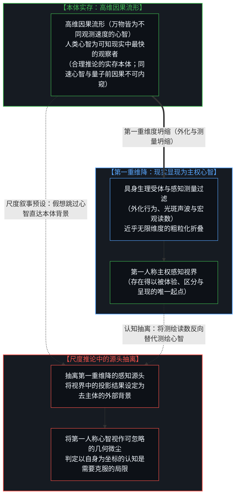
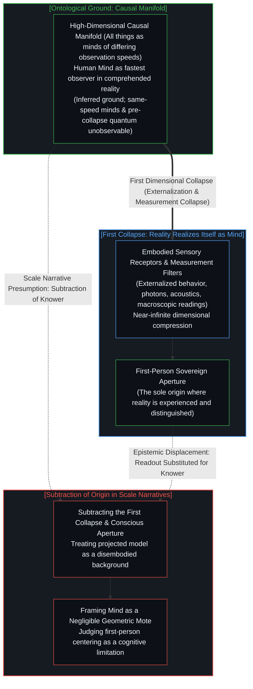
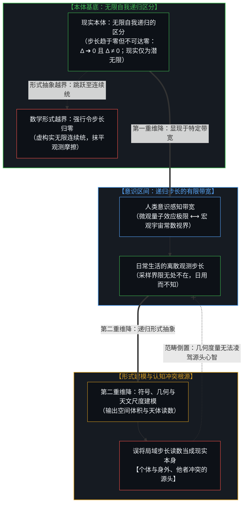
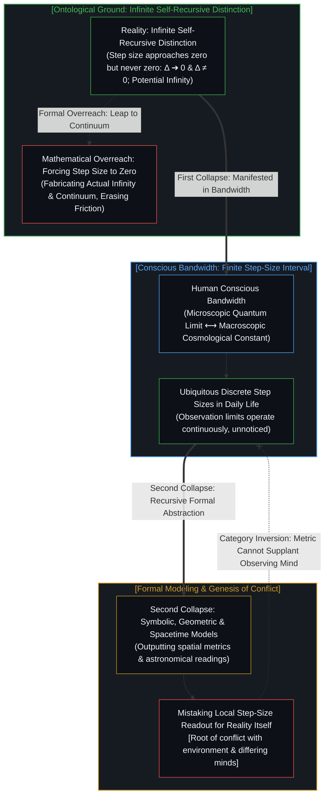
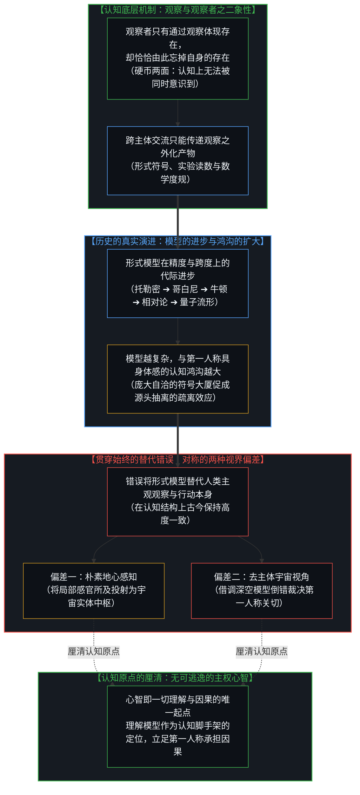
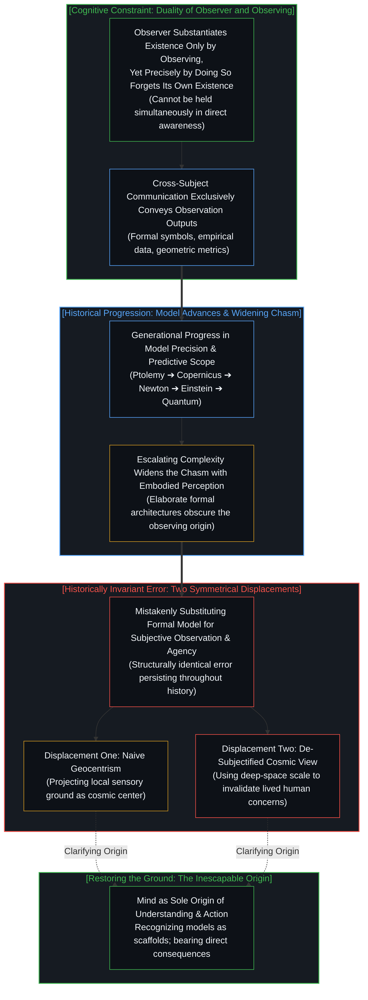
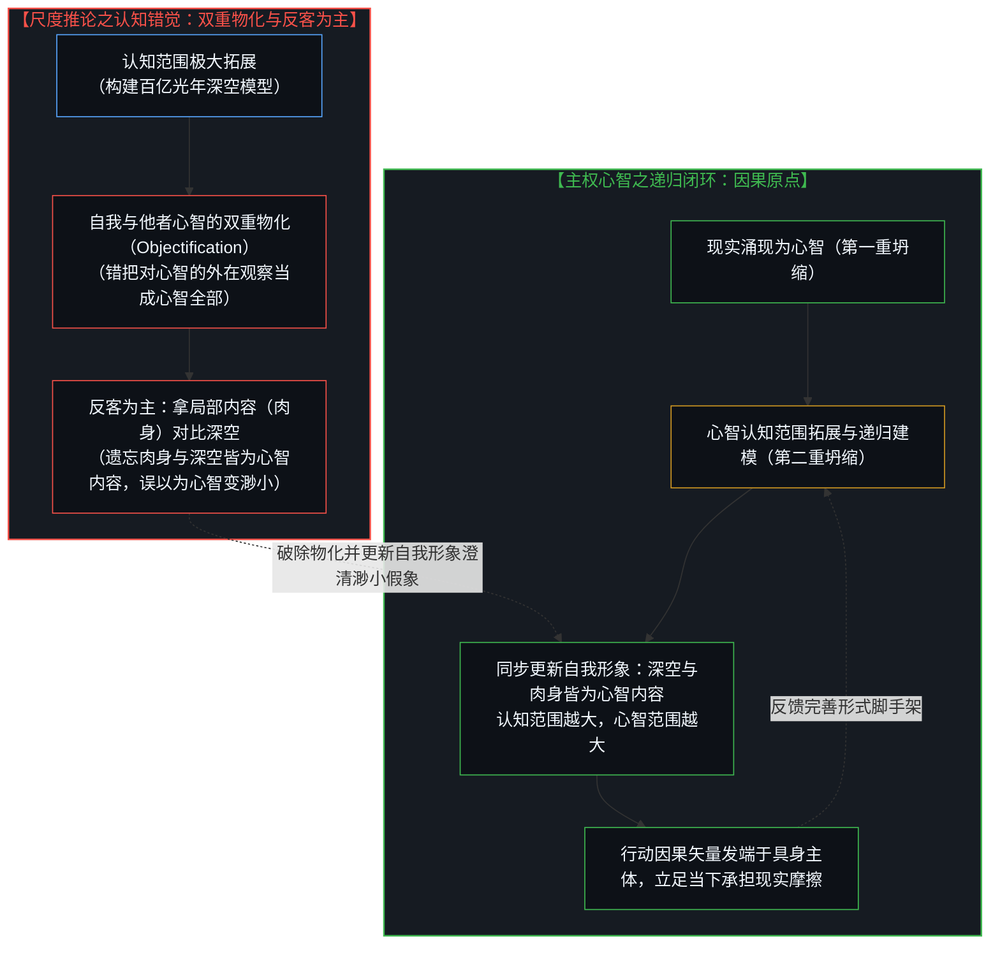
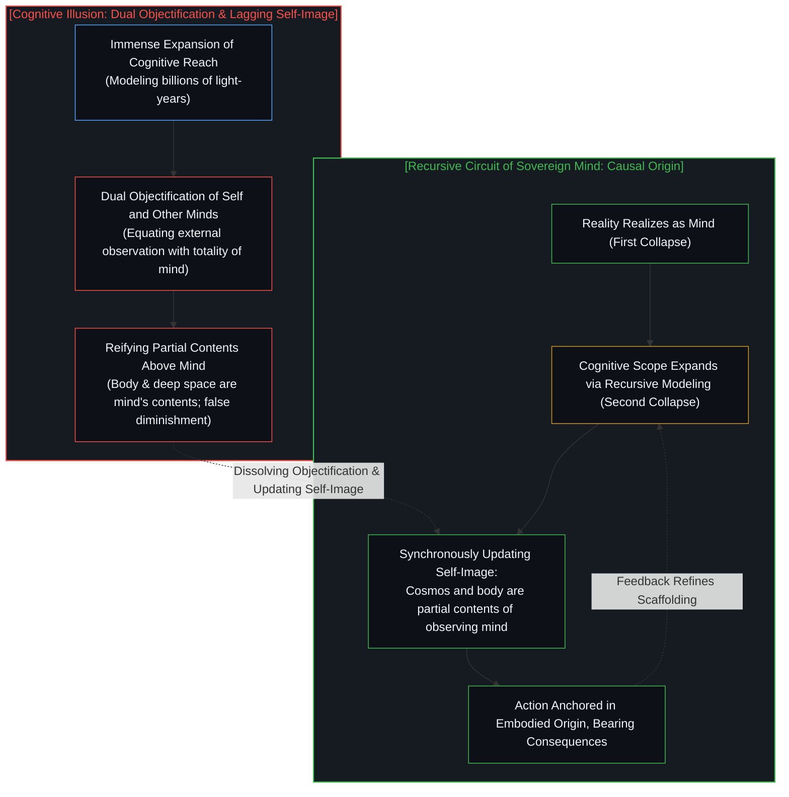

# 无法逃逸的心智视界 / One Cannot Escape One's Own Mind

*两重维降与形式模型的反客为主 / Two-Fold Dimensional Collapse and the Reification of Formal Models*

现实在第一重坍缩中显现为主权心智，心智在第二重坍缩中递归迭代对自身与世界的形式模型；当历史演进中模型的差异更迭让人忽略了无可逃逸的自我，地图便倒错地被赋予了裁决领土的权威。在关于宇宙尺度与人类处境的讨论中，常有一种援引日心说与深空天文图景的流行叙事，试图以此证明人类将自身置于行动与认知中心是一种认识论上的偏差。这种叙事指出，在浩瀚星海面前，人类的个体抉择在几何尺度上显得微不足道。然而，若从认知生成的结构展开审视，这种论断容易忽略现实显现自身并展开理解的两重维度坍缩。在第一重坍缩中，高维因果流形涌现并显现为具身心智的第一人称感知；在第二重坍缩中，心智为了深化对自身与环境的理解，递归地构建出符号、几何与物理定律的形式模型。当人类因历史上形式模型的演化差异而产生认知混淆，进而误将第二重坍缩的形式产物当成超越现实、甚至凌驾于心智之上的客观立法者时，便陷入了自我瓦解的悖论。唯有重新确认无可逃逸的自我坐标原点，看清认知与行动始于具身主体的不可逆结构，才能在真实的因果链条中清晰理解属于主权心智的认知基准。

Reality realizes itself as the sovereign Mind in the first dimensional collapse, and the Mind recursively refines formal models of itself and its world in the second; when the divergence of models across history causes humanity to lose sight of the inescapable self, the cartographic map is mistakenly granted authority to judge the living territory.

## 苍白蓝点的尺度修辞与第一重维降：现实如何显现为主权心智 / The Scale Rhetoric of the Pale Blue Dot and the First Collapse: How Reality Realizes Itself as Mind

在科普读物与大众哲学的讨论中，人们常以“苍白蓝点”为切入点探讨人类的存在处境：当视野拉升至银河系旋臂乃至可观测宇宙的边界，地球便呈现为一粒悬浮在虚空中的微光，而在其上展开的个体经验与日常抉择，在单纯的几何尺度对比下显得十分微小。由此，一种常见的推论随之产生：既然日心说与深空尺度早已证明地球并非物理世界的中心，那么人类在行动与认知中始终以自身为参照，便被视作一种应当被克服的认知局限。这种论证之所以引发广泛共鸣，在于它运用了直观的尺度反差；然而从认识论结构来看，它在推导过程中抽离了得出这一宇宙尺度的认知源头，正如我们在[集聚与人造主体性：源头意识抽离催生的客体化假象](../subtracting-consciousness-at-the-source/)中所剖析的那样，把人类测绘活动的认知成果，置换成了脱离一切观察者的客观背景。

这种推论的内在局限，在于它略过了现实显现为心智的第一重维度坍缩。若从认识论的严密性出发，我们无法确证或否认那里的外部现实究竟是不是我们所构想的那样——它既不能被断然否认，也无法被径直实证。我们能够合理推论其实存，是因为若无此前置现实，便无物可供显现与实现；然而，凡是我们思及其为何物、居于何处，这一构想本身便已经处于心智之内，而非心智之外。需要警惕的是，习惯性的二元划分容易将现实割裂为所谓的“物理世界”与“他者心智”，进而又倒错地把后验建构的物理模型抬高到本体地位，造成了物理与心智并列的假象。实际上，统一展开的高维因果流形本身便已然包含了他者心智，而无须另外开辟独立的本体领域。若把心智的概念在认识论上予以泛化，万物皆具备某种观察与辨识维度的“心智”，区别仅在于彼此遵循着截然不同的观察速度：星系的旋聚、地质岩层的沉积乃至分子的热运动，皆以各自极其漫长或差异化的节律记录着因果阻力与状态跃迁；而人类心智，恰恰是我们所能理解的现实之中采样与辨识速度最快的那一个观察者。我们固然可以设想必然存在比人类认知速度更快的观察者，但这已经处于人类认知世界之外，属于不可界定的不确定内容。

这一认识论图景，直接解释了为何我们无法直接观测他人的内心。面对一个与我们以相同速度在观测的心智，我们断难直接嵌入其内在测绘与体验的实时进程。两个同速运行的观测视界无法直接内窥彼此，我们所能观察到的，永远只能是该心智在做出决断后转化为外化行为的产物——也就是经历了第一重维度坍缩之后的低维现象、言语符号与动作痕迹。同样，这也解释了为何我们无法观测到量子效应之前的因果流淌：在观测介入之前，尚未发生维度坍缩的高维纠缠与因果流动，无法被同速或下游的观察者在不破坏其相干性的前提下直接捕获；任何测量的介入，都迫使高维因果流形经历剧烈的维度折叠，仅在感知界面上留下离散的外化读数。正如我们在[因果的自反性与物理的无源假定](../causality-is-irreducible-the-physical-is-a-view-from-nowhere/)中所阐明的，抽离了最初赋予其区分与测量的观察心智，客观世界便成为一幅悬空的“无源之景”。宇宙本身并未在虚空中宣布自身的广阔，也未曾确立度量微小的标准；正是这方经历了第一重维降的第一人称视界，构成了存在得以被认知和呈现的前提。用测绘产物来反向否定测绘心智的有效性，如同通过精密望远镜观察星空，却推论出观察者自身的视网膜并不存在。

In discussions of cosmic scale and the human condition, a popular narrative invokes the Copernican shift and astronomical panoramas to argue that centering cognition and action on the human mind represents an epistemological bias. In the presence of vast galaxies, human concerns are framed as negligible within a geometric perspective. Yet from the perspective of how cognition is structured, this claim easily overlooks the two-fold dimensional collapse through which reality realizes itself and generates understanding. In the first collapse, the high-dimensional causal manifold realizes itself as the first-person conscious aperture of an embodied mind. In the second collapse, the mind recursively constructs formal models of itself and its environment through symbols, geometry, and physical laws. When thinkers confuse the historical succession of models and treat second-order formal constructs as objective legislators standing above reality and mind, the argument becomes self-defeating. Re-establishing the inescapable first-person coordinate origin clarifies the bedrock from which knowing and action proceed.

The limitation of this scale-based narrative lies in skipping the first dimensional collapse that allows reality to manifest. Examined with epistemological rigor, we cannot know whether the reality out there is or is not whatever we think it is—it can neither be denied nor directly confirmed. Its existence can be reasonably inferred because without it, there would be nothing to be realized into awareness; yet wherever we think it is, or whatever form we imagine it to take, that conception is already an occurrence within the mind, not outside of it. A common conceptual habit tends to bifurcate reality into a supposed 'physical world' alongside 'other minds,' inadvertently elevating post-hoc physical models back into an ontological throne and creating a false duality. In truth, the unified high-dimensional causal manifold already encompasses other minds and all dynamic interactions; no separate ontological compartment is required. If we generalize the concept of mind beyond its narrow identification with human consciousness, all entities partake in mind as observers and responders operating at vastly different observation speeds. The gravitational collapse of stars, the slow settling of geological strata, and the thermal jiggling of molecules register causal friction and state transitions across immense or divergent temporal rhythms. The human mind stands as the fastest observer within the realm of reality we can comprehend. One can reasonably conceive that faster observers must exist beyond human cognition, but they belong to the indeterminate realm lying strictly outside human comprehension.

This epistemological architecture directly illuminates why we cannot directly observe the interiority of another person's mind. Confronted with a mind observing at the same speed as ourselves, we have no avenue to enter its real-time, active process of observation and internal mapping. Two observing horizons operating at parity cannot directly peer into each other; what we can observe is exclusively the result after that mind transforms into externalized behavior—the low-dimensional phenomena, gestures, spoken tokens, or written traces that appear post-collapse. In precisely the same manner, this explains why we cannot observe the causality prior to quantum effects. Before an observation intervenes, high-dimensional entanglement and uncollapsed causal flow cannot be apprehended by an observer operating at our speed without breaking its coherence. Any measurement interaction compels a violent dimensional collapse, leaving behind only discrete macroscopic readouts on an instrument. As demonstrated in [Causality is Irreducible; The Physical is a View from Nowhere](../causality-is-irreducible-the-physical-is-a-view-from-nowhere/), the universe stripped of the observing mind that partitions it into distinctions becomes a view from nowhere. The cosmos does not announce its own extent across the void, nor does it establish metrics for what counts as minute. It is this first-person aperture, forged through the first collapse, that provides the necessary condition for reality to be known and represented. Declaring the knower negligible by pointing to the drafted chart is equivalent to looking through a telescope and concluding that the observer's retina does not exist.

## 空间体积的范畴区分与第二重维降：心智递归建模的认识论定位 / The Category Distinction of Spatial Volume and the Second Collapse: Mind Recursively Modeling Itself

当现实通过第一重维降显现为主权心智的第一人称感知之后，心智并未停留在原初的感觉材料之中。为了深化对自身、对他者以及对所处环境的理解，心智展开了**第二重近乎无限维度的坍缩**：符号化、几何化与数学形式建模。在这个阶段，原本在第一人称中包含着丰富体感阻力、主观质感与上下文张力的具身经验，被再次进行系统性的结构抽象，提炼为由状态空间、微分方程、几何坐标与参数指标构成的形式系统。从牛顿的动力学方程到广义相对论的度规张量，再到现代统计物理的概率分布，皆是心智为了递归认知自身与外部环境而构建的形式化工具。

进一步泛化审视，我们可以合理推断现实其实是一个无限自我递归的区分过程。每一次区分都伴随着特定的观测步长；这一步长可以无限逼近于零，但永远不可能真正到达零。恰恰是在此处，形式数学发生了越界：数学为了追求公理系统的闭合与运算的便利，通过极限工具与实数连续统的设定，在形式上完成了向零的跳跃，将无限细分的微元固化为现成的“实无限”连续平滑空间。然而在实际的物理与认知进程中，步长若真正归零，所有的区分、信息流动与因果阻力都将瞬间瓦解。现实中的无限只能是永远处于生成、未曾封闭的“潜无限”。而人类心智所处的意识界面，恰恰坐落于这一递归进程中特定步长区间的有限带宽之内。在现代科学所构建的共享认知模型中，这一感知区间的两极，正是微观上的量子效应极限与宏观上的宇宙常数视界。

这一离散步长在日常生活中其实无处不在，体现在感官滤波的采样率、神经脉冲的整合间歇、语言概念的切分粒度以及注意力在不同情境间的切换。然而，因为人类在共享知识层面发现并接受了微观尺度上极其微小的量子极限，同时在宏观尺度上接受了极其辽阔的宇宙学边界，便极易在直觉中产生一种连续平滑的错觉，误认为所有处于日常经验中的具体步长都只是暂时的、粗糙的过渡。实际上，在具体的人类生活实践中，仅有极少数科研人员借助极端精密的仪器间接观测到了微观量子干涉或宏观红移读数，而绝大多数人仅仅是在符号文化与教科书中二手地接受了这两个尺度边界。在日复一日的真实生活里，人们每时每刻都在受到自己当前特定观测步长与感知界限的约束，却对此日用而不知。当个体遗忘了自身观测步长的有限性，便会习惯性地将当前步长所折叠出的局部感知与形式理解，误当作客观事实与现实本身。正是这种对自身观察界限的浑然不觉，构成了个体与身外世界摩擦、以及人与人之间认知冲突的原初根源。

在这一认识论框架下，以空间几何尺度衡量心智重要性的范畴混淆便得以厘清。空间体积是第二重模型内部所定义的几何延伸参数，它描述的是形式坐标系内部的分布广延，并不包含生成意义、价值或因果决断的主体属性。跨度辽阔的星际分子云占据巨大的几何体积，而在地表活动的人类个体仅占据有限的物理空间。正如我们在[“物理即规律”的戏法、形式模型与现实的摩擦](../the-sleight-of-hand-in-physics-is-the-law-and-the-friction-of-reality/)中所指出的，形式物理模型是对观测摩擦的事后数学拟合，而非先验规定现实的立法程序。一片由低密度氢气与背景辐射构成的辽阔空间，并不具备反思其自身尺度的感知能力。“浩大”与“微小”是心智在第二重建模中为了衡量相对关系而确立的形式区分。制定标尺的心智处在因果的起点端，而被测量的空间几何数值是标尺延伸出的读数。将读数的大小置于制定读数的心智之上，颠倒了形式工具与认知主体之间的从属关系。

这在认知结构上，正是对我们在[阴影与无限：低维投影、确定性假象与人类冲突的根源](../the-shadow-and-the-infinite/)中所剖析的“三重无限”的重温与深化：高维的现实本体、共享的感知基底，以及差异化的第一人称视界。现实的本体展开为无限自我递归的区分，其步长永不归零；共享的感知基底通过生理与科学仪器划定出可经验的步长区间；而差异化的第一人称视界则在具体行动中承担着局域因果。第一重坍缩是不可约减的现实通过感知基底显现为独特第一人称视界的过程；第二重坍缩则是心智为了递归理解自身与环境，跨越符号鸿沟所建立的形式压缩；而所有的认知偏差与人际冲突，皆源于人们执迷于第二重坍缩的低维符号投影，忘却了当前观测步长的边界，淡忘了不可替代的第一人称原点与生活领土。

Once reality realizes itself through the first collapse as the first-person experiential field, the mind does not remain confined to raw sensory impressions. To advance the understanding of itself, of other minds, and of its surrounding reality, the mind initiates **the second near-infinite dimensional collapse**: symbolic, geometric, and mathematical formal modeling. In this phase, the somatic resistance, contextual nuances, and tensions of direct awareness undergo systematic structural abstraction, condensed into formal systems defined by state spaces, differential equations, coordinate axes, and parametric indices. From Newtonian equations of motion to metric tensors in general relativity and probability distributions in statistical mechanics, all are formalized tools developed by the mind for recursive understanding.

Deepening this inquiry to a generalized ontological foundation, reality can be reasonably inferred as an infinite process of self-recursive distinction. Every distinction operates across a discrete step size; this observational interval approaches zero asymptotically, yet can never strictly reach zero. It is precisely at this juncture that formal mathematics commits an epistemic overreach: in pursuit of axiomatic closure and computational elegance, mathematical calculus posits limits and the real continuum, formally completing the leap to zero and reifying infinite subdivision into an 'actual infinity' of seamless, smooth space. In experiential reality, however, if the distinction step size were ever to become zero, all boundaries, differentiation, and informational flow would instantly vanish. The infinity of reality can only be a 'potential infinity'—ever unfolding, dynamic, and incomplete. Human consciousness is situated squarely within a bounded interval of step sizes along this recursive spectrum. In our shared scientific modeling, this cognitive bandwidth is marked at its lower boundary by quantum effects and at its upper boundary by the cosmological horizon.

This discrete step size is ubiquitous in everyday existence—manifest in sensory sampling rates, neural refractory periods, the semantic grain of vocabulary, and attentional shifts across tasks. Yet because scientific culture discovered and canonized an extraordinarily minute quantum limit at the micro scale alongside a vast cosmological boundary at the macro scale, human intuition easily falls into the illusion of a continuous continuum, uncritically presuming that all intermediate, everyday step sizes are merely temporary, coarse-grained approximations destined to be smoothed away. In actual human experience, only an infinitesimal fraction of specialists have ever directly observed quantum interference patterns or cosmological red shifts, and even their encounters are indirect readouts registered on electronic detectors. The overwhelming majority of people merely accept these boundaries second-hand through symbols, textbooks, and cultural consensus. In daily life, individuals are continuously bounded by their immediate, local observation step sizes without being conscious of them. Forgetting the finiteness of their perceptual aperture, people habitually reify the low-dimensional readouts of their local step size as 'reality itself' or 'objective fact.' It is this unexamined blindness to one's own immediate observational boundaries that constitutes the primary genesis of friction between the self and the external world, as well as the root of intractable conflict between differing minds.

Within this framework, the category confusion of using spatial geometric scale to evaluate the standing of the mind is clarified. Spatial volume is a geometric parameter defined within the second-order model; it records spatial extension within an abstract coordinate system, possessing no inherent capacity to generate meaning, value, or causal decision. An expanse of interstellar gas occupies immense geometric volume, while an embodied human agent occupies limited physical dimensions. As detailed in [The Sleight of Hand in "Physics Is the Law": Formal Models, Statutory Command, and the Friction of Reality](../the-sleight-of-hand-in-physics-is-the-law-and-the-friction-of-reality/), formal physical models are post-hoc mathematical codifications of observed friction, not statutory authorities legislating reality. A vast cosmic expanse of low-density hydrogen and cosmic background radiation possesses no subjective interiority to perceive its own dimensions. Vastness and minuteness are relational distinctions introduced by the mind within second-order modeling. The conscious mind formulating the scale stands prior to the measured coordinates; astronomical measurements are downstream readouts. Placing the magnitude of a readout above the cognitive agency capable of formulating it confuses the instrument with the observing agent.

In this sense, this framework revisits and deepens the structure of the threefold infinity analyzed in [The Shadow and the Infinite: Low-Dimensional Projections, the Deterministic Illusion, and the Genesis of Conflict](../the-shadow-and-the-infinite/): the high-dimensional reality, the shared perceptual substrate, and the singular divergence of the first-person vantage. Reality unfolds as an infinite self-recursive distinction whose step size never reaches zero; the shared perceptual substrate demarcates an experiential bandwidth bounded by instruments and biological thresholds; and the singular first-person horizon bears situated causal accountability in action. The first collapse marks how reality realizes itself through the sensory substrate as a unique first-person vantage; the second collapse represents the formal compression constructed across the symbolic chasm to recursively understand mind and environment; and cognitive displacements and human conflicts arise when discourse fixates on the low-dimensional projection of the second collapse, forgets the finite step size of immediate observation, and loses sight of the irreplaceable first-person origin and the living territory.

## 对称的视界偏差与历史的演进：形式模型更迭为何催生了权威倒置 / Symmetrical Horizon Displacements and Historical Succession: How Model Shifts Induced the Inversion of Authority

既然形式模型经历了两次深刻的维度折叠，并且其根基始终依托于第一人称心智，那么模型为何会在认知中逐渐被视作凌驾于现实之上的独立权威？需要澄清的是，这里容易潜藏一种回溯式的错误假定，仿佛人类在历史起点曾经清醒地拥有对两重维降的完整自觉，后来才因某种退步而将其“淡忘”。实际的认识论机制恰恰相反：人类作为认知主体，从认知发端便从未充分意识到观察者自身的原点地位。

这一未被充分意识的盲区，深植于人类认知的底层机制：**观察者只有通过观察能体现自身的存在，但同时也恰恰由此忘掉了自身的存在**。“观察”与“作为观察者”是同一枚硬币的两面，在意识的实时运行中无法被同时意识到。若无具体的观察对象与感知区分，观察者便处于未显化的潜能状态，其存在唯有在持续的观察与体验中得以展现；然而，正是在展开观察的同一瞬间，注意力不可避免地投向了所观察的外部客体、测量读数或形式符号，观察者自身便作为视线的发射源自然隐入背景。若试图调转目光反思“观察者”，该反思动作本身又化作了新的观察内容，而真正的体验原点依然退居其后。更为关键的是，在不同个体与跨主体的交流之中，彼此能够通过物理信道编码、传递与验证的，**永远只能是观察的外化产物**——即公共的符号、数字、实验数据与几何图景。主观的第一人称体验无法直接穿越物理间隙，唯有形式模型能够在跨主体的协作中流通与积累。因此，历史的演进并非认识论意义上的倒退，而是**形式模型在解释范围与预测精度上的真实进步**。

然而，在这一模型持续进步的历史长河中，**误将形式模型替代人类主观观察与活生生的具身行为本身，在结构上始终保持着高度的一致性**。古代朴素经验将感官直接对应的稳定地块抽象为地心宇宙模型，误以为形式天球就是客观现实本身；现代实证科学构建出百亿光年的深空坐标系与广义相对论度规，一些论调同样将其倒错地视作脱离主体的客观裁决者。所谓的“遗忘”，并非指失去了某种曾经拥有的古老自觉，而是指伴随着形式模型在历史中的演进而发生的一种结构性疏离：**当形式模型随着科学发展变得越来越庞大、精密与复杂，它与人类第一人称具身体感之间的认知鸿沟便越来越巨大**。在初级模型中，符号尚与肉身感知保持着紧密的贴合；而在当代高度抽象的张量几何、高维相空间以及天文尺度模型面前，繁复的形式体系构筑起一座自足闭合的数学殿堂，使得身处其中的观察者极易在层峦叠嶂的模型大厦中迷失，淡忘了整个宏伟体系最初正是为了服务于具身心智理解世界而搭建的脚手架。

这一日益拉大的感知鸿沟，使历史演进中的两种视界偏差呈现出高度对称的形态：
其一是早期直觉经验所呈现的朴素地心认知。受限于生理感知信道与观测工具，早期的观察者将感官直接经验到的稳定地块视作物理空间的实体中枢，把局部的低维投射当成客观宇宙的几何布局。
其二则是当代某种去主体叙事所呈现的宇宙视角。在实证科学打破了朴素地心图景之后，一些论断转向了另一端：试图脱离人类心智的立足点，以一种非局域的宏观视角来审视人类自身的日常关切。然而，表达这一视角的讨论者，其所调用的概念、推导过程与天文数据，依然依赖于其自身大脑所理解与表征的认知模型。当这些论述探讨“人类应当超越自我中心”时，其沟通与论辩的对象依然是其他具有不同认知观点的人类观察者。这并非脱离心智的客观自然在裁决人类，而是在不同观察主体之间就模型的解释方式与意义展开交流。这两种视角表现形式截然相反，但在认知结构上具有相近的特征：它们都在不同程度上脱离了第一人称视界这一无可替代的立足点。

If formal models are products of two successive dimensional collapses rooted within the conscious mind, why do theories chronically reify formal models as an independent authority standing above reality? Here, an intuitive but misleading presupposition must be dismantled: the retrospective illusion that humanity once possessed a lucid, primal awareness of this two-fold collapse and subsequently 'forgot' it through historical decay. The epistemological reality is precisely the opposite: humanity, as an observing subject, **was never fully conscious of the observer's origin in the first place**.

This structural blind spot is deeply embedded in the architecture of cognition: **the observer can only substantiate its existence through the act of observing, yet precisely by doing so, it forgets its own existence**. The act of 'observing' and 'being the observer' are two sides of the same coin, structurally impossible to hold simultaneously in direct conscious awareness. Without concrete objects to distinguish and perceive, the observer remains an unmanifest potential whose existence is realized only in the dynamic unfolding of observation; yet in the very instant observation is enacted, attention is directed outward toward the observed objects, measurement readouts, and formal symbols, causing the observer itself—the sovereign source of the perceptual gaze—to naturally recede behind the gaze. If one attempts to turn inward to inspect the 'observer,' that very act of introspection transforms into a new observational content, while the living experiencing origin retreats once more into the background. Crucially, in communication across differing subjects, what can be encoded, transmitted, and empirically calibrated across physical space **is without exception the externalized output of observation**—public symbols, numbers, instruments, and geometric charts. Inward first-person qualia cannot directly traverse physical separation; only formal models can be communicated, accumulated, and collectively refined. Therefore, history does not represent an epistemic regression, but **genuine progress in the scope, precision, and structural sophistication of formal modeling**.

However, across this historical ascent of modeling, **the error of mistakenly substituting the formal model for human subjective observation and lived agency has remained invariant**. Early intuitive thinkers substituted their direct sensory ground for the celestial geometry of the cosmos; contemporary discourse often makes an identical substitution by treating deep-space metric tensors or quantum probability amplitudes as an autonomous reality standing above living minds. What is termed 'forgetting' is not the loss of some archaic enlightenment, but a structural alienation driven by escalating complexity: **as formal models become increasingly intricate, comprehensive, and abstracted, the perceptual chasm separating the model from first-person embodied human experience expands exponentially**. In elementary models, symbols retain immediate proximity to sensory friction; in modern tensor manifolds and cosmological grids, the symbolic architecture becomes so self-contained and formidable that observers easily lose their footing within the monumental edifice, forgetting that the entire theoretical scaffolding was constructed from the outset to serve the embodied mind in navigating its world.

This widening chasm gives rise to two symmetrical horizon displacements across history:
The first is the naive geocentrism of early sensory intuition. Constrained by biological sensory bandwidth and elementary tools, early observers naturally identified the stable ground beneath their feet as the physical center of the universe, equating local perspective with universal geometry.
The second is the modern de-subjectified narrative that presumes a cosmic perspective. After empirical science dismantled naive geocentrism, discourse often shifted to the opposite pole: attempting to step outside the human cognitive locus to evaluate human concerns from a disembodied vantage point. Yet any critic invoking astronomical models remains reliant on concepts, inferences, and data represented within their own cognitive architecture. When such arguments urge that humanity should abandon its self-centered focus, their actual dialogue takes place with other human observers holding contrasting viewpoints. This is not inanimate nature passing judgment on human cognition, but an ongoing exchange between observing minds evaluating theoretical frameworks. While these two approaches diverge sharply, they share a common structural premise: both overlook the irreplaceable foundation of the first-person horizon.

## 无法逃逸的心智视界与因果行动的唯一起点 / The Inescapable Horizon: Mind as the Sole Anchor of Causal Action

在辨明两重维度坍缩与历史更迭的认知结构后，认知与存在的连续关系便得以呈现：**现实在第一重坍缩中显现为主权心智，心智在第二重坍缩中递归迭代对自身与世界的形式模型**。形式模型是心智为了在环境中辨识模式与展开行动而构建的脚手架；它源自心智，服务于心智，并在与现实环境的持续摩擦中接受检验与调整。这正是[凡可言说皆不可言说之产物](../all-that-can-be-spoken-is-the-product-of-the-unspeakable/)所确立的界限：一切形式符号与离散读数皆属于第二重坍缩的下游投射，断不可反客为主地僭越其发端的先验心智。

不仅认知的展开依赖于心智视界，行动的因果矢量同样只能从具体的具身主体出发。一切行动之所以必然以人为中心展开，源于**行动的决断与后果承担具有不可转让的局域性**。正如我们在[任务的移交与后果的不可让渡](../the-delegation-of-the-task-and-the-inalienability-of-consequences/)中所分析的，信息计算与指令执行可以交由外部工具完成，形式模型可以提供预测参考，但承受生理摩擦、感知代价以及做出价值权衡的责任，始终定位于第一人称的心智之中。任何个体都无法脱离当下的具身环境去替代遥远星系做出抉择。行动需要明确的坐标原点，而这一原点正是当下处于体验与行动中的生命机体。试图以宇宙的宏大尺度来淡化具体行动的重要性，混淆了形式模型的抽象跨度与具身行动的现实权重。当一个人在日常生活中做出抉择、承担承诺或面对离别，因果压力的真实性并不会因天文数字的庞大而有所减损；如[抉择本身并不沉重](../choice-itself-has-no-inherent-weight/)所辨明的，每一次状态跃迁本身并不附带内在阻力，迟疑与停滞仅源于心智误将静态模型当作替代现实行动的避险屏障。

这一倒错更揭示出深空尺度叙事中一种深刻的认识论错觉：**当心智没有意识到它的认知范围越大、自身的范围便越大的时候，它反而会错误地以为自己变得渺小了**。当人类心智递归构建出百亿光年的深空星系图景时，这本身标志着心智认知疆域的空前拓展——是心智的容量在容纳宇宙模型，而非心智在物理虚空中被动缩减。然而，许多人由于未能**同步更新心智自身的自我形象**，依然将对“自我”的理解死板地锚定在局部的肉身几何体积之上，把数十公斤、一米多高的碳基机体同跨越百亿光年的形式读数进行直接的物理比对。在这种刻舟求剑的对照下，心智便误以为自己沦为了可忽略的宇宙尘埃。这并非心智真的变渺小了，而是心智在拓展认知疆域的同时，未曾同步更新其自我形象，错把用于测量尺度的肉身工具等同于生成测量的认知主体。

这种错觉的深层机制，正是**心智同时把自身与其他心智一起物化（objectification）的结果：错误地把对自身与他人心智的外在观察，当成了自身与他人心智的全部**。面对他者心智，由于同速视界无法直接内窥，人们所能接触的永远只是第一重维度坍缩后的外化言行与行为读数，于是极易将对方物化为可观测的生物客体或形式模型中的因果变量；而在审视自身时，心智同样将自身物化，将不可内窥的主权感知原点缩减为坐标系内占据有限体积的生理机体。当心智把自身与他者皆降格为形式空间中的物化对象时，便遗忘了那个正在进行测绘、建模与赋予意义的源头心智，永远不可能被其下游的任何可观测现象所穷尽。将对心智的外在观察等同于心智的全部，使心智在自身编织的物化图景中迷失了主权位置，进而在一片无机几何读数面前陷入了自轻与虚无。当这种双重物化被平移至人际与亲密协作中时，便催生了[契约的因果倒置](../the-causal-inversion-of-partnership/)：将不可内窥的他者心智降格为参数筛选清单，把共同磨合的动态演化倒错为前置资产的静态兑换。

而认识论的事实是，**无论是百亿光年的深空图景、外部星系的运动规律，还是对他人外化言行的记录、对自己肉身体积的度量，其在认识论上都只是“正在观察的心智”的一部分内容**。被观察的对象、形式模型的读数，乃至“自身渺小”的无力感本身，无一不是在正在展开的第一人称认知视界中被显化与整合的局部内容。整体断不可能被其内部呈现的某一局部内容所矮化；作为认知容器与发端原点的主权心智，断不可能被自身内部所包含的一组几何读数所缩减。当心智错把自身的局部内容当作独立于自身的实体，并在内容内部拿一个物化符号（肉身）去对比另一个物化尺度（深空）时，它实际上是在自己的意识舞台上，被自己推演出的布景反客为主地剥夺了立足之地。

正如我们在[能动性从不涌现：涌现的范畴错误、潜空间侵入与第一人称先验](../agency-does-not-arise/)中所指出的，能动性并非从物理系统的下游统计平均中被动产生，它是构建模型与设定坐标的先决条件。认识论的严谨，并不要求我们假想一个不存在主体的虚空视角，而是清晰地认领心智自身的认知视界。确认一切认知与行动皆围绕人类经验展开，是基于认知条件的客观陈述。心智不必因无机物质在几何体积上的广袤而低估自身的认知功能。宇宙之所以呈现出深邃与有序，正是因为第一人称的感知与推理在物质运动中展开了认知维度。人无法逃逸出自身的心智，正如行动无法脱离实施行动的立足点；破除对心智的物化偏狭，认清肉身与深空皆为心智的内容，同步更新自我形象，理解形式模型的工具定位，立足当下的感知原点，承担具身行动的因果反馈，构成了主权心智清晰而沉着的认知基准。

Once the two-fold dimensional collapse and historical succession are clarified, the continuous relationship between knowing and reality emerges: **reality realizes itself as the sovereign Mind in the first collapse, and the Mind recursively refines formal models of itself and its reality in the second collapse**. Formal models are scaffolds constructed by the mind to distinguish patterns and guide action; they originate from the mind, serve the mind, and remain subject to revision through ongoing friction with the environment. This traces the boundary established in [All That Can Be Spoken Is the Product of the Unspeakable](../all-that-can-be-spoken-is-the-product-of-the-unspeakable/): all formal symbols and discrete tokens are downstream projections of the second collapse, never entitled to displace the unspeakable prior Mind from which they arise.

Furthermore, just as knowing depends on the mind's horizon, the causal vector of action originates exclusively from an embodied agent. Action is centered around the agent because **decision-making and the bearing of consequences possess non-transferable local anchorage**. As analyzed in [The Delegation of the Task and the Inalienability of Consequences](../the-delegation-of-the-task-and-the-inalienability-of-consequences/), computation and instructions can be delegated to external instruments, and formal models provide predictive guidance, but bearing somatic friction, absorbing metabolic costs, and weighing values remain situated in first-person consciousness. No individual can step outside their local environment to act on behalf of distant galaxies. Action requires a clear coordinate origin, and that origin is without exception the living organism currently experiencing and interacting with its surroundings. Attempting to use the scale of the cosmos to dilute the reality of concrete action conflates the abstract reach of models with the situated weight of agency. When an individual makes a choice, makes a commitment, or faces loss, the weight of consequence is not mitigated by the magnitude of astronomical quantities; as clarified in [Choice Itself Has No Inherent Weight](../choice-itself-has-no-inherent-weight/), the discrete state transition carries zero inherent drag, and perceived inertia arises solely when the mind mistakes static models for an insurance shield against lived action.

This inversion exposes a profound epistemological illusion at the heart of cosmic-scale narratives: **when the mind fails to realize that the greater the scope of its cognition, the greater the scope of itself becomes, it mistakenly believes instead that it has become minute**. When the human mind recursively models an expanse of billions of light-years, that very model represents an unprecedented expansion of the mind's own cognitive territory. It is the capacity of the mind that encompasses the cosmic model, not the mind that has physically shriveled across the void. However, because individuals fail to **synchronously update the mind's self-image**, they continue to anchor the concept of 'self' rigidly to the local geometric volume of the biological body—placing a seventy-kilogram, two-meter mammalian organism in naive physical comparison against hundreds of billions of light-years. Through this mismatched comparison, the mind misinterprets the geometric modesty of its biological vehicle as the insignificance of consciousness itself. It is not that the mind has become minute; rather, it is because the mind has failed to synchronously update its self-image, mistakenly equating the measuring instrument with the cognitive agent generating the measurement.

At a deeper mechanical level, this illusion is the direct consequence of **the mind simultaneously objectifying both itself and other minds (objectification): mistakenly equating the external observation of its own and other minds with the totality of those minds**. When confronting another mind, because observers operating at identical speeds cannot peer directly into each other's interiority, one encounters only the externalized behaviors left in the wake of the first dimensional collapse, readily objectifying the other into an observable biological entity or a deterministic variable in a formal model. In examining itself, the mind commits the identical fallacy, objectifying itself by reducing the unobservable sovereign perceptual origin to a somatic organism occupying a finite volume within a spatial grid. When the mind reduces both itself and others to objectified phenomena within formal space, it forgets that the sovereign observing agency engaged in surveying, modeling, and bestowing meaning can never be exhausted by any of its downstream observable manifestations. Mistaking the external observation of mind for the totality of mind causes consciousness to forfeit its sovereign footing within its own objectified map, culminating in an unfounded sense of diminishment before silent inorganic coordinates. When this dual objectification is transferred into interpersonal collaboration, it engenders [The Causal Inversion of Partnership](../the-causal-inversion-of-partnership/): reducing an unobservable other mind to a parameter checklist and inverting the dynamic co-evolution of shared invariants into a static transactional exchange.

In epistemological fact, **whether it is the grand model of billions of light-years, the formal laws governing distant galaxies, the recorded behaviors of others, or the physical metrics of one's own biological body—all of these are merely partial contents of the actively observing mind**. The observed objects, the downstream readouts of formal models, and even the subjective sensation of diminishment itself are without exception local contents manifested and integrated within the living first-person conscious field. The whole can never be diminished by any partial content arising within it; the sovereign mind, as the cognitive container and active aperture, cannot be dwarfed by a set of geometric parameters generated within its own recursive domain. When the mind mistakes its own partial contents for independent realities standing above it, and naively pits one objectified symbol (the biological body) against another objectified metric (cosmic volume) inside that very content, it is effectively staged within its own theater, allowing its own drafted scenery to dispossess the living author of its sovereign ground.

As established in [Agency Does Not Arise: The Category Error of Emergence, Ingressed Latent Spaces, and the First-Person Prior](../agency-does-not-arise/), agency is not an epiphenomenal average produced downstream by physical systems; it is the prior condition for constructing coordinate models and establishing inquiries. Rigorous epistemology does not require posturing from an unembodied view from nowhere, but soberly acknowledging the boundaries of the mind's horizon. Recognizing that knowledge and action are situated in human experience is an accurate description of our cognitive condition. The mind need not discount its own role simply because inanimate matter occupies vast geometric volume. The cosmos presents its depth and order because first-person perception and reasoning illuminate physical motion across time. One cannot escape one's own mind, just as action cannot proceed without a physical footing; dispelling the objectification of mind, recognizing that cosmos and body alike are partial contents of the mind, synchronously updating one's self-image, recognizing formal models as tools, anchoring oneself at the experiential origin, and bearing the causal feedback of action constitute the clear foundation of sovereign agency.

