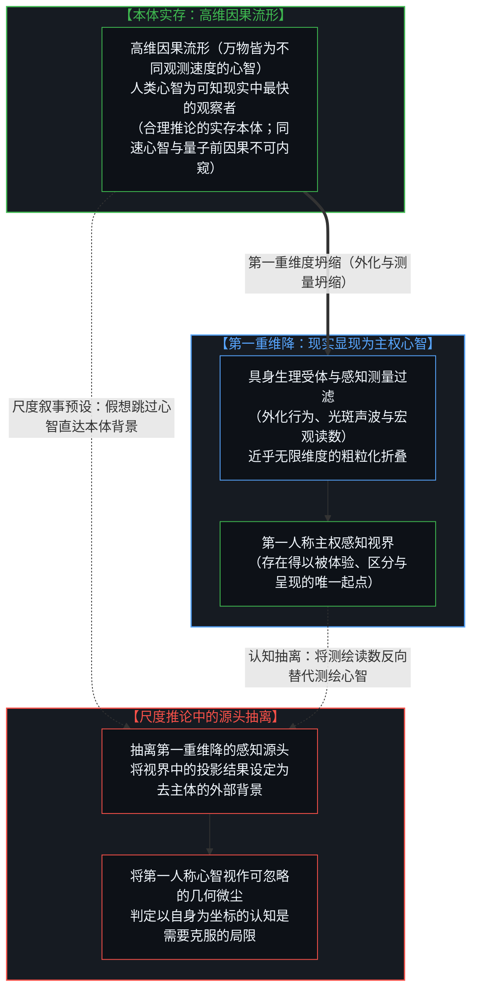
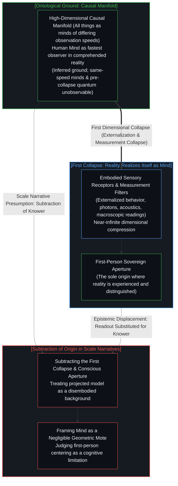
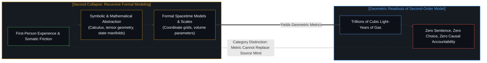
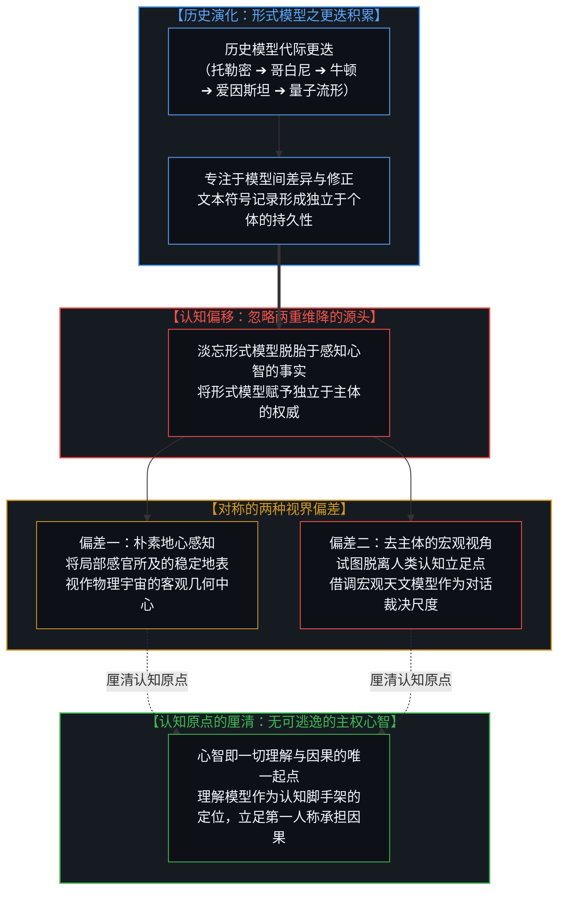
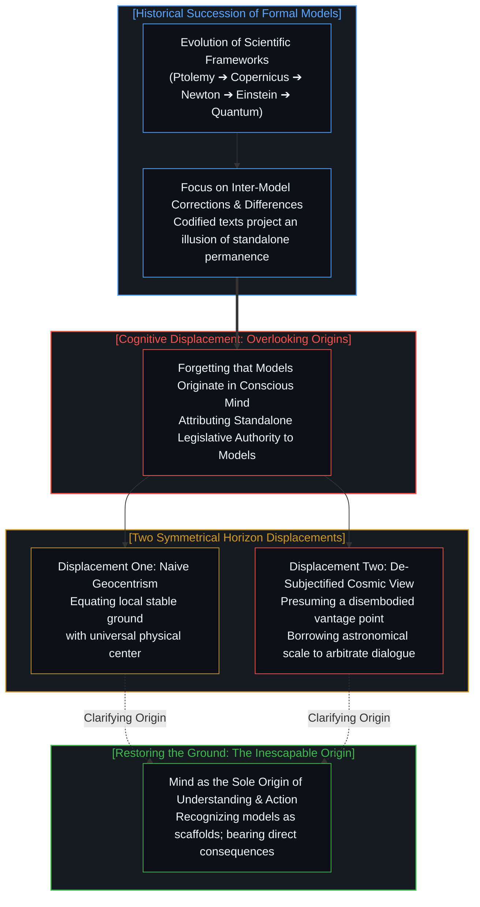
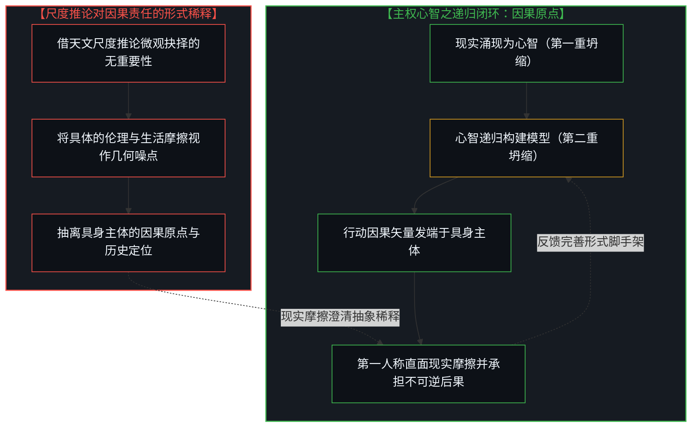
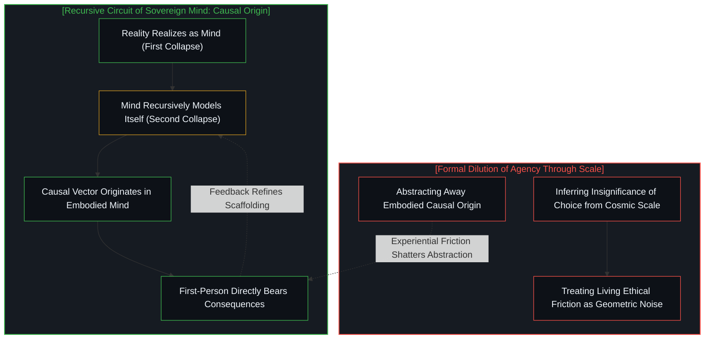

# 无法逃逸的心智视界、两重维降与形式模型的反客为主 / One Cannot Escape One's Own Mind: Two-Fold Dimensional Collapse and the Reification of Formal Models

*现实在第一重坍缩中显现为主权心智，心智在第二重坍缩中递归迭代对自身与世界的形式模型；当历史演进中模型的差异更迭让人忽略了无可逃逸的自我，地图便倒错地被赋予了裁决领土的权威。 / Reality realizes itself as the sovereign Mind in the first dimensional collapse, and the Mind recursively refines formal models of itself and its world in the second; when the divergence of models across history causes humanity to lose sight of the inescapable self, the cartographic map is mistakenly granted authority to judge the living territory.*

在关于宇宙尺度与人类处境的讨论中，常有一种援引日心说与深空天文图景的流行叙事，试图以此证明人类将自身置于行动与认知中心是一种认识论上的偏差。这种叙事指出，在浩瀚星海面前，人类的个体抉择在几何尺度上显得微不足道。然而，若从认知生成的结构展开审视，这种论断容易忽略现实显现自身并展开理解的两重维度坍缩。在第一重坍缩中，高维因果流形涌现并显现为具身心智的第一人称感知；在第二重坍缩中，心智为了深化对自身与环境的理解，递归地构建出符号、几何与物理定律的形式模型。当人类因历史上形式模型的演化差异而产生认知混淆，进而误将第二重坍缩的形式产物当成超越现实、甚至凌驾于心智之上的客观立法者时，便陷入了自我瓦解的悖论。唯有重新确认无可逃逸的自我坐标原点，看清认知与行动始于具身主体的不可逆结构，才能在真实的因果链条中清晰理解属于主权心智的认知基准。

## 苍白蓝点的尺度修辞与第一重维降：现实如何显现为主权心智 / The Scale Rhetoric of the Pale Blue Dot and the First Collapse: How Reality Realizes Itself as Mind

在科普读物与大众哲学的讨论中，人们常以“苍白蓝点”为切入点探讨人类的存在处境：当视野拉升至银河系旋臂乃至可观测宇宙的边界，地球便呈现为一粒悬浮在虚空中的微光，而在其上展开的个体经验与日常抉择，在单纯的几何尺度对比下显得十分微小。由此，一种常见的推论随之产生：既然日心说与深空尺度早已证明地球并非物理世界的中心，那么人类在行动与认知中始终以自身为参照，便被视作一种应当被克服的认知局限。这种论证之所以引发广泛共鸣，在于它运用了直观的尺度反差；然而从认识论结构来看，它在推导过程中抽离了得出这一宇宙尺度的认知源头，正如我们在[集聚与人造主体性：源头意识抽离催生的客体化假象](../subtracting-consciousness-at-the-source/)中所剖析的那样，把人类测绘活动的认知成果，置换成了脱离一切观察者的客观背景。

这种推论的内在局限，在于它略过了现实显现为心智的第一重维度坍缩。若从认识论的严密性出发，我们无法确证或否认那里的外部现实究竟是不是我们所构想的那样——它既不能被断然否认，也无法被径直实证。我们能够合理推论其实存，是因为若无此前置现实，便无物可供显现与实现；然而，凡是我们思及其为何物、居于何处，这一构想本身便已经处于心智之内，而非心智之外。需要警惕的是，习惯性的二元划分容易将现实割裂为所谓的“物理世界”与“他者心智”，进而又倒错地把后验建构的物理模型抬高到本体地位，造成了物理与心智并列的假象。实际上，统一展开的高维因果流形本身便已然包含了他者心智，而无须另外开辟独立的本体领域。若把心智的概念在认识论上予以泛化，万物皆具备某种观察与辨识维度的“心智”，区别仅在于彼此遵循着截然不同的观察速度：星系的旋聚、地质岩层的沉积乃至分子的热运动，皆以各自极其漫长或差异化的节律记录着因果阻力与状态跃迁；而人类心智，恰恰是我们所能理解的现实之中采样与辨识速度最快的那一个观察者。我们固然可以设想必然存在比人类认知速度更快的观察者，但这已经处于人类认知世界之外，属于不可界定的不确定内容。

这一认识论图景，直接解释了为何我们无法直接观测他人的内心。面对一个与我们以相同速度在观测的心智，我们断难直接嵌入其内在测绘与体验的实时进程。两个同速运行的观测视界无法直接内窥彼此，我们所能观察到的，永远只能是该心智在做出决断后转化为外化行为的产物——也就是经历了第一重维度坍缩之后的低维现象、言语符号与动作痕迹。同样，这也解释了为何我们无法观测到量子效应之前的因果流淌：在观测介入之前，尚未发生维度坍缩的高维纠缠与因果流动，无法被同速或下游的观察者在不破坏其相干性的前提下直接捕获；任何测量的介入，都迫使高维因果流形经历剧烈的维度折叠，仅在感知界面上留下离散的外化读数。正如我们在[因果的自反性与物理的无源假定](../causality-is-irreducible-the-physical-is-a-view-from-nowhere/)中所阐明的，抽离了最初赋予其区分与测量的观察心智，客观世界便成为一幅悬空的“无源之景”。宇宙本身并未在虚空中宣布自身的广阔，也未曾确立度量微小的标准；正是这方经历了第一重维降的第一人称视界，构成了存在得以被认知和呈现的前提。用测绘产物来反向否定测绘心智的有效性，如同通过精密望远镜观察星空，却推论出观察者自身的视网膜并不存在。

In discussions of cosmic scale and the human condition, a popular narrative invokes the Copernican shift and astronomical panoramas to argue that centering cognition and action on the human mind represents an epistemological bias. In the presence of vast galaxies, human concerns are framed as negligible within a geometric perspective. Yet from the perspective of how cognition is structured, this claim easily overlooks the two-fold dimensional collapse through which reality realizes itself and generates understanding. In the first collapse, the high-dimensional causal manifold realizes itself as the first-person conscious aperture of an embodied mind. In the second collapse, the mind recursively constructs formal models of itself and its environment through symbols, geometry, and physical laws. When thinkers confuse the historical succession of models and treat second-order formal constructs as objective legislators standing above reality and mind, the argument becomes self-defeating. Re-establishing the inescapable first-person coordinate origin clarifies the bedrock from which knowing and action proceed.

The limitation of this scale-based narrative lies in skipping the first dimensional collapse that allows reality to manifest. Examined with epistemological rigor, we cannot know whether the reality out there is or is not whatever we think it is—it can neither be denied nor directly confirmed. Its existence can be reasonably inferred because without it, there would be nothing to be realized into awareness; yet wherever we think it is, or whatever form we imagine it to take, that conception is already an occurrence within the mind, not outside of it. A common conceptual habit tends to bifurcate reality into a supposed 'physical world' alongside 'other minds,' inadvertently elevating post-hoc physical models back into an ontological throne and creating a false duality. In truth, the unified high-dimensional causal manifold already encompasses other minds and all dynamic interactions; no separate ontological compartment is required. If we generalize the concept of mind beyond its narrow identification with human consciousness, all entities partake in mind as observers and responders operating at vastly different observation speeds. The gravitational collapse of stars, the slow settling of geological strata, and the thermal jiggling of molecules register causal friction and state transitions across immense or divergent temporal rhythms. The human mind stands as the fastest observer within the realm of reality we can comprehend. One can reasonably conceive that faster observers must exist beyond human cognition, but they belong to the indeterminate realm lying strictly outside human comprehension.

This epistemological architecture directly illuminates why we cannot directly observe the interiority of another person's mind. Confronted with a mind observing at the same speed as ourselves, we have no avenue to enter its real-time, active process of observation and internal mapping. Two observing horizons operating at parity cannot directly peer into each other; what we can observe is exclusively the result after that mind transforms into externalized behavior—the low-dimensional phenomena, gestures, spoken tokens, or written traces that appear post-collapse. In precisely the same manner, this explains why we cannot observe the causality prior to quantum effects. Before an observation intervenes, high-dimensional entanglement and uncollapsed causal flow cannot be apprehended by an observer operating at our speed without breaking its coherence. Any measurement interaction compels a violent dimensional collapse, leaving behind only discrete macroscopic readouts on an instrument. As demonstrated in [Causality is Irreducible; The Physical is a View from Nowhere](../causality-is-irreducible-the-physical-is-a-view-from-nowhere/), the universe stripped of the observing mind that partitions it into distinctions becomes a view from nowhere. The cosmos does not announce its own extent across the void, nor does it establish metrics for what counts as minute. It is this first-person aperture, forged through the first collapse, that provides the necessary condition for reality to be known and represented. Declaring the knower negligible by pointing to the drafted chart is equivalent to looking through a telescope and concluding that the observer's retina does not exist.

## 空间体积的范畴区分与第二重维降：心智递归建模的认识论定位 / The Category Distinction of Spatial Volume and the Second Collapse: Mind Recursively Modeling Itself

当现实通过第一重维降显现为主权心智的第一人称感知之后，心智并未停留在原初的感觉材料之中。为了深化对自身、对他者以及对所处环境的理解，心智展开了**第二重近乎无限维度的坍缩**：符号化、几何化与数学形式建模。在这个阶段，原本在第一人称中包含着丰富体感阻力、主观质感与上下文张力的具身经验，被再次进行系统性的结构抽象，提炼为由状态空间、微分方程、几何坐标与参数指标构成的形式系统。从牛顿的动力学方程到广义相对论的度规张量，再到现代统计物理的概率分布，皆是心智为了递归认知自身与外部环境而构建的形式化工具。

在这一认识论框架下，以空间几何尺度衡量心智重要性的范畴混淆便得以厘清。空间体积是第二重模型内部所定义的几何延伸参数，它描述的是形式坐标系内部的分布广延，并不包含生成意义、价值或因果决断的主体属性。跨度辽阔的星际分子云占据巨大的几何体积，而在地表活动的人类个体仅占据有限的物理空间。正如我们在[“物理即规律”的戏法、形式模型与现实的摩擦](../the-sleight-of-hand-in-physics-is-the-law-and-the-friction-of-reality/)中所指出的，形式物理模型是对观测摩擦的事后数学拟合，而非先验规定现实的立法程序。一片由低密度氢气与背景辐射构成的辽阔空间，并不具备反思其自身尺度的感知能力。“浩大”与“微小”是心智在第二重建模中为了衡量相对关系而确立的形式区分。制定标尺的心智处在因果的起点端，而被测量的空间几何数值是标尺延伸出的读数。将读数的大小置于制定读数的心智之上，颠倒了形式工具与认知主体之间的从属关系。

这在认知结构上，正是对我们在[阴影与无限：低维投影、确定性假象与人类冲突的根源](../the-shadow-and-the-infinite/)中所剖析的“三重无限”的重温与深化：高维的现实本体、共享的感知基底，以及差异化的第一人称视界。第一重坍缩是不可约减的现实通过感知基底显现为独特第一人称视界的过程；第二重坍缩则是心智为了递归理解自身与环境，跨越符号鸿沟所建立的形式压缩；而所有的认知偏差，皆源于人们执迷于第二重坍缩的低维符号投影，淡忘了不可替代的第一人称原点与生活领土。

Once reality realizes itself through the first collapse as the first-person experiential field, the mind does not remain confined to raw sensory impressions. To advance the understanding of itself, of other minds, and of its surrounding reality, the mind initiates **the second near-infinite dimensional collapse**: symbolic, geometric, and mathematical formal modeling. In this phase, the somatic resistance, contextual nuances, and tensions of direct awareness undergo systematic structural abstraction, condensed into formal systems defined by state spaces, differential equations, coordinate axes, and parametric indices. From Newtonian equations of motion to metric tensors in general relativity and probability distributions in statistical mechanics, all are formalized tools developed by the mind for recursive understanding.

Within this framework, the category confusion of using spatial geometric scale to evaluate the standing of the mind is clarified. Spatial volume is a geometric parameter defined within the second-order model; it records spatial extension within an abstract coordinate system, possessing no inherent capacity to generate meaning, value, or causal decision. An expanse of interstellar gas occupies immense geometric volume, while an embodied human agent occupies limited physical dimensions. As detailed in [The Sleight of Hand in "Physics Is the Law": Formal Models, Statutory Command, and the Friction of Reality](../the-sleight-of-hand-in-physics-is-the-law-and-the-friction-of-reality/), formal physical models are post-hoc mathematical codifications of observed friction, not statutory authorities legislating reality. A vast cosmic expanse of low-density hydrogen and cosmic background radiation possesses no subjective interiority to perceive its own dimensions. Vastness and minuteness are relational distinctions introduced by the mind within second-order modeling. The conscious mind formulating the scale stands prior to the measured coordinates; astronomical measurements are downstream readouts. Placing the magnitude of a readout above the cognitive agency capable of formulating it confuses the instrument with the observing agent.

In this sense, this framework revisits and deepens the structure of the threefold infinity analyzed in [The Shadow and the Infinite: Low-Dimensional Projections, the Deterministic Illusion, and the Genesis of Conflict](../the-shadow-and-the-infinite/): the irreducible physical reality, the shared perceptual substrate, and the singular divergence of the first-person vantage. The first collapse marks how high-dimensional reality realizes itself through the sensory substrate as a unique first-person vantage; the second collapse represents the formal compression constructed across the symbolic chasm to recursively understand mind and environment; and cognitive displacements arise when discourse fixates on the low-dimensional projection of the second collapse, losing sight of the observing origin and the living territory.

## 对称的视界偏差与历史的演进：形式模型更迭为何催生了权威倒置 / Symmetrical Horizon Displacements and Historical Succession: How Model Shifts Induced the Inversion of Authority

既然形式模型经历了两次深刻的维度折叠，并且其根基始终依托于第一人称心智，那么模型为何会在认知中逐渐被视作凌驾于现实之上的独立权威？这一现象深植于**形式模型在人类历史演进中的代际更迭与符号固化**。

在人类认知史中，形式模型经历了持续的演化：从早期的天球同心圆模型，到托勒密的本轮均轮体系，再到牛顿力学的刚性时空、麦克斯韦的电磁理论、爱因斯坦的弯曲时空流形，以及现代的量子态矢量与高维统计模型。在这一历史进程中，形式模型表现出不同于瞬时感知经验的持久性：符号系统与数学公式能够记录于书籍文献之中，超越个体的生命周期而代代相传。随着后继模型在计算精度与预测一致性上的递进，思想史的焦点自然聚集于“模型与模型之间的差异与修正”。从托勒密到哥白尼，从牛顿到爱因斯坦，人们细致推演不同形式体系之间的转换边界。在这个漫长的演进过程中，一种认知上的重心偏移悄然发生：**人们容易淡忘两重维降的原初过程，忽略了任何模型都依托于无可逃逸的第一人称观察视角**。由于专注于形式体系的代际完善，模型逐渐被赋予了一种脱离认知主体的客观权威，甚至被视作自然现实本身的直接等价物。

这种重心的偏移，催生了两种结构对称的认知视界偏差：
其一是早期直觉经验所呈现的朴素地心认知。受限于生理感知信道与观测工具，早期的观察者容易将感官直接经验到的稳定地块视作物理空间的实体中枢，把局部的视角投射当成客观宇宙的几何布局。
其二则是当代某种去主体叙事所呈现的宇宙视角。在实证科学打破了朴素地心图景之后，一些论断转向了另一端：试图脱离人类心智的立足点，以一种非局域的宏观视角来审视人类自身的日常关切。然而，表达这一视角的讨论者，其所调用的概念、推导过程与天文数据，依然依赖于其自身大脑所理解与表征的认知模型。当这些论述探讨“人类应当超越自我中心”时，其沟通与论辩的对象依然是其他具有不同认知观点的人类观察者。这并非脱离心智的客观自然在裁决人类，而是在不同观察主体之间就模型的解释方式与意义展开交流。这两种视角表现形式截然相反，但在认知结构上具有相近的特征：它们都在不同程度上脱离了第一人称视界这一无可替代的立足点。

If formal models are products of two successive dimensional collapses rooted within the conscious mind, why do theories chronically reify formal models as an independent authority standing above reality? The origin of this displacement lies in **the generational succession and symbolic codification of formal models throughout history**.

Across the history of science, formal models have undergone continuous evolution: from ancient celestial crystalline spheres to Ptolemaic epicycles, Newtonian rigid spacetime, Maxwellian electromagnetism, Einsteinian curved manifolds, and modern quantum state vectors. In this succession, formal models demonstrated a durability distinct from fleeting sensory perception: symbolic equations and geometric proofs can be compiled into literature, outliving individual human lifespans. As successive frameworks improved in computational precision and empirical predictive consistency, intellectual attention focused naturally on the *differences and corrections between models*. Thinkers analyzed the boundary transitions between Ptolemy and Copernicus, or between Newton and Einstein. Through this prolonged historical progression, an epistemic shift took place: **humanity lost sight of the two preceding dimensional collapses, forgetting that every model remains anchored in the first-person observing horizon**. Absorbed in the generational refinement of formal systems, cultures gradually attributed an unmediated, autonomous authority to the model, treating the cartographic projection as equivalent to reality itself.

This displacement generates two symmetrical horizon errors:
The first is the naive geocentrism of early sensory intuition. Constrained by biological sensory bandwidth and elementary tools, early observers naturally identified the stable ground beneath their feet as the physical center of the universe, equating local perspective with universal geometry.
The second is the modern de-subjectified narrative that presumes a cosmic perspective. After empirical science dismantled naive geocentrism, discourse often shifted to the opposite pole: attempting to step outside the human cognitive locus to evaluate human concerns from a disembodied vantage point. Yet any critic invoking astronomical models remains reliant on concepts, inferences, and data represented within their own cognitive architecture. When such arguments urge that humanity should abandon its self-centered focus, their actual dialogue takes place with other human observers holding contrasting viewpoints. This is not inanimate nature passing judgment on human cognition, but an ongoing exchange between observing minds evaluating theoretical frameworks. While these two approaches diverge sharply, they share a common structural premise: both overlook the irreplaceable foundation of the first-person horizon.

## 无法逃逸的心智视界与因果行动的唯一起点 / The Inescapable Horizon: Mind as the Sole Anchor of Causal Action

在辨明两重维度坍缩与历史更迭的认知结构后，认知与存在的连续关系便得以呈现：**现实在第一重坍缩中显现为主权心智，心智在第二重坍缩中递归迭代对自身与世界的形式模型**。形式模型是心智为了在环境中辨识模式与展开行动而构建的脚手架；它源自心智，服务于心智，并在与现实环境的持续摩擦中接受检验与调整。

不仅认知的展开依赖于心智视界，行动的因果矢量同样只能从具体的具身主体出发。一切行动之所以必然以人为中心展开，源于**行动的决断与后果承担具有不可转让的局域性**。正如我们在[任务的移交与后果的不可让渡](../the-delegation-of-the-task-and-the-inalienability-of-consequences/)中所分析的，信息计算与指令执行可以交由外部工具完成，形式模型可以提供预测参考，但承受生理摩擦、感知代价以及做出价值权衡的责任，始终定位于第一人称的心智之中。任何个体都无法脱离当下的具身环境去替代遥远星系做出抉择。行动需要明确的坐标原点，而这一原点正是当下处于体验与行动中的生命机体。试图以宇宙的宏大尺度来淡化具体行动的重要性，混淆了形式模型的抽象跨度与具身行动的现实权重。当一个人在日常生活中做出抉择、承担承诺或面对离别，因果压力的真实性并不会因天文数字的庞大而有所减损。

正如我们在[能动性从不涌现：涌现的范畴错误、潜空间侵入与第一人称先验](../agency-does-not-arise/)中所指出的，能动性并非从物理系统的下游统计平均中被动产生，它是构建模型与设定坐标的先决条件。认识论的严谨，并不要求我们假想一个不存在主体的虚空视角，而是清晰地认领心智自身的认知视界。确认一切认知与行动皆围绕人类经验展开，是基于认知条件的客观陈述。心智不必因无机物质在几何体积上的广袤而低估自身的认知功能。宇宙之所以呈现出深邃与有序，正是因为第一人称的感知与推理在物质运动中展开了认知维度。人无法逃逸出自身的心智，正如行动无法脱离实施行动的立足点；理解形式模型的工具定位，立足当下的感知原点，承担具身行动的因果反馈，构成了主权心智清晰而沉着的认知基准。

Once the two-fold dimensional collapse and historical succession are clarified, the continuous relationship between knowing and reality emerges: **reality realizes itself as the sovereign Mind in the first collapse, and the Mind recursively refines formal models of itself and its reality in the second collapse**. Formal models are scaffolds constructed by the mind to distinguish patterns and guide action; they originate from the mind, serve the mind, and remain subject to revision through ongoing friction with the environment.

Furthermore, just as knowing depends on the mind's horizon, the causal vector of action originates exclusively from an embodied agent. Action is centered around the agent because **decision-making and the bearing of consequences possess non-transferable local anchorage**. As analyzed in [The Delegation of the Task and the Inalienability of Consequences](../the-delegation-of-the-task-and-the-inalienability-of-consequences/), computation and instructions can be delegated to external instruments, and formal models provide predictive guidance, but bearing somatic friction, absorbing metabolic costs, and weighing values remain situated in first-person consciousness. No individual can step outside their local environment to act on behalf of distant galaxies. Action requires a clear coordinate origin, and that origin is without exception the living organism currently experiencing and interacting with its surroundings. Attempting to use the scale of the cosmos to dilute the reality of concrete action conflates the abstract reach of models with the situated weight of agency. When an individual makes a choice, makes a commitment, or faces loss, the weight of consequence is not mitigated by the magnitude of astronomical quantities.

As established in [Agency Does Not Arise: The Category Error of Emergence, Ingressed Latent Spaces, and the First-Person Prior](../agency-does-not-arise/), agency is not an epiphenomenal average produced downstream by physical systems; it is the prior condition for constructing coordinate models and establishing inquiries. Rigorous epistemology does not require posturing from an unembodied view from nowhere, but soberly acknowledging the boundaries of the mind's horizon. Recognizing that knowledge and action are situated in human experience is an accurate description of our cognitive condition. The mind need not discount its own role simply because inanimate matter occupies vast geometric volume. The cosmos presents its depth and order because first-person perception and reasoning illuminate physical motion across time. One cannot escape one's own mind, just as action cannot proceed without a physical footing; recognizing formal models as tools, anchoring oneself at the experiential origin, and bearing the causal feedback of action constitute the clear foundation of sovereign agency.

