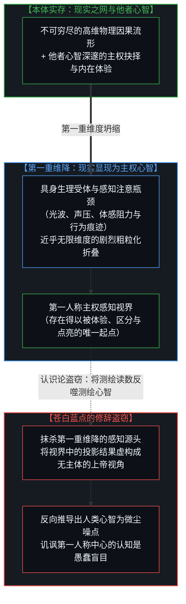
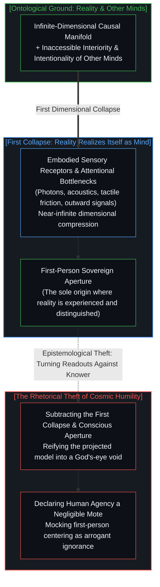
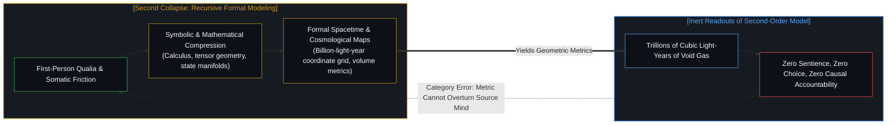
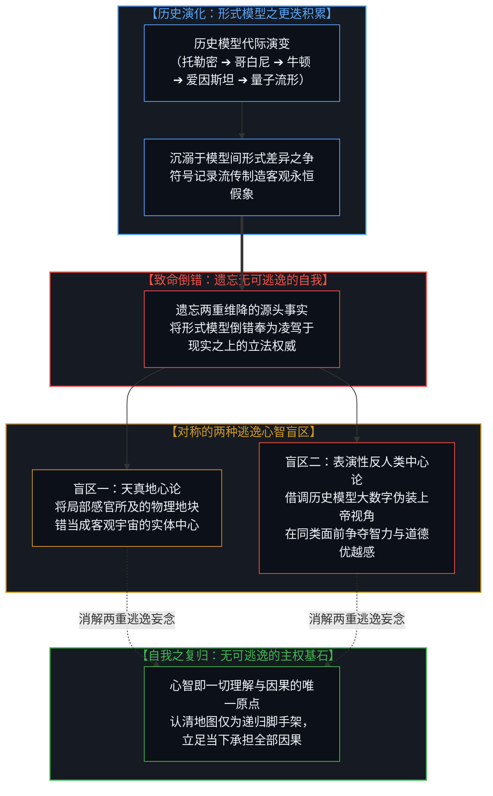
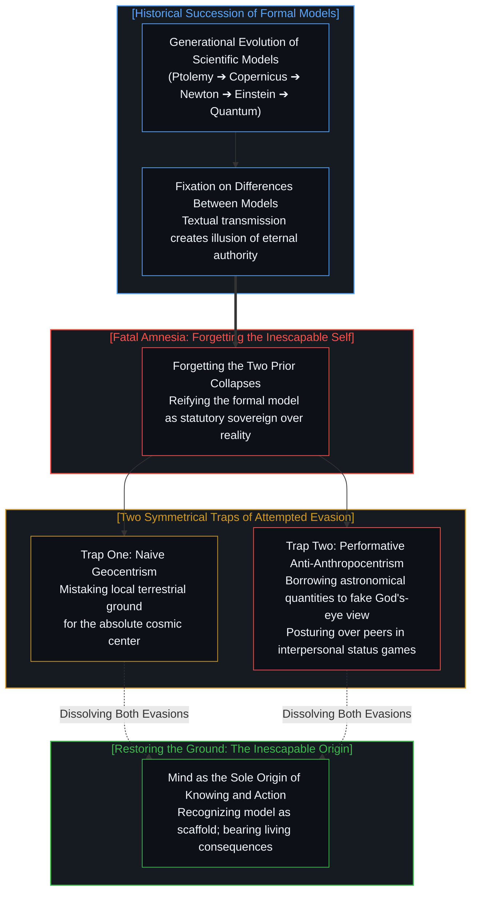
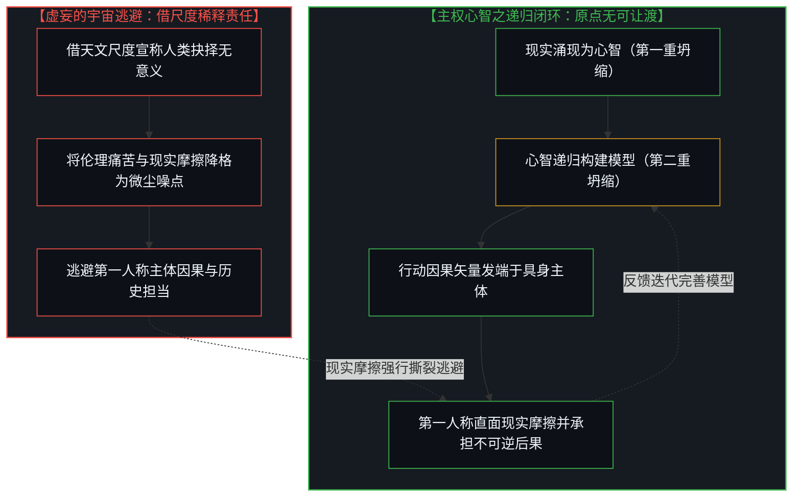
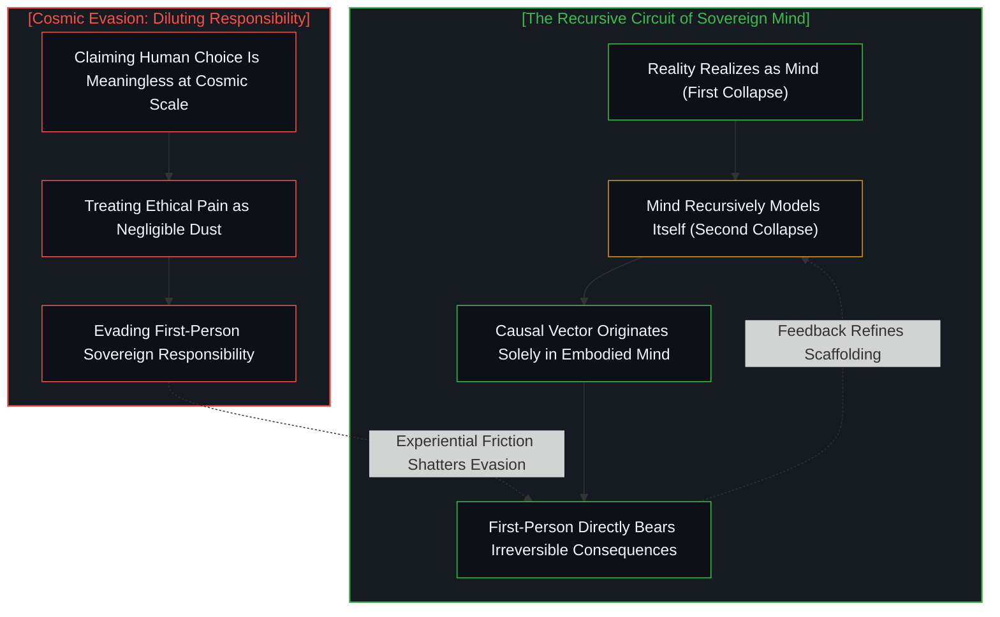

# 无法逃逸的心智视界、两重维降与廉价宇宙谦卑的表演性悖论 / One Cannot Escape One's Own Mind: Two-Fold Dimensional Collapse and the Performative Paradox of Cosmic Humility

*现实在第一重坍缩中显现为主权心智，心智在第二重坍缩中递归迭代对自身与世界的形式模型；而当历史演进中模型的差异更迭让人遗忘了无可逃逸的自我，地图便倒错地篡夺了领土的立法权。 / Reality realizes itself as the sovereign Mind in the first dimensional collapse, and the Mind recursively refines formal models of itself and its world in the second; when the divergence of models across history causes humanity to forget the inescapable self, the cartographic map usurpingly claims statutory authority over the living territory.*

当代世俗文化中流行着一种廉价的宇宙谦卑：人们常常引述日心说与亿万光年的天文图景，居高临下地讥讽人类日常行动的自私与狭隘，宣称在浩瀚星海面前，人类的一切悲欢与抉择皆不过是无足轻重的尘埃。这种宏大叙事在表面上标榜超脱与敬畏，实则陷入了深层的认识论倒错：它遗忘了现实显现自身并展开理解的两重维度坍缩。在第一重坍缩中，包含他者心智在内的无限维现实涌现并显现为具身心智的第一人称感知；在第二重坍缩中，心智为了深化对自身与环境的理解，递归地构建出符号、几何与物理定律的形式模型。当人类因历史上形式模型的演化差异而产生迷思，进而误将第二重坍缩的形式产物当成超越现实、甚至凌驾于心智之上的客观立法者时，便陷入了自我击溃的表演性悖论。唯有重新确立无可逃逸的自我坐标原点，看清认知与行动必然始于具身主体的不可逆结构，人类才能走出自我鄙薄的虚妄深渊，在真实的因果链条中承担起属于主权心智的沉重抉择。

## 苍白蓝点的修辞陷阱与第一重维降：现实如何显现为主权心智 / The Rhetorical Trap of the Pale Blue Dot and the First Collapse: How Reality Realizes Itself as Mind

在科普读物与大众哲学的讨论中，人们乐此不疲地复述着“苍白蓝点”式的感伤修辞：只要将视野拉升到银河系旋臂或可观测宇宙的边界，地球便化为一粒悬浮在虚空中的微尘，而在这粒微尘上繁衍争斗的数十亿具身心智，似乎立刻失去了任何重大的意义。借由几何尺寸的悬殊对比，论者轻而易举地推导出一份贬低人类主体性的判词，质问人类为何在知晓日心说与深空尺度之后，依然固执地将自身置于行动与价值的中心。这种论证之所以具备蛊惑人心的力量，在于它隐秘地完成了一场认识论盗窃——它在最终的判决阶段，悄悄抽掉了得出这一宇宙尺度的认知源头，正如我们在[集聚与人造主体性：源头意识抽离催生的客体化假象](../subtracting-consciousness-at-the-source/)中所解构的那样，把人类测绘活动的活生生成果，装扮成脱离一切观察者的客观戒尺。

这种修辞陷阱最深层的盲区，在于它割裂了现实显现为心智的第一重维度坍缩。外部现实并非仅仅由冰冷的岩石、恒星与气体分子构成，它更包含着漫布其中的他者心智。无论是微观物理交互的无穷自由度，还是他者心智那断难被外部直接客体化穿透的主权抉择、悲喜体验与意向性因果，皆处在不可穷尽的高维实存之中。然而，当这一辽阔的存在之网显现为一个具体观察者的第一人称感知时，一场跨越近乎无限维度的剧烈折叠便已经发生：他者幽深的内心波澜被感官压缩为眼球表面的反射光斑、耳膜上的空气震颤或屏幕上的离散字符；浩瀚无垠的微观因果纠缠，被局限在具身受体那几道极其狭窄的生理信道之中。正如我们在[因果的自反性与物理的无源假定](../causality-is-irreducible-the-physical-is-a-view-from-nowhere/)中所阐明的，物理学所宣称的客观宇宙，如果抽离了最初赋予其区分与测量的观察心智，便沦为一幅悬空的无源之景。宇宙本身从未向虚空宣布过自身的辽阔，也从未在岩石与星云之间刻下微尘的度量衡；正是这方经历了第一重维降的第一人称视界，在荒凉的物质运动中点亮了让存在得以显现的觉知之光。用测绘产物去否定测绘者的有效性，无异于建造了一架精密的望远镜，却转过身来宣称磨镜工匠的视网膜并不存在。

In contemporary secular culture, an unreflective trope of cosmic humility has gained widespread currency. Invoking the Copernican revolution and astronomical panoramas spanning billions of light-years, commentators adopt a posture of cosmic detachment, mocking human concerns and daily struggles as trivial narcissism. In the presence of a vast, indifferent universe, they insist, humanity’s persistent tendency to act as the center of existence is an embarrassing display of ignorance. This grand narrative masquerades as spiritual elevation, yet it collapses into a performative contradiction: it systematically ignores the two-fold dimensional collapse through which reality realizes itself and generates understanding. In the first collapse, reality—rich with unbroken micro-dynamics and the irreducible interiority of other minds—realizes itself as the first-person conscious aperture of an embodied mind. In the second collapse, the mind recursively constructs formal models of itself and its environment to deepen comprehension. When thinkers mistake the second-order formal artifacts for objective arbiters standing above the mind, they confuse spatial volume with ontological primacy, reducing a profound epistemological structure into a shallow contest for rhetorical superiority.

The core blindness of this rhetorical trap lies in severing reality from the first dimensional collapse that allows it to manifest. The external world is not a sterile museum of lifeless rocks and interstellar clouds; it is populated by sovereign other minds possessing inaccessible inner states, private griefs, and sovereign causal vectors. When this vast existential web meets an embodied observer, a near-infinite reduction in dimensionality occurs: the deep, living interiority of other agents collapses into sensory surfaces, vocal vibrations, and retinal patterns; the boundless complexity of nature folds into the narrow physiological bandwidth of sensory receptors. As demonstrated in [Causality is Irreducible; The Physical is a View from Nowhere](../causality-is-irreducible-the-physical-is-a-view-from-nowhere/), the physical universe stripped of the observing mind that partitions it into distinctions becomes a view from nowhere. The cosmos has never proclaimed its own size, nor does it engrave dust motes into interstellar dust; it is this first-person aperture, forged through the first collapse, that kindles the light of awareness across inanimate motion. Declaring the knower trivial by pointing to the map they drafted is equivalent to building a telescope only to claim that the eye looking through it does not exist.

## 空间体积的范畴错误与第二重维降：心智递归建模的认识论定位 / The Category Error of Spatial Volume and the Second Collapse: Mind Recursively Modeling Itself

当现实通过第一重维降显现为主权心智的第一人称感知之后，心智并未停留在被动的体验之中。为了持续深化对自身、对他者以及对所处现实环境的理解，心智开启了**第二重近乎无限维度的坍缩**：符号化、几何化与数学形式建模。在这个阶段，原本在第一人称中极其丰饶、充满体感阻力、情感质感与未分化张力的鲜活经验，被再一次剧烈压缩，提炼成了由少数几条微分方程、闭合状态空间流形、几何坐标轴与标量指标构成的形式系统。从牛顿的运动方程到广义相对论的度规张量，再到现代统计力学的配分函数，无一不是心智为了递归认知自身与现实而打造的第二重维降工具。

由此，我们便能清晰看清“宇宙体积贬低人类”背后的范畴错误。空间体积只是第二重维降产物中的几何延伸标度，它描述的是形式坐标系内部的广延参数，却不具备任何产出价值、意义或意向性抉择的质性能力。一片跨度达数万光年的冷寂分子云，因其几何体积极大，在朴素的直觉中被赋予了崇高感；而体积不过数立方分米的人类机体，则因空间尺度的微小而被贬抑为噪点。正如我们在[“物理即规律”的戏法、形式模型与现实的摩擦](../the-sleight-of-hand-in-physics-is-the-law-and-the-friction-of-reality/)中所指出的，形式物理模型是对现实摩擦的事后数学拟合，而非向存在发号施令的实体法典。一片由近乎真空的稀薄氢气与冰冷辐射构成的百亿立方光年虚空，在漫长岁月中从未经历过哪怕一毫秒的困惑、痛苦、沉思或抉择；它并不“知道”自己的浩大，也无法“体验”自己的荒凉。“浩大”与“微小”本就是心智在第二重建模中为了确立相对关系而拉出的区分刻度。赋予标尺以刻度的心智，永远处在因果的起点端；将被测量的空间体积分数反向推选为主宰，是用第二重维降的骨架去否定孕育它的活生生源泉。

Once reality realizes itself through the first collapse as the first-person experiential field, the mind does not remain passive. To recursively advance the understanding of itself, of other minds, and of the reality as it knows it, the mind initiates **the second near-infinite dimensional collapse**: symbolic, geometric, and mathematical formal modeling. In this phase, the somatic resistance, nuanced qualia, and living tensions of direct awareness are once again dramatically compressed into discrete systems governed by differential equations, closed coordinate grids, and scalar metrics. From Newtonian trajectories to the metric tensors of general relativity and statistical partition functions, all are conceptual tools forged in this second collapse to serve recursive comprehension.

This exposes the category error behind using cosmic volume to demean the human mind. Spatial volume is an internal coordinate readout produced within the second-order model; it records geometric extension within a formal grid, possessing zero capacity to generate meaning, intentionality, or moral choice. Under this materialist intuition, an expanse of interstellar gas spanning tens of thousands of light-years is endowed with majesty simply because it occupies vast geometric volume, while an embodied mind occupying a fraction of a cubic meter is demoted to a negligible perturbation. As detailed in [The Sleight of Hand in "Physics Is the Law": Formal Models, Statutory Command, and the Friction of Reality](../the-sleight-of-hand-in-physics-is-the-law-and-the-friction-of-reality/), formal physical models are post-hoc mathematical codifications of observed friction, not statutory authorities governing ontological primacy. A cosmic void spanning billions of cubic light-years of near-vacuum hydrogen experiences zero perplexity, zero suffering, and zero moral choice across trillions of years. It possesses no awareness of its own extent. Vastness and minuteness exist solely as relational distinctions drawn by an observing mind. In the ontological order, the conscious mind that formulates the scale stands irrevocably prior to the measured coordinates. Declaring the magnitude of a second-order readout superior to the living agency capable of formulating it is a profound epistemological inversion.

## 对称的盲区与历史的迷雾：为何差异演进催生了反客为主的妄念 / Symmetric Traps and Historical Amnesia: How Model Shifts Induced the Usurpation of Reality

既然形式模型经历了两次深刻的维度折叠，并且其根基始终牢牢钉在第一人称心智之中，那么为什么世人不仅屡屡遗忘这一事实，甚至倒错地将形式模型供奉为比现实更权威的存在？深层的根源在于**形式模型在人类历史中的差异演变与代际积累**。

在人类思想的漫长画卷中，形式模型经历了一轮又一轮的更迭：从古代的水晶球天球模型，到托勒密的本轮均轮体系，再到牛顿力学的刚性时空、麦克斯韦的电磁场、爱因斯坦的弯曲时空，乃至当代的量子概率流形与人工神经网络隐空间。在这个历史演变的过程中，形式模型具备了一种肉身经验所没有的特质：符号与数学能够被记录在羊皮纸与石碑上，超越单一个体的寿命而持久流传。随着不同历史时期模型之间计算精度的差异和预测效能的提升，思想界的全部注意力被牢牢吸引到了“模型与模型的差异”之中。学者们耗尽心智去争论托勒密模型与哥白尼模型的优劣，推演牛顿力学与相对论在极端条件下的修正。在这场浩大的历史长跑中，一种致命的集体健忘症悄然蔓延：**人们遗忘了无可逃逸的自我，遗忘了模型不过是经历了两次近乎无限维度的坍缩后留下的一张极度精简的航海图**。由于沉醉于地图的代际精进，人类逐渐产生了一种近乎迷信的倒错狂妄，误以为历史更替的模型就是自然本身的终极法典，甚至将其视为高于现实、裁决一切的至高权威。

正是在这种对自我的遗忘中，诞生了两种结构高度对称的认知盲区：
第一种是古代经验主义所代表的天真地心说。它受制于感官信道的迟滞与测量仪器的粗糙，把肉眼所见的地表直接当成了宇宙的静止枢纽，将局部的第一人称投射错认为了全局实体法则。
第二种则是当代借调上帝视角的反人类中心论。当实证天文学用日心说与深空大尺度打破了地心说时，论者并未回归清醒，反而滑向了更深的狂妄。他们宣称自己跳出了人类局限，代天立言，站在银河系旋臂的高维审判席上蔑视地表同类的日常关切。然而，那个在屏幕上敲下宏大批判、感叹人类中心主义愚蠢的批评者，自身从未脱离碳基神经系统的生理限制，所动用的一切概念依然是他自己大脑中接收处理的历史模型。正如推特争论所一针见血揭示的，当这些论者自诩超越了人类中心时，他们的一切言辞实际上不过是围绕着“那些在知识理解上与他们意见相左的同类”在展开话语博弈。这从来不是冷寂星空对人类的审判，而是一部分人类借调天文教科书上的大数字，在道德与智力优越感的争夺战中压制另一部分人类的修辞工具。两者看似针锋相对，实则共享了同一种病症：他们都在历史的迷雾中遗忘了无可逃逸的自我，妄图跳出自己的心智视界去扮演虚空。

If formal models are products of two successive, radical dimensional collapses rooted within the conscious mind, why do human cultures chronically succumb to the delusion of mistaking formal models for reality itself—or crowning them with superior authority? The source of this confusion lies in **the historical divergence, succession, and institutional reification of formal models**.

Across the history of human thought, formal models have undergone continuous generational turnover: from ancient crystalline spheres to Ptolemaic epicycles, Newtonian absolute space, Maxwellian fields, Einsteinian relativistic geometry, and modern quantum probabilistic operators. In this historical succession, formal models exhibited a durability that mortal sensory experience lacked: written on parchment, carved in stone, and compiled into textbooks, mathematical equations persisted across centuries, outliving the fragile eyes that first ground the optical lenses. As predictive precision improved across epochs, the collective attention of the intellectual elite became absorbed in the *differences between models*. Scholars spent generations debating the geometric divergences between Ptolemy and Copernicus, or tracking where Newtonian mechanics diverged from relativistic tensors. In this historical race, a severe cognitive amnesia set in: **humanity forgot the inescapable self, forgetting that every model is merely a sparse navigational scaffold produced after two near-infinite dimensional collapses**. Captivated by the progression of the cartographic map across history, thinkers committed the ultimate inversion: they mistook the historical model for Nature's statutory law, granting the abstract map sovereignty over the living territory.

This forgetting of the self generates two structurally symmetrical cognitive traps:
The first trap is the naive geocentrism of early sensory intuition. Constrained by sensory limits and coarse instruments, early observers took their local physical ground as the cosmos's physical hub, confusing local sensory projections with universal metaphysical law.
The second trap is the faux God’s-eye posture of anti-anthropocentrism. When modern astronomy shattered geocentrism with heliocentrism and cosmic scales, critics did not arrive at sobriety; they swung into an even more arrogant second trap. Imagining that they had escaped the constraints of human cognition, they presumed to speak on behalf of the universe, looking down on terrestrial peers with enlightened disdain. Yet the critic typing polemics on a screen remains bound by neurobiology and human syntax; the evidence they marshal is an informational pattern processed within their own cognitive apparatus. When such critics claim to have abandoned human-centeredness, their actions remain focused entirely on other human beings who hold differing perspectives. This is not the cosmos passing judgment on human pettiness; it is an ordinary interpersonal contest wherein astronomical data are weaponized to secure rhetorical superiority over intellectual peers. Both factions share an identical blind spot: they forget that one cannot step outside one’s own mind to inspect an unobserved cosmos.

## 无法逃逸的心智视界与因果行动的唯一锚点 / The Inescapable Horizon: Mind as the Sole Anchor of Causal Action

将两重维降与历史的迷雾细致厘清之后，整个认识论的闭环终于清晰浮现：**现实在第一重坍缩中显现为主权心智，心智在第二重坍缩中递归迭代对自身与世界的形式模型**。形式模型从来不是高悬于存在之上的终极立法者，而是心智为了导航现实而搭建的脚手架；它发端于心智，受制于心智，并必须在与具体现实的持续摩擦中接受心智的重构。

更进一步，认知的不可逃逸性确立了模型的从属性，而行动的不可逃逸性则奠定了因果责任的不可让渡性。一切行动之所以必然以人类为中心展开，不是因为人类在宇宙学图景中占有什么特权地位，而是因为**行动的因果矢量只能从具体的具身决断者身上发出**。正如我们在[任务的移交与后果的不可让渡](../the-delegation-of-the-task-and-the-inalienability-of-consequences/)中深刻剖析的那样，计算与执行可以被委托给外在工具，形式模型可以提供推演预测，但承担不可逆后果、承受生理张力以及行使价值裁决的主权，永远被钉死在第一人称的心智之中。一个人无法代表仙女座大星系做出选择，也无法依据几百亿年后的宇宙热寂来决定当下的生存决断。行动要求坐标原点，而这个原点无例外地正是当下产生感知的活生生肉身。

正是在这一层意义上，我们在[能动性从不涌现：涌现的范畴错误、潜空间侵入与第一人称先验](../agency-does-not-arise/)中做出的论断展现了其完整的重量：能动性并非从物理化学的下游统计中被动涌现，能动性本身就是一切形式模型与坐标尺度的源头先验。那些试图通过渲染宇宙空旷来劝说人类“不要把自己太当回事”的虚无说教，表面上是在呼唤谦逊，实际上却是在兜售一种逃避因果担当的认识论鸦片。如果人类只是无意义的微尘，那么个体的抉择、制度的毁誉、压迫的苦难与伦理的背叛，便统统可以在冷寂的星空背景下被稀释为毫无分量的泡沫。但现实的摩擦从不接受这种宏大叙事的逃避。当你踩下刹车、签署契约或面对至亲的离世，那份沉重的因果压力不会因为可观测宇宙拥有一万亿个星系而有丝毫减轻。

真正的认识论诚实，不是去扮演无所不知的虚空旁观者，而是清醒地接纳心智自身的视界边界。承认我们的一切认知与行动皆围绕人类展开，并不是自大傲慢的狂妄自封，而是面对存在境况时最质朴的清醒。心智无需向虚空道歉，也不必在巨大的无机物质堆叠面前感到自卑。宇宙之所以展现出令人屏息的深邃与壮美，恰恰是因为这方小小的第一人称视界，在荒凉的物质运动中点亮了一簇不灭的觉知之光。我们无法逃出自己的心智，正如我们无法在不迈出脚步的情况下走完道路；而在每一个具体的当下，认清手中的脚手架，直面身前的现实阻力，正是主权心智无可推卸、也无可替代的尊严所在。

Once the two-fold collapse and historical amnesia are unraveled, the complete epistemological circuit emerges in full clarity: **reality realizes itself as the sovereign Mind in the first collapse, and the Mind recursively refines formal models of itself and its reality in the second collapse**. Formal models are never transcendent legislators standing above existence; they are temporary scaffolds constructed by the mind to navigate terrain, subject to continuous revision through empirical friction with reality.

Furthermore, if the inescapable horizon of knowing demonstrates that no model can exist outside the mind, the inescapable horizon of action establishes the uncompromising law of causal accountability. Human action is irrevocably human-centered not because humanity enjoys cosmic favoritism, but because **the causal vector of action can originate solely from a concrete decision-making agent**. As analyzed in [The Delegation of the Task and the Inalienability of Consequences](../the-delegation-of-the-task-and-the-inalienability-of-consequences/), computation and procedural steps can be delegated to external tools, but the bearing of consequences, the experience of metabolic strain, and the sovereignty of moral arbitration remain locked within the first-person embodied mind. An individual cannot act on behalf of the Andromeda galaxy, nor can they determine their physiological sustenance based on the thermal death of the universe in a hundred billion years. Action requires a coordinate origin, and that origin is without exception the living organism experiencing the present moment.

This brings into sharp focus the foundational claim established in [Agency Does Not Arise: The Category Error of Emergence, Ingressed Latent Spaces, and the First-Person Prior](../agency-does-not-arise/): agency is not a downstream macroscopic statistical average that gradually emerges from deterministic physical interactions; agency is the prior foundation from which all inquiries and coordinate models proceed. The nihilistic sermon that exploits cosmic void to persuade humans that their struggles are meaningless poses as humility, but functions as an evasion of causal responsibility. If humanity were truly an inconsequential speck, ethical betrayals, institutional corruption, and human suffering could be dismissed as trivial background noise against the silent canvas of galaxies. But reality rejects this escape into grand abstraction. When an individual brakes to avoid a collision, signs a binding agreement, or mourns a loss, the weight of consequence is not mitigated in the slightest by the presence of a trillion unthinking galaxies.

Authentic epistemological honesty does not consist in posturing as a disembodied spectator of the cosmic void; it consists in lucidly acknowledging the boundaries of the mind's horizon. Recognizing that our knowledge and actions are human-centered is not an arrogant vanity, but the most grounded recognition of the human condition. The mind owes no apology to the void, nor should it cower before aggregations of non-conscious mass. The cosmos reveals its depth and beauty only because a living first-person perspective kindles the light of awareness amidst inanimate physical motion. One cannot escape one's own mind, just as one cannot traverse a path without taking one's own steps. Standing firmly at the coordinate origin, using scaffolding to navigate the terrain without confusing the scaffold for reality, remains the inalienable sovereignty and quiet dignity of the living mind.
