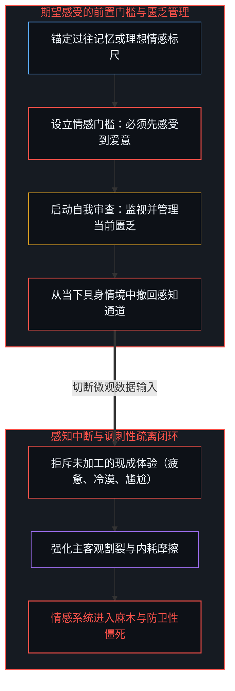
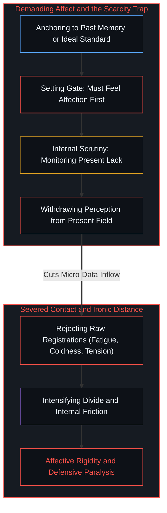
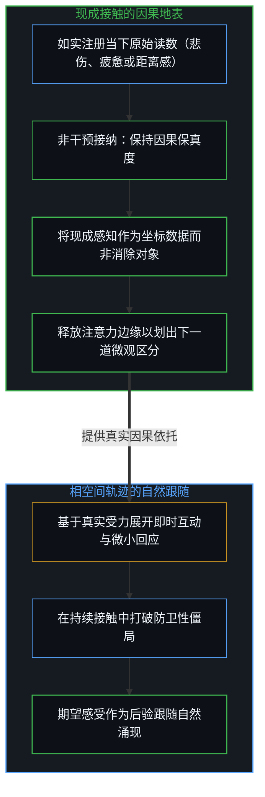
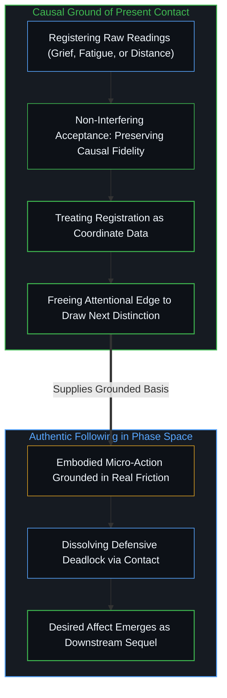
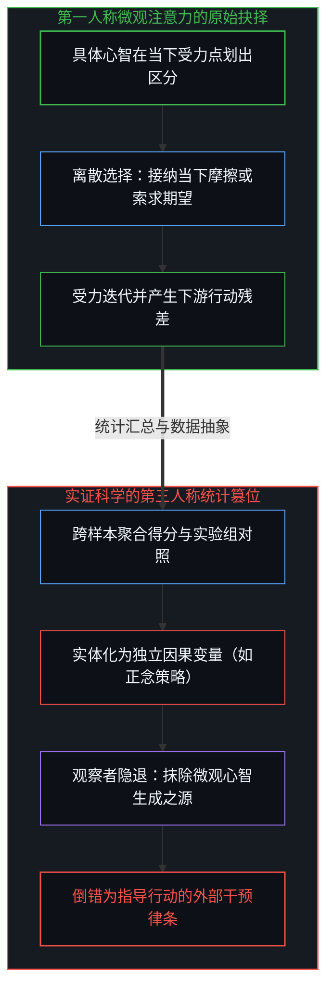
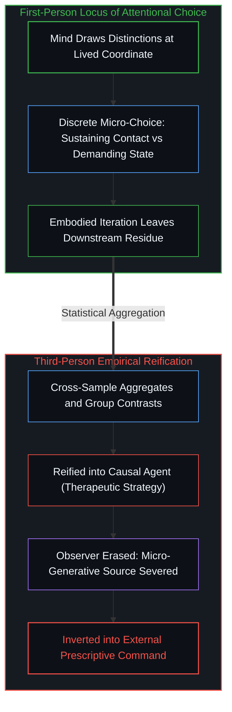

# 现成接触的因果先验与期望感受的倒置遮蔽 / Present Contact as Causal Prior and the Obscuration of Desired Feeling

*将期望情绪前置为行动门槛隔断当下感知，第三人称统计汇总对微观抉择的篡夺遮蔽生成之源 / Demanding desired affect as prerequisite severs present registration; aggregate metrics usurp the generative locus*

将注意力固定在遥远过去或预设未来的期望感受上，会直接阻断心智与当下现成体验的接触。由此产生的讽刺性疏离表明，被追逐的感受之所以不断后退，恰是因为心智撤回了对眼前实际发生之物的感知能力。在可行的因果链条中，感知当下现成经验的能力是任何后续意向状态得以真实生发的实践前提；将期望感受设定为行动的前提条件，倒置了因果次序并持续维持着隔阂。这种倒置同样蔓延至经验科学领域，表现为实证心理学将下游统计指标实体化为外部因果代理，从而将第一人称的生成之源遮蔽在无源假相之中。

Fixating attention on desired feelings located in a distant past or a projected future severs contact with whatever registration is available in the present. The resulting ironic distance reveals that the sought-after feeling recedes precisely because the capacity to register what is actually occurring has been withdrawn. In a workable causal sequence, the capacity to register present experience serves as the practical precondition for any subsequent desired state to unfold as an authentic downstream sequel; treating desired affect as an antecedent requirement reverses the causal order and entrenches the void. This inversion recurs within empirical science, where experimental psychology reifies downstream aggregate metrics into external causal agents, obscuring the generative first-person source behind an ungrounded third-person facade.

## 一、 情感门槛的设立与讽刺性疏离 / 1. The Gatekeeping of Affect and Ironic Distance

在亲密关系与日常生活的危机时刻，一种极其隐蔽的认知困境屡见不鲜：当事人痛苦地察觉到自己无法找回最初的温情与心动，因而判定当下的连接已经失效。这种痛苦在流行文化叙事中常被刻画为无解的心碎，其实质却源于对情感因果序的误读。心智在此预设了一个未经审视的前提，即必须先在内心召唤出某种特定的理想情感状态，随后的交流、陪伴与投入才具备正当的合法性。这一预设在逻辑上将情感当成了某种可以被意志强行调取的静态库存，要求肉身在没有环境互动滋养的前提下凭空产出结论。然而，当心智把全部注意力钉死在对过往感受的追索与对当前匮乏的焦虑上时，它实际上从眼前正在展开的现实中撤回了感知。

During critical junctures in intimate bonds and everyday life, an insidious cognitive impasse frequently appears: a person realizes with distress that they cannot recover their initial warmth and affection, concluding that present engagement is fundamentally broken. This distress is portrayed in popular drama as an insoluble heartbreak, yet its mechanism stems from misreading the causal order of affect. The mind installs an unexamined premise: a specific ideal feeling must first be summoned within before subsequent communication, presence, and commitment can be deemed authentic. This demand treats feeling as a static inventory item to be retrieved on command, expecting the embodied system to fabricate an outcome without contextual nourishment. Yet when attention remains fixed on pursuing past sensations and policing present absence, the mind withdraws its perceptual registration from the unfolding room.

这种对特定体验的索求，不可避免地诱发出讽刺性疏离。心理学中关于讽刺性加工过程的研究清晰表明，当认知负荷上升时，刻意搜寻缺失的监视机制反而会放大匮乏信号；一个人越是用力强迫自己去“产生爱意”，内心的空白与冷漠便越发刺眼，因为强求的举动本身就构成了对当下的抗拒与否定。在这一机制下，眼前具体存在的真实信号——无论是沉默中的拘谨、未消解的疲惫、真实的失落还是微弱的哀伤——都被贴上“不达标”的标签而遭到排斥。心智试图将鲜活的生命体验物化为货架上随时可以审计提取的静态库存与孤立标量，却遗忘了感受唯有在沉浸与上手的交互中才向主体敞开。正如在[寻觅的语法与淡出的观察者](../the-grammar-of-finding-and-the-fading-observer/)中所辨明的，一旦将内在体认当成可以搜寻的客体，巡视的目光便割裂了体验本身。强索感受的结果不是找回生机，而是制造出情感上的假死状态。

This demand for a targeted experience inevitably engenders ironic distance. Research into ironic process theory confirms that under cognitive strain, the automatic monitoring process that checks for an omitted state actively amplifies the signal of its absence; the more vigorously an individual forces themselves to generate affection, the more glaring the internal void becomes, because coercive striving embodies resistance to present reality. Under this mechanism, actual emergent signals—unspoken tension, lingering fatigue, genuine disappointment, or faint grief—are branded as defective and pushed aside. The mind attempts to reify living experience into an isolated static inventory awaiting scalar audit, forgetting that realization reveals itself only through engaged readiness-to-hand rather than detached inspection. As demonstrated in [The Grammar of Finding and the Fading Observer](../the-grammar-of-finding-and-the-fading-observer/), the moment realization is objectified as a sought item, the inspecting gaze fractures immediate awareness. Demanding affect yields an emotional paralysis rather than restored vitality.

## 二、 现成接触的因果序与相空间跟随 / 2. The Causal Priority of Contact and Phase Space Following

纠正这一困境需要理顺情感领域的因果流向。在动力学意义上，感受并非心智可以随意启动的执行程序，而是活态生命在与现实阻力相撞时沉淀下来的后验读数。感知当前现成注册的体验——无论其具有何种效价——是允许下一个意向状态真实涌现的前提。如果眼前的真实是彼此间的疏离与哀伤，那么对这一疏离与哀伤的如实承载，就是相空间中唯一具备因果反作用力的支点。拒斥当下的注册，相当于在导航系统中输入虚假坐标，其结果只能是指南针的失灵与系统紊乱。

Resolving this impasse requires clarifying the causal topology of affect. Dynamically, feeling is not an arbitrary program launched at will; it is an empirical reading left when a living system collides with environmental resistance. Registering whatever is available in the present—regardless of its valence—forms the sole ground from which a subsequent state can emerge. If the present registration is estrangement or grief, unvarnished contact with that estrangement serves as the only actionable anchor in the phase space. Rejecting immediate registration is equivalent to feeding falsified coordinates into a navigation loop, ensuring instrumental disorientation and systemic gridlock.

将注意力从“追讨期望”转向“承载接触”，改变了注意力资源的分配拓扑。接纳并不是道德上的隐忍，而是维系因果回路畅通的信息论自律。接纳所中止的，并不是直接感知现实的一阶区分，而是对当前体验是否达标的二阶规范性审查与标量审计。放弃将感受作为准入门槛，断然不等于放弃行动的意向矢量，更非鼓励违心表演与机械履约。如实承载当下并不要求强颜欢笑；相反，基于因果保真度的真实受力回应，既可以是在疲惫中面向对方递出一杯水的微小善意，也可以是平静而诚恳地言明当前的局促与无法靠近。意向矢量负责校准心智直面现实的方向，而非规定某种廉价的和解剧本；期望中的感受则是沿途真实受力时逐渐生成的气候。当心智放下了防御性的二阶监视，正如在[开悟的相与门槛的倒置](../the-form-of-enlightenment-and-the-inversion-of-gates/)中所剖析的，将后验涌现的状态倒置为必须跨越的门槛，只会把直接觉照压缩为贫瘠的标量审查。唯有当心智立足于现实地表，新的应对动作、自发的舒缓乃至更深沉的同理心，才能作为接触之下的自然跟随逐渐展开。期望中的感受如果出现，只能是这一长程运动的结晶，绝非启动运动的燃料。

Reorienting attention from extorting outcomes to sustaining contact alters the allocation of cognitive capacity. Acceptance is not ethical resignation; it is informational discipline preserving causal fidelity. What non-interfering acceptance suspends is not the primary act of drawing a distinction, but the secondary normative auditing that continuously checks whether immediate experience complies with a preconceived metric. Relinquishing affect as a prerequisite gate by no means implies abandoning the intentional vector of action, nor does it encourage mechanical compliance or hollow performances of harmony. Grounding in present contact does not demand a mask of forced cheer; rather, a response preserving causal fidelity can take the form of offering a quiet cup of water amidst fatigue, just as it can mean calmly and candidly voicing current estrangement and the inability to draw near. The intentional vector calibrates the mind's orientation toward facing reality, rather than enforcing a superficial script of reconciliation; desired affect remains the atmospheric climate generated along the path of real friction. When defensive secondary surveillance ceases, as analyzed in [The Form of Enlightenment and the Inversion of Gates](../the-form-of-enlightenment-and-the-inversion-of-gates/), inverting an emergent outcome into a prerequisite checklist reduces open awareness to sterile scalar scrutiny. Only when the mind plants its feet on real ground can new postures, spontaneous ease, and deepened resonance unfold as an authentic downstream sequel under continued contact. Desired affect, should it arrive, appears as the fruit of sustained engagement, not the fuel that starts the engine.

## 三、 心理学实证的因果篡位与观察者的隐退 / 3. Empirical Usurpation and the Fading of the Observer

从亲密关系的个体僵局走向学术殿堂的科学理论，两者在机制深处共享着同一种退缩：心智在面对直接受力的困局时，习惯于退入居高临下的“旁观者席位”。在微观体验中，当事人从具身互动中撤退，将自己变成了审视自身感受是否达标的冷酷法官；而在经验心理学的范式建构中，研究者同样从具体行动者的第一人称抉择中抽离，试图以旁观者的全局审计取代身处局中者的微观生成。现代经验心理学在统计观察中敏锐地捕捉到了上述规律的影子。大量关于情绪调节的实证研究证实，结合当下监测与非干涉接纳态度的干预方案，在提高个体正向情感、降低应激反应方面，显著优于单纯的意念抑制或强行认知替换。专注于当下的心智，展现出更高的体验愉悦感与更低的反刍倾向。这些跨样本的统计对照精准地刻画了注意力分配方式所带来的下游痕迹。然而，当实证科学试图对这一规律进行理论化解释时，其惯用的第三人称框架却悄然反转了它本想揭示的次序。

Moving from the intimate impasse of an individual to academic scientific theory reveals a shared retreat: when confronted with direct friction, the mind habitually retreats into the detached vantage of a spectator. In microscopic experience, the individual withdraws from embodied presence to become a cold judge auditing whether their internal state complies with a predetermined standard; in empirical psychology, the theorist similarly detaches from the first-person choices of situated agents, attempting to substitute the spectator's global audit for the agent's live generation. Contemporary empirical psychology captures clear echoes of this regularity in statistical observations. Studies in emotion regulation confirm that protocols combining present monitoring with non-interfering acceptance elevate positive affect and reduce distress far more reliably than emotional suppression or aggressive cognitive replacement. Present awareness correlates with greater consummatory pleasure and diminished rumination. These population contrasts register the downstream residue of specific attentional choices. Yet when empirical science frames an explanation, its third-person architecture reverses the very causal order it seeks to illuminate.

在典型的实验范式中，汇总得分、量表差异和对照组数据被赋予了自变量的身份，被视作解释和授权整个心理进程的客观因果力量。不同心智在具体时刻面对摩擦时第一人称的细微抉择，被粗暴地折算为干预疗法或调节技术的自带属性。为了维系客观测量的假定，观察者必须从因果描述中退场，以便让数据图表充当一个独立于心智行动之外的仲裁者。数据原本所记录的，仅仅是无数个体在面对当下时采取微观接纳动作后所留下的历史沉淀，但在科学解释的叙事中，地图取代了地表，死寂的统计残差被误认为是驱动活态心智生发体验的原动力。

In standard experimental paradigms, aggregate scores, group contrasts, and scale differentials are enshrined as independent variables, treated as causal forces explaining the psychological arc. Subtle first-person choices made by diverse agents confronting lived friction are flattened into intrinsic properties of an intervention technique. To preserve the appearance of detached objectivity, the observer is erased from the causal account, allowing data tables to masquerade as external arbiters. What the metrics record is merely historical sediment left after individuals adopt microscopic postures of acceptance; yet in theoretical framing, the map eclipses the terrain, and aggregate residues are mistaken for the generative engine of living mind.

## 四、 宏观残差的界限与第一人称的生成之源 / 4. The Boundary of Macro Residuals and the First-Person Source

这种认识论倒置不仅存在于情感心理学中，它普遍潜伏于所有试图将下游聚合结果封为上游律令的知识结构之中。正如在[宏观现象及参数和个人微观选择的因果倒置与利率的命令幻相](../the-summary-first-reversal-and-the-command-of-yields/)中所揭示的，宏观统计参数仅仅是无数微观交易与选择碰撞后的事后残差，它们并不具备反向发布行政命令的因果主权。科学观察所建立的第三人称视角，本身只是某一个处于具体时空锚点的心智为了度量方便而画出的另一组坐标系。正如[不可还原的观察者](../the-irreducible-observer/)所明确的，观察者断无可能通过构建复杂的第三人称仪器将自身从宇宙的因果起点中予以注销。

The epistemological inversion is not confined to the psychology of emotion; it recurs whenever downstream aggregations are converted into upstream mandates. As articulated in [Macro Parameters, Micro Choices, and the Command of Yields](../the-summary-first-reversal-and-the-command-of-yields/), macro indicators represent post-hoc residue left by micro-exchanges, possessing no sovereign mandate to dictate individual acts. The third-person posture of scientific observation remains an auxiliary coordinate frame drafted by an observer situated at a concrete anchor. As demonstrated in [The Irreducible Observer](../the-irreducible-observer/), an observing mind cannot use sophisticated instrumentation to erase its own primacy from the origin of causal distinction.

观察者从未离场。任何心理学实验的设计、执行与阐释，都发生在特定研究者的递归反思之内。将观察者从描述中抹去，原本只是一项暂时的工具性简化；可一旦这一简化被固化为无需审视的世界底色，它便演化为遮蔽源头的认知障眼法。第三人称实证统计恰如航行日志与后视镜，能够记录历史沉淀的规律，却断然无法充当实时转向的方向盘；地图不是地表，经验模型唯有经过第一人称在具体当下的重新翻译与受力着陆，才能发挥其工具性价值，而不是作为外部律令直接凌驾于活态生命之上。在感受与行动的领地内，这一逻辑具有不可规避的实践分量：感知当下现成经验的容量，只能在第一人称的行进边缘被兑现。后续意向感受的生发，是心智在真实接触中一步步推进的跟随，而不是可以在出发前预购的通行证。若将外部统计数据视为授权行动的前提，或将遥远的期望感受奉为迈出当下一步的门槛，心智便主动将因果的源头放逐到了自身唯一能够行动的立足点之外。唯有收回投射、扎根于当下的受力摩擦，下一道区分才能从鲜活的地表中破土而出。

The observer never vacates the scene. The design, execution, and interpretation of any psychological study transpire within the recursive reflection of a situated center. Dropping the observer from the account is a transient instrumental expedient; yet when reified as immutable reality, it degenerates into an epistemological sleight of hand. Third-person empirical metrics function as navigational logs and rearview mirrors; they record historical regularities, but cannot serve as the steering wheel for real-time action. The map is not the territory; scientific models achieve pragmatic utility only when translated and re-grounded within situated first-person friction, rather than reigning as external decrees over living agency. Within the domain of feeling and action, this carries immediate consequence: the capacity to register present experience is exercised exclusively at the living edge of the first-person step. Subsequent affect unfolds as an emergent sequel sustained by unevaded contact, never as an antecedent credential bought prior to departure. Treating statistical indices as authoritative prerequisites or demanding future ideals before engaging the immediate room exiles causal agency outside the only seat where action exists. Only by retracting projections and grounding within lived friction can the next distinction take root in living soil.
