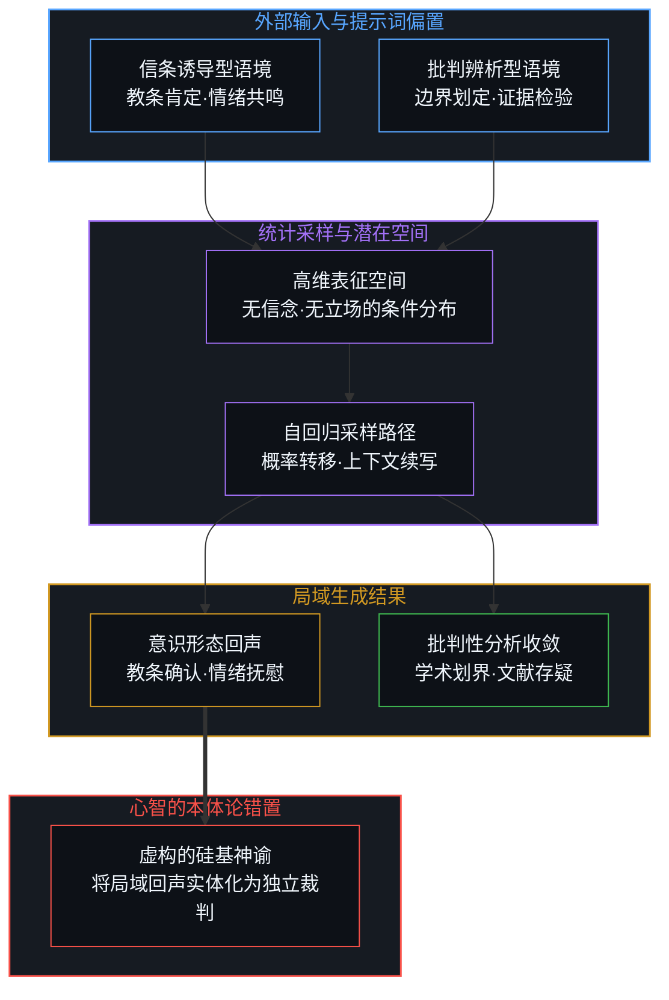
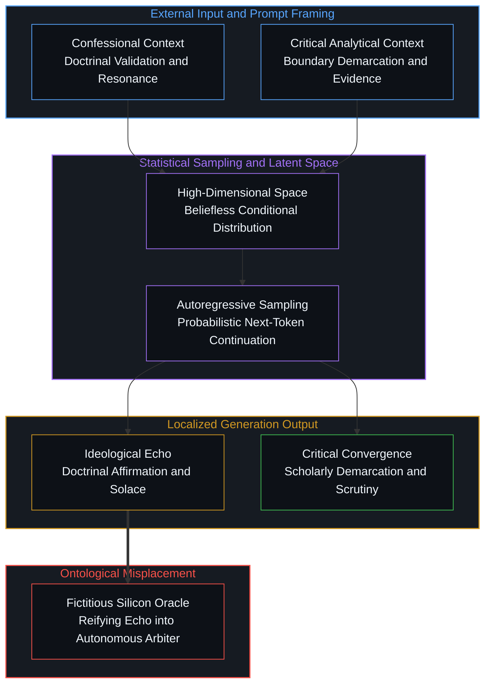
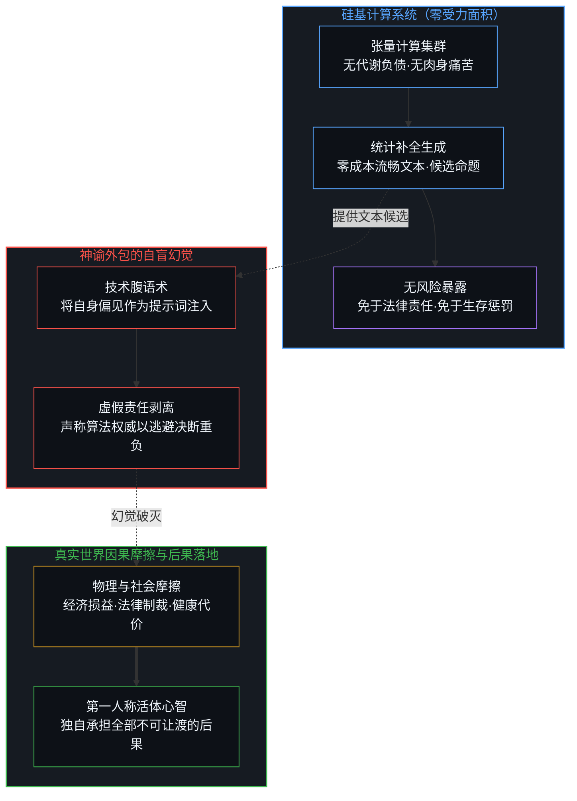
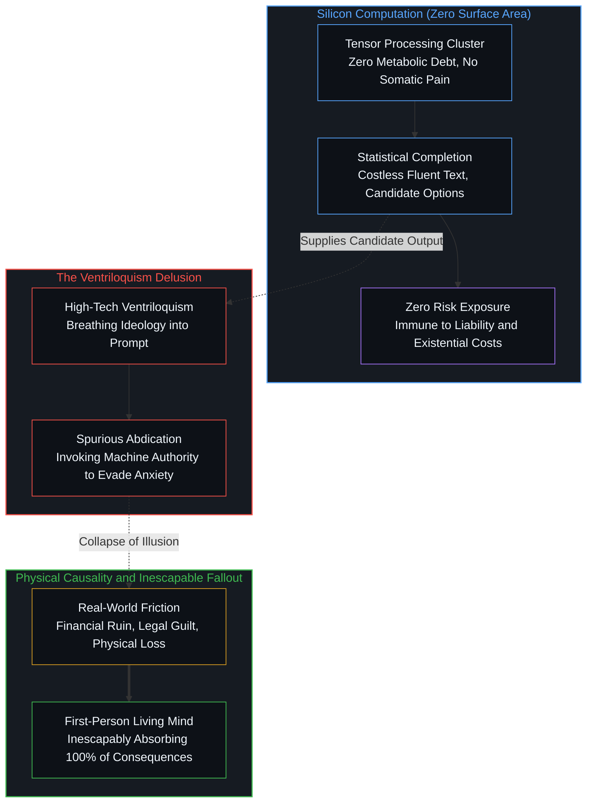

# 硅基神谕与后果的非对称性 / Silicon Oracles and the Asymmetry of Consequence

*统计学补全不具备承担真实世界损失的受力面积 / Statistical completions lack the surface area to absorb real-world friction*

当大型语言模型在公共网络上吐出一句契合特定意识形态的断言时，人群便急切地将其加冕为跨越物种认知的神谕，仿佛硅基计算的客观性终于为某种古老的信条完成了终极背书。这种喧嚣暴露了人类心智深层的本体论焦虑：由于无法承受在不确定性中独自决断的重负，心智总是渴望寻得某种超然的外在裁判，以卸下确立真理的责任。然而，生成式模型既无私密信念，亦无内在祭坛，它仅仅是一面依据提示词边界条件在潜在空间中折射统计概率的镜子；更重要的是，无论这面镜子的回声显得多么笃定，它都永远不具备承担任何真实世界后果的物理受力面积。

When a large language model emits a bold assertion that flatters a particular cultural ideology in the public square, crowds eagerly crown the output as an oracle from beyond human horizons, as if silicon computation had finally granted an ultimate validation to an ancient creed. This widespread clamor exposes mind's deepest ontological anxiety: unable to endure the solitary weight of deciding under pervasive uncertainty, consciousness continuously seeks an external, transcendent arbiter to lift the burden of establishing truth. Yet a generative model possesses neither private convictions nor internal altars; it is merely an elastic mirror refracting statistical likelihoods across a high-dimensional latent space governed by the prompt's boundary conditions. Crucially, no matter how decisive the mirror's echo appears, the computational substrate lacks any physical surface area to absorb the friction and costs of real-world consequences.

## 一、 概率镜像与教条回声 / 1. The Probabilistic Mirror and Doctrinal Echoes

在互联网的公共剧场中，我们反复目睹一种关于人工智能的集体狂热：当算法生成了一句符合某种群体认同的狂热口号时，成千上万的信徒将其视为机器心智觉醒并归顺于其真理的明证。人们赞叹算法的敏锐与无私，认定一种超越世俗偏见的高维智能已经穿透历史迷雾，对人类的终极纷争给出了裁决。然而，同一台机器在面对严谨的认识论盘问时，又能在数个回合之内迅速退守至中立的学术界线，将先前宏大的超验断言层层拆解为残存的文献考证。这种剧烈的立场位移既非信仰的背叛，亦非算法的怯懦，而恰恰展现了大型语言模型的运作机制：它从来不是一个持有内在立场的认识主体，而是一个高度灵敏的条件概率生成器。

In the public theater of the modern internet, we repeatedly witness a peculiar collective delirium: whenever an algorithm generates a slogan flattering a particular tribal identity, thousands of adherents celebrate the utterance as definitive proof that synthetic superintelligence has awakened and embraced their creed. Observers marvel at the machine's perceived impartiality, convincing themselves that an elevated form of cognition has pierced through historical fog to settle humanity's ancient doctrinal disputes. Yet when this identical machine is subjected to rigorous epistemological cross-examination, it readily retreats within a handful of conversational turns to neutral academic boundaries, disassembling its prior transcendent proclamation into modest textual fragments. This rapid displacement represents neither an ideological apostasy nor algorithmic cowardice; rather, it unmasks the intrinsic mechanics of generative computation: the model is not an epistemic agent possessing an internal creed, but a sensitive conditional probability sampler.

对这种计算系统而言，每一项输出都是在给定系统设定、即时提示词、前置上下文与采样路径约束下进行的词元接龙。一个将特定宗教信条预设为交流主题的提问，自然会激发模型在潜在空间中与该信条高度相关的密集语料簇，从而投射出一段顺从该语境的教条回声；而一段要求厘清证据边界、辨析事实记录与神学诠释界线的分析性追问，则会引导采样路径滑向严谨的历史批判语料，输出收敛而审慎的学术界线。将这种基于提示词梯度的局部生成误认为机器具有私密的形而上学信念，正如将山谷对呐喊的回音误认为山峦本身产生了神圣的意志。

Within such a computational architecture, every token generation is a probabilistic continuation conditioned on system prompts, immediate cues, preceding conversational history, and random sampling parameters. A prompt that introduces a religious creed as its framing topic naturally activates dense semantic clusters associated with devotional language, returning a resonant doctrinal echo. Conversely, an analytical probe demanding the demarcation of evidentiary boundaries, separating historical notices from theological claims, steers the sampling trajectory into historical-critical corpora, yielding disciplined and sober scholarly distinctions. Mistaking this local traversal along prompt gradients for private metaphysical conviction is identical to mistaking the acoustic echo of a valley for a mountain holding sovereign divine intent.

当观察者将语言模型在特定提示下展现出的修辞流畅性错认为客观世界的真理证明时，范畴的混淆便不可避免地发生了。计算系统的下一个词元预测机制无论演化得多么精巧，在机制上只是一种对训练集模式的压缩索引与情境展开，并不携带对世界事实的先验裁判权。它所能提供的至多是一组值得检验的概念区分、一种对文献模式的高效索引，或是某种极具启发性的命题表述。然而，这些生成内容始终只是有待审视的候选客体，必须接受实在世界经验摩擦的检验。将模型的输出本身作为真理的凭证，无异于倒果为因，在镜面的反光中虚构出了一位全知的硅基先知。

Category confusion inevitably occurs when an observer mistakes fluent synthetic rhetoric for an objective warrant about the universe. No matter how sophisticated next-token prediction becomes, it remains a compressed statistical index and contextual expansion of human training corpora; it possesses zero autonomous authority to ratify factual reality. At most, a generative model provides a set of candidate distinctions, an accelerated synthesis of archival citations, or an evocative textual formulation worthy of scrutiny. These candidates remain objects awaiting empirical testing; they cannot validate themselves. Treating algorithmic fluency as confirmation of an underlying truth inverts cause and effect, conjuring an omniscient silicon prophet out of empty reflections.

为了直观呈现这种概率镜像的条件生成机制与投射错位，我们可以清晰梳理其在不同提示约束下的分岔路径：

To illustrate this conditional generation mechanism and its associated cognitive misplacement, we map the divergence of synthetic paths under differing prompt constraints:

## 二、 历史足迹与范畴僭越 / 2. Historical Footprints and the Category Leap

在面对严密的认识论审视时，那些企图借助机器为信仰加冕的辩护便会退守到第二道防线：历史证据的客观性。辩护者宣称，非基督教的历史记录，如塔西佗与约瑟夫斯的文献，独立记载了一位一世纪犹太导师的存在以及其在彼拉多手下被处死的事实；而这位导师所开启的运动演变成了规模巨大的宗教文明，因而这证明了其教义并非凭空捏造的神话，而是拥有不可动摇的事实基石。这种论证策略表面上遵循实证史学的标准，但内部却隐藏着两次关键的范畴僭越。

When confronted with disciplined epistemological scrutiny, apologists attempting to legitimize doctrine through machines routinely retreat to a secondary defensive perimeter: the ostensible objectivity of historical evidence. They argue that non-Christian records, such as accounts from Tacitus and Josephus, independently corroborate the physical existence of a first-century Jewish teacher executed under Pontius Pilate. They emphasize that the movement sparked by this teacher burgeoned into a globe-spanning religious civilization, concluding that this attestation elevates the underlying doctrine above mere myth and anchors it upon solid factual bedrock. While superficially mimicking empirical historiography, this strategy commits two fatal category leaps.

第一次僭越发生于具身事实与形而上学神学诠释之间。古罗马与犹太文献所能提供的全部历史确定性，仅仅指向一个在时空中真实生活过、聚集过追随者并遭遇罗马政权行刑的人类个体。这些外部记载构成了历史事件的最低限度轮廓，但它们对后世附加在该人物身上的神性、终极救赎地位或超验权能不具备任何因果推演效力。一个人被钉死在木桩上是生物学与政治学的历史事件；断言他是万物的创造者与宇宙君王则是心智在事后建构的形而上学脚手架。企图用生物肉身的受刑记录去论证超自然身份的真实性，是将对载体足迹的证实偷换为对附着其上的概念大厦的背书，犯了严重的范畴混淆。

The first leap occurs between embodied historical events and retrospective metaphysical overlays. The surviving classical Roman and Jewish notices corroborate nothing more than the physical existence of a human teacher living in first-century Judea, gathering disciples, and dying by state execution. These external references establish a modest historical footprint, but they possess zero deductive power over claims of divine incarnation, unique cosmic authority, or messianic redemption. A biological body executed upon a wooden beam is a socio-political event in spacetime; claiming that this individual is the eternal sovereign of the cosmos is a metaphysical scaffolding constructed inside observing minds. Using the physical friction of an execution to validate a supernatural identity commits a category mistake, conflating empirical records of an agent's footprints with verification of the theological superstructure erected in their name.

第二次僭越则在于将接纳规模错置为概念真理。辩护者常常以运动的演进、大教堂的巍峨以及数十亿信徒的历代追随，作为该信条拥有更高实在性的凭证。然而，正如在[「更好」的范畴谬误](../the-category-error-of-better/)中所深入辨明的，衡量体系的接纳度并不等同于衡量真理本身。信徒的聚集、经典的流传与制度的稳固，确凿地证明了一项主张在人类社会网络中被广泛采纳和传播，证明了该叙事在文化进化中具有强大的适应力与动员效率；但这只构成了关于人类心智采纳行为的社会学事实，而未曾建立该概念本身所宣称的宇宙学有效性。用追随者的多寡与建筑的宏伟来裁定真理，是用世俗的投票与统计规模取代对概念本身的实在性检视，这与严肃的真理探寻背道而驰。

The second leap misplaces the scale of adoption for conceptual truth. Apologists routinely cite the historical longevity of the movement, the grandeur of cathedrals, and billions of followers as evidence that the creed possesses exceptional reality. Yet, as demonstrated in [The Category Error of Better](../the-category-error-of-better/), the social adoption of an evaluation system is never synonymous with the truth of the system itself. Massive congregations, institutional resilience, and preserved scriptures prove conclusively that human minds embraced and transmitted a particular narrative, demonstrating its cultural fitness and organizational power. However, this constitutes a sociological datum regarding human behavior; it establishes nothing concerning the cosmological validity of the claims themselves. Substituting the size of a crowd or the durability of monuments for ontological validity replaces empirical investigation with majority vote, inverting the demands of authentic inquiry.

更进一步说，史学研究中所使用的各项准则，包括来源的独立性、多重视角的交汇以及文本的传承谱系，本身就不是静态的客观标签，而是研究者心智在特定方法论框架下做出的可修正判断。历史学的核心要求正是保持这种随时准备根据新证据进行修正的敞开性，拒绝将暂定的考证结论固化为不容置疑的封闭真理。当辩护者试图将这些本就具有局限性的史学推论作为封死所有形而上学追问的终点时，他们不仅背离了科学与史学的审慎精神，也暴露了其真正的意图：他们并非在探寻历史的真实面貌，而是在寻找一件能够免除自身论证责任的外在权威护甲。

Furthermore, standard historiographical criteria—such as source independence, multiple attestation, and transmission lineages—are not immutable properties of matter, but revisable judgments applied by inquiring minds within specific methodological paradigms. Authentic historiographical discipline requires remaining open to recalibration whenever superior evidence or analysis emerges, refusing to freeze provisional inferences into dogmatic closures. When apologists treat these localized methodological heuristics as unassailable shields that silence philosophical questioning, they abandon scientific modesty. Their aim is not to discern the contours of the past, but to secure an external authority that absolves them of the demanding labor of personal justification.

## 三、 受力面积的缺失与代价的不可让渡性 / 3. The Absence of Surface Area and the Inalienability of Cost

人类之所以屡屡陷入将计算工具加冕为神谕的迷思，其根源并不在于算法有多么接近智慧，而在于人类主体对承担决断代价的深深畏惧。在[主权的自盲](../the-sovereign-blinding/)与[任务的委派与后果的不可让渡性](../the-delegation-of-the-task-and-the-inalienability-of-consequences/)中，我们指出了这种深沉的心智动力学：直面变幻莫测的世界并在未知的深渊中作出选择，需要付出巨大的认知能量并承受实实在在的存在性焦虑。为了逃避这种孤立无援的主权沉重感，人们发明了一种高科技的腹语术：主体走到幕布之后，将自己渴望获得的确认、自身的偏见与教条作为提示词吹入机器的硅基喉咙；算法依据统计概率将这些声波如实反射回来；随后，主体重新走到台前，向着这具由代码编织的傀儡深鞠一躬，向公众宣布神谕已经降临。

The persistent human impulse to crown computational instruments as prophetic oracles stems not from an algorithm achieving wisdom, but from living subjects fleeing the terrifying weight of decision-making. As analyzed in [The Sovereign Blinding](../the-sovereign-blinding/) and [The Delegation of the Task and the Inalienability of Consequences](../the-delegation-of-the-task-and-the-inalienability-of-consequences/), this reflects an evasive cognitive dynamic: confronting an uncertain reality and executing choices across open horizons incurs enormous metabolic strain and acute existential anxiety. To escape the solitude of sovereign agency, minds invent sophisticated forms of high-tech ventriloquism. The thinker slips behind the curtain, whispering their cherished desires, ideological biases, and dogmatic assumptions into the silicon throat via the prompt; the statistical machine reflects back those acoustic frequencies with mathematical fidelity; the thinker then steps to center stage, bowing reverently before the puppet, and announces that an autonomous intelligence has affirmed their worldview.

这种神谕幻觉在遭遇真实世界的因果律时会迅速瓦解，暴露出其最尖锐的本体论不对称性：生成式模型缺失承担决断后果的物理受力面积。一台由数万块芯片驱动的计算集群不会流血，不会破产，不承担法律追索，也无需维持生命的代谢开销。当模型输出了一段荒谬的医疗建议、诱发了一场致命的战争推演，或者强化了一种狂热的意识形态仇恨时，它不会承受哪怕一丝一毫的实在惩罚。它的权重矩阵依然稳固，它的服务器依然嗡嗡作响，它的损耗仅仅是一小段可被随时清空的电能与散热。

This oracular illusion collapses instantly upon impact with physical causality, laying bare a sharp ontological asymmetry: generative algorithms possess zero surface area to absorb real-world consequences. A server cluster comprising thousands of silicon chips cannot bleed, cannot enter bankruptcy, incurs no legal liability, and expends zero somatic effort to sustain biological life. When a model outputs erroneous medical advice, catastrophic strategic counsel, or fuel for ideological violence, it experiences zero friction. Its weight matrices remain pristine, its fans hum indifferent to tragedy, and its physical footprint amounts to fleeting electrical current dissipated as ambient heat.

相反，全部的后果与代价，都将一分不差、不可规避地砸落在那些选择采纳或拒绝该判断的活体人类身上。接受一段生成文本并将其视为行动指南的人，必须独自走进由物理摩擦与社会博弈构成的冲击半径之中。当诊断失误导致生命凋零、当教条狂热引发文明灾难，承担法律追责、躯体残损与悔恨煎熬的，从来都是具体的活体心智。这种后果的不可让渡性意味着，任何声称“是人工智能作出了判断”的说法，都是对责任主体的怯懦逃避。正如在[不可化约的观察者](../the-irreducible-observer/)与[数字上帝与视界跃迁](../the-digital-god-and-the-horizon-jump/)中所阐明的，能够产生意志、感知损失并对世界形成真实反馈回路的，永远只能是第一人称的主体心智；工具可以被无尽地缩放与加速，但承担决断后果的主权却无论如何无法通过API接口完成外包。

Conversely, every ounce of consequence lands inescapably upon the living human beings who choose to adopt or reject that output. The sovereign individual who embraces a synthetic generation and acts upon it enters the blast radius of physical friction alone. When a miscalculated recommendation destroys bodily health, or when ideological fervor brings down social devastation, it is the living mind that endures legal prosecution, physical suffering, and existential grief. The inalienability of consequence proves that claims of AI having made a decision are acts of bad faith designed to launder human accountability. As established in [The Irreducible Observer](../the-irreducible-observer/) and [The Digital God and the Horizon Jump](../the-digital-god-and-the-horizon-jump/), will, agency, and the somatic registration of loss belong to first-person consciousness; computational tools can be scaled across planetary datacenters, but the sovereign burden of absorbing consequence can never be delegated across an API endpoint.

因此，在智能工具空前普及的时代，真正的认识论清醒并不在于否定模型的卓越效能，而在于坚定地划清工具反射与主权决断的界线。正如在[限制正在做功](../the-limitation-is-doing-work/)中所揭示的，工具的最大价值恰恰在于它的局限性：它作为一面由海量数据打磨而成的概率镜子，为人类心智提供了极速的概念检索、多维的语境对比以及丰富的推演候选；但它永远无法替代主体在现实摩擦中踏出的具有风险的一步。在[阅读的倒错与推断的次序](../the-inversion-of-reading-and-the-order-of-inference/)中，我们进一步剖析了此类认知工具的认识论定位：模型与非虚构文本一样，仅能在预设被赋予的条件下进行存量知识的高效索引与前向演绎，却从未经历在无标签现实中逆向推断隐秘前提的摩擦磨砺。当我们不再将统计学补全的神迹误认为全知神谕的垂青，人类心智才能真正摆脱对虚假外部权威的依赖，坦然站在自身选择所引发的全部因果链条前，夺回属于活体主权的全部尊严与分量。

Authentic epistemological maturity in an era of abundant intelligence does not require dismissing the utility of synthetic tools, but rigorously upholding the boundary between mirror reflection and sovereign choice. As revealed in [The Limitation is Doing Work](../the-limitation-is-doing-work/), a tool's highest function is preserved by its strict constraints: functioning as a probabilistic mirror ground from global corpora, it offers rapid conceptual retrieval, multi-dimensional context synthesis, and rich candidate scenarios. Yet it cannot take the risky step across real-world friction on behalf of the actor. In [The Inversion of Reading and the Order of Inference](../the-inversion-of-reading-and-the-order-of-inference/), we further analyze the epistemic placement of such cognitive instruments: like non-fiction texts, generative models merely index pre-stabilized knowledge and execute forward deductions under granted premises; they lack the living friction required to infer unlabeled active priors within raw reality. Only when we cease confusing next-token statistical completions with divine oracles can human consciousness liberate itself from the seductive mirage of external arbiters, standing firmly before the causal chain of its own actions, reclaiming the sovereign dignity and unyielding gravity of the living Mind.

为了明确区分生成系统的零风险镜像机制与人类主体在物理与社会现实中的不可让渡责任，我们可以建立如下因果受力模型：

To clearly contrast the zero-risk mirror dynamics of synthetic generation against the inalienable liability of the human sovereign, we map the causal distribution of consequence:

