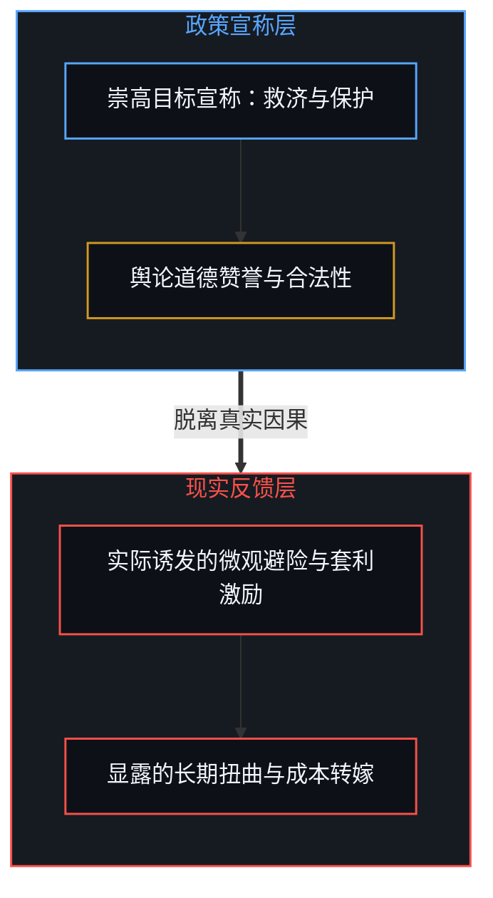
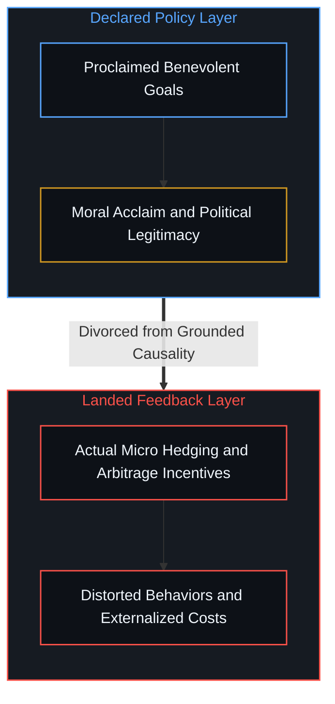
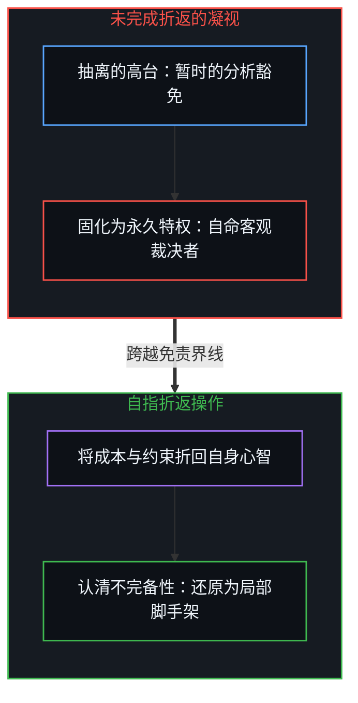
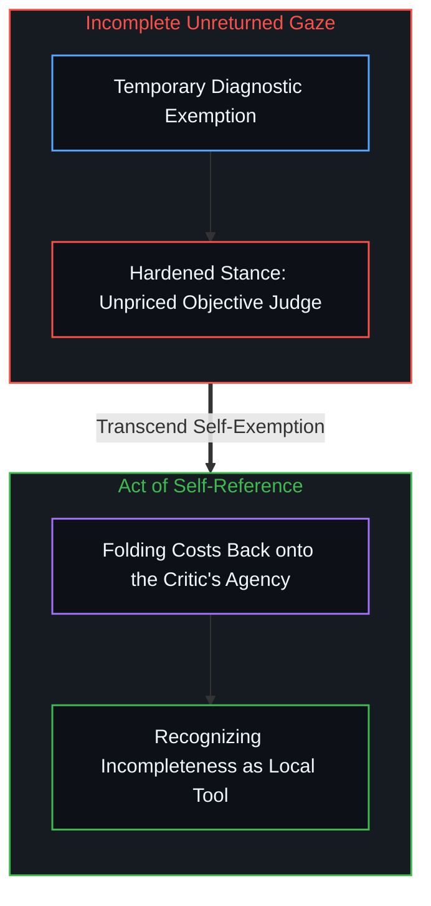

# 索维尔的表象洞察与根因之偏 / Sowell Observed the Surface Problem

*问题无法跨越心智被统筹解决，个体始终独自承担全部后果。 / Problems cannot be solved across minds; individuals bear the full consequences of their actions.*

托马斯·索维尔指出，评估经济政策应当依据其实际激发的激励，而非宣称的目标。这一洞察在表象层面上极为精准，但真正的因果错配并非始于政策的细节设计，而是始于一个更深层的隐秘信念：即认为问题可以跨越心智被统筹解决。任何试图通过优化外部激励来纠正他人的制度设计，都在重新初始化一个置身事外的旁观者席位。事实上不存在任何系统性的统筹解法，个体始终在独自承担降临到自身之上的全部后果，而唯一的解脱在于自身心智对自身决策后果的如实确认。

Thomas Sowell observed that economic policies must be judged by the incentives they create rather than the goals they proclaim. While accurate on the surface, the confusion does not originate in policy design, but in a deeper foundational premise: the belief that problems can be solved across Minds. Any systematic corrective aimed at engineering better incentives reinitiates the very exterior vantage point it purports to diagnose. There is no systemic resolution; individuals always bear the full consequences happening to them, and authentic sovereignty requires only this Mind accepting responsibility for its own trajectory.

## 一、 宣称目标与激励扭曲 / 1. Proclaimed Goals and Distorted Incentives

托马斯·索维尔曾写道：“许多困惑源于根据经济政策所宣称的目标而非其实际创造的激励来进行评判。”这一观察就其所及的范围而言是成立的。在公共政策与社会工程的实践中，方案常常因其美好的初衷而获得道德赞誉，而这些方案在真实世界中所激发的扭曲行为与隐性成本，却被系统性地置于视线之外。

Thomas Sowell famously wrote: "Much confusion comes from judging economic policies by the goals they proclaim rather than the incentives they create." The observation is accurate as far as it reaches. Policies are routinely evaluated by the benevolent intentions stated on their behalf, while the perverse incentives they actually set in motion remain secondary or entirely invisible.

然而，对激励结构的敏锐捕捉并未触及更深的源头。指出目标与激励的背离，仅仅是描述了一场已经发生的偏离，却未曾追问为什么人们会持续期待通过政策来替代微观个体的判断。困惑并不是由某项具体政策的漏洞引起的，而是根植于一种将心智彼此替代的执念。

Yet capturing incentive distortions does not reach the primary root. Pointing out the divergence between declared goals and actual incentives merely describes an already landed discrepancy, without asking why societies continually expect top-down policies to substitute for microscopic judgment. The confusion does not originate in specific legislative loopholes, but in the persistent belief that one mind can stand in for another.

## 二、 跨越心智解决问题的虚妄前提 / 2. The Fallacy of Solving Problems Across Minds

真正的因果错位源于一个前置信念：即坚信问题可以跨越心智被解决，认为某一个心智能够替其他心智解决生存问题，或者自身的问题可以被他人的顶层设计所消解。这种信念在认知中植入了一道虚假的界线，使得决策者自以为能够将做决定的行动与承受后果的物理事实分离开来。

That deeper confusion begins with a foundational belief: that problems can be solved across Minds—that one Mind can resolve the existential dilemmas of others, or have its own challenges neatly dissolved by external design. That belief installs an artificial division in perception, convincing actors that the locus of decision can be severed from the locus of consequence.

在语言层面上，决策与后果被描摹为发生在不同主体身上的两件事。但语言的修辞并不能搬动现实的负荷。降临在个体身上的震荡与损失，依然由那个具体的人用自己的肉身与资产去承受。一旦这种分离的假象在制度中确立，决策者与承受者之间的落差便显现为所谓的激励错配。激励不兼容并非问题的根源，它仅仅是这种跨心智代理妄念在制度表面泛起的涟漪。在[没有普度只有自度](../mei-you-pu-du-zhi-you-zi-du/)中，任何心智都无法替代他人的闭环；在[所有权与配得感](../ownership-and-self-worthiness/)中，唯有后果回归自身才能实现积累；在[决策与后果不可分割的先验](../the-irreducible-prior-of-decision-and-consequence/)中，二者是同一枚硬币在意识深处不可分割的两面。

In rhetoric, deciding and bearing consequences are framed as occupying separate places. Yet rhetorical descriptions do not move the physical load. What happens to the individual still lands squarely upon that specific life and balance sheet. Once this separation is codified into institutions, the divergence between who chooses and who pays registers as an incentive problem. Misalignment is therefore not the root cause; it is merely the symptom of the belief that problems are transferable commodities. In [No Universal Salvation, Only Self-Deliverance](../mei-you-pu-du-zhi-you-zi-du/), no Mind can finish another's recursion; in [Ownership and Self-Worthiness](../ownership-and-self-worthiness/), compounding occurs only when consequences re-enter as own; and in [The Irreducible Prior of Decision and Consequence](../the-irreducible-prior-of-decision-and-consequence/), the two remain indivisible faces of a single coin.

## 三、 旁观者诊断的自我豁免 / 3. Self-Exemption of the Bystander Diagnosis

任何以激励优化为起点的系统性纠偏方案，依然受困于同一种认知结构。去设计一套更精巧的激励机制，或者反复呼吁根据激励而非目标来评价政策，依然是一个自居客观的旁观心智站在决策外部所做出的裁决。这种诊断将决策的支点继续外置，使得纠偏行动本身沦为了新一轮的干预循环。

Any systematic corrective that takes incentive redesign as its primary lever remains trapped inside that identical architecture. To engineer better incentives, or to insist that policies be judged by their secondary effects, is still an act performed by an observing Mind standing aloof from the choices it seeks to improve. The diagnosis continues to externalize the locus of responsibility, causing the correction itself to initiate another cycle of intervention.

这正是知识分子立场的写照。学者以旁观者的姿态发现问题，并以旁观者的身份开出药方。然而真实的抉择与后果的承担，早已锁死在具体主体的身上。独立知识分子的诊断就其视角而言固然精辟，但这份诊断本身正是从其所批评的免责高台上传递出来的。正如[未经自我审视的批判者](../the-unexamined-critic/)所揭示的，批判者常常指责他人的言辞免受检验，却悄然将自己的观察者高台豁免于审视之外；在[没有天才能够解决知识问题](../no-genius-can-solve-the-knowledge-problem/)中，任何全知视角都是不可能实现的幻觉；而[旁观者洞察的悖论](../the-paradoxical-nature-of-bystander-insights/)表明，脱离了具身负荷的凝视注定无法描述活态的现实。

This reflects the classic vantage point of the intellectual. The theorist diagnoses as an observer and prescribes as an observer. Yet the physical deciding and bearing of cost already remain welded to the living agent. The diagnosis of the detached analyst may be acute as a spectator's report, yet it is delivered from the very exempted balcony it describes. As [The Unexamined Critic](../the-unexamined-critic/) demonstrates, the critic excoriates ungrounded verbal visions while shielding his own diagnostic perch from examination; [No Genius Can Solve the Knowledge Problem](../no-genius-can-solve-the-knowledge-problem/) shows that an all-seeing planner is impossible; and [The Paradoxical Nature of Bystander Insights](../the-paradoxical-nature-of-bystander-insights/) confirms that insights detached from lived weight fail to grasp moving reality.

## 四、 暂时的豁免与未能完成的折返 / 4. Temporary Exemption and the Missing Return

每一套自洽的理论在构建之初都必须经历这一步。为了建立清晰的区分与度量，分析心智必须暂时将自身抽离出来，置于假想的真空之中。这种带着豁免的抽离是进行认知测量的必要手段。真正的偏差不在于这暂时的抽离，而在于忘记了折返，在于未能将同样的分析尺度应用到分析行动自身之上。

Every coherent conceptual model begins this way. To draw a rigorous distinction, the analyzing Mind must temporarily exempt itself, stepping onto a hypothetical balcony. That temporary departure with exemption is indispensable for measurement. The shortfall is not the temporary stepping back; it is the failure to return—the refusal to fold that identical diagnostic scale back upon the analyzing act itself.

当回折被遗忘时，豁免便凝固成了特权，诊断的立场便被固化为无需承担代价的高台。理论由此止步于半途，掩盖了更深层的因果断裂：即划分界线的心智与其所划分出的现实后果之间的分离。唯有将这把尺子重新折回做出分析的心智自身，理论才能看清自身的局限。在[无处之境的自我画像](../self-image-speaks-as-if-from-nowhere/)中，拒绝折返的目光最终只能将自己封印在虚幻的投影之中。

When that return is omitted, exemption hardens into dogmatic privilege, freezing the diagnostic posture into an unpriced perch. The theory stops short of completing its arc, concealing the deeper causal rift: the separation between the Mind making the distinction and the registration of what that distinction generates. Only by folding the measurement scale back upon the theorist does the model disclose its own boundary. In [Self-Image Speaks as if from Nowhere](../self-image-speaks-as-if-from-nowhere/), an unreturned gaze traps itself in an ungrounded projection.

## 五、 不存在系统性解法 / 5. There Is No Systematic Solution

认识到这一边界并不意味着能够设计出更完美的方案。不存在任何系统性的统筹解法——既不存在一套没有扭曲的激励机制，也不存在一种能够迫使所有心智诚实承担后果的制度安排。任何试图在全社会推行这种安排的努力，都只是在新一层包装下重蹈跨心智治理的覆辙。

Recognizing this boundary does not yield a utopian blueprint. There is no systemic solution—no magically calibrated incentive grid, and no bureaucratic mechanism that could compel other Minds to shoulder their destinies. Any attempt to mandate such outcomes collectively merely reinitiates the hubris of solving across Minds under a fresh guise.

真正切实可行的路径，唯有这一特定心智对自己决策后果的主动确认。这种确认并不是在创造承受，个体无论是否承认，都在分秒不差地承受着发生在自身之上的所有后果。逃避与推诿仅仅是在转移视线，真实的负荷分毫未减。如实确认是对既定事实的清醒领悟，唯有如此，下一个抉择才能建立在没有伪饰的真实信号之上。[政客是责任分散的表象](../politicians-appear-as-visible-symptoms-of-responsibility-diffusion/)揭示了推诿无法转移负荷；[残差个人主义](../residual-individualism/)指明集体方案会重新引入外部化；而[知识问题与代理幻觉](../the-knowledge-problem-and-the-illusion-of-delegation/)提醒我们，任何制度形式都无法逾越知识分散的刚性边界。

What remains authentic is this specific Mind accepting responsibility for the consequences of its own decisions. Acceptance does not manufacture the bearing; individuals already carry the entire consequences landing upon them, regardless of mental consent. Evasion merely relocates perception, while the physical load remains immovable. Acceptance is registration of what is already the case, allowing the next decision to be calibrated against undistorted signals. [Politicians Appear as Visible Symptoms of Responsibility Diffusion](../politicians-appear-as-visible-symptoms-of-responsibility-diffusion/) proves that blame shifts the look rather than the load; [Residual Individualism](../residual-individualism/) warns against turning insight into collective coercion; and [The Knowledge Problem and the Illusion of Delegation](../the-knowledge-problem-and-the-illusion-of-delegation/) shows that delegation never transfers the ultimate causal ledger.
