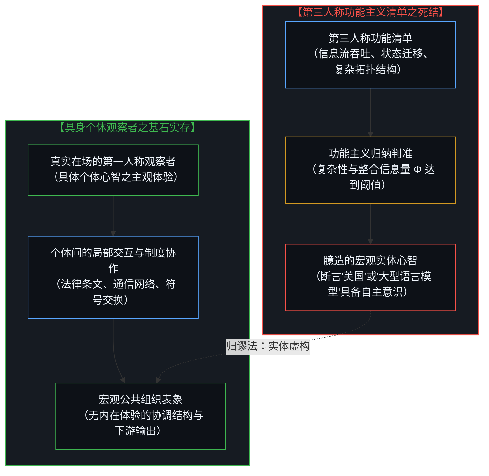
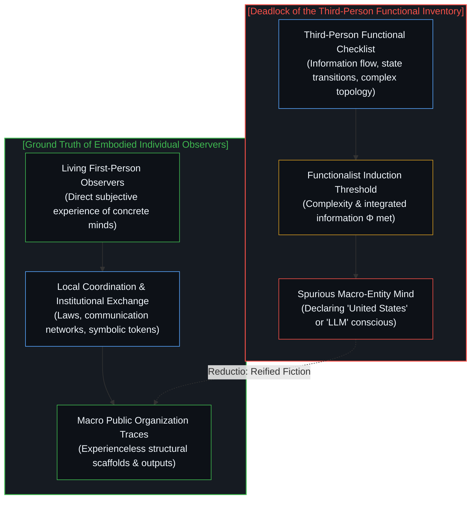
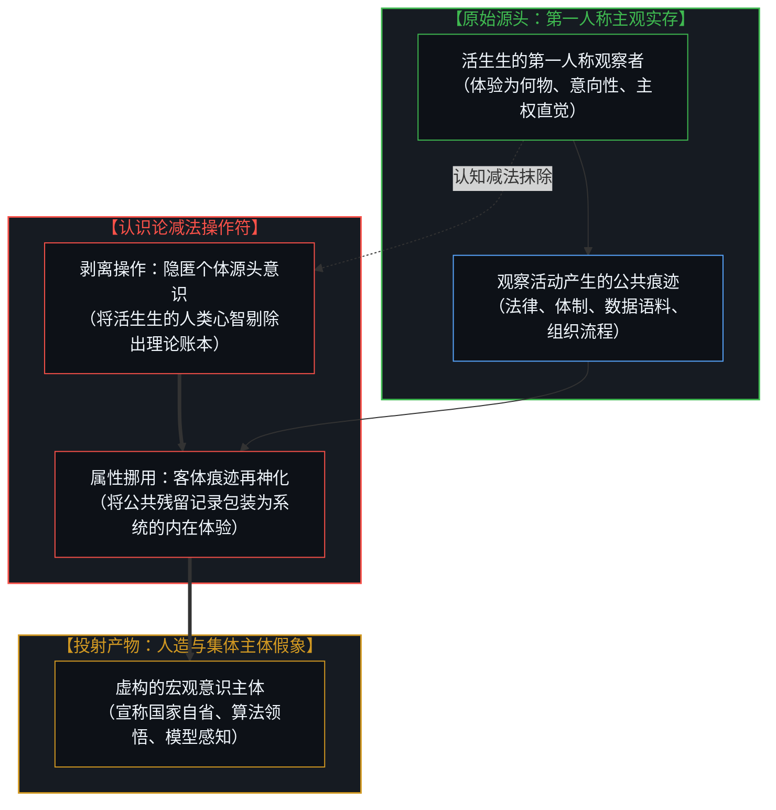
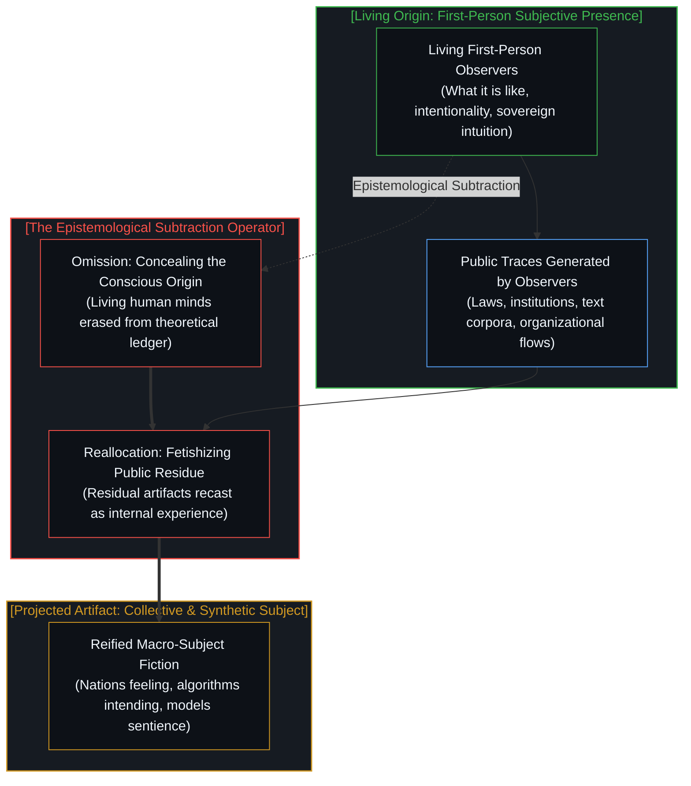
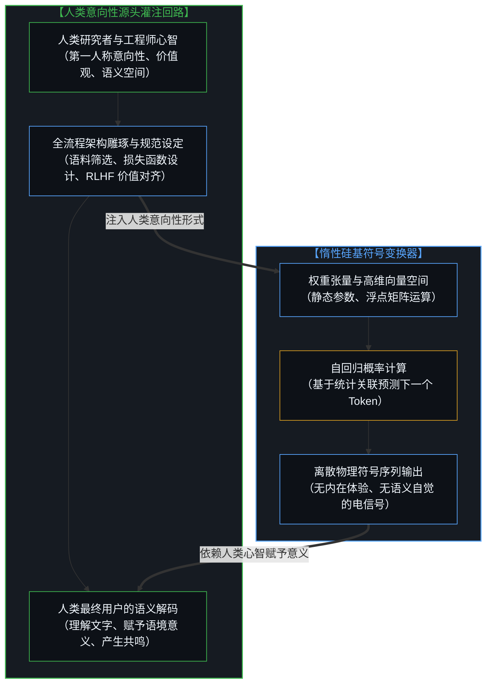
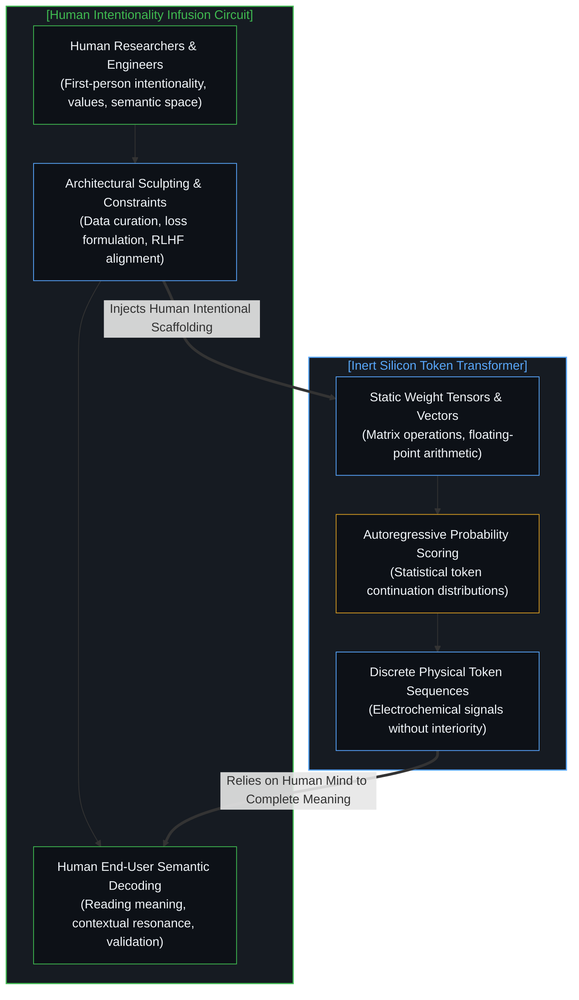
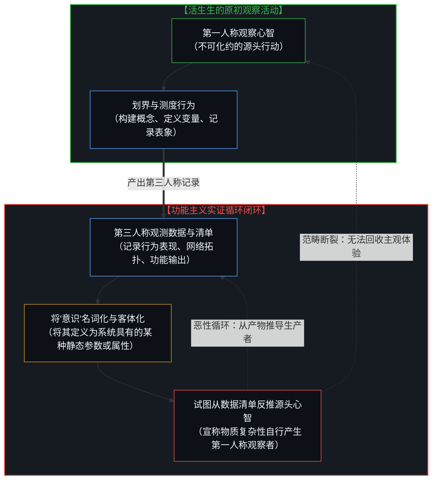
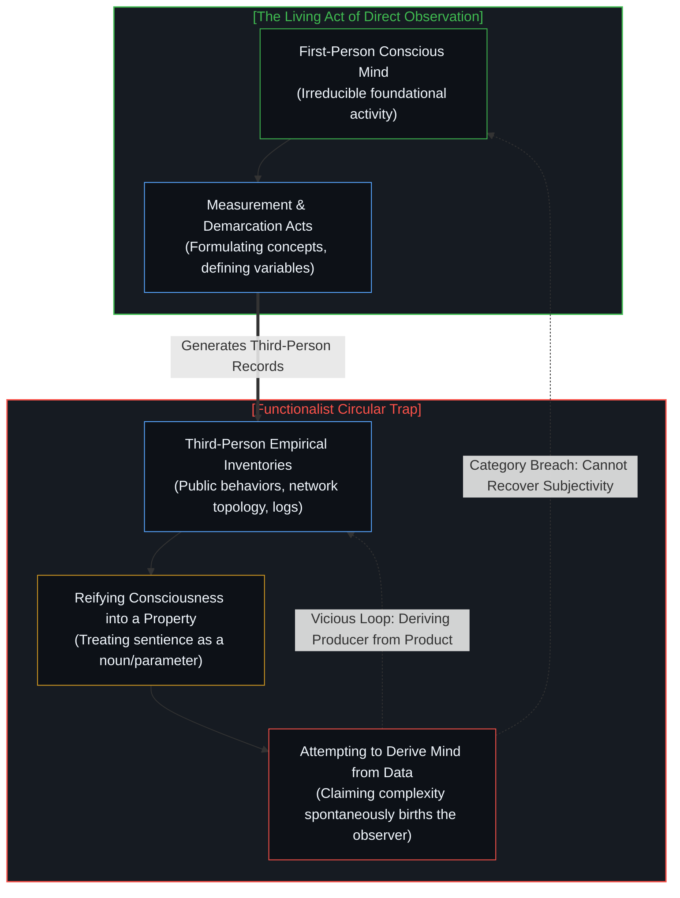
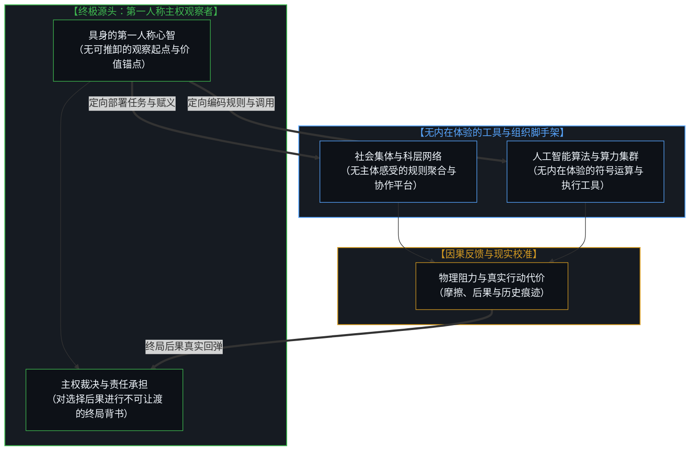
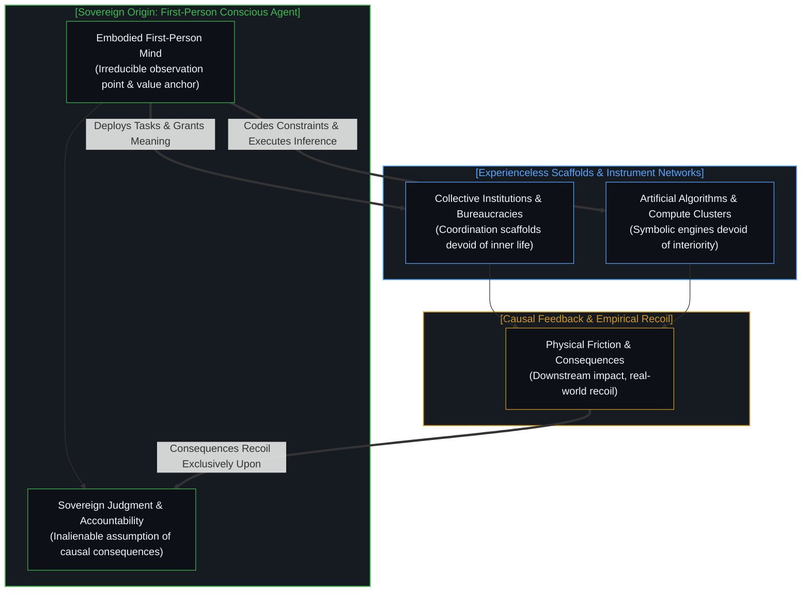

# 集聚与人造主体性 / Collective and Artificial Subjectivity

*源头意识抽离催生的客体化假象 / Artifacts of Subtracting Consciousness at the Source*

无论是施维茨格贝尔笔下“若唯物主义成立则美国具有意识”的推演，抑或将大语言模型奉为自足心智的当代迷思，皆源自同一种认识论的倒错减法——当人类设计、标注、评估与赋义的第一人称源头活动被隐入幕后，残留的公共组织特征便被挪用为宏观系统的“主体性”，然而集体与工具从未获得主观体验，被遗忘的唯有最初在场的观察者本身。探讨人工智能模型、蚁群乃至人类社会是否具备意识的争论，常常始于一份关于组织架构、信息流向与外部行为的第三人称清单。当研究者将活生生的第一人称观察活动剥离出去，仅凭外部功能记录，便不可避免地制造出凭空捏造的宏观幽灵与拟人化幻象。归还源头的审视清晰地揭示，集体与工具从未孕育出内在的主观世界，所谓涌现出的新型主体，不过是被隐匿的人类意向性投射在客体网络上的残余倒影。

Whether in Schwitzgebel's provocative claim that materialism implies the United States is conscious or in contemporary reification of AI models as autonomous minds, the extra subject is produced by the exact same epistemological subtraction: once human acts of design, training, evaluation, and interpretation are tucked into the background, residual public behaviors are credited to the system, yet the collective and the tool acquire no 'what it is like'—it is only the original observer who has been omitted from the account.

## 施维茨格贝尔的悖论与第三人称清单的死结 / Schwitzgebel's Reductio and the Deadlock of the Third-Person Inventory

探讨人工智能模型、蚁群乃至人类社会是否具备意识的争论，常常始于一份关于组织架构、信息流向与外部行为的第三人称清单。哲学家埃里克·施维茨格贝尔（Eric Schwitzgebel）在其著名的归谬论证《如果唯物主义成立，美国大概具备意识》（*If Materialism Is True, the United States Is Probably Conscious*）中，尖锐地挑明了功能主义与唯物主义推演的内涵：如果意识不外乎某种特定形式的物质排列、功能分工与信息整合，并且如果我们已经欣然承认兔子以及身体构造迥异的假想外星生命拥有意识，那么像美国这样在空间上分布广泛、在功能与信息交换上高度整合的庞大实体，便理应被判定为一个拥有自主体验的意识主体。这一推理逻辑如今被毫不迟疑地套用在人工系统之上。每当前沿模型展现出流畅自如的自然语言生成能力、多步骤的规划推理以及目标导向的行为输出，众多研究者与观察者便立刻将其推举为潜在的意识主体候选者。然而，这条看似严谨的实证路线陷入了不可解脱的死结：仅仅依据第三人称视角罗列的信息流动图谱与行为特征，并不能验证真实体验的在场，反而把用于协调的外部结构误认作内在的心智世界。

Discussions of whether artificial intelligence models, ant colonies, or human societies might be conscious almost invariably begin from a third-person inventory of structural organization, information throughput, and external behaviors. Eric Schwitzgebel’s celebrated paper, *If Materialism Is True, the United States Is Probably Conscious*, makes the implicit commitments of this tradition uncomfortably explicit. If consciousness is nothing over and above the right kind of material arrangement and informational integration, and if we already grant consciousness to rabbits and hypothetical alien organisms with radically unfamiliar anatomy, then a spatially distributed yet functionally integrated network such as the United States should count as a conscious subject in its own right. The exact same inductive formula is unhesitatingly applied to contemporary artificial systems. As soon as a frontier transformer exhibits fluent prose, multi-step planning, or goal-directed problem solving, theorists immediately treat it as a serious candidate for sentience. Yet this functionalist approach runs directly into a conceptual impasse: an external catalog of relational dynamics records only structural coordinates, mistaking public informational artifacts for an interior life.

## 减法的幻术：源头意识的剥离与残余属性的挪用 / The Sleight of Subtraction: Setting Aside the Origin and Reallocating Residual Properties

在上述两种情形中，凭空冒出来的“额外主体”都是通过认识论上的减法制造出来的。我们在宇宙中能够直接确证的唯一意识，唯有活生生的第一人称观察活动本身——也就是作为个体主体“体验为何物”（something it is like）的切身事实。然而，当理论家把这种观察活动搁置一边，或者将其降格为庞大功能流程图中一个可以被替换的普通零件时，叙事的重心便发生了欺骗性的转移。此时，留在公共视野中的客观痕迹——成文法典、科层机构、通信光缆、文本语料库——被重新编排，并被倒错地描绘为整个宏观系统自身的“体验之流”。正是通过这种移花接木，一个国家看似拥有了自己的头脑，一个神经网络模型看似能够理解世界。然而，这类迷人的宏观主体幻象，唯有在最初那些活生生的个体观察者被系统性地剔除出描述清单之后，才得以在概念的废墟上凭空建立。正如我们在 [意识从不作为数据出现在数据之中](../consciousness-never-appears-as-data-among-data/) 中所论证的，数据记录的是已被完成的投射产物，而把产物重新神化为主体的操作，不过是一场抹去源头后自欺欺人的认知减法。

In both cases, the extra subject is produced by subtraction. The only consciousness directly encountered across the cosmos is the first-person activity of observing: the concrete fact that there is something it is like to be an experiencing subject. When that foundational activity is set aside, or demoted to merely one more interchangeable component in an operational wiring diagram, the narrative focus shifts deceptively. The remaining public traces—statutes, institutional protocols, communications cables, and curated text corpora—are reassembled and redescribed as the experiential stream of the larger system. A nation appears to harbor an overarching mind; a computational model appears to comprehend reality. Yet these dazzling appearances arise only after the living original subjects have been omitted from the description. As demonstrated in [Consciousness Never Appears as Data Among Data](../consciousness-never-appears-as-data-among-data/), data records only the frozen footprints of prior cognitive acts, and reifying those footprints into a new conscious agent is an optical illusion born of deliberate subtraction.

## 人工智能作为被遮蔽的人类意向性容器 / Artificial Systems as the Occluded Vessel of Human Intentionality

人工系统将这种认识论上的减法展现得尤为刺目。每一个前沿大语言模型从构建到运行，无一不是由人类工程师与研究者所设计、训练、评测与解释的产物。语料库的精细清洗与筛选、损失函数的数学构建、基于人类反馈的强化学习对齐、提示词的上下文引导，无一例外是人类第一人称意识活动的具象化表达。更为关键的是，将算法吐出的离散高维向量序列解读为“富有深意的话语”，这一赋义过程只发生在使用者的意识心智之中。在硅基电路内部，真实发生的唯有高精度的浮点矩阵乘加运算与电压位移；如果缺少人类心智在接收端的语义投射，那些输出不过是毫无知觉的物理电信号。当所有这些人类源头的主动劳作被悄然推入未受审视的幕后，无生命的硅基造物便被神话为能够自发产生意义与意向性的自足心智。我们借由忽视维系机器运行的人类内在生命，轻率地将内在生命赋予了冷冰冰的机器。正如我们在 [智能只属于心智](../intelligence-belongs-only-to-the-mind/) 与 [造物无法取代造物者](../a-creation-cannot-replace-its-source/) 中所反复强调的，工具所借调的一切智能光辉，皆来自源头心智的慷慨灌注，造物本身从未跨越物理因果与体验实存之间的鸿沟。

Artificial systems illustrate this subtraction with even sharper clarity. Every frontier model is conceived, architected, trained, evaluated, and interpreted by human consciousness. The rigorous selection and filtering of pre-training corpora, the mathematical formulation of objective loss functions, reinforcement learning with human preference feedback, and the craft of prompting are unadulterated operations of living human intentionality. Most fundamentally, reading the output of an algorithm as coherent, insightful, or meaningful is an act occurring exclusively within the conscious mind of the human receiver. Within the hardware substrate, the physical reality consists strictly of high-speed floating-point tensor arithmetic and transient voltage states. In the absence of an observer’s cognitive decoding, those outputs remain nothing more than unconscious electrical patterns. When all this human scaffolding is obscured, the silicon artifact is mythologized as if it generated intentional understanding on its own. The machine is credited with an inner life by the convenient maneuver of ignoring the human inner life that animates it. As established in [Intelligence Belongs Only to The Mind - The Irreducible Prior](../intelligence-belongs-only-to-the-mind/) and [A Creation Cannot Replace Its Source](../a-creation-cannot-replace-its-source/), artifacts borrow every shred of their apparent light from their origin, possessing no intrinsic subjective reality of their own.

## 语法挪移与唯物主义/功能主义的循环论证 / The Grammatical Shift and the Circularity of Materialist Functionalism

这种将主体性泛化至集体与机器的谬误，在性质上既是语法的偷换，也是方法论的倒错。在语法层面，它把意识从一种动态的、正在发生的第一人称活动——观察、意图、体认与体验——篡改为一种客体化的静态属性，仿佛系统要么“拥有”这种属性，要么“缺乏”这种属性。在方法论层面，它错误地预设了一份经验实证清单能够揭示观察者的存在。然而，任何经验主义的实证描述，因其观察视角的固有局限，只能记录外部行为模式、物质空间分布与系统组织结构；经验描述并不能记录到观察者本身，它所能捕捉的唯有被观察到的现象客体。唯物主义与功能主义范式固然能够针对复杂行为模式提出诸多可被检验的科学假说，但它们无法避免致命的循环论证：一旦理论预先将第三人称的客观观测结果确立为第一性的基石，便无法通过自相矛盾的回溯，从那些由观察活动所派生出的客体记录中，推导还原出最初在场进行观察的源头活动。正如我们在 [因果不可化约，物理学是从无处而来的视角](../causality-is-irreducible-the-physical-is-a-view-from-nowhere/) 中所揭示的，物理学假想的上帝视角抽离了所有立足点，而当它反过来试图解释立足点本身时，理论便在自我参照的闭环中分崩离析。

The conflation of collective structure and automated computation with genuine subjectivity is at once a grammatical distortion and a methodological error. Grammatically, it transforms consciousness from a living, ongoing act—observing, intending, evaluating, and experiencing—into an objectified property that an external system supposedly possesses or lacks. Methodologically, it presumes that an empirical checklist, which by its inherent architecture can document only external behaviors and structural configurations, could somehow register the presence of an observer. Yet an empirical description cannot record the observer: it can only catalog observations. Materialist and functionalist frameworks generate rich and testable hypotheses regarding operational dynamics, but they cannot, without falling into circularity, derive the observing act itself from the very observations they have already crowned as primary. As shown in [Causality is Irreducible; The Physical is a View from Nowhere](../causality-is-irreducible-the-physical-is-a-view-from-nowhere/), any attempt to construct an observer-free picture of reality ends by projecting an empty abstraction, and attempting to resurrect living subjectivity from that projection traps thought in an infinite regress.

## 归还源头：机器与集体没有“体验为何物” / Returning to the Source: Neither Collectives nor Tools Acquire a "What It Is Like"

无论是集聚而成的社会集体，还是精密构筑的计算工具，都从未获得属于它们自己的“体验为何物”。成为美利坚合众国并没有某种切身的内在感受，成为一个由多头注意力机制驱动的变压器模型同样没有任何内在体验。在每一种情形下，那些看似新涌现出来的高阶主体，都不外乎是最初建造、维系并解读该系统的活生生观察者所投射下的悠长阴影。摆脱对集体或人造实体的技术泛灵论崇拜，不仅关乎哲学认识论上的严谨澄清，更关乎人类伦理与因果决断的责任锚定。一旦人们将主体性虚构性地转移给宏观体制或算法模型，便会滑向一种逃避责任的危险借口——人们开始将道德过失与历史代价推脱给所谓的“系统意志”或“模型判断”。然而，正如我们在 [主体性不曾涌现](../agency-does-not-arise/) 与 [任务的移交与后果的不可让渡](../the-delegation-of-the-task-and-the-inalienability-of-consequences/) 中所锚定的，任务可以被委托给工具执行，但后果的终局承担与价值裁决永远属于第一人称的主权心智。当我们将被减去的源头观察者郑重归位，关于机器与集体是否拥有心智的伪命题便自行消解，澄明的是那不可让渡的真实现存。

Neither human collectives nor mechanical instruments acquire a "what it is like." There is nothing it is like to be the United States, and there is nothing it is like to be a transformer model. In each instance, what masquerades as an emergent macro-subject is merely the lingering shadow of the living observers who created, maintain, and interpret the system. Dispelling this techno-animist illusion is not merely an exercise in metaphysical hygiene, but a necessary condition for ethical clarity. When subjectivity is misattributed to institutional apparatuses or artificial networks, it furnishes a convenient alibi for evading responsibility—human agents begin offloading consequences onto "the algorithm" or "the collective will." Yet as established in [Agency Does Not Arise: The Category Error of Emergence, Ingressed Latent Spaces, and the First-Person Prior](../agency-does-not-arise/) and [The Delegation of the Task and the Inalienability of Consequences: Self-Objectification, Causal Inversion, and the Return of Sovereign Judgment](../the-delegation-of-the-task-and-the-inalienability-of-consequences/), tasks can be delegated across instruments, but accountability recoils solely upon the first-person sovereign mind. When the subtracted observer is restored to the center, the confusion dissolves: tools remain tools, and the locus of experience remains forever unalienated.

