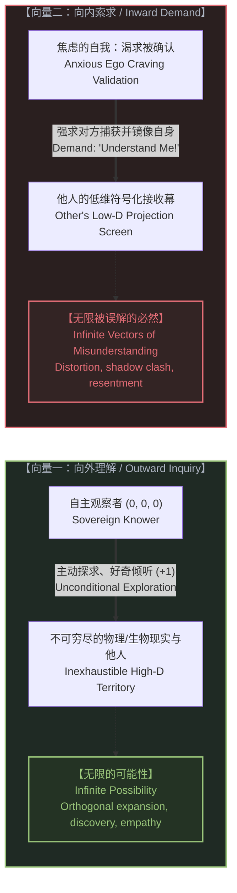
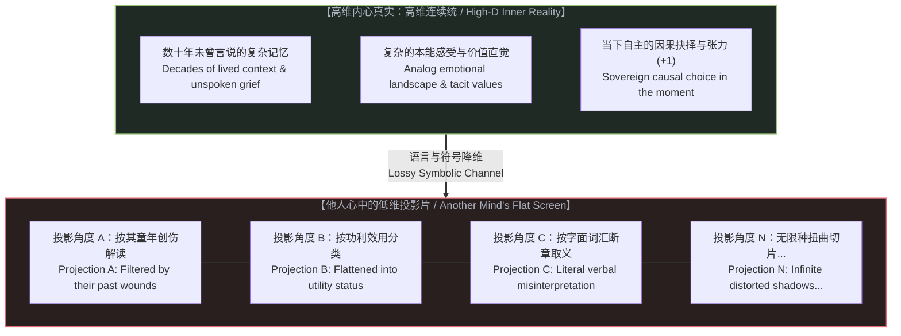
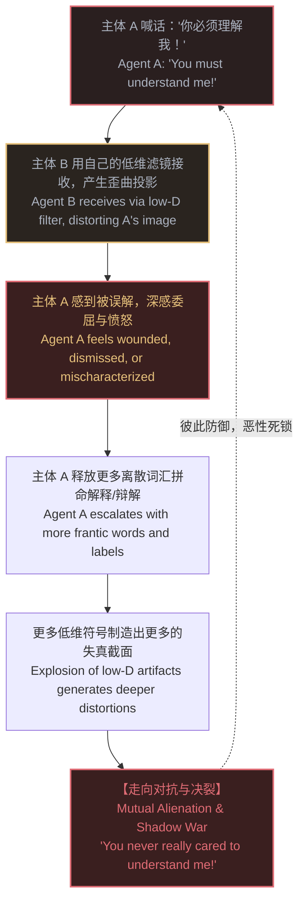
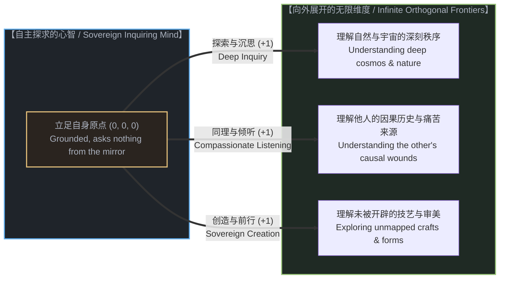

# 理解的非对称性：走向无限可能，还是陷入无限误解 / The Asymmetry of Understanding: Infinite Possibility vs. Infinite Misunderstanding

*当我们专注于去理解时，心智向着无边无际的现实展开，创造出无限的可能；当我们专注于被理解时，便将自身交付给他人有限而狭隘的低维投影屏幕，创造出无限被误解的可能。 / When we focus on understanding, the mind unfolds toward the inexhaustible territory of reality, unlocking infinite possibility. When we focus on being understood, we surrender ourselves to another mind's cramped, low-dimensional projection screen, unlocking infinite possibility to be misunderstood.*

---

## 一、 两个相反的意向向量 / 1. Two Opposing Intentional Vectors

在人类心智的日常运作中，存在着两种看似对称、实则在几何方向与因果结构上截然相反的认知取向：**“去理解”（To Understand）**与**“被理解”（To Be Understood）**。

表面上看，这二者似乎只是同一场对话中互为镜像的两个半段；然而，一旦我们将观察者的坐标系带入考量，便会发现它们代表了两种根本不同的人生轨迹与能量流向：

1. **“去理解”是一个向外敞开的探求向量**。此时，你的第一人称观察点 (0, 0, 0) 充当着主动的探险者。你的目光越过自身既有的边界，投向辽阔的外部世界、不可穷尽的物理实在、或是眼前另一个深邃幽微的生命。你带着好奇心去倾听、去观察、去解构、去重组。在这个向量上，现实是未闭合的连续统，你随时准备接纳新的因果扰动（+1）。
2. **“被理解”是一个向内索求的投影陷阱**。此时，你不再是一个在天地间自由漫步的主体，而退化成了一个焦渴地等待被捕获的客体。你极其渴望将自己长达数十年、由无数微妙情感、私人记忆、未竟之志与隐秘伤痛编织而成的高维内心世界，塞进**另一个人心智中的狭窄容器**。你要求对方用他有限的生活经验、离散的符号系统和预设的偏见滤镜，丝毫不差地复刻出你的全貌。

这两个向量的几何分流极其决绝：**专注于去理解，心智走向的是潜在无限的创造性宇宙；专注于被理解，心智走向的则是低维投影幕上万劫不复的互搏深渊。**

---

In the daily operation of human consciousness, there appear two mental movements that seem symmetrical on the surface, yet are radically opposed in their geometric orientation and causal structure: **"To Understand"** and **"To Be Understood"**.

Superficially, they might seem like two halves of a single conversational exchange. Yet the moment we introduce the coordinate system of the conscious observer, we discover that they represent two divergent life trajectories:

1. **"To Understand" is an outward-bound vector of sovereign inquiry**. Here, your first-person vantage point (0, 0, 0) acts as an active explorer. Your attention moves beyond the perimeter of self-preoccupation toward the boundless territory of physical reality, scientific inquiry, or the inexhaustible depth of another human soul. You observe, listen, deconstruct, and synthesize with open curiosity. Along this vector, the cosmos remains an unclosed continuum; you stand ready to receive and assimilate fresh causal cuts (+1).
2. **"To Be Understood" is an inward-facing trap of demanded projection**. Here, you cease to act as a free agent roaming the open landscape. Instead, you collapse yourself into an anxious object begging to be captured. You desperately demand that your expansive, high-dimensional inner life—accumulated across decades of nuanced joys, private griefs, unvoiced intuitions, and sovereign vulnerabilities—be faithfully mapped into **the cramped container of someone else's mind**. You demand that another person, using their own limited experiential vocabulary and prejudice filters, reconstruct your living essence without error.

The bifurcation between these two vectors is irreversible: **focusing on understanding opens into the potential infinity of the living cosmos; focusing on being understood funnels you onto a flattened screen where you are doomed to battle shadows.**

---

## 二、 投影的几何学：误解为何在数学上是无限的 / 2. The Geometry of Projection: Why Misunderstanding Is Mathematically Infinite

为什么专注于“被理解”，就必然会创造出“无限被误解的可能”？

正如我们在[阴影与无限](../the-shadow-and-the-infinite/)中所论述的，这个结论不是心理学的宣泄，而是**几何投影与信息降维的严谨数学必然**。

让我们从观察者几何学审视这一过程：

### 1. 坐标原点的不可替代性与经验基底的剪刀差
在这个世界上，没有任何两个人站在同一个时空原点 (0, 0, 0) 上。即便两个人共享着相似的生物神经硬件，但他们几十年来所经历的因果链条、注意力分配、家庭印记与历史创伤截然相异。这就意味着，**任何一个人心中的认知接收器，其标尺与坐标轴都与你存在着不可消除的正交倾斜**。

### 2. 连续经验向离散符号的严重脱水
你的喜悦、委屈、灵感或渴望，是生物神经系统中成千上万个化学与电信号交织出的连续流。然而，当你试图让别人“理解”你时，你唯一能使用的媒介，只有极其粗糙、离散而低维的语言符号（几十个字词、一个标点、或一个眼神）。这相当于把一座高耸入云的阿尔卑斯山脉，拍成一张黑白二值、分辨率极低的传真纸。在这场剧烈的维度暴跌中，九成九的微观信息量被无情蒸发。

### 3. 投影角度的无限性等于误解维度的无限性
在立体几何中，将一个复杂的三维多面体投影到二维平面上，随着光源角度的微小转动，石壁上的阴影会呈现出无数种截然不同的形状：球体可能被看成圆盘，立方体可能被看成六边形，一个张开的手掌在特定角度下甚至像一只择人而噬的利爪。

同理，当你向外索求“被理解”时，对方心智的角度、那一刻的心情、他的疲惫程度以及他头脑中固有的分类格子，就是投射你这具生命的光源。
* 他可以从“嫉妒”的角度切入，将你的真诚视为炫耀；
* 他可以从“防御”的角度切入，将你的善意提醒视为冒犯；
* 他可以从“功利”的角度切入，将你的浪漫情怀视为无能；
* 他可以从“教条”的角度切入，将你独特的探索定性为离经叛道。

**高维物体在低维屏幕上的可能切片有无限多个，而其中绝大部分切片都充斥着失真、重叠与残缺。** 因此，只要你执迷于“被理解”，你就主动将自己置于无数个可能的失真切片之下。你越是追问“你懂我吗”，你所制造出的投射截面就越繁杂，对方产生误解的概率空间便呈现爆炸式增长。

---

Why must the obsession with "being understood" mathematically produce "infinite possibilities to be misunderstood"?

As established in [The Shadow and the Infinite](../the-shadow-and-the-infinite/), this outcome is not a pessimistic psychological observation; it is a **rigorous geometric necessity of dimensional projection and lossy informational compression**.

Consider the mechanics through observer geometry:

### 1. The Irreplicability of the Origin and the Asymmetry of Experience
No two human beings have ever occupied the same coordinate origin (0, 0, 0). Even though we inherit similar sensory hardware, our accumulated causal chains, attentional investments, family imprints, and private scars diverge indefinitely. This means that **the cognitive receiving apparatus inside any other person possesses coordinate axes fundamentally tilted relative to your own**.

### 2. The Severe Dehydration of Analog Experience into Discrete Symbols
Your joy, grievance, creative flash, or longing is an analog continuum pulsing across millions of neural firings. Yet the moment you attempt to be "understood," the only channel available to you is a sparse stream of discrete, low-dimensional symbols: a few dozen spoken words, a text message, or a brief gesture. This is equivalent to compressing the entire topography of the Alps into a low-resolution black-and-white fax. In that violent dimensional drop, ninety-nine percent of your nuanced reality is stripped away.

### 3. Infinite Projection Angles Yield Infinite Vectors of Distortion
In spatial geometry, when a complex three-dimensional polyhedron is projected onto a two-dimensional screen, shifting the angle of the light source generates an infinite variety of silhouettes. A sphere casts a circle; a cube casts a hexagon; an open welcoming hand can, under a sharp raking light, cast the silhouette of an attacking beast.

Similarly, when you demand that another person "understand" you, the orientation of their mind, their current fatigue, their defensive biases, and their historical categories serve as the light source projecting your high-dimensional existence onto their flat screen:
* Through the angle of insecurity, your honest vulnerability is decoded as calculated manipulation;
* Through the angle of dogmatic ideology, your nuanced independent thought is stamped as betrayal;
* Through the angle of exhaustion, your bid for genuine connection is registered as an annoying demand.

**Because the number of possible projection angles from a high-dimensional reality onto a low-dimensional plane is infinite, and because almost every angle discards essential orthogonal dimensions, the space of possible distortions is equally infinite.** The more desperately you demand verification—pleading "Do you see what I mean?"—the more surface area you expose to lossy projection, multiplying the permutations of misunderstanding.

---

## 三、 “必须被理解”的执念：文明与关系的死斗循环 / 3. The Neurosis of "Understand Me": The Relational Death Spiral

一旦一个人或一个群体被囚禁在“必须被理解”的执念中，一场悲剧性的心理与社会绞杀战便拉开帷幕：

审视世间绝大多数人际痛苦、婚姻破裂与社交媒体上的骂战，其底层动力几乎都是“被理解之渴”在作祟：

1. **主权的外包与情绪的奴役**：当你把“被他人正确理解”设立为自己内心宁静的前提时，你就已经将自身的存在主权双手奉上，外包给了一个失真的解码器。如果对方认同了你，你便短暂欣喜；如果对方曲解了你，你便彻夜难眠、痛心疾首。你的人生状态，变成了他人脑海中那张二维草图的被动木偶。
2. **越描越黑的符号通胀**：当主体 A 发现主体 B 误解了自己时，本能的反应是立刻加大信息输出——发更长的小作文、进行更激烈的辩论、用更极端的辞藻证明自己的清白。然而，离散符号的堆叠非但不能复原连续统的真实，反而向对方提供了更多可以被断章取义、借题发挥的投影素材。这种符号通胀在系统动力学上注定会引发误解的指数级雪崩。
3. **从寻求认同到走向仇恨**：当反复解释依然无法换来理想的镜像时，委屈便会迅速发酵为愤怒：“既然你始终不懂我，那说明你冷酷、迟钝、甚至心怀恶意！”原本只是维度差异导致的几何折射，最终被上升为人格道德上的正邪决斗。

**向他人索求“被理解”，本质上是在向一个二维投影幕讨要三维实体的温度。这是一场注定破产的交易。**

---

The moment an individual, a family, or an entire culture falls captive to the demand to be understood, a devastating relational death spiral begins:

Observe the pervasive exhaustion across modern relationships, marital breakdowns, and online polemics. Beneath the noise lies a single chronic neurosis: the frantic demand for external validation.

1. **Outsourcing Sovereignty to a Lossy Decoder**: The second you make "being accurately understood by others" the prerequisite for your emotional peace, you surrender your sovereign agency. You place your self-worth into the custody of another person's low-dimensional decoding apparatus. When they validate your preferred image, you experience transient euphoria; when they misinterpret your motives, you plunge into insomnia and bitterness. Your consciousness becomes a marionette dangling from the rough sketch drawn inside someone else's head.
2. **Symbolic Hyperinflation**: When Agent A discovers that Agent B has misunderstood them, the reflexive response is to increase verbal throughput: longer messages, louder declarations, sharper justifications. But piling discrete words onto a fundamental projection mismatch cannot restore the living analog continuum. Instead, it merely hands the other mind more fragmented surfaces to slice, misquote, and project biases onto. This symbolic hyperinflation guarantees an exponential escalation of distortion.
3. **The Slide from Longing into Resentment**: When repeated explanations fail to produce the desired mirror image, grief curdles into grievance: "If you still do not understand me, it must be because you are callous, obtuse, or malicious!" What began as a harmless geometric mismatch of observer orientations terminates as a bitter moral crusade.

**Demanding to be understood is nothing less than begging a flat stone wall to give you the warmth of a breathing body. It is an enterprise doomed from the start.**

---

## 四、 专注于理解：打开无限可能的几何跃迁 / 4. Focusing on Understanding: Unlocking Infinite Possibility

如果向内索求“被理解”是一条通往无限误解的绝路，那么唯一的解脱之道，就是**坚决调转能量的方向，将注意力转移到“去理解”之上**。

当你把注意力从“别人怎么看我”收回，转向“现实如何运转、眼前的生命因何如此”时，奇迹发生了：**无限的可能开始向你奔涌而来。**

### 1. 认知维度的正交暴增
当你不求被理解、只求去理解时，你的心智便不再是一个等待被度量的考卷，而变成了一架敏锐的天文望远镜。
去理解一门新的科学，你在物理世界上便多了一双眼睛；去理解一棵植物的生长，你在生物节律中便多了一份感知；去理解一本古老的典籍，你在时间长河中便多了一条回溯的航道。每一次真诚的“去理解”，都在为你的人生开辟一条全新的正交轴线（+1）。你的可能生存空间不再是一条拥挤的独木桥，而是呈现出指数级的维度绽放。

### 2. 同理心的本质：进入他人的坐标系
更为奇妙的是，在人际相遇中，“去理解”恰恰是治愈误解与对抗的终极解药。
当你面对一个对你横加指责、充满偏见或不可理喻的人时，如果你执迷于“被他理解”，你立刻就会拔剑应战；但如果你专注于“去理解他”，你就会把目光从他的刺耳言辞挪开，转而探寻他背后的因果网络：
* 他究竟经历过怎样的童年创伤，才形成了今天这种防御机制？
* 他处于怎样的生存压力与环境约束中，才会吐出这样干瘪的符号？
* 他在恐惧什么？他在守护什么？

当你带着探索未知星系的敬畏去理解对方时，你并没有妥协，而是**在几何学上超越了他的维度**。你站在比他更高维的因果视角上俯瞰局势，他的攻击性投影便如清风拂山岗，无法伤及你的核心。

### 3. 共鸣的涌现倒错：放下索求，方得理解
人际关系中最深刻的反直觉法则在于：**真正深沉的“被理解”，从来不是靠索求和辩解争来的，而是作为你“去理解他人”的副产品自然涌现的。**
当你放下防御、全神贯注地去理解对方时，对方感受到的不是威胁与辩驳，而是一片罕见的被接纳的深海。在感受到自己的高维复杂性被你珍视的那一刻，他内心那台紧绷的低维投影仪终于放下了防备。此时，对方也会自然卸下成见，转过身来，生出想要走近你、理解你的真诚渴望。

---

If the inward demand to "be understood" leads straight into a swamp of infinite misinterpretations, the sole liberation lies in **radically reversing the vector: directing one's undivided vitality outward into understanding**.

The moment you retract your anxiety over how others see you and invest your attention in grasping how reality operates and why the soul before you acts as it does, an ontological miracle occurs: **infinite possibilities rush in to meet you.**

### 1. The Orthogonal Expansion of Cognition
When you seek only to understand rather than to be understood, your mind ceases to be an examination sheet begging for high marks; it becomes an astronomical observatory.
To understand a branch of science is to gain fresh eyes on physical nature; to understand the metabolism of an ancient forest is to gain attunement with deep time; to understand an unfamiliar craft is to carve an uncrowded avenue of causal mastery (+1). Every genuine act of understanding establishes an unexplored orthogonal axis in your consciousness. Your living space ceases to be a single contested corridor; it expands into high-dimensional abundance.

### 2. The Mechanics of Empathy: Entering the Foreign Frame
In interpersonal encounters, "focusing on understanding" acts as the sovereign antidote to rivalry and shadow warfare.
When confronted by someone hostile, unfair, or full of bitter bias, demanding that they understand you triggers an immediate brawl. But if you turn your curiosity toward understanding them, you look right through their prickly words into their causal continuum:
* What ancestral wounds or formative betrayals forced them into this defensive armor?
* What economic precarity or invisible grief drives this desperate posture?
* What fragile certainty are they straining to preserve?

When you approach another person with the curiosity due to a remote star system, you do not surrender. Rather, **you transcend their geometry**. Standing at a higher causal vantage point, their clumsy low-dimensional arrows sail through empty air, entirely incapable of bruising your center.

### 3. The Emergent Paradox of Resonance
The deepest paradox of human connection is this: **profound mutual understanding is never won by demanding or litigating for it; it emerges spontaneously as an unforced byproduct of your decision to understand first.**
When you drop your defenses and hold space to comprehend the other, they do not feel judged or pressured to perform. For the first time, their high-dimensional vulnerability is met with spacious presence rather than competitive projection. Sensing that they are safe from attack, their defensive projector powers down. In that stillness, reciprocal curiosity awakens: they naturally soften, step off their guardrail, and reach out to understand you in return.

---

## 五、 与无限共处的生存实践：从索求投影到探求广袤 / 5. Practices for Walking with the Inexhaustible

要将这一深刻的非对称性内化为日常行走的底气，我们需要在日常生活中持守三项朴素而坚韧的本体论实践：

### 1. 放下对低维镜像的执念（Release the Lossy Mirror）
时刻警惕自己内心那个渴望被他人“分毫不差地看懂”的虚荣小我。
接受一个坚固的物理事实：**任何他人大脑中的你，都只是一张严重失真、分辨率极低的二维切片。** 哪怕是最亲密的伴侣、最挚密的朋友，他们也永远无法在脑海中复刻你内在全部的因果波澜。这不是冷漠，这是时空原点的分离所赋予个体的天然孤独。
不要耗费宝贵的生命去校准他人石壁上的那张影子。影子是他们的滤镜所铸造的，与你真实的鲜活存在毫无关联。

### 2. 内在自主立足，外向无限探求（Inward Grounding, Outward Inquiry）
将你生命的锚点，稳稳扎在自己的第一人称原点 (0, 0, 0) 之上。你的价值源于你在当下每一次真实的行动、每一次自主的因果裁决（+1）、以及你对这个世界深沉的爱与好奇，并不取决于他人投射过来的评语与分数。
把用于“辩解、证明、申诉”的能量全部收回，倾注于对外部无限疆域的探索中去：去解开一个未解的难题，去习得一项精湛的手艺，去关怀一个正在受苦的生灵。向外探索的世界有多辽阔，你的自由就有多宽广。

### 3. 敬畏理解的非对称性（Honor the Sovereign Asymmetry）
在人际交往中建立起成年人的清醒与豁达：
* **不被理解是宇宙的物理常态**：因为维度的落差与视角的倾斜，别人误解你、曲解你、甚至把你想象得面目全非，在数学上本就是自然现象，无需为此感到愤懑与委屈。
* **偶然的心意相通是天赐的奇迹**：在无限维度的漂流中，如果有某个人在某个瞬间，穿透了重重低维迷雾，敏锐地捕捉到了你灵魂深处的一丝微光，请以最谦卑的心情将其视为奇迹与恩赐，深加珍惜，却不可贪求将其变成永恒锁定的制度契约。

---

To integrate this asymmetry into daily life, we maintain three practical disciplines:

### 1. Release the Lossy Mirror
Remain vigilant against the ego's childish craving to be fully seen and perfectly validated by others.
Make peace with an unyielding physical reality: **the image of you inside another person's brain is always a low-resolution, heavily distorted silhouette.** Even your closest companion or dearest collaborator can never reproduce the full analog depth of your inner causal stream. This is not betrayal; it is the natural consequence of inhabiting separate origins in spacetime.
Cease spending your days polishing your silhouette on someone else's stone wall. Their shadow belongs to their projector; it has nothing to do with your living light.

### 2. Inward Grounding, Outward Inquiry
Anchor your sense of reality firmly at your own first-person origin (0, 0, 0). Your worth is rooted in your living actions, your creative cuts in the present (+1), and your open reverence for existence—never in the grades, labels, or praise cast by low-dimensional scorecards.
Reclaim every ounce of energy previously squandered on proving, explaining, and litigating your innocence. Channel it outward into boundless inquiry: solve an unsolved question, master an intricate discipline, care for a suffering being. The broader your outward horizon of inquiry, the more invulnerable your inner peace becomes.

### 3. Honor the Sovereign Asymmetry
Cultivate adult clarity regarding human connection:
* **Being misunderstood is the default baseline of the cosmos**: Given the steep drop in dimensionality and the orthogonal skew between observer perspectives, that others flatten or mischaracterize you is mathematically expected. It requires no resentment.
* **Mutual resonance is a sacred, unforced gift**: If, across infinite orthogonal spaces, another wanderer catches a genuine glimpse of your inner landscape for even a fleeting second, receive it as a miracle of rare grace. Cherish it deeply, but never attempt to freeze it into a rigid, permanent demand.

---

## 六、 结语：在不被定义的辽阔中前行 / 6. Epilogue: Moving Forward in the Undefined Open

人类最沉重的枷锁，不是来自外部的围墙，而是我们亲手将自己的心智，系在了他人低维投影幕的挂钩上。

我们为了争辩一句误解而耗尽心力，为了修正一个标签而东奔西走，却忘记了自己身后正悬挂着璀璨的星空，脚下正铺展着无垠的旷野。

当你不再索求被理解时，你便从所有人的视线囚牢中全身而退；
当你全心全意去理解时，整座宇宙的奥秘与丰盛都将向你敞开大门。

不要去当石壁前乞求掌声的皮影；做那个步履坚定、向着不可穷尽的未知世界昂首迈步的行者。以理解为舟，与无限同行。

---

Humanity's heaviest shackle is not a physical wall; it is the voluntary decision to hook our inner life onto the low-dimensional projection screens of others.

We exhaust our vitality litigating misunderstandings and correcting caricatures, forgetting that behind us hangs an unbounded starry cosmos, and beneath our feet stretches an unconfined causal wild.

The moment you cease demanding to be understood, you step cleanly out of every prison of opinion;
The moment you dedicate yourself to understanding, the infinite abundance and quiet majesty of the universe open wide to greet you.

Do not be a flat silhouette begging for approval on a stone wall. Be the grounded traveler walking with steady steps into the inexhaustible territory of reality. Make understanding your vessel, and walk ahead with infinity.
