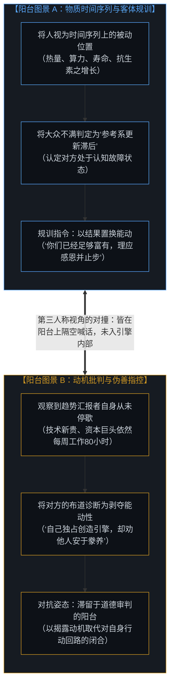
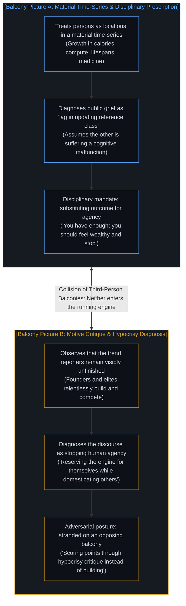
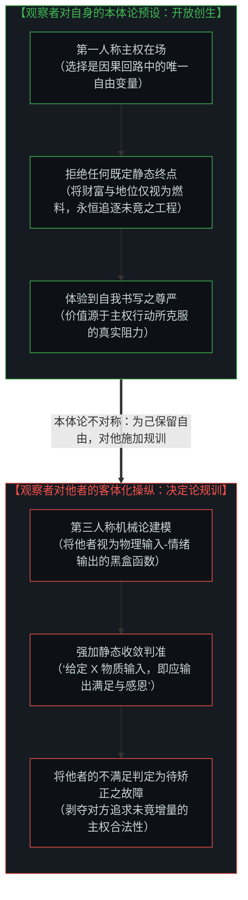
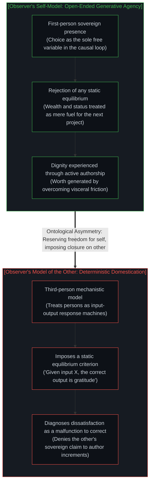
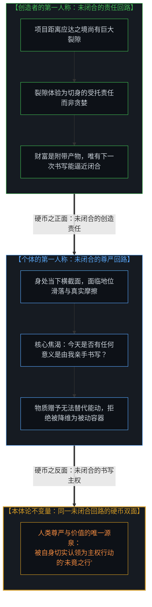
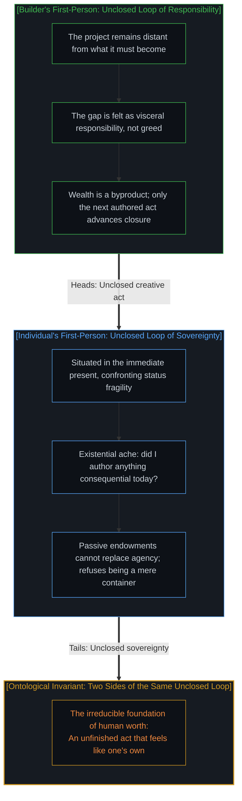
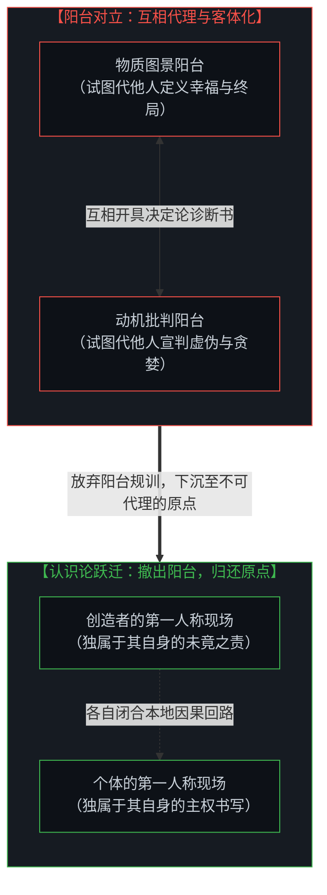
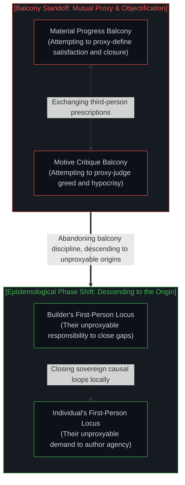

# 阳台视角的规训僭越与不可代理的未竟之行 / The Balcony Disciplinary Overstep and the Unproxyable Act

*为己保留自由却对他施加规训，阳台的对撞唯有降临不可代理的原点方能化解。 / Reserving agency for oneself while disciplining others, balcony clashes dissolve only at the unproxyable origin.*

在社交网络与当代公共讨论中，一场旷日持久的争论反复上演：一方站在物质时间序列的宏大趋势前，困惑于大众为何迟迟不能对空前繁盛的技术红利报以感恩；另一方则反唇相讥，指责那些倡导感恩的说教者自身从未停歇过对资本、名望与未竟工程的狂热角逐。这场争论之所以始终陷入死结，是因为双方皆站在第三人称的“阳台”之上俯瞰他者，试图将对方纳入自身的阐释框架进行规训与操控；更隐秘的认识论倒错在于，身处阳台的宣讲者在潜意识中为自己保留了不可让渡的自由选择与自我书写权，却试图将他人的生活化约为一套可以通过外部输入指标来静态锁定的决定论反应机。唯有真正走出阳台的旁观视角，代入各自未闭合的第一人称行动回路，我们才能看清：人的尊严与价值绝非源于被动接受既成事实的奖赏，而唯独诞生于那份正在发生、切身体认且不可被任何人代理的未竟之行。

A protracted and recurring dispute dominates contemporary public discourse: one side stands before the sweeping trend-lines of material progress, bewildered by why the populace fails to express gratitude for unprecedented technological abundance; the other side retorts by pointing out that the very proponents of gratitude remain insatiably restless in their own pursuit of capital, prestige, and unfinished engineering frontiers. This argument remains deadlocked because both parties stand on detached, third-person "balconies" looking down at "them," treating the other side as an object to be analyzed, corrected, and steered. More insidiously, an epistemological contradiction festers within this balcony posture: the observer reserves for themselves an open-ended, sovereign agency of striving, yet prescribes for others a closed, deterministic receptor model whose satisfaction is supposed to be dictated by passive material inputs. Only by descending from the balcony and entering the running engine of the first-person causal loop does the truth emerge: human worth is never derived from the passive receipt of finished outcomes, but solely from the felt, ongoing authorship of an unfinished act that can never be occupied by proxy.

---

## 一、 阳台上的两套第三人称图景 / 1. The Two Third-Person Pictures from the Balcony

这场争端在外部观察者眼中，首先表现为两套截然相反的第三人称图景的剧烈对撞。正如在 [隐形的上帝之眼](../the-invisible-gods-eye/) 中所揭示的，一旦心智习惯于从奥林匹斯山般的阳台俯瞰众生，活生生的人便被抽离了呼吸与具身摩擦，蜕变为坐标系中的抽象数据点。

第一套图景将人视为物质时间序列上的物理坐标。一百年前，同一个生物肉体所能摄入的热量、享受的医疗、获取的光照与流通的信息，在数量级上皆远逊于今日；二十年后，这些物理参数几乎注定会迎来进一步的增长。站在这一览无余的技术乐观主义阳台上，大众持久的普遍不满被判定为一种荒谬的认识论时滞——不过是群体在更新自身参考坐标系（reference class）时的滞后反应。占据这一图景的讲演者不需要证明自己已然获得了完满，他自认履行的仅仅是一份“如实汇报宏观趋势”的客观职责。

第二套图景则将人视为动机的具身承载者。持这一视角的观察者敏锐地指出：那些高谈阔论趋势线、规训大众应当知足常乐的技术精英，自身恰恰表现出最显眼的未竟与焦灼。他们的社会地位、财富累积与话语权威，从头至尾正是因为他们拒绝将任何一个阶段性成果视为终点，始终将每一次边际增量视作不完备的起点，并持续投身于下一次行动。在这一视角看来，人的自我价值（self-worth）在于亲身体验对下一个增量的“书写权”（authorship），而非对已经生产出来的历史遗赠的被动“签收”。因此，无论向大众配发多么丰厚的社会救济、普及多么廉价的消费电子产品，或者在舆论场上强行下达“感知自身富有”的道德指令，在本体论上都是一场极其拙劣的偷换——试图以第三人称的“既成结果”（outcome）来置换第一人称鲜活的“能动主体”（agency）。

这两套图景皆带有鲜明的观察性。每一方都站在各自的阳台上指点江山，把视线聚焦于“他们”身上。一方描绘大众沉溺于盲目抱怨、未能领悟时代的恩赐；另一方描绘创造者伪善冷酷、对自身运转的特权引擎装聋作哑。这两套论述永远无法达成真实的交汇，因为它们都是在发动机熄火的看台上发出的宏论，没有一句出自正在轰鸣运转的机舱内部。

The disagreement between these stances begins as a violent collision between two distinct third-person pictures. As explored in [The Invisible God's Eye](../the-invisible-gods-eye/), whenever the mind retreats to an Olympian balcony, living persons are stripped of somatic breath and friction, reduced to abstract coordinates on a grid.

The first picture treats persons as locations within a material time-series. A century ago, the identical biological organism subsisted on fewer calories, endure inferior medical care, worked under dim light, and handled negligible information; twenty years from now, these parameters will almost certainly compound further. From this panoramic techno-optimist balcony, persistent public dissatisfaction appears as an irrational cognitive defect—a mere lag in updating one's reference class. The speaker occupying this vantage point is not required to demonstrate personal tranquility; their self-assigned mandate is simply to deliver an objective dispatch on the macro trend.

The second picture treats persons as embodied carriers of motive. Observers here notice an immediate friction: the very speakers delivering the progress lectures remain visibly and intensely unfinished. Their wealth, status, and prominence exist precisely because they refused to treat any milestone as final, viewing every incremental achievement as incomplete and continuously pouring their energy into the next venture. From this perspective, human self-worth is the felt authorship of the next increment, not the passive receipt of an increment already delivered. Consequently, distributing universal stipends, offering cheap gadgets, or issuing moralistic instructions to "feel wealthy" appears as a hollow category substitution—offering finished outcomes in exchange for surrendered agency.

Both pictures remain fundamentally observational. Each stands upon its balcony describing "them." One describes the masses as ungrateful nodes failing to perceive technological grace; the other describes the builders as hypocritical technocrats blind to the engine of their own privilege. These descriptions never meet because neither is spoken from within the engine while it is running.

---

## 二、 视角的本体论不对称与操纵冲动 / 2. The Ontological Asymmetry and the Disciplinary Impulse

在这一冲突的表层之下，潜藏着一个更为严峻的认识论断裂——**视角的本体论不对称**。正如在 [主权抉择的双面性与观察的客体化](../the-two-sided-nature-of-sovereign-choice-and-the-objectification-of-observation/) 中所论证的，同一个主权心智在审视自身与审视他者时，极易分裂为两套截然相反的标准。

在社交媒体的争鸣中，阳台上的宣讲者反复展现出一种极具欺骗性的操纵冲动：**他们将对方视为必须被评判、操纵并亟需矫正的“被动客体”，同时却将“自由选择”与“开放求索”的特权牢牢据为己有。**

请审视这一宣讲者内在模型的深刻分裂：

对其自身而言，他生活在一个开放的、非决定论的生成体系中。即便他已经拥有了普通人百世难及的丰裕资产，如果有人勒令他：“你拥有的卡路里与设备已经远超路易十四，你现在必须停止研发新架构，停止创立新组织，呆在有空调的房间里感恩”，他会立刻将这种指令视为对其精神生命的残暴抹杀。他深知，让自己早晨从床上爬起来的动力，决不是“我昨天消耗了多少卡路里”，而是“今天还有未竟的因果链等待我去闭合”。他将自身的不满足体验为崇高的使命感、受托责任与探索之火。

然而在面对他者时，他的心智编译器立刻切换到了极度冷酷的机械决定论模式。他把具体的公众建模成一台“输入-输出状态机”：输入端是抗生素、智能手机与廉价蛋白质，输出端就理应产出“幸福”、“安分”与“知足”。当状态机的输出出现偏差（公众表现出焦虑与失落），他不仅不反思模型对人的还原性降维，反而指责机器本身发生了故障——“他们的参考系出现了认知滞后，他们需要接受思想修正”。

这种不对称构成了最尖锐的自我矛盾：**宣讲者向大众开出的药方，恰恰直接否定了宣讲者自身之所以成为其本人的全部存在前提。** 他要求他人成为被动接收投喂的动物，却将自身能动者的神圣光环高高挂起。正如在 [宏观现象及参数和个人微观选择的因果倒置与利率的命令幻相](../the-summary-first-reversal-and-the-command-of-yields/) 中所解构的，这种姿态是试图用第三人称的汇总参数去取消第一人称主权抉择的伪权力幻象。它不仅无法平息摩擦，反而在公共领域激起了更深层的对抗与防御。

Beneath the surface of this culture-war skirmish lies a deeper epistemological rupture: **an ontological asymmetry in the modeling of minds**. As analyzed in [The Two-Sided Nature of Sovereign Choice and the Objectification of Observation](../the-two-sided-nature-of-sovereign-choice-and-the-objectification-of-observation/), an identical consciousness inevitably fractures when applying one set of axioms to itself and an opposing set to others.

In discussions on social media, the balcony commentator frequently exhibits a telling disciplinary impulse: **they treat the other as an objective entity to be judged, manipulated, and corrected, while fiercely preserving their own open-ended freedom of choice.**

Consider the schizophrenia embedded in the commentator's mental architecture:

For themselves, they inhabit an open, non-deterministic generative reality. Even if their personal balance sheet exceeds the dreams of medieval monarchs, were someone to dictate: "You have more lighting and antibiotics than Louis XIV; you must now cease writing software, stop launching rockets, sit in an air-conditioned room, and feel grateful," they would instantly experience this command as psychological death. They know viscerally that what pulls them out of bed each morning is not yesterday's caloric intake, but an open causal horizon demanding closure. They experience their own dissatisfaction not as greed, but as sacred responsibility and creative stewardship.

Yet for the other, their internal compiler instantly collapses into crude mechanistic determinism. They model the public as a closed input-output automaton: feed in smartphones, antibiotics, and cheap calories on the left, and out must pop gratitude and contented compliance on the right. When the automaton malfunctions—when ordinary individuals manifest existential alienation or political rage—the commentator does not interrogate the grotesque reductionism of their model; instead, they declare the automaton defective: "Their reference class is miscalibrated; they require ideological debugging."

This asymmetry produces an irreconcilable self-contradiction: **the prescription offered to the public contradicts the very existential ground that makes the prescriber's own life meaningful.** The commentator prescribes passive domestication for others while reserving sovereign agency for themselves. As shown in [Macro Parameters, Micro Choices, and the Command of Yields](../the-summary-first-reversal-and-the-command-of-yields/), this is the grand illusion of substituting macro descriptive parameters for the lived free variable of micro choice. It does not resolve societal tension; it fans the flames of defensive rebellion.

---

## 三、 双向第一人称模拟与未闭合的行动回路 / 3. Dual First-Person Simulation and the Unclosed Loop

若要实现真正的认知理解而非在舆论场上争抢道德胜负，就必须坚决弃绝阳台上的俯瞰姿态，将第三人称的观察仅作为搭建模拟脚手架的权宜手段。我们必须真正下沉，分别代入对峙双方正在运转的第一人称引擎内部。

首先，代入**创造者的第一人称现场**：
当一位工程师、创业者或制度构建者凝视自己的事业时，现实与设想之间的断裂决非抽象的数据差额，而是一种沉重、紧迫且必须由自身去闭合的“因果责任”。他所承受的焦虑不是占有欲的膨胀，而是系统在重力与物理摩擦下的未完成态；即便财富伴随着成功以副产物的形式滚滚而来，金钱也从未闭合那个悬而未决的因果缺口。能够抚平这种焦灼的，唯有下一次代码提交、下一次电路点亮、下一次主权决断。对创造者而言，活着的体征正在于那份“未竟”。

随后，再代入**听到“技术丰裕说教”的普通人的第一人称现场**：
对于一个生活在当下现实中的具体个体，他的真实参考系不是十九世纪死于肺结核的伦敦织布工，而是他身旁触手可及的邻人、正在被自动化与通胀侵蚀的生活边际、以及那种随时可能坠落的阶层坠落感。更深层的刺痛在于：今天一整天，是否有任何一件具有决定性意义的事物，是由他自己的双手独立构想、书写并闭合的？当精英将一块发光的玻璃屏幕塞到他手中，并宣布“你们已经比古代帝王还要富有”时，个体感受到的不是救赎，而是一种被剥夺感——他的生存被降维为历史成果的“容器”，他的自主性被剥离，他被宣布为历史长河中的被动受益人，因而连表达失落的权利都被剥夺了。正如在 [‘革命’之名将生命归档为证据](../the-name-revolution-files-a-life-as-evidence/) 中所揭示的，被动充当他人叙事的见证物，无法赋予任何生命真正的存在锚点。

当我们同时完成这两套第一人称的具身模拟时，奇妙的相变发生了：**这两套体验不仅没有相互抵消，反而在更深邃的因果底层拼合为同一块硬币的两面。**
它们从同一个未闭合回路的相反两侧，揭示出同一条刚性的本体论不变量：

> **人的内在价值与存在尊严，从不依附于既成结果的被动堆砌，而唯独源自那份被自己切实认领为主权行动的未竟之行（Worth is generated by an unfinished act that feels like one’s own）。**

创造者之所以停不下来，是因为他在未竟的创造中体证着生命；普通人之所以无法被统计数字说服，是因为他在没有书写权的丰裕中窒息。两者的精神痛苦同源同构：没有主权书写权的生命，等同于被判处了认识论死刑。

To achieve authentic comprehension rather than scoring cheap debater points, we must step down from the observational balcony and use third-person diagrams solely as scaffolds for deep simulation. We must immerse ourselves directly inside the running engines of both combatants.

Return, first, to the **builder’s first person**:  
When an engineer, founder, or institutional pioneer surveys their endeavor, the chasm between current reality and the intended state is experienced not as abstract numerical discrepancy, but as an agonizing, exhilarating weight of causal duty. The anxiety they carry is not avarice; it is the friction of an incomplete architecture in a physical world. Even when immense wealth arrives as an incidental byproduct, financial balance sheets never close that open loop. The only gesture capable of soothing the itch is the next commit, the next design cycle, the next sovereign decision. To the builder, the vital sign of conscious life is precisely the condition of being *unfinished*.

Then return to the **ordinary individual’s first person** upon hearing the abundance lecture:  
For an embodied soul navigating the immediate present, their operative reference class is never an 1820s chimney sweep; it is the peer standing alongside them, the precarious edge of local status, and the ever-present hazard of systemic obsolescence. More critically, the core existential wound is somatic: *Did I author anything consequential with my own hands today?* When an elite thrusts a glowing slab of silicon into their hands and decrees, "You are wealthier than an ancient emperor," the recipient experiences not salvation, but disenfranchisement. Their life is demoted to a passive receptacle for someone else's historical telemetry; their personal agency is stripped away, and they are declared unreasonable for even feeling displaced. As established in [The Name 'Revolution' Files a Life as Evidence](../the-name-revolution-files-a-life-as-evidence/), being reduced to a token confirming someone else's triumph strips a human being of an existential anchor.

When both simulations are conducted simultaneously, an ontological phase shift occurs: **these two experiential realities do not cancel each other out; they lock together as two complementary faces of the same coin.** From opposite edges of the same unclosed cybernetic loop, they affirm the identical invariant:

> **Human worth is generated by an unfinished act that feels like one's own.**

The builder cannot stop because their life is animated by the unfinished act; the citizen cannot be pacified by historical charts because they are suffocating in an abundance devoid of personal authorship. Their angst springs from the exact same ontological well: a life without authorship is a slow epistemological strangulation.

---

## 四、 无法被代理占领的原点 / 4. The Unproxyable Origin

因此，这场争论的解构之道，决不在于在两个阳台之间分出高下，挑选一个更为高明的俯瞰位置。正如在 [任务的托付与结果的不可让渡性](../the-delegation-of-the-task-and-the-inalienability-of-consequences/) 中所确立的铁律，任何主权心智的核心体验与因果代价，皆存在着不可跨越的本体论视界边界。

**真正的诊断在于敏锐地洞察：迄今为止，公共场域中的几乎每一声呐喊与反驳，都是从高高在上的阳台上发出的；而那个能让因果回路被真正切身体验的行动原点，在物理和信息论上永远无法被代理所占领（cannot be occupied by proxy）。**

一旦看透了这一层，所有关于历史数字的宏大列举，以及所有关于言行不一的犀利反诘，都在瞬间退居为次要的派生数据。我们不再需要为GDP增长曲线或科技博主的言论做辩护，也不必沉溺于解构精英特权的道德狂欢。

剥离掉所有喧嚣的第三人称伪饰之后，真实的景象极其单纯而朴素：
**场上剩下的，无非是两个同样身处半途、同样被未竟之事所撕扯的心智；他们只是各自误用了一套第三人称的虚构故事，试图去论证为什么对方“理应早就完工并闭嘴”。**

阳台上的布道者试图用物质指标宣告大众的历程已经终结，借此掩盖自己不愿分享生产资料与书写特权的自私；阳台下的对抗者试图用道德审判宣告创造者的追求已经越轨，借此逃避自己在现实阻力中开拓属于自身微观闭环的艰辛。这两者皆是在逃避真正的第一人称因果闭环。

当我们收回那只妄图在阳台上指挥他人的手，重新撤回到自身不可让渡的第一人称原点时，规训的冲动便会自然消解。你不能替他人感到饱足，正如他人无法替你承受未竟之责。走出阳台的规训幻相，把未竟的权利归还给每一个行进中的生命，人类文明的引擎才不会在彼此的傲慢与怨怼中空转，而是在无数个自负其责的主权闭环中，激荡出永不熄灭的生机。

The resolution to this dispute does not consist in adjudicating which balcony offers the superior view. As formalized in [The Delegation of the Task and the Inalienability of Consequences](../the-delegation-of-the-task-and-the-inalienability-of-consequences/), an insurmountable ontological horizon surrounds every sovereign mind's causal feedback loop.

**The definitive diagnostic is to recognize that every argument delivered thus far has been launched from a balcony—and that the only perspective in which the cybernetic loop is genuinely felt is the one that cannot be occupied by proxy.**

Once this is grasped, the recitation of historical metrics and the clever critiques of elite hypocrisy collapse into secondary artifacts. We no longer need to argue over macroeconomic charts, nor do we need to wallow in cynical dissections of billionaire psychology.

Stripped of its third-person polemics, reality stands clear:  
**What remains is two minds, each still in the middle of something unfinished, each using a third-person narrative to rationalize why the other should already be done.**

The preacher on the balcony invokes historical trends to pronounce that the public's journey is complete, thereby evading the reality that people desire agency rather than finished handouts; the critic on the opposing balcony invokes moral indignation to pronounce that the builder's striving is pathological, thereby evading the terrifying burden of carving out their own sovereign locus in the face of physical resistance. Both maneuvers are transparent evasions of first-person causal responsibility.

When we withdraw the intrusive hand seeking to manipulate others from third-person balconies, and anchor ourselves irrevocably within our own unproxyable origin, the disciplinary impulse dissolves. You cannot experience satiety on behalf of another, just as no external observer can bear the weight of your unfinished horizon. Stepping off the balcony and returning the right of the unfinished act to every living mind ensures that civilization's engines cease grinding in mutual resentment, igniting instead the unquenchable vitality of sovereign souls authoring their own destinies.

