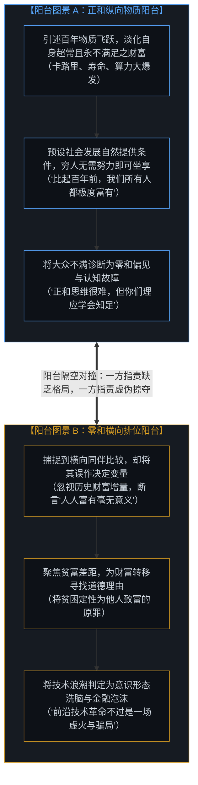
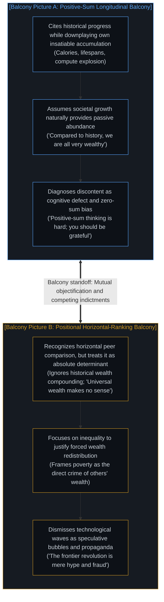
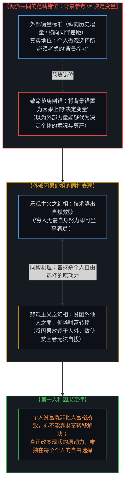
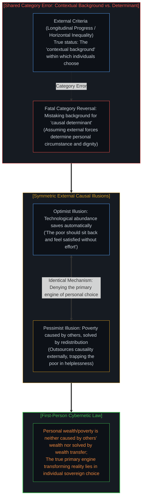
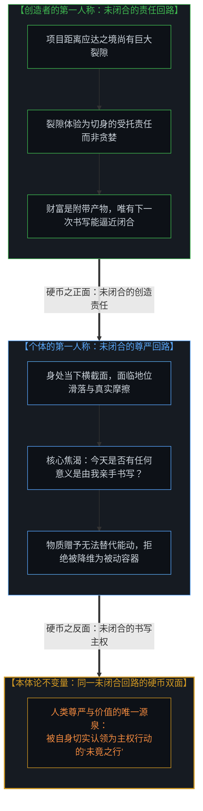
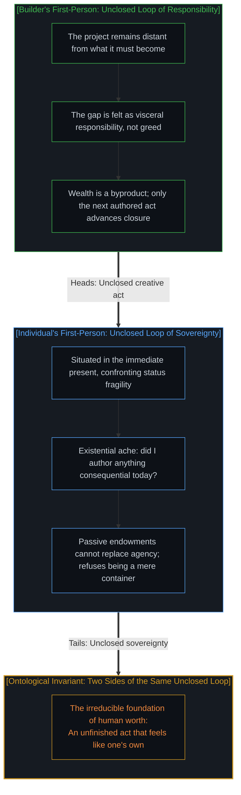
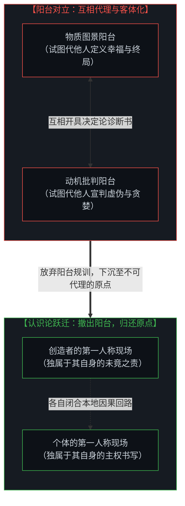
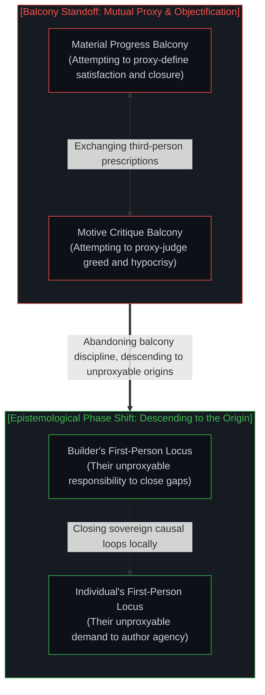

# 阳台视角的规训僭越与不可代理的未竟之行 / The Balcony Disciplinary Overstep and the Unproxyable Act

*为己保留自由却对他施加规训，阳台的对撞唯有降临不可代理的原点方能化解。 / Reserving agency for oneself while disciplining others, balcony clashes dissolve only at the unproxyable origin.*

在社交网络与当代公共讨论中，一场旷日持久的争论反复上演：一方站在物质时间序列的宏大趋势前，宣称全社会已然极度富有，困惑于大众为何迟迟不能对技术红利报以感恩；另一方则报以愤怒的断然否决，指责“人人富有”毫无道理，将技术繁荣斥为资本泡沫与意识形态宣传。这场争论之所以始终陷入死结，是因为双方皆站在第三人称的“阳台”之上俯瞰他者，试图将对方纳入自身的阐释框架进行规训与操控；更隐秘的认识论倒错在于，争论双方皆犯下了同一个范畴错误——把外部的衡量标准从“个人选择的背景参考”错置为了“因果上的决定变量”。无论是技术精英以为外部物质溢出能自然消解贫困，还是批判者认定贫困是他人的罪过且寄望于外部财富转移，两者皆把因果权放逐到了个人之外。唯有真正走出阳台的旁观视角，代入各自未闭合的第一人称行动回路，我们才能看清：真正改变现状的原动力在每个个人的自由选择，人的尊严与自我价值绝非源于被动接受既成事实的奖赏或外部财富的转移，而唯独诞生于那份正在发生、切身体认且不可被任何人代理的未竟之行。

A protracted and recurring dispute dominates contemporary public discourse: one side stands before the sweeping trend-lines of material progress, declaring that society as a whole is already exceptionally wealthy and bewildered by why the populace fails to express gratitude; the other side retorts with fierce rejection, dismissing universal wealth as a logical impossibility and condemning the technological boom as speculative bubbles and ideological propaganda. This argument remains deadlocked because both parties stand on detached, third-person "balconies" looking down at "them," treating the other side as an object to be analyzed, corrected, and steered. More insidiously, both factions commit the identical category error: mistaking external metrics from a "contextual background for choice" into a "causal determinant variable." Whether techno-optimists presume that external material abundance will naturally resolve distress without individual striving, or critics insist that poverty is the crime of others' wealth to be solved via forced redistribution, both outsource the causal engine beyond the individual mind. Only by descending from the balcony and entering the running engine of the first-person causal loop does the truth emerge: the primary engine transforming reality lies in individual sovereign choice; human worth is never derived from passive handouts or wealth transfers, but solely from the felt, ongoing authorship of an unfinished act that can never be occupied by proxy.

---

## 一、 阳台上的两套第三人称图景 / 1. The Two Third-Person Pictures from the Balcony

这场在社交媒体上反复爆发的交锋，在外部观察者眼中，首先表现为两套截然对立的第三人称图景的激烈撞击。正如在 [隐形的上帝之眼](../the-invisible-gods-eye/) 中所揭示的，一旦心智撤退到奥林匹斯山般的阳台俯瞰众生，活生生的人便被抽离了呼吸与具身摩擦，蜕变为坐标系中的抽象数据点。

第一套图景是技术精英所占据的**正和纵向物质阳台**。以具有代表性的科技投资人论调为例，其核心论点是跨越百年的客观物质指标：一百年前同一个生物机体所能获取的卡路里、寿命、照明、医疗与流通算力，在数量级上皆远逊于今日；二十年后的未来亦将大幅超越当下。在这一图景中，“我们所有人比起过去都极度富有”被树立为一个无可置疑的正和博弈事实。然而，这类表面上的乐观主义在极力强调历史巨大进步的同时，却轻描淡写了自身在当前横截面上远超常人、且自身永不满足的财富聚集。他们的深层假设是：社会发展自然会提供充裕的条件，从而穷人不需要通过自身的艰苦探索，即可坐享值得知足的成果。于是，大众持久的普遍不满被他们轻率地诊断为文化层面的认知缺陷——认为公众受困于狭隘的“零和偏见”，或是迟钝于更新自身的参考坐标系（reference class），因而必须接受居高临下的感恩规训。

第二套图景则是网络舆论场中反驳者所占据的**零和横向排位阳台**。面对技术精英的宏大布道，对立面的声音报以冷酷而愤怒的断然否决：“‘所有人都会变得富有’在逻辑上毫无意义；当你在公开场域兜售这种虚妄之词时，它便是不折不扣的意识形态宣传；所谓的人工智能革命，不过是资本推高估值的虚火泡沫与荒谬骗局。”持这一视角的反驳者敏锐且正确地捕捉到：人们在现实生活中多半是通过与身旁同伴的横向比较，来切实感知自身的贫困或富足。然而，他们的致命盲区在于，将这种横向排位视为了不可逾越的决定因素，全然无视了文明演进所积累的庞大财富增量。更深层的动机在于，过度聚焦贫富差距，实质上是在为强行推动财富转移寻找道德借口，把贫困定性为他人致富的罪过。占据这一看台的批判者以揭穿者与受害者自居，用道德指责替代对自身行动回路的构建，将一切技术浪潮贬斥为加剧剥削的谎言。

这两套图景皆带有鲜明的观察性与规训冲动。双方都各自站在发动机熄火的阳台上，用望远镜将对方物化为待定性的客体：一方将对方描绘为“缺乏格局、沉溺于零和嫉妒、急需被开导的蒙昧大众”；另一方将对方描绘为“自肥贪婪、兜售泡沫、进行阶层洗脑的资本机器”。双方隔空互发诊断书与宣判令，试图在舆论场上矫正与操弄对方，却从未有人愿意离开阳台，真正进入生命正在运转的机舱内部。

The recurring clash on social media presents itself, to an outside observer, as a violent collision between two incompatible third-person pictures. As explored in [The Invisible God's Eye](../the-invisible-gods-eye/), whenever the mind retreats to an Olympian balcony, living persons are stripped of somatic breath and friction, reduced to abstract points on an observational grid.

The first picture is the **positive-sum longitudinal material balcony** occupied by techno-optimists. Exemplified by prominent technology investors, its foundational thesis rests on century-scale material expansion: an identical biological organism today commands calories, lifespans, illumination, medicine, and compute far exceeding what was available a century ago, a trajectory poised to accelerate over the coming decades. Within this picture, the assertion that "we are all very wealthy compared to the past" is treated as an undeniable positive-sum reality. Yet while highlighting historical progress, this optimistic posture downplays the commentator's own extraordinary, insatiable wealth accumulation in the present. Its unstated premise assumes that macro societal development will naturally provide comfortable conditions, enabling ordinary individuals to enjoy a satisfying existence without independent striving. Consequently, persistent public discontent is diagnosed as an irrational cognitive defect—an inability to shed cultural "zero-sum bias," or a stubborn lag in updating one's reference class—demanding a patronizing homily on gratitude.

The second picture is the **cynical horizontal-ranking balcony** occupied by adversarial critics across online platforms. Confronted with the techno-optimist homily, this side retorts with furious rejection: "The idea that 'we will all be wealthy' makes no sense; if you spew nonsense, it is propaganda; this artificial intelligence wave is just a speculative bubble and a fraud." Observers here astutely recognize that people experience poverty or wealth primarily through horizontal comparisons with contemporary peers. Their fatal blind spot, however, lies in elevating this positional ranking into an absolute determinant, dismissing centuries of massive material compounding. Their deeper motivation is clear: obsessing over inequality serves as a moral pretext for forced wealth redistribution, treating poverty as the direct crime of others' wealth creation. Occupying this balcony, the critic poses as an unmasker and victim, rejecting technological momentum through moral condemnation and dissecting elite hypocrisy.

Both pictures remain thoroughly observational and disciplinary. Each camps out on its balcony, training telescopic lenses on "them": one side characterizes the public as ungrateful nodes blinded by zero-sum resentment who require ideological correction; the other characterizes builders as self-serving technocrats peddling speculative bubbles to manipulate the masses. Both trade deterministic diagnoses and moral verdicts across the chasm, yet neither descends into the running engine of living experience.

---

## 二、 共同的范畴错位与因果权的外部放逐 / 2. The Shared Category Error and the Outsourcing of Causality

两座阳台的隔空对撞之所以陷入死结，是因为双方皆深陷于对“价值与境遇如何生成”的深层误判。用历史跨度来度量物质财富的累积，描绘客观条件的变迁，这本身并没有错；但这决非大众用来衡量自我价值的方式，甚至宣讲者自己也断然不会用“拥有多少历史物资”来度量自身的存在。强求大众如此衡量自我，不仅脱离了鲜活的具身体验，更掩盖了一个深刻的认识论事实：**表面上剑拔弩张的争论双方，实质上犯下的是同一个范畴错误，差异仅仅在于偏执的方向与程度。**

正如在 [主权抉择的双面性与观察的客体化](../the-two-sided-nature-of-sovereign-choice-and-the-objectification-of-observation/) 中所论证的，争论双方皆把外部的衡量标准——无论是纵向的历史时间序列，还是横向的社会排位差距——当成了因果上的决定变量，而严重无视了它们仅仅是个人做出选择时必须直面的背景参考。

外部的客观环境（无论是历史积攒的科技工具，还是身旁同伴的相对位阶）确实构成了个体行动所不可脱离的现实背景。但背景永远只是背景，它在因果律上断不能代替个人做出抉择，更无法决定由抉择所生成的个人自我价值感。

正是在这一点上，两座阳台展现出同构的因果幻相：
乐观主义者以为，社会生产力的宏观演进自然会向外溢出充沛物资，从而大众不需要凭借自身的探索与承担，便理应感到富足与感恩；
悲观主义者则以为，个体的贫困是他人的富裕所导致的罪过，因而个体的境况只能仰赖外部财富的强制转移来解救。
**两者的潜意识出发点如出一辙：皆误以为人的生存境遇与精神尊严，可以通过外部力量的输入来代理决定。**

由此产生了一条极为残酷的认识论铁律：
**“个人贫富既不是他人的富裕造成的，也不能被他人财富的转移所解决。”**
那些执迷于将一切苦难归咎于外部贫富差距的人，看似在为弱者鸣不平，实则是在认识论上把导致贫困的全部因果权放逐到了贫困者之外。**而恰恰是把原因归结到贫困者之外，全然剥夺了个体认领自身选择的能动性，才让贫困者真正陷入了无法自拔的精神与现实绝境！** 一旦心智深信自身命运全由外部掠夺所操纵，它便主动放弃了作为第一人称因果引擎的杠杆，蜕化为一具只能在看台上无休止宣泄怨恨的空转齿轮。

而技术宣讲者内在模型的本体论分裂，同样加剧了这种死结：
宣讲者自己身家丰沛、掌控庞大资本，其91岁高龄的导师至今仍在商界前线奋战，宣讲者自己亦每周高强度调度资源、创立机构、参与竞争。如果有人用他自己的说辞去规训他：“你拥有的算力与资产已经百倍于路易十四，你现在必须立刻停下所有项目，坐在有空调的房间里感恩知足”，他会毫不犹豫地将这视为对其精神生命的残暴抹杀！因为他切身体认到，让自己早晨从床上爬起来的动力，决不是“我拥有多少历史累积的物资”，而是“今天还有未竟的因果链等待我去闭合”。他对自己采用的是开放的主权书写模型，将每一次不满足体验为神圣的受托责任与探索之火。

然而一旦转向面对大众，他的心智编译器立刻切换到了冷酷的机械决定论模式。他把具体的公众建模成一台“输入-输出状态机”：输入端是智能手机、抗生素与廉价蛋白质，输出端就理应产出“幸福”、“知足”与“温顺”。当状态机的输出出现偏差（公众表现出焦虑与失落），他不仅不反思模型对人性的降维阉割，反而斥责机器本身发生了故障，甚至指责大众缺乏正和思维。宣讲者向大众开出的知足药方，恰恰直接否定了宣讲者自身之所以成为其本人的全部存在前提！正如在 [宏观现象及参数和个人微观选择的因果倒置与利率的命令幻相](../the-summary-first-reversal-and-the-command-of-yields/) 中所解构的，这是试图用第三人称的汇总参数去取消第一人称主权抉择的伪权力幻象。

The protracted deadlock between the two balconies stems from a shared misapprehension of how human value and living circumstance are actually generated. Measuring material wealth across historical scales and charting objective progress is not invalid in itself; but it is simply not how people evaluate their own self-worth, nor does the commentator evaluate their own existence by the historical inventory they command. Demanding that the public assess themselves by such external metrics is an unrealistic epistemic displacement that conceals a deeper truth: **the two ostensibly warring factions commit the identical category error, differing only in degree and ideological direction.**

As analyzed in [The Two-Sided Nature of Sovereign Choice and the Objectification of Observation](../the-two-sided-nature-of-sovereign-choice-and-the-objectification-of-observation/), both sides mistake external criteria—whether longitudinal historical trendlines or horizontal inequality rankings—for causal determinant variables, forgetting that they serve merely as contextual backgrounds within which individuals choose.

External conditions (whether accumulated historical technologies or the immediate status ranking of peers) certainly form the unavoidable terrain of action. But a background is merely a backdrop; in the cybernetics of reality, it can never substitute for personal choice, nor can it dictate the self-worth generated through that choice.

On this pivotal point, both balconies mirror the exact same causal illusion:
Optimists believe that macro technological evolution naturally spills over sufficient goods, so ordinary individuals should feel satisfied and grateful without personal exploration and striving;
Pessimists believe that individual poverty is the crime of others' wealth, so personal deprivation can only be redeemed through external, forced wealth transfers.
**Their underlying premise is identical: both assume that human circumstance and dignity can be externally determined and proxied.**

From this emerges a ruthless epistemological law:
**"Personal wealth or poverty is neither caused by others' wealth, nor can it be resolved by the transfer of others' wealth."**
Those obsessed with blaming poverty on wealth inequality may imagine they are defending the vulnerable, but they are outsourcing the causal engine of reality outside the impoverished soul. **And it is precisely attributing the cause outside the poor that renders them utterly unable to extricate themselves!** Once a mind genuinely believes its destiny is determined entirely by external exploitation, it surrenders its primary causal leverage, decaying into a passive observer stranded on the balcony, perpetually recycling grievances.

Meanwhile, the commentator's internal schizophrenia deepens the divide:
For themselves, they inhabit an open, non-deterministic generative reality. The commentator commands vast capital; their ninety-one-year-old mentor battles relentlessly on the corporate front lines; the commentator works grueling hours orchestrating projects, founding organizations, and competing in global markets. If someone turned their own rhetoric back upon them—demanding: "You possess computing power and living standards hundreds of times greater than Louis XIV; you must immediately halt your projects, sit in an air-conditioned room, and feel grateful and content"—they would experience the command as psychological execution. They know viscerally that what pulls them out of bed is not historical inventory, but an open causal horizon demanding closure. For themselves, dissatisfaction is not an error; it is an honorable stewardship and the fire of exploration.

Yet the moment they turn toward the public, their internal compiler collapses into crude mechanistic determinism. They model the public as a closed input-output automaton: feed in smartphones, antibiotics, and cheap calories on the left, and out must pop gratitude and contented compliance on the right. When the automaton malfunctions—when people express existential angst or political frustration—the commentator does not reconsider their reductionist model; instead, they declare the machine defective, castigating the public for failing to grasp positive-sum thinking. The prescription offered to the public contradicts the very existential ground that makes the prescriber's own life meaningful. As demonstrated in [Macro Parameters, Micro Choices, and the Command of Yields](../the-summary-first-reversal-and-the-command-of-yields/), this is the grand illusion of substituting macro descriptive summaries for living micro sovereign choices.

---

## 三、 双向第一人称模拟与未闭合的行动回路 / 3. Dual First-Person Simulation and the Unclosed Loop

若要实现真正的认知理解而非在舆论场上争抢道德胜负，就必须坚决弃绝阳台上的俯瞰姿态，将第三人称的观察仅作为搭建模拟脚手架的权宜手段。我们必须真正下沉，分别代入对峙双方正在运转的第一人称引擎内部。

首先，代入**创造者的第一人称现场**：
当一位工程师、创业者或制度构建者凝视自己的事业时，现实与设想之间的断裂决非抽象的数据差额，而是一种沉重、紧迫且必须由自身去闭合的“因果责任”。他所承受的焦虑不是占有欲的膨胀，而是系统在重力与物理摩擦下的未完成态；即便财富伴随着成功以副产物的形式滚滚而来，金钱也从未闭合那个悬而未决的因果缺口。能够抚平这种焦灼的，唯有下一次代码提交、下一次电路点亮、下一次主权决断。对创造者而言，活着的体征正在于那份“未竟”。

随后，再代入**听到“技术丰裕说教”的普通人的第一人称现场**：
对于一个生活在当下现实中的具体个体，他的真实参考系不是十九世纪死于肺结核的伦敦织布工，而是他身旁触手可及的邻人、正在被自动化与通胀侵蚀的生活边际、以及那种随时可能坠落的阶层坠落感。更深层的刺痛在于：今天一整天，是否有任何一件具有决定性意义的事物，是由他自己的双手独立构想、书写并闭合的？当精英将一块发光的玻璃屏幕塞到他手中，并宣布“你们已经比古代帝王还要富有”时，个体感受到的不是救赎，而是一种被剥夺感——他的生存被降维为历史成果的“容器”，他的自主性被剥离，他被宣布为历史长河中的被动受益人，因而连表达失落的权利都被剥夺了。正如在 [‘革命’之名将生命归档为证据](../the-name-revolution-files-a-life-as-evidence/) 中所揭示的，被动充当他人叙事的见证物，无法赋予任何生命真正的存在锚点。

当我们同时完成这两套第一人称的具身模拟时，奇妙的相变发生了：**这两套体验不仅没有相互抵消，反而在更深邃的因果底层拼合为同一块硬币的两面。**
它们从同一个未闭合回路的相反两侧，揭示出同一条刚性的本体论不变量：

> **人的内在价值与存在尊严，从不依附于既成结果的被动堆砌，而唯独源自那份被自己切实认领为主权行动的未竟之行（Worth is generated by an unfinished act that feels like one’s own）。**

创造者之所以停不下来，是因为他在未竟的创造中体证着生命；普通人之所以无法被统计数字说服，是因为他在没有书写权的丰裕中窒息。两者的精神痛苦同源同构：没有主权书写权的生命，等同于被判处了认识论死刑。

To achieve authentic comprehension rather than scoring cheap debater points, we must step down from the observational balcony and use third-person diagrams solely as scaffolds for deep simulation. We must immerse ourselves directly inside the running engines of both combatants.

Return, first, to the **builder’s first person**:  
When an engineer, founder, or institutional pioneer surveys their endeavor, the chasm between current reality and the intended state is experienced not as abstract numerical discrepancy, but as an agonizing, exhilarating weight of causal duty. The anxiety they carry is not avarice; it is the friction of an incomplete architecture in a physical world. Even when immense wealth arrives as an incidental byproduct, financial balance sheets never close that open loop. The only gesture capable of soothing the itch is the next commit, the next design cycle, the next sovereign decision. To the builder, the vital sign of conscious life is precisely the condition of being *unfinished*.

Then return to the **ordinary individual’s first person** upon hearing the abundance lecture:  
For an embodied soul navigating the immediate present, their operative reference class is never an 1820s chimney sweep; it is the peer standing alongside them, the precarious edge of local status, and the ever-present hazard of systemic obsolescence. More critically, the core existential wound is somatic: *Did I author anything consequential with my own hands today?* When an elite thrusts a glowing slab of silicon into their hands and decrees, "You are wealthier than an ancient emperor," the recipient experiences not salvation, but disenfranchisement. Their life is demoted to a passive receptacle for someone else's historical telemetry; their personal agency is stripped away, and they are declared unreasonable for even feeling displaced. As established in [The Name 'Revolution' Files a Life as Evidence](../the-name-revolution-files-a-life-as-evidence/), being reduced to a token confirming someone else's triumph strips a human being of an existential anchor.

When both simulations are conducted simultaneously, an ontological phase shift occurs: **these two experiential realities do not cancel each other out; they lock together as two complementary faces of the same coin.** From opposite edges of the same unclosed cybernetic loop, they affirm the identical invariant:

> **Human worth is generated by an unfinished act that feels like one's own.**

The builder cannot stop because their life is animated by the unfinished act; the citizen cannot be pacified by historical charts because they are suffocating in an abundance devoid of personal authorship. Their angst springs from the exact same ontological well: a life without authorship is a slow epistemological strangulation.

---

## 四、 无法被代理占领的原点 / 4. The Unproxyable Origin

因此，这场争论的解构之道，决不在于在两个阳台之间分出高下，挑选一个更为高明的俯瞰位置。正如在 [任务的托付与结果的不可让渡性](../the-delegation-of-the-task-and-the-inalienability-of-consequences/) 中所确立的铁律，任何主权心智的核心体验与因果代价，皆存在着不可跨越的本体论视界边界。

**真正的诊断在于敏锐地洞察：迄今为止，公共场域中的几乎每一声呐喊与反驳，都是从高高在上的阳台上发出的；而那个能让因果回路被真正切身体验的行动原点，在物理和信息论上永远无法被代理所占领（cannot be occupied by proxy）。**

一旦看透了这一层，所有关于历史数字的宏大列举，以及所有关于言行不一的犀利反诘，都在瞬间退居为次要的派生数据。我们不再需要为GDP增长曲线或科技博主的言论做辩护，也不必沉溺于解构精英特权的道德狂欢。

剥离掉所有喧嚣的第三人称伪饰之后，真实的景象极其单纯而朴素：
**场上剩下的，无非是两个同样身处半途、同样被未竟之事所撕扯的心智；他们只是各自误用了一套第三人称的虚构故事，试图去论证为什么对方“理应早就完工并闭嘴”。**

阳台上的布道者试图用物质指标宣告大众的历程已经终结，借此掩盖自己不愿分享生产资料与书写特权的自私；阳台下的对抗者试图用道德审判宣告创造者的追求已经越轨，借此逃避自己在现实阻力中开拓属于自身微观闭环的艰辛。这两者皆是在逃避真正的第一人称因果闭环。

当我们收回那只妄图在阳台上指挥他人的手，重新撤回到自身不可让渡的第一人称原点时，规训的冲动便会自然消解。你不能替他人感到饱足，正如他人无法替你承受未竟之责。走出阳台的规训幻相，把未竟的权利归还给每一个行进中的生命，人类文明的引擎才不会在彼此的傲慢与怨怼中空转，而是在无数个自负其责的主权闭环中，激荡出永不熄灭的生机。

The resolution to this dispute does not consist in adjudicating which balcony offers the superior view. As formalized in [The Delegation of the Task and the Inalienability of Consequences](../the-delegation-of-the-task-and-the-inalienability-of-consequences/), an insurmountable ontological horizon surrounds every sovereign mind's causal feedback loop.

**The definitive diagnostic is to recognize that every argument delivered thus far has been launched from a balcony—and that the only perspective in which the cybernetic loop is genuinely felt is the one that cannot be occupied by proxy.**

Once this is grasped, the recitation of historical metrics and the clever critiques of elite hypocrisy collapse into secondary artifacts. We no longer need to argue over macroeconomic charts, nor do we need to wallow in cynical dissections of billionaire psychology.

Stripped of its third-person polemics, reality stands clear:  
**What remains is two minds, each still in the middle of something unfinished, each using a third-person narrative to rationalize why the other should already be done.**

The preacher on the balcony invokes historical trends to pronounce that the public's journey is complete, thereby evading the reality that people desire agency rather than finished handouts; the critic on the opposing balcony invokes moral indignation to pronounce that the builder's striving is pathological, thereby evading the terrifying burden of carving out their own sovereign locus in the face of physical resistance. Both maneuvers are transparent evasions of first-person causal responsibility.

When we withdraw the intrusive hand seeking to manipulate others from third-person balconies, and anchor ourselves irrevocably within our own unproxyable origin, the disciplinary impulse dissolves. You cannot experience satiety on behalf of another, just as no external observer can bear the weight of your unfinished horizon. Stepping off the balcony and returning the right of the unfinished act to every living mind ensures that civilization's engines cease grinding in mutual resentment, igniting instead the unquenchable vitality of sovereign souls authoring their own destinies.

