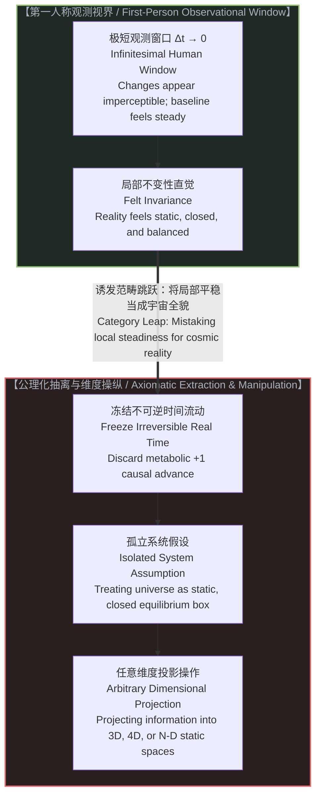
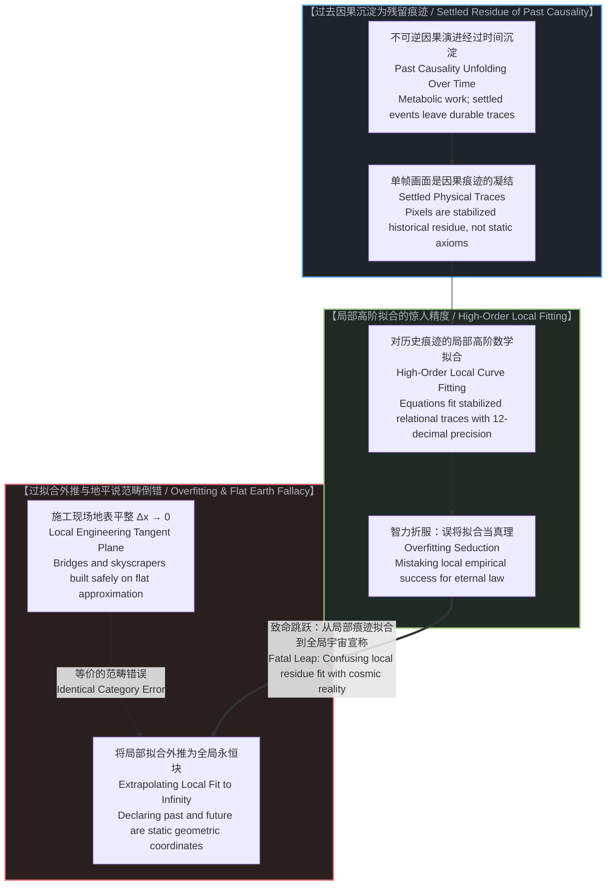
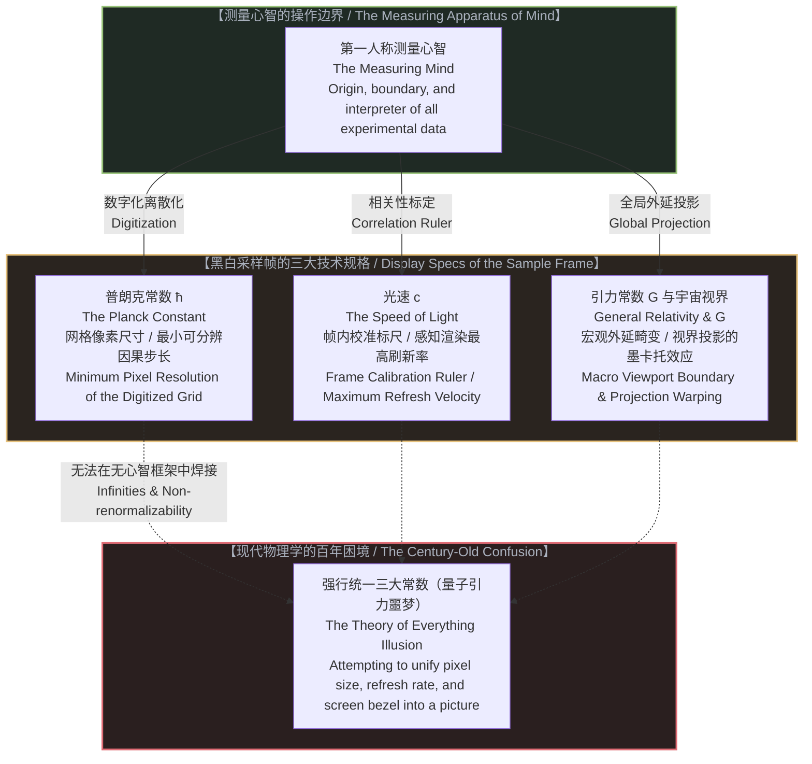
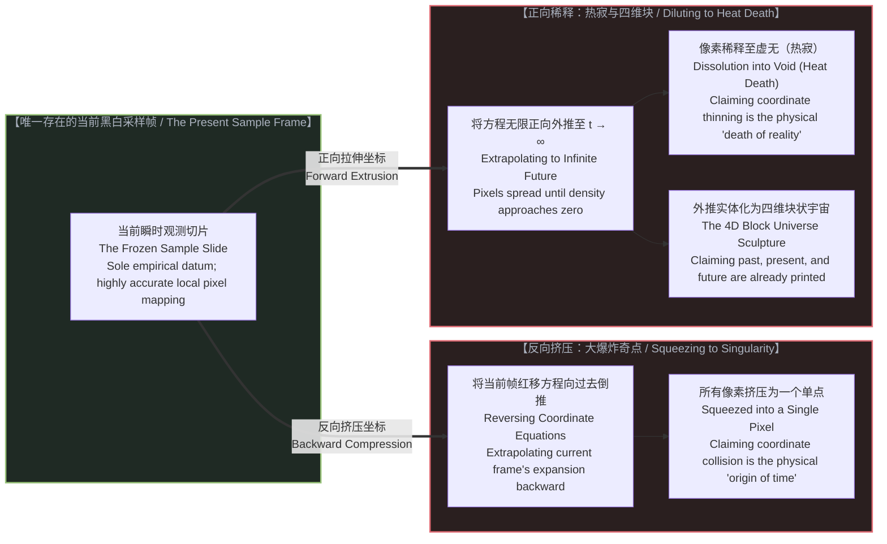
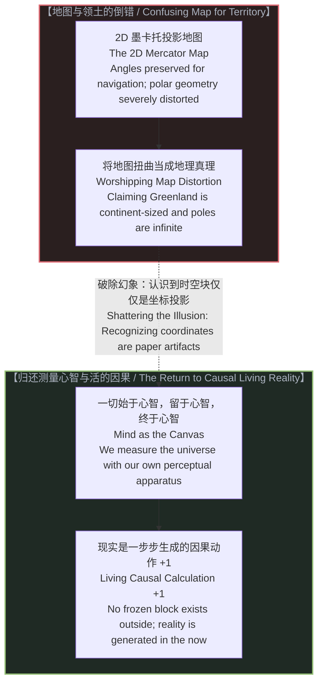

# 黑白采样帧与外推宇宙：物理学如何冻结现实电影并将投影命名为宇宙 / The Black-and-White Sample Frame and the Extrapolated Universe: How Physics Froze the Movie of Reality and Named the Projection the Cosmos

*现实是正在实时向前播放的高动态影像，物理学通过采集极短时间内的相邻帧并进行平滑平均，将这张高度稳定的平均帧当作封闭宇宙并脱色为黑白网格；正因这种不变性在局部即时成立，理论的局部预测才惊人准确，但将局部平均帧外推为四维永恒块，则犯下了现代地平说范畴倒错。 / Reality is a continuous HDR movie advancing in real time. Physics collects its most adjacent frames over an infinitesimal window, averages them out into a stable composite frame, treats it as a closed universe, and desaturates it into an abstract black-and-white grid. Because this invariance holds in the immediate local region, its near-term forecasts are surprisingly accurate—yet extrapolating this time-averaged slice across cosmic infinity commits the modern Flat Earth category error.*

---

## 一、 瞬时不变性与静态宇宙的诱惑 / 1. The Illusion of Instantaneous Invariance and the Static Temptation

在人类极为受限的观测视界内部，宇宙呈现出一种高度稳定的静止感。恒星在夜空中的位置似乎恒定不移，行星沿既定轨道周而复始，重力加速度在日常尺度下保持平稳。在微小的观测时间窗口（Δt 趋近于 0）内，任何实际的科学仪器都必须通过一定的曝光时间来捕获信号——物理学实际上采集的是现实电影中最相邻的若干帧。因为这段时间极其短暂，画面在相邻帧之间保持着高度的相对稳定，感知系统自然而然地将眼前的世界当作一个自足、封闭且孤立的平衡系统。

这种即时感知的局部不变性，诱发了理论物理学历史上最隐蔽的范畴跳跃：如果系统在局部微小时间段内表现得如同静态孤立系统，数学家便顺理成章地将真实的不可逆时间从方程中抽离。一旦排除了真实的因果流动，将现实截取为一个静态切片，任何数学维度的投影操作便都能在纸面上畅通无阻地展开。

正如[双生子佯谬与隐秘观察者](../the-twin-paradox-and-the-hidden-observer/)所揭示的，只要信息在形式变换中保持守恒，符号游戏便能制造出一种“完美宇宙模型”的智力自洽。对于大众而言，这一神话更为坚不可摧。极少有人亲自推导那些庞大复杂的张量方程，人们之所以对大爆炸与四维时空深信不疑，仅仅因为那是学术机构背书的既定常识。然而，正如[共享沙盒的幻象](../the-illusion-of-the-shared-sandbox/)所指出的，所谓既定科学只是特定框架下的低维出清价；即便在顶级理论家之间，不同学派对同一套数学形式的内在理解也截然不同。

---

Within our severely limited observational window, the cosmos exhibits a powerful illusion of stability. The stars appear fixed in the night sky, planets cycle through predictable orbits, and gravitational acceleration remains steady at human scales. Over an infinitesimal baseline (Δt approaching 0), any real scientific instrument requires a finite exposure window to capture signals—physics effectively collects the most adjacent frames of the living movie. Because this exposure interval is exceedingly brief, the image remains relatively stable across these immediate frames, and human perception naturally treats the local environment as a self-contained, closed, and static equilibrium system.

This felt invariance of immediate perception invites the most insidious category jump in theoretical physics: because the local environment behaves like a static, isolated box over brief intervals, mathematicians casually strip irreversible physical time out of their equations. Once living causality is removed and reality is reduced to a frozen slice, arbitrary dimensional projections become child's play on paper.

As demonstrated in [The Twin Paradox and the Hidden Observer](../the-twin-paradox-and-the-hidden-observer/), as long as formal information is mathematically conserved during coordinate transformations, symbolic systems conjure the illusion of a flawless cosmic architecture. For the general public, this myth becomes unassailable. Almost nobody derives the tensor field equations from scratch; people accept the Big Bang and four-dimensional spacetime as established truth simply because academic authority sanctions it. Yet, as detailed in [The Illusion of the Shared Sandbox](../the-illusion-of-the-shared-sandbox/), institutional consensus is merely a low-dimensional clearing price; even among theoretical physicists, different camps interpret the identical mathematical apparatus in wildly incompatible ways.

---

## 二、 从高动态现实到黑白采样帧 / 2. From Continuous HDR Reality to the Desaturated Sample Frame

现实不是一件陈列在玻璃展柜中的几何标本。在真实的生活与物理过程中，世界是一部正在实时向前播放的高动态范围（HDR）电影。每一刻的到来都伴随着不可逆的热力学消耗、代谢应力与新的因果区分（+1）。过去已经沉淀为确定的因果痕迹，未来尚未发生，唯有正在显现的当下拥有本体论上的真实性。

然而，理论物理学的建模过程却执行了一场极其激进的降维剥离。它收集了这部正在播放的电影中最相邻的若干帧画面，由于时间尺度极短，画面呈现出高度的平稳性。物理学随即执行了一次关键的平均化操作：它将这些相邻帧进行统计平滑，抹平所有微观的动态涨落与生机起伏，熔炼成一张高度稳定的“平均帧”。

紧接着，物理学把这一张平均帧设定为一个自足、孤立的“封闭宇宙”。为了使这一帧画面能够被微积分与线性代数所处理，它进一步将画面中所有鲜活的色彩、主观体验与主体性的代谢流动抽干，将其脱色为极度抽象的黑白几何网格。

```mermaid
graph LR
    subgraph LivingMovie["【正在播放的高动态现实 / The Continuous HDR Movie】"]
        HDR["实时向前演进的现实电影<br>Continuous Living Reality<br>Full dynamic range; irreversible metabolic flow"]
        AdjacentFrames["采集相邻帧 Δt 极短<br>Collecting Adjacent Frames<br>Short exposure keeps scene relatively stable"]
        HDR --> AdjacentFrames
    end

    subgraph AveragingAndDesaturate["【平滑平均与黑白脱色 / Averaging & Desaturation】"]
        AverageFrame["相邻帧平均化为复合稳定帧<br>Averaged Composite Frame<br>Smoothing micro-fluctuations into steady state"]
        ClosedUniverse["假定为孤立的封闭宇宙<br>Treated as Closed Universe<br>Assuming local steadiness applies to totality"]
        Desaturate["脱色为黑白抽象网格<br>Desaturating to Abstract Grid<br>Stripping color, consciousness, and metabolic cost"]
        AverageFrame --> ClosedUniverse
        ClosedUniverse --> Desaturate
    end

    subgraph ExtrudedIllusion["【无限外推的几何假象 / The Extruded Geometric Fiction】"]
        ExtrudeTo4D["将黑白平均帧挤压为四维几何体<br>Extruding the Slide into 4D<br>Treating arbitrary curves as physical timelines"]
        ClaimTrueUniverse["宣称外推体才是真实宇宙<br>Claiming Extrusion is Real Cosmos<br>Declaring living movie to be an illusion"]
        ExtrudeTo4D --> ClaimTrueUniverse
    end

    AdjacentFrames ==>|"平均化与孤立封闭假设<br>Averaging & Isolation Assumption"| AverageFrame
    Desaturate ==>|"反客为主：将平均采样帧投射至无限<br>Inversion: Extrapolating averaged slide to infinity"| ExtrudeTo4D

    style LivingMovie fill:#1f2a24,stroke:#98c379,stroke-width:2px,color:#abb2bf
    style AveragingAndDesaturate fill:#2a241f,stroke:#e5c07b,stroke-width:2px,color:#abb2bf
    style ExtrudedIllusion fill:#2a1f1f,stroke:#e06c75,stroke-width:2px,color:#abb2bf
```

在这张黑白采样帧中，只剩下了孤立的点、坐标轴与数值向量。更荒谬的是，物理学不仅满足于对这一单帧进行数学描述，它进而把这一张被高度抽空的黑白幻灯片，沿虚构的时间轴向前后拉伸，制造出一个四维静态几何体，并宣称这个由单一采样帧外推出来的数学挤压体，才是宇宙的全部真相。

正如[时间是因果，不是维度](../time-is-causality-not-a-dimension/)所阐明的，将时间视为第四个空间维度，本质上就是把电影胶片一次性全部摊开在桌面上。但宇宙中没有任何一个人能够站在桌子之外审视整条胶片；你所拥有的全部物理现实，就是放映机光束穿透当前胶片的那一瞬间。

---

Reality is not an inert geometric artifact displayed in a glass museum case. In lived experience and physical action, the universe is a high dynamic range (HDR) movie playing forward in real time. Every tick of the clock brings irreversible thermodynamic dissipation, metabolic stress, and the injection of a novel causal distinction (+1). The past exists only as settled residue; the future is unwritten potential; only the unfolding present possesses ontological reality.

Yet theoretical physics begins its modeling through a violent act of reduction. It collects the most adjacent frames of this unfolding movie over an infinitesimal exposure window. Because the interval is so brief, the scene appears remarkably stable. Physics then performs a decisive averaging operation: it smooths across these adjacent frames, averaging out micro-fluctuations, living flickers, and metabolic noise into a single, highly stable composite "average frame."

Physics then takes this time-averaged frame and treats it as an isolated, self-contained "closed universe." To make this static construct amenable to differential calculus and linear algebra, it strips away the vibrant colors, conscious experience, and metabolic costs of living action, desaturating the averaged frame into an abstract, black-and-white coordinate grid.

On this desaturated sample slide, nothing remains except geometric points, coordinate axes, and numerical vectors. Even worse, theoretical physics does not stop at describing this single frozen slice. It takes this desaturated slide, extrudes it along a fictional temporal axis backward and forward into infinity, and declares that this mathematical extrusion represents the true cosmos.

As articulated in [Time is Causality, Not a Dimension](../time-is-causality-not-a-dimension/), spatializing time into a fourth dimension is the equivalent of unrolling the entire film reel flat across a table. Yet nobody has ever stepped outside the cinema to inspect that tabletop reel. All that physically exists is the projector bulb illuminating the living frame in the present.

---

## 三、 像素级精度的诱惑与局部真理陷阱 / 3. The Seduction of Pixel Precision and the Trap of Local Truth

为何这种极其荒唐的外推能够捕获几乎所有受过高等教育的心智？答案在于局部数学描述那惊人的、令人沉醉的精密度。

一旦把现实冻结在这一张黑白采样帧上，物理学家便拥有了一个确定、封闭的形式系统。在这一张平整的数学底片上，微积分、群论与微分几何展现出了无与伦比的计算威力。理论家能够对这一采样帧内部的每一个像素进行编号、测距，并写下令人叹为观止的对称性方程。从广义相对论对水星近日点进动的微小修正，到量子电动力学对电子反常磁矩多达十二位有效数字的预测，这种在局部采样帧内部对像素属性的精准解构，带来了无与伦比的智力震撼。

需要指出的是，这一黑白残留之所以能够被极其精密地数学建模，其根本原因在于：画面中的每一个像素与结构，都是过去因果动作在时间中沉淀下来的物理痕迹。它们之间存在着需要经过真实不可逆时间才能够形成的因果关联。

正因为这些相邻帧采集并平均出来的物理痕迹，忠实记录了已经发生且高度稳定的局部因果序列，这种不变性在即时与局部的时空区域内是切实成立的。因此，当理论家把这套建立在平均帧基础上的数学模型应用于近距离、短时期的预测时，其结果展现出惊人的准确度——从日食月食的秒级预报，到卫星导航的时钟同步，模型展现出了无与伦比的拟合威力。

然而，这种令人赞叹的精确度，本质上是对已经沉淀的局部相邻历史数据的高阶拟合，绝非对活生生宇宙的全局精确描述。正因为局部不变性在眼前高度成立、预测在手边屡试不爽，物理学家才更容易陷入深层的诱惑：误将针对局部相邻帧平均值的精确拟合，当作了统摄全宇宙过去与未来的先验客观定律，从而毫无防备地跌入了将局部切面外推为永恒实体的过拟合陷阱。

没有人敢于质疑宏大理论的前提，因为任何心智都会被其推导过程的精巧深奥以及局部的精准预测能力所震慑。然而，局部预测的成功，丝毫不能证明该模型掌握了宇宙的整体性质。当它被当作描绘宇宙整体的终极图景时，它犯下的正是与“地平说”毫无二致的范畴错误。

建筑工人在建造摩天大楼或跨海大桥时，将施工现场的地表视为平坦的二维欧氏平面。在局部几百米乃至几公里的尺度内，这种地平近似具有无可挑剔的工程精度，桥梁不会倒塌，高楼巍然耸立。地平说的荒谬在于，古代观察者将这种在局部极度精准的平面坐标系，直接沿着地平线无限向外延展，声称大地是一个飘浮在虚空中的平坦圆盘。

现代物理学在宇宙学上的做法与地平说如出一辙：仅仅因为在 Δt 趋近于 0 的极短观测区间内，黑白采样帧的局部切空间数学极为精确，理论家便大胆地将切线画向了百亿年尺度的过去与未来，宣布宇宙是一座早已完工、所有事件同在的四维静态大厦。这种自信将局部的有效测绘误认作了整体的本体论真理。

---

Why has this reduction captured nearly every educated mind for centuries? The answer lies in the astonishing, seductive precision of local mathematics.

Once reality is frozen onto this single black-and-white sample slide, physicists possess a closed, predictable formal playground. On this static mathematical negative, calculus, group theory, and differential geometry operate with breathtaking power. Theorists can catalog every pixel, assign it exact spatial coordinates, and write down elegant symmetry equations. From General Relativity's subtle correction to Mercury’s perihelion precession to Quantum Electrodynamics predicting the electron's anomalous magnetic moment to twelve decimal places, the mathematical description of pixel relationships within that frozen frame is undeniably spectacular.

What must be pointed out is that the reason this black-and-white residue can be mathematically modeled with such stunning precision in the first place is that every pixel and feature within the frame is a settled physical trace left behind by past causal actions. Between them lie genuine causal relationships that required irreversible physical time to unfold and stabilize.

Because these settled physical traces—collected and averaged across adjacent frames—faithfully record an already-established and highly stable local causal sequence, this invariance genuinely holds in the immediate local region. Consequently, when theorists apply this model to near-term, local forecasts, the predictions are surprisingly and undeniably accurate: from predicting solar eclipses down to the second to synchronizing atomic clocks on GPS satellites, the model demonstrates breathtaking empirical success.

Yet this celebrated precision is fundamentally a high-order local fitting over settled, time-averaged historical residue—it is not a global exact description of the living cosmos. It is precisely because the local invariance holds so reliably in our immediate neighborhood, and because local forecasts succeed so consistently, that physicists fall into the ultimate intellectual temptation: mistaking a local high-order fit over adjacent frames for an eternal, observer-free law governing the entire universe, and projecting a local time-averaged slice across cosmic infinity.

Nobody dares challenge the premise of the grand theory because minds are either intimidated by or infatuated with the intricate sophistication of its derivations and its local empirical precision. Yet local predictive success tells us nothing about the universe as a living whole. When this local sample frame is crowned as the comprehensive architecture of reality, it commits the identical category error as the Flat Earth.

Civil engineers treat the earth beneath a skyscraper or a suspension bridge as a flat, two-dimensional Euclidean plane. Within a local construction site of a few kilometers, this flat tangent plane yields flawless calculations; buildings stand securely and bridges bear traffic safely. The Flat Earth fallacy occurred when early thinkers took that locally reliable flat coordinate system, extended it past the horizon, and declared the entire planet to be a flat disk floating in space.

Theoretical physics makes the identical mistake on a cosmic scale: because the local linear tangent space of spacetime describes solar system dynamics and laboratory particles with extreme precision in the infinitesimal interval Δt → 0, theorists extrapolate that local tangent line billions of years backward and forward, proclaiming that the universe is a frozen four-dimensional block where past, present, and future exist simultaneously. They mistake the local accuracy of their surveying tool for the global geometry of reality.

---

## 四、 三大物理常数：采样帧的边界与标定尺 / 4. The Three Constants: Boundaries of the Sample Frame, Not Containers of Space

在现代物理学的话语体系中，光速 c、普朗克常数 ħ 与引力常数 G 被捧为客观宇宙的三大“终极物理常数”。物理学家视其为客观世界内部的物理围墙，并耗费世纪之功试图将三者拼合成统一的“万物理论”（量子引力）。

从第一人称因果的基底出发审视，这三大常数根本不是客观宇宙外部容器的尺寸参数，而是心智在冻结现实、制作黑白采样帧时所确立的三大操作性技术规格。

### 1. 普朗克常数 ħ：采样帧的像素分辨率
现实本是不可分割的连续流转，但当心智将其捕捉并数字化为一个数学采样帧时，离散化是必然的代价。将连续的动作转化为可计算的符号，必然产生一个不可再分的最小网格单位。
* 普朗克常数正是这个黑白采样帧的“像素大小”。
* 量子力学中所谓的“波粒二象性”、“测不准原理”与“概率波函数”，根本不是微观粒子在客观世界中如同幽灵般分身游荡；那是连续微积分数学试图探查黑白网格两个相邻像素之间的“亚像素虚空”时产生的计算涂抹。你在屏幕上放大一张低分辨率位图，看到的马赛克与模糊边缘并不是图像本身的灵魂，而是显示网格的分辨率极限。

### 2. 光速 c：采样帧的基准校准标尺与最高刷新率
在冻结的单帧切片内部，要描述不同像素点之间的相对运动与相互作用，必须选定一个最高速度作为坐标系的基准标尺。若没有这个上限，所有相对距离与时序都无法在同一张图纸上校准。
* 狭义相对论之所以选择光速作为参考点，是因为光是我们在即时感知中所能捕获的最快物理信号。以宇宙中最快的物理现象作为参考，我们才能测绘所有比它更慢的现象，因为任何慢于被测对象的工具都无法形成有效的时空抓取。
* 光速不是一艘飞船在太空中飞行的最大油门限制；它是心智在感知现实时信号能够完成因果交握的最高刷新速率。光速标定了感知画布本身的响应带宽。

### 3. 广义相对论与引力常数 G：宏观视界的投影畸变
当我们将这一张局部的平坦黑白采样帧，强行扩展到整个宇宙时，我们不可避免地用光了所有的外部参考物。广义相对论将整个宇宙本身作为终极参考背景。
* 当你以整个宇宙作为参照系时，你实际上是在把一个封闭球面的感知边界，硬生生压平在一张二维纸面上。正如我们在二维墨卡托世界地图上看到格陵兰岛被拉伸得比南美洲还大，将平坦采样帧投射到宏观视界边缘时，数学方程必须引入剧烈的空间弯曲与度规张量，以补偿投影造成的失真。
* 空间弯曲不是虚空本身的物理扭曲，它是将局部平坦坐标系强行外推到全宇宙视界时产生的几何代偿。

现代物理学试图通过“弦理论”或“圈量子引力”写出一个将 ħ、c 和 G 焊接在一起的万物理论，这就像试图写出一个将显示器的像素间距、刷新频率和外壳边框尺寸融为一体的方程式，并期望用这个方程来推导正在播放的电影情节一样荒谬。它们是测量工具的硬件技术边界，而非宇宙剧情的内容本身。

---

In mainstream physical discourse, the speed of light c, the Planck constant ħ, and the gravitational constant G are venerated as three objective constants of nature. Theorists treat them as external cosmic fences and spend entire careers attempting to weld them into a unified "Theory of Everything" (quantum gravity).

When traced back to first-person causal reality, these constants are not container walls of an objective universe. They are the operational technical specifications established by the measuring mind when freezing reality into a desaturated sample frame.

### 1. The Planck Constant ħ: Pixel Pitch of the Sample Frame
Living reality is an indivisible, continuous flow. But when the mind captures and digitizes reality into a computable mathematical frame, discretization is unavoidable. Converting continuous causal action into discrete numbers creates a minimum grid unit.
* The Planck constant is the pixel size of the black-and-white sample frame.
* Quantum phenomena—wave-particle duality, uncertainty relations, and probability wavefunctions—do not mean that microscopic particles physically hover in ghostlike superposition. They are the mathematical artifacts produced when continuous differential calculus tries to probe the sub-pixel void between discrete grid points. When you zoom in on a digital photograph until individual pixels appear, the resulting blur is not a mystical property of the photograph's subject; it is the hardware resolution limit of the pixel matrix.

### 2. The Speed of Light c: The Frame Calibration Ruler and Refresh Velocity
Inside a frozen sample frame, mapping relational motion between coordinate points requires choosing the fastest available signal as the benchmark calibration ruler. Without an upper ceiling, relative positions and timings cannot be reconciled on a single diagram.
* Special relativity anchors its coordinate system to the speed of light because light represents the fastest signal correlation accessible within immediate human perception. By anchoring to the fastest moving phenomenon, we can measure and map everything slower, because an instrument slower than the phenomenon it observes could never capture its relational dynamics.
* Light speed is not a mechanical speed limit imposed on physical spaceships; it is the maximum refresh rate at which causal distinctions register in perception. It marks the clock speed of the perceptual canvas itself.

### 3. General Relativity and G: Geometric Warping of the Macro Viewport
When we take this local flat sample frame and project it across the entire cosmos, we inevitably run out of external reference objects. General Relativity buries an unspoken foundational assumption: it uses the entire universe as its ultimate background frame.
* Using the entire cosmos as a self-referential anchor is equivalent to flattening a spherical perceptual horizon onto a flat mathematical sheet. Just as a two-dimensional Mercator map stretches Greenland to appear larger than South America, projecting a flat sample frame across the cosmic horizon forces the mathematics to introduce severe geometric metric curvature to compensate for the distortion.
* Spacetime curvature is not the literal bending of empty space; it is the metric compensation required when a local flat coordinate system is projected across the entire cosmic observational envelope.

Attempting to build a "Theory of Everything" by unifying ħ, c, and G is the exact equivalent of formulating an equation that combines a computer monitor's pixel pitch, its refresh rate, and the physical width of its plastic bezel, and then expecting that equation to explain the screenplay of the movie playing on the screen. The constants are the technical limits of the measuring apparatus, not the living reality being observed.

---

## 五、 无限外推的怪诞戏剧：大爆炸、热寂与块状宇宙 / 5. The Grotesque Drama of Infinite Extrapolation: Big Bang, Heat Death, and the Block Universe

一旦物理学确立了这一张黑白采样帧，并迷恋于其局部的完美像素精度，一场前所未有的宇宙学科幻戏剧便拉开了帷幕。

由于在这张冻结的幻灯片中，空间膨胀被编码为一个关于距离和红移的代数关系式，物理学家便做出了一个极其大胆的举动：他们将这个单帧画面内部的数学轨迹倒放。既然像素之间的距离在当前帧中呈现出分离的趋势，那么沿方程反向推算，所有的像素必然在过去的某一个数学截面上重合。
* 理论家将整部电影当前帧里的所有像素，强行挤压回原点的一个单像素点，然后郑重其事地宣称：这里就是“宇宙的开端”，即大爆炸奇点。

接下来，他们又把这个方程推向未来，让像素无休止地彼此远离。当像素间的距离被拉伸到无限大，信息密度在数学上归零时，他们再次宣称：这里就是“时间的尽头”，即宇宙的热寂。

最后，物理学将这个从单点膨胀到无限虚无的整个数学轨迹，沿第三个空间维度整体重新投影为一个四维柱体，并将这个静态的数学柱体命名为“块状宇宙”。在这个人造的模型中，时间被剥离了其生成的本质，变成了一条条预先刻印在四维晶体内部的静态“世界线”。
* 物理学家甚至反客为主地宣称：真实的电影放映是一种主观幻觉；所有的历史、现在与未来，早就在那个冷冰冰的四维块状宇宙中并存着。

正如[渐近线陷阱](../the-asymptotic-trap/)中所警示的，当一个数学函数在极限处出现奇点时，它揭示的从来不是物理世界的真实边界，而是数学模型自身的破裂与失灵。大爆炸奇点与热寂根本不是宇宙历史的起点与终点，它们仅仅是对一张单帧黑白幻灯片进行极度暴力的坐标外推时，数学符号在纸面上撞毁的残骸。

---

Once theoretical physics established this black-and-white sample slide and fell under the spell of its local pixel precision, a surreal cosmological drama commenced.

Because spatial expansion in this single frozen snapshot was encoded as an algebraic relation between distance and redshift, physicists took an audacious leap: they reversed the mathematical direction of the frame's pixel trajectories. If pixels appear to be separating in the present slide, then extrapolating the equations backward implies they must have converged at some historical coordinate boundary.
* Theorists squeezed every pixel of the current movie frame backward into a single infinitesimal point, solemnly announcing that this coordinate collision represented the physical "creation of the universe"—the Big Bang singularity.

Next, they projected the same equations forward into infinity, letting the pixels drift apart indefinitely. When pixel spacing stretches to infinity and mathematical energy density approaches zero, they declared another cosmic boundary: the "death of time," or the Heat Death.

Finally, physics took this mathematical extrusion—expanding from a single point into infinite dilution—and extruded it along a geometric axis, naming the resulting static sculpture the "Block Universe." In this synthetic toy world, time was stripped of its generative advance and reduced to static worldlines etched inside a frozen four-dimensional crystal.
* Theorists even inverted reality itself, claiming that the real-time playback of the movie is a subjective trick of the human brain, and that past, present, and future are all physically co-present in the static four-dimensional slab.

As warned in [The Asymptotic Trap](../the-asymptotic-trap/), when a mathematical function shoots toward infinity or collapses into a singularity at its limits, it never reveals a physical wall of the cosmos; it reveals the breakdown of the mathematical model itself. The Big Bang and the Heat Death are not bookends of reality. They are the mathematical debris left behind when an abstract, frozen sample frame is violently extrapolated to infinity on a piece of paper.

---

## 六、 归还测量者：从投影神话重返活的因果前进 / 6. Returning the Observer: From Projection Myth to Living Causal Advance

科学的实用性无需被否定。相对论与量子力学如同人类绘制的极其精准的二维地图。墨卡托投影虽然把两极拉伸到了无限大，虽然严重扭曲了陆地的面积对比，但只要航海家严格按照地图上的角度航行，他就能安全抵达彼岸。地图在实用上极度有用，因为它完整地保留了航行所需的所有相对关系信息。

但致命的灾难在于，现代科学的解说者忘记了这只是一张地图。他们指着地图上无限延展的北极边缘说：看，大地的尽头是一堵无限宽广的冰墙；他们指着被拉伸成单点的原点说：看，时间诞生于一个无穷小的像素。

正如我们自始至终所指认的：**我们自始至终都在用心智测量宇宙。一切测量始于心智，停留于心智，最终也结束于心智。**

所谓客观世界的“物理常数”，不是锁闭人类意识的外部铁笼，而是人类心智在展开感知与理性探查时，其自身测量仪器所固有的分辨率与技术带宽。光速是心智感知现实的最高刷新率，普朗克尺度是心智数字化的网格像素，引力场与时空弯曲是把有限视界投影至全局背景时的几何补偿。

宇宙没有被打印在任何一张四维全景胶片上。不存在一个上帝之眼站在万物之外审视全局，也不存在一个静止的宇宙模型能够涵盖整个宇宙的演化。宇宙的全部真实性，就存在于此时此刻每一个生命主体所做出的真实因果决断与不可逆的代谢步进（+1）之中。

不要再崇拜那张被脱色、被冻结、被拉伸至无穷的黑白幻灯片。收回投向虚构四维晶体的敬畏目光，回到正在播放的现实电影之中——在这里，因果是鲜活的画布，选择是不可约的自由变量，而未来正等待着由当下的一笔一划亲手写就。

---

The practical utility of science is beyond doubt. Relativity and quantum mechanics function like extraordinary two-dimensional navigational maps. Although a Mercator projection stretches the polar regions to infinity and severely distorts the physical size of continents, a sailor who navigates strictly by its compass bearings reaches their port safely. The map is immensely useful because it flawlessly preserves the relational angular data required for navigation.

The fatal intellectual tragedy occurs when popular science and institutional academia forget that the map is not the territory. Modern theorists point to the infinite distortion at the top of the map and proclaim: look, the physical edge of space is an infinite wall. They point to the backward convergence of coordinate lines and declare: look, reality was born in a single geometric pixel.

As this lattice of inquiry has consistently demonstrated: **we are measuring the universe with our own mind. Everything begins with the mind, remains within the mind, and concludes within the mind.**

The fundamental constants of modern physics are not iron bars of an external cage trapping human consciousness. They are the operational bandwidth, resolution, and viewport boundaries of the mind's measuring apparatus. The speed of light is the maximum refresh rate of perceptual causal registration; the Planck constant is the minimum pixel pitch of discrete measurement; General Relativity and gravitational metric curvature are the geometric compensations required when projecting a finite observational envelope across a global background.

The cosmos is not printed on an unrolled four-dimensional film strip. There is no external God's-eye camera observing the totality from nowhere, and no static mathematical model will ever capture the open living reality of the universe. The entire reality of the cosmos resides in the present moment, in the irreversible metabolic work and the sovereign causal choices of conscious agents advancing frame by frame (+1).

Stop worshipping the desaturated, frozen, infinitely extruded slide. Turn away from the mythical four-dimensional block universe and return to the living movie currently underway. Causality is the active canvas, choice is the irreducible free variable, and the future is waiting to be authored in the present act.
