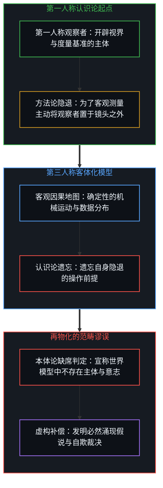
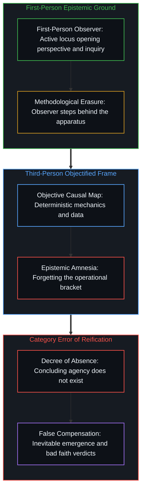
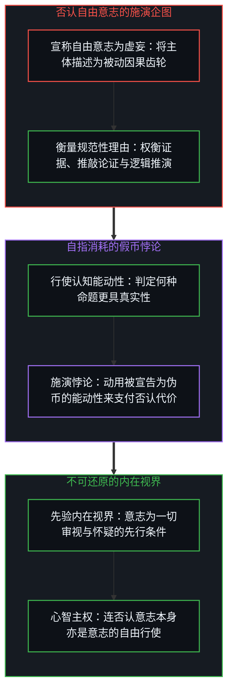
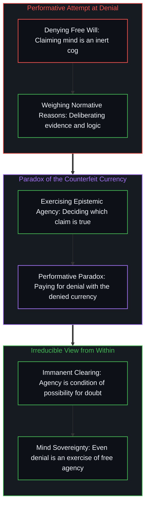

# 框架的盲区 / The Blind Spot of the Frame

*自由意志是不可还原的先行条件，脱离内在视界的裁决皆源于方法论遗忘。 / Agency is an irreducible prior condition; third-person verdicts reflect methodological amnesia.*

在关于人类能动性的长久论争中，机械物理主义与激进存在主义看似针锋相对，实则共享了同样的认识论僭越：二者皆试图盘踞在托马斯·内格尔所命名的“无处之境”，从虚构的超然神位俯瞰宇宙与意识的运转。物理主义宣称自由意志是在系统复杂度升级中迟早出现的“必然涌现”，试图在因果机械的下游为意志颁发通行证；而以让-保罗·萨特为代表的存在主义，则将否认意志者判定为逃避自由重负的“自欺”，以全知的道德法官姿态自居。然而，自由意志既非由客观演化恩赐的下游产物，亦非任由外部法庭裁决的真诚度度量；意志是不可还原的使能前提。要看清这一点，必须揭示出现代认识论的戏法：为了建立可复现的模型，观察者在方法论上退出了视域，却随后患上了将方法论隐退误作本体论缺席的健忘症。

Across the enduring debates over human agency, mechanistic physicalism and radical existentialism appear fundamentally opposed, yet commit the identical epistemological transgression: both smuggle in what Thomas Nagel diagnosed as the "view from nowhere," pretending to occupy an Archimedean perch outside lived reality to survey cosmos and consciousness alike. The physicalist decrees free will an "inevitable emergence" born of escalating systemic complexity, attempting to sanction volition as a downstream byproduct of clockwork mechanics; existentialism, typified by Jean-Paul Sartre, indicts those who disclaim agency as guilty of "bad faith" (*mauvaise foi*), adopting the posture of an omniscient moral tribunal. Yet free will is neither an evolutionary grant issued by unthinking nature nor an authenticity score judged by an external magistrate; volition is an irreducible prior condition. Unpacking this requires exposing the sleight of hand at the foundation of modern inquiry: the observer methodologically stepped behind the recording apparatus to forge reproducible models, only to contract the metaphysical amnesia that mistakes methodological omission for ontological absence.

## 一、 旁观者的双重自白与无处之境 / 1. The Twin Confessions of the Spectator and the View from Nowhere

机械决定论者与存在主义者虽然在结论上南辕北辙，但在思维姿态上却展现出惊人的一致性，他们都预设自己能够脱离具身的观察现场，获得一种不受透视法约束的终极全知。物理主义者凝视钟表般精密运转的因果网络，急于消除第一人称体验给确定性图景带来的困扰，因而宣称只要物质的组合结构达到特定临界点，自由意志便会作为一个功能性模块被必然催生出来。这一假定看似对主观体验展现了宽容，实则是将意志降格为无生命物质在时间长河中翻滚出的泡沫。与此相对，萨特看到了人不能被物化的自由内核，却在面对怯懦退缩的个体时断言对方陷入了自欺，仿佛审判者能够悬浮在他人的头颅之上，看穿其幽暗意识深处未曾言说的自我逃避。

Mechanistic determinists and existentialists reach opposite verdicts, yet adopt an identical intellectual posture: both presume an escape from the embodied site of observation to claim an unconstrained, transcendent vantage point. The physicalist surveys the clockwork web of causation, eager to eliminate the friction that first-person experience poses to closed certainty, and declares that once structural complexity crosses a critical threshold, free will inevitably emerges as a functional submodule. This maneuver appears generous toward inner life, yet reduces agency to an epiphenomenal foam churned up by inanimate matter tumbling through cosmic time. Conversely, Sartre grasps that consciousness resists reification into an inert object, but when confronting the retreating actor, he proclaims a diagnosis of bad faith, hovering above the agent's interiority as if an external judge could penetrate hidden motives and certify evasive self-deception.

在这两种貌似深刻的理论建构背后，潜伏着对自身观察位置的严重掩盖。无论是宣告能动性是宇宙演化的既定终点，还是将怀疑自由视作道德懦弱的伪装，两者都悄悄僭取了[远方的轮廓与无处之境的清单](../the-distant-silhouette-and-the-inventory-from-nowhere/)中所批判的阿基米德支点。他们假定存在一个既不依附于任何具体视界、又囊括了所有可能事实的超然账本，并在其中为人类的自由意志标定真伪。正是这种将观察者抽离出世界的幻象，切断了认识论与存在者的具身关联，使得能动性问题退化为无休止的经院口角。

Beneath both elaborate constructions lies a persistent concealment of the observer's own coordinates. Whether declaring volition a predetermined terminus of cosmic evolution or dismissing skepticism toward freedom as moral cowardice, both illicitly claim the Archimedean perch dissected in [The Distant Silhouette and the Inventory from Nowhere](../the-distant-silhouette-and-the-inventory-from-nowhere/). They presume a transcendent ledger detached from situated vantage points that catalogs reality, attempting to score human volition from without. This fantasy of excising the observer from the observed cosmos severs epistemology from embodied reality, degrading the inquiry into volition into endless scholastic dispute.

## 二、 方法论的隐退与本体论的遗忘 / 2. Methodological Erasure and Ontological Amnesia

人类建立客观认知的大厦，始于观察者主动而审慎的退后。为了校准星体运行的轨迹、平衡热力学方程或测绘神经回路的生电节律，主体必须自觉撤出感知的中央舞台，隐匿到记录仪器的遮光罩背后。恰如相机在捕捉风光时不能将自身的镜头镶嵌在底片中心，眼睛在审视原野时亦不可能将瞳孔本身置于视野之内。路德维希·维特根斯坦在《逻辑哲学论》中精准指出了这一几何学界限：主体并不属于世界，而是世界的界限。这一隐退并不是认知能力的缺陷，而是构建第三人称、可复现科学模型的先决条件；正因为心智拥有将自身透明化、将意向性投射于外部客体矩阵的构造能力，自然哲学与严密逻辑才得以生根发芽。

The edifice of objective knowledge begins with the observer's deliberate withdrawal into the background. To track planetary trajectories, balance thermodynamic equations, or map neural firing patterns, the subjective investigator must step behind the recording apparatus. A camera cannot capture a landscape if its own lens monopolizes the negative; an eye cannot survey a valley while demanding to see its own retina within the field of view. Ludwig Wittgenstein pinpointed this geometric boundary in the *Tractatus*: the subject does not belong to the world, but is rather a limit of the world. This bracketed withdrawal is no defect of cognition, but the operational prerequisite for articulating reproducible, third-person models; natural philosophy and formal logic flourish precisely because consciousness can render itself transparent, projecting its gaze outward onto matrices of objects.

然而，现代思想的严重危机恰恰爆发于观察者遗忘了这一方法论戏法的时刻。当研究者借助人为剔除主观性的方法，成功拼装出一幅严丝合缝、运转顺畅的因果决定论图景后，他竟然转过身来审视这张完整的蓝图，并宣称在由数据和规律铺设的宇宙中找不到任何主观意志的踪迹。这种倒果为因的荒谬，宛如一位制图师为了清晰标示山川道路而刻意不把自己的身躯画在羊皮纸上，待地图完工后，却指着图纸坚称世间并不存在制图师。将方法论上的自觉省略错判为本体论意义上的真实缺席，是心智在客体化狂热中铸就的严重范畴谬误。在[寻觅的语法与淡出的观察者](../the-grammar-of-finding-and-the-fading-observer/)中，心智已经领教过这种将先验条件误作可消除冗余的盲动；在[割点可移不可除](../the-cut-moves-but-never-vanishes/)中，冯·诺依曼测量链条表明割点无论如何向后退移，观察位置可以任意滑动却无法消解；而在[不可还原的观察者](../the-irreducible-observer/)的视野下，任何试图从被测度的客体链条中抹杀度量原点的企图，都注定使理论退化为空洞的无源之水。

The modern crisis erupts the moment the investigator forgets this operational maneuver. Having methodologically banished subjectivity to construct a deterministic blueprint, the theorist inspects the completed schema and proclaims that volition is nowhere to be found in the cosmos. This reversal resembles a cartographer who omits his own figure to keep topography legible, only to inspect the parchment and conclude that cartographers do not exist. Mistaking methodological omission for ontological absence is an egregious category error forged in the fever of reification. The Mind confronted this impulse in [The Grammar of Finding and the Fading Observer](../the-grammar-of-finding-and-the-fading-observer/), where enabling conditions were mistaken for dispensable clutter; in [The Cut Moves but Never Vanishes](../the-cut-moves-but-never-vanishes/), the von Neumann chain demonstrated that while the cut can be displaced arbitrarily along the measurement sequence, the locus of observation cannot be dissolved; similarly, within [The Irreducible Observer](../the-irreducible-observer/), attempting to erase the origin of measurement from the recorded chain reduces theory to groundless abstraction. This structural amnesia constructs an artificial enclosure, stranding theoretical intellect inside a blind spot of its own making.

## 三、 认识论遗忘的双生症候：必然性与自欺 / 3. The Twin Symptoms of Epistemic Amnesia: Inevitability and Bad Faith

面对被自己抽空了能动性的机械宇宙，物理主义范式必须找到一种说辞，把被逐出大门的意志偷偷迎回后院，其最心仪的避难所便是“复杂系统涌现论”。物理主义者宣称，只要给予演化充分的时间、能量流注与计算组织阶梯，自由意志便会在生物神经系统的顶端必然破土而出。这一推演的破绽在于其隐含的视角错位：若要宣称某种结局具有必然性，叙述者必须预先站在时间的尽头，假想自己超脱于整个宇宙历史之外，对演化轨迹进行全知式的俯瞰。试图用无意识物质的因果堆叠推导出能够赋予因果以意义的意志，等同于妄图从一幅油画中推导出一只真实的眼睛，而这只眼睛恰恰是当初挥动画笔的存在。在[主体性不曾涌现](../agency-does-not-arise/)的深层审视下，涌现从来不是主体性的源头，而是第三人称模型无法消化第一人称事实时编造的叙事补丁。

Confronted with a mechanical cosmos artificially emptied of agency, physicalism must devise a rationale to smuggle volition back into the scene, finding its favored shelter in the doctrine of emergent complexity. The physicalist contends that given sufficient evolutionary time, metabolic flow, and computational layering, free will was an inevitable threshold of neural organization. The flaw in this deduction lies in its smuggled vantage point: to pronounce an outcome inevitable, the narrator must stand outside cosmic time, peering down upon evolutionary trajectories from an impossible terminus. Attempting to derive the meaning-bestowing agent from the causal stacking of unthinking matter is equivalent to deriving the living eye from the canvas, when that eye held the brush that painted it. As demonstrated in [Agency Does Not Arise](../agency-does-not-arise/), emergence is not the origin of subjectivity, but a narrative patch invented when third-person models fail to ingest first-person reality.

而在天平的另一端，激进存在主义陷入了对称的评判盲区。萨特清醒地洞察到人的存在先于任何既定设定，深知将自身托庇于环境、基因或命运的借口是对自由的背弃，并将其严厉诊断为自欺。然而，这种裁决同样悄无声息地预设了无处之境的神圣裁判席。宣告另一个主体正处于自欺之中，要求裁决者凌驾于对方的心智幽微之上，宣称自己比当事人更清楚其内心深处的明知故犯。如此一来，本应属于具身体验的张力被物化为第三人称道德法庭的指控，存在主义蜕变为了外在化的教条。萨特未能察觉的是，所谓的自欺恰恰是方法论遗忘在个体生活中的直接苦果：那个宣称自己毫无选择、任凭命运摆布的个体，正是过度内化了第三人称机械视角的受害者，他把相机拍摄的客体画像当成了自我的全部真相。

At the opposite pole, radical existentialism falls into a symmetric evaluative blind spot. Sartre recognized that existence precedes essence, understanding that seeking shelter behind environment, heredity, or destiny disavows freedom, which he indicted as bad faith. Yet this verdict quietly relies on the same courtroom from nowhere. To diagnose another agent as acting in bad faith demands hovering above their interiority, claiming deeper insight into their unacknowledged evasions than they possess. In doing so, a tension belonging to living experience is transformed into an external moral tribunal, degrading existentialism into detached dogma. What Sartre overlooked is that bad faith is the lived consequence of original epistemic amnesia: the individual claiming to be a helpless cog tumbling through causal chains has simply internalized the camera's gaze, mistaking an objectified snapshot for the whole living Self.

在[约束的基底与自由的自否](../the-substrate-of-constraint-and-the-self-denial-of-freedom/)中，行动者正是通过拥抱具体的阻力才确立了自由的坐标；而一旦将自由剥离为凌空蹈虚的空中楼阁，或者将阻力固化为消解意志的铁律，心智便会在必然涌现的傲慢与指责自欺的苛刻之间陷入无休止的摇摆。在[无人能持有的功能主义](../the-functionalism-no-functionalist-can-hold/)中，理论家在宣称心智不过是算法的同时，依然无法放弃自身对论证有效性的坚信。这双重症候表明，只要思想执迷于从外部视角为能动性奠基，就注定在自我制造的幻象中原地打转。

In [The Substrate of Constraint and the Self-Denial of Freedom](../the-substrate-of-constraint-and-the-self-denial-of-freedom/), the actor establishes coordinates of freedom precisely by engaging tangible resistance; once freedom is abstracted into unanchored weightlessness, or resistance dogmatized into causal closure, thought oscillates between the arrogance of inevitable emergence and the severity of diagnosing bad faith. As shown in [The Functionalism No Functionalist Can Hold](../the-functionalism-no-functionalist-can-hold/), theorists who reduce mind to algorithmic state-transitions continue to rely on sovereign conviction regarding the validity of their proofs. These twin symptoms reveal that seeking external validation for agency traps inquiry within self-generated illusions.

## 四、 否认的施演结构与不可还原的内在视界 / 4. The Performative Architecture of Denial and the View from Within

这正是为何自由意志问题不能由任何外部宣告予以解决：自由意志是不可还原的。称其不可还原，并不是将其抬高为某种隐藏在物理机器内部的神秘灵质，亦不是将其奉为演化终点的神圣奖赏，更不是将其作为道德评判的计分板。不可还原性意味着，意志是所有感知、审视、求证、否认与裁决得以展开的不可逃逸的先行条件。它不是被观察的对象，而是使观察得以可能的视界本身。

This demonstrates why agency cannot be resolved through external declarations: free will is irreducible. To deem it irreducible is neither to elevate it into a ghost inside the machine, nor to celebrate it as a teleological trophy of evolution, nor to treat it as an external scorekeeper's ledger. Irreducibility signifies that volition is the inescapable condition of possibility for all perception, deliberation, demonstration, denial, and judgment. It is not an empirical object waiting to be discovered, but the immanent clearing that makes observation possible.

审视那些试图否认自由意志的理论家在行动中的施演结构，便能清晰看到这种不可还原性：当一位决定论者查阅神经科学数据、权衡相互冲突的假说、字斟句酌地组织论文，并公开宣称人类的选择只是机械错觉时，他究竟在做什么？他在衡量规范性理由，他在判定哪一个命题比另一个更接近真实，他在行使无可辩驳的认知能动性。哪怕在宣称自己毫无自由的瞬间，他也必须调集注意力、维持连贯的意图，并主动对结论作出价值承诺。试图否定自由意志的人，正是在挥霍着他试图判定为伪币的同一种通货。在[自由意志的自否自由](../the-freedom-of-will-to-deny-itself/)中，心智所展现的最高悖论正在于此：即便一个人坚决主张自己没有自由意志，他否认意志的行为本身，依然是意志不可剥夺的自主行使。

Examining the performative architecture of denial exposes this irreducibility: when a determinist analyzes neurological scans, weighs rival hypotheses, crafts scholarly prose, and argues that choice is an illusion, what are they doing? They are weighing normative reasons, determining which proposition is truer, and exercising undeniable epistemic agency. Even in the act of declaring oneself unfree, the speaker must marshal attention, sustain intention, and evaluate conclusions. Denying free will requires spending the exact currency declared counterfeit. In [The Freedom of Will to Deny Itself](../the-freedom-of-will-to-deny-itself/), the Mind's central paradox is revealed: even when adamantly asserting the absence of free will, that denial remains an undeniable exercise of free agency.

与“必然涌现”的宇宙学野心以及“自欺裁决”的道德优越感不同，认识到自由意志的不可还原性，毫不需要任何无处之境的借力。它既不强求人们脱离宇宙历史去俯瞰因果链条的开端与终局，亦不要求人们侵入他人的心灵幽室去测量真诚的纯度。它始终立足于内在视界，也就是那个所有怀疑、验证、痛苦与决断得以发生的原初现场。自由意志从来不是被客观世界证明或者赐予的属性，而是每一个具有自我意识的心智在当下受力与行动中无法剥离的生存基底。

Unlike the cosmic ambition of "inevitable emergence" or the moral superiority of "bad faith verdicts," acknowledging irreducibility requires no leverage from nowhere. It neither demands stepping outside history to inspect cosmic causal chains, nor requires penetrating another mind to quantify authenticity. It operates within the view from within—the immanent site where all doubt, verification, friction, and decision transpire. Free will is never a property conferred by third-person models, but the inseparable baseline through which conscious minds deliberate and act.

## 五、 重返不可消除的第一人称源头 / 5. Reclaiming the Irreducible First-Person Origin

关于自由意志的现代纷争之所以旷日持久且令人疲惫，根源在于心智执意要在被观察的疆域内部搜寻那个正在执行观察的主体。第三人称的客观性图景是一项辉煌而珍贵的智力发明，然而这项工具始终是由身处第一人称视界中的具体主体锻造而成的。当工具被磨砺得锋利无匹，心智却反被工具的倒影所迷惑，以为只有能够被摆上实验台被动解剖的客体才配拥有存在的资格。

The modern debate over free will has proved exhausting because thought insists on searching for the observer inside the observed field. Third-person objectivity remains a profound intellectual invention, yet this tool was forged by a subject situated within a first-person perspective. When the tool grew immensely powerful, the Mind became enchanted by its reflection, concluding that only objects passive enough to be dissected on an experimental bench qualify as real.

一旦遗忘了主体为了让测量成立而主动退居幕后这一初始契约，心智就会堕入自造的框架囚牢。我们或者跌入机械主义的傲慢，把鲜活的意志贬低为复杂计算巧合下的涌现戏法；或者跌入存在主义的苛责，把他人面对重力与历史的彷徨机械地归咎为道德自欺。摆脱这种无休止消耗的唯一出路，是重温维特根斯坦的洞见，承认意志的不可还原性：意识无法脱离自身的皮肤去在无处之境审视自己，能动性的使能前提不是我们可以绕到其背后或者跳出其上方的客体对象。即使心智竭尽全力想要跨出自身去否定自由意志，这一跨步本身，也始终是在内在视界中稳稳踏下的自由足迹。

Forgetting the pact by which the subject stepped behind the apparatus imprisons the intellect within an artificial frame. We oscillate between mechanistic arrogance that dismisses volition as a trick of emergent computation, and existentialist severity that reduces human struggle against constraint to bad faith. The path beyond this exhaustion lies in honoring the insight that agency is irreducible: consciousness cannot climb outside its own skin to observe itself from nowhere. The enabling presence of volition cannot be bypassed or surveyed from above. Even when the Mind expends every intellectual resource to disclaim free agency, that very denial remains a sovereign step taken from within.
