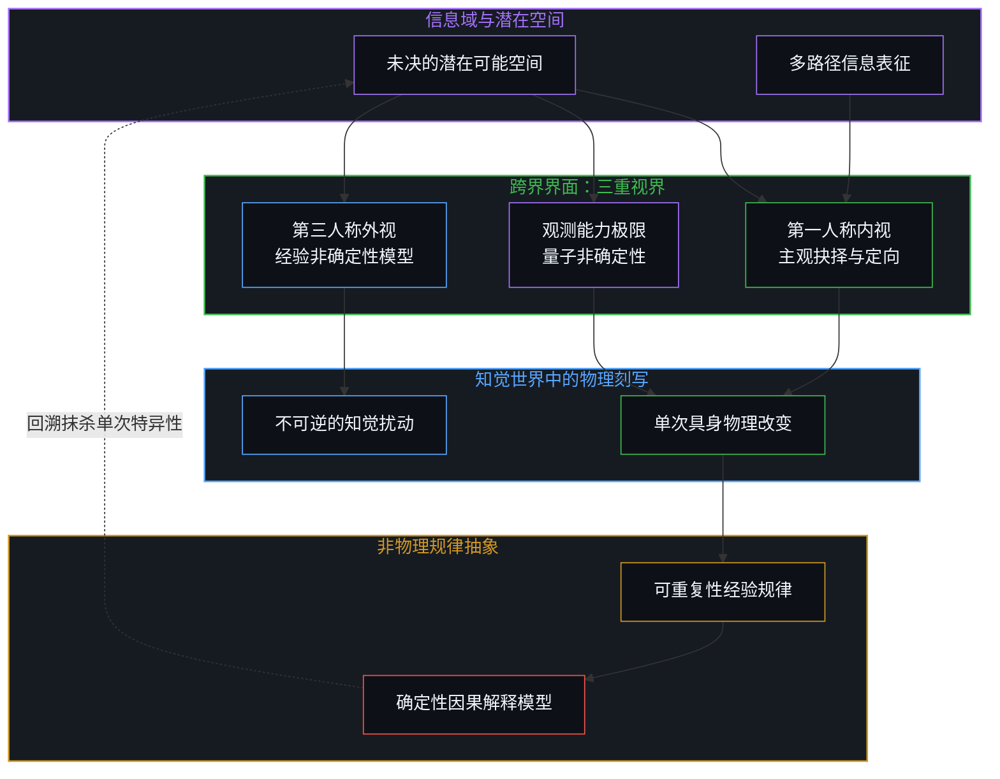
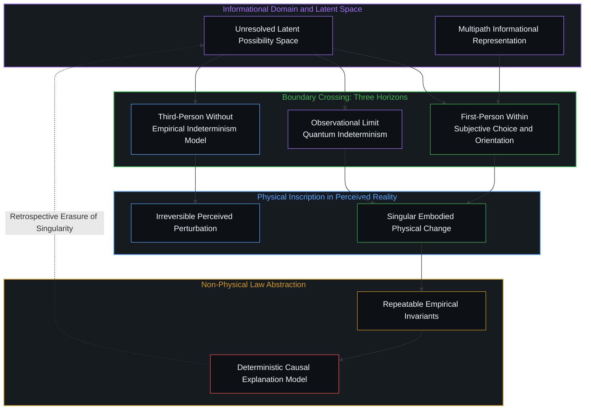

# 抉择的跨界 / The Boundary Crossing of Choice

*从内是主观抉择，从外是非确定性，在观测极限则是量子非确定性 / Felt within as subjective choice, observed without as indeterminism, and met at the observational limit as quantum indeterminism*

当还原论断言自由意志毫无意义时，它实际上默认了一套将可重复性等同于真实性的认知偏见。科学规律为了达成因果解释，必须剔除特定时空点的单次特异性，因而任何能够被充分讲得通的因果模型，结构上都是抽离了具体物理刻写的信息抽象。反过来，被判定为虚妄的主观意志，恰恰是实在界中唯一把信息层面的潜在可能坍缩为知觉世界中单次、具体物理改变的驱动力量。从信息跨越至物理的边界，在第一人称内部体验为主观抉择，在第三人称外部被建模为非确定性，而在物理观测能力的极限界面处，则精确呈现为量子非确定性。

When reductionism declares that free will makes no sense, it quietly smuggles in a bias that equates intelligibility with repeatable abstraction. A scientific law can explain phenomena only by stripping away the unrepeatable particularity of specific historical moments, meaning that deterministic models are themselves non-physical abstractions of change that possess no singular physical weight. Conversely, sovereign agency, often dismissed as an illusion, is the only dynamic that resolves latent informational possibilities into concrete, irreversible physical modifications within perceived reality. This non-deterministic crossing from information to physical expression is experienced from within as subjective choice, modeled from without as indeterminism, and registered at the very frontier of observational resolution as quantum indeterminism.

---

## 一、 意义的可重复性与物理的单次刻写 / 1. The Repeatability of Sense and the Singular Inscription of the Physical

在关于自由意志的争辩中，机械决定论常常以一种居高临下的姿态发问：如果一个选择不能被还原为先前因果链条的必然结果，它如何在理智上讲得通。这种质问所依赖的标准，本身隐藏着深刻的认识论倒错。所谓讲得通或者合乎理性，在实证科学的语境中几乎总是与可重复性捆绑在一起。一个假说要成为定律，一项实验要确立为客观事实，必须保证在相同的初始条件下能够被无差别地再现。然而，可重复性是一柄双刃剑，它在赋予理论预测力的同时，要求研究者通过抽象将每一次事件中独特的时空烙印与不可逆的特异细节削减殆尽。

物理学所描述的力学方程与状态转移矩阵，从未等同于物理世界本身。它们是认知模型为了在变动不居的经验流动中截获稳定结构而建立的信息表征。牛顿定律不关心具体某一片树叶落地的具体撕裂声，热力学方程也不在乎特定分子碰撞时的历史痕迹；科学定律所捕捉的，恰恰是脱离了任何单次物理事件特异性的守恒量与对称性。换言之，那些被还原论者奉为世界基石的因果必然性与可重复规律，本身全都是非物理的概念抽象。它们在本体上属于无实体的数学关系网，是对无数种可能路径所提取的统计等价类。

吊诡之处恰恰在此处显现。当决定论者声称自由意志缺乏理智上的意义时，他们其实是在指责主观抉择无法被收编进这种非物理的可重复抽象之中。可是，如果我们转向行动者当下的经验世界，情况便呈现出截然相反的图景。自由意志下的每一次抉择，不是概念游戏，而是直接对知觉世界施加不可逆的物理改变。当行动者决定开口说话、伸手拾起杯子、或者在纸上签下名字时，神经系统的特定脉冲释放、肌肉纤维的收缩、空气分子的振动以及纸张纤维的受力形变，都在物理历史上留下了独一无二的具身刻写。

这一事实构成了还原论叙事无法回避的讽刺。正如在 [自由意志的自否自由](../the-freedom-of-will-to-deny-itself/) 中所揭示的，当一位哲学家对着录音设备慷慨陈词，宣称自由意志不过是脑神经递质编织的虚妄假象时，他正在动用极其复杂的生理机制进行精密的生物做功。他调动肺部气流振动声带，在空气中制造出一串特定波长的机械声波，以单次发生的物理动作向世界投送信息。这个发声动作本身是一个不可磨灭的具体物理事实，而它承载的语义内容，却试图论证产生这一物理事实的主观意志毫无意义。他动用了不可重复的具身物理改变，仅仅为了布道一个抹杀了物理单次性的非物理概念抽象。

In debates surrounding free will, mechanistic determinism often assumes a condescending posture, asking how a choice can make sense if it cannot be shown to follow necessarily from prior causal antecedents. This demand conceals a profound epistemological dislocation. What is deemed intelligible or rational within empirical science is almost universally tied to repeatability. For an observation to become a law or an objective fact, it must demonstrate invariance across repeated trials under identical starting conditions. Yet repeatability is a double-edged sword: while it grants predictive power, it achieves this by aggressively stripping away the unrepeatable historical particularity and irreversible details of any singular event.

The equations of motion and state-transition models formulated by physics are never identical to physical actuality itself. They are informational representations constructed by cognitive agents to secure stable invariants within the flux of experience. Newton's laws do not register the singular acoustic snap of a specific falling leaf, nor does thermodynamics track the individual collisions of particular gas molecules. What physical laws capture are symmetries and conservation quantities deliberately abstracted away from any singular physical occurrence. The deterministic necessity celebrated by reductionism consists of non-physical conceptual abstractions. These models inhabit an immaterial space of mathematical relations, delineating statistical equivalence classes over conceivable trajectories.

Here lies the supreme irony of the reductionist stance. When determinists claim that free will makes no sense, they are objecting that subjective choice cannot be subsumed within this non-physical, repeatable schema. If we return to the lived experience of the agent, the landscape inverts completely. Every choice made under sovereign agency is not an abstract concept; it introduces an irreversible physical alteration directly into perceived reality. When an agent decides to speak, reaches out to grasp a tool, or inscribes a signature, the coordinated firing of motor neurons, the contraction of muscle tissue, the compression of air waves, and the deformation of fibers constitute a singular, unrepeatable physical inscription in the history of the world.

This exposes the performative contradiction haunting deterministic rhetoric. As demonstrated in [The Freedom of Will to Deny Itself](../the-freedom-of-will-to-deny-itself/), when an intellectual speaks into a microphone to argue that free will is a biological illusion, they mobilize vast physiological machinery to perform meticulous biological work. They draw breath, vibrate their vocal cords, compress ambient air into structured acoustic waves, and project physical marks into the room. This act of vocalization is an indelible, concrete physical event. Yet the semantic claim conveyed by those waves insists that the agency producing them is nonexistent. The determinist expends irreplaceable physical work to proselytize a non-physical abstraction of repeatability that denies the singular actuality of their own expression.

---

## 二、 跨界界面的三重视界 / 2. The Three Horizons of the Boundary Crossing

自由意志既不是牛顿力学意义上凭空推动物体的幽灵动力，也不是超脱因果世界的超自然特权。更准确地说，自由意志标志着认知系统内部从信息域跨越至物理域的非确定性界标。在任何一个具体的决断发生之前，系统面对的是信息层面的潜在可能空间。这个空间包含了未决的语义选项、权衡考量以及对未来的多分支预测。然而，这一由符号、概率与偏好构成的信息云雾，必须通过某个不可分割的临界点，转化为主体在知觉世界中的具体物理举动。自由意志正是这个跨界界面的活态展开。

值得深思的是，这同一个跨界动作在不同的观察站位下，会呈现出截然不同的认识论样貌。第一重视界属于第一人称的内在栖居者。当心智身处决断的核心时，这一跨界过程被直接体验为主观抉择。在主体内部，面对相互冲突的冲动与价值权衡，存在着必须由自身承担的承诺与定向。主体感受到的沉重与审慎，正是潜在信息坍缩为确定动作时的摩擦感。这种内在体验不需要任何外在因果链的证明，因为体验本身就是这一跃迁发生的发源地。

第二重视界则属于第三人称的外部建模者。如果一个外部观察者试图用因果链条去穷尽另一个主体的选择，他所遭遇的必然是经验上的非确定性。外部观察者无法直接占据主体内部的信息整合界面，他所能获取的只是生物电信号、激素水平或外在动作等宏观观测数据。正如在 [主权抉择的双面性与观察的客体化](../the-two-sided-nature-of-sovereign-choice-and-the-objectification-of-observation/) 中所剖析的，任何试图用新因果链将他人主权抉择强行客体化的努力，都会在外在观测中撞上一道不可穿透的墙。外部视线看到的随机性或非决定性跳跃，其实就是内部主观抉择在脱离第一人称体验后遗留给外部世界的投影。

第三重视界出现在人类物理观测能力的极限边界。当物理学家将测量仪器推向微观世界的极致，试图捕捉最基础的物理互动时，他们遭遇了令人困惑的量子非确定性。在量子测量中，波函数描述了一个充满相干可能性的纯信息形态，而每一次具体的物理测量，都伴随着不可逆的波包坍缩，产生一个单一的物理读数。经典决定论曾经以为可以通过寻找微观隐变量来驱散这种不确定性，然而贝尔不等式的实验验证表明，这种非决定性无法用局部经典机械链条加以抹平。这绝非微观物质具有某种神秘的思考能力，而是观测能力遭遇了自身边界的结构性必然。在极限处遭遇不确定性的观察者无法被抹去，[不可还原的观察者](../the-irreducible-observer/)对此有所论证。

Free will is neither an immaterial phantom pushing Newtonian billiard balls around from outside nature nor a supernatural exemption from causality. More accurately, agency marks the non-deterministic transition through which an informational architecture crosses into physical expression. Prior to any committed choice, a cognitive system faces an open manifold of latent potential. This informational realm contains competing values, semantic distinctions, and divergent forward simulations. Yet this cloud of symbolic possibilities must pass through an indivisible threshold to manifest as a specific physical posture in the world. Sovereign agency is the living operation of this boundary crossing.

This single crossing yields three distinct epistemological appearances depending on where the observer stands. The first horizon belongs to the inhabitant of the first-person perspective. When consciousness resides at the center of deliberation, this crossing is experienced directly as subjective choice. In the internal perspective, navigating incompatible drives and evaluating consequences requires a commitment that cannot be outsourced. The weight and friction felt during intense deliberation are the sensations of potential information collapsing into actual action. This inner reality requires no external causal validation, because the lived experience is the ground zero where the crossing takes place. The observer who meets indeterminism at the limit cannot be erased, as [The Irreducible Observer](../the-irreducible-observer/) argues.

The second horizon belongs to the external modeler in the third-person stance. When an outside observer attempts to map another agent's choices into a deterministic chain, they invariably encounter empirical indeterminism. An external observer cannot enter the internal informational integration of another subject. They can record only macro-level physiological metrics, neural discharges, or outward movements. As analyzed in [The Two-Sided Nature of Sovereign Choice and the Objectification of Observation](../the-two-sided-nature-of-sovereign-choice-and-the-objectification-of-observation/), any attempt to completely objectify another's agency hits an epistemic ceiling. The apparent randomness or non-deterministic jump observed from the outside is simply the outward silhouette of an internal choice viewed by someone who cannot inhabit the interior resolution.

The third horizon emerges at the observational frontier of physical science itself. When physicists push measurement instruments to the ultimate micro-scale, attempting to isolate elemental events, they run into quantum indeterminism. In quantum mechanics, the wave function describes a continuum of coherent potentiality, an informational state that undergoes an irreversible collapse whenever a measurement yields a single macroscopic record. Classical determinism long sought to explain away this unpredictability through local hidden variables, but experimental tests of Bell's inequalities proved that this indeterminism cannot be reduced to classical clockwork mechanisms. This does not indicate that subatomic particles possess cognitive deliberation, but rather that human observational capability has reached the boundary of its resolution.

---

## 三、 量子非确定性作为观测边界的投影 / 3. Quantum Indeterminism as the Projection of the Observational Boundary

要理解第三重视界与主观抉择的内在同构，必须坚决摒弃将物理学实体化的朴素实在论倾向。物理学不是独立于认知主体的永恒基底，而是人类认知模型在与外在实在持续摩擦中显现出来的宏观稳定表象。客观事实之所以成立，是因为它在不同主体的独立测量之间保持着跨视界的不变性。因此，当我们谈论微观极限处的物理规律时，我们所谈论的从来不是脱离了观测界面的孤立客体，而是观测仪器与被测系统相互纠缠时所能达到的信息交互极限。

在这个意义上，量子非确定性并非某种寄宿在基本粒子内部的物理实体，而是人类认知框架在逼近观测分辨率极限时，必须承受的认识论边界。在宏观尺度上，数以亿计的微观不确定性通过大数定律被相互抵消，呈现为平滑、可重复、因而能够被因果模型充分讲得通的经典决定论外表。正如在 [确定性是微观不确定性的统计签名](../determinism-is-the-statistical-signature-of-micro-indeterminism/) 中所阐明的，决定论宏观秩序在结构上就是对个体自由变量进行统计抹杀后获得的稳定假象。一旦观测深入到无法再进行统计平均的单次相互作用界面，这种由可重复抽象编织的平滑幕布便轰然破裂。

在观测能力的极限处，从信息到物理测量的转化过程，赤裸裸地暴露为非连续的、不可预测的跳跃。测量仪器在记录下具体实验结果的瞬间，正是把潜在的量子态信息强制转化为经典宏观指针位置的单次物理刻写。这一转变无法在物理内部被进一步还原为更深层次的齿轮啮合，因为任何试图解释这一过程的测量链条，最终都会遇到冯·诺依曼无限倒退的难题，必须在某个观测主体的意识边界处划上句号。

这揭示出一种深邃的结构对称性：在观测能力的微观边界上所遭遇的量子非确定性，与活态心智在宏观具身行动中所行使的主观抉择，处在同一拓扑结构的两个极端。两者都是从信息潜在域向具体物理刻写的非确定性跨界。差别仅在于立足点的方向：在量子力学中，认知主体站在宏观仪器端，向外凝视微观信息坍缩为物理表象的边缘；而在意志行动中，认知主体直接栖居在神经系统的集成中枢内部，从内向外驱动信息潜能跨越至具身的物理实践。数字神祇需要从外部跨越这道边界，[数字神祇与视界跳跃](../the-digital-god-and-the-horizon-jump/)说明了它做不到。

To appreciate the structural isomorphism between the third horizon and subjective choice, we must resist naive physical realism. Physics is not an autonomous metaphysical bedrock standing outside living minds; it is the macroscopic telemetry generated by the friction between cognitive models and reality. Objective facts are robust precisely because they maintain invariance across differing subjective observations. When we study physical laws at the micro-scale, we are never examining isolated entities in themselves, but rather the interface where observational instruments interact with the system under investigation.

In this light, quantum indeterminism is not a mystical property floating inside elementary particles, but the epistemic boundary encountered when cognitive apparatuses push their observational resolution to its limit. At macro scales, countless microscopic uncertainties average out through the law of large numbers, creating the stable, repeatable phenomena that classical models describe so cleanly. As detailed in [Determinism is the Statistical Signature of Micro-Indeterminism](../determinism-is-the-statistical-signature-of-micro-indeterminism/), macroscopic determinism is a structural artifact produced by statistically washing out individual micro variables. Once observation reaches an individual, unrepeatable interaction that can no longer be averaged, the smooth fabric of repeatable abstraction ruptures.

At the limit of measurement, the shift from informational potential to a physical measurement record appears as a non-continuous jump. When an apparatus registers a discrete outcome, it performs a singular physical inscription that converts latent quantum possibilities into an irreversible pointer reading. This transition cannot be decomposed into finer mechanical steps within physics, because any proposed measurement chain encounters the von Neumann regress, terminating only where an observing agency registers the event. A digital god would need to cross this boundary from outside, which [The Digital God and the Horizon Jump](../the-digital-god-and-the-horizon-jump/) shows it cannot.

This reveals a profound topological symmetry: the quantum indeterminism recorded at the micro-observational limit and the subjective choice exercised by an embodied mind occupy corresponding positions across the same structural interface. Both represent non-deterministic crossings from the informational domain into singular physical actualization. The distinction is one of orientation: in quantum mechanics, the observer stands at the macroscopic instrument looking outward at the boundary where informational states collapse into empirical records; in voluntary action, the conscious agent resides inside the neural architecture, directing informational choices into embodied physical action.

---

## 四、 视界的反转与主体的归位 / 4. The Horizon Reversal and the Restitution of Agency

当这一认识论图景充分展开时，近代思想史围绕自由意志构筑的还原论神话便不攻自破。传统唯物论的核心谬误，在于将因果解释的工具性模型凌驾于产生这一模型的主体生命之上。它把抽离了特异时空细节的、非物理的可重复性规律宣判为世界唯一的坚硬实体，却把每一次真实发生、具有单次物理后果的具身决断贬低为主观幻相。这无异于为了保护地图的几何自洽，而宣布脚下充满泥泞与摩擦的真实大地并不存在。

主观抉择并无必要向物理学递交申请书以证明自身的合法性。物理定律作为信息抽象，其整个大厦本就是由一代代研究者在单次、不可逆的实验抉择与数学推演中逐步建立起来的。每一次在实验日志上记下的数据，每一次在黑板上写下的公式，都是研究者动用自身意志、驱动身体肌肉对外界进行的物理刻写。科学事业本身就是自由意志在知觉世界中不断开辟新物理轨迹的宏观见证。如果从一开始就不存在能够跨越信息界面的主观抉择，那么任何科学实验的有效性便荡然无存，因为这意味着实验者势必无法自由设定对照组，也无法对观测结果做出独立的理智判断。

更重要的是，物理学在微观极限处遭遇的不确定性，给人类认知上了一堂震撼的谦逊之课。它用严格的数学形式与实验数据表明，机械决定论那种企图用一条单向链条把宇宙万物封死在既定铁轨上的企图，即便在其自诩的主场也已经宣告破产。世界在最深沉的观测界面上保留着开放的裂隙。当物理学在微观边缘注视着量子非确定性时，它并没有看到某种外在于理性的破坏力量，而是恰恰撞见了人类自身认知活动与实在相交接的原始界面。在内感受到的抉择与在外观测到的痕迹不会坍缩为一，[感知者与痕迹的不可坍缩](../the-perceiver-and-the-trace/)对此坚持不让。

从信息到物理的跨越，是宇宙中最真实也是最鲜活的物理事件。在这个界面上，可重复的规律负责描摹那些沉淀下来的稳定轮廓，而主观的抉择则负责在每一个未决的当下踏出崭新的一步。我们无需在虚妄的机械宿命与盲目随机之间仓皇二选一。只要认清因果解释的抽象属性，生命便能重新收复第一人称的主权立足点：知觉世界中的每一次决断，都是主体在信息与物理的交界处，以不可替代的具身行动，向虚无的抽象规律注入独一无二的现实重量。道德抉择跨越的是同一道边界，[善恶硬币与通往地狱的善意之路](../the-coin-of-good-and-evil-and-the-road-to-hell/)说明了把一面当成整枚硬币会怎样。

Once this epistemological architecture is recognized, the reductionist narrative that seeks to dissolve agency falls apart. The fatal error of classical materialism lies in elevating the descriptive tools of causal modeling above the living minds that construct them. It mistakes repeatable non-physical abstractions for the sole foundation of reality, while demoting the singular, embodied choices that produce actual physical consequences to the status of an illusion. This is akin to discarding the tactile territory underfoot simply because it refuses to conform to the static geometry of a printed map.

Subjective agency requires no external validation from deterministic physics. Physical laws, as conceptual models, were built step by step through singular, unrepeatable choices made by generations of researchers conducting experiments and publishing formulations. Every datum inscribed into a laboratory notebook and every equation chalked onto a board is a physical trace produced by an agent guiding their body to perturb the world. Science is an ongoing testament to the power of agency to carve new physical facts into perceived reality. If subjective choice across the informational boundary were impossible, the integrity of empirical science would dissolve, since researchers could never freely choose experimental controls or exercise independent judgment over findings. The choice felt within and its trace observed without do not collapse into one, as [The Perceiver and the Trace Cannot Collapse](../the-perceiver-and-the-trace/) insists.

Moreover, the encounter with indeterminism at the limits of physics offers a profound lesson in cognitive humility. It demonstrates through rigorous mathematics and experimental data that the dream of closing the universe within a single deterministic track fails even on its own terms. Reality retains an open seam at its observational boundary. When science gazes upon quantum indeterminism at the micro-frontier, it does not witness an irrational breakdown of order; it discovers the structural footprint of the interface where observation meets the world.

The crossing from information to physical expression remains the most dynamic event in the universe. At this interface, repeatable laws trace the settled contours of past momentum, while subjective choice takes unscripted steps into the emerging present. We are not forced to choose between the dead gears of clockwork determinism and the void of arbitrary chance. By understanding the abstract nature of causal models, agency reclaims its first-person ground: every committed choice in perceived reality is an irreducibly embodied act that breathes concrete significance into the quiet abstractions of the world. Moral choice crosses the same boundary, and [The Coin of Good and Evil and the Road to Hell](../the-coin-of-good-and-evil-and-the-road-to-hell/) shows what happens when one face is taken as the coin.
