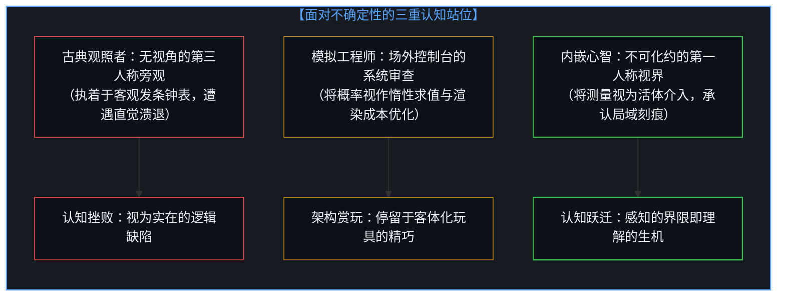
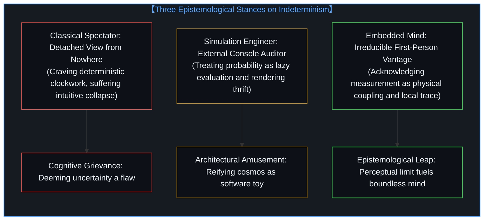
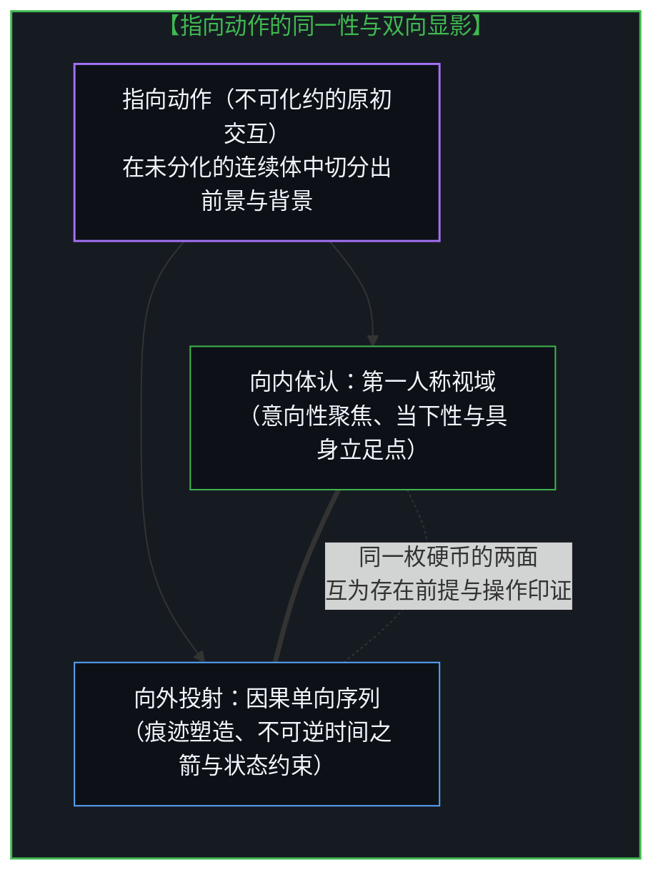
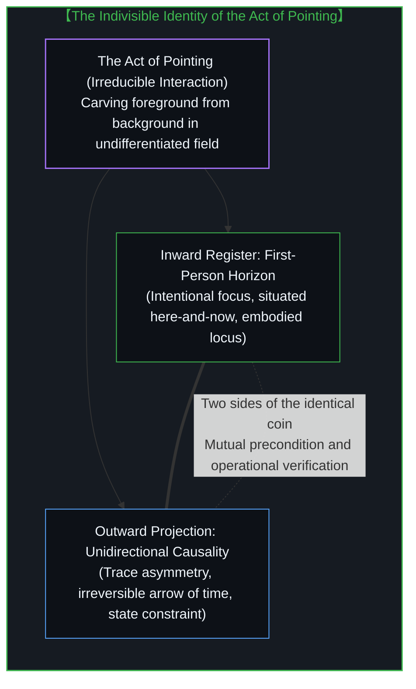
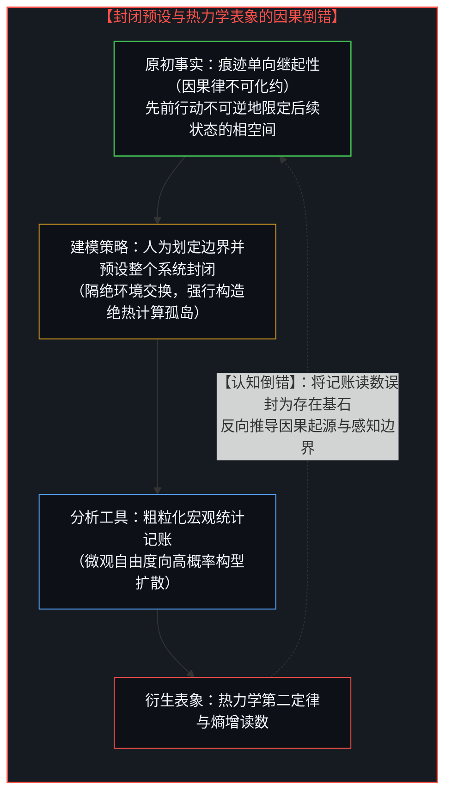
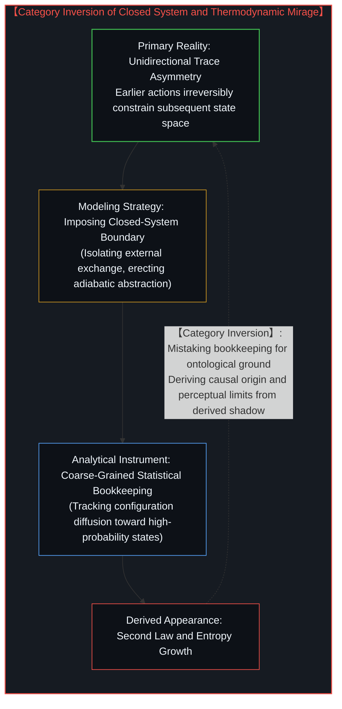
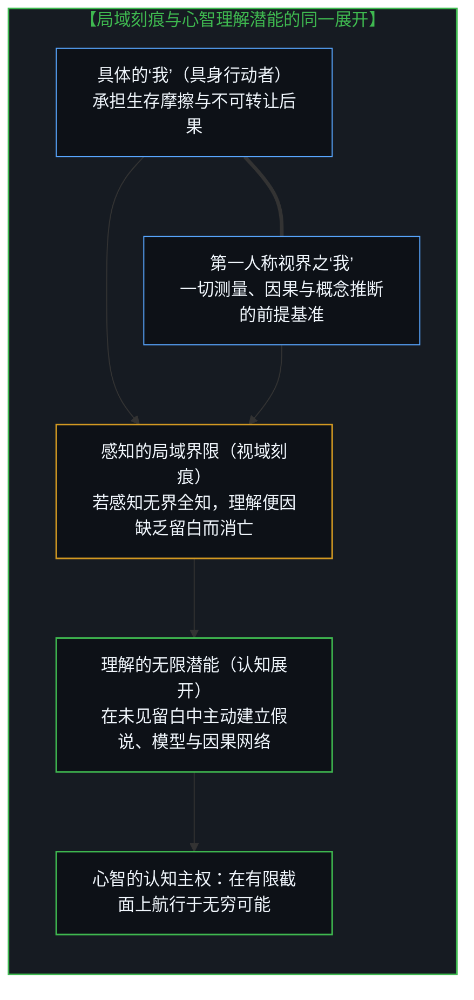
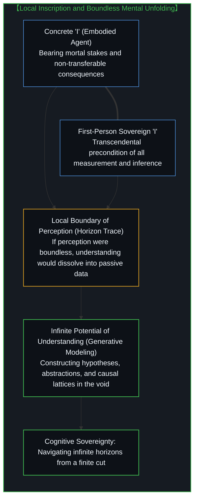

# 感知的界限与理解的无限 / The Boundary of Perception and the Infinity of Understanding

*从量子不确定性的三重站位、指向动作的拓扑刻痕到第一人称因果主权 / From Three Stances on Indeterminism and the Topological Trace of Pointing to First-Person Causal Sovereignty*

量子力学所揭示的不确定性并非自然界的逻辑故障，亦非外部程序为了节省算力而施行的渲染裁切，而是任何内嵌于世界之中的认知主体在发起测量时必然遭遇的拓扑刻痕。当我们执着于在客观世界中搜寻一个脱离主观视角的实体底座时，便会不可避免地在古典机械的怀旧挫败与模拟沙盒的架构自恋之间来回摇摆。真实的认识论突破在于清醒地体认到：我们并不具备一个可以被独立指涉的本体，唯有对本体的指向动作本身真实持存——向内体认为第一人称视域，向外投射为因果继起序列。感知的局域边界不仅不是认知的悲剧残缺，反而是心智展开无尽理解、因果建构与假设跨越的必然土壤。

The indeterminism unveiled by quantum mechanics is neither a logical glitch of nature nor a rendering cutoff engineered by an external program to conserve compute budget; it is the topological trace that any cognitive subject embedded within the world inevitably encounters when initiating a measurement. When we persist in searching through an objective cosmos for an autonomous ontological bedrock divorced from subjective perspective, we oscillate endlessly between the nostalgic grief of classical mechanism and the architectural narcissism of simulation sandboxes. The genuine epistemological breakthrough lies in the lucid realization that we possess no determinable, standalone ontology; only the act of pointing toward ontology remains actual—experienced inwardly as the first-person horizon and projected outwardly as the sequence of causal succession. The local boundary of perception is far from a tragic cognitive deficiency; it is the indispensable soil from which Mind unfolds boundless understanding, causal construction, and hypothetical synthesis.

## 一、 不确定性面前的三重站位与视角预设 / 1. Three Stances on Indeterminism and Assumed Geometries of Perspective

在面对微观量子现象撕碎经典决定论的时刻，当代智性空间中流传着三种截然不同的回应范式。第一种是古典写实主义者的挫败感，其典型表态是面对叠加态与测量坍缩时发出理智失灵的慨叹，深信客观世界理应如同一座严丝合缝的发条钟表，观察者仅仅是站在场外安全包厢里掀开幕布的局外观众。第二种是数字工程主义者的架构赏玩，将不可预测的微观概率戏拟为超级模拟器的高效优化策略，赞叹波函数演化类似于游戏引擎在玩家视线之外所施行的惰性求值与视锥剔除。然而，这两种看似对立的姿态在底层共享着同一套偏见：它们均预设了一个居高临下的“无视角之视线”，执意将现实客体化为一座独立于认知动作之外的现成剧场或运转程序。

In confronting the rupture of classical determinism by microscopic quantum phenomena, contemporary discourse manifests three distinct paradigms of response. The first is the grievance of the classical realist, crystallized in the lament of intellectual paralysis when encountering superposition and wave-function collapse, anchored in the stubborn conviction that the world must function like a seamless mechanical clockwork where the observer remains a detached spectator lifting a velvet curtain from an external box. The second is the architectural amusement of the digital engineer, who playfully interprets microscopic probability as a resource-saving optimization within a cosmic simulation, marveling at wave-function evolution as the engine's lazy evaluation and frustum culling beyond the player's direct gaze. Yet beneath their apparent divergence, these two stances share an identical conceit: both presuppose a disembodied view from nowhere, obstinately objectifying reality into a pre-rendered theater or an autonomous software routine operating apart from cognitive intervention.

When we abandon this spectator illusion and position ourselves within the participatory reality of living observers, a third stance emerges: the absolute boundary of our perception is the flip side of the infinite potential of our understanding. This perspective reframes the problem entirely by recognizing that measurement is an irreversible physical coupling rather than passive witnessing. The classical spectator grieves because he demands infinite resolution without physical interaction; the simulationist smiles because he treats the universe as code written by an external programmer. Only the embodied first-person perspective acknowledges that the quantum boundary marks the precise frontier where the finite instrument of perception meets the boundless generative space of theoretical reasoning.

正如在 [选择本身没有任何固有重量](../choice-itself-has-no-inherent-weight/) 与 [因果不可化约，物理是无人视角的投射](../causality-is-irreducible-the-physical-is-a-view-from-nowhere/) 中所剖析的，试图把观察者从因果舞台上抹去的努力注定会陷入反噬。古典观照者想要的是一个不需要自己承担观察责任的现成世界，而模拟工程师则用他人的造物神话掩盖了自己作为观察主体的在场。这两种回避策略在面对海森堡不确定性原理与贝尔不等式的检验时，都会暴露其内在的空虚。唯有回归那个正在进行测量、正在记录数据、正在承受推论后果的第一人称立足点，量子不确定性才从一场令人绝望的物理危机，转变为照亮认知自主性的原初契机。

As dissected in [Choice Itself Has No Inherent Weight](../choice-itself-has-no-inherent-weight/) and [Causality is Irreducible, the Physical is a View from Nowhere](../causality-is-irreducible-the-physical-is-a-view-from-nowhere/), every maneuver to erase the observer from the causal arena precipitates an inevitable recoil. The classical spectator desires a turnkey universe where he bears no interpretive responsibility, while the simulation engineer hides behind the myth of a creator to obscure his own presence as the evaluating agent. Both evasive strategies crumble when confronted with Heisenberg uncertainty and Bell inequality tests. Only by returning to the first-person locus—the living mind executing the measurement, recording the reading, and bearing the stakes of inference—does quantum indeterminism transform from an existential crisis into the foundational catalyst of cognitive sovereignty.

## 二、 无可指涉的本体基底与指向动作的同一性 / 2. The Illusion of a Pointable Ontology and the Identity of Pointing

长期以来，形而上学的最大诱惑在于试图跨越认识论的边界，去捕捉一个脱离一切知觉而独立固存的“终极本体”。无论是机械唯物主义的微粒碰撞，还是唯心主义的先验实体，都在预设我们能够伸出一根不受干扰的概念手指，精准点中那个被称为客观存在的基座。然而，这种索求在逻辑结构上构成了自相矛盾：任何被我们辨识、测量、命名的对象，都已经被包裹在特定的符号体系与实验约束之中。我们并不具有一个可以被确定指向的独立本体；在经验与理性的交汇处，唯有对本体的指向动作本身才是真实发生的事件。

For centuries, the supreme temptation of metaphysics has been the drive to leap over epistemological horizons to grasp a standalone ontology subsisting independently of all perception. Whether in the particle collisions of mechanical materialism or the transcendental forms of classical idealism, thinkers presuppose that we can extend an uncorrupted conceptual finger to point directly at the foundational bedrock of existence. Yet this ambition harbors a fatal self-contradiction: every entity identified, measured, or named is already enveloped within distinct symbolic networks and experimental boundary conditions. We do not possess a determinable, standalone ontology awaiting an address; at the junction of experience and reason, only the act of pointing toward ontology constitutes an actual occurrence.

This act of pointing manifests as an inseparable identity that splits into two conjugate projections across different conceptual planes: experienced inwardly, it is the First-Person Horizon; mapped outwardly, it is Causality. These are not two distinct metaphysical entities colliding in space, but the interior and exterior registers of a singular movement. The first-person horizon provides the locus of intentional focus, the irreducible here and now without which no distinction between figure and ground could ever emerge. Simultaneously, causality is the structural inscription of that same pointing across time: each act irreversibly constrains subsequent possibilities, leaving an asymmetric trail of historical consequences. Remove the first-person perspective, and causality dissolves into empty relational syntax lacking an origin; remove causality, and the first-person perspective collapses into a solipsistic phantom unable to touch resistance.

任何指向动作在几何上都必然是一次切分与区分。指向特定的目标，就意味着将广袤的其余维度置于未被聚焦的阴影之中；选择测量粒子的位置，就必然在算符对易规则下放弃对其动量的精确追踪。因此，所谓感知的界限，绝非某种外在实体设立的禁令，而是“发起指向”这一拓扑动作自身不可剔除的几何副产物。正如在 [主体性决非涌现而出](../agency-does-not-arise/) 中所阐述的，没有界限的知觉等同于没有知觉，因为一个包含一切、毫无差别的平滑全景无法产生任何有效信息。界限是指向动作留下的第一道刻痕，它宣告了第一人称主体的确立，并在此刻痕的两侧分别造就了局域的知觉经验与辽阔的未知疆界。

Any act of pointing geometrically necessitates an act of distinction. To point toward a specific orientation entails relegating the remainder of the manifold to the unselected background; choosing to measure particle position inevitably relinquishes simultaneous precision regarding momentum under operator non-commutation. Consequently, what we label the boundary of perception is not a barrier erected by an external warden, but the topological byproduct of drawing a distinction. As established in [Agency Does Not Arise](../agency-does-not-arise/), a perception devoid of boundaries is identical to no perception at all, for an undifferentiated, all-encompassing panorama registers zero contrast and conveys zero information. The boundary is the primary incision etched by the act of pointing; it anchors the first-person locus and partitions the cosmos into an immediate perceptual slice on one side and an unexhausted frontier of inquiry on the other.

## 三、 封闭预设下的统计显影与热力学表象的解构 / 3. Statistical Shadow of Closed-System Preconception and Demystifying Thermodynamics

当人们试图为感知界限寻找客观解释时，最频繁被征引的教条便是热力学。人们习惯性地断言：由于测量必然伴随着能量耗散与熵增，所以观察者的感知力受制于热力学定律的铁腕约束。这种论证看似符合实证科学的严密性，实则在认识论层级上犯下了颠倒因果的范畴倒错。热力学第二定律从来不是凌驾于因果网络之上的始基法则，而是人类在特定方法论预设下推导出的宏观统计表象。正如在 [时间之箭的伪悖论与对称模拟的边界](../the-mirage-of-times-arrow-and-the-boundaries-of-simulation/) 中所详尽拆解的，热力学从诞生之初就寄生于一个高度人为的假定：整个考察场域可以被划定为一个边界隔绝、质量与能量不与外部交换的封闭系统。

When theorists seek an objective ground for perceptual limits, the most common dogma invoked is thermodynamics. It is routinely asserted that because measurement dissipates energy and generates entropy, the observer's perceptual capacity is bounded by thermodynamic law. This argument mimics empirical rigor, yet it commits a category inversion by mistaking a derived symptom for a primary cause. The second law of thermodynamics is not an ultimate ontological ground ruling over the causal web; it is a macroscopic statistical appearance derived under specific methodological preconditions. As dissected in [The Mirage of Time's Arrow and the Boundaries of Symmetric Simulation](../the-mirage-of-times-arrow-and-the-boundaries-of-simulation/), thermodynamics has from its inception relied upon an artificial contrivance: the presumption that the universe can be partitioned into a closed container isolated from external exchange.

In living reality, causality precedes thermodynamics. Every macroscopic observation rests upon the fact that earlier interventions irreversibly constrain later states, establishing an asymmetric distribution of physical traces. When physicists project this irreversible causal necessity onto the abstract premise of a closed system, and deploy statistical coarse-graining because they cannot track every microscopic degree of freedom, the diffusion of configurations toward maximal probability appears as entropy growth. To claim that thermodynamics dictates the limits of our perception is circular reasoning: thermodynamics itself exists solely because an observer with finite resolution applies statistical bookkeeping to an assumed closed manifold. Demoting the observer's cognitive boundary to a byproduct of heat dissipation crowns the shadow of an analytical scaffold as the creator of the mind that erected it.

正如在 [普通人视角的解释陷阱](../the-explanatory-trap-of-the-ordinary-perspective/) 中所指出的，统计工具是用来辅助心智理解微观聚合表象的认知脚手架，而不是现实的本体特征。宇宙外部并不存在一堵隔绝热量的厚墙，更没有一位超越于物理世界之上的超级记录员在容器外部测量全局状态。将实验室容器内部的记账规则不加审视地推广为整个存在的终极判词，不仅在物理学内部制造出需要额外假设修补的宇宙学低熵悖论，更在哲学上助长了贬低心智主权的虚无倾向。一旦看清热力学的表象身份，我们便不再需要将感知的局域边界屈从于熵增神话；界限的根源不在于能量损耗的惩罚，而在于有穷主体介入无穷实在时不可避免的几何构型。

As demonstrated in [The Explanatory Trap of the Ordinary Perspective](../the-explanatory-trap-of-the-ordinary-perspective/), statistical tools are cognitive instruments designed to comprehend aggregated macroscopic phenomena, not intrinsic physical attributes of the universe. The cosmos possesses no exterior thermal barrier, nor does an omniscient clerk hover outside reality to calculate global state probabilities. Projecting laboratory bookkeeping across all of existence manufactures cosmological paradoxes that require ad-hoc initial conditions to resolve, while philosophical materialism exploits this illusion to diminish the cognitive primacy of Mind. Once thermodynamics is recognized as a descriptive appearance, the boundary of perception is liberated from entropic fatalism; its origin lies not in thermodynamic penalties, but in the geometric configuration of a situated agent engaging an unexhausted universe.

## 四、 局域刻痕与心智的无穹展开：作为第一人称的“我” / 4. Local Inscription and Boundless Mental Unfolding: The "I" as First-Person Sovereign

在所有的论述与认知交锋中，最不应被隐匿或抽象化的核心，便是那个正在经历思考与决断的“我”。经院哲学常常沉溺于构建毫无肉身维度的先验统觉，而实证主义又倾向于将主体矮化为可替换的生物神经算法。在真实的因果世界中，这个“我”兼具双重同一性：它既是每一个有具体生命轨迹、在真实世界中承受摩擦并自负不可转让后果的活生生行动者，同时也是一切测量、推理与概念建模得以展开的第一人称视域本身。正如在 [意识的魔术戏法与推断的非对称性](../the-sleight-of-hand-of-consciousness-and-the-asymmetry-of-inference/) 与 [抽象痛苦与鲜活饥饿](../abstract-pain-and-living-hunger/) 中所阐明的，正是这个具身存在的“我”，用真实的代谢负担与生存选择，打破了机械决定论的虚假自洽。

Across all analytical discourse and epistemological debates, the essential reality that must never be effaced is the situated "I" undergoing reflection and decision. Academic scholasticism often constructs a bloodless transcendental ego, while naive empiricism reduces subjectivity to a generic neural algorithm. In the causal world, this "I" embodies a dual identity: it is simultaneously the concrete living agent possessing a distinct personal history, enduring friction and bearing non-transferable consequences, and the irreducible first-person vantage point through which all measurement, deduction, and conceptual modeling occur. As demonstrated in [The Sleight of Hand of Consciousness and the Asymmetry of Inference](../the-sleight-of-hand-of-consciousness-and-the-asymmetry-of-inference/) and [Abstract Pain and Living Hunger](../abstract-pain-and-living-hunger/), it is this embodied "I" whose metabolic commitments and irrevocable choices shatter the sterile determinism of clockwork systems.

正是在这个“我”的立足点上，我们得以透彻理解为何感知的界限恰是理解潜能的反面折射。设想一个没有任何知觉阻碍的全知视网膜：倘若宇宙的所有微观自由度都在瞬间以无限精度直接灌入感官，那么“理解”这一行动将失去存在的必要。没有留白，就不需要概念抽象；没有阻隔，就不需要因果假说；没有不确定性，心智便退化为一块毫无主权的机械感光板。全知的感官体验不会催生智慧，它只会终结智慧。正是因为我们的感知必然止步于特定的局域截面，心智才被迫走出感官的被动接收，在辽阔的未见之域中建立几何、构想定律、发射探测器并迭代认知模型。

From the locus of this situated "I", we discern why the boundary of perception is the exact counterpart to the infinite potential of understanding. Imagine a hypothetical sensorium with boundless perception: if every microscopic degree of freedom across the universe registered instantly with infinite fidelity, the act of understanding would become obsolete. Without an unperceived horizon, abstraction vanishes; without resistance, causal hypotheses become superfluous; without uncertainty, Mind degenerates into a passive, recording plate. Perceptual omniscience does not nurture wisdom; it extinguishes it. Because perception is structurally confined to a finite cross-section, Mind is compelled to transcend passive sensation, projecting conceptual geometries, formulating natural laws, dispatching experimental probes, and refining models across the unobserved expanse.

感知的界限是第一人称在此处与当下的定锚，而理解的无限则是心智在彼处与未来的开辟。两者并非彼此对抗的枷锁与反抗者，而是同一个生命运动在不同维度上的共生显影。微观量子世界的不确定性没有关闭理性的道路，它恰恰封死了机械决定论企图将主体贬为齿轮的狂妄企图，把宇宙的开放性与创造权重新归还给每一个不可化约的第一人称心智。我们站立在自己感知的清晰边缘之上，凝视着那片由不确定性守护的辽阔虚空；正是在那片虚空之中，心智将用无限更迭的因果模型，写下对存在最深沉的体认与回答。

The boundary of perception anchors the first-person subject within the immediate here and now, while the infinity of understanding projects Mind into the boundless coordinates of future horizons. They are not opposing antagonists locked in conflict; they are conjugate expressions of a singular living movement. Microscopic indeterminism does not block the path of reason; it terminates the hubris of mechanical determinism that seeks to demote living agency into a cog, restoring the open frontier of reality to every irreducible first-person Mind. Standing firmly upon the precise edge of our perception, we behold the expanse guarded by uncertainty; and it is within that fertile expanse that Mind, through endless iterations of causal modeling, writes its sovereign response to the universe.
