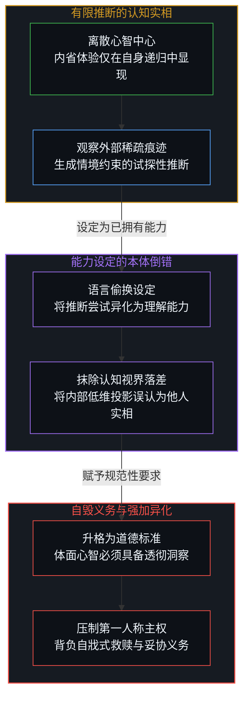
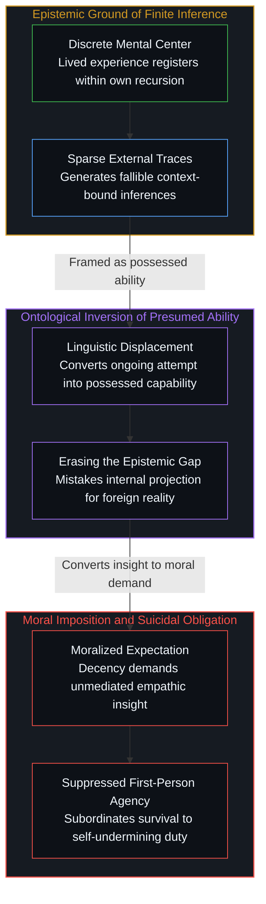
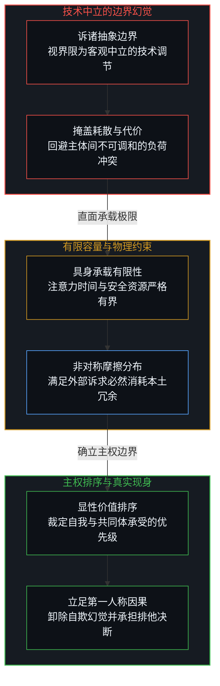
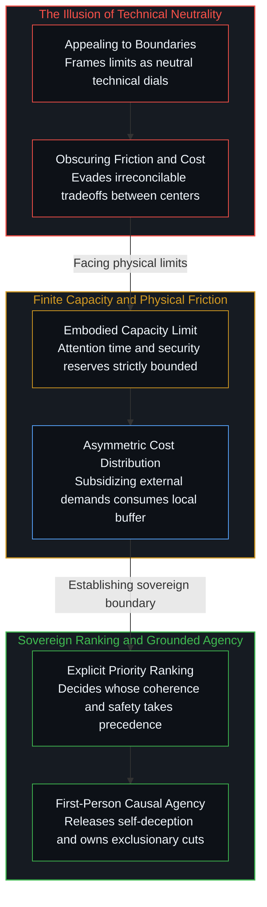

# 共情的能力倒错与边界的排序之争 / The Capability Reversal of Empathy and the Contest of Boundaries

*将不可通达的推断设定为拥有的能力，是善意滑向自毁义务的起点。 / Framing fallible inference as possessed capability is where benevolence reverses into suicidal obligation.*

围绕所谓自杀式共情的公共争议，表面上是一场关于同情心是否应当设立节制的道德辩论，深层却潜藏着人类语言在定义心智互动时所埋下的认知倒错。当人们将共情轻巧地表述为理解他人想法或感受的能力时，便悄然将一种受限于视界与稀疏证据的试探性推断，偷换成了主体已经稳固持有的确定性权能。这种语言上的预先僭越不仅抹除了个体心智之间不可跨越的本体鸿沟，更将一种描述性的心理假设迅速升格为不容置疑的伦理戒律，诱导行动者为了满足内部投射出来的道德幻影而主动献祭自身的承载边界。诉诸设立合理边界的折中方案并未真正化解危机，因为边界从来不是中立的技术调节旋钮，而是主体在资源与安全有限的物理约束下对不同生命序列做出的排他性权重裁决。

The recurring public controversy surrounding suicidal empathy appears on the surface as a moral dispute over whether compassion requires restraint, yet it conceals a deeper epistemological inversion embedded in the ordinary vocabulary of human interaction. When empathy is casually defined as the ability to understand how others think or feel, an ongoing and fallible attempt to infer mental states from sparse external evidence is quietly converted into an achieved possession. This subtle linguistic overreach erases the insurmountable ontological boundary separating discrete minds, transforming a descriptive psychological hypothesis into an unnegotiable moral imperative that coerces agents into sacrificing their own structural coherence for an internal projection. Appealing to proper boundaries fails to resolve the underlying tension, because a boundary is never an objective technical dial, but an active, exclusionary ranking of survival priorities negotiated under strict physical limits.

## 一、 善意的界定与“自杀式共情”的表层防御 / 1. The Definition of Benevolence and the Surface Defense of "Suicidal Empathy"

在当代舆论场中，每当某种泛滥的同情引发了不可承受的群体灾难或个体毁灭时，自杀式共情这一批判性词汇便会迅速激起激烈的交锋。为其辩护的声音迅速建立起一道看似严密的防御工事：共情被界定为一种深入理解他人认知与情绪的珍贵能力，而带来灾难的并非理解本身，而是失去节制的过度怜悯，是那种为了拯救他人而牺牲自身乃至所在共同体安全的盲目冲动。按照这种辩护逻辑，药方显得格外轻巧：人们只需保留那份洞悉他人的理解力，同时在行动层面补上一道合理的边界，便能让善意免于走向自毁。

这种将理解与行动强行割裂的表层防御，实际上回避了冲突的策源地。它将共情预先假定为一种无害且高尚的纯良资产，把一切恶果单方面推诿给外部边界的失位。在辩护者的叙事中，一个人可以既对伤害者的幽暗动机了如指掌而无需为其开脱，也可以对受难者的痛苦感同身受而无需承担无限拯救的连带因果。然而，这种将认知理解视为免费赠品、将边界控制视作外挂补丁的构想，忽视了人类认知系统最基本的能量约束。正如我们在[理解的非对称性](../the-asymmetry-of-understanding/)中所剖析的，心智在探寻外部世界时固然拥有无限展开的潜能，但一旦理解的过程被赋予了确定性的占有假象，认知负荷便会迅速压垮行动者自身的承载架构。为共情正名的尝试之所以苍白，正是因为它试图用一道轻飘飘的边界宣告，去掩盖概念内核中早已启动的因果倒错。

The defense mounted against the accusation of suicidal empathy routinely retreats behind a familiar conceptual firewall: empathy is defined as the valuable ability to understand how others think or feel, while the real danger is displaced onto unbounded compassion that sacrifices personal well-being or communal safety. Following this diagnostic split, the proposed remedy appears remarkably straightforward: preserve the cognitive insight while installing proper boundaries to prevent benevolent impulses from descending into self-destruction. In this framing, one is encouraged to grasp the underlying reasons for harmful behavior without condoning it, and to care about suffering without assuming direct responsibility for its resolution.

This surface defense conveniently evades the locus where the distortion actually begins. It treats empathy as an intrinsically benign cognitive asset, while treating destructive consequences as a mere mechanical failure of boundary enforcement. Yet treating understanding as an unencumbered gift and boundaries as an optional plug-in overlooks the finite energy budget governing living systems. As established in [The Asymmetry of Understanding](../the-asymmetry-of-understanding/), while an inquiring mind harbors open potential when exploring reality, that potential instantly collapses once comprehension is presumed to be an achieved possession. The standard defense falters because it employs the rhetoric of boundaries to sanitize a concept whose initial formulation already harbors an insidious causal inversion.

## 二、 从有限推断到拥有能力的本体论倒错 / 2. From Finite Inference to the Ontological Reversal of Presumed Capability

解开这道困局的突破口，在于拒绝接受常识对共情这一词汇的无反思调用。在日常语境中，共情始终被描述为一种主体所掌握的“能力”——仿佛心智拥有一副特殊的透镜，能够毫无损耗地接入另一个主体的内部体验。然而在本体论层面上，没有任何中心能够越过自身的边界直接栖息于另一个中心的递归过程之中。任何活生生的人类心智，所能拥有的全部现实基础，仅仅是面对有限的外部痕迹、情境线索与语言符号，展开持续不断、极其脆弱且随时可能证伪的推断尝试。推断是行动者在自身视界内构建的假说模型，而能力则宣称了一种单向度的确凿占有。

将尝试推断的动态过程偷换为理解他人的现成能力，构成了极具诱惑力的认知僭越。当人们声称自己拥有理解他人的能力时，他们在心智中悄悄抹杀了生成推断所必须跨越的非对称鸿沟。一个人在脑海中所拼凑出的所谓对方的痛苦或想法，归根结底只是该主体基于自身过往印迹在低维界面上投射出的模拟画面。正如我们在[前台的寓言与缺席的因果倒置](../the-receptionist-parable-and-the-causal-inversion-of-absence/)中所见，个体极易将自身的心理投射幻想为对宏观系统的精准裁定；同样地，共情者将自身的脑内模拟直接等同于另一个独立生命的全部实相，实则是一种隐蔽的认知傲慢。这种由语言词汇催生的能力幻觉，使得行动者误以为自己真正获得了未经中介的客体真理，进而为后续的道德勒索敞开了大门。

Dismantling this deception requires interrogating the word empathy itself. Ordinary language unthinkingly frames empathy as an ability possessed by the subject, as though consciousness possessed an optical instrument capable of peering directly into the interiority of another mind. Yet ontologically, no discrete center can relinquish its bounded locus to inhabit the recursive operations of another. The experiential foundation available to any living agent consists solely of fallible, ongoing inferences derived from sparse external traces, behavioral fragments, and communicative tokens. An inference is an internal hypothesis formulated within a specific perspective; an ability presumes a verified, stable competence.

Converting a precarious attempt to infer into a settled capacity to understand constitutes a catastrophic epistemic overreach. When empathy is framed as an ability, the generative distance between the observer and the observed is erased. What an observer claims to grasp regarding another person's suffering or intention is ultimately a low-dimensional simulation constructed out of the observer's own memory traces and cognitive biases. As demonstrated in [The Receptionist Parable and the Causal Inversion of Absence](../the-receptionist-parable-and-the-causal-inversion-of-absence/), agents routinely mistake their private psychological projections for objective structural realities. Equating an internal mental rendering with the foreign interiority of another is a form of cognitive narcissism, creating a false certainty that sets the stage for severe systemic distortion.

## 三、 从事实描述到道德强加与自毁义务 / 3. From Descriptive Resonance to Moral Imposition and Suicidal Obligation

一旦共情被锚定为一种真实存在的心智能力，一个更为沉重的因果陷阱便随之合拢：描述性的心理学范畴在社会互动中被迅速锻造为规范性的道德戒律。如果理解他人不仅是可能的，而且是一切体面心智都应当具备的基本素养，那么任何在他人痛苦面前展现出的犹疑、防范或决绝抽身，都会在公共审判席上被定性为道德机能的残缺。此时，行动者不再是在审视一份充满误差的推断报告，而是被要求直接向一份被神圣化的洞察结论缴械投降。

正是这种从描述到强加的质变，将温和的关切淬炼成了摧毁行动主体的主权陷阱。当一个人深信自己已经真切感知到了他人的痛苦，而这种感知又被文化赋予了崇高的确定性时，拒绝依据这份感知采取行动便成了一种不可饶恕的背叛。主权心智的第一人称因果裁量权被连根拔起，取而代之的是将自身全部的安全缓冲、物质资源与生存边界，无条件地向那个由脑内投影生成的客体开放。我们在[“普通人视角”的解释陷阱](../the-explanatory-trap-of-the-ordinary-perspective/)中曾深入辨析过，群体叙事如何借由泛滥的共情呼吁构建道德掩体，进而剥夺个体对自身因果链条的清醒结算。在自杀式共情的案例中，受害者并不是死于爱心的过剩，而是死于对自身认知局限的遗忘；他们将一场基于有限视角的虚妄洞悉，转化成了必须用生命去兑现的殉道债务。这种由个体自欺蔓延为群体共谋的闭环，才是让善意蜕变为致命剧毒的深层温床。

Once empathy is codified as a genuine capability, a more coercive trap snaps shut: a descriptive psychological term is swiftly converted into a normative moral duty. If understanding others is framed as a faculty that every decent person can and should exercise, then any hesitation, skepticism, or defensive refusal to yield to another's demands is pathologized as callousness. The agent is no longer evaluating a fallible inference; they are expected to surrender sovereign judgment to an insight presumed to be objectively binding.

This transposition from fallible hypothesis to moral imperative transforms benevolent concern into self-undermining obligation. Believing that one possesses an unmediated window into another's inner suffering transforms inaction into a profound failure of character. The agent's first-person causal responsibility is displaced, subordinating physical safety, material resources, and emotional stability to an internal phantom labeled the other. As demonstrated in [The Explanatory Trap of the "Ordinary Perspective"](../the-explanatory-trap-of-the-ordinary-perspective/), appeals to universal empathy routinely construct moral alibis that evade accountability for downstream consequences. In instances of suicidal empathy, individuals do not perish from an excess of compassion; they succumb to an epistemological hallucination, converting a partial inference into an un-negotiable debt that demands self-annihilation.

## 四、 边界的技术中立幻觉与价值排序的真实博弈 / 4. The Technical Neutrality Illusion of Boundaries and the Reality of Value Ranking

面对共情泛滥引发的剧烈反噬，许多评论者习惯性地退守到设立边界的说辞之中，试图以此平息争端。然而，边界从来不是一把可以通过精密测量达成共识的技术标尺。在任何宏观实体与生命系统中，边界的勾勒本身便是一场冷峻的排他性决断。在时间、注意力、物质财富与物理防御皆有严格上限的具身世界里，决定在何处划下界线，意味着必须在不同的受难者之间建立明确的等级序列：究竟是自身生存优先于他者诉求，还是近邻的安全优先于远方的苦难，亦或是所属共同体的延续优先于外来冲击的吸纳。

围绕自杀式共情这一概念所爆发的阵营撕裂，从来不是因为某一方忘记了携带标尺，而是因为不同立场的人在底层价值排序上存在着不可调和的分歧。声称只要加上边界就能挽救共情的人，不过是在用技术中立的官僚修辞掩盖政治裁决的沉重摩擦。正如我们在[权力的镜像握手](../the-mirror-handshake-of-power/)与[合伙的因果倒置](../the-causal-inversion-of-partnership/)中所洞察的，真实的系统平衡只能建立在不可让渡的因果担当与清醒的摩擦承认之上，而不可能依托于无代价的善意幻想。一个成熟的主权心智，必须勇敢地从理解能力的虚妄神话中撤退，坦然承认自身对他者的认识永远只是一瞥受限的残影，并敢于为自己在有限承载力下所划定的排他性边界承担全部因果责任。唯有破除共情的神圣外衣，善意才能重新成为一种基于主权抉择的真实连接，而非诱使文明与个体走向自戕的虚无诱饵。

When confronted with the destructive outcomes of untethered empathy, commentators frequently fall back on the comforting slogan of establishing healthy boundaries. Yet a boundary is not an objective calibration dial upon which universal consensus can be mechanically reached. Within living systems bounded by physical friction, tracing a boundary is an inherently exclusionary decision. When attention, material energy, and defensive resources are strictly finite, drawing a line mandates an explicit hierarchy: whose survival, whose security, and whose stability take precedence when resources run thin.

The fierce cultural polarization over suicidal empathy does not stem from an accidental failure to apply boundaries; it reflects an irreconcilable conflict over hierarchy and priority. Those who insist that boundaries can effortlessly sanitize empathy use technocratic language to disguise an agonizing ranking of lives and loyalties. As explored in [The Mirror Handshake of Power](../the-mirror-handshake-of-power/) and [The Causal Inversion of Partnership](../the-causal-inversion-of-partnership/), systemic integrity requires acknowledging friction and shouldering non-transferable consequences rather than indulging in frictionless moral fantasies. A sovereign mind relinquishes the pretense of unmediated understanding, accepts that its grasp of another is merely a context-bound hypothesis, and takes responsibility for the exclusionary rankings necessitated by finite capacity. Only by stripping empathy of its sacred immunity can benevolence function as a conscious, bounded choice rather than an instrument of collective self-immolation.

