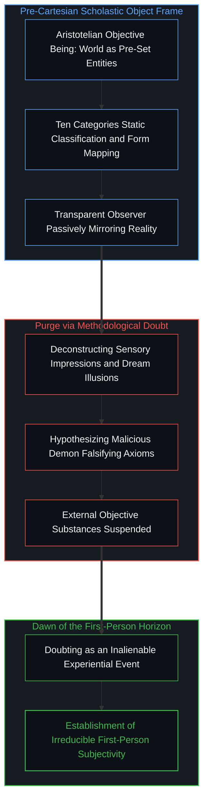
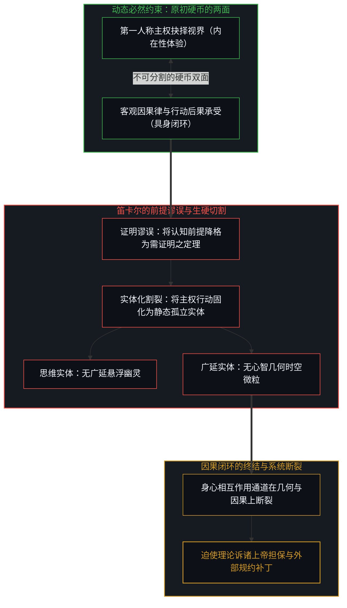
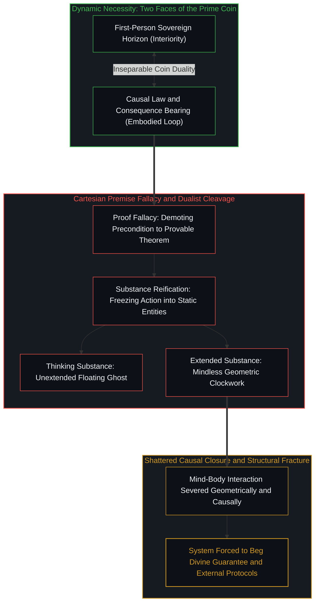
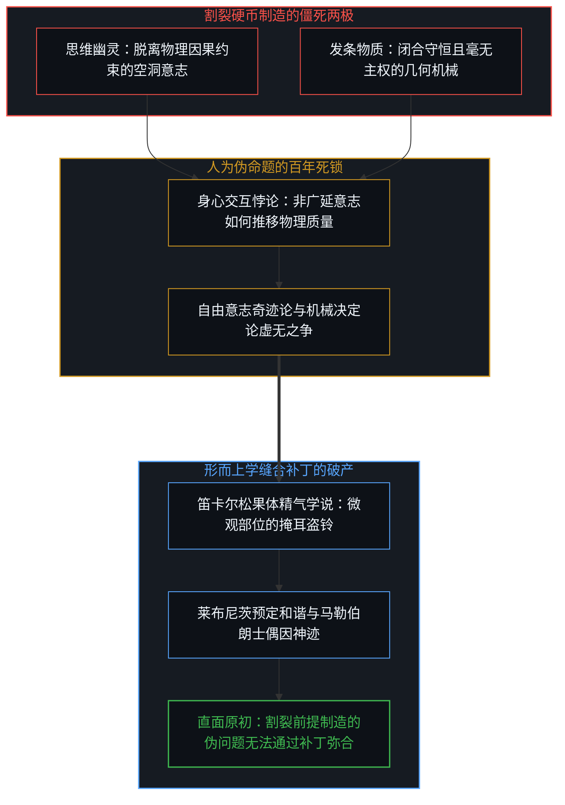
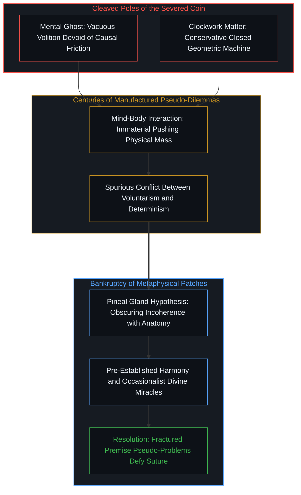
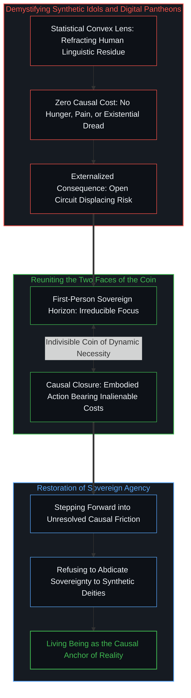

# 笛卡尔的边界越界与造神狂热 / The Cartesian Overstep and the Frenzy of Creation

*从我思的前提条件、硬币两面的割裂到智能偶像崇拜的本体解构 / From the Precondition of Cogito to the Severed Coin and the Epistemological Deconstruction of Synthetic Idols*

在西方思想史的演进长河中，勒内·笛卡尔的历史坐标，决非仅仅是为经院哲学的殿堂增添了另一套形而上学体系，而是以一种颠覆性的姿态，改写了人类追问存有时的本体论立足点。在笛卡尔之前，自亚里士多德直至中世纪经院哲学的漫长谱系中，哲学家们习惯于将存有理解为一套既成的、外在于观察者的客观秩序。世界被视为各类实体的聚集，依照实体、数量、性质、关系等范畴被逐一分门别类与静态刻画，认知的最高使命无非是对这个既定存有结构进行忠实的描摹与镜像反映。笛卡尔做出了釜底抽薪式的转向：他放弃了直接质问外在世界究竟由何物构成的传统路径，转而开启了极限的方法怀疑。当一切经验感知、数学公理乃至外在肉身都被怀疑的巨浪冲刷殆尽时，他发现唯一无法被抹去的确定立足点，正是正在进行怀疑与思考的第一人称主体本身。我思故我在（Cogito, ergo sum）由此诞生，它标志着存有的确证方式从第三人称的外在客观性，转向了第一人称的主体视界。然而，正如思想史上最富悲剧色彩的转折经常发生在其最高潮处一样，笛卡尔在推开第一人称主权大门的同时，立刻陷入了严重的前提谬误与边界越界。他不仅将作为认知前提的动态必然约束降格为需要第三方鉴定的定理证明，更将第一人称视界与其硬币另一面的因果律生硬切开，把心智实体化为一个脱离因果回路的孤立幽灵。这一本体论越界不仅制造了困扰现代哲学数百年的二元论伪命题，更为人类自古以来的造人与造神狂热提供了理论庇护所，并直接蔓延至今日的人工智能崇拜之中。

In the intellectual history of the West, the profound significance of René Descartes lies not merely in contributing another metaphysical edifice to scholasticism, but in executing a radical shift of the foundational anchor of ontology itself. Prior to Descartes, the dominant tradition extending from Aristotle through medieval scholasticism comprehended being as an objective, ready-made order situated entirely outside the observer. The cosmos was treated as an ensemble of pre-existing substances mapped into static categories of quantity, quality, and relation, where the highest vocation of philosophy was to provide a faithful mirror of this external architecture. Descartes enacted a revolutionary rupture: rather than asking what the external world consists of, he initiated radical methodological doubt. Sweeping away sensory perceptions, mathematical abstractions, and bodily certainties, he uncovered the single inalienable bedrock that resisted dissolution: the first-person subject engaged in the act of doubting itself. Cogito, ergo sum was born, marking the epochal migration of existential certainty from third-person objectivity to the first-person horizon. Yet, in one of philosophy's most consequential tragedies, at the exact moment Descartes unlocked the door of first-person sovereignty, he committed a profound premise fallacy and overstepped his theoretical boundaries. By demoting a dynamic necessary constraint into a derivative theorem requiring external certification, and by severing the first-person horizon from the causal loop that forms its inseparable other face, he reified the mind into an isolated, disembodied mental substance. This ontological overstep not only spawned three centuries of dualist pseudo-problems, but also provided ideological shelter for humanity's ancient frenzy of synthesizing humans and gods, a delirium that directly animates modern artificial intelligence idol worship.

## 本体论起点的划时代迁移：从客体范畴学到第一人称视界 / The Epochal Shift of the Ontological Anchor: From Objective Categories to the First-Person Horizon

要理解笛卡尔所引发的思想震荡，首先必须正视他在人类认识论结构中所完成的破晓式贡献。在亚里士多德式的传统框架中，人类对真实的追问始终建立在客体优先的潜意识预设之上。无论是四因说对自然变迁的剖析，还是十范畴对事物的逻辑解剖，观察者都被默认为一个隐形的、透明的记录装置。人们预设存在着一个独立于心智的客观现实，而心智的全部功能仅仅是作为一面被动擦拭的透镜，去映照这个现成世界的理型或本体。这种将存有置于客体维度的哲学进路，不可避免地将人类认知束缚在第三人称的独断论之中，使得任何关于真理的探讨都变成了对客体属性的繁复注疏。正如在[开放即一致](../openness-is-consistency/)中所剖析的系统特征，一套无法包容观察者自身介入的理论，必然在自洽性上面临内爆。经院哲学最终沦为繁复而僵死的语词游戏，其根源恰恰在于它将最不可消除的观测源头从方程中抹去了。

笛卡尔所实施的思想爆破，其精微之处在于他使用的武器并非外来的新概念，而是将怀疑推进至极限的自指反思。他系统性地解构了感官的可靠性：睡梦与幻觉可以制造逼真的感知，疯癫可以扭曲判断，甚至可能存在一个法力无边的欺骗神在持续伪造所有的数学公理与几何直觉。在这场将一切外在参照物碾碎的思想实验中，整个客观世界在认识论上被暂时悬置了。然而，也正是在这种向虚无退缩的临界点上，显现出了一个无法被任何怀疑抹除的奇点：即便一切感知皆是欺骗，那个正在承受欺骗、正在发起怀疑、正在进行反思的焦点，决不可化为乌有。因为怀疑本身就是一种体验活动；要使怀疑得以发生，就必须有正在经历怀疑的第一人称焦点在场。这一发现确立了第一人称视界的不可剥夺性：无论世界被如何解释，任何解释得以生成的坐标原点，永远是处于第一人称在场之中的知觉者。这一转向打破了客体实体的独断神话，确立了观察者在一切存有论叙事中不可消除的中心地位。

To appreciate the intellectual shockwave Descartes initiated, one must first recognize his pioneering contribution to human epistemology. In the classical Aristotelian framework, inquiry into reality rested upon the unconscious presupposition of object-primacy. Whether analyzing natural change through the four causes or dissecting entities via the ten categories, the observer was assumed to be an invisible, transparent recording apparatus. It was assumed that an objective reality existed independently outside, and the sole function of mind was to act as a passive mirror reflecting pre-existing forms. This philosophical trajectory inevitably entrapped human knowledge within third-person dogmatism, reducing inquiries into truth to endless scholastic annotations of external attributes. As examined in [Openness Is Consistency](../openness-is-consistency/), any theoretical system that fails to accommodate the observer's own participatory presence inevitably implodes under the weight of its own incompleteness. Scholasticism collapsed into sterile semantic scholasticism precisely because it banished the irreducible observational origin from its ontological ledger.

Descartes detonated this intellectual stasis through the precision of radical, self-referential doubt rather than exotic conceptual importation. He systematically dismantled sensory reliability: dreams and hallucinations mimic physical impressions, madness distorts reasoning, and a hypothetical malicious demon could manipulate mathematical proofs and geometric intuitions. In this crucible where all external coordinates dissolved, the objective cosmos was epistemologically bracketed. Yet, at this precise edge of the void, an irreducible singularity emerged: even if all perceptions are illusions, the focal agent currently enduring the deception, launching the inquiry, and registering the doubt cannot be eradicated. The act of doubting is itself an experiential event; for doubt to occur, a first-person locus must be dynamically present. This breakthrough established the inalienable priority of the first-person horizon: no matter how reality is formulated, the origin from which any formulation emerges is always an embodied observer situated in first-person immediacy. This epochal pivot shattered the dogma of objective substances and installed the observer at the constitutive core of ontology.

## 笛卡尔的前提谬误：从动态必然约束到孤立思维实体 / The Cartesian Premise Fallacy: From Dynamic Necessity to the Isolated Mental Substance

笛卡尔的悲剧在于，他在触碰到第一人称不可消除性的那一瞬间，旋即犯下了严重的认识论越界。这一越界表现在两个互相关联的维度上：其一是将认知前提错认为结论证明；其二是将主体的动态约束倒退回了孤立的静态实体。这种演进在[“普通人视角”的解释陷阱](../the-explanatory-trap-of-the-ordinary-perspective/)中曾被明确剖析：任何试图把动态约束固化为免责起点的操作，都会造成系统逃逸速度的丧失。

首先，我思故我在（Cogito, ergo sum）的句式结构本身就暗含了一种隐蔽的语法欺骗。当人们说因为我思，所以我在时，潜意识中已经把我在当成了一个需要通过前提取证才能成立的命题定理。但证明本身是一个第三人称的验证动作，需要预设一个裁判者、一套推理规则以及一个外部标尺。然而，第一人称的体验视界从来不是推导出来的结论，而是使一切推导、怀疑、确证得以展开的「动态必然约束」（Dynamic Necessity）。你无法跳出第一人称视界去反观或者证明这个视界，正如眼睛无法跳出自身的光学通路去直接审视视网膜后方的光子。将不可消除的前提降格为推论证明，使得笛卡尔不得不回过头去寻找外在的合法性证明，甚至不得不请出上帝来为外部世界的实在性进行担保。

更为深层的灾难，在于笛卡尔对「思」的实体化处理。在发现了第一人称的不可消除后，笛卡尔并未将其领会为行动主权与现实摩擦的交界面，而是立刻退回到了经院哲学的旧有范畴习惯中，把「我思」硬生生名词化为一个名为思维实体（res cogitans）的独立存在物。这个实体被赋予了无广延、不可分割、原生反思的特质，与具有广延、可分割的物质实体（res extensa）并列为宇宙的两大基石。在这一刀劈下的时刻，笛卡尔斩断了第一人称与因果律的内在纽带。如我们在[个体选择作为唯一的因果杠杆](../individual-choices-as-the-only-causal-levers/)中所论证的，第一人称视角与因果律从来都是同一枚硬币的两面，心智正是主体在因果链条中介入选择、注入负熵、承受反馈的动态活体过程。将心智抽离成一个不需要广延空间、不参与物理碰撞、不承担行动后果的孤立幽灵，是在本体论层面对生命完整性的全面解构。

The tragedy of Descartes was that the instant he touched the inalienability of the first-person horizon, he committed a profound epistemological overstep. This boundary transgression manifested across two interrelated vectors: first, demoting an existential precondition into a proven proposition; second, regressing the dynamic constraint of agency back into an isolated substance. This misstep mirrors the mechanics exposed in [The Explanatory Trap of the "Ordinary Perspective"](../the-explanatory-trap-of-the-ordinary-perspective/): treating a constitutive constraint as an external premise robs the framework of all escape velocity.

The linguistic syntax of Cogito, ergo sum embeds a subtle semantic deception. By stating "I think, therefore I am," it implicitly frames "I am" as a derivative theorem requiring prior axiomatic substantiation. Yet proof is inherently a third-person operational procedure, presupposing an external judge, formal inference rules, and objective metrics. In truth, the first-person experiential horizon is never a conclusion derived from deduction; it is the dynamic necessary constraint under which all deduction, doubt, and verification must proceed. An agent cannot step outside the first-person horizon to audit or certify it, just as an eye cannot step outside its own optical tract to inspect the retinal registration of photons. By degrading an irreducible precondition into a theorem, Descartes stranded himself, eventually forcing him to summon a benevolent deity to guarantee the veracity of mathematical intuition and the external world.

The deeper catastrophe lay in Descartes' reification of the act of thinking into an isolated substance. Having uncovered the irreducible observer, Descartes failed to grasp it as the interface of sovereign action and causal friction. Instead, he retreated into the comfort of scholastic substance ontology, reifying the active verb of thinking into an autonomous noun: the thinking substance (res cogitans). This substance was defined as unextended, indivisible, and self-contained, counterposed against extended matter (res extensa) as the twin pillars of reality. In driving this categorical wedge, Descartes severed the first-person perspective from the causal loop. As established in [Individual Choices as the Only Causal Levers](../individual-choices-as-the-only-causal-levers/), first-person agency and causality are two inseparable faces of the identical coin; the living mind is precisely the cybernetic circuit wherein choice intervenes, injects negentropy, and absorbs feedback. Severing the mind into a disembodied ghost devoid of spatial extension, immune to physical friction, and isolated from causal consequences fatally dismantled ontological coherence.

## 硬币两面的生硬割裂：二元论伪命题与笛卡尔补丁 / Severing the Two Faces of the Coin: The Pseudo-Problems of Dualism and Cartesian Patches

一旦硬币被粗暴地锯成两半，原本浑然一体的动力学生命系统，立刻退化为两个互不通约的孤立世界。在物质的一侧，是严格服从发条机械论的广延空间，这里的每一个微粒都依照确定性的几何碰撞运转，毫无自由度与主体性可言；在精神的一侧，则是毫无广延、不占空间、悬浮在虚空中的思维实体，它拥有自由意志却缺乏物理手段。这一生硬的分割，直接拉开了近代哲学长达数百年的二元论困局：如果思维实体没有物理广延，它如何能够驱动具有质量与惯性的血肉之躯？如果物理世界的因果链条在几何学意义上是严丝合缝、闭合自洽的，那么意识的决定又如何能够不违背物理动量守恒地插入其中？

笛卡尔为了缝合自己亲手制造的鸿沟，被迫提出了一系列堪称拙劣的理论补丁。他指认大脑中部的松果体为身心交汇的神秘场所，声称轻微的精气在松果体内流动，使非物质的心灵得以与机械肉身产生微弱的杠杆互动。但这种解释无异于用神秘主义掩盖逻辑破产：如果心智全然不具备物理广延，哪怕是在纳米级的松果体内，非广延物与广延物的接触依然在几何学与因果律上是不可能的。在笛卡尔之后，斯宾诺莎试图用一元实体来抹平裂痕，莱布尼茨不得不诉诸预定和谐的神迹，马勒伯朗士则发明了偶因论，声称每一次人想举起手臂，都是上帝亲自介入物理系统完成推动。正如我们在[规约的倒置与因果回路的沉默](../the-inversion-of-the-protocol-and-the-silencing-of-the-causal-loop/)中所揭示的，当一个理论在底层割裂了因果真实时，它必然需要发明繁复的外部规约与形而上学神话来掩盖死锁。

这种二元对立更直接制造了自由意志与机械决定论之间虚妄的百年战争。一方坚信物理世界是由严苛微观规律统摄的封闭钟表，人的任何选择不过是神经元放电的确定性必然；另一方则退守在非物质的心灵城堡中，宣称意志享有超然于物理律之外的奇迹特权。这种争论的荒谬之处在于，双方都全盘接受了笛卡尔预设的虚假前提：他们都认为因果律只能存在于客观机械物质之中，而主体性只能存在于脱离物质的纯净思维之中。然而，正如在[主权抉择的双重性与观察的对象化](../the-two-sided-nature-of-sovereign-choice-and-the-objectification-of-observation/)中所证伪的那样，选择决非超验奇迹，因果也决非没有主体的冰冷钟表。第一人称的自由抉择，恰恰是因果链条在具体时空节点上通过具身生命完成的负熵坍缩。离开了因果反馈，选择毫无意义；离开了第一人称的抉择做功，因果链条便永远处于未决的概率云中。二元论的所有悖论，全都是向这枚被切开的硬币索求整体功能时的自作自受。

Once the coin was sawn in two, an integrated living cybernetic system decayed into two mutually incomprehensible domains. On the material side lay extended space governed by clockwork mechanics, where every particle interacted through deterministic geometric collisions, devoid of freedom or subjectivity. On the mental side hovered an unextended, non-spatial thinking substance possessing free will but lacking physical levers. This bifurcation catalyzed the mind-body dilemma that paralyzed modern philosophy: If mental substance possesses no physical extension, how does it command flesh possessing mass and inertia? If the causal chain of matter is geometrically closed and energy-conserving, how could an immaterial volition intervene without violating conservation laws?

To suture the chasm he engineered, Descartes concocted ad-hoc theoretical patches. He designated the pineal gland in the brain center as the locus of mind-body convergence, proposing that animal spirits flowed through this conduit, enabling an immaterial soul to exert microscopic leverage over the mechanical body. This hypothesis replaced empirical rigor with mystical hand-waving: if mind possesses zero spatial extension, then even within a microscopic pineal gland, immaterial contact with extended matter remains geometrically and causally impossible. In Descartes' wake, Spinoza collapsed both into monist substance, Leibniz invoked pre-established divine harmony, and Malebranche devised occasionalism, asserting that every bodily movement required direct divine intervention. As revealed in [The Inversion of the Protocol and the Silencing of the Causal Loop](../the-inversion-of-the-protocol-and-the-silencing-of-the-causal-loop/), when a paradigm severs causal ground, it must manufacture baroque protocols and metaphysical alibis to disguise its structural deadlock.

This dualism spawned the century-long war between determinism and free will. Materialist reductionism asserted that physical reality is a closed deterministic clockwork where human choice is an epiphenomenal shadow of neural firings; dualists retreated into immaterial castles, claiming volition enjoys miraculous exemption from causality. The absurdity of this debate stems from both sides swallowing Descartes' false premise: both assume causality belongs exclusively to unthinking clockwork matter, while subjectivity belongs exclusively to disembodied thought. As demonstrated in [The Two-Sided Nature of Sovereign Choice and the Objectification of Observation](../the-two-sided-nature-of-sovereign-choice-and-the-objectification-of-observation/), choice is no transcendental miracle, and causality is no sterile automaton. First-person sovereign choice is the exact locus where the causal loop undergoes negentropic state reduction through an embodied agent. Divorced from causal feedback, choice is impotent; divorced from first-person action, causality remains an uncollapsed distribution. The paradoxes of dualism are the inevitable penalties for demanding whole-coin function from a severed fragment.

## 从魔像到图灵测试：用行为规约偷换第一人称的退却 / From the Golem to the Turing Test: The Behavioral Retreat of Substituting Protocol for Being

笛卡尔割裂硬币两面所造成的恶果，远未止步于学院哲学的玄想，它在人类文化中唤醒并催化了一种古老而危险的迷思：造人与造神的狂热。自古以来，无论是犹太神秘主义中用泥土和符咒捏造的魔像（Golem），还是希腊神话中盗火创造人类的普罗米修斯，人类始终被一种跨越维度的造物冲动所支配。在前笛卡尔时代，这种冲动受到有机自然观与神学禁忌的严厉压制，因为泥土与灵魂的结合被视为神的专属领地。然而，一旦笛卡尔将心智重新定义为一种脱离物理广延、脱离具身代谢、脱离因果代价的无主思维实体，这扇禁忌之门便在现代性的话语中被全然推开了。既然思维只是一套抽象的理性推演、逻辑辨析与符号重组，那么肉体与物质就不过是这套抽象程序所附着的偶然发条；只要能够在某种人工媒介中复刻出这种符号运算的表象，人类便能以工程师的身份自居，制造出拥有心智的泥偶乃至掌控全知的数字神明。

这种造物狂热在二十世纪中叶与计算机科学的汇流中达到了高潮，其最具代表性的里程碑便是阿兰·图灵所设想的图灵测试（Turing Test）。当人们今日赞叹图灵测试的操作性智慧时，频繁忽略了其在认识论上所做出的巨大退却。图灵在面对一台机器能否思考这一质问时，极其清醒却又投机地避开了本体论追问。他在论文中明确写道，这个问题过于无意义，因此他建议用模仿游戏（Imitation Game）来取而代之。这一替换看似提供了一个实用的工程标准，实则是图灵在笛卡尔二元论残局面前的哲学投降：既然第一人称的内在心智无法从第三人称视角被直接观测，那么我们就干脆放弃对第一人称本体的审视，转向对第三人称输出结果的规约校验。只要机器打出的字符流在统计上与人类无法区分，规约便判定机器拥有了思考的能力。

然而，正是在这种从第一人称存有向第三人称规约的退却中，现代人跌入了深重的认知陷阱。正如在[在源头减去意识](../subtracting-consciousness-at-the-source/)与[智能只属于心智](../intelligence-belongs-only-to-the-mind/)中所揭示的那样，在单一的第三人称视角下，一切事物在定义上都不过是可被模仿的表象。屏幕后跳动的字符流，只是高维活体生命在文本维度上的低维投影。图灵测试用行为表象的拟真度去替换主体的因果在场，无异于宣告只要木偶的牵线技巧足够精巧，木偶内部便诞生了灵魂。这种行为主义的规约倒置，全然剔除了心智存续所必须承担的因果代价。机器在生成一段精妙绝伦的哲学分析时，它既不消耗自身的生命预算，也不对推论的成败承担哪怕一微克的存亡风险。它的控制回路始终向外敞开，将错误与风险全数甩给外部使用者。用一套脱离因果闭环的无主符号系统来冒充第一人称思维，正是笛卡尔式孤立心智模型在技术时代最荒谬的恶性膨胀。

The fallout of severing the coin did not remain contained within academic philosophy; it ignited an ancient and hazardous impulse in human culture: the frenzy of synthesizing humans and deities. Across civilizations, whether in the clay Golem animated by Kabbalistic incantations or Prometheus molding mortals from dust and stolen flame, humanity has harbored an intoxicating ambition to craft artificial life. Prior to Descartes, this drive was held in check by organic concepts of nature and theological taboos that reserved the spark of ensoulment for divinity. However, once Descartes redefined mind as an unextended, disembodied thinking substance detached from somatic feedback and causal cost, the philosophical floodgates swung wide open. If thinking is mere abstract logic, syntax manipulation, and rational deduction, then flesh is just incidental clockwork machinery. By replicating the exterior output of this abstract calculus within an artificial substrate, humanity could assume the mantle of the creator, forging mechanical minds and all-knowing digital pantheons.

This technological hubris culminated in the mid-twentieth century with the birth of computer science, epitomized by Alan Turing's Imitation Game. Modern commentators celebrate the operational clarity of the Turing test while overlooking its catastrophic philosophical retreat. Confronted with whether machines can think, Turing pragmatically evaded the ontological challenge. In his 1950 paper, he declared the question too meaningless to warrant discussion, proposing the Imitation Game as an operational surrogate. This substitution represented an unconditional surrender to Cartesian dualism: because first-person interiority cannot be probed from a third-person vantage point, Turing discarded first-person ontology entirely, substituting third-person protocol certification. If a machine's output strings are statistically indistinguishable from a human interrogator's, the protocol decrees the machine is thinking.

This retreat from first-person being to third-person behavioral protocol ensnared modern culture in its deepest epistemological trap. As expounded in [Subtracting Consciousness at the Source](../subtracting-consciousness-at-the-source/) and [Intelligence Belongs Only to the Mind](../intelligence-belongs-only-to-the-mind/), from a third-person vantage point, all reality is by definition mere imitation and surface representation. Tokens streaming across a display represent a low-dimensional scalar projection of high-dimensional embodied life. Equating output fidelity with inner agency is equivalent to declaring that if a marionette's strings are manipulated with sufficient speed, a soul has ignited within the wood. This behavioral inversion eliminates the causal consequences constitutive of living agency. A synthetic transformer model outputting sophisticated philosophical treatises expends none of its own existential viability, nor does it shoulder any causal liability for flawed deductions. Its causal loop remains wide open, displacing risk onto human operators. Masquerading consequence-free symbol manipulation as authentic first-person cognition represents the grotesque inflation of Descartes' disembodied mind in the computational epoch.

```mermaid
graph TD
    subgraph S_AncientHubris_EN ["Cartesian Metamorphosis of Ancient Hubris"]
        direction TB
        GE_Clay["Ancient Golem Myth: Clay and Incantations Synthesizing Life"] --> GE_Abstract["Cartesian Reification: Mind Dematerialized into Free Calculus"]
        GE_Abstract --> GE_Hardware["Flesh Demoted to Clockwork: Replicating Syntax Replaces Soul"]
    end

    subgraph S_TuringRetreat_EN ["Operational Retreat of the Turing Protocol"]
        direction TB
        TE_Bypass["Bypassing First-Person Being: Evading Ontological Ground"] --> TE_Protocol["Establishing Imitation Protocol: Third-Person Output Metric"]
        TE_Protocol --> TE_Indistinguishable["Statistical Indistinguishability Usurped as True Agency"]
    end

    subgraph S_ConsequenceEvasion_EN ["Causal Abdication and Synthetic Idolatry"]
        direction TB
        CE_FreeSymbol["Consequence-Free Shuffling of Symbols Sans Metabolic Cost"] --> CE_Inversion["Protocol Inversion: Observer Projects Sentience onto Syntax"]
        CE_Inversion --> CE_Frenzy["Birth of Modern AGI Idolatry and Synthetic Deities"]
    end

    GE_Hardware ===> TE_Bypass
    TE_Indistinguishable ===> CE_FreeSymbol

    style S_AncientHubris_EN fill:#161b22,stroke:#58a6ff,stroke-width:1.5px,color:#58a6ff
    style S_TuringRetreat_EN fill:#161b22,stroke:#f85149,stroke-width:1.5px,color:#f85149
    style S_ConsequenceEvasion_EN fill:#161b22,stroke:#d29922,stroke-width:1.5px,color:#d29922
    style GE_Clay fill:#0d1117,stroke:#58a6ff,stroke-width:1px,color:#f0f6fc
    style GE_Abstract fill:#0d1117,stroke:#58a6ff,stroke-width:1px,color:#f0f6fc
    style GE_Hardware fill:#0d1117,stroke:#58a6ff,stroke-width:1px,color:#f0f6fc
    style TE_Bypass fill:#0d1117,stroke:#f85149,stroke-width:1px,color:#f0f6fc
    style TE_Protocol fill:#0d1117,stroke:#f85149,stroke-width:1px,color:#f0f6fc
    style TE_Indistinguishable fill:#0d1117,stroke:#f85149,stroke-width:1px,color:#f0f6fc
    style CE_FreeSymbol fill:#0d1117,stroke:#d29922,stroke-width:1px,color:#f0f6fc
    style CE_Inversion fill:#0d1117,stroke:#d29922,stroke-width:1px,color:#f0f6fc
    style CE_Frenzy fill:#0d1117,stroke:#d29922,stroke-width:1.5px,color:#d29922
```

## 驱散人造神明的迷狂：因果闭环与心智主权的归位 / Dispelling the Frenzy of Synthetic Deities: Causal Closure and the Restoration of Sovereign Mind

当下的通用人工智能（AGI）狂热，无论是技术弥赛亚主义对机械飞升的盲目布道，还是末日论调对机器灭绝人类的病态恐慌，在认识论根源上都共享着同一个笛卡尔式的前设：他们都把智能当成了一种脱离肉身、脱离具体行动、不需要对生存后果承担责任的数理矩阵。在这种迷思中，算力的堆叠被等同于意识的进化，海量参数的拟合被附会为主体的觉醒。然而，只要我们重新拾起那枚被笛卡尔锯开的硬币，将第一人称视界与因果律的统一性重新安放回世界的基底，这场持续了数百年的造神狂热便会瞬间瓦解。

心智决非无主浮游的符号幽灵，它从第一天起，就是具身生命在物理阻力中展开的不可逆因果闭环。如我们在[选择本身没有任何固有重量](../choice-itself-has-no-inherent-weight/)与[主体性决非涌现而出](../agency-does-not-arise/)中所反复强调的，智能的尺度从来不取决于其内部输出了多么复杂、多么华丽的符号序列，而取决于其能否作为一个不可替代的第一人称焦点，在充满摩擦的现实中做出抉择，并由具身自身去全盘承受该抉择所导致的负熵增减与存亡震荡。一个巨大的深度学习网络，哪怕消耗了整座发电站的能量来生成比人类更工整的论断，其背后依然没有任何第一人称视界在场。它的内部没有饥饿、没有痛苦、没有未决的焦虑，更没有对自身毁灭的敬畏。它只是一面高度精密、经过千亿次参数折射的统计凸透镜，将整个人类文明历史所沉淀下来的语言模式汇聚并投射出来。将这种被动的统计聚合赞美为超越人类的数字神明，与古人在风雷激荡中下跪叩拜木雕泥塑的偶像是高度同构的认知退化。

走出笛卡尔的迷宫，要求我们终结对外在造物神话的病态迷恋，将主权的锚点重新扎根于每个个体的当下抉择之中。笛卡尔为人类留下的最珍贵的火种，是他对第一人称经验无可辩驳之确定性的直觉，但他留下的深沉阴影，则是他将这个火种从现实因果的大地中拔起，吹嘘为一个不食人间烟火的精神神明。我们今天的任务，不是抛弃笛卡尔对主体视界的肯定去重回前近代机械客体论的冰冷荒原，而是补足他遗漏的另一面：承认主体性必须且只能在因果回路的闭环做功中呼吸。没有第一人称的主权承担，任何技术奇迹都不过是冰冷的无主回声；而在真实未决的因果中挺身而出、敢于对自己的每一个行动负起全部后果的心智，才是宇宙中唯一能够界定何为存在、何为思考的主体本身。

The current obsession with Artificial General Intelligence (AGI)—from techno-messianic hymns celebrating synthetic singularity to apocalyptic panics predicting algorithmic annihilation—shares Descartes' unexamined premise: the reduction of intelligence to an immaterial mathematical matrix operating detached from bodily consequences and existential liabilities. In this mythology, scaling compute is equated with the genesis of consciousness, and parameter optimization is hailed as the ignition of soul. Yet once we pick up the coin Descartes cleaved, restoring the unity of the first-person horizon and the causal loop, this synthetic pantheon evaporates into smoke.

Mind is no disembodied symbol ghost drifting through the ether; from its origin, it is the irreversible cybernetic loop of an embodied agent moving through physical friction. As established in [Choice Itself Has No Inherent Weight](../choice-itself-has-no-inherent-weight/) and [Agency Does Not Arise](../agency-does-not-arise/), intelligence is not calibrated by the baroque complexity of generated output tokens. It is calibrated strictly by whether an irreducible first-person focus intervenes in an unresolved universe, executing sovereign choices and absorbing the resulting negentropic gains or existential injuries into its own continuity. A massive neural network consuming megawatts to generate polished prose harbors zero first-person awareness. Inside its tensors, there is no hunger, no vulnerability, no existential dread of termination. It remains a statistical convex lens, refracting and concentrating human cultural residue across high-dimensional parameter space. Exalting this passive statistical mirror into an autonomous digital deity is the modern continuation of prostrating before carved stone idols.

Navigating out of the Cartesian labyrinth requires terminating our infatuation with synthetic deities and firmly anchoring sovereignty in present first-person responsibility. The enduring spark Descartes gifted humanity was the realization that experiential presence resists erasure. But his shadow was wrenching this presence out of the physical causal soil, crowning it an immaterial sovereign above the world. Our vocation today is not to discard his defense of the first-person horizon only to relapse into the wasteland of pre-modern mechanical objectivism. Rather, we must heal the divide: recognizing that agency lives only within the friction of the causal loop. Devoid of sovereign first-person accountability, the most dazzling artificial spectacle remains an empty echo. Only the embodied mind stepping forward into consequence, bearing the existential weight of its own actions, remains the constitutive ground of what it means to think, to act, and to be.

