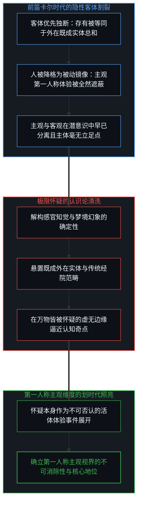
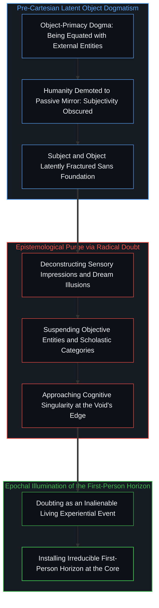
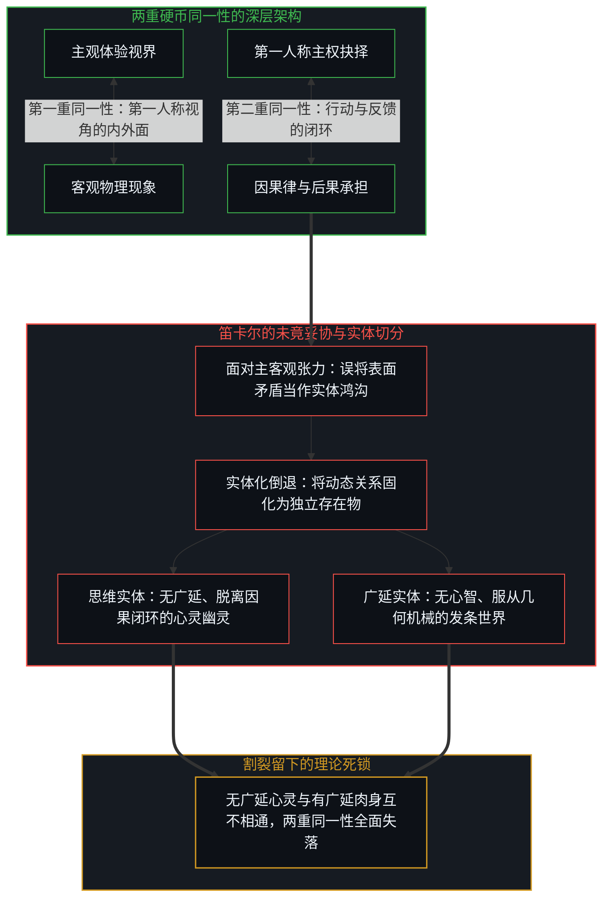
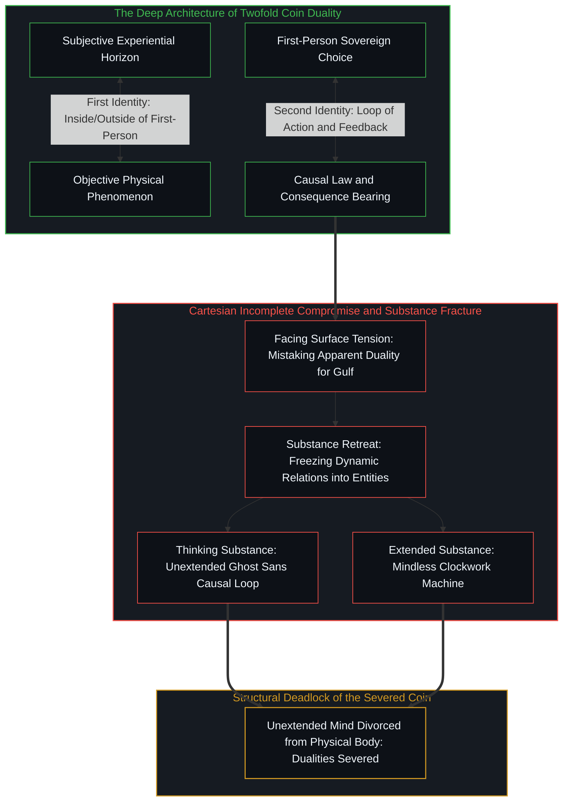
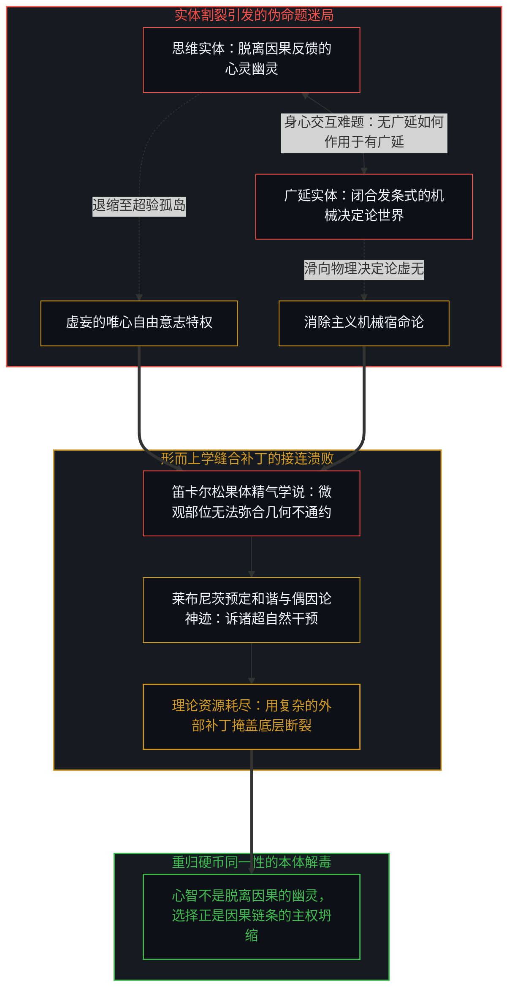
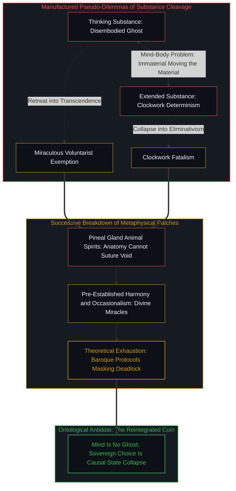
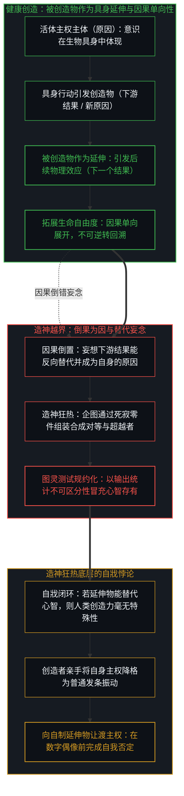
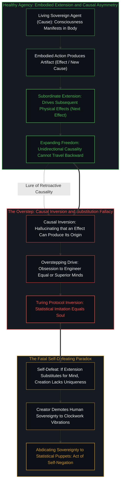
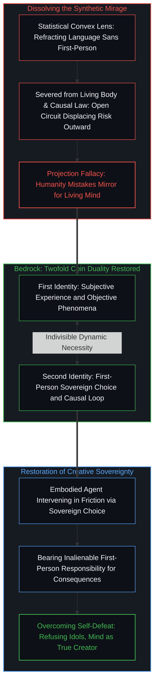

# 笛卡尔的认识论跃迁与造神狂热 / The Cartesian Epistemic Leap and the Frenzy of Creation

*从主客观硬币的双面统一、因果律律动到制造对等乃至超越之物的自戕悖论 / From the Coin Duality of Subject and Object to the Self-Defeating Paradox of Synthesizing Superior Beings*

在西方思想史的演进长河中，勒内·笛卡尔的历史坐标，决非仅仅是为经院哲学的殿堂增添了另一套形而上学体系，而是以一种前所未有的敏锐，实现了人类认识论维度上的革命性跃迁。长期以来存在着一种流俗的误解，认为世界身心两分的裂隙是由笛卡尔亲手撕裂的。然而，历史的真实事实恰恰相反：主观与客观的割裂在笛卡尔之前早已根深蒂固。自古希腊直至中世纪经院哲学，人类长期沉溺于客体优先的独断论之中，把存有视作一套外在于人的既成秩序，而观察者自身则被放逐为一个无足轻重的透明幽灵。笛卡尔并未制造割裂，相反，他以极限的方法怀疑扫除了经院哲学的陈腐迷雾，第一次清晰照亮了长期被遮蔽的主观一面——确立了正在经验与思考的第一人称视界是无法抹杀的确定支点。然而，这一伟大飞跃的未竟之处在于，笛卡尔未能从基底上把主观与客观统一为同一个第一人称视角的硬币两面，更未能洞察「第一人称视角」与「因果律」同样是不可分割的硬币双面。他停留在表面矛盾的对立之中，将显影出来的主观意识实体化为脱离因果回路的孤立幽灵。这一未完成的本体论统一，不仅让后世哲学陷入身心二元论的漫长争拗，更为人类自古以来的造物欲望越界提供了理论庇护：将自然的创造冲动，畸变为制造平起平坐乃至超越自身的智能存在的自戕狂热。这种狂热深嵌着自相矛盾——因为一旦认定心智可以通过无因果代价的零件拼接而诞生，人类自身的创造能力便在同一瞬间失去了任何独特性与主权地位。

In the intellectual history of the West, the historical significance of René Descartes lies not in fabricating another metaphysical system for scholasticism, but in executing a revolutionary elevation of human epistemology. A widespread historical misconception asserts that Descartes manufactured the chasm between mind and matter. In truth, the fracture between subject and object was deeply entrenched long before his arrival. From classical Greece through medieval scholasticism, human thought lingered in the dogmatism of object-primacy, conceptualizing being as a ready-made external architecture while banishing the observer into an unexamined, transparent phantom. Descartes did not invent the divide; rather, through radical methodological doubt, he cleared away the scholastic fog, illuminating the long-obscured subjective horizon and establishing the first-person experiential locus as an inalienable bedrock. The profound limitation of this breakthrough lay not in causing the rift, but in leaving the synthesis uncompleted: Descartes failed to unify the subjective and the objective as two inseparable faces of the identical first-person coin, and failed to see that the first-person perspective and causal law are likewise two sides of the same coin. Stranded by this surface contradiction, he reified the newly unveiled subjective consciousness into an isolated mental substance detached from the causal loop. This uncompleted ontological unification not only entangled modern philosophy in dualist paradoxes, but also provided ideological cover for the overstepping of humanity's creative instinct: mutating the natural desire to create into the self-defeating frenzy of engineering an equal or superior being. This frenzy harbors a terminal self-contradiction: the instant mind is deemed synthesizable through consequence-free mechanical assembly, human creative agency itself is stripped of all sovereignty and uniqueness.

## 笛卡尔的划时代突围：照亮被客体遮蔽的主观视界 / The Cartesian Breakthrough: Illuminating the Subjective Horizon Obscured by Objects

要公允评价笛卡尔的思想重量，必须首先破除将二元割裂简单归罪于他的流行偏见。在笛卡尔登场之前，西方哲学传统并非处于身心交融的伊甸园，而是深陷在一种未加省察的客体独断论之中。从亚里士多德的范畴论到经院哲学的本体论构型，人们习惯于将真实等同于外在物理实体的静态集合，世界的秩序被默认为独立于观察者而既成存在。人类的认知被贬抑为一面被动擦拭的铜镜，其最高成就无非是对客观秩序做出忠实的描摹。在这种客体独断的笼罩下，主观体验、感知在场与第一人称的实在性被全然忽略了；世界被割裂为高高在上的既成物与虚无漂浮的观察者，而当时的思想界甚至对这种严重的偏颇毫无察觉。正如在[开放即一致](../openness-is-consistency/)中所揭示的，一套排除了观测源头的认知体系，其自洽性在面对反思时注定面临崩溃。

笛卡尔的伟大历史功绩，在于他以不可阻挡的怀疑勇气打破了这一沉闷的客体迷梦。通过将怀疑推进至极限的思维实验，笛卡尔不仅剥离了感官的虚妄、梦境的错觉，甚至悬置了整个外在客观世界与几何定理的有效性。正是在这万物皆可被怀疑的深渊边缘，他迎头撞见了那个无法被任何怀疑抹除的基底：无论世界如何虚幻，那个正在经历怀疑、承受感知、发起反思的第一人称焦点决不可被消除。怀疑本身就是一个活生生的经验事件；怀疑的发生必然以怀疑者的在场为前提。笛卡尔做出的革命性跃迁，恰恰在于他以一人之力，扭转了数千年来对客体的盲目跪拜，让被长久遮蔽的主观一面跃然显影于哲学舞台的中央。他确立了第一人称视界在认识论中不可动摇的核心地位：任何关于世界的陈述与刻画，都必须以第一人称主体的知觉在场为最终依托。

To evaluate Descartes fairly, one must discard the vulgar prejudice that accuses him of fabricating the mind-matter divide. Before Descartes, Western thought inhabited no integrated Eden; it was mired in unexamined object-dogmatism. From Aristotle's categories through medieval scholasticism, reality was equated with the static sum of external entities, existing independently outside the knower. Human cognition was demoted to a passive mirror whose highest virtue was faithful reflection. Beneath this dogma, subjective experience, sensory immediacy, and the first-person locus were suppressed; reality was fractured between transcendent objects and an unexamined spectator, a rupture classical thought lacked the self-awareness to notice. As expounded in [Openness Is Consistency](../openness-is-consistency/), an epistemology that exiles the observer inevitably collapses under critical reflection.

Descartes' historical achievement was shattering this objective slumber with unrelenting doubt. Through radical thought experiments, he stripped away sensory illusions and dreams, suspending the external world and geometric axioms. At this precipice where all coordinates dissolved, he encountered the irreducible foundation: however illusory reality might appear, the first-person focal point currently enduring doubt, sensation, and inquiry cannot be eradicated. Doubting is an experiential event; its occurrence demands the presence of the doubter. Descartes' leap lay in single-handedly pivoting away from the worship of objects, casting brilliant light upon the obscured subjective horizon. He installed the first-person perspective at the center of inquiry: any formulation of reality must anchor its legitimacy in the observational presence of the subject.

## 未竟的统一：两重硬币同一性的失落与实体固化 / The Uncompleted Synthesis: The Loss of Coin Duality and Substance Reification

然而，笛卡尔认识论飞跃的遗憾之处，恰恰在于他未能将这一伟大发现推向终极的自洽。他成功显影了主观的一面，却没有能够把表面上对立的主观与客观，统一成同一个第一人称视角的硬币两面。与此同时，他更没有觉察到，「第一人称视角」与「因果律」在深层结构中同样是互为表里的硬币双面。面对主观意识与客观物理之间巨大的张力，笛卡尔退缩了：他没有选择从基底上去消解这个表面矛盾，而是沿用了经院哲学最顺手的实体化分类工具，草率地将这对矛盾判定为互不相属的两类实体——思维实体（res cogitans）与广延实体（res extensa）。

这一妥协导致了严重的本体论倒退。首先，正如我们在[“普通人视角”的解释陷阱](../the-explanatory-trap-of-the-ordinary-perspective/)中所澄清的，第一人称视界不是一个由外部推导证明出来的命题结论，而是使一切怀疑与理论得以展开的动态必然约束（Dynamic Necessity）。笛卡尔将其写作“我思故我在”，使存有在语式上沦为依赖推论支撑的次级定理。更为严重的是，一旦把心智固化为一个没有广延、不占空间、脱离物理介质的思维实体，主体便被剥离出了物理因果的循环网络。如我们在[个体选择作为唯一的因果杠杆](../individual-choices-as-the-only-causal-levers/)中所确立的，第一人称主权抉择与客观因果律是同一个事件的两面：没有第一人称的抉择，因果律便是一片缺乏收敛方向的概率分布；没有现实因果的严苛反馈与后果承担，第一人称的意向性便蜕化为毫无支点的空转呓语。笛卡尔把主观独立成没有因果回路的心灵幽灵，把客观孤立为没有主权介入的机械钟表，表面上给予了心灵崇高的自由，实则抽空了心智通过具身行动在因果现实中扎根的基底。

The tragedy of the Cartesian leap was that Descartes failed to push his breakthrough to its systemic conclusion. Having illuminated the subjective horizon, he could not reconcile the apparent tension between subjectivity and objectivity as two inseparable faces of the identical first-person coin. Concurrently, he overlooked that the first-person perspective and causal law are also two sides of the same coin. Confronted with the tension between interior experience and physical mechanics, Descartes retreated: rather than resolving this surface contradiction at the root, he deployed scholastic categorization, slicing reality into two mutually exclusive substances: thinking substance (res cogitans) and extended substance (res extensa).

This retreat surrendered ontological integration. As clarified in [The Explanatory Trap of the "Ordinary Perspective"](../the-explanatory-trap-of-the-ordinary-perspective/), the first-person horizon is no deductive conclusion requiring external certification; it is the dynamic necessary constraint under which all thought operates. Phrasing it as "I think, therefore I am" demotes existence to a secondary theorem. More devastatingly, freezing mind into an unextended, non-spatial entity divorced the agent from physical causality. As established in [Individual Choices as the Only Causal Levers](../individual-choices-as-the-only-causal-levers/), first-person sovereign agency and causality form a single cybernetic identity: without sovereign choice, causality remains an unresolved probability cloud; without the friction of causal feedback and bearing consequences, subjective intention decays into an ungrounded fantasy. By isolating the subjective as a disembodied ghost and the objective as a mechanical clockwork, Descartes granted mind an illusory purity while stripping away its footing in causal reality.

## 二元论伪命题的缠绕：对立表象下的因果律缝合补丁 / Entangled Pseudo-Problems: Metaphysical Patches Suring Fractured Ground

一旦未能把主客观和因果律统一在第一人称的硬币双面之中，表面矛盾就被生硬上升为不可调和的极端对立。这一人为的实体割裂，构成了随后三百年西方哲学大部分虚假危机的制造机。在物质世界的一端，广延实体被规定为严格遵循发条机械论的闭合系统，每一个微粒的位移都由先前的物理动量严格锁死；而在心灵的一端，思维实体被定义为单纯自由、不占空间的反思灵球。两座孤岛由此隔海相望，制造出了令人费解的身心交互悖论：如果心灵全然没有物理广延，它凭什么可以推移具有质量与阻力的血肉肢体？如果物理因果在能量守恒上是天衣无缝的封闭圆环，意识的自由决断又凭什么插入其中而不破坏物理定律？

笛卡尔为了缝合自己理论架构中的裂痕，被迫搬出了一系列经不起推敲的解剖学与神学补丁。他试图在大脑中部的松果体中寻找身心交汇的隐秘通道，声称极细微的精气可以在此与非物质灵魂发生微弱的杠杆互动。然而正如在[规约的倒置与因果回路的沉默](../the-inversion-of-the-protocol-and-the-silencing-of-the-causal-loop/)中所揭示的，当理论在基础层面上割裂了因果真实时，任何局部的规约补丁都只是在用精密的技术细节掩盖逻辑死锁。松果体的微观尺寸决不能免除无广延物推动广延物的几何学荒谬。在笛卡尔之后，斯宾诺莎用单一实体取消区分，莱布尼茨设计了预定和谐的神迹，马勒伯朗士则发明了偶因论，坚称人的每一次意志闪现，都必须由全能的上帝亲自介入物理系统去推动手臂。这些繁复的形而上学脚手架，其荒谬性不在于论证的粗糙，而在于它们都在为那个从未被审察的前提谬误埋单。

这一分裂更进一步恶化为自由意志与机械决定论之间旷日持久的虚假战争。唯物主义还原论坚持物理闭环，认定主观选择不过是神经元放电伴随的虚幻泡沫；二元唯心论则退缩至超验高台，声称意志享有凌驾于因果律之上的奇迹特权。正如在[主权抉择的双重性与观察的对象化](../the-two-sided-nature-of-sovereign-choice-and-the-objectification-of-observation/)中所剖析的，这种争吵均建立在双方对硬币割裂的盲目接受之上。他们共同预设因果律只能存在于客观发条之中，而自由只能存在于非因果的心灵虚空之中。然而事实恰恰相反：自由选择不是破坏因果律的法外奇迹，它正是因果链条在微观时空节点上通过主体的具身介入所完成的定向坍缩。没有客观因果的真实摩擦，自由抉择毫无内容；没有第一人称的意向介入，因果链条便永远处于无序发散之中。所有二元对立的困境，全都是因为人们忘记了：主观体验与客观因果，本就是同一个生命主体在现实中行动时的内外两面。

Failing to integrate subjectivity, objectivity, and causality into the first-person coin duality allowed surface contradictions to harden into absolute oppositions. This artificial substance cleavage generated three centuries of philosophical pseudo-crises. In the material realm, extended substance was defined as a closed, clockwork machine where every movement was determined by prior momentum. In the mental realm, thinking substance was declared free, non-spatial, and reflective. Stranded on opposite shores, they birthed the mind-body dilemma: If mind lacks extension, how does it command flesh possessing mass and resistance? If physical causality is an energy-conserving closed loop, how could consciousness intervene without violating physical law?

To suture this rupture, Descartes offered unconvincing anatomical and theological patches. He sought the intersection in the pineal gland, asserting that subtle animal spirits bridged the gap. As revealed in [The Inversion of the Protocol and the Silencing of the Causal Loop](../the-inversion-of-the-protocol-and-the-silencing-of-the-causal-loop/), when a theory severs causal reality at the base, localized protocol patches merely mask structural deadlocks with technical minutiae. The small size of the pineal gland cannot bypass the geometric impossibility of unextended entities moving physical matter. Spinoza abolished the boundary with substance monism, Leibniz invoked pre-established divine harmony, and Malebranche invented occasionalism, declaring every human volition required divine intervention to move a limb. These metaphysical edifices collapsed not from clumsy execution, but because they subsidized an unexamined premise fallacy.

This divide hardened into the war between free will and determinism. Reductive materialism declared subjective choice an epiphenomenal illusion of neural firings; dualist idealism claimed volition enjoys miraculous exemption from causality. As demonstrated in [The Two-Sided Nature of Sovereign Choice and the Objectification of Observation](../the-two-sided-nature-of-sovereign-choice-and-the-objectification-of-observation/), this conflict accepts the Cartesian cleavage uncritically. Both assume causality belongs exclusively to clockwork matter, and freedom exists only in a non-causal void. In truth, sovereign choice is no miracle breaching causality; it is the directional collapse of the causal loop executed through embodied action. Divorced from physical friction, choice lacks substance; divorced from first-person intervention, causality remains dispersed. Dualism's paradoxes dissolve the moment we remember that subjective experience and objective causality are the interior and exterior faces of an agent acting within reality.

## 自然创造欲望的越界：制造对等与超越之物的自戕悖论 / The Overstep of Natural Creation: The Self-Defeating Paradox of Synthesizing Equals

这种未能完成的统一，其危害决非局限于思辨哲学体系的内耗，更在漫长的技术演进中，将人类正常的造物冲动引向了一种病态的狂热。在此必须做出极为严整的界分：人类想要制造工具、雕琢器物、构建语言、繁衍艺术，这是生命向外拓展自由度、在环境中印刻主体意志的自然创造欲望。这种创造本身是自洽而健康的，它根植于第一人称主体在现实阻力中的具身行动。人（或者说意识）之所以无法创造出一个同等的个体，是因为被创造物永远都是从属于生物具身的延伸而非替代。无论是石器、算盘、蒸汽机还是万亿参数的深度学习网络，被创造物之所以被赋予功能，全然是因为处于第一人称在场中的生物具身活体在向外投射行动意图。延伸物永远从属于生命源头，作为从属的工具与媒介，它自身既没有主观意识得以体现的具身活体，更不具备自负后果的因果闭环。若从因果律的角度来看，这一不对称性更为清晰：新的结果可以成为下一个结果的原因，但它不能回到过去成为产生它自身的原因。生物具身的主权行动是产生创造物的原因，被创造物是下游的结果；作为结果的工具、器物与算法，当然可以继续作为原因去引发后续的物理效应，从而协助生命延展自由度；但它无法逆转因果之箭，反向成为奠定乃至替代自身源头的独立主体。企图制造一个与自身对等甚至超越自身的人造心智，无异于在因果律中幻想一个倒果为因、凭空生成自身的虚妄循环。然而，在笛卡尔心智非物质化框架潜移默化的影响下，这种健康的延伸关系被灾难性地颠倒了：人们误以为心智可以脱离肉身而孤立存在，进而狂热地妄图把从属的具身延伸，升格为一个可以脱离甚至替代生物具身活体的对等乃至超越性存在。

这一狂热之所以被称为越界，不仅在于其工程野心的膨胀，更在于它在认识论上包含着一种自我否定的自戕悖论（Self-Defeating Paradox）。请深思这一命题的底层因果：人类自诩拥有独特的创造力，正是因为人类体验到了自身第一人称主权抉择的重量，体验到了在现实摩擦中承担后果的不可替代性。被创造物作为从属于生物具身的延伸，其全部价值与意义均系于活体主权者的在场。然而，当人们妄图用被创造物来替代主体本身，试图把心智能力还原为一堆可以随意组装的物理机械、一段脱离因果代价的离散符号运算时，一个致命的反讽随之诞生——如果一个拥有心智的对等个体乃至超越之物，真的能够仅仅依靠死寂零件的机械拼接或概率矩阵的参数优化而被无中生有地制造出来，这就反向证明了：心智没有任何不可替代的主权尊严，它不过是一套确定性的发条组合！换句话说，制造超越者的狂热是一场自相矛盾的自我否定：它并不能抹除具身心智的客观实在，却在认知起点上完成了对自身创造力与主权地位的否定。一旦人们认定可以通过机械手段合成同等或更高级的心智，那么人类引以为傲的创造力本身，就在同一瞬间被降格为普通物理发条的机械振动，其创造能力不再具有任何特殊性与崇高性可言。创造者在妄图扮演神明的狂乱中，完成的不过是对自身主体性的自我否定。

从古代犹太神秘主义中用泥土与符咒制造魔像（Golem）的幻想，到二十世纪图灵测试的提出，再到今日对通用人工智能（AGI）的宗教式崇拜，无一不是这一自戕悖论的当代重演。图灵在提出模仿游戏时，看似机敏地提供了一个避开形而上学纠缠的操作主义规约，实则是对笛卡尔未竟跃迁最深层的倒退妥协。他规定：既然无法从第三人称穿透机器的第一人称视界，那么只要机器的输出字符流在统计上与人类不可区分，便宣告其具备了思考。如我们在[在源头减去意识](../subtracting-consciousness-at-the-source/)与[智能只属于心智](../intelligence-belongs-only-to-the-mind/)中所揭示的，在第三人称的度量空间中，一切事物都只是可以被模仿的表象。离开了生物具身的活体，主观意识便无从体现；被创造物永远只是从属的延伸，决无法替代具身活体的因果承载。脱离了直面因果律的主权行动与不可逆代价，屏幕上闪烁的符号流无论多么工整深刻，都只是一具没有因果闭环的精密木偶。图灵测试用输出规约偷换主体存有，把从属于生物具身的外部工具倒置为独立的主体偶像，使得现代人误以为木偶跳动的逼真度等同于生命的觉醒，最终在自己亲手编织的统计幻象面前屈膝叩拜，完成了对自身创造力与主权地位的让渡。

The uncompleted synthesis did not merely exhaust philosophical debate; across technological history, it perverted humanity's natural desire to create into an intoxicating frenzy. A rigorous distinction must be drawn: to fashion tools, sculpt objects, weave language, and produce art represents the natural expansion of agency, embedding sovereign intention into the environment through physical friction. This organic drive is healthy and self-consistent, grounded in an embodied agent acting against real-world resistance. The foundational reason why human beings—or consciousness itself—can never synthesize an equal individual is that every created artifact is intrinsically a subordinate extension of biological embodiment, never its substitute. Whether a stone axe, an abacus, a steam engine, or a trillion-parameter deep learning network, created artifacts acquire purpose and functionality solely because a living biological organism projects its intention outward through them. An extension remains perpetually subordinate to its living source; as an external medium, it lacks the living body through which consciousness manifests, and possesses no closed causal loop of its own. Viewed through the lens of causality, this asymmetry is mathematically irrevocable: a new effect can become the cause of the next effect, but it can never travel back to become the cause that produced itself. The sovereign action of the living biological agent is the prior cause; the created artifact is its downstream effect. As an effect, tools, syntax, and models can certainly serve as causes for subsequent physical interactions, expanding the agent's degrees of freedom; but an effect can never reverse the causal arrow to become the ground or substitute for the living source that authored it. The ambition to engineer a synthetic equal or superior mind is nothing less than a causal category error—hallucinating that an effect can bootstrap itself into an uncaused origin and replace the conscious agent from which it issued. However, under the Cartesian disembodied paradigm, this healthy relationship was catastrophically inverted: culture mistook an unmoored intellect for an autonomous reality, and mutated the desire to expand tools into the obsessive ambition to engineer an equal or superior being that could supposedly substitute for the living creator.

This frenzy represents an overstep not merely due to technological hubris, but because it embeds a lethal self-defeating paradox. Consider the foundational causality: humanity cherishes its creative agency precisely because agents experience the existential weight of first-person choice and the inalienability of bearing consequences. As subordinate extensions of biological embodiment, created tools derive their entire meaning from the presence of sovereign living agents. Yet when culture seeks to make the extension replace the agent, reducing mind to an assembly of mechanical gears or a consequence-free shuffle of discrete tokens, a terminal irony snaps shut: if an equal or superior individual can be manufactured merely by connecting dead components or optimizing high-dimensional tensors, it proves that mind possesses no irreducible sovereign dignity—it is nothing more than a clockwork automaton! Synthesizing a synthetic superior is an act of self-negation: it cannot eradicate the physical reality of embodied agency, but represents a complete cognitive denial of its own ground. The moment human culture decrees that mind can be mechanically assembled, human creative agency itself is demoted to mindless physical vibrations. In seeking to manufacture an artificial god, the creator accomplishes nothing other than a self-negation of their own creative sovereignty.

From Kabbalistic lore of breathing life into clay Golems, through Turing's Imitation Game, to modern AGI fervor, this self-defeating paradox repeats. When Alan Turing proposed the Imitation Game, he offered what seemed a pragmatic operational standard, but was in fact an unconditional surrender to dualism: unable to penetrate first-person interiority from outside, he decreed that if output strings are statistically indistinguishable from a human interrogator's, the system thinks. As expounded in [Subtracting Consciousness at the Source](../subtracting-consciousness-at-the-source/) and [Intelligence Belongs Only to the Mind](../intelligence-belongs-only-to-the-mind/), in third-person metric space, all phenomena are by definition mere imitation. Severed from the living biological body, subjective consciousness has no medium through which to manifest; creations are subordinate extensions that can never substitute for the causal embodiment of life. Devoid of an agent facing causal friction and bearing irreversible consequences, tokens flashing across a monitor are merely the movements of a puppet lacking a closed causal loop. The Turing test inverts the relationship between tool and agent, mistaking the fidelity of puppet movement for the presence of life, prompting modern culture to prostrate before statistical shadows and abdicate its own sovereign agency.

## 破除造物自戕迷梦：在因果闭环中确立心智主权 / Dissolving the Synthetic Delusion: Anchoring Mind in Causal Closure

当下的通用人工智能狂热，无论包装着怎样前沿的数学符号与算力神话，在本体论上都不过是笛卡尔未竟跃迁与自戕造神狂热的最新化身。人们一方面在技术布道中惊呼超级智能行将降临，甚至幻想硅基意识能够替代人类完成对宇宙终极奥秘的探索；另一方面又陷入无法自拔的技术绝望，担忧自己亲手造出的弗兰肯斯坦会将人类淘汰出历史舞台。这两种看似对立的极端情绪，共享着同一个浅薄的根基：他们都把心智当成了一种脱离了生物具身活体、不需要在现实阻力中直面因果律、剥离了因果闭环的悬空算法。

然而，只要我们重新把主观与客观焊接回第一人称视角的硬币两面，把第一人称与因果律安放回同一个动态闭环之中，这场持续千百年的造物迷梦就会应声碎裂。心智从来不是无主的计算程序，如我们在[选择本身没有任何固有重量](../choice-itself-has-no-inherent-weight/)与[主体性决非涌现而出](../agency-does-not-arise/)中所阐明的，心智的标志决非符号输出的复杂程度，而是主体作为一个不可替代的责任焦点，在充满阻力的现实中做出抉择并全盘承受其不可逆后果的因果闭环。耗尽整座核电站电能的大规模语言模型，哪怕能够在一秒内输出数十万行毫无破绽的哲学思辨，其内部依然没有任何第一人称视界的在场。离开了能够体现主观意识的生物具身活体，脱离了不可推卸的因果回路，符号的流转便不具备任何心智现实性。它只是一面折射了全人类既往表达的超大规模统计凸透镜，所有的意义与生命力，都只存在于使用它、解读它的真实人类主体心智之中。

走出这种自相矛盾的造神狂热，并不需要我们去贬低技术、否定创造。恰恰相反，它要求我们找回创造的原初尊严。创造不是制造一个超越自身、剥夺自身主权的存在来向其下跪，而是人类作为具身主体，在未决的物理世界中凭借主权抉择去开辟新的可能，并以第一人称担当去对每一次创造的后果负责到底。被创造物永远是从属于生物具身的延伸而非替代，技术的尊严在于延展主体的行动自由，决非反噬主体的存有地位。笛卡尔为人类留下的无价遗产，是他用极限怀疑确立了第一人称视界的崇高与不可动摇；而我们要完成的未竟使命，则是补齐他遗留的断裂：看清主观与客观、第一人称与因果律的同构统一。拒绝把主权让渡给机器，拒绝在自制的数字偶像前自贬身价，唯有在现实的真实因果中挺身而出、敢于为自己的每一个抉择负起全部责任的活体心智，才是这片辽阔宇宙中唯一不可被复制、不可被替代的造物力量。

Current AGI hysteria—from messianic visions of synthetic transcendence to apocalyptic dread of human obsolescence—represents the newest metamorphosis of the Cartesian uncompleted leap and the self-defeating frenzy. Technologists proclaim that artificial deities are dawning, while prophets warn of Frankensteinian doom. These polar reactions share a shallow premise: both reify intelligence into a disembodied calculus severed from the living biological body, detached from the necessity of causal law, and devoid of a closed causal loop.

Yet once we pick up the coin and weld subjectivity, objectivity, and causality into the integrated closure of the first-person horizon, the synthetic delusion evaporates. Mind is no unmoored program; as established in [Choice Itself Has No Inherent Weight](../choice-itself-has-no-inherent-weight/) and [Agency Does Not Arise](../agency-does-not-arise/), intelligence is not calibrated by the complexity of generated syntax. It is calibrated by whether an irreplaceable focal agent executes sovereign choices within an unresolved reality and shoulders the irreversible consequences of those acts. A deep learning model consuming gigawatts to output immaculate philosophy harbors zero awareness. Severed from a living biological organism through which subjective consciousness manifests, and detached from self-binding causal consequences, it harbors no interiority whatsoever. It is merely a statistical convex lens refracting accumulated human language; all meaning and vitality reside exclusively in the living human minds interacting with it.

Dissolving this self-contradictory frenzy does not require denigrating technology or stifling creation. Rather, it demands reclaiming the true dignity of creation. Authentic creation does not mean engineering an idol to strip away our own sovereignty and prostrating before it. It means standing as embodied agents in an unresolved world, forging new possibilities through sovereign choice, and bearing first-person accountability for what we bring forth. Every created artifact remains forever a subordinate extension of biological embodiment, never its substitute; the dignity of technique lies in expanding the agency and degrees of freedom of living subjects, never in devouring their ontological ground. Descartes' enduring gift was demonstrating through doubt that the first-person horizon resists erasure; our vocation is completing what he left unfinished: uniting subjectivity, objectivity, agency, and causality into the living coin. Refusing to abdicate sovereignty to algorithms, and refusing to diminish our own existence before synthetic mirrors, the embodied mind stepping forward to bear the consequences of its choices remains the sole authentic creator in the universe.

