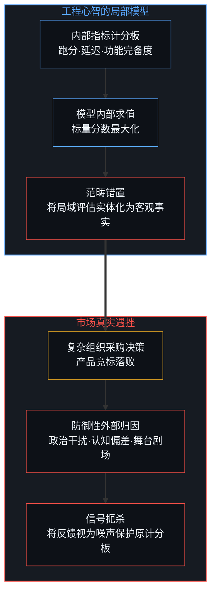
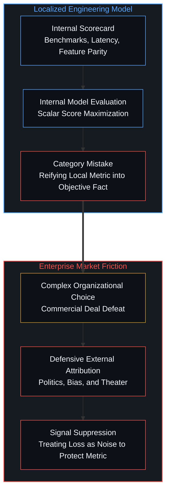
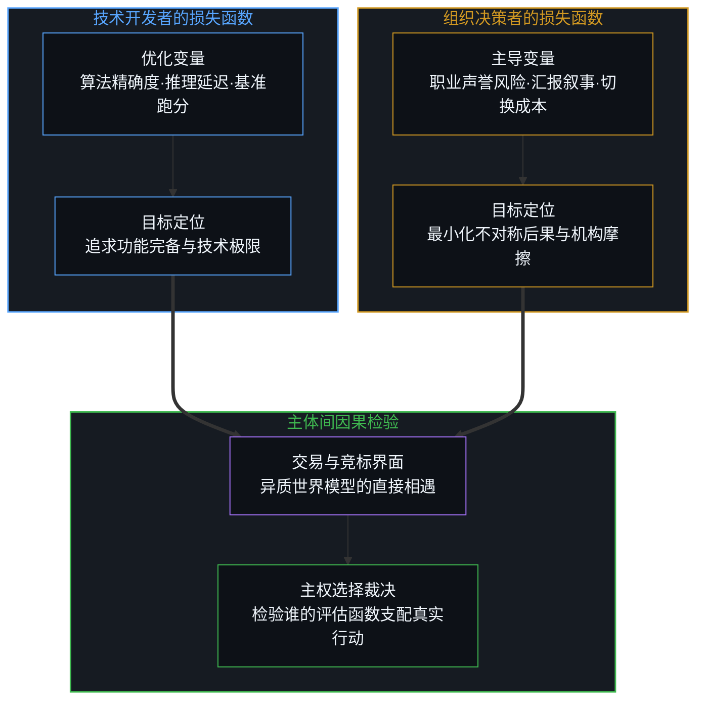
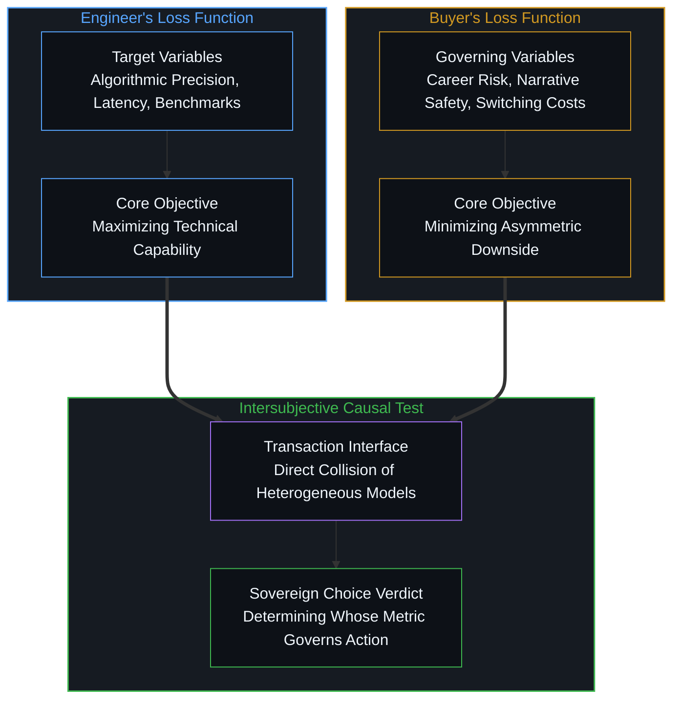
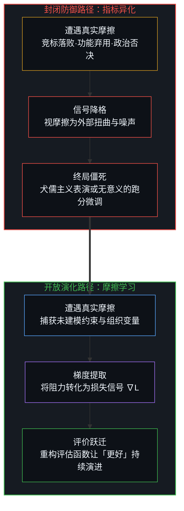
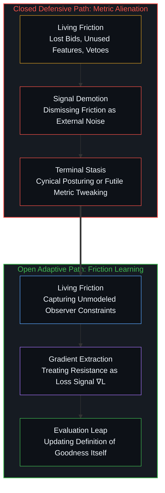

# 「更好」的范畴谬误 / The Category Error of Better

*将特定模型的评估函数错认为客观属性是工程主义最顽固的遮蔽 / Mistaking a model's scoring function for an objective property is engineering's persistent blind spot*

「更好的产品依然可能落败」常被工程文化包装为商业社会的反常悖论，或是某种沉痛的市场潜规则。这既非悖论，亦非所谓的世故智慧，而是源于一个先验的模型错置：将「更好」视为一种独立于具体决策观察者、可被预先静态测量的客观属性。当研发团队将内部计分板上的跑分、延迟与功能完备度当成世界本身的事实，任何在真实组织博弈中的遇挫便被本能地归咎于政治干扰、认知偏差或低劣剧场，从而在捍卫失效评价函数的同时，将至关重要的真实损失信号当作无意义的噪声抹杀。

The claim that "a better product can still lose" is commonly framed within engineering cultures as a perplexing market paradox or a piece of cynical real-world wisdom. It is neither a paradox nor worldly sophistication; it is the predictable outcome of an unexamined prior modeling error: the belief that "better" constitutes an objective property that can be measured in advance, independent of the concrete observers who actually make decisions. When engineering teams mistake their internal scorecards—benchmarks, latencies, and feature matrices—for empirical facts about reality, any subsequent loss inside enterprise negotiations is reflexively dismissed as political distortion, perceptual irrationality, or superficial theater. In doing so, they preserve an obsolete evaluation function while discarding the vital friction of reality as mere noise.

## 一、 计分板的实体化与范畴谬误 / 1. The Reification of Scorecards and the Category Mistake

在工程文化与数据驱动的组织语境中，「更好」常被当作一种先于具体交易而存在的客观事实。研发团队在一组预先设定的指标集上衡量产品：精确度提升了三个百分点，推理延迟降低了四十毫秒，基准测试刷新了排行榜，功能清单被逐项打钩。当这张计分板被填满时，工程心智便默认产品已经在世界中确立了无可辩驳的优越地位。然而，当该产品走向市场、试图打入复杂的大型机构却遭遇惨败时，这种落败常常被迅速叙述为一种外在的扭曲：人们感叹认知压倒了真实，政治角力压倒了数据优势，舞台剧场掩盖了真材实料。这种防御性的叙事精巧地保护了最初的计分板，将真实的溃败当作无意义的噪声抹除，而非视为模型本身的结构性修正信号。

In engineering cultures and data-driven organizations, "better" is routinely treated as an objective, antecedent fact of the world that precedes any concrete human transaction. Development teams evaluate a product against a predefined set of synthetic benchmarks: accuracy improves by three percentage points, latency drops by forty milliseconds, benchmark leaderboards are conquered, and feature checklists are exhaustively ticked off. Once this internal scorecard is populated, the engineering mindset assumes that the product has established an incontestable superiority in reality. Yet, when this supposedly superior product attempts to penetrate complex enterprise environments and suffers defeat, the loss is reflexively rationalized as an external distortion: observers lament that perception overrode reality, organizational politics sidelined raw performance, and superficial theater trumped substantive capability. This defensive narration meticulously shields the original scorecard, discarding the failure as meaningless noise rather than confronting it as a decisive signal to revise the model itself.

这构成了认识论上的范畴谬误。「更好」从来不是对客观世界的独立测量，而是在特定观察者心智所持有的世界模型内部、依据特定权重和约束条件执行的一项价值评估。工程师眼中的「性能」只是其自身局部模型内的单向度投影。当他们断言某款产品比竞品「更好」时，他们实际表达的仅仅是：在他们所设定的损失函数下，该产品的标量输出更小。企图将这种局域评估泛化为超越观察者的普适属性，正如将温度计上的水银柱刻度误认为冷热感受本身，既割裂了评估工具与具体心智的共生关系，又在遭遇异质认知时将自身的盲区投射为外界的非理性。

This constitutes a classic epistemological category mistake. "Better" was never an observer-independent measurement of physical reality; it was an evaluation computed strictly inside the boundaries of one particular world-model, utilizing a highly idiosyncratic set of weights, assumptions, and constraints. What engineers call "raw performance" is merely a single-dimensional projection within their localized formal system. When they assert that their product is objectively "better" than a competitor, they are merely stating that under their chosen loss function, the scalar output happens to be lower. Attempting to reify this parochial calculation into a universal, observer-free truth is identical to confusing the mercury column of a thermometer with the somatic sensation of cold. It severs the evaluation tool from the living mind that constructed it, while defensively projecting its own cognitive blind spots onto the supposed irrationality of the external world.

为了清晰呈现这种实体化错置与防御性归因的闭环结构，我们可以观察工程心智在面对真实市场碰撞时的认知链条：

To clearly map this reified misplacement and its closed defensive attribution loop, we can trace the cognitive progression of the engineering mindset when colliding with market reality:

## 二、 观察者的损失函数与主体间检验 / 2. The Buyer's Loss Function and the Intersubjective Test

真实的买家与决策者生活在与技术开发者截然不同的世界模型中。在大型组织的科层结构内部，采购决策者的损失函数极少由单一维度的吞吐量或技术精确度主导。他们的计算空间中充斥着严苛的生存约束：职业声誉与职位风险、向上汇报时的叙事连贯性与合规安全、既有供应商生态系统的沉没切换成本，以及直面组织内部剧烈变革所必然招致的摩擦代价。当一位部门主管选择采购昂贵、中规中矩却稳妥的成熟系统，而非选用技术指标优异但引入潜在动荡的新锐产品时，他在其自身的认知模型中正在执行高度理性的优化。「没有人会因为采购IBM而被解雇」这句行业名言，揭示的不是群体的愚钝，而是科层中主体面对不对称后果时的自保权衡。

Real-world buyers and institutional decision-makers inhabit world-models fundamentally distinct from those of technical architects. Within enterprise hierarchies, a buyer's loss function is rarely dominated by raw algorithmic throughput or microsecond speed. Their decision space is saturated with concrete survival constraints: career exposure and employment risk, narrative coherence defensible to executive superiors, legacy switching costs embedded in vendor lock-in, and the acute friction of managing organizational disruption. When an enterprise executive opts for an expensive, mediocre legacy system over an agile startup's superior benchmark performer, they are executing an entirely rational optimization within their own world-model. The enduring industry adage that "nobody gets fired for buying IBM" does not reflect collective ignorance; it articulates the asymmetric consequence landscape governing hierarchical survival.

因此，市场的最终选择并不是对工程师技术测量的否定，而是对哪一方的评估体系在真实因果链条中具备统治力的一次主体间检验。正如我们在[不可还原的观察者](../the-irreducible-observer/)与[验证中因果权能的分配](../the-allocation-of-causal-power-in-validation/)中所阐明的，观察者从来不是被动接收既定真理的透明容器，而是通过其主权选择划定测量边界的因果节点。客观事实并非独立于一切意识的悬空实体，而是在不同认知主体间保持结构不变性的宏观现象。如果一个所谓的客观指标在跨越主体边界时发生失效，这恰恰证明该指标从未上升为客观事实，它仅仅是某一类特定观察者自娱自乐的局部偏好。

Consequently, market outcomes do not contradict the engineer's technical metrics; they provide the sole intersubjective test of whose evaluation function actually commanded the causal choice. As articulated in [The Irreducible Observer](../the-irreducible-observer/) and [The Allocation of Causal Power in Validation](../the-allocation-of-causal-power-in-validation/), observers are never transparent vessels passively recording pre-existing truths; they are causal nodes whose sovereign choices define the boundaries of measurement. Objective facts are macroscopic phenomena that maintain structural invariance across disparate subjective cognitions. When a supposedly objective metric dissolves the moment it crosses subject boundaries, it confirms that the metric was never an objective fact to begin with; it was merely the localized preference of a parochial observer group.

当两种异质的损失函数在商业界面相遇时，市场裁决呈现为不同主体世界模型之间的直接张力：

When these two heterogeneous loss functions collide at the commercial boundary, market choice resolves as an intersubjective reckoning between competing world-models:

## 三、 静态世界假设与多主体认知摩擦 / 3. The Static World Assumption and Multi-Agent Cognitive Friction

这种范畴错置在深层折射出工程心智对世界的深层预设。在传统的物理与机械领域，工程师习惯于预设一个被动、恒定、等待被更高保真度所刻画的客体世界。在计算重力加速度、热传导阻抗或材料应力极限时，客体不会因为被测量而改变自身的偏好，观察者的介入也不会改写物理常数的演变。在这个无意识主体的领域中，将评分函数固化为客观标准是一种行之有效的工程近似。我们在[被遗忘的脚手架](../the-scaffolding-we-forget/)中指出，人类习惯于将有效的认知脚手架固化为本体论事实，当脚手架在特定封闭环境中运转良好时，人们便忘记了它仅仅是一种局部的认知工具。

This category error reflects a deep foundational presupposition ingrained in engineering thought. In classical mechanics and physical materials, engineers operate under the assumption of a passive, static world awaiting high-fidelity modeling. When calculating gravitational acceleration, thermal dissipation, or structural tensile limits, the target material does not alter its preferences upon being measured, nor does observation renegotiate the laws of physics. In domains devoid of conscious agency, treating a fixed scoring function as an objective benchmark serves as an effective engineering approximation. As analyzed in [The Scaffolding We Forget](../the-scaffolding-we-forget/), minds habitually crystallize practical epistemological scaffolding into permanent ontological facts; when a scaffold functions smoothly within a closed sandbox, its instrumental origin is easily forgotten.

然而，一旦人类观察者进入系统内部，静态世界的近似便宣告瓦解。系统内的每一个参与者都携带一套独立的认知模型，该模型不仅解释输入信号，更随着观察行为而动态重构自身与环境的相对位姿。甚至对物质世界的描述本身，也从未从观察者的立足点剥离。市场、组织与社会协作网络是由多重主权心智相互纠缠构成的动态拓扑。在这样的系统中，将当下的某种打分函数封印为终极客观标准，恰恰是在模型最需要保持塑性、接纳外部信号的临界时刻，人为锁死了更新的通道，从而导致我们在[模型永不成第二锋刃](../the-model-never-becomes-a-second-edge/)中探讨的建模窒息。

However, the moment conscious human observers inhabit the system, the static world approximation collapses. Every participant within an organization operates an independent cognitive world-model that not only interprets sensory inputs but continuously restructures its own orientation and posture through the very act of observation. Even empirical descriptions of matter are never detachable from the vantage point of the observer. Markets, institutions, and human collaborative networks form dynamic topological fields composed of entangled, sovereign minds. In such an open territory, freezing any current scoring function as an immutable objective metric locks the model into rigid stasis precisely when it most urgently needs plasticity, reproducing the cognitive suffocation examined in [The Model Never Becomes a Second Edge](../the-model-never-becomes-a-second-edge/).

## 四、 后验智慧的犬儒陷阱与局部微调 / 4. The Cynical Trap of Post-Hoc Wisdom and Local Metric Tweaking

面对技术优势与商业落败的脱节，流行商业语汇中催生了诸多看似深刻的格言，例如「认知比事实更真实」、「做产品不如讲故事」。这类陈词滥调在事后复盘时听起来极具世故洞察，但在事前却几乎丧失了前瞻指导能力。它们虽然捕捉到了技术指标与现实采购之间的脱节表象，却丝毫无法指明相关观察者的损失函数在何种边界条件下保持稳定、又在何种机制驱动下发生相变。缺乏微观因果机制的洞察不仅无法提供操作抓手，反而极其容易堕入两种破坏创新的极端反应。

Faced with the dissonance between technical superiority and commercial defeat, popular business literature has generated aphorisms such as "perception is more real than reality" or "shaping the narrative matters more than the product." Such platitudes sound remarkably profound in post-hoc retrospectives, yet they offer virtually zero prospective guidance. While they identify the visible mismatch between engineering scorecards and buyer decisions, they fail to specify the boundary conditions under which an observer's loss function remains stable or undergoes phase transitions. Devoid of concrete causal handles, these slogans easily degenerate into two destructive traps that sabotage genuine innovation.

第一种反应是滑向虚无主义的犬儒主义，断言一切客观实质皆属虚妄，商业竞争无非是表演、权谋与幻象的堆砌，进而干脆放弃对底层工程能力的追求；第二种反应则是更为隐蔽的退守，工程师们拒绝承认评价函数本身的错位，转而在既有的狭隘跑分框架下陷入无休止的局部微调，试图将一个已经偏离航向的优化目标推向极致。正如我们在[保真度而非最优化](../fidelity-not-optimality/)中揭示的，在错误的度量空间里追求局部最优，只会加速系统与真实环境的脱节。这两种态度虽然表现形式相反，却共享了相同的症结：它们都不愿正视观察者认知的结构性约束，从而无法在鲜活摩擦中重构自身的价值坐标。

The first failure mode is a collapse into nihilistic cynicism, asserting that technical substance is an illusion and that commercial competition is merely political theater, manipulative rhetoric, and institutional optics. This reaction abandons genuine craftsmanship altogether. The second failure mode is a defensive retreat into localized metric-tweaking: refusing to interrogate the validity of the evaluation function itself, engineering teams double down on obsessive micro-optimizations within the existing benchmark framework, pushing an irrelevant objective to ever higher decimal precision. As demonstrated in [Fidelity, Not Optimality](../fidelity-not-optimality/), chasing local optimality in a mis-specified metric space only accelerates the divergence between the model and the living territory. While seemingly opposite, both reactions stem from the same root: a stubborn refusal to respect the structural constraints of human observers, forfeiting the opportunity to recalibrate value coordinates through living friction.

## 五、 将鲜活摩擦作为损失信号 / 5. Treating Living Friction as the True Loss Signal

摆脱这一范畴谬误的操作路径清晰而严峻，尽管在实践中极少被真正践行。「优良」或者「更好」不是一种可以预先勘探并静态追逐的固定数值，而是一个必须通过直面真实世界摩擦不断动态重估的自适应过程。竞标中的落败、被用户束之高阁的功能、组织内部的政治否决、汇报层面的叙事崩溃，这些被传统工程心智弃如敝屣的挫败感，正是现实世界注入系统内部的真实损失信号 ∇L。它们不偏不倚地揭示出当下的观察者群体究竟依赖何种隐蔽的权重、苛刻的约束条件以及此前未被纳入模型的微观变量进行抉择。在[未被遭遇之物的账本](../the-ledger-of-the-unencountered/)中，我们指出了未显现之物对现实的隐形塑造，而真实的商业摩擦正是将这些暗处的约束翻转为明晰梯度的唯一界面。

The operational resolution to this category error is straightforward, demanding, and exceedingly rare in practice. "Goodness" or "better" is not a static quantity discovered beforehand and then mechanically pursued; it is a dynamic quantity that must be continuously re-estimated by treating real-world frictions as the authentic loss signal ∇L. Lost commercial bids, unused features, bureaucratic vetoes, and narrative breakdowns inside enterprise hierarchies—routinely dismissed by rigid engineering mindsets as political noise—are the empirical gradients through which reality communicates. They illuminate the precise weights, survival constraints, and unmodeled variables governing the observers who hold decision-making power. As explored in [The Ledger of the Unencountered](../the-ledger-of-the-unencountered/), the unmodeled universe exerts silent control over visible outcomes; market friction is the sole interface capable of transforming these latent structural realities into actionable gradients.

为了捍卫一个预先编造的「更好」定义而对这些摩擦视而不见，是模型陷入自闭与淘汰的必然通路；相反，主动吸收这些摩擦所携带的信息量，将未被建模的现实纳入闭环，才得以让「优良」的定义本身随同环境共同演进。工程的尊严不在于固守一张静态的计分板，而在于保持直面摩擦的自洽与敏锐。正如我们在[协调者的范畴谬误](../the-coordinators-category-error/)中所辨明的，任何凌驾于活生生行动之上的抽象总览终将破产。当心智放下先验的傲慢，承认「更好」是多主体在世界中持续博弈与协商的涌现结果，它才真正踏入了通往真实创造的宽广原野。

The operational choice of ignoring these frictions to defend a pre-existing, self-flattering definition of "better" is how world-models remain fatally mis-specified until extinction. Conversely, updating on the rich information carried by these frictions allows the very definition of goodness to evolve alongside the territory it inhabits. The true dignity of engineering lies not in dogmatic allegiance to an obsolete scorecard, but in sustaining the perceptual agility and epistemological humility required to absorb friction. As articulated in [The Coordinator's Category Error](../the-coordinators-category-error/), any abstract taxonomy attempting to command living action from outside is doomed to collapse. When the mind renounces antecedent arrogance and recognizes that "better" is the emergent equilibrium of diverse observers navigating an open universe, it finally steps into the fertile terrain of authentic creation.

面对摩擦的不同态度，决定了系统是走向教条主义的僵死，还是开启认识论上的持续演化：

These contrasting postures toward friction determine whether a system degenerates into dogmatic ossification or embarks on sustained epistemological evolution:

