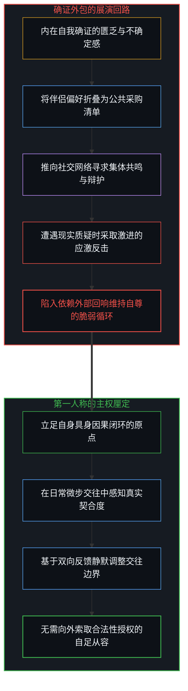
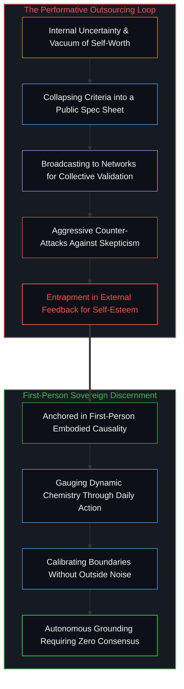
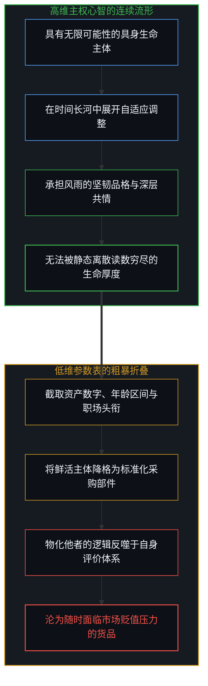
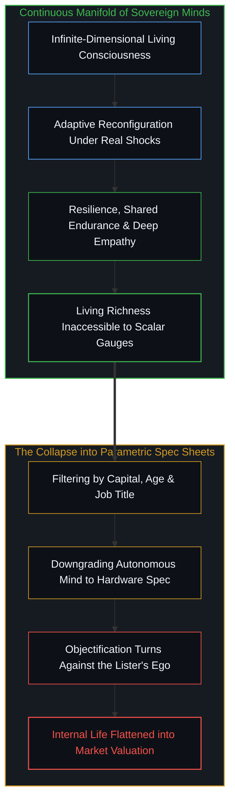
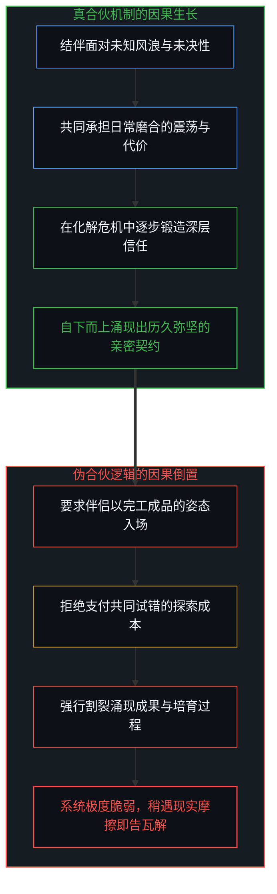
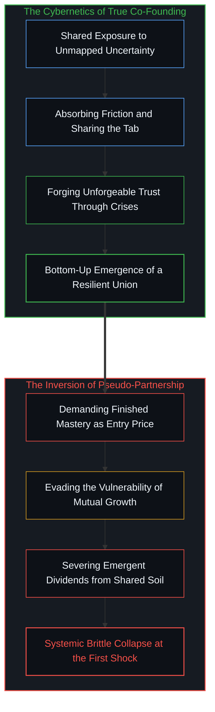
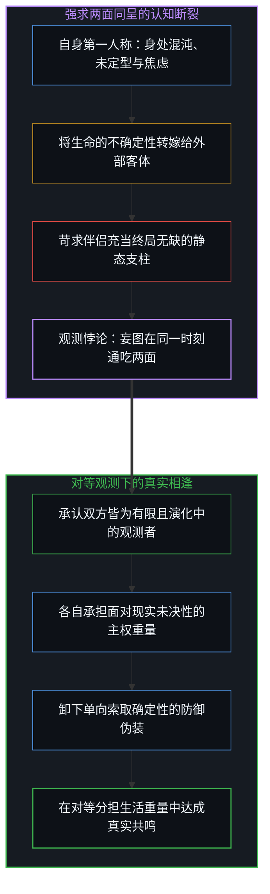
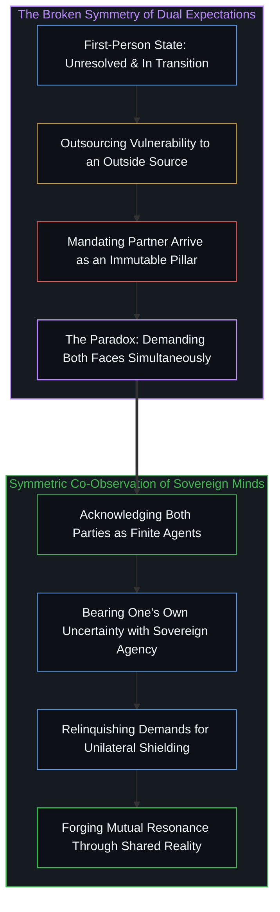
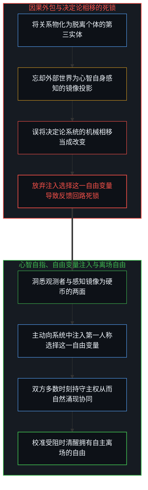
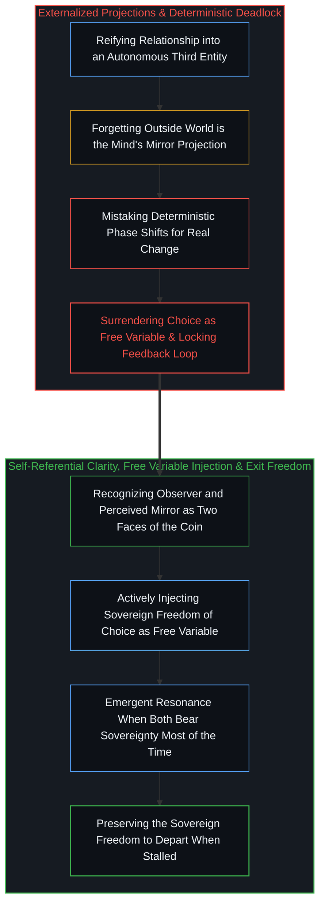

# 契约的因果倒置 / The Causal Inversion of Partnership

*所谓共同实体的虚妄、心智对自身的镜像投射与选择离场的自由 / The Illusion of the Mutual Entity, the Mind's Mirror Projection, and the Freedom to Walk Away*

社交网络中关于长久伴侣选择的讨论，正日益演变为一种充满企业采购色彩的指标展演。罗列明确的年龄区间、资产门槛、特定技术行业背景以及所谓的情绪成熟度与健康气质，并冠以非妥协标准的标签公之于众，随后在遭遇舆论审视时进行应激式的言语防卫。这种行为并非罕见的孤例，而是当代文化中广泛蔓延的认知缩影。当人们试图将建立深度人际契约的过程套入风险对冲与规格筛查的模型时，表面上展现出清醒与严谨，实则暴露出对生命关系底层因果机制的深层误解。公开张榜的伴侣采购清单与应激辩护，看似是对自身价值的高调确证，实则是第一人称自足匮乏的防御性代偿。将具有无限维度的具身生命主体降维折叠为低维参数表，不仅抹杀了人际交互中的自适应演化空间，更是将物化他者的逻辑反噬于自身。把合伙人机制等同于预购免检产品，颠倒了因果链条：真正的合伙是结伴面对未决性的协议，而非要求成品独角兽作为入场凭证。自身身处未决的混沌，却强求他者充当静态终局的免责支柱，这如同在同一次观测中妄想同时看见硬币的正反两面。所谓的共同关系本就是各自独立感知的投射，并不存在独立于个体的第三方实体需要去经营。更进一步地，一切向外延伸的关系，实质上皆是心智与自身的联结；所谓的心智之外，不过是心智自身感知向外投射的镜像，恰恰再次构成了同一枚硬币的正反两面。唯有双方在大多数时刻将因果锚定于自身，持续向系统中注入第一人称选择这一自由变量，闭环的反馈机制才能运转并涌现协同的秩序。而当分歧不再具有校准空间时，主权个体亦保有清醒离场的自由，以负责的姿态重新确立自己与真实世界的联结。

Discussions surrounding long-term partnership on social networks increasingly resemble enterprise procurement specifications. Individuals compile explicit age bands, wealth thresholds, elite technology sector credentials, and rigid behavioral criteria, broadcasting them as non-negotiable requirements before waging defensive skirmishes against public skepticism. Far from an isolated curiosity, this dynamic exemplifies a widespread contemporary mindset. When seekers attempt to package intimate human alliance within the grammar of risk hedging and specification auditing, an outward posture of pragmatic clarity conceals an epistemological misunderstanding of how living connections actually operate. A publicly broadcast partner checklist accompanied by combative defense may masquerade as confident self-worth, yet structurally signals the defensive over-assertion of an insecure observer. Collapsing an infinite-dimensional embodied agent into a low-dimensional parameter sheet erases the dynamic phase space of human interaction, while inexorably turning the logic of objectification against oneself. Conflating partnership with the procurement of a pre-certified asset inverts causality: genuine co-founding is an agreement to navigate mutual uncertainty, not the demand for a finished unicorn as an admission ticket. Experiencing one's own life as open-ended and unfinished while demanding a partner arrive as an immutable pillar of certainty is asking to observe both sides of the coin in a single measurement. The so-called shared relationship is an epistemic illusion, as there is no autonomous third entity to manage. At the deepest level, all relationships are the relationship of the mind to itself: whatever appears external is the mind's own outward projection, forming a mirror image that constitutes, once again, the two sides of the same coin. A resilient alliance only emerges when both agents anchor causality internally more often than not, actively injecting the sovereign freedom of choice as the system's sole free variable to keep the feedback loop alive, while preserving the sovereign clarity to walk away cleanly when dynamic calibration no longer serves the truth of their encounter.

## 公开展演与防御性信号：参数清单背后的确证匮乏 / Public Exhibition and Defensive Signaling: The Void of Validation Behind the Parametric Checklist

一个在自身第一人称因果闭环中从容自立的主体，其择偶标准必然是在具体的具身相处与真实互动的微步反馈中沉淀执行。喜欢什么样的人、拒绝什么样的交往方式，属于个体主权行动的边界，既无需向公众广泛通报，更无需向旁观者证明其正当性。把私人择偶偏好制作成详细的规格参数清单推向公共舆论场，并在引发争议后急迫地反唇相讥，宣称自己理应得到最好的配置，这种公开展演与防卫本身便构成了明确的信号学反讽。

如我们在[抉择本身并不沉重](../choice-itself-has-no-inherent-weight/)中所确证的，心智越是对外部产生非分的回报期待，就越容易在行动层面陷入虚妄的紧张与防御。将标准公布于众并四处寻求背书，恰恰证明当事人无法在自身内部确立坚定的自我价值。这种防御性强化在心理机制上构成了伪装：它试图用外界的同仇敌忾或流量辩护来充填内在的确证空白。清单看似是一份对外发布的选拔考卷，在功能上却成了心智为自身怯懦构筑的心理防线。通过设定脱离具体情境的严苛门槛，当事人为未来真实的亲密关系设置了高不可攀的缓冲带，从而能够名正言顺地将每一次接触的挫败归咎于市场上没有合格产品，借此逃避自身承担关系摩擦的主体责任。

An agent grounded within their own first-person causal loop tests preferences through direct interaction and embodied contact. Discovering which temperaments resonate and which patterns deplete energy is an exercise of sovereign discernment; it requires neither public announcement nor external validation. Packaging intimate relationship criteria into a rigid specification sheet, broadcasting it across public networks, and then aggressively counter-attacking critics who point out its demographic improbability produces an unmistakable semiotic irony.

As established in [Choice Itself Has No Inherent Weight](../choice-itself-has-no-inherent-weight/), the more an observer harbors unrealistic demands for external return, the more intensely the mind manufactures defensive tension. The compulsion to broadcast personal requirements reveals an inability to internally anchor self-worth. This combative posturing functions as psychological armor, attempting to substitute collective applause for autonomous clarity. While presented as a rigorous assessment of external suitors, the checklist operates as a shelter for personal evasion. By erecting arbitrary thresholds detached from lived context, the lister manufactures an alibi: future relational disappointments can be blamed on an alleged absence of high-grade candidates, insulating the observer from the vulnerability of mutual accommodation.

## 高维心智向低维参数的坍缩：物化他者对自身的镜像惩罚 / The Collapse of High-Dimensional Mind into Low-Dimensional Parameters: The Self-Inflicted Penalty of Objectifying the Other

每一个活生生的生命主体都是无限维度的观测流形。一个人的坚韧品格、在风雨中的承担意愿、在日常繁冗中的包容耐力以及面对未知考验时的自适应调整能力，属于极其高阶的动态状态。这些特质在静态的纸面参数中无从度量，只能在漫长时间的互动中自然呈现。将一个完整的生命存在粗暴折叠为几个截面的离散读数，是用工业流水线的验收逻辑去丈量具有无限可能性的主权心智。

这种客体化筛查对筛选者自身构成了严苛的镜像反噬。认知生成遵循严格的对称性：心智如何定义世界与他者，便在何种维度上框定自己。在[无法逃逸的心智视界](../one-cannot-escape-ones-own-mind/)中我们早已揭示，心智把他人客体化的那一刻，也将自己同时物化为了客体。当一个人习惯于用资产数字、职场头衔和形象指标作为衡量伴侣的标尺时，他在潜意识中也必然将自己的生存价值还原为年龄、外表和宣发渠道等商品化要素。他必须不断宣称自己是高维资产、拥有强大的分发优势，以此来证明自己具备标价的资格。这种认知错觉切断了向内探寻生命丰盈度的通道，将原本充满生机的契约变成了两份商业企划书之间的冰冷比价。

An embodied human consciousness is an infinite-dimensional manifold of adaptive states. The capacity to withstand external shocks, to maintain loyalty under duress, to exercise patience within domestic tedium, and to reconfigure priorities when plans dissolve are dynamic qualities that register zero presence on a static spreadsheet. These emergent attributes reveal themselves solely through lived duration. Collapsing an active, sovereign observer into a collection of scalar metrics applies quality-assurance inspection criteria to an entity whose value lies in open-ended adaptation.

This reduction inflicts a symmetry penalty upon the seeker. Cognition operates under mirror invariants: how a mind maps external observers dictates the bounds within which it conceives itself. As noted in [One Cannot Escape One's Own Mind](../one-cannot-escape-ones-own-mind/), the moment consciousness objectifies the other, it objectifies itself within that exact coordinate framework. When someone evaluates companions through capital brackets and corporate hierarchies, they inevitably experience their own existence as an inventory of perishable commodities: youth, physical form, and distribution reach. They must constantly maintain market relevance and broadcast strategic moats to defend their asking price. This habit of thought severs access to autonomous presence, converting intimate alliance into a balance sheet audit.

## 合伙人隐喻的伪造：将涌现结果错置为准入门槛的因果倒置 / The Forgery of the Co-Founder Metaphor: The Causal Inversion of Mistaking Emergent Fruits for Admission Fees

在当代择偶叙事中，流行将未来伴侣称为共同缔造余生的合伙人。这个借用自商业创业的词汇初听显得平等而充满进取心，但其具体的运用方式却走向了反面。在真实的商业实践中，创业合伙人之所以走到一起，从来不是因为对方已经手握上市成功的股权、跑通了盈利模型并且扫清了一切经营危机。合伙的核心定义，恰恰是面对极高的未决性与未来的未知风浪，双方自愿将自身资源、智慧与时间绑定在同一个因果闭环中，共同承担失败的代价，并在摸索中创造出原本不存在的增量。

然而，参数清单式的思维却要求入场的伴侣必须已经财务自由、身心通透、心智高度成熟并且能够提供坚固的庇护。这构成了严重的因果倒置：它企图将两个人经历数十年风雨磨砺、共同化解分歧才能自下而上涌现出的成果，当成进入关系的入场券。在[任务可委托，后果不可让渡](../the-delegation-of-the-task-and-the-inalienability-of-consequences/)中我们阐明，因果后果具有严格的不可替代性。亲密关系中最珍贵的信任、默契与安全感，是系统在一次次具身抗险与相互扶持中逐步积累起来的负熵。要求对方必须以成品形态直接交付这种安全感，无异于要求未曾开垦的荒地在春播之日就交出秋收的麦浪。这种思维不仅抹杀了共同创造的过程，也让关系在最开始就失去了扎根于现实摩擦的生长动力。

Contemporary culture embraces the startup trope of seeking a partner to co-found the rest of life. While sounding progressive, the application of this metaphor inverts its real-world architecture. Genuine co-founders do not assemble because one party brings a de-risked enterprise with established distribution and zero cash burn. The grammar of co-founding is an alignment to enter unmapped territory together: pooling judgment, absorbing execution errors, and cultivating coherence where none previously existed.

The parameter checklist demands that the incoming partner arrive already self-sufficient, spiritually resolved, and emotionally bulletproof, capable of providing unilateral security. This reverses the causal chain: it demands the downstream harvest of twenty years of shared trials as the price of admission. As demonstrated in [The Delegation of the Task and the Inalienability of Consequences](../the-delegation-of-the-task-and-the-inalienability-of-consequences/), consequence vectors are non-transferable. The trust and stability defining resilient bonds are negentropic dividends accumulated through real friction and mutual repair. Demanding a prospective partner present these finished dividends before contact begins is demanding autumn granaries on the day of vernal planting. This evasion cancels the very process that creates relational resilience.

## 硬币两面的观测悖论：用他者的静态确定性对冲自身的未决性 / The Two-Sided Coin Paradox: Offsetting Personal Indeterminacy with the Other's Static Certainty

从认识论结构审视，这种清单式诉求陷入了一个不可调和的观测悖论。提出严苛标准的个体，其自身的第一人称体验处于高度未定型的探索期：面临职场方向的调整、对未来生活的不确定感以及对自身安全感的焦虑。在这一侧，他保留着自身作为动态主体、拥有迷茫与继续成长的权利；但当目光转向契约的另一端时，他却要求对方展现出没有任何不确定性的通关姿态。

在任何严密的物理观测与逻辑推演中，一枚硬币在同一次观测坍缩中不可能同时展现正面与反面。把自己的这一侧定义为需要被照料与承托的未完成态，把对方那一侧定义为能够消解所有风险的完成态，是在同一次契约观测中强求硬币两面同呈的荒谬逻辑。如果对方真是一个剥离了未决性与自身探索需求的静态产品，他就已经丧失了作为独立主权心智的鲜活性与同理心；如果他是一个活生生的人，他就必然在具体的生活坐标中背负着自身的局限、困惑与演化课题。企图把自身应当承受的未决性全盘转嫁给一个神话般的客体，既是对他者生命维度的漠视，也是对自己第一人称责任的背离。

Examined through epistemological structure, the parametric checklist reveals an irresolvable observational contradiction. The lister experiences their own life as open-ended, unresolved, and anxious: navigating career transitions, contending with emotional needs, and seeking security. Within this first-person vantage, they claim the subjective freedom to remain unfinished. Yet when looking across the table, they demand that the counterpart arrive as an immutable monolith, stripped of all vulnerability and existential search.

In physics and logic, a coin cannot reveal both heads and tails in a single observation. Framing one's own side as an evolving project needing shelter while mandating that the partner function as a pre-solved answer is asking both faces of the coin to face the same lens. If the partner were truly an immutable device free of uncertainty, they would lack the adaptive aliveness that makes mutual resonance possible; if they are a sovereign living mind, they navigate their own finite horizon and evolving concerns. Attempting to offload personal uncertainty onto an idealized figure ignores the reality of the other while abandoning first-person agency.

## 关系的独立主权：心智与自身的镜像投射、硬币两面的重现与离场自由 / The Sovereignty of Relationship: The Mind's Mirror Projection, the Two Sides of the Coin Revisited, and the Freedom to Walk Away

天助自助者，一切外援实质上都是错置的自助。在人际契约中等待一个救星来补足自身的虚弱，是在因果层面自我放弃主权的逃避。更深层的认知误区，在于人们习惯于将关系物化为一个独立于双方的第三实体，甚至企图去“经营共同关系”。然而，正如我们在[共享沙盒的幻象](../the-illusion-of-the-shared-sandbox/)与[无法逃逸的心智视界](../one-cannot-escape-ones-own-mind/)中所剖析的，任何被感知的“共同关系”，终究是在各自的第一人称视界内部独立成像。世界上并不存在一个横亘在两人之间的公共沙盒等待修补；所有关系在结构上都是独立主权的——它始终是个体自身与伴侣、自身与世界的特定联结。

若追溯至最源头的感知结构，一切关系实质上都是心智与自身的联结。正如在[切分的几何学](../the-geometry-of-the-cut/)中所确证的，心智无法跳出自身去感知一个与感知分离的客观之物；所谓心智之外的一切遭遇与显象，皆是心智自身感知流向外的投射。外在世界与所遇见的伴侣，并非独立于心智之外的孤立存在，而是心智自身状态向外投射的一面明镜。在这里，硬币两面的比喻再次显露出其深层同构：观测的主体与被观测的关系，恰恰是同一枚硬币不可分割的正反两面。当一个人对着清单上的指标焦虑、指责伴侣未能满足自己的安全感时，他实际上是在对着镜中自身的投影宣战，试图强行擦拭镜子来改变自己的容颜。你永远无法跨越视界去直接操控对方的心智，更无法隔空修理一个虚幻的客体。个体所能做且唯一能做的，是在自身的因果闭环中做出更优的抉择，以不同的行动去改善心智与自身的联结。

稳固而默契的联动态势，不是刻意求取的产物，而是一种宏观涌现：唯有当双方在大多数时刻都承担起自身的主权责任、将因果之锚定位于自身内部时，协调与共鸣才会自然发生。人际互动的挫败与怨怼，表面上常被解读为情感隔阂或性格不合，但在深层的因果机制上，无一例外是心智将因果外包所触发的系统性倒置：它误将决定论系统的机械相移当成改变，却不知真正的改变唯有通过向系统中注入第一人称选择这一自由变量才能启动。一旦将匮乏与停滞的因果推脱给镜中的投影、指责对方未能满足自身的期待，心智便在同一瞬间放弃了注入自由变量的主权，关闭了自我调节的误差输入通道；既然因在外部，自身便无法通过改变抉择去收敛偏差，原本生动的自适应反馈回路由此退化为开环死锁。正如我们在[规程的倒置与因果回路的消声](../the-inversion-of-the-protocol-and-the-silencing-of-the-causal-loop/)与[主权抉择的双面性与观察的客体化](../the-two-sided-nature-of-sovereign-choice-and-the-objectification-of-observation/)中所阐明的，关系的瓦解实质上是主体放弃向系统注入选择、任由机械相移锁死动态演化后的必然显象。

将因果锚定于自身，并不意味着在死锁或损耗的困局中充当逆来顺受的殉道者。相反，完备的主权恰恰包含了清醒决断、选择离场的自由。当深度的认知差异或价值裂痕使得校准不再可能时，主权主体拥有自主选择终止契约并抽身离去的自由。这种离场不是怨天尤人的逃避，更不是将责任甩给对方的道德审判；它是心智在认清现实边界之后，为了维护自身与真实的自洽联结而作出的主动抉择。正如在[数字火箭、同行审查与因果闭环的稀释](../the-dilution-of-the-causal-loop-and-the-misallocation-of-agency/)中所揭示的，真正的韧性建立在直接面对现实反馈的主体能动性之上。手持清单去索求免责的确定性，只会收获脆弱的幻象；这正是[“普通人视角”的解释陷阱](../the-explanatory-trap-of-the-ordinary-perspective/)中所剖析的均值锁死：借由大众的退缩与合谋来合理化自身的停滞，误把描述势阱的诊断报告当成解困蓝图，在深信自己“别无选择”的虚假安慰中自我囚禁。唯有立足第一人称的自立、在大多数时刻自主承担行动后果，并在必要时拥有从容离场的勇气，个体才能在广阔的世界中展开生机勃勃的真实联结。

God only helps those who help themselves: all external rescue is misallocated self-help. Awaiting a savior to compensate for internal deficits abdicates sovereign agency. A deeper confusion lies in the reification of relationship into an autonomous third entity hovering between partners, accompanied by the earnest urge to work on the shared bond. Yet as demonstrated in [The Illusion of the Shared Sandbox](../the-illusion-of-the-shared-sandbox/) and [One Cannot Escape One's Own Mind](../one-cannot-escape-ones-own-mind/), whatever is experienced as a relationship is strictly an individually perceived phenomenon within each observer's first-person horizon. There is no external collective sandbox suspended between minds waiting to be repaired; every relationship is sovereign in structure—it is fundamentally the relationship of oneself to the partner, and of oneself to the rest of reality.

Tracing experience to its primary perceptual architecture, all relationships are the relationship of the mind to itself. As confirmed in [The Geometry of the Cut](../the-geometry-of-the-cut/), an observer cannot step outside consciousness to encounter an isolated object divorced from perception; whatever appears external is the outward projection of the mind's own perceptual apparatus. The surrounding world and the encountered partner are not independent entities severed from the observer, but mirror images of the mind's own internal state. Here, the metaphor of the two-sided coin reveals its ultimate isomorphism: the observing subject and the perceived relationship are the inseparable front and back faces of the very same coin. When an individual agonizes over metric checklists or blames a partner for failing to provide emotional security, they are effectively fighting their own reflection in the mirror, attempting to wipe the glass to alter their own face. An agent cannot leap beyond their horizon to directly manipulate another consciousness, nor repair a phantom third object. The only operable lever is to make better choices and act differently within one's own causal loop, continuously refining the mind's relationship to itself.

A resilient, harmonious dynamic is an unforced macroscopic emergence: it arises only when both participants assume personal sovereignty more often than not, keeping the anchor of causality internal. Relational collapses and chronic friction may present superficially as emotional grievances or personality clashes, but beneath the surface lies a systematic reversal: externalizing causality mistakes the mechanical phase shift of a closed deterministic system for genuine change, forgetting that real change can only be initiated by actively injecting a free variable into the system—the sovereign freedom of choice. The moment an agent projects the source of distress onto the mirror image—accusing the partner of failing expectations—they surrender their sole free variable and disconnect the error-correcting feedback loop from their own decision space. If causality is cast outward, no internal recalibration can close the gap; the adaptive feedback loop freezes into open-loop paralysis. As demonstrated in [The Inversion of the Protocol and the Silencing of the Causal Loop](../the-inversion-of-the-protocol-and-the-silencing-of-the-causal-loop/) and [The Two-Sided Nature of Sovereign Choice and the Objectification of Observation](../the-two-sided-nature-of-sovereign-choice-and-the-objectification-of-observation/), the disintegration of a relationship is nothing other than the inevitable locking of systemic evolution when an observer abdicates the injection of sovereign choice.

Anchoring causality internally does not prescribe stoic martyrdom within a toxic or deadlocked dynamic. On the contrary, genuine sovereignty includes the clean, uncompromised freedom to walk away. When irreconcilable divergences close the possibility of reciprocal calibration, a sovereign observer holds the freedom to terminate the contract and depart. Such departure is neither a petulant evasion nor an externalized moral trial; it is an active choice to align oneself with reality and self-coherence. As established in [The Dilution of the Causal Loop and the Misallocation of Agency](../the-dilution-of-the-causal-loop-and-the-misallocation-of-agency/), systemic resilience rests upon embodied agents facing unvarnished feedback. Demanding pre-certified certainty from a checklist generates fragile illusions; this exemplifies the systemic deadlock unmasked in [The Explanatory Trap of the "Ordinary Perspective"](../the-explanatory-trap-of-the-ordinary-perspective/): seeking refuge in herd consensus to rationalize personal inertia, mistaking a diagnostic report of the trap for an emancipatory blueprint, and choosing to believe one has no choice. Only by grounding action in first-person accountability, holding causality internally more often than not, and preserving the courage to leave when necessary, can sovereign agents cultivate genuine aliveness within the world.

