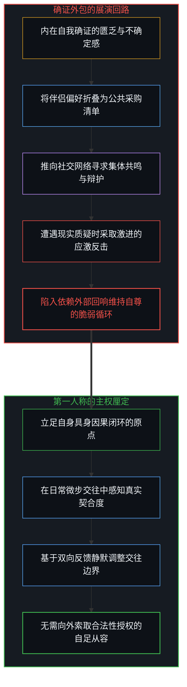
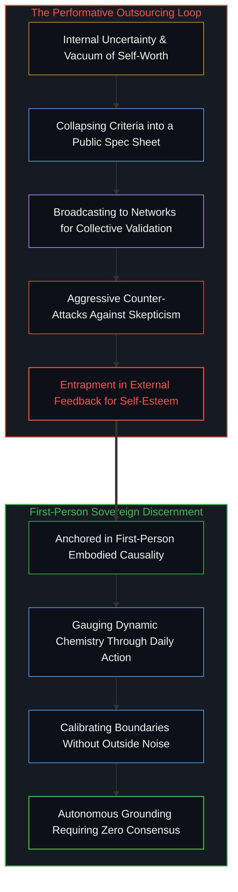
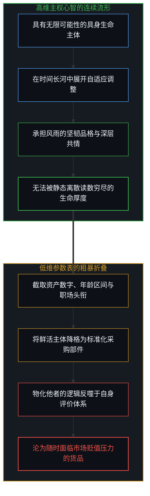
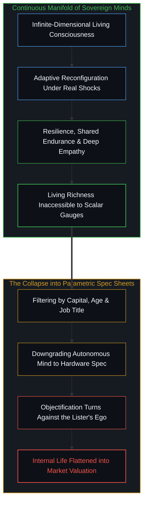
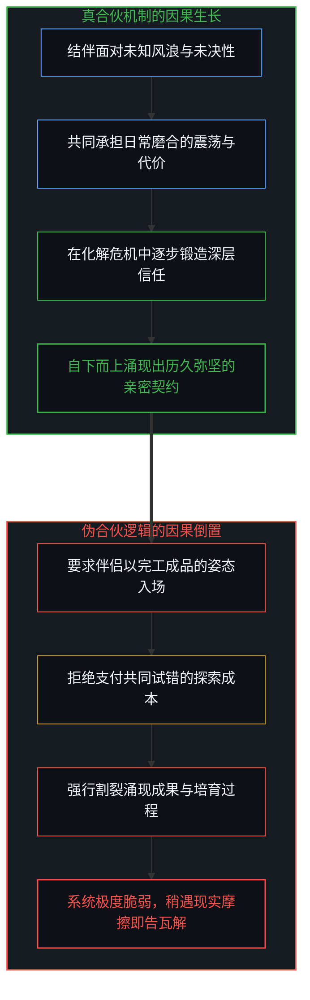
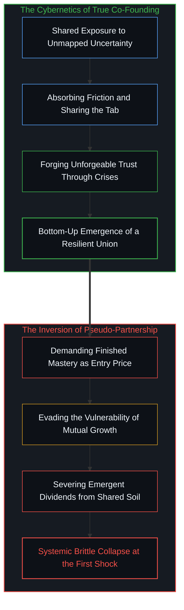
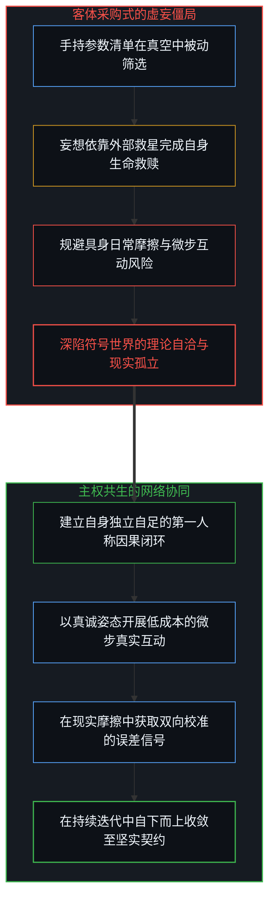
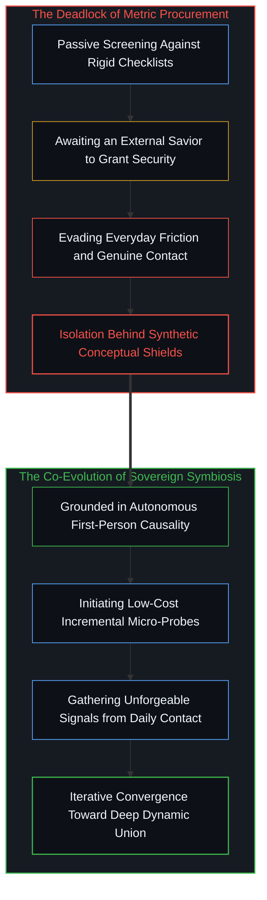

# 契约的因果倒置 / The Causal Inversion of Partnership

*参数化客体、合伙人迷思与硬币两面的观测悖论 / Parametric Objectification, the Co-Founder Fallacy, and the Two-Sided Coin Paradox*

社交网络中关于长久伴侣选择的讨论，正日益演变为一种充满企业采购色彩的指标展演。罗列明确的年龄区间、资产门槛、特定技术行业背景以及所谓的情绪成熟度与健康气质，并冠以非妥协标准的标签公之于众，随后在遭遇舆论审视时进行应激式的言语防卫。这种行为并非罕见的孤例，而是当代文化中广泛蔓延的认知缩影。当人们试图将建立深度人际契约的过程套入风险对冲与规格筛查的模型时，表面上展现出清醒与严谨，实则暴露出对生命关系底层因果机制的深层误解。公开张榜的伴侣采购清单与应激辩护，看似是对自身价值的高调确证，实则是第一人称自足匮乏的防御性代偿。将具有无限维度的具身生命主体降维折叠为低维参数表，不仅抹杀了人际交互中的自适应演化空间，更是将物化他者的逻辑反噬于自身。把合伙人机制等同于预购免检产品，颠倒了因果链条：真正的合伙是共同面对未决性的协议，而非要求成品独角兽作为入场凭证。自身身处未决的混沌，却强求他者充当静态终局的免责支柱，这如同在同一次观测中妄想同时看见硬币的正反两面。唯有破除外包确证的幻象，立足自身因果闭环的第一人称自立，两个主权个体才能在具身试错与双向校准中，共同构建出稳健协同的生命契约。

Discussions surrounding long-term partnership on social networks increasingly resemble enterprise procurement specifications. Individuals compile explicit age bands, wealth thresholds, elite technology sector credentials, and rigid behavioral criteria, broadcasting them as non-negotiable requirements before waging defensive skirmishes against public skepticism. Far from an isolated curiosity, this dynamic exemplifies a widespread contemporary mindset. When seekers attempt to package intimate human alliance within the grammar of risk hedging and specification auditing, an outward posture of pragmatic clarity conceals an epistemological misunderstanding of how living connections actually operate. A publicly broadcast partner checklist accompanied by combative defense may masquerade as confident self-worth, yet structurally signals the defensive over-assertion of an insecure observer. Collapsing an infinite-dimensional embodied agent into a low-dimensional parameter sheet erases the dynamic phase space of human interaction, while inexorably turning the logic of objectification against oneself. Conflating partnership with the procurement of a pre-certified asset inverts causality: genuine co-founding is an agreement to navigate mutual uncertainty, not the demand for a finished unicorn as an admission ticket. Experiencing one's own life as open-ended and unfinished while demanding a partner arrive as an immutable pillar of certainty is asking to observe both sides of the coin in a single measurement. True alignment emerges only when sovereign individuals ground themselves in their own causal loops, calibrating mutual gradients through incremental friction rather than outsourcing rescue to a metric fantasy.

## 公开展演与防御性信号：参数清单背后的确证匮乏 / Public Exhibition and Defensive Signaling: The Void of Validation Behind the Parametric Checklist

一个在自身第一人称因果闭环中从容自立的主体，其择偶标准必然是在具体的具身相处与真实互动的微步反馈中沉淀执行。喜欢什么样的人、拒绝什么样的交往方式，属于个体主权行动的边界，既无需向公众广泛通报，更无需向旁观者证明其正当性。把私人择偶偏好制作成详细的规格参数清单推向公共舆论场，并在引发争议后急迫地反唇相讥，宣称自己理应得到最好的配置，这种公开展演与防卫本身便构成了明确的信号学反讽。

如我们在[抉择本身并不沉重](../choice-itself-has-no-inherent-weight/)中所确证的，心智越是对外部产生非分的回报期待，就越容易在行动层面陷入虚妄的紧张与防御。将标准公布于众并四处寻求背书，恰恰证明当事人无法在自身内部确立坚定的自我价值。这种防御性强化在心理机制上构成了伪装：它试图用外界的同仇敌忾或流量辩护来充填内在的确证空白。清单看似是一份对外发布的选拔考卷，在功能上却成了心智为自身怯懦构筑的心理防线。通过设定脱离具体情境的严苛门槛，当事人为未来真实的亲密关系设置了高不可攀的缓冲带，从而能够名正言顺地将每一次接触的挫败归咎于市场上没有合格产品，借此逃避自身承担关系摩擦的主体责任。

An agent grounded within their own first-person causal loop tests preferences through direct interaction and embodied contact. Discovering which temperaments resonate and which patterns deplete energy is an exercise of sovereign discernment; it requires neither public announcement nor external validation. Packaging intimate relationship criteria into a rigid specification sheet, broadcasting it across public networks, and then aggressively counter-attacking critics who point out its demographic improbability produces an unmistakable semiotic irony.

As established in [Choice Itself Has No Inherent Weight](../choice-itself-has-no-inherent-weight/), the more an observer harbors unrealistic demands for external return, the more intensely the mind manufactures defensive tension. The compulsion to broadcast personal requirements reveals an inability to internally anchor self-worth. This combative posturing functions as psychological armor, attempting to substitute collective applause for autonomous clarity. While presented as a rigorous assessment of external suitors, the checklist operates as a shelter for personal evasion. By erecting arbitrary thresholds detached from lived context, the lister manufactures an alibi: future relational disappointments can be blamed on an alleged absence of high-grade candidates, insulating the observer from the vulnerability of mutual accommodation.

## 高维心智向低维参数的坍缩：物化他者对自身的镜像惩罚 / The Collapse of High-Dimensional Mind into Low-Dimensional Parameters: The Self-Inflicted Penalty of Objectifying the Other

每一个活生生的生命主体都是无限维度的观测流形。一个人的坚韧品格、在风雨中的承担意愿、在日常繁冗中的包容耐力以及面对未知考验时的自适应调整能力，属于极其高阶的动态状态。这些特质在静态的纸面参数中无从度量，只能在漫长时间的互动中自然呈现。将一个完整的生命存在粗暴折叠为几个截面的离散读数，是用工业流水线的验收逻辑去丈量具有无限可能性的主权心智。

这种客体化筛查对筛选者自身构成了严苛的镜像反噬。认知生成遵循严格的对称性：心智如何定义世界与他者，便在何种维度上框定自己。在[无法逃逸的心智视界](../one-cannot-escape-ones-own-mind/)中我们早已揭示，心智把他人客体化的那一刻，也将自己同时物化为了客体。当一个人习惯于用资产数字、职场头衔和形象指标作为衡量伴侣的标尺时，他在潜意识中也必然将自己的生存价值还原为年龄、外表和宣发渠道等商品化要素。他必须不断宣称自己是高维资产、拥有强大的分发优势，以此来证明自己具备标价的资格。这种认知错觉切断了向内探寻生命丰盈度的通道，将原本充满生机的契约变成了两份商业企划书之间的冰冷比价。

An embodied human consciousness is an infinite-dimensional manifold of adaptive states. The capacity to withstand external shocks, to maintain loyalty under duress, to exercise patience within domestic tedium, and to reconfigure priorities when plans dissolve are dynamic qualities that register zero presence on a static spreadsheet. These emergent attributes reveal themselves solely through lived duration. Collapsing an active, sovereign observer into a collection of scalar metrics applies quality-assurance inspection criteria to an entity whose value lies in open-ended adaptation.

This reduction inflicts a symmetry penalty upon the seeker. Cognition operates under mirror invariants: how a mind maps external observers dictates the bounds within which it conceives itself. As noted in [One Cannot Escape One's Own Mind](../one-cannot-escape-ones-own-mind/), the moment consciousness objectifies the other, it objectifies itself within that exact coordinate framework. When someone evaluates companions through capital brackets and corporate hierarchies, they inevitably experience their own existence as an inventory of perishable commodities: youth, physical form, and distribution reach. They must constantly maintain market relevance and broadcast strategic moats to defend their asking price. This habit of thought severs access to autonomous presence, converting intimate alliance into a balance sheet audit.

## 合伙人隐喻的伪造：将涌现结果错置为准入门槛的因果倒置 / The Forgery of the Co-Founder Metaphor: The Causal Inversion of Mistaking Emergent Fruits for Admission Fees

在当代择偶叙事中，流行将未来伴侣称为共同缔造余生的合伙人。这个借用自商业创业的词汇初听显得平等而充满进取心，但其具体的运用方式却走向了反面。在真实的商业实践中，创业合伙人之所以走到一起，从来不是因为对方已经手握上市成功的股权、跑通了盈利模型并且扫清了一切经营危机。合伙的核心定义，恰恰是面对极高的未决性与未来的未知风浪，双方自愿将自身资源、智慧与时间绑定在同一个因果闭环中，共同承担失败的代价，并在摸索中创造出原本不存在的增量。

然而，参数清单式的思维却要求入场的伴侣必须已经财务自由、身心通透、心智高度成熟并且能够提供坚固的庇护。这构成了严重的因果倒置：它企图将两个人经历数十年风雨磨砺、共同化解分歧才能自下而上涌现出的成果，当成进入关系的入场券。在[任务可委托，后果不可让渡](../the-delegation-of-the-task-and-the-inalienability-of-consequences/)中我们阐明，因果后果具有严格的不可替代性。亲密关系中最珍贵的信任、默契与安全感，是系统在一次次具身抗险与相互扶持中逐步积累起来的负熵。要求对方必须以成品形态直接交付这种安全感，无异于要求未曾开垦的荒地在春播之日就交出秋收的麦浪。这种思维不仅抹杀了共同创造的过程，也让关系在最开始就失去了扎根于现实摩擦的生长动力。

Contemporary culture embraces the startup trope of seeking a partner to co-found the rest of life. While sounding progressive, the application of this metaphor inverts its real-world architecture. Genuine co-founders do not assemble because one party brings a de-risked enterprise with established distribution and zero cash burn. The grammar of co-founding is an alignment to enter unmapped territory together: pooling judgment, absorbing execution errors, and cultivating coherence where none previously existed.

The parameter checklist demands that the incoming partner arrive already self-sufficient, spiritually resolved, and emotionally bulletproof, capable of providing unilateral security. This reverses the causal chain: it demands the downstream harvest of twenty years of shared trials as the price of admission. As demonstrated in [The Delegation of the Task and the Inalienability of Consequences](../the-delegation-of-the-task-and-the-inalienability-of-consequences/), consequence vectors are non-transferable. The trust and stability defining resilient bonds are negentropic dividends accumulated through real friction and mutual repair. Demanding a prospective partner present these finished dividends before contact begins is demanding autumn granaries on the day of vernal planting. This evasion cancels the very process that creates relational resilience.

## 硬币两面的观测悖论：用他者的静态确定性对冲自身的未决性 / The Two-Sided Coin Paradox: Offsetting Personal Indeterminacy with the Other's Static Certainty

从认识论结构审视，这种清单式诉求陷入了一个不可调和的观测悖论。提出严苛标准的个体，其自身的第一人称体验处于高度未定型的探索期：面临职场方向的调整、对未来生活的不确定感以及对自身安全感的焦虑。在这一侧，他保留着自身作为动态主体、拥有迷茫与继续成长的权利；但当目光转向契约的另一端时，他却要求对方展现出没有任何不确定性的通关姿态。

在任何严密的物理观测与逻辑推演中，一枚硬币在同一次观测坍缩中不可能同时展现正面与反面。把自己的这一侧定义为需要被照料与承托的未完成态，把对方那一侧定义为能够消解所有风险的完成态，是在同一次契约观测中强求硬币两面同呈的荒谬逻辑。如果对方真是一个剥离了未决性与自身探索需求的静态产品，他就已经丧失了作为独立主权心智的鲜活性与同理心；如果他是一个活生生的人，他就必然在具体的生活坐标中背负着自身的局限、困惑与演化课题。企图把自身应当承受的未决性全盘转嫁给一个神话般的客体，既是对他者生命维度的漠视，也是对自己第一人称责任的背离。

Examined through epistemological structure, the parametric checklist reveals an irresolvable observational contradiction. The lister experiences their own life as open-ended, unresolved, and anxious: navigating career transitions, contending with emotional needs, and seeking security. Within this first-person vantage, they claim the subjective freedom to remain unfinished. Yet when looking across the table, they demand that the counterpart arrive as an immutable monolith, stripped of all vulnerability and existential search.

In physics and logic, a coin cannot reveal both heads and tails in a single observation. Framing one's own side as an evolving project needing shelter while mandating that the partner function as a pre-solved answer is asking both faces of the coin to face the same lens. If the partner were truly an immutable device free of uncertainty, they would lack the adaptive aliveness that makes mutual resonance possible; if they are a sovereign living mind, they navigate their own finite horizon and evolving concerns. Attempting to offload personal uncertainty onto an idealized figure ignores the reality of the other while abandoning first-person agency.

## 从客体采购到主体共生：第一人称自足与微步协同 / From Parametric Procurement to Subjective Symbiosis: First-Person Sovereignty and Micro-Step Synergy

天助自助者，一切外援实质上都是错置的自助。试图在婚恋市场上等待一个全能的救星来补足自身的虚弱，是在人际契约中自我放弃主权因果力的表现。在[数字火箭、同行审查与因果闭环的稀释](../the-dilution-of-the-causal-loop-and-the-misallocation-of-agency/)中我们指出，任何可靠的工程架构与系统安全，都依赖于直接参与现实反馈的具身主体；一旦把求证与维系的责任让渡给抽象共识，系统便不可避免地走向脆弱。

生命契约的稳固建立从来不是两套参数清单的机械拼接，而是两个具有第一人称自足能力的主权个体，在真实的交互网络中建立起相互适应的控制论闭环。如同梯度下降中的微步探针，真正的了解不是依靠纸面审查，而是在日常交往的细碎互动中持续获取未失真的误差反馈：在一次行程安排的摩擦中观察彼此的妥协意愿，在一次观点碰撞中检验彼此的沟通边界，在一次生活失误中体验彼此的担当态度。每一次微调都在为双方的协作网络提供确切的梯度校准。两个不再向外索求奇迹、不再把伴侣当成避风港的主体，以真实的自我相照面，在循序渐进的微调中共同收敛于坚不可摧的生命同盟。个人选择是每个个体的因果闭环中唯一的自由变量，而两个主权自由变量的双向奔赴与相互校准，构成了超越一切低维参数的生命契约。

God only helps those who help themselves: all external rescue is misallocated self-help. Waiting for an omnipotent savior to compensate for internal deficits abdicates causal agency. In [The Dilution of the Causal Loop and the Misallocation of Agency](../the-dilution-of-the-causal-loop-and-the-misallocation-of-agency/), we noted that robust systems rely on agents maintaining direct contact with reality; delegating verification to abstract procedures invites systemic fragility.

A lasting alliance is never the mechanical alignment of two metric catalogs. It is the convergence of two sovereign agents establishing a reciprocal feedback loop. Much like gradient descent using unforgeable signals from small probes, mutual understanding builds not through pre-screening but through unvarnished feedback from daily contact: observing how a minor travel mishap is resolved, examining boundaries during philosophical friction, and witnessing how accountability is assumed when plans derail. Each micro-interaction delivers clear gradients for recalibrating mutual dynamics. Two agents who abandon demands for an external rescue encounter each other as sovereign observers, converging through step-by-step calibration toward a resilient communion. Individual choice remains the only free variable within each agent's causal loop; the mutual alignment of two sovereign variables creates an alliance surpassing every parametric checklist.

