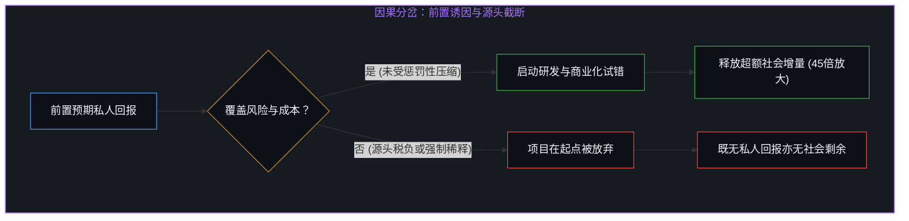
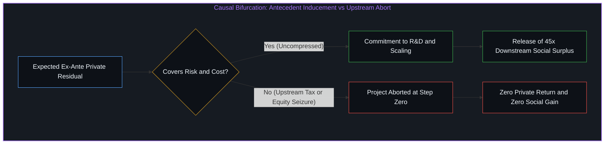

# 私人残差与社会剩余的因果次序 / The Causal Order of Private Residuals and Social Surplus

*技术红利是试错下注后的下游耗散，经验度量印证而非构筑因果根基 / Technological surplus is downstream from risk; data validates rather than grounds causality.*

技术进步所释放的宏观价值，在规模上远远超出了最初承担试错风险的行动者所能留存的私人份额。围绕财富集中的流行叙事习惯于将创新成果视作一个既成不变的静态存量，进而推断少数企业家的巨额财富是从社会整体福祉中剥离的份额。然而因果律的铁律揭示出截然相反的时序结构：任何财富在被享受之前，必须首先由行动者在不确定性中下注催生，并沿着物理扩散与竞争耗散的链条流向大众；经济学中的实证度量只是对这一链条在宏观尺度上的忠实印证，绝非该因果次序成立的本体根据。

The macroscopic value unleashed by technological progress vastly exceeds the private share retained by the actors who initially shoulder the risks of trial and error. Popular narratives surrounding wealth concentration routinely treat the fruits of innovation as a static, pre-existing stock, inferring that the fortunes of a few entrepreneurs represent shares subtracted from broader human wellbeing. Yet the unyielding arrow of causality reveals an inverse temporal structure: prior to being enjoyed, any surplus must first be brought into being by agents placing wagers under uncertainty, only then flowing to the public through physical diffusion and competitive dissipation. Empirical measurements in economics merely register faithful footprints of this sequence at a macroscopic scale; they do not constitute the foundational ground of its validity.

## 一、 第一人称行动先于存量：经验度量的印记角色 / 1. First-Person Action Precedes Stock: The Evidentiary Role of Empirical Telemetry

当公众目光聚焦于人工智能领军者或科技巨头的纸面身家时，直觉很容易滑向零和对抗的静态框架，仿佛富豪财富的增长自然对应着普通人机会的收缩。这种直觉的谬误在于把“财富的分配”当成了第一因，遗忘了所有可分配的盈余在物理上必须先被具体的生命心智所创造。威廉·诺德豪斯对美国战后非农经济的经典度量显示，技术革新所催生的社会总剩余中，生产者最终仅能捕获大约2.2%的私人份额，其余97.8%的收益全数通过更低的价格、更优的质量以及前所未有的服务能力外溢给全体消费者。这项著名的经济学研究并不能从无到有地发明或“证明”因果关系，它仅仅是一份高分辨率的经验遥测记录，生动记录下了不确定性试错在现实世界中所必然引发的耗散痕迹。

This asymmetric topology of small private residuals and massive social dividends emerges repeatedly across major process innovations throughout civilization. When public scrutiny fixates on the paper net worth of artificial intelligence leaders or technological founders, intuition slides effortlessly into a zero-sum, static frame, as though billionaire wealth directly corresponds to the subtraction of opportunities for ordinary individuals. The error of this intuition lies in treating the distribution of wealth as a primary cause, forgetting that all distributable surplus must physically be brought into existence by living minds before it can exist. William Nordhaus's landmark empirical study of the postwar United States nonfarm economy revealed that producers captured only roughly 2.2 percent of the total social surplus generated by technological change, with the remaining 97.8 percent passed through to consumers via lower prices, superior quality, and unprecedented capabilities. This renowned econometric inquiry did not invent or deduce causality from a vacuum; it serves as a high-resolution evidentiary telemetry, capturing the macroscopic dissipation that inevitably follows when uncertain wagers interface with reality.

这种微小私人残差与庞大社会红利的非对称拓扑，在文明史上的重大工艺演进中反复显现。亨利·福特推行汽车流水线作业使生产效率发生飞跃，然而后续度量表明其创造的消费者剩余占据了相关支出的巨大份额，企业留存的利润相比消费者节省的时间与出行便利微不足道；早期的机械化棉纺织同样如此，技术普及所带来的廉价衣物供给改善了数亿人的生活基准，而棉纺工厂主的财富仅为这股洪流中极小的一滴。在算力、互联网与物流网络中，同样的因果机制一再重演，以至于像亚马逊物流体系带来的全社会履约成本节约，数倍甚至数十倍于创始团队所持有的股权估值。正如关于[拥有更多并非因由](../having-more-is-never-the-cause/)的探讨所揭示的，财富记账上的存量数字并非财富发生的源泉，而是社会合作红利沉淀后的极薄投影。这些历史数据之所以呈现惊人的一致性，不是因为统计学规律约束了经济，而是因为第一人称行动者在物理世界中的试错扩散，天然遵循着从前置下注到全域耗散的因果单向度。

Henry Ford's introduction of the moving assembly line caused an enormous leap in manufacturing efficiency, yet subsequent studies revealed that the resulting consumer surplus accounted for a major share of relevant expenditure, rendering the firm's retained profits negligible compared to the time saved and mobility gained by buyers. Mechanized cotton spinning exhibited the identical dynamic: widespread adoption lowered garment costs and raised the living standard of hundreds of millions, while mill owners' fortunes constituted merely a tiny drop in that systemic current. In computing, telecommunications, and digital logistics networks, the identical causal mechanism operates, such that the cumulative logistics cost reductions provided by systems like Amazon's infrastructure surpass the equity value held by founders by multiples. As explored in [Having More Is Never the Cause](../having-more-is-never-the-cause/), the stock numbers registered on balance sheets are not the generative cause of wealth, but the paper shadows left after social cooperation has already paid out. These historical records display striking consistency not because statistics governs the economy, but because first-person actors confronting the physical world naturally operate along a unidirectional causal arrow from ex-ante risk-bearing to systemic dissipation.

## 二、 不可还原的先验：风险承担的时序与诱因残差 / 2. The Irreducible Prior: The Causal Sequence of Risk and the Inducement Residual

认识论上的核心分野，在于能否看清因果有效性的真正来源。社会剩余并非由经验统计所“证明”的外部客观规律，而是从“行动与因果不可拆分”这一不可还原的先验中自然推导出的必然结论。在任何技术突破被社会采纳之前，潜在的财富在物理宇宙中并不存在，它没有预先存放在任何隐秘的库房中等待发掘。只有当具体的生命心智在高度不确定的迷雾中下注，承担研发夭折、资本耗尽与心智沉没的高额代价时，通往新秩序的微小通道才会被艰难凿开。

The core epistemological distinction lies in recognizing the authentic origin of causal validity. Social surplus is not an external regularity proven into existence by empirical statistics, but an unavoidable deduction stemming directly from the irreducible prior: that first-person agency and causality are inseparable. Prior to the adoption of any technological advance, prospective surplus simply does not exist anywhere in the physical universe; it does not await discovery in some subterranean vault. Only when living minds place active wagers amidst dense uncertainty, bearing the steep risks of experimental failure, capital exhaustion, and wasted focus, is a fragile aperture toward higher order forged into the world.

行动者之所以甘愿将稀缺资源掷入未知的试错深渊，唯一的前提是他们预期能够截留一部分足以覆盖极高失败概率的私人残差。一旦技术在现实摩擦中跑通，知识非排他性的物理属性便立即主导了后续发展。竞争对手的竞相效仿、替代方案的迅速涌现以及市场价格的持续回落，会在极短的时间窗口内将绝大部分增量价值剥离出创新者的账户，直接转移给全社会的终端使用者。私人所最终保留的这2.2%份额，既是当初诱发不确定性探索的前置期权，也是大部分成果被下游迅速稀释后的事后残羹。许多评论者轻率宣称“我们既能享受繁荣又能消灭巨额财富”，正是混淆了这种先与后的时序位置，把作为因由的前置诱因误判为可以任意切除的赘疣。

The sole condition under which agents willingly commit scarce resources into the abyss of experimentation is the anticipation of capturing a private residual sufficient to compensate for extreme odds of failure. Once an advance proves viable against environmental friction, the non-excludable physical nature of codified knowledge immediately dominates subsequent events. Competitive imitation, the emergence of substitutes, and continuous price declines strip the vast majority of generated value away from the innovator within a narrow window, transferring it directly to downstream users. The 2.2 percent private share that remains serves a dual role: it is both the ex-ante inducement that called the project into existence, and the ex-post residue left after the market has eroded rents. Commentators who casually declare that society can enjoy technological abundance while eliminating concentrated wealth confuse this chronological order, misdiagnosing the antecedent cause as an expendable surplus that can be severed at will.

## 三、 源头干预的杠杆反噬与增量抹杀 / 3. The Leverage of Upstream Intervention and the Eradication of Surplus

任何试图通过激进课税或强制平分来切除这一残差的政策构想，都是在因果链条的源头实施阻断。既然行动的有效性源于行动者对前置诱因的主观权衡，那么当政策强行压缩预期残差时，行动者在决策时刻的因果计算就已被重写。关于高额资本利得税和边际税率对专利产出产生负向抑制（弹性系数介于负0.5至负1.8之间）的经济学计量，并不是导致创新减少的“原因”，而是数以万计的个体在面对负向预期时选择放弃下注所留下的宏观统计投影。这种创新产出的萎缩发生在任何事后财富再分配得以展开之前，意味着那些本应被创造出来的后续项目在萌芽阶段就已流产，其本可带来的全社会福利未曾有机会进入现实世界的度量视野。

Any policy proposal attempting to excise this private residual through punitive taxation or mandatory equalization intervenes directly at the root of the causal chain. Because the validity of action stems from an agent's evaluation of antecedent payoffs, compressing expected residuals rewrites that causal calculus at the moment of commitment. Econometric estimates showing that elevated capital-gains taxes and top marginal rates depress patenting and high-value innovations—with elasticities ranging from minus 0.5 to minus 1.8—are not the cause of reduced innovation; they are the macroscopic statistical projection of countless individuals deciding not to place wagers when net expected payoffs fall below zero. This contraction occurs before any ex-post redistribution can take place, meaning prospective projects are extinguished in their infancy, and the downstream benefits they would have generated never enter the physical world to be measured or distributed.

这种干预的破坏性是由前述97.8%与2.2%的悬殊比例所决定的巨大杠杆效应。由于每一单位留存于创新者的私人回报在下游对应着大约45单位的公众福利，当政策决策者通过管制或抽税抹去1单位的预期私人回报并自诩在促进均等时，真实发生的物理后果是阻断了45单位的公众红利生成。正如在[财富转移政策与价格下限中的因果错位](../the-reversal-of-causality-in-wealth-transfer-policies-and-price-floors/)以及[秩序、剩余与道德拦截](../order-surplus-and-the-moral-intercept/)中所阐明的那样，自上而下的行政拦截无法凭空变出可供享用的财富；当它自以为是在分割存量利益时，它实际上是在未来的时间轴上清除了包含更低物价、更广服务和更强生产力的庞大增量。

The destructive leverage of such intervention is dictated by the forty-five-to-one ratio between 97.8 percent and 2.2 percent. Because each unit of private return retained by an innovator supports approximately forty-five units of downstream public surplus, wiping out one unit of expected payoff under the banner of egalitarianism eliminates forty-five units of consumer surplus. As articulated in [The Misallocation of Cause in Wealth-Transfer Policies and Price Floors](../the-reversal-of-causality-in-wealth-transfer-policies-and-price-floors/) and [Order, Surplus, and the Moral Intercept](../order-surplus-and-the-moral-intercept/), top-down administrative intercepts cannot conjure edible surplus out of moral decrees; while planners believe they are dividing an existing prize, they are actually erasing the future arrival of lower prices, wider access, and compounded productivity.

## 四、 相对度量的统计表征与留存消费的不对称 / 4. The Statistical Symptom of Relative Measurement and the Retention-Consumption Asymmetry

指责少数富豪垄断技术成果的政治言说，之所以经久不衰并能持续动员选民热情，是因为它精准契合了人脑对于可见存量的直觉占有欲。在选举政治的博弈场上，将复杂的系统动态折叠为一个关于贪婪与正义的简单故事，能够极具效率地凝结政治支持并巩固个人的权力声望。正如在[政客作为责任扩散的可见表征](../politicians-appear-as-visible-symptoms-of-responsibility-diffusion/)中所分析的，政客的表态本身是对大众群体心理的回应，其激励结构悉数系于选票与叙事共振，而非项目在经济现实中的存活概率。

Political rhetoric indicting a handful of wealthy founders for monopolizing technological fruit endures because it resonates effortlessly with intuitive human perceptions of visible physical stocks. In the arena of electoral competition, condensing intricate dynamic systems into a binary morality play of greed versus justice efficiently secures public loyalty and bolsters political status. As analyzed in [Politicians Appear as Visible Symptoms of Responsibility Diffusion](../politicians-appear-as-visible-symptoms-of-responsibility-diffusion/), rhetorical grandstanding is itself a visible symptom of collective psychological diffusion; its operational incentive lies in ballot capture, not in the survival probability of risky capital ventures in reality.

然而更深层的认知根源在于，这种广泛蔓延的公众错觉并非某种神秘主义的人性劣根或不可理喻的道德堕落，而是一个在财富生成之后以横向相对尺度度量财富所必然导致的宏观统计表征。公众习惯于在事后把不同个体的资产负债表进行横向比对，却遗忘了财富形态在流向上的结构性不对称：创新者的财富之所以如此显眼，是因为其极端生产力使得那2.2%的私人残差大多以股权与生产性资本的形式被留存下来，用于继续协调复杂的工业流程；而大众所捕获的97.8%真正财富，早已在每一天更低廉的物价、更优质的医疗、更快捷的交通与海量的数字服务中被即时消费掉了。消费掉的真实福祉不会在个人的银行账户上积聚成存量数字，于是人们犯下了一个范畴错误——把资产负债表上留存的残差，误当成了被创造的真实财富本体。正如在[拥有更多并非因由](../having-more-is-never-the-cause/)以及[抽象之痛与具体饥饿](../abstract-pain-and-living-hunger/)中所揭示的，横向的相对度量遮蔽了文明基准的水涨船高，让受惠于巨大技术红利的大众误以为自己一无所获。

Yet at a deeper level, this pervasive public misconception is not the result of some mystical flaw in human nature or an inexplicable moral failing, but a macroscopic statistical symptom arising from measuring wealth in relative terms across individuals after the generative event. The public instinctively compares balance sheets horizontally across actors ex-post, overlooking the structural divergence between how wealth is retained versus consumed: an innovator's wealth appears staggering because extreme productivity causes their 2.2 percent private residual to be retained as equity and productive capital to coordinate complex industrial processes; meanwhile, the 97.8 percent true wealth captured by the public has already been immediately consumed through lower prices, superior healthcare, rapid transport, and ubiquitous digital capabilities. Consumed wellbeing does not accumulate as a static balance-sheet hoard, leading the public into the category error of mistaking the retained residual for the true wealth created. As articulated in [Having More Is Never the Cause](../having-more-is-never-the-cause/) and [Abstract Pain and Living Hunger](../abstract-pain-and-living-hunger/), horizontal relative comparisons obscure the rising absolute baseline of civilization, leading individuals who enjoy vast technological dividends to imagine they received nothing.

归结而言，残差财富的不均等，是创新者消费远少于其产出、而大众消费远多于其自身产出这一生产与消费不对称性的直接后果。一个卓越的创新者创造了极其庞大的增量价值，但其作为生物个体的肉身消费是有限的，其真正消耗的资源仅占其产出的极小比例；相反，身处现代工业协作网络中的大众，日常享受着由电力、抗生素、微处理器与算法物流构筑的技术遗产，普通人日常消费的真实福利，早已百倍于其单兵作战所能创造的微薄产出。所谓的残差财富，无非是对这种生产与消费之间的巨大不对称性进行部分记录的分数账本。批判舆论将这个记录未消费生产性资本的分数账本误认为是对消费资料的不公占有，实则是把维系未来生产演进的因果杠杆，与个人私欲的挥霍享受混为一谈。

Ultimately, the inequality of residual wealth is the direct consequence of innovators consuming far less than they produce, juxtaposed against the mass consuming far more than their individual labor produces. An exceptional innovator generates immense aggregate surplus, yet biological constraints strictly limit their personal consumption to a tiny fraction of what they create; in stark contrast, participants in modern industrial civilization routinely consume the accumulated heritage of power grids, antibiotics, microprocessors, and algorithmic logistics—a stream of real welfare far exceeding what any single individual could produce in isolation. Residual wealth is therefore merely a fractional ledger registering that very asymmetry of production versus consumption. Public rhetoric that condemns this fractional ledger as an unjust hoarding of consumption commits the error of confusing the coordinating levers of future production with personal hedonistic extraction.

实在界的因果规律并不因修辞的激昂或度量的错位而发生哪怕一丝退让。无论演说如何将企业家描绘为阻碍普遍繁荣的屏障，资本对不确定性的敏感弹性依然冷酷运行。某些流行论调试图将科学探索的源头功绩归于公共科研基金或非营利资助，但这恰恰暴露了残差式的因果倒置：世上并不存在独立于私人创造的所谓公共资金，每一笔公共拨款或非营利资助，悉数源自对私人财富增量的强制抽取；若由承担真实风险的原初所有者直接进行因果下注，这些资源在面对不确定性时本可展现出远为紧密的反馈回路与更高的配置效率。将技术转化为数亿人触手可及且价格持续走低的实用工具，始终需要依托未受截断的私人残差来承担规模化推进的惨烈损耗。当社会为了追求纸面上的分配均质而将这种前置激励耗尽时，它并未迎来普遍均富的天国，而是将自己置于技术扩散停滞、生产力增长熄火以及下层群体无法再享受到边际成本递减红利的慢性贫瘠之中。因果律的严密次序不可收买：唯有遵从行动先于结果、投入先于耗散的不可还原先验，心智才能看清繁荣的真容。

Yet the causal laws of reality do not bend to rhetorical pitch or observational misplacement. Regardless of how passionately speeches frame entrepreneurs as obstacles to common prosperity, the elasticity of capital allocation to net risk remains stubbornly intact. Popular arguments often attempt to credit public research grants or non-profit endowments with foundational discovery, yet this exposes a residual causal inversion of its own: no autonomous reservoir of public or philanthropic capital exists ex-nihilo; every such grant represents extracted private surplus siphoned from living wealth creation, resources that could have been allocated with far tighter feedback loops and greater efficiency by their original owners who bore the downside risk. Translating speculative science into cheap, widespread goods relies on uncompressed private residuals to absorb the staggering friction of scaling. When a society starves this antecedent inducement in pursuit of static balance, it does not usher in shared bounty; it sentences itself to stagnant diffusion, stalled productivity, and a world where ordinary people are deprived of the forty-five-fold social surplus that was never allowed to be born. The strict order of causality cannot be bribed: only by adhering to the irreducible prior that action precedes harvest and commitment precedes dissipation can the mind perceive the true conditions of human abundance.
