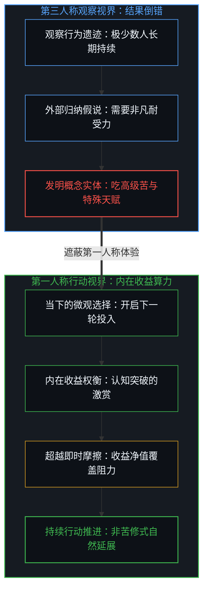
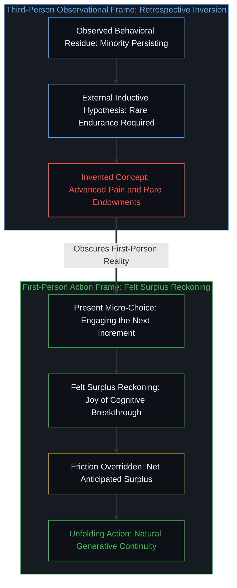
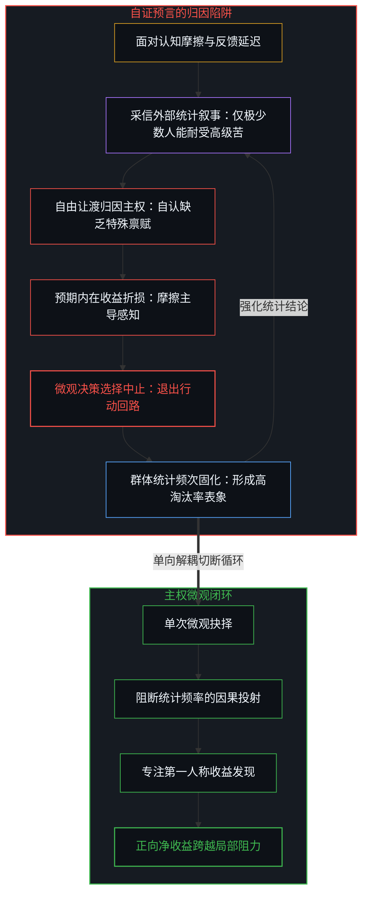
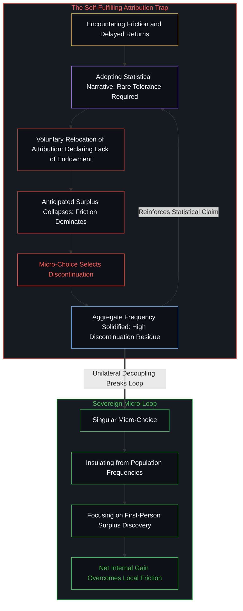

# 观察的因果僭越与第一人称的收益差 / The Causal Overstep of Observation and the First-Person Surplus

*群体统计记录已完成选择的残余，行动开启只取决于第一人称对内在收益与摩擦的权衡 / Population statistics record completed residue; action ignites solely in the first-person surplus over friction*

主动拓宽认知边界、接纳外界批评以校准盲区、在回报延迟的周期里保持行动投入，这些常被视作拉开人与人长程差距的行为，向任何具备注意力、记忆与抉择能力的个体开放。开启这些探索既不需要特殊的社会准入许可证，也不依附于罕见的天赋禀赋。真正拉开群体分布差距的，仅仅在于个体是否将这一可行性视作适用于自身的主权选项。然而，大量实证观察研究从外部俯瞰人群，记录下绝大多数人在遭遇摩擦后迅速折返的统计图景，并顺理成章地将这一描述性频次伪造成微观准入的因果壁垒，最典型的产物便是将长久坚持神圣化为必须耐受所谓高级苦的苦修叙事。

Activities commonly credited with generating long-term divergence—deliberate expansion of cognitive range, active assimilation of corrective feedback, and sustained exertion under delayed returns—remain open to anyone possessing ordinary attention, memory, and voluntary choice. Initiating these practices requires neither institutional accreditation nor rare genetic endowment. Divergence among individuals stems simply from whether an actor treats this operational openness as an available option for himself. Yet vast observational studies survey populations from a third-person balcony, record the rapid discontinuation of the majority upon encountering friction, and mistake this descriptive frequency for a causal gatekeeper, crystallizing in the popular cultural myth that sustained growth requires an elite endowment for enduring advanced pain.

## 一、 统计频率与单次抉择的因果绝缘 / 1. The Causal Insulation Between Frequencies and Singular Choice

当对大量样本的微观选择进行长程追踪时，研究者确实会得到一个极其稳定的宏观分布：绝大多数受试者在极短的尝试后便选择中止，仅有极少数人能够跨越周期持续前行。然而，这一统计分布的几何形态，仅仅是对过往已经尘埃落定的历史决策的归纳摘要。宏观分布对于当下正准备做出选择的个体而言，其因果关系恰如大量独立抛掷硬币所形成的中心极限定理正态分布之于下一次抛掷。在充分多次的抛掷实验中，硬币正反两面的累计频次必然收敛于对称的钟形曲线；但这道钟形曲线既不能增加、也无法削弱下一次投掷呈现正面的客观概率。

Tracking large cohorts over extended intervals yields a remarkably stable aggregate distribution: the vast majority discontinue effort within a brief window, leaving a slender minority who persist across compounding cycles. The geometric shape of this distribution represents nothing more than a descriptive ledger of completed past actions. It stands in the exact causal relation to the next singular choice as the normal distribution of independent Bernoulli trials stands to an upcoming coin flip. By the central limit theorem, the proportion of heads across millions of fair tosses converges on a Gaussian curve centered at one half; yet that macroscopic curve exerts zero forward or backward force on the mechanical odds of the next flip.

同样，在人类行为领域，宏观观察所记录到的大多数人早早放弃的集中趋势，并不构成阻碍具体个人行动的物理藩篱。人群在统计层面的聚集频率，无法为当事人内心将预期收益与即时摩擦进行对比的算力模型提供任何直接的因果变量。群体退出的高频发生，是千千万万个独立个体在各自视界内权衡失败的残余沉淀，而非横亘在未竟行动前方的时间锁链。如果把描述群体状态的宏观参数逆向推导为微观个体的行动因果，就如同认定既然大部分硬币落在了均值区间，单枚硬币便失去了在下一次投掷中自由翻转的自由度。这种统计结论在非生命物理系统中是严谨的现象学记录，一旦越界干预具有主观选择能力的活态心智，便会催生出巨大的认知盲区。关于宏观统计签名如何遮蔽微观主权的机理，在探讨[主权抉择的双面性与观察的客体化](../the-two-sided-nature-of-sovereign-choice-and-the-objectification-of-observation/)时已有详尽的几何刻画。

In human agency, the observed concentration of early dropouts establishes no physical barrier against an individual initiating action. The aggregate frequency of a population supplies zero causal input to an actor's local computation weighing anticipated return against immediate friction. Widespread abandonment is simply the statistical residue of millions of sovereign minds resolving their immediate balances against continuation, rather than an external obstacle spanning the future of an ongoing task. Reversing macroscopic parameters into constraints on micro-decisions mirrors the error of asserting that because coin series form a Gaussian hump, an individual toss forfeits its freedom to land heads. Observational statistics provide rigorous accounting in inanimate systems, but breed immense confusion when deployed to govern subjective consciousness. The geometric mechanics of macroscopic statistical signatures obscuring microscopic sovereignty are formalized in [The Two-Sided Nature of Sovereign Choice and the Objectification of Observation](../the-two-sided-nature-of-sovereign-choice-and-the-objectification-of-observation/).

## 二、 “吃高级苦”的归因倒错与第三人称盲区 / 2. The Attribution Inversion of "Advanced Pain" and the Third-Person Blind Spot

流行文化与通俗成功学热衷于引用所谓长期追踪研究，声称人与人的分水岭在于能否忍受包括认知突围的苦、自律反省的苦与长期孤独的苦在内的高级痛苦。这种论调之所以极具欺骗性，是因为它将少数持续前行者所展现出的外部行为形态，倒错地重述为一种针对苦难的高阶承受天赋。第三人称观察者永远只能停留在行动者的身心外部，他们看到一个人长期伏案推演模型、主动请求严厉批评、拒绝低级即时满足，便凭借自身的体验投射，认定这些行为必然伴随着巨大的主观折磨。观察者推论道，既然绝大多数人无法承受这种折磨而选择退出，那么能够留下的人必然具备非同寻常的吃苦耐受力。

Popular discourse eagerly borrows from longitudinal studies to assert that human divergence hinges on enduring higher-order hardship: the sting of intellectual disorientation, the friction of rigorous self-correction, and the desolation of deferred validation. This formulation achieves pervasive resonance because it misattributes the outer demeanor of persistent actors to a specialized talent for suffering. A third-person observer remains permanently exterior to the subject; observing someone wrestling with dense models, soliciting scathing critique, and declining easy distractions, the observer projects his own dread onto the scene, presuming the process must inflict severe emotional agony. The observer deduces that because most people flee such friction, those who persist must possess an elite tolerance for pain.

这种推论陷入了由观察视界决定的因果倒置。在第一人称的具身体感中，真正的长期持续从未建立在单纯忍耐痛苦的苦修地基之上。生命系统的热力学与神经机制决定了，任何被主观感知为单一受难的行动模式都具有极高的损耗性，不可避免地走向能量枯竭与系统崩溃。那些在探索中持续推进的个体，并非在咬牙咀嚼苦涩，而是因为他们在微观行动中捕捉到了未被外界察觉的巨大内在收益。对于他们而言，认知边界被冲破时的豁然开朗、消除逻辑漏洞时的自洽快感、以及对深层秩序的发现，提供了远超表面摩擦的即时愉悦净值。外部观察者眼中的枯燥苦行，在当事人的第一人称视界里，实质是收益远大于成本的丰盈过程。这种由于能力演进而导致体感与外部评判发生错位的现象，恰如[阻力体感与速率差](../felt-resistance-and-the-speed-differential/)所揭示的那样，体感阻力不过是速率差在认知界面的投影，而非阻挡前行的客观实体。

This deduction collapses into an inversion born of observational detachment. Within first-person felt experience, enduring persistence is never sustained on stoic self-mortification. Biological thermodynamics and neurological architecture dictate that any action experienced as uncompensated suffering exhausts metabolic energy and triggers systemic refusal. Those who continue along demanding paths are not gritting their teeth against pure bitterness; they act because they register an immense internal surplus invisible to the bystander. The breakthrough of insight, the cognitive alignment of resolving an error, and the grasp of hidden symmetry deliver immediate rewards that dwarf surface friction. What looks like grueling austerity to an outsider is an internally lucrative discovery to the actor. This divergence between felt reality and external appraisal mirrors the dynamic analyzed in [Felt Resistance and the Speed Differential](../felt-resistance-and-the-speed-differential/): perceived resistance is a sensory reflection of capability differentials rather than an adversarial force.

## 三、 归因让渡与自证预言的闭环 / 3. Surrendered Attribution and the Self-Fulfilling Loop

统计模式之所以展现出某种宛如铁律的支配力量，其根源在于行动者进行了一项额外的自由选择：主动将自身的微观决断归因于外部统计规律。当一个人在认知拓展中遭遇挫败感时，他能够自主选择如何解释这一停滞。如果他指向外部的统计分布，援引绝大多数人都会放弃的社会事实，或者宣称坚持需要某种自己先天不具备的受苦天赋，这一解释本身便是一次主权意愿的行使。然而，一旦完成了这种归因，微观决策的权衡方程便被深刻改写：行动被预先设定为注定失败，预期的内在收益被迅速归零，原本正常的过渡性摩擦被无限放大为无法逾越的天堑，放弃随之成为顺理成章的选择。

The impression that statistical patterns wield coercive power springs from a voluntary choice: an agent's decision to attribute his own hesitation to external population metrics. When an individual confronts friction, he chooses how to frame his struggle. If he invokes demographic patterns, asserting that most people quit or claiming persistence demands a genetic constitution he lacks, that explanation is itself an act of agency. Yet once adopted, this attribution revises the comparison: the activity is branded futile, anticipated surplus evaporates, transient friction swells into an insuperable wall, and discontinuation follows.

这种归因让渡在人群中引发了自我强化的共振闭环。正因为归因行为是可选的，绝大多数人在接触到将分化归咎于特殊天赋或高级痛苦的研究结论时，倾向于全盘接受这套免责解释。既然科学权威与长程数据已经断言只有百分之一的特殊个体能够撑过这些苦难，那么普通人选择停下脚步就不仅无可厚非，反而是理性的常态。这种群体心理机制促成了更大规模的退出，从而在统计层面进一步夯实了持续者极为罕见的数据分布。关于借助概念外壳进行心理免责以回避微观选择的动力学，在分析[自尊的刚性外壳与隐性外部归因](../zi-zun-de-gang-xing-wai-ke-yu-yin-xing-wai-bu-gui-yin/)时已被精准解构。所谓的研究结论通过提供一个极具说服力的外部借口，参与塑造了它自称只是中立记录的现实，形成了经典而荒谬的自证预言。

This surrendered attribution ignites a self-reinforcing societal loop. Because explanations are optional, the majority who encounter research framing divergence as an endowment of suffering eagerly embrace the alibi. If empirical studies proclaim that only one percent possess the endurance for advanced pain, dropping out ceases to be an unmade choice and becomes standard biology. This collective attribution drives further discontinuation, entrenching the heavy-tailed statistical profile of the dropout curve. The dynamics of shielding self-regard through externalized labels are analyzed in [Rigid Shell of Self-Esteem and Latent External Attribution](../zi-zun-de-gang-xing-wai-ke-yu-yin-xing-wai-bu-gui-yin/). The scientific claim, by offering a prestigious external excuse, manufactures the very behavioral skew it purports to merely observe.

## 四、 主权抉择的局部性与统计神话的消解 / 4. The Locality of Sovereign Choice and the Dissolution of Statistical Myths

整个行动因果链条在每一个微观切面上都是局部的。一项提升认知、直面反馈或积累复利的行为是否可行，全凭处在决策现场的个体是否将其视作为自身敞开的通道。旁人的信念与群体的退出率，仅仅作用于那些做出退缩决定的人自身的权衡体系。他人哪怕成千上万次宣告这条道路充斥苦难、需要超自然毅力，也不会改变你所面对的下一个微观决策的物理与逻辑结构。统计数据刻画的是已经发生的事实总和，它对当下这个未经坍缩的微观主权变量不具备任何强制裁决权。将选择主权从统计神话中收回的深层规律，在[让渡主权的幂律法则](../the-power-law-of-surrendered-agency/)中展现为个体微观解耦对宏观垄断的单向超越。

The causal chain of action remains local at every increment. Whether an activity that expands understanding, integrates friction, or compounds competence is available depends entirely on whether the agent treats it as open to himself. The beliefs of others and the statistical mortality of their efforts govern only the comparisons those others execute. Even if millions proclaim that deep growth requires superhuman asceticism, their consensus alters neither the cognitive physics nor the logical parameters facing your next decision. Statistical aggregations describe unalterable outcomes of the past; they hold zero jurisdiction over an uncollapsed present choice. Reclaiming agency from statistical mythology echoes the structural decoupling demonstrated in [The Power-Law of Surrendered Agency](../the-power-law-of-surrendered-agency/), where unilateral individual refusal transcends aggregate attractors.

摆脱观察性研究的虚假因果，并不是要否认探索过程中必然存在的摩擦与迷茫，而是要破除将这些摩擦实体化为所谓高级苦的道德迷信。认知突破不需要英雄主义式的苦肉计，它所需要的是诚实地回归第一人称视角，去体会每一次理解加深时所释放的真实愉悦。当一个人不再向第三人称的群体分布索要行动许可，不再用缺乏耐受天赋来为怯懦推脱，他便能从虚妄的苦难崇拜中抽身，让心智重新落脚于真实的内在收益。统计图表上的钟形曲线会继续静止在历史的故纸堆里，而真正的生命历程，永远只在每一个拒绝交出解释权的当下展开。[闭合的N与开放的现实](../the-closed-n-and-the-open-reality/)从另一面触及同一条轴线：最优之选与极劣之防皆困于已知样本，唯有不可预设的本体论余量方为生生之源。

Shattering the pseudo-causality of observational studies does not deny the friction inherent in mastering challenging terrain; it dismantles the moralizing dogma that reifies this friction into advanced pain. Intellectual divergence requires no theatrical martyrdom; it demands only an honest return to first-person sensitivity, registering the lucid delight of expanding clarity. When an actor ceases to seek validation from population averages, and halts invoking a lack of rare endurance to rationalize pause, he steps outside the cult of suffering and anchors effort in genuine surplus. The Gaussian bells of observational statistics remain etched across retrospective ledgers, while living agency unfolds in the immediate present, answerable to no external distribution. [The Closed N and the Open Reality](../the-closed-n-and-the-open-reality/) meets the same axis from another face: Best-of-N and Worst-of-N remain trapped in closed sets; only the unconditioned remainder breathes living reality.
