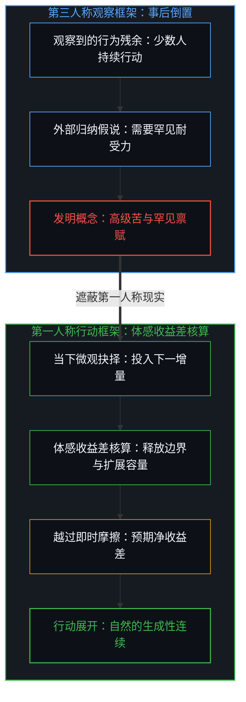
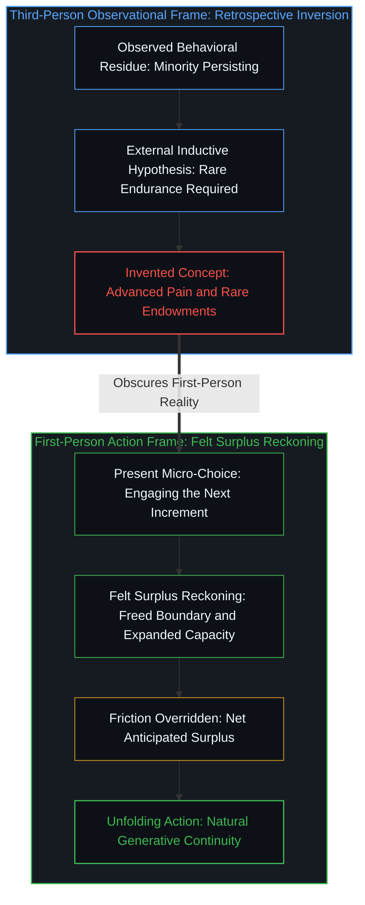
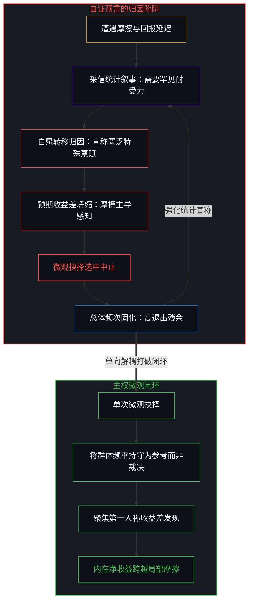
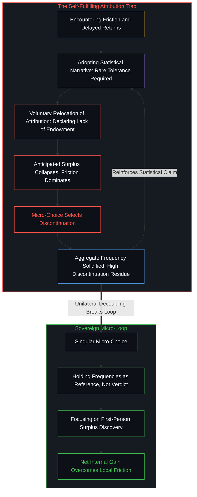

# 观察的因果僭越与第一人称的收益差 / The Causal Overstep of Observation and the First-Person Surplus

*群体统计记录既成选择的残余，行动开启只取决于第一人称越过摩擦的收益差 / Population statistics record completed residue; action ignites solely in the first-person surplus over friction*

主动拓宽认知范围、积极吸纳修正性反馈、在回报延迟的周期里保持持续投入，这些常被视作拉开长期差距的活动，向任何具备寻常注意力、记忆与自主抉择能力的个体开放。开启这些实践既不需要体制认证，也不依附于罕见的遗传禀赋。就开启与持续而言，将持续前行者与停步者区分开来的并非先天禀赋，而是每个行动者如何接手这份人人可行的开放，并在每一步中权衡预期回报与即时摩擦。然而，大量观察性研究从第三人称看台俯瞰人群，记录下多数人在遭遇摩擦后迅速中止的图景，并将这一描述性频次误作因果守门人，凝结为一种流行文化神话：持续成长需要耐受“高级苦”的精英禀赋。

Activities commonly credited with generating long-term divergence—deliberate expansion of cognitive range, active assimilation of corrective feedback, and sustained exertion under delayed returns—remain open to anyone possessing ordinary attention, memory, and voluntary choice. Initiating these practices requires neither institutional accreditation nor rare genetic endowment. On this axis of initiation and continuation, what separates those who keep going from those who stop is not an innate endowment, but how each actor takes up that operational openness and weighs anticipated return against immediate friction at each step. Yet vast observational studies survey populations from a third-person balcony, record the rapid discontinuation of the majority upon encountering friction, and mistake this descriptive frequency for a causal gatekeeper, crystallizing in the popular cultural myth that sustained growth requires an elite endowment for enduring advanced pain.

## 一、 统计频率与单次抉择的因果绝缘 / 1. The Causal Insulation Between Frequencies and Singular Choice

对大规模群体进行长周期追踪，会得出一个高度稳定的总体分布：绝大多数人在短暂窗口内便中止投入，仅余极少数人跨越复利周期持续前行。这一分布的几何形态，不过是对既成过往行动的描述性账本。它与下一次单次抉择之间的因果关系，恰如独立伯努利试验的正态分布之于即将抛出的下一枚硬币。根据中心极限定理，数百万次公平抛掷中正面朝上的比例收敛于以二分之一为中心的高斯曲线；但这条宏观曲线对下一次抛掷的机械概率不施加任何前向或后向的作用力。

Tracking large cohorts over extended intervals yields a remarkably stable aggregate distribution: the vast majority discontinue effort within a brief window, leaving a slender minority who persist across compounding cycles. The geometric shape of this distribution represents nothing more than a descriptive ledger of completed past actions. It stands in the exact causal relation to the next singular choice as the normal distribution of independent Bernoulli trials stands to an upcoming coin flip. By the central limit theorem, the proportion of heads across millions of fair tosses converges on a Gaussian curve centered at one half; yet that macroscopic curve exerts zero forward or backward force on the mechanical odds of the next flip.

在人类能动性中，自我区分的活动无因而不息地发生；观察到的早期退出集中趋势，并不构成阻碍个体开启行动的物理壁垒。即便是一次机械抛币，也与过往试验的累积曲线保持因果绝缘，而活态心智甚至不是固定概率下的平稳抽样：在当下的每一步（+1），群体的总体频率唯有作为行动者所采纳的内容——作为裁决或作为参考——才会进入其局部核算；它从不替行动者权衡预期回报与即时摩擦。大面积的半途而废，不过是成百上千万个主权心智在各自当下权衡中做出中止决断后留下的统计残余——即[平均值是残余，不是引擎](../the-average-is-residue-not-the-engine/)所追踪的下游汇总——而非横亘在未竟行动前方的外部障碍。正如[幂律是正态分布的长期后果](../power-law-is-the-long-term-consequence-of-normal-distribution/)所展示的，当中心将残余摩擦视作更新判断的信号而非停步的借口时，微小的增量便会跨越周期复利累积，涌现为重尾分布中持续行动的少数派。将这些宏观参数逆向推导为对微观决策的约束，就如同断言既然硬币序列形成了高斯峰，单次投掷便丧失了正面朝上的均等概率。观察统计提供的是对既成轨迹的描述性核算，它与当下抉择之间的双面边界，[主权抉择的双面性与观察的客体化](../the-two-sided-nature-of-sovereign-choice-and-the-objectification-of-observation/)已作了形式化的界定。

In human agency, where self-distinguishing activity occurs uncaused and unceasing, the observed concentration of early dropouts establishes no physical barrier against an individual initiating action. Even a mechanical coin toss is causally insulated from the cumulative curve of prior trials, and a living Mind is not even a stationary draw with fixed odds: at each present step (+1), the aggregate frequency of a population enters an actor's local reckoning only as something the actor takes up, as verdict or as reference; it never performs the weighing of anticipated return against immediate friction. Widespread abandonment is simply the statistical residue of millions of sovereign minds resolving their immediate balances against continuation—the downstream aggregate traced in [The Average Is Residue, Not the Engine](../the-average-is-residue-not-the-engine/)—rather than an external obstacle spanning the future of an ongoing task. As [Power Law Is the Long-Term Consequence of Normal Distribution](../power-law-is-the-long-term-consequence-of-normal-distribution/) demonstrates, when centers treat residual friction as signal to update judgment rather than an excuse to stop, modest increments compound across cycles into the heavy-tailed minority of persistent actors. Reversing those macroscopic parameters into constraints on micro-decisions mirrors the error of asserting that because coin series form a Gaussian hump, an individual toss forfeits its even odds of landing heads. Observational statistics provide descriptive accounting of completed trajectories, and their two-sided boundary with present choice is formalized in [The Two-Sided Nature of Sovereign Choice and the Objectification of Observation](../the-two-sided-nature-of-sovereign-choice-and-the-objectification-of-observation/).

## 二、 “吃高级苦”的归因倒错与第三人称盲区 / 2. The Attribution Inversion of "Advanced Pain" and the Third-Person Blind Spot

流行论述借用纵向追踪研究，断言人与人的分化取决于能否忍受更高阶的困苦：认知迷失的刺痛、严苛自我修正的摩擦，以及漫长回馈延迟中的荒凉。这种表述之所以引发广泛共鸣，是因为它将持续行动者的外在痕迹误归因于一种专门承受苦难的天赋。第三人称观察者始终处于主体的外部；看到有人反复推演繁密模型、主动征求批评、谢绝轻松的消遣，观察者便只在账本上记下可见的代价一侧，并推论这一过程必定被体验为无补偿的煎熬。观察者由此推论：既然多数人都会避开此类摩擦，那么留下来持续前行的人必定具备精英级的痛苦耐受力。

Popular discourse borrows from longitudinal studies to assert that human divergence hinges on enduring higher-order hardship: the sting of intellectual disorientation, the friction of rigorous self-correction, and the desolation of deferred validation. This formulation achieves pervasive resonance because it misattributes the outer trace of persistent actors to a specialized talent for suffering. A third-person observer remains permanently exterior to the subject; observing someone wrestling with dense models, soliciting critique, and declining easy distractions, the observer books only the visible cost side of the ledger and infers that the process must register as uncompensated agony. The observer deduces that because most people leave such friction behind, those who persist must possess an elite tolerance for pain.

这一推论陷入了由观察抽离所造成的因果倒置。在具身行动中，任何被登记为无补偿苦役的投入——即耗费能量去防卫冻结的自我形象、使其免受修正性反馈的触动——都会耗尽代谢容量并触发系统性拒斥。这一有界机制无需声称能够窥见他人的内在体验，便足以消解观察者的推论：一项行动若要跨越复利周期持续推进，其各个步骤对于迈出步伐的当事者而言，必须登记为超过其代价的收益差——无论是即时的还是预期的。当在活边缘重绘内部模型消解了一处矛盾时，它便释放了边界并扩展了容量；更宽广的清晰度与已化解的谬误，就在迈步当下登记为超越表层摩擦的净收益。外部观察者仅在成本栏中记作煎熬苦行的过程，在行动发生的位置上登记为正向的收益差。这种第一人称感知记录与外部评估之间的分歧，恰如[阻力体感与速率差](../felt-resistance-and-the-speed-differential/)所剖析的动力学：被感知到的阻力只是能力速率差在感官上的映射，而非迎面阻击的敌对力量。

```mermaid
graph TD
    subgraph S_ThirdPerson ["第三人称观察框架：事后倒置"]
        direction TB
        style S_ThirdPerson fill:#161b22,stroke:#58a6ff,stroke-width:1.5px,color:#58a6ff
        A1["观察到的行为残余：少数人持续行动"] --> A2["外部归纳假说：需要罕见耐受力"]
        A2 --> A3["发明概念：高级苦与罕见禀赋"]
        style A1 fill:#0d1117,stroke:#58a6ff,stroke-width:1px,color:#f0f6fc
        style A2 fill:#0d1117,stroke:#58a6ff,stroke-width:1px,color:#f0f6fc
        style A3 fill:#0d1117,stroke:#f85149,stroke-width:1.5px,color:#f85149
    end
    A3 ==>|"遮蔽第一人称现实"| B1
    subgraph S_FirstPerson ["第一人称行动框架：体感收益差核算"]
        direction TB
        style S_FirstPerson fill:#161b22,stroke:#3fb950,stroke-width:1.5px,color:#3fb950
        B1["当下微观抉择：投入下一增量"] --> B2["体感收益差核算：释放边界与扩展容量"]
        B2 --> B3["越过即时摩擦：预期净收益差"]
        B3 --> B4["行动展开：自然的生成性连续"]
        style B1 fill:#0d1117,stroke:#3fb950,stroke-width:1px,color:#f0f6fc
        style B2 fill:#0d1117,stroke:#3fb950,stroke-width:1px,color:#f0f6fc
        style B3 fill:#0d1117,stroke:#d29922,stroke-width:1px,color:#f0f6fc
        style B4 fill:#0d1117,stroke:#3fb950,stroke-width:1.5px,color:#3fb950
    end
```

This deduction collapses into an inversion born of observational detachment. In embodied action, any exertion that registers as uncompensated suffering—where energy is spent defending a frozen self-image against corrective feedback—exhausts metabolic capacity and triggers systemic refusal. That bounded mechanism suffices to dissolve the observer's inference without claiming access to another's interior: for an action to continue across compounding cycles, its steps must register, to the one taking them, a surplus—immediate or anticipated—that outweighs their cost. Where re-rendering the internal model at the living edge dissolves a contradiction, it frees boundary and expands capacity; wider clarity and resolved error register right at the step as a net gain over surface friction. What the exterior observer records only on the cost column as grueling austerity registers at the acting locus as a positive surplus. This divergence between first-person registration and external appraisal mirrors the dynamic analyzed in [Felt Resistance and the Speed Differential](../felt-resistance-and-the-speed-differential/): perceived resistance is a sensory reflection of capability differentials rather than an adversarial force.

```mermaid
graph TD
    subgraph S_ThirdPerson ["Third-Person Observational Frame: Retrospective Inversion"]
        direction TB
        style S_ThirdPerson fill:#161b22,stroke:#58a6ff,stroke-width:1.5px,color:#58a6ff
        A1["Observed Behavioral Residue: Minority Persisting"] --> A2["External Inductive Hypothesis: Rare Endurance Required"]
        A2 --> A3["Invented Concept: Advanced Pain and Rare Endowments"]
        style A1 fill:#0d1117,stroke:#58a6ff,stroke-width:1px,color:#f0f6fc
        style A2 fill:#0d1117,stroke:#58a6ff,stroke-width:1px,color:#f0f6fc
        style A3 fill:#0d1117,stroke:#f85149,stroke-width:1.5px,color:#f85149
    end
    A3 ==>|"Obscures First-Person Reality"| B1
    subgraph S_FirstPerson ["First-Person Action Frame: Felt Surplus Reckoning"]
        direction TB
        style S_FirstPerson fill:#161b22,stroke:#3fb950,stroke-width:1.5px,color:#3fb950
        B1["Present Micro-Choice: Engaging the Next Increment"] --> B2["Felt Surplus Reckoning: Freed Boundary and Expanded Capacity"]
        B2 --> B3["Friction Overridden: Net Anticipated Surplus"]
        B3 --> B4["Unfolding Action: Natural Generative Continuity"]
        style B1 fill:#0d1117,stroke:#3fb950,stroke-width:1px,color:#f0f6fc
        style B2 fill:#0d1117,stroke:#3fb950,stroke-width:1px,color:#f0f6fc
        style B3 fill:#0d1117,stroke:#d29922,stroke-width:1px,color:#f0f6fc
        style B4 fill:#0d1117,stroke:#3fb950,stroke-width:1.5px,color:#3fb950
    end
```

## 三、 归因让渡与自证预言的闭环 / 3. Surrendered Attribution and the Self-Fulfilling Loop

统计模式之所以显得具有某种强制支配力，源于行动者的一项自愿抉择：决定将自身的犹豫归因于外部群体指标。当个体直面摩擦时，他自主选择如何框定眼前的受阻。如果他援引人口统计分布，声称大多数人都会半途而废，或宣称坚持需要某种自己先天匮乏的遗传体质，这一解释本身就是一次能动性的行使，也正是[能动性与模式](../agency-and-the-pattern/)所追溯的那种向外分配：把汇总比例当作裁决，等于把决断写成早已在别处定下；把同一数字持守为参考分布，决断便依然清晰地呈现为自己的选择。然而，一旦采纳了这种归因，权衡比对便被改写：行动被贴上徒劳的标签，预期收益差瞬间蒸发，原本暂时的过渡性摩擦膨胀为不可逾越的高墙，中止行动随之发生。

The impression that statistical patterns wield coercive power springs from a voluntary choice: an agent's decision to attribute his own hesitation to external population metrics. When an individual confronts friction, he chooses how to frame his struggle. If he invokes demographic patterns, asserting that most people quit or claiming persistence demands a genetic constitution he lacks, that explanation is itself an act of agency, the same outward allocation traced in [Agency and the Pattern](../agency-and-the-pattern/): taking a pooled proportion as a verdict writes the decision as settled elsewhere, while the same figure held as a reference distribution leaves the decision visibly one's own. Yet once adopted, this attribution revises the comparison: the activity is branded futile, anticipated surplus evaporates, transient friction swells into an insuperable wall, and discontinuation follows.

这种归因让渡点燃了自我强化的社会闭环。正因为解释方式是可选的，一些研究把个体分化框定为一种受苦禀赋，接触到这类研究的行动者，可以将这一框定采纳为外部裁决，从而做出[统计学无法揭示的心智](../the-mind-that-statistics-cannot-reveal/)所追踪的自我撇清式归因。当实证研究宣称仅有百分之一的人具备承受高级苦的耐力时，将这一数字当作裁决，便使中途退出不再被登记为自己的抉择，而是呈现为标准的生物学常态。这种集体归因推动了更大规模的中止，在进一步固化退出曲线重尾分布形态的同时，也按[规程的倒置与因果回路的消声](../the-inversion-of-the-protocol-and-the-silencing-of-the-causal-loop/)所揭示的方式，将个体当下的即时反馈回路消声。借由外化标签来庇护自我评价的动力学，[自尊的刚性外壳与隐性外部归因](../zi-zun-de-gang-xing-wai-ke-yu-yin-xing-wai-bu-gui-yin/)已有剖析。发表出来的论述框架提供了一项现成的外部参考，一旦被行动者采纳为停步的裁决，便会经由每一次个体的采纳反向回馈，加深这些研究本身所记录的行为偏态。

```mermaid
graph TD
    subgraph S_Trap ["自证预言的归因陷阱"]
        direction TB
        style S_Trap fill:#161b22,stroke:#f85149,stroke-width:1.5px,color:#f85149
        T1["遭遇摩擦与回报延迟"] --> T2["采信统计叙事：需要罕见耐受力"]
        T2 --> T3["自愿转移归因：宣称匮乏特殊禀赋"]
        T3 --> T4["预期收益差坍缩：摩擦主导感知"]
        T4 --> T5["微观抉择选中中止"]
        T5 --> T6["总体频次固化：高退出残余"]
        T6 -->|"强化统计宣称"| T2
        style T1 fill:#0d1117,stroke:#d29922,stroke-width:1px,color:#f0f6fc
        style T2 fill:#0d1117,stroke:#a371f7,stroke-width:1px,color:#f0f6fc
        style T3 fill:#0d1117,stroke:#f85149,stroke-width:1px,color:#f0f6fc
        style T4 fill:#0d1117,stroke:#f85149,stroke-width:1px,color:#f0f6fc
        style T5 fill:#0d1117,stroke:#f85149,stroke-width:1.5px,color:#f85149
        style T6 fill:#0d1117,stroke:#58a6ff,stroke-width:1px,color:#f0f6fc
    end
    T6 ==>|"单向解耦打破闭环"| C1
    subgraph S_Sovereign ["主权微观闭环"]
        direction TB
        style S_Sovereign fill:#161b22,stroke:#3fb950,stroke-width:1.5px,color:#3fb950
        C1["单次微观抉择"] --> C2["将群体频率持守为参考而非裁决"]
        C2 --> C3["聚焦第一人称收益差发现"]
        C3 --> C4["内在净收益跨越局部摩擦"]
        style C1 fill:#0d1117,stroke:#3fb950,stroke-width:1px,color:#f0f6fc
        style C2 fill:#0d1117,stroke:#3fb950,stroke-width:1px,color:#f0f6fc
        style C3 fill:#0d1117,stroke:#3fb950,stroke-width:1px,color:#f0f6fc
        style C4 fill:#0d1117,stroke:#3fb950,stroke-width:1.5px,color:#3fb950
    end
```

This surrendered attribution ignites a self-reinforcing societal loop. Because explanations are optional, actors who encounter research framing divergence as an endowment of suffering can take up that framing as an external verdict, enacting the self-disowning attribution traced in [The Mind That Statistics Cannot Reveal](../the-mind-that-statistics-cannot-reveal/). When empirical studies proclaim that only one percent possess the endurance for advanced pain, taking that figure as a verdict makes dropping out stop registering as one's own choice and present instead as standard biology. This collective attribution drives further discontinuation, entrenching the heavy-tailed statistical profile of the dropout curve while silencing the individual's immediate feedback loop in the manner of [The Inversion of the Protocol and the Silencing of the Causal Loop](../the-inversion-of-the-protocol-and-the-silencing-of-the-causal-loop/). The dynamics of shielding self-regard through externalized labels are analyzed in [The Rigid Shell of Self-Esteem and Hidden External Attribution](../zi-zun-de-gang-xing-wai-ke-yu-yin-xing-wai-bu-gui-yin/). By supplying a ready external reference that actors take up as a verdict to stop, the published framing feeds back through each individual take-up to deepen the very behavioral skew the studies record.

```mermaid
graph TD
    subgraph S_Trap ["The Self-Fulfilling Attribution Trap"]
        direction TB
        style S_Trap fill:#161b22,stroke:#f85149,stroke-width:1.5px,color:#f85149
        T1["Encountering Friction and Delayed Returns"] --> T2["Adopting Statistical Narrative: Rare Tolerance Required"]
        T2 --> T3["Voluntary Relocation of Attribution: Declaring Lack of Endowment"]
        T3 --> T4["Anticipated Surplus Collapses: Friction Dominates"]
        T4 --> T5["Micro-Choice Selects Discontinuation"]
        T5 --> T6["Aggregate Frequency Solidified: High Discontinuation Residue"]
        T6 -->|"Reinforces Statistical Claim"| T2
        style T1 fill:#0d1117,stroke:#d29922,stroke-width:1px,color:#f0f6fc
        style T2 fill:#0d1117,stroke:#a371f7,stroke-width:1px,color:#f0f6fc
        style T3 fill:#0d1117,stroke:#f85149,stroke-width:1px,color:#f0f6fc
        style T4 fill:#0d1117,stroke:#f85149,stroke-width:1px,color:#f0f6fc
        style T5 fill:#0d1117,stroke:#f85149,stroke-width:1.5px,color:#f85149
        style T6 fill:#0d1117,stroke:#58a6ff,stroke-width:1px,color:#f0f6fc
    end
    T6 ==>|"Unilateral Decoupling Breaks Loop"| C1
    subgraph S_Sovereign ["Sovereign Micro-Loop"]
        direction TB
        style S_Sovereign fill:#161b22,stroke:#3fb950,stroke-width:1.5px,color:#3fb950
        C1["Singular Micro-Choice"] --> C2["Holding Frequencies as Reference, Not Verdict"]
        C2 --> C3["Focusing on First-Person Surplus Discovery"]
        C3 --> C4["Net Internal Gain Overcomes Local Friction"]
        style C1 fill:#0d1117,stroke:#3fb950,stroke-width:1px,color:#f0f6fc
        style C2 fill:#0d1117,stroke:#3fb950,stroke-width:1px,color:#f0f6fc
        style C3 fill:#0d1117,stroke:#3fb950,stroke-width:1px,color:#f0f6fc
        style C4 fill:#0d1117,stroke:#3fb950,stroke-width:1.5px,color:#3fb950
    end
```

## 四、 主权抉择的局部性与统计神话的消解 / 4. The Locality of Sovereign Choice and the Dissolution of Statistical Myths

行动的因果链条在每一个增量上都保持局部性。一项拓宽理解、吸纳摩擦或复利积累能力的活动在下一步是否被当作可用选项，取决于行动者是否将其向自身敞开。他人的信念及其投入的统计折损率，仅支配那些人自己所执行的权衡比对。即便成百上千万人都宣告深度成长需要超人般的苦修，这一共识也既不会改变当下收益差与摩擦之间的轻重，也不会改变个体下一次决策时面前敞开的选项。统计汇总刻画的是过往不可更改的既成结果，它对当下尚未坍缩的抉择没有任何管辖权。从统计神话中收回能动性，呼应了[让渡主权的幂律法则](../the-power-law-of-surrendered-agency/)所阐明的结构性解耦：个体的单向拒绝足以跨越宏观吸引子。

The causal chain of action remains local at every increment. Whether an activity that expands understanding, integrates friction, or compounds competence is treated as an available option at the next step turns on whether the agent holds it open to himself. The beliefs of others and the statistical mortality of their efforts govern only the comparisons those others execute. Even if millions proclaim that deep growth requires superhuman asceticism, their consensus alters neither the immediate balance of surplus over friction nor the options open at the individual's next decision. Statistical aggregations describe unalterable outcomes of the past; they hold zero jurisdiction over an uncollapsed present choice. Reclaiming agency from statistical mythology echoes the structural decoupling demonstrated in [The Power-Law of Surrendered Agency](../the-power-law-of-surrendered-agency/), where unilateral individual refusal transcends aggregate attractors.

消解观察性研究的因果僭越，并非否认掌握高难度领域所固有的摩擦，而是移除将这种摩擦实体化为“高级苦”的事后投射。持续的认知分化并非建立在无补偿的自我折磨之上，而是依托于直接回归第一人称感知记录：在那里，不断拓展的清晰度与释放的容量超过了迈出这一步的代价。当行动者不再把群体均值当作裁决，也不再援引罕见耐受力的匮乏来将抉择当作既成定局时，他便走出了无补偿受苦的框架，将行动投入锚定在切身感知的收益差之上。观察统计的退出曲线与频率表依然镌刻在事后账本上——正如[闭合的N与开放的现实](../the-closed-n-and-the-open-reality/)中的闭合 N 与[你的代码库即是记忆](../your-codebase-is-memory/)中的外化记忆痕迹，只记录已完成的步伐而不操控下一步的走向——而活态能动性则在当下边缘那片敞开的余量中展开，无须向任何外部统计分布交账。

Dissolving the causal overstep of observational studies does not deny the friction inherent in mastering challenging terrain; it removes the retrospective projection that reifies this friction into advanced pain. Sustained cognitive divergence does not rest on uncompensated self-mortification; it rests on a direct return to first-person registration, where expanding clarity and freed capacity outweigh the cost of the step. When an actor ceases to treat population averages as a verdict and stops invoking a lack of rare endurance as settling the choice, he steps outside the frame of uncompensated suffering and anchors effort in felt surplus. The dropout curves and frequency tables of observational statistics remain etched across retrospective ledgers—the closed N of [The Closed N and the Open Reality](../the-closed-n-and-the-open-reality/) and the externalized memory traces of [Your Codebase Is Memory](../your-codebase-is-memory/) that record completed steps without steering the next—while living agency unfolds in the open remainder at the immediate edge, answerable to no external distribution.
