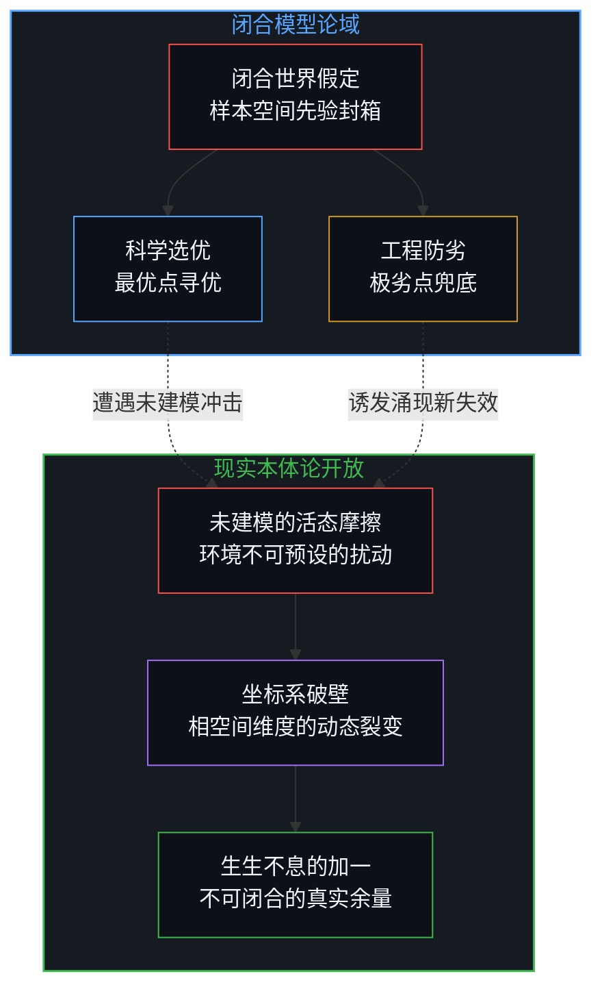
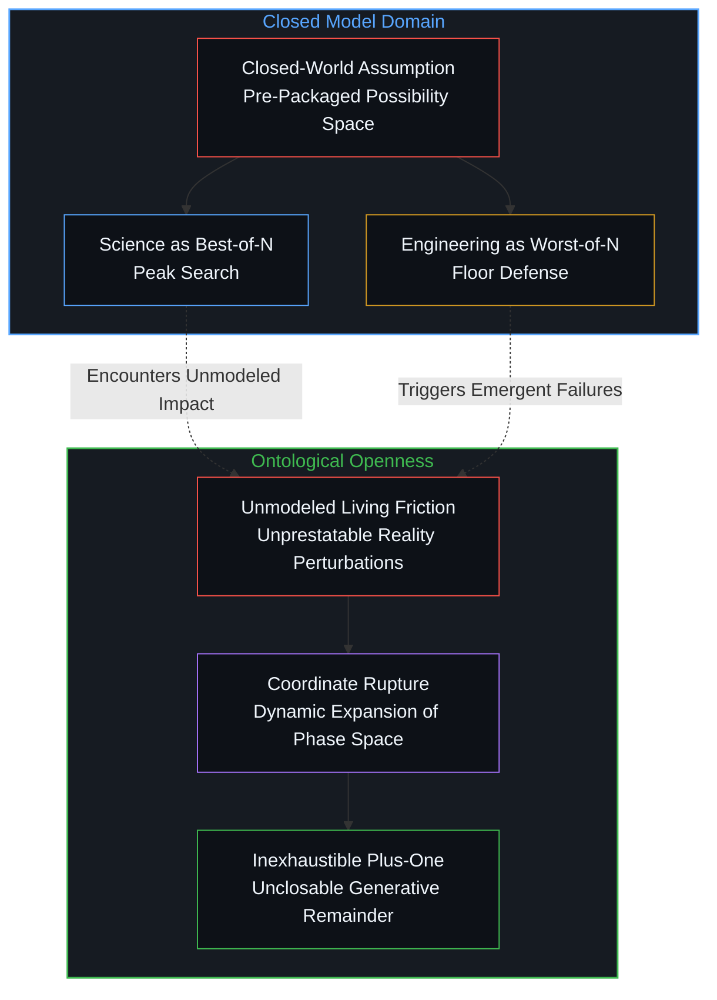
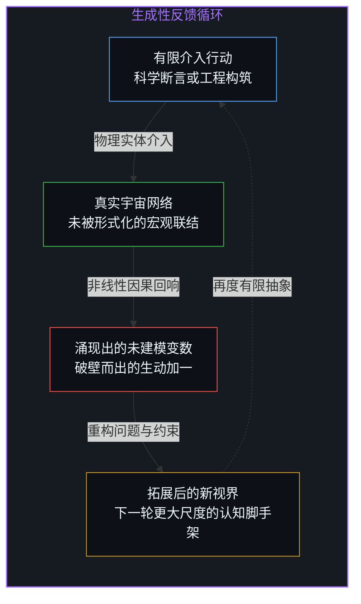
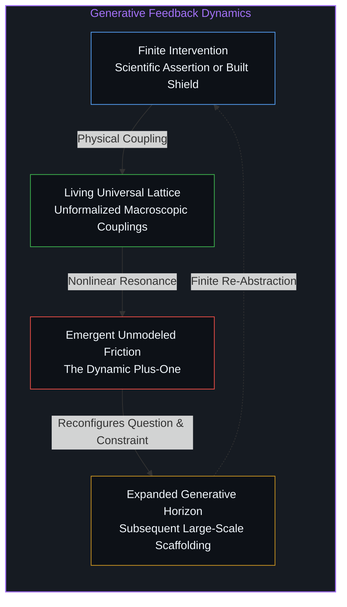

# 闭合的N与开放的现实 / The Closed N and the Open Reality

*最优之选与极劣之防皆困于已知样本，唯有不可预设的本体论余量方为生生之源 / Best-of-N and Worst-of-N remain trapped in closed sets; only the unconditioned remainder breathes living reality*

当数学家与系统工程师以简洁的修辞宣称“科学是选优，工程是防劣”时，一种极具诱惑力的形式对称性便在理性的透镜中成形。科学被描摹为在有限假说库中寻觅最高尖峰的漫游者，工程则被定义为在既定工况中严防最深深渊的守门人。这种工整的极值对仗看似穷尽了认知的两翼，实则悄然植入了一个致命的认知盲区：它假定一切可能遭遇的变异与挑战，早已整齐划一地封装在已知样本集合之中。然而真实世界并非由预先编号的元素排演而成的封闭舞台，现实以其永不枯竭的生成性，持续向一切既定认知回敬着未被命名的碰撞。

When mathematicians and systems engineers declare with crisp rhetoric that science operates as Best-of-N while engineering functions as Worst-of-N, a seductive formal symmetry takes shape in the rational lens. Science is depicted as a voyager seeking the highest peak across a library of hypotheses, while engineering is cast as a sentinel guarding against the deepest abyss within anticipated conditions. This neat polarity of extrema seems to span both wings of human inquiry, yet it subtly smuggens a fatal blind spot: it assumes that all encounters, variations, and hazards are already neatly packaged within a known sample set. Living reality, however, is no closed stage rehearsing pre-numbered elements; with inexhaustible generative vitality, it answers every formalized boundary with unmodeled friction.

## 一、 形式封闭的诱惑：最优之选与极劣之防 / 1. The Lure of Formal Closure: Best-of-N and Worst-of-N

将科学归结为在样本空间中挑选最优结果，深刻呼应了现代探索中对突破性成果的度量偏好。无论是基础理论的假设检验、药物分子的多靶点筛选，还是高维参数空间中的梯度突围，科学范式崇尚的是峰值发现；只要有一条路径凿穿了迷雾并经受住可重复性检验，其余数十次失败尝试的样本代价便可在事后被一笔勾销。与此相对，工程实践面对的是结构承重、飞行器再入或电力管网的严酷阻力，系统的耐久性取决于最脆弱的那枚螺栓。工程思维因此将注意力全部锚定于底线防护，通过安全冗余、边界应力测试与故障隔绝机制，竭力抹杀最恶劣单点崩溃对整体结构的毁灭性冲击。

Framing science as the selection of the best result resonates with the modern instinct to measure breakthroughs by their peaks. Whether testing physical hypotheses, screening candidate molecules, or climbing gradient landscapes, the scientific ethos celebrates high-water marks; if a single trajectory cuts through confusion and survives replication, the costs of countless discarded attempts are written off. In contrast, engineering confronts the uncompromising drag of structural loads, atmospheric reentry, or electrical grids, where systemic longevity depends on the weakest bolt. Engineering mindset thus fixes its gaze upon bottom-line resilience, employing safety factors, boundary stress tests, and containment barriers to avert the ruinous consequences of a single catastrophic failure.

这种对称性在工具理性的象牙塔内显得天衣无缝，却诱使心智将工作模型篡位为实在本身。选优与防劣之所以能够被形式化表达，依赖于一个未言明的基石假定：即探索与防御的论域可以被抽象为一个基数为有限集合的论域。在此种闭合视界中，认知者自居为掌控全景的账房先生，假定一切变数不过是在既定测度空间内掷出的骰子点数。这种将探索简化为有限抽样搜寻的幻象，与[「更好」的范畴谬误](../the-category-error-of-better/)如出一辙，把动态敞开的生命摩擦偷换成了静态参数板上的数值比拼。

This symmetry appears seamless within the ivory tower of instrumental reason, yet it lures the mind into mistaking its working models for ground truth. Both optimization and defense can only be formalized by leaning upon an unspoken cornerstone: the presumption that the universe of inquiry and protection can be abstracted into a bounded set of size N. Within this closed horizon, the observer postures as an omniscient bookkeeper, assuming all possible variance merely reflects outcomes rolled from predefined dice. This reduction of living exploration to finite sampling parallels [The Category Error of Better](../the-category-error-of-better/), swapping dynamic friction for static metrics on a frozen scoreboard.

## 二、 本体论的范畴僭越：将脚手架误认为宇宙 / 2. The Ontological Category Error: Mistaking Scaffolding for the Universe

当心智指认“现实永远是加一”时，所意指的绝非统计学意义上从既有箱子里摸出的第一零一个球。若将这个加一降格为单纯的增量样本，思考者依然被囚禁在旧有的代数牢笼中，误以为只要将参数面板扩大一格，便能重新将世界锁入闭环。加一所标示的不是数量上的延展，而是现实内在的本体论开放性。正如[索求万物理论是在将当下冻结为清单](../demanding-a-toe-freezes-time-into-a-catalog/)所揭示的那样，任何企图用有限公理与样本清单封装存在的努力，都在开端处抹杀了时间的流淌与因果的活态生成。

When the mind recognizes that reality is always plus-one, it refers to nothing like an incremental marble drawn from a familiar urn. Lowering this plus-one to a mere statistical nuisance leaves thought trapped in the same algebraic cage, pretending that incrementing an index by one restores total closure. The plus-one marks not a quantitative appendage, but the inherent ontological openness of the cosmos. As shown in [Demanding a Theory of Everything Freezes Time into a Catalog](../demanding-a-toe-freezes-time-into-a-catalog/), every attempt to package existence into finite axioms or catalogues snuffs out the passage of time and the living generation of causality at the outset.

样本集合能够被命名与计数，前提是认知者预先划定了分类特征、观察标尺与切分刀刃。然而每一道概念边界的割裂，都不可避免地在视野之外留下了无穷无尽未被表征的暗面。在理论构建中，哥德尔不完备定理指明了形式公理系统无法在其内部自我穷尽真理；在生物演化与复杂适应系统中，相空间本身处于持续涌现且不可预先列举的状态。现实之所以能承载存在与发现，正是因为其未曾被任何有限框架所垄断；当模型宣称已经看尽了全部可能时，它只是将自制的白炽灯光圈当成了整个宇宙的视界。

A sample set can only be designated and counted because an observer has drawn categorical boundaries, measurement rulers, and conceptual cuts beforehand. Yet every act of drawing a boundary leaves an inexhaustible, uncharacterized shadow beyond the frame. In formal logic, Gödelian incompleteness demonstrates that no axiomatic system can close upon truth from within; in evolutionary biology and complex adaptive dynamics, the phase space itself expands into the adjacent possible and cannot be prestated. Reality sustains existence and discovery precisely because it eludes monopoly by any finite architecture; when a model claims to survey all possibilities, it merely mistakes its own lamp circle for the edge of the universe.

## 三、 生成性因果回响：科学与工程如何自造加一 / 3. Generative Causal Feedback: How Science and Engineering Produce the Plus-One

更具启示性的洞见在于，科学与工程绝非在给定的死板天地中被动作业；它们自身的每一个动作，都在亲手催生出那个超越既有集合的加一。科学在旧有假说中遴选出最优解释的一瞬，并未宣告认知的终结，而是把原先被视作基石的假设连根拔起。牛顿力学对引力常数的测定并未冻结物理图景，反而将探索者推向微观量子涨落与宏观相对论时空的广袤深渊；每一次在旧坐标系内的峰值登顶，都会因观测尺度的深化而撕裂出在原初模型内无法被构想的全新论域。

The deeper insight is that science and engineering do not operate passively within a static cosmos; their very maneuvers actively generate the plus-one that shatters their preceding set. The moment science isolates a best explanation from competing hypotheses, it does not close inquiry, but uproots the premises once treated as bedrock. Measuring the gravitational constant under classical mechanics did not freeze the physical landscape; it drove observers toward the abysses of quantum fluctuations and relativistic spacetime. Every arrival at a peak within an existing coordinate system alters the resolution of observation, rupturing the horizon and presenting questions unformulable within the prior frame.

工程实践同样无法置身事外。工程师为了抵御已知最恶劣工况而浇筑混凝土大坝或部署防护矩阵，这一人造物随即作为全新的因果实体嵌入生态与地理系统。大坝阻断了原本的水文泥沙运移，改变了地壳应力分布，诱发了未曾记录的微震与生物群落结构变迁；为了防范最恶劣通信过载而设计的精密熔断算法，在万物互联的稠密回环中催生出高频共振与未建模的流动震荡。正如[“物理学才是定律”的障眼法](../the-sleight-of-hand-in-physics-is-the-law-and-the-friction-of-reality/)所剖析的那样，人类筑起的每一道绝缘外壳，都在宏观因果网络中激荡出始料未及的物理摩擦；正是对极劣的抵御，亲手孕育出了超越原初防御名录的涌现失效。

Engineering undergoes an identical dialectic. When engineers pour concrete dams or deploy protective firewalls to guard against the worst imaginable stress, the artifact immediately embeds itself as a novel causal actor within ecological and geological matrices. The dam intercepts sediment flow and alters crustal stresses, inducing unrecorded microseisms and shifting riparian habitats; sophisticated breaker algorithms designed to avert network saturation provoke high-frequency resonance and unexpected traffic surges within densely coupled topologies. As detailed in [The Sleight of Hand in "Physics Is the Law"](../the-sleight-of-hand-in-physics-is-the-law-and-the-friction-of-reality/), every protective shell constructed by human hands stirs unanticipated physical friction across the macrocosm; guarding against identified worst cases breeds emergent failure modes uncatalogued in the original blueprint.

## 四、 活态心智的原点：立足于加一的未完探索 / 4. The First-Person Origin: Operating from the Unfinished Plus-One

这一对加一的体认，为活态心智指明了行动的原点坐标。在日常决策与重大决断中，心智必须借助有限的模型框架以凝聚注意力，否则意识将被浩瀚的感官噪声所淹没。将假说视作待检验的候选池并择优而从，将脆弱性视作系统的致命伤并加固防范，都是心智介入世界必不可少的行路脚手架。真正的清醒在于，使用者始终心知肚明这套代数是供自己落脚的临时木筏，而非河流两岸的永恒疆界。正如[The Boundary of the Frame](../the-boundary-of-the-frame/)与[The Extendable Horizon: Mindset, the Infinite Game, and the Compounding of Free Variables](../the-extendable-horizon/)所指出的，智慧不在于宣布全知，而在于时刻准备好在模型破裂之处迎接真实。

This recognition of the unconditioned plus-one returns the living mind to its authentic coordinates of action. In mundane choices as well as momentous commitments, the mind must deploy finite models to focus attention, lest consciousness drown in unstructured sensory noise. Sifting through candidate hypotheses to embrace the strongest, or mapping structural vulnerabilities to fortify defenses, remains indispensable scaffolding for navigating the world. Genuine clarity lies in recognizing that this algebra is a disposable raft rather than the river's eternal banks. As emphasized in [The Boundary of the Frame](../the-boundary-of-the-frame/) and [The Extendable Horizon: Mindset, the Infinite Game, and the Compounding of Free Variables](../the-extendable-horizon/), mastery consists not in professing omniscience, but in remaining primed to greet reality where the model gives way.

放弃将世界闭合于既有样本集合的妄念，心智才能走出因追求无懈可击而陷入的防御性自闭。正如在[无外部记分员与选择的微观临界](../no-outside-scorekeeper/)中所揭示的那样，没有任何超越性的裁决者在宇宙尽头为我们的筹划核验比对，唯有活态心智在具体的行动中直面自造后果的重量。科学之所以能不断推陈出新，正因大自然并不甘当实验记录簿上的死物；工程之所以充满坚韧的诗意，正因每一个实体构件都在狂暴的风雨中学习与世界共振。保持对未竟余量的敬畏，心智便能卸下全知全能的重负，在每一次决断中敏锐地捕捉那缕破晓而出的加一之光，步入生生不息的活态创造。

Relinquishing the delusion that existence can be sealed within a closed catalog liberates the mind from the defensive paralysis of simulated invulnerability. As observed in [No Outside Scorekeeper](../no-outside-scorekeeper/), no transcendent scorekeeper validates our projections from afar; only the embodied mind bears the compounding gravity of its enacted choices. Science continually renews itself because nature refuses to behave as passive ledger entries; engineering achieves poetic resilience because every concrete beam learns to resonate with turbulent winds. Reverencing the unconditioned remainder frees the mind from the hubris of closure, allowing it to discern the quickening spark of the plus-one within every choice, stepping boldly into the unfinished flow of living creation.
