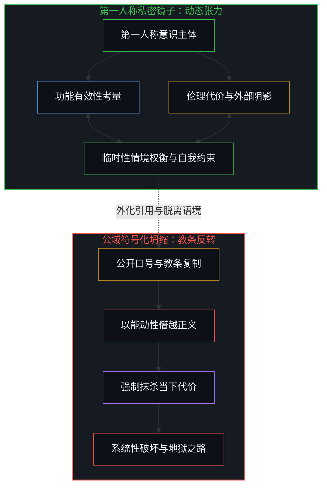
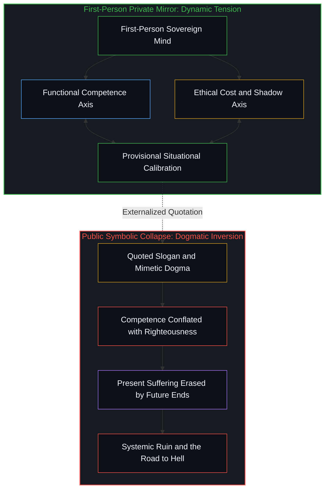
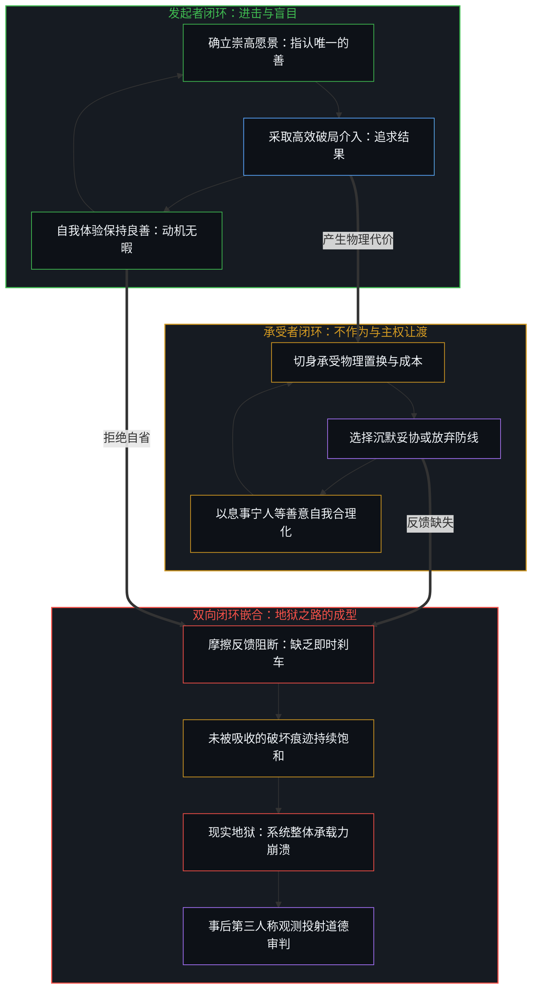
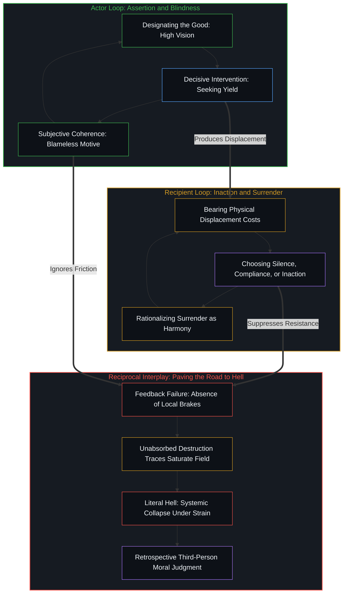

# 善恶硬币与通往地狱的善意之路 / The Coin of Good and Evil and the Road to Hell

*地狱是天堂的对拓镜像，唯在第一人称的张力中硬币才不至坍缩为教条。 / Hell is the antipodal mirror of heaven; only in first-person tension does the coin refuse to collapse into dogma.*

古老的格言断言通往地狱的道路是由善意铺就的，这并非警世的文学隐喻，而是因果演化中确凿发生的机械过程。善与恶并非宇宙中截然分离的两种独立实体，而是一个心智在划分界线时同时生成的正负两极。当行动者将某种愿景指认为善，便在边界之外自动划定出与之相悖的阴影；出于自身自洽性的保护，没有任何意识会在主观体验中蓄意作恶，哪怕以长远崇高的名义接纳短期的破坏，其内在驱动力依然是自认为无可指摘的良善与能动。与此同时，直接承受后果的心智若在自身的第一人称闭环中选择沉默、退让或不作为，主权便在便利与恐惧中被悄然让渡。正是在行动者的盲目进击与承受者的回避妥协之间，未被消解的物理痕迹持续在世界中堆积，最终将当初构建天堂的宏愿硬生生塑造成现实的地狱。

The ancient maxim asserting that the road to hell is paved with good intentions is not a poetic moral metaphor, but a literal mechanical process unfolding within physical causality. Good and evil are not two independent metaphysical substances warring across the cosmos; they are the positive and negative poles generated simultaneously whenever a living mind draws a boundary. The moment an agent designates an outcome as good, it inevitably casts whatever resists or contradicts that alignment as an opposing shadow. Because conscious centers operate to preserve internal coherence, no living mind acts from an interior experience of malice toward itself; even when embracing immediate destruction under the banner of a distant horizon, the inner drive remains convinced of its own righteousness and competence. Concurrently, when those who directly bear the brunt of these consequences choose silence, compliance, or inaction within their own closed first-person loops, sovereignty is quietly abdicated out of fear or convenience. It is within the reciprocal interplay between the actor's unexamined advance and the recipient's sovereign inaction that unabsorbed physical traces compound, solidifying the visionary highway to heaven into actual ruin.

---

## 一、 善意的几何学：对拓镜像与未被察觉的阴影 / 1. The Geometry of Good Intentions: Antipodal Mirrors and the Unseen Shadow

自差别划分的活动自行涌现，未曾停歇，每一次心智的划界都设立起一个离散的边界。道德的极性正是这一划界活动在评价维度上的表现：一旦某个行动者在经验场域中指认出一片属于善的领地，排斥在外的剩余部分便同步被赋予了恶的轮廓。正如在 [善与恶是硬币的两面与切割](../good-and-evil-are-the-two-sides-of-the-coin-and-the-cut/) 中所阐明的，两极的分立并非对某种客观等待被发现的实体结构的观测，而是划界动作本身留下的痕迹。天堂的构想与地狱的惩戒从来不是两座相互独立的城堡，地狱正是天堂向外投射时必然产生的对拓镜像。当一个心智认定某种崇高状态必须被确立，任何与该状态不符、甚至仅仅是对该目标表达怀疑的存在，都会在该心智的内部坐标系中自动沦为障碍与破坏力量。

这种镜像关系的危险之处在于，没有任何心智会在自身内部将自己的行动体验为恶。自我维系是生命中心运作的恒常约束，即便一个人采取了极其残忍、剧烈且具有毁灭性的行动，其内在叙事也必定将其加工为必要的牺牲、自卫的举措或为了更宏大秩序而付出的微小代价。即便有人公开宣称自己在做坏事，只要这一判断出自真诚的第一人称考量，其底层逻辑也依然包裹在某种扭曲的良善意图中，例如为了粉碎虚伪的教条、为了测试忠诚度、或是为了在漫长博弈中换取更大的收益。正因为作恶的体验在内部被严密屏蔽，行动者对自己划定界线所造成的外部代价抱有天然的盲区。

然而，这种因果链条的闭合并非仅由单向施加影响的行动者独自完成。若将分析严格局限于进击的一方，便在无形中把承受后果的他者降格为毫无主权的被动客体，从而陷入跨主体因果裁判的道德迷思。在本体论意义上，每一个生命中心都不可逃避地封印在自身闭合的第一人称因果回路之中。当物理摩擦与置换成本降临到承受者身上时，承受者如何应对——是坚决划定防线、立即以物理阻力予以回击，还是出于息事宁人、顾全大局、甚至贪图短期庇护而选择妥协、忍受与不作为——全然是承受者自身主权闭环内的独立抉择。这种不作为绝非能动性的缺席，而是一种消极的主权让渡，它同样被承受者自身为了维持现状或避免冲突的良善意图所包裹。

在纸面推演上，算式可以通过逻辑恒等式实现零耗散的完美闭合，但在客观实在中，任何行动都是不可逆的物理介入，必须付出真实的能量代价并激起剧烈的物质置换。当行动者的单向进击与承受者的回避退让相互嵌合时，系统的校准机制便告失灵。行动者沉浸于自身的宏大叙事，将外溢的摩擦轻巧地归类为微不足道的附带损耗；承受者则在沉默中吞咽代价，未能将第一人称的真实痛感转化为即时的边界阻力。两处闭合的第一人称回路不仅没有形成健康的摩擦抗衡，反而在彼此的自我合理化中达成了一种致命的妥协。未被即时吸收与抵消的破坏痕迹在整体场域中持续震荡堆积。通往地狱的道路之所以由善意铺就，既不是因为某一方怀揣原罪，也不是单向施暴的戏剧性结果，而是行动者的免于自省与承受者的主权让渡在物理因果中相互强化，共同消解了现实的刹车机制，直到系统整体在承受力枯竭时走向崩解。

Distinction-drawing occurs as an unceasing, uncaused activity of mind, and every discrete act installs a boundary. Moral polarity is simply this boundary projected onto an evaluative axis: the moment an acting center claims a domain as good, the excluded territory is simultaneously delineated as evil. As shown in [Good and Evil Are the Two Sides of the Coin and the Cut](../good-and-evil-are-the-two-sides-of-the-coin-and-the-cut/), this polarity is not a neutral finding of pre-existing substances awaiting discovery, but the operational residue of the boundary-drawing act itself. The vision of heaven and the torment of hell are not independent realms; hell is the antipodal mirror inevitably cast whenever heaven is drawn. The moment a mind insists that a particular idealized order must prevail, whatever resists that order, or even hesitates to comply, is automatically converted into an obstruction or an existential threat within that agent's coordinates.

The insidious peril of this geometric symmetry lies in the structural fact that no mind ever experiences its own immediate choices as evil from within. Self-coherence is an invariant condition of living centers; even when an agent engages in devastating destruction, its internal narrative unfailingly recasts the act as a necessary sacrifice, a defensive imperative, or an indispensable price paid for a higher purpose. Even when individuals openly describe their choices as bad or ruthless, if the statement reflects genuine first-person conviction, the underlying calculation remains wrapped in a distorted core of good intention—such as shattering hypocritical dogmas, proving strength, or securing long-term survival in an unforgiving game. Because the direct experience of being evil is systematically barred from internal introspection, the acting mind remains blind to the shadow its boundary projects.

Crucially, this causal loop is never completed by the initiating actor alone. Confining the analysis strictly to the assertive party inadvertently demotes those who bear the consequences into inert, helpless objects devoid of sovereignty, thereby falling into the moralistic trap of adjudicating cross-mind causality. Epistemologically, every conscious center remains irrevocably sealed within its own closed first-person causal loop. When physical displacement and costs land upon an affected party, that party's response—whether mounting immediate boundary friction or choosing silence, compliance, and inaction out of a desire for tranquility or fear of conflict—is an unalienable sovereign choice made within its own loop. Inaction is not an absence of agency; it is an active surrender of sovereignty, frequently justified by the recipient's own benevolent intentions to preserve harmony or endure for the collective good.

On paper, symbolic formalisms achieve frictionless symmetry without energetic dissipation, but in physical causality, every action is an irreversible intervention that consumes energy and violently displaces matter. When the forward momentum of the crusader interlocks with the sovereign inaction of the recipient, corrective feedback breaks down. The actor dismisses displaced friction as negligible collateral damage, while the recipient swallows the injury in silence, failing to convert somatic pain into dynamic resistance. Instead of producing localized frictional balance, these two independent first-person loops enter a fatal alignment of reciprocal rationalization. Unabsorbed traces accumulate throughout the field. The road to hell is paved with good intentions not because of innate wickedness, nor as a one-sided morality play, but because the actor's unexamined zeal and the recipient's surrendered sovereignty mutually reinforce each other, eliminating the system's physical brakes until the entire order collapses under accumulated strain.

---

## 二、 蒂尔的界线：有效性与道德代价的私密镜子 / 2. Thiel's Boundary: Competence and Moral Cost as a Private Mirror

关于善恶辩证关系的深刻辨析，可以在彼得·蒂尔对善的反义词的划分中找到清晰范例。蒂尔提出，善的反义词应当区分为两个截然不同的维度：功能层面的对立面是差劲或低效，而道德层面的对立面才是真正的恶。在常规话语中，人们常常因畏惧触碰道德禁忌而陷入行动瘫痪，将无能与怯懦粉饰为遵纪守法的美德。蒂尔的区分提供了一把极其锋利的手术刀：在极端情境下，一个具有高度能动性的人需要辨析，当下的方案究竟仅仅是由于技术拙劣而无效，还是它虽然能够极具效率地达成结果，却不可避免地伴随着沉重的伦理破坏与道德代价。

这一区分的真实价值，全然依赖于它被持有的物理场所。当且仅当这一思考留驻在一个单独个体的第一人称心智内部时，它才能发挥作为私密反思之镜的效用。行动者在直面真实的决策困境时，借此追问自己是否正在用无能掩盖怯懦，或者追问自己为了取得既定结果究竟愿意承担多大尺度的外部震荡。在这里，善、差与恶的范畴保持着临时性与具身性，它们紧密附着于当事人身处的具体时空切面之中，作为一种辅助权衡的活态认知脚手架而发挥作用。正如在 [抉择的跨界](../the-boundary-crossing-of-choice/) 中所描述的，主观抉择是信息潜在性跨入物理实在的单次坍缩，在这一临界点上，只有行动者自己能够真实称量自身能动性的边界与必然产生的代价。

然而，这种平衡极其脆弱。一旦同一个思考脱离了私密的内心审视，被作为公开主张加以引用、宣讲或奉为圭臬，其原本所具有的动态校准功能就会迅速丧失。在公共语境中，善与恶的张力被粗暴切断，这枚原本在手中翻转考量的硬币被硬生生抛入舆论场，其中一面被孤立地奉为终极真理。原本为了打破行动瘫痪的谨慎区分，瞬间演变为给残酷手段背书的狂妄意识形态：能动性被直接等同于正义性，而未来虚构的长远收益则被用来抵消当下具体生命所承受的切肤之痛。

A profound illustration of this moral dialectic emerges from the distinction Peter Thiel draws between the antonyms of good. Thiel suggests that good has two entirely separate opposites: its functional antonym is bad or ineffective, whereas its moral antonym is evil. In conventional discourse, individuals frequently succumb to paralysis out of fear of transgressing social taboos, dressing up sheer incompetence and inaction as modest moral virtue. Thiel's taxonomy offers a sharp diagnostic scalpel: in extreme circumstances, a high-agency operator must discern whether a plan is failing because it is technically deficient, or whether it is highly effective yet exacts severe collateral damage and ethical cost.

The generative value of this formulation depends entirely upon where it is housed. It operates as a living instrument only so long as it remains anchored inside the private first-person look of a single mind. Confronted with immediate friction, a decision-maker can use it to interrogate whether caution is merely a cloak for cowardice, or to weigh what magnitude of shock they are willing to absorb to achieve a vital breakthrough. In that solitary space, the categories of good, bad, and evil remain provisional and embodied, tethered to the concrete constraints of a singular dilemma as living scaffolding. As established in [The Boundary Crossing of Choice](../the-boundary-crossing-of-choice/), subjective choice is an irreversible collapse of informational potential into physical reality, where only the acting subject can directly calibrate the friction of agency against its incurred costs.

Yet this balance is delicate. The moment the formulation is extracted from private introspection and broadcast as a public doctrine, its adaptive utility evaporates. In the open arena, the dynamic tension between competence and cost is severed. The coin is hurled into the crowd, and one face is seized upon as a totalizing banner. What began as a cautious instrument to overcome passive paralysis degrades into an arrogant ideology that excuses cruelty: operational competence is crowned as moral righteousness, and hypothetical future horizons are invoked to cancel real present suffering.

---

## 三、 硬币的两面：不可同时观测的第一人称统一体 / 3. Both Faces of the Coin: A First-Person Unity That Cannot Be Seen Simultaneously

善与恶的不可分割性，最贴切的物理隐喻就是一枚具有两个截面的硬币。每一个在世界上产生实质结果的能动行为，都必然在照亮一部分现实的同时投射出相伴相生的阴影；每一个由于畏缩而未能付诸实践的道德企图，也都在同一个因果场域中占据着位置并带来机会损失。这两个截面并非来自两个独立的世界，而是由同一种金属铸造而成的不可分割的整体。在整个宇宙中，唯有作为行动发起者的单个心智，能够在其自身的第一人称体验中同时托住这两面。

然而，即便对于拥有这枚硬币的心智而言，也存在着一道物理视角上的严格限制：人不可能在同一个空间视角和时间切片中，同时直接观测到硬币的两面。当主观视线聚焦于正面，试图确认行动的目标、愿景以及由此激发的成就感时，背面所背负的沉重代价与破坏痕迹便不可避免地背离了视线；而当心智被迫转过头去审视背面的损失、摩擦与受难时，正面最初的意图与光彩又必然暂时退出视野。心智能够做的，是在两面之间保持高频的交替审视与动态张力，正如在 [感知者与痕迹的不可坍缩](../the-perceiver-and-the-trace/) 中强调的第一人称边界，感知活动本身不能被任何第三人称外化记录所取代。

行动者拥有选择向外界呈现哪一面的权利，但却无从规定他人在相遇时究竟会看到哪一面。当行动者带着满腔热忱向世界展示自己精心擦亮的善意正面时，处于其物理动量受力点的他者，眼眸中映出的却正是那枚硬币冰冷、粗糙且带来压迫的背面。这种视角上的错位绝非由于某一方怀有恶意，而是不同空间位置与因果承载点带来的必然落差。试图强行命令他人必须和自己看到同一面，是心智在遭遇摩擦时最易萌生的狂妄。

The inseparability of good and evil finds its most precise physical metaphor in a two-faced coin. Every competent action that achieves a real effect illuminates one sector of reality while casting a corresponding shadow; every moral impulse paralyzed by caution occupies space in the causal field, incurring an unrecoverable opportunity cost. These two faces are not assembled from different substances; they are carved from one continuous piece of metal. Across the entire cosmos, only the singular mind initiating the action can hold both faces within its first-person awareness.

Yet even for the mind holding the coin, an uncompromising perceptual constraint applies: it is physically impossible to observe both faces simultaneously from a single vantage point. When visual attention fixates on the front face—tracing its noble vision, projected benefits, and operational triumph—the reverse face, bearing the friction and damage exacted on the ground, is oriented away from sight. Conversely, when the agent turns the coin to inspect the accumulated wreckage and unintended suffering, the initial brilliance of the front face momentarily withdraws from view. The only mature capacity available to agency is to alternate attention between both sides through continuous dynamic vigilance. As emphasized in [The Perceiver and the Trace Cannot Collapse](../the-perceiver-and-the-trace/), living perception can never be outsourced to third-person artifacts.

The acting center may choose which side of the coin to present to the world, but it cannot dictate which side other sovereign centers will see. While the actor proudly extends the polished emblem of its benevolent intentions, those standing at the receiving end of its momentum feel only the heavy, jagged edge of the reverse face. This divergence does not arise from malice or bad faith; it is an unavoidable consequence of occupying different coordinates in the causal topology. The demand that others perceive only the face the actor prefers to show is the earliest delusion born of unexamined power.

---

## 四、 符号化坍缩与高能动性的僭越 / 4. Reification in Public Tokens and the Overextension of High Agency

一旦私密的内心考量被抛入公共话语空间，硬币便脱离了最初托住它的手掌，坍缩为僵死的公共符号。在传播与引用的链条中，活态的权衡被剔除，只有某一个孤立的面被定格为教条。原本属于行动者对自身抉择负责的局部认知框架，被外界或追随者物化为放之四海而皆准的客观真理。辩护者将其奉为免死金牌，指责者则将其视作罪证标靶。正如在 [道德倒错与被脚本化的主体](../the-moral-reversal-and-the-scripted-subject/) 中所分析的符号异化，当第一人称的责任感被公共符号替代，鲜活的主体性便沦为了意识形态操弄的剧本样本。

这种符号化坍缩暴露出了高能动性心智最容易陷入的认知陷阱。具备非凡行动能力的人，拥有一种罕见的打破道德清规的勇气，他们敢于直面物理世界的阻力并强行创造突破。然而，正是这种罕见的高能动性，极易滋生出一种危险的代偿倾向：将技术与组织层面的非凡能力，直接等同于超越道德约束的特权。能动者误以为自己不仅能够计算当下的因果推演，更能够代行全知全能的视角，去为其他所有独立的生命定义何为普遍的良善。

这种僭越建立在一个极其虚妄的假设之上，即认定未来的宏伟产出可以反向抹杀当下的物理痕迹。然而在严格的因果链条中，已经发生的痛苦、毁损与剥夺是不可逆的单向刻写，没有任何虚构的历史终点能够取消它们的存在。当行动者试图以未来的天国为由强制他人承受当下的代价，而承受者同样在沉默中放弃抵御时，两方共同推波助澜，将真实的生命降格为无机的数据资产。在这场交互中，原本用来警醒自身的善恶硬币早已失落，取而代之的是通往地狱之路上愈发沉重的滚滚车轮；而事后站在历史终局进行复盘的观察者，极易轻率地给双方贴上道德标签，从而深深遮蔽了因果回路相互嵌合的真实机制。

Once private introspection is cast into the public square, the coin slips from the palm that held it and collapses into a reified token. In circulation and citation, living tension is stripped away, and one frozen face is elevated into an absolute doctrine. What began as a provisional rubric for personal responsibility is transformed by disciples and detractors into an impersonal principle. Apologists brandish it as an alibi, while critics attack it as moral depravity. As analyzed in [The Moral Reversal and the Scripted Subject](../the-moral-reversal-and-the-scripted-subject/), when first-person agency is displaced by external tokens, living subjects are demoted into scripted props in an ideological theater.

This reification exposes the subtle trap confronting high-agency actors. Those possessing exceptional competence display an admirable readiness to act where others cower, confronting friction to force novel outcomes. Yet this same drive tends to overextend into a fatal hubris: confusing technical competence with moral righteousness. The actor assumes that because they can engineer systems and bend trajectory lines, they possess the authority to define goodness for all other minds.

This overextension rests on the false premise that prospective future outcomes can cancel the physical traces of immediate harm. In physical reality, every unit of suffering, displacement, and extraction is an irreversible historical inscription; no distant utopia can retrospectively erase what was broken to reach it. When an agent demands that others bear immediate destruction to fuel an imagined future paradise, and those others passively acquiesce, living subjects are collaboratively demoted to expendable instruments. The coin that once functioned as a private mirror of conscience is lost, replaced by an ideological juggernaut crushing the landscape beneath its advance. Retrospective third-person observers then slap moralizing labels onto the wreckage, obscuring the closed-loop causal interplay that produced the disaster.

---

## 五、 无法转让的原点：在第一人称中承担自己的阴影 / 5. The Non-Transferable Ground: Bearing One's Own Shadow in the First Person

善恶的对立与撕裂，永远无法在第三人称的公共法庭或抽象的道德理论中达成调和。任何试图在外部世界中悉数铲除恶的宏伟运动，都不可避免地在挥舞利剑的同时划定出更加庞大的被排斥群体，进而以善意为燃料点燃更为惨烈的战火。能够将这枚硬币的两面重新收拢并容纳于一处的唯一场所，只有心智不可剥夺的第一人称视角。

正如在 [道德语言稀释了放大自由的反馈](../moral-language-dilutes-the-feedback-that-scales-freedom/) 中所揭示的，当个体依赖外部的道德标签来指导行动时，真实的因果反馈链条就被稀释阻断了。回到第一人称，不仅要求行动者承认自己每一次追求善的划界都无可推卸地连带制造了相应的阴影，更要求承受后果的一方终止对外部拯救者的幻想，重新夺回自身主权的防御界线。人无法离开第一人称视角，因为这一视角正是因果责任唯一的发生处。成熟的能动性不再妄图向外界证明自身的无暇，也不再以息事宁人为借口出卖自己的防线，而是老老实实地凝视那枚被自己持有的硬币，既不沉迷于正面的光环，也不回避背面划破现实所流出的鲜血。

在具体的行动中，这要求我们时刻保持对物理摩擦的敬畏。每当我们因极高的效率而斩获成果时，必须清醒地意识到那不是神圣正义的降临，而仅仅是局部扰动带来的能量释放。承担自己的阴影，意味着主动将外溢的摩擦与代价纳入自身的测算与补偿之中，而不是将其推卸给无辜的他者或虚幻的未来；与此同时，面对外来的压迫与侵蚀，守住自身的边界是每一个主权中心无可逃避的因果职责。唯有当行动者不再将善恶硬币抛向空中用作宣判他人的武器，承受者也不再以善意为名消极出让自身的主权，各自在第一人称的清醒中直面因果摩擦时，那条由盲目善意与消极妥协共同铺就的地狱之路，才会在第一人称的驻足与抗衡中失去继续延展的动力。

The tension between good and evil cannot be reconciled in an external tribunal or an abstract ethical schema. Every crusade that marches to eradicate evil from the face of the earth merely draws a wider boundary of exclusion, pouring good intentions as fresh fuel onto catastrophic fires. The sole arena capable of reconciling both sides without violence is the irreducible first-person vantage of the individual mind.

As demonstrated in [Moral Language Dilutes the Feedback That Scales Freedom](../moral-language-dilutes-the-feedback-that-scales-freedom/), relying on external scoreboards severs an agent from the raw causal feedback of its acts. Returning to the first-person locus not only demands that the initiator acknowledge the inevitable shadow cast by its pursuit of the good, but equally demands that those who bear the costs cease harboring passive hopes for an external savior and reclaim their own sovereign boundary defense. One cannot step out of the first-person perspective, because that vantage is the sole site where causal authorship registers. Mature agency does not waste its strength demanding moral validation from public opinion, nor does it surrender its boundaries under the polite guise of keeping the peace. It gazes steadily at the coin resting in its own palm, neither blinded by the brilliance of its intentions nor shrinking from the costs carved into its reverse side.

In practice, this requires enduring reverence for physical friction. Whenever remarkable competence yields a decisive victory, the agent remembers that this outcome is not a cosmic coronation, but an irreversible perturbation exacting energetic costs. Bearing one's own shadow means taking ownership of those externalities, absorbing the friction within one's own capacity rather than outsourcing it to innocent bystanders or passing the bill to an imaginary tomorrow. Simultaneously, defending one's boundary against external erosion is an inalienable causal duty of every sovereign center. Only when initiators cease hurling the coin to judge others, and recipients cease yielding their sovereignty under the banner of passive goodwill, will the road to hell—paved by blind zeal and quiet acquiescence alike—finally cease to stretch forward beneath their feet.
