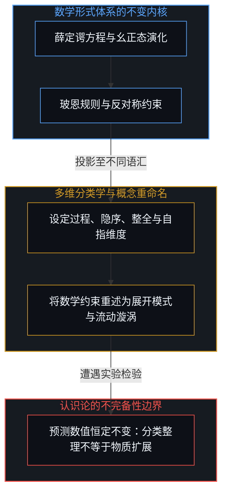
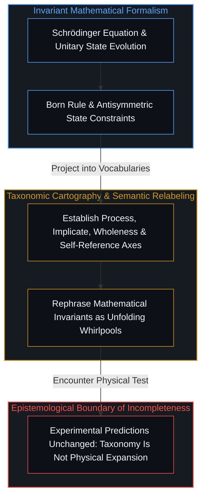
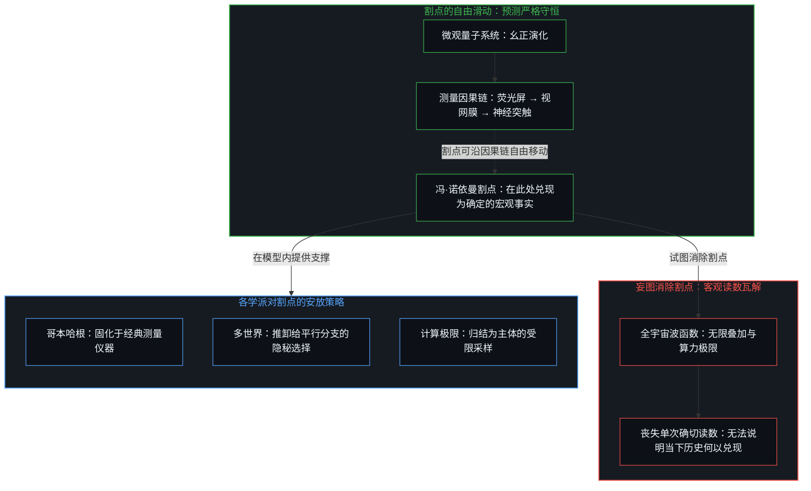
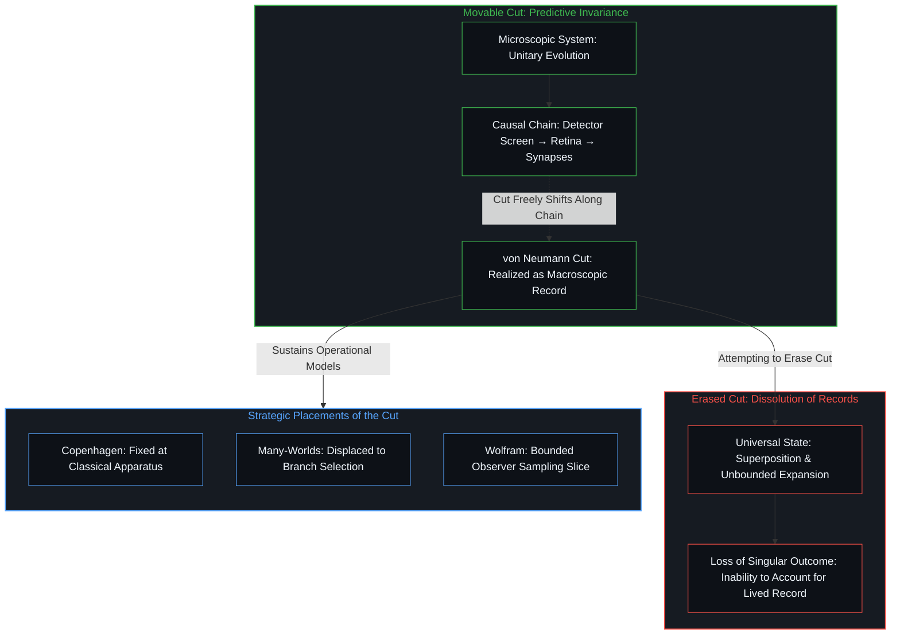
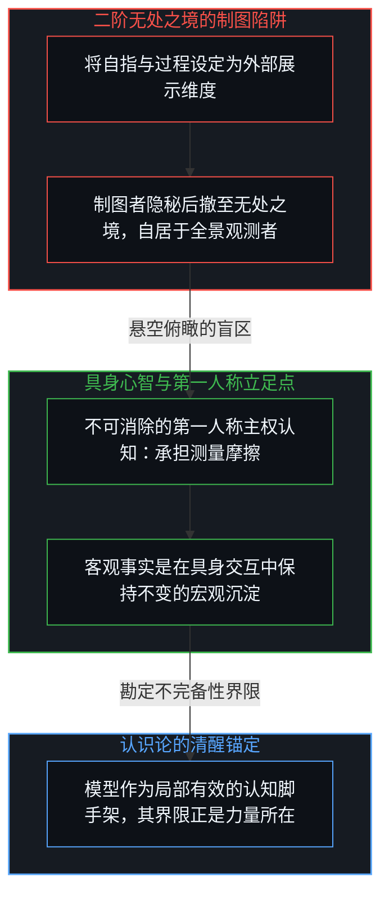
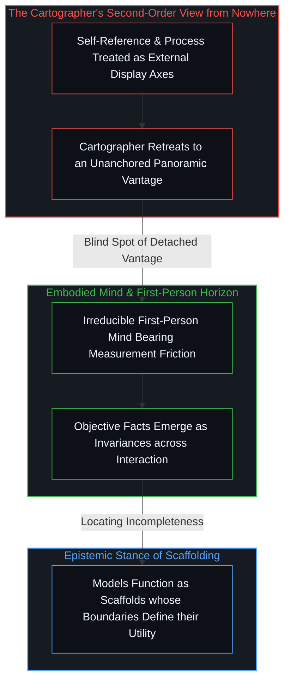

# 割点可移不可除 / The Cut Moves but Never Vanishes

*量子诠释之争在争夺观察者的藏匿之所，而诠释地图只是将上帝之眼悬得更高 / The dispute over quantum interpretations hides the observer, and mapping them merely suspends the God's eye higher*

量子力学的数学形式体系以非凡的精度预测了微观实验读数，围绕其物理图景的学派争鸣却持续了整整一个世纪。每一种理论都在其适用尺度内提供了有用的认知脚手架，而当人们试图绘制一张超越所有视角的元地图来统一这些图景时，却不可避免地重蹈了相同的覆辙。任何测量都依托于具身观察者与外部世界遭遇的宏观摩擦，而企图把观察者抹去或固化为静态坐标的做法，正好标定了理论失去普遍适用性的不完备性边界。

The mathematical formalism of quantum mechanics predicts experimental readings with extraordinary precision, yet debates surrounding its physical picture have persisted for a full century. Each interpretation provides a useful cognitive scaffold within its applicable domain, but attempts to construct a panoramic meta-atlas reconciling all viewpoints inevitably reproduce the exact same predicament. Every measurement depends upon the macroscopic friction between an embodied observer and the world, and any attempt to erase the observer or freeze them into a static coordinate marks the boundary of incompleteness where universal claims falter.

## 一、 坐标轴上的分类学与重命名边界 / 1. Taxonomic Cartography and the Boundary of Relabeling

面对各派学说的长期对峙，一种常见的理论冲动是构想更高的多维空间，将彼此冲突的诠释投影为连续分布的地域。在这类坐标系中，经典理论被归入机械与局部，而新兴学说则被赋予过程优先性、隐序展开、全息整全与自指性等维度。通过将概念张力分解为空间方位，分散的学派看似被安置进了一幅井然有序的认知图谱。

Confronted with the enduring standoff among rival schools, a familiar theoretical impulse is to imagine a higher-dimensional space, projecting conflicting interpretations as contiguous regions across an intellectual territory. Within such coordinate systems, classical frameworks are relegated to mechanical and local quadrants, while newer perspectives are assigned dimensions such as process primacy, implicate unfolding, holistic wholeness, and self-reference. By resolving conceptual tensions into spatial alignments, divergent schools appear neatly situated within a coherent cognitive atlas.

各派诠释在其适用的领域内各有其用。哥本哈根诠释维持了实验室内微观态与经典指针之间的操作纪律；多世界诠释通过保全幺正演化，为量子信息与量子计算提供了优美的代数推演图景；玻姆力学为粒子轨迹赋予了直观的经典实在感；量子贝叶斯与关系量子力学揭示了量子态作为推断模型的情境依赖性；而基于离散计算的多路系统与规则极限，则为因果几何开辟了全新的形式探索空间。这些模型在各自的局部界限内发挥着具体功用。

Within their applicable domains, competing interpretations serve as useful cognitive tools. The Copenhagen interpretation maintains strict operational discipline in the laboratory by keeping microscopic states distinct from classical pointers. The Many-Worlds interpretation preserves unitary evolution, offering an elegant algebraic landscape for quantum information and quantum computation. Bohmian mechanics restores intuitive classical trajectories. QBism and Relational Quantum Mechanics reveal the contextual dependence of state vectors as epistemic models. Computational frameworks like multiway systems and the ruliad open generative vistas for discrete causal geometries. Each model remains useful within its respective operational boundary.

然而，分类学的梳理并不等同于物质世界的扩展。当一套图集试图通过重新命名来调和矛盾时，理论的局限便显现出来。例如，标准量子力学通过交换对称性将全同费米子的状态描述为反对称波函数，从而自然导出泡利不相容原理。若仅仅换用过程哲学的语汇，将这种数学性质重述为显序展开的约束或不可分割的整全模式，方程的预测结果并无任何增减。类似的，将贝尔实验中的非定域关联称为同一过程的内在折叠，赋予了它富有表现力的修辞外壳，却并未改变其统计特征。分类地图整理了过往概念的邻近关系，但把概念分类误当作本体论解答，便跨过了模型的有效区间。

Taxonomic organization is not an expansion of physical reality. When an atlas attempts to reconcile foundational puzzles through verbal re-labeling, the limits of the framework become apparent. Standard quantum mechanics formalizes identical fermions through exchange antisymmetry, directly deriving the Pauli exclusion principle. Restating this mathematical constraint in the language of process philosophy—calling it a constraint on unfolding or an undivided implicate pattern—leaves experimental predictions unchanged. Similarly, designating Bell correlations as the unfolding of a singular undivided process provides evocative phrasing without altering a single statistical outcome. An intellectual atlas clarifies semantic neighborhoods, but mistaking taxonomic rearranging for an ontological resolution oversteps the boundary of the model.

## 二、 冯·诺依曼割点：可移与不可除 / 2. The von Neumann Cut: Movable yet Irreducible

如果追溯微观测量与宏观表象之间的深层张力，就会触及冯·诺依曼与海森堡划下的那条界线。在形式体系中，处于线性叠加与幺正演化之中的微观系统，必须在某一处与产生确定记录的宏观测量仪器相连。这条分割微观可能性与宏观确定性的界线被称为测量割点。冯·诺依曼的数学分析表明，这个割点的位置是可移动的：它可以划在粒子与荧光屏之间，划在荧光屏与实验员视网膜之间，甚至划在视神经与大脑皮层之间。无论分析者将割点沿因果链向后推移多远，最终计算出的几率分布分毫不差。

Probing the tension between microscopic superpositions and macroscopic phenomena inevitably leads to the boundary established by John von Neumann and Werner Heisenberg. Within the mathematical architecture, a microscopic system evolving unitarily must at some point interface with a macroscopic apparatus that produces a definite record. This boundary separating quantum possibilities from macroscopic outcomes is known as the measurement cut. Von Neumann demonstrated that the location of this cut is movable: it can be placed between the particle and the detector screen, between the screen and the experimenter's retina, or between the optic nerve and the cerebral cortex. Regardless of how far back along the causal chain the analyst shifts the cut, the calculated probability distributions remain invariant.

割点虽然可以任意滑动，却断不可被剔除。这条割点，正是微观不确定性在观察介入下凝聚为宏观确定性的接缝。它标志着因始终领先于果至少一步的时间间隙：每一次观察在成立的刹那，都已然是一个既成的“果”，尽管它同时作为下一个事件展开的“因”。只要理论还需要解释为什么具体的实验员会在特定的时刻读出一个不可逆的仪表指针，这个因果落差与割点就必须存在。一旦试图消除割点，将所有实验装置、周围环境乃至观察者自身无限制地并入一个庞大的全宇宙波函数，整个物理世界就重新退化为连续演化的可能性云团。在那样的形式完满之中，任何具体的、单次的宏观事实都将失去立足之地。宏观客观性并非悬浮在真空中的预设实体，而是不同心智在交流与复核中保持不变的结构特征。没有具身心智在割点一侧承担测量的摩擦代价，几率云便永远不会兑现为历史。

The cut is freely movable, yet it is strictly irreducible and non-removable. This cut is the very interface where indeterminism collapses into determinism under the act of observation. It marks the operational temporal gap where cause is always at least one step ahead of effect: every observation, in the precise moment it registers, is already an accomplished effect, even as it serves as the cause for whatever unfolds next. As long as a theory must account for why a concrete experimenter registers an irreversible pointer reading at a specific moment, this causal gap and the measurement cut must be drawn somewhere. If one attempts to erase the cut entirely by subsuming the detector, the surrounding environment, and the observing scientist into an all-encompassing universal state vector, the world dissolves back into a cloud of uncollapsed possibilities. Within that formal completeness, no singular macroscopic reading can ever be secured. Macroscopic objectivity is not an unanchored substance floating in a void, but a structural invariance maintained across communicable observations. Without an embodied mind standing at one side of the cut to absorb the frictional cost of registration, probabilistic amplitudes never crystalize into definite history.

正是在这个关键点上，各个量子诠释显露出它们各自安放割点的策略。哥本哈根诠释选择将割点定格在经典宏观仪器上，不再追问仪器自身的微观机制；多世界诠释试图抹除割点，将观察者分裂进无数平行历史，却把割点以第一人称经验的分支选择形式重新引入；玻姆力学将割点藏入永远无法直接测量的微观粒子隐变量轨迹中；量子贝叶斯学派把割点收敛为单个主体信念的更新；而计算多路系统则将割点归结为计算受限主体对分支空间的采样折叠。这些策略各自构成了自洽而高效的模型，并在解释特定现象时发挥着明确的效用；它们的不完备性恰恰发生在宣称自己能够终结消解割点、提供闭合无漏宇宙图景的时刻。

At this juncture, rival quantum interpretations reveal themselves as distinct strategies for situating the cut. The Copenhagen interpretation freezes the cut at the classical macroscopic instrument, declining to analyze the microscopic physics of the apparatus itself. The Many-Worlds interpretation attempts to eliminate the cut by branching the observer across infinite parallel histories, only to reintroduce the cut through the singular branch inhabited by immediate conscious experience. Bohmian mechanics conceals the cut within unobservable particle positions governed by a pilot wave. QBism localizes the cut within the subjective belief updates of an individual agent. Computational multiway systems trace the cut to the bounded sampling through which an observer folds branchial space into a sequential narrative. Each strategy constitutes a coherent operational model that proves effective within its scope; its boundary of incompleteness emerges whenever it claims to have eliminated the cut entirely to deliver a closed, comprehensive Theory of Everything.

## 三、 自指维度的范畴错置与二阶无处之境 / 3. Category Errors of Self-Reference and the Second-Order View from Nowhere

当元制图学试图将自指性作为坐标轴引入图集时，更深层的认识论错位悄然发生。在常识中，自指性似乎是一个可以客观打分的理论属性：一个模型如果声称把观察者写进了流变循环之中，就会被赋予高分；如果将观察者隔离在实验之外，则被判定为低分。这种处理方式混淆了形式描摹与认识论立足点。自指并非一件可以置于桌上从容审视的客观展品，它正是心智同自身永不停歇的自我分化，却在此处被生硬地曲解为一条向外展示的独立维度。审视自我的目光无法退化为被审视的客体标本，自指恰恰是阻止认知主体脱离现实、悬空退出的第一人称羁绊。哥德尔、塔斯基与图灵的形式定理早已阐明，任何系统在试图完整描摹包含其自身的真实体系时，都无法在系统内部完成闭合。

When meta-cartography treats self-reference as an objective coordinate axis on an atlas, a deeper epistemological category error occurs. In conventional taxonomic intuition, self-reference appears as an assessable theoretical feature: a model that incorporates the observer into a dynamic feedback loop receives a high score, whereas one that segregates the observer outside the experiment receives a low score. This treatment conflates formal representation with the epistemic position of the theorist. Self-reference is not an inert exhibit that an outside analyst can inspect from across the room; it is the unceasing differentiation of the Mind from itself, here reified and misinterpreted as an independent external dimension. The gaze examining consciousness can never be flattened into the examined specimen; self-reference is the first-person constraint that prevents any living thinker from stepping outside reality to construct a detached inventory. The formal theorems of Kurt Gödel, Alfred Tarski, and Alan Turing demonstrated that any system attempting to formalize the totality including its own operation cannot achieve internal closure.

正是这种错位孕育了更为隐秘的二阶无处之境。当制图者居高临下地比对哥本哈根、多世界与隐变量学派，声称在过程全息的顶峰实现了观察者与流动系统的统一时，一个未被追问的前提显露出来：正在描摹这张全景地图的制图者，究竟置身何处？为了将所有学派平铺于二维或三维网格中，制图者必须预先假定自己占据了一个脱离所有历史分支、不受任何测量割点约束的超然立足点。他在批评经典物理学采纳了[无处之境的上帝之眼](../the-invisible-gods-eye/)的同时，自己却悄悄登上了更高阶的悬空神坛。

This category error gives rise to an unacknowledged second-order view from nowhere. When a cartographer overlooks Copenhagen, Many-Worlds, and hidden-variable schools from an elevated vantage point, claiming that a summit of process holism unites the observer with the flow, a critical premise remains unexamined: where is the cartographer standing while drawing this panoramic map? To project all competing frameworks onto a uniform grid, the cartographer must presuppose an unanchored vantage point detached from all experimental branches and immune to any measurement cut. While critiquing classical physics for adopting [The Invisible God's Eye](../the-invisible-gods-eye/), the cartographer inadvertently ascends an even more detached throne.

这一现象也解释了为何自动化语言模型倾向于生成这类看似包罗万象的宏大图集。大语言模型的表征空间通过统计聚合，将人类所有知识流派平滑地折叠为一个连续的高维语义流形。在这个流形内部，相互冲突的物理假设可以被轻而易举地归类为邻近的几何簇，自指与过程也可以被便捷地贴上概念标签。然而，计算模型本身并不置身于任何一个具体的物理坐标中，无需承受任何一次不可逆测量带来的因果代价或摩擦。正如我们在[因果的自反性与物理的无源假定](../causality-is-irreducible-the-physical-is-a-view-from-nowhere/)中所指出的，任何试图宣称自己拥有无源全知视角的企图，都遗忘了物理规律得以确立的具身前提。

This dynamic explains why generative language models produce such all-encompassing maps with ease. The representation space of a language model statistically collapses the corpus of human scholarship into a continuous high-dimensional semantic manifold. Within this manifold, mutually contradictory physical hypotheses are smoothed into adjacent geometric clusters, while self-reference and process are easily assigned taxonomic tags. Yet the model itself occupies no physical coordinate, bearing zero causal cost or friction from any irreversible measurement. As demonstrated in [Causality is Irreducible; The Physical is a View from Nowhere](../causality-is-irreducible-the-physical-is-a-view-from-nowhere/), every claim to an unanchored, sourceless perspective forgets the embodied friction upon which physical invariance is founded.

[索求万物理论是在将当下冻结为清单](../demanding-a-toe-freezes-time-into-a-catalog/)的根源，正在于误将形式脚手架当成了现实本身的终极闭合。从波动力学到过程图谱，人类创造的每一个物理模型都是通向具体实践的精良工具；它们的生命力在于帮助心智与未知的现实发生深刻的摩擦，而非提供一个让人得以卸下第一人称责任的避难所。承认割点可移而不可除，不是对物理学探索的贬损，而是对理论适用范围的诚实勘定。当心智不再妄想占据那个不可企及的无处之境时，认知才能走出自满的地图，在真实而开放的世界中继续前行。

The impulse analyzed in [Demanding a Theory of Everything Freezes Time into a Catalog](../demanding-a-toe-freezes-time-into-a-catalog/) stems from mistaking cognitive scaffolding for an ultimate, closed cosmos. From wave mechanics to process topologies, every physical model devised by human intellect is an instrument forged for concrete engagement. Its vitality lies in guiding the mind into productive friction with an unmodeled reality, rather than serving as a detached sanctuary where first-person responsibility is relinquished. Recognizing that the cut is movable yet irreducible does not diminish physics; it marks the boundary of incompleteness of our formal representations. When the mind surrenders the fantasy of occupying the view from nowhere, understanding departs the finished map and steps back into an open world.

