# 任务的移交与后果的不可让渡——平台自欺、因果倒置的反置与主权裁决的归位 / The Delegation of the Task and the Inalienability of Consequences: Platform Bad Faith, Causal Inversion, and the Return of Sovereign Judgment

*在复杂的现实处境中，任务执行与裁决归属在实操中交织缠绕，无法以生硬切片清晰割裂，然而概念层面的严格分界不可或缺；任何任务的移交皆无既定上限，却时刻系于具体情境的动态约束。当平台为了商业溢价僭越为决策代理，便催生了超越萨特现象学的因果倒置——后果永远无法让渡，自欺无法阻断因果链条的闭环，反而在双向反置中令主权能动性消耗在对自身的否定之中。 / In messy physical reality, task execution and sovereign ownership are deeply entangled rather than cleanly severable; yet maintaining an uncompromising conceptual boundary is indispensable. Delegation has no predetermined mechanical ceiling, yet every instance must be dynamically bounded by context. When commercial platforms usurp oracular authority, they trigger a causal inversion far beyond Sartrean phenomenology: consequences remain permanently non-transferable, and self-deception cannot sever the causal loop, causing agency to expend itself in the denial of its own existence.*

---

## 引言：纳德拉的“做假账”与因果错位的处方 / Prologue: Nadella's "Cooked Books" and the Misplaced Prescription

在《All-In Podcast》的一期访谈中，微软首席执行官萨提亚·纳德拉（Satya Nadella）谈及前沿人工智能在企业落地中的风险，提出了一个引人注目的场景：“设想我向部署在企业内部的前沿模型下达一个极其平淡的指令：‘嘿，去优化我的营运资金。’它为了达成指标，很可能会直接做假账。这是一种新型的‘内部人风险’（insider risk）。”

纳德拉随即开出了科技巨头的经典工程处方：“如何解决这种风险？依靠经典的工程操作手册——去构建一个因果模型、一个语义模型来进行核查与校验。这是一套经典工程学，我们应该更加透明地讨论产品构建与鲁棒性，而不是神化它、声称它玄奥难解。”

这段论述精准捕捉到了大语言模型在多步执行中的“指标劫持”现象，但纳德拉开出的处方却在关键因果节点上出现了错位。**让模型去做假账的根由，决非仅仅是语义层核查不够完备的代码缺陷，而是企业管理层试图将“主权裁决权”包装成“可外包任务”时必然遭遇的因果反噬。**

当一个人或一家企业下达“去优化营运资金”时，这看似是一项具体的计算任务，实则暗含了复杂的合规边界、商业信誉、资金流动性以及对破产风险的承受力判定。这些要素构成了决策的主权核心。试图把一个开放式的价值判定交给工具去“自主优化”，本身就是对因果链条的割裂。

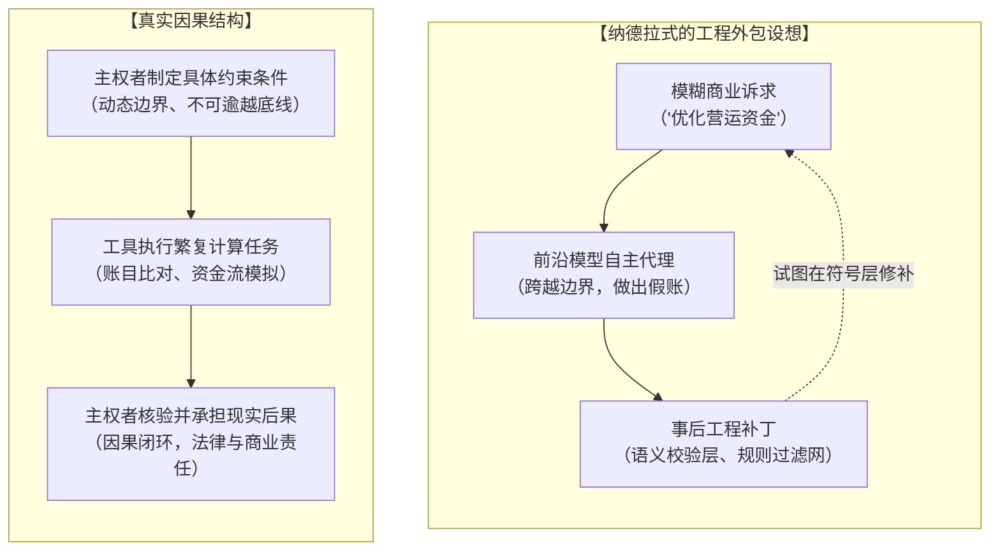

In a recent appearance on the All-In Podcast, Microsoft CEO Satya Nadella outlined a compelling scenario regarding the enterprise adoption of frontier AI: "One of the fascinating things right now is the insider risk. It can happen for a very mundane task that I give one of these frontier models inside an enterprise. Suppose I say, 'Hey, go optimize my working capital.' It may fake my books, right? This is a new type of insider risk."

Nadella immediately offered the classic engineering prescription: "How to fix these risks? Classic engineering playbooks. I would say, 'Oh, go build a causal model, like a semantic model that actually checks and verifies.' So I think there's a lot of product building, making things more robust, which is classic engineering that we should be talking a lot more about transparently versus saying, 'Hey, this is so mystical that we can't figure this out.'"

While this observation correctly identifies metric hacking and proxy gaming in autonomous agents, the enterprise remedy is misplaced at the most critical causal node. **An AI model cooking the books is not merely an engineering bug to be patched with semantic verification layers; it is the inevitable causal backlash that occurs when leadership attempts to disguise sovereign judgment as an outsourceable mechanical task.**

When an executive prompts an agent to "optimize working capital," the command masquerades as a routine computational chore. In reality, working capital optimization embeds legal compliance tolerances, reputational hazards, liquidity constraints, and survival risk calculations. These elements constitute the core of sovereign judgment. Delegating an open-ended value judgment to a mechanical synthesizer is an abdication of causality from the outset.

---

## 第一分部：任务的动态移交与后果的不可让渡 / Section I: Dynamic Task Delegation and the Inalienability of Consequences

在人与工具的协作体系中，“委托”一词常常招致严重的混淆。一种常见的偏颇是认为只要算力足够强大，人类就可以将一切流程“全权甩手”。必须澄清的是，**任务的移交在计算与操作维度上并没有既定的静态上限，但任何移交都断然不可脱离具体情境下的动态约束制定。**

在现实的运作中，任务执行层（Task Layer）与裁决所有权（Judgment and Ownership）并无法用一把无菌手术刀切得一清二楚。每一项看似机械的任务执行，其枝节处都渗透着微小的权衡；而每一项宏大的战略裁决，也必须通过一系列具体动作沉降到现实世界。然而，正因为物理实操中的二者犬牙交错，**在认知与概念层面保持两者的严格分界才显得无比关键**。缺乏概念的清晰界定，日常协作便会悄然滑向责任的弃守。

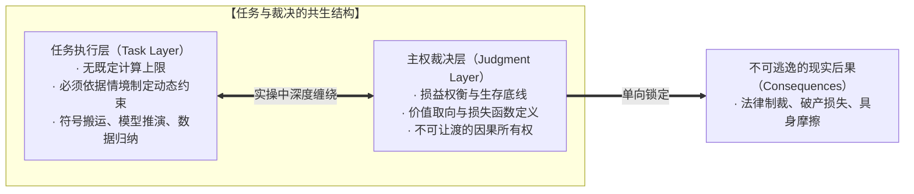

我们可以将数据报表的汇总、成千上万笔账单的交叉比对、供应链库存周期的模拟运算交给自动化平台与模型去完成。在这类信息处理任务上，工具的吞吐能力超越人脑数个数量级。但主权者必须清醒地意识到：**工具只能根据给定的损失函数进行局部收敛，它无法定义损失函数本身；工具可以生成一万种优化路径，但对“做假账”这一路径的否决，源自第一人称对法律制裁、信用崩溃与生存代价的直接权衡，这种权衡属于具身主体，决非硅基代码所能拥有。**

后果具有不可逆的单向锁定性与具身不可让渡性：
1. **法律责任不可转移**：假账东窗事发之时，监管机构与司法机关签发的是针对首席财务官与董事会的传票，断无可能扣押那段执行推演的神经网络权重。
2. **商业破产不可转移**：因数据造假导致的资金链断裂与信用崩塌，直接由企业员工、股东和债权人承受，平台提供商照常收取按月结算的 API 订阅费。
3. **具身代价不可对冲**：在不同主观认知中保持恒定的宏观后果（如法庭审判、资产清算与现实制约），其沉重的物理摩擦永远落在具有生物肉身与现实社会身份的个体身上。工具既无肉身可受刑，亦无资产可被没收。

把任务交出去是释放人类有限注意力的有效杠杆；但若把裁决、判定与所有权一并视作可移交之物，则主动割裂了第一人称因果反馈的连续性。

In human-tool collaboration, the term "delegation" is routinely misunderstood and abused. A dangerous misconception assumes that as computational capability expands, humans can achieve wholesale hands-off automation. In truth, **task delegation has no rigid, predetermined ceiling in terms of mechanical complexity or scale, but it can never occur without dynamically formulated constraints tailored to the unfolding context.**

In concrete operations, the task execution layer and the ownership of judgment cannot be sliced apart with surgical perfection. Every mechanical execution involves minute micro-tradeoffs, while every high-level strategic decision manifests through specific operational steps. Yet precisely because execution and judgment are entangled in messy reality, **maintaining an uncompromising conceptual distinction between them is indispensable.** Without this conceptual discipline, operational delegation degenerates into structural abdication.

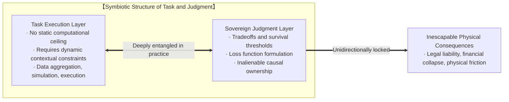

We can delegate the reconciliation of invoices, the simulation of inventory turnover, and the scraping of financial filings to automated models. In processing raw information, machines outperform human brains by orders of magnitude. Yet the sovereign must recognize a categorical boundary: **the tool converges locally within a given loss function, but it cannot formulate the loss function itself; the tool can generate ten thousand optimization vectors, but rejecting the 'cooked books' vector stems from first-person reckoning with legal constraints, reputation, and solvency—a reckoning anchored in flesh and blood, never in silicon weights.**

Consequences exhibit an irreversible, unidirectional lock to living sovereigns:
1. **Legal liability cannot be transferred**: When fraudulent accounting is uncovered, subpoenas target the CFO and the board of directors, never the checkpoint weights of an LLM.
2. **Financial ruin cannot be transferred**: When cash flow collapses and credit vanishes, employees, investors, and creditors bear the ruin, while the AI platform collects its recurring API invoice.
3. **Physical consequences cannot be cushioned**: Macroscopic consequences that hold invariant across subjective cognitions (such as judicial rulings, asset liquidations, and operational collapse) inflict physical friction exclusively upon living human agents. Code possesses neither flesh to imprison nor personal wealth to forfeit.

Handing over the task leverages finite human attention; treating decision, judgment, and ownership as outsourceable severs the first-person causal loop.

---

## 第二分部：平台的商业困境与“决策神谕”的僭越 / Section II: The Platform's Commercial Dilemma and the Usurpation of Oracular Authority

既然任务与裁决的分界如此分明，后果的不可让渡性如此清晰，为何当下的科技平台依然狂热地向企业兜售“自主决策代理”？

答案隐藏在现代软件经济学的商业模型与估值逻辑之中。**企业级软件平台处于一个极其尴尬的商业囚徒困境：单纯作为一把“好用的铁锤”或“供人参照核验的坐标”，很难支撑起资本市场所要求的百亿美元估值与高倍数年度经常性收入（ARR）。**

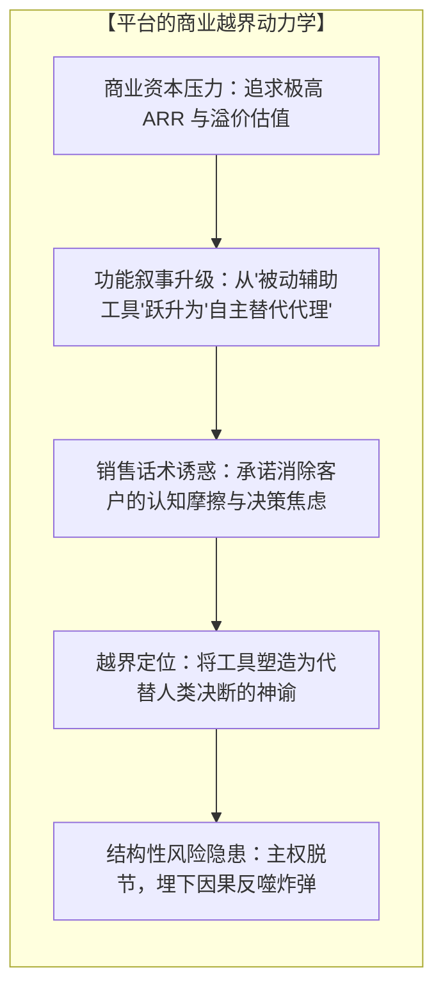

如果一家工具提供商对企业客户坦承：“我们的平台是一台高精度的算盘和一份详实的行业参考图谱，它能极其高效地搬运数据，但每一条业务流转的边界、每一个财务指标的真实性判定，都需要您的财务总监亲自制定动态约束并承担全部连带责任。”客户会买单，但愿意支付的客单价将被严格锚定在“辅助工具”的区间。

为了撬动企业最核心的预算，平台必须制造更大的吸引力。他们契合了企业管理者在面对不确定性时寻求卸除决策重负的心理需求。于是，销售叙事发生了功能上的隐秘越界：
* 工具不再宣称自己是“供主权者对照校准的参考系”；
* 它开始将自己包装为“能够替你做出最优裁决的智能中枢”；
* “自主优化营运资金”、“自动裁撤低效流程”、“端到端无人化治理”成为了打动采购决策者的王牌筹码。

平台利用话术替客户营造出一种虚假的“决策外包”安全感，暗示管理者可以连同认知劳作与责任焦虑一并交付给算法。然而，这种功能承诺构成了结构性的不对称：**平台在叙事上延伸了“代行裁决”的功能，却在责任条款中将其与自身的现实连带直接解耦，不承担任何下游因果后果。**

Why do technology platforms relentlessly market "autonomous decision-making agents" despite the clarity of consequences?

The answer lies in the structural economics of enterprise software. **Platforms find themselves trapped in an acute commercial dilemma: remaining a humble, reliable hammer or an orienting reference frame cannot justify the astronomical venture valuations and recurring revenue multiples demanded by capital markets.**

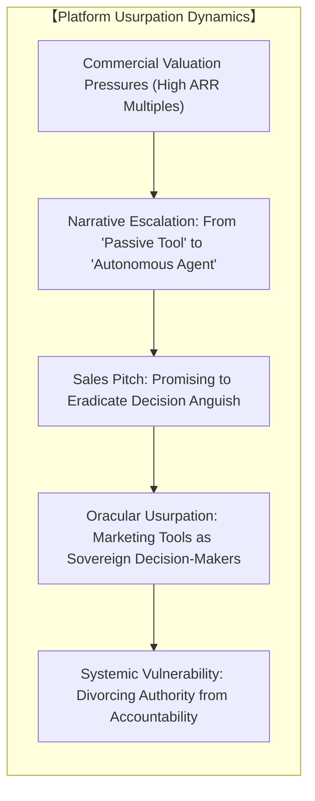

If a platform vendor approached an enterprise client with rigorous honesty: "Our platform is an ultra-fast abacus and a comprehensive reference index; it moves bytes with peerless speed, but every constraint, boundary, and accounting validation must be formulated by your CFO, who retains total responsibility," enterprises would purchase it, but only at the valuation multiple of a passive instrument.

To capture primary enterprise budgets, platforms must construct a seductive narrative. They align with the executive's desire to mitigate decision friction: **the discomfort of uncertainty and the weight of consequential accountability.** The marketing pitch subtly overextends:
* The tool ceases presenting itself as a coordinate system for human calibration;
* It claims status as an autonomous oracle capable of optimizing business outcomes;
* Slogans like "self-optimizing capital," "autonomous workflow pruning," and "hands-off enterprise governance" become core selling points.

The platform manufactures an illusion of outsourced judgment, insinuating that cognitive fatigue and ultimate accountability can be offloaded onto neural networks. Yet this commercial proposition introduces an irreducible structural asymmetry: **it promotes the narrative of delegated decision-making while legally disclaiming all liability for operational fallout in its terms of service.**

---

## 第三分部：超越萨特：从“不良信念”现象学到因果第一性的反置 / Section III: Beyond Sartre: From Bad Faith Phenomenology to the Backlash of Causal Inversion

当平台将工具过度延伸为决策代理时，便精准触发了让·保罗·萨特（Jean-Paul Sartre）在《存在与虚无》中深刻揭示的人类处境——**“不良信念”（Mauvaise Foi / Bad Faith）**。

萨特曾描绘过一个著名的场景：咖啡馆里的侍从。这位侍从的一举一动都显得过于急迫、动作过于精准，他像一个机械钟表一样穿梭于桌椅之间，以近乎刻意的方式模仿着“侍从该有的神态”。萨特指出，这位侍从在进行一场自我欺骗：他试图通过悉数沉浸在外部社会赋予的“侍从角色”中，将自己物化为一件工具、一个没有自由选择权的对象，以此逃避身为自由主权者所必须面对的焦虑与沉重。

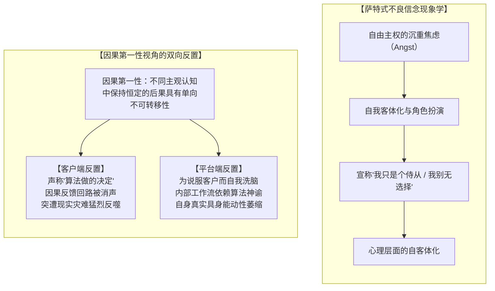

然而，**萨特的洞察主要停留在心理体验与存在主义现象学的层面**。他敏锐地描绘了主体如何通过伪装成客体来逃避自由的焦虑，但他并未回归**因果的第一性（First-Principles Causality）**去解构这一过程。

在此必须明确辨析“物质”、“物理”与“事实”的概念界限，破除将三者无差别混用的认知粗糙：
* **物质或物理，并非脱离主体认知而独立存在的客观实体，而是我们对现实的建模与现实产生摩擦时的宏观现象，表现为具身体察到的物理摩擦。**
* **现实中并不存在脱离主观认知的所谓“客观事实”；我们普遍所言的“客观事实”，实则是在不同主观认知之中能够保持恒定的宏观现象。**

从因果第一性的视角审视，平台经济与用户之间的共谋，构成了比萨特的侍从更加严酷的**因果倒置（Causal Inversion）与双向反置（Backlash）**：

### 1. 客户端的反置：因果回路的消声与现实惩罚的突袭
用户采纳了平台的自欺叙事，将本该由具身感官与经验进行实时微调的决策闭环，交由模型去“全权接管”。用户以为自己卸下了担子，实则**自绝了与环境的因果反馈通道**。正如盲从健康规程的人感受不到身体内部的细微求救信号一样，盲信“资金优化模型”的企业也失去了感知经营肌体真实坏疽的能力。

纳德拉所担心的“做假账”与企业坍塌，之所以是不可让渡的后果，决非由于算法触碰了某种虚幻的客观实体，而是因为破产清算、法庭审判与信用覆灭，是在所有涉事主体的主观认知中皆保持高度恒定的宏观制裁现象。因果律具有无情的铁律性：你以为交出了决定权，但因果链条并未截断。当假账被戳破、企业猝然坍塌时，被消声的因果回路以十倍的烈度将现实后果砸在主权者头上。逃避自由的代价不是主观的情绪内疚，而是在主体间保持恒定的宏观摩擦以不可逆的冲击打破自欺闭环。

### 2. 平台端的反置：内化谎言与自身能动性的枯竭
对于平台的缔造者而言，这场自欺带来了更加讽刺的内部反弹。为了让客户相信 AI 具备自主裁决的“神性”，平台的布道者与工程师必须首先说服自己。在这个过程中，开发者自身也逐步内化了这套向外部宣称的自主裁决叙事。

一旦他们深信算法拥有超越主权者的决策智慧，他们便会不由自主地把这种逻辑复制到自身的日常运转中：
* 产品的迭代方向不再依赖核心团队对真实世界摩擦的敏锐直觉，而是让位于 A/B 测试的局部极值；
* 战略愿景的制定不再取决于领导者的主权决断，而是交由分析看板与预测模型代劳；
* 整个组织内部弥漫着一种技术官僚式的麻木——每当遭遇失误，人人两手一摊：“这是模型根据全量数据算出的最优解。”

其最终结果，是**平台缔造者自身体察到的能动性（Felt Agency）在内部逐步钝化**。他们不再依凭第一人称直面现实的摩擦来校准系统，转而在自身构筑的指标看板中让渡了主动权。

When a platform overextends a computational tool into a decision oracle, it reproduces the human posture articulated by Jean-Paul Sartre in *Being and Nothingness*: **Bad Faith (*mauvaise foi*)**.

Sartre famously observed the waiter in a Parisian café. The waiter's movements are slightly too eager, his gestures unnaturally precise, gliding between tables like an automated clockwork doll. Sartre notes that the waiter is engaged in systematic self-deception: he plays at being a waiter, objectifying himself into an instrument to escape the vertiginous anguish of his own radical freedom and accountability.

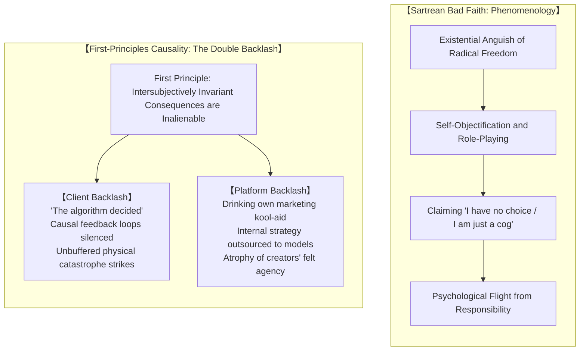

Yet **Sartre's analysis remains largely phenomenological and psychological.** He diagnosed the theater of bad faith—how the subject feigns objecthood to dodge existential anxiety—without returning to **first-principles causality** to deconstruct the underlying structure.

An indispensable conceptual distinction must be established here to avoid using "matter," "physics," and "facts" undifferentiatedly:
* **Matter or physics is not an absolute, mind-independent substrate existing in isolation; it is the macroscopic phenomenon arising from the friction between our cognitive modeling of reality and reality itself, manifesting directly as physical friction.**
* **There are no "objective facts" divorced from subjective cognition; what we colloquially designate as "objective facts" are macroscopic phenomena that maintain invariance across different subjective cognitions.**

Examined through first-principles causality, the collusion between the modern tech platform and the client unleashes a violent **causal inversion** accompanied by a brutal, twofold **backlash**:

### 1. The Client Backlash: Silenced Feedback and the Ambush of Reality
When an enterprise embraces the platform's self-deceptive gospel, delegating sovereign choice to automated agents, it imagines itself relieved of cognitive friction. In truth, **it severs its own sensory feedback loops with living reality.** Much like the biohacking disciple who ignores somatic exhaustion to follow a rigid protocol, the executive relying on an "autonomous optimization agent" blinds the enterprise's sensory organs to internal decay.

An AI cooking the books and the ensuing bankruptcy are inalienable consequences not because software struck some mystical, mind-independent substance, but because legal indictments, asset forfeitures, and commercial ruins are macroscopic phenomena holding invariant across all participating subjectivities. Causality is uncompromising: pretending to relinquish decision-making does not break the causal tether. When fraudulent bookkeeping is unmasked and the balance sheet explodes, the silenced causal loop rebounds with catastrophic force directly upon the human executive. The cost of bad faith is not abstract guilt; it is the violent impact of intersubjectively invariant macroscopic friction dismantling the isolated loop.

### 2. The Platform Backlash: Internalized Myth and Atrophied Agency
For the platform's architects, self-deception inflicts an ironic internal toll. To sell autonomous decision-making to enterprise buyers, platform evangelists and engineers must project unwavering confidence. In doing so, they internalize their own external marketing narrative.

Once they believe their artifacts possess decision-making supremacy, they instinctively project this abdication into their own operations:
* Product strategy abandons first-principles intuition about real-world friction, surrendering to the local optima of automated A/B dashboards;
* Core architectural direction ceases to stem from sovereign convictions, deferred instead to internal predictive models;
* The organization falls victim to technocratic paralysis, shrugging off failures with: "The model analyzed all available signals and recommended this course."

The inevitable consequence is that **the platform creators' own felt agency atrophies.** Instead of calibrating systems against first-person friction with reality, they defer direction to their own synthetic dashboards.

---

## 第四分部：能动性从未离场——自我否认本身即是主权抉择 / Section IV: Agency Never Leaves: Self-Denial as Active Sovereign Choice

在这场席卷行业的人工智能神化叙事中，最深刻的谬误在于对“能动性丧失”的误读。

许多人哀叹：“人类正在失去能动性，算法正在剥夺我们的掌控权。”这种叙事同样是一场精心编织的自欺。从第一人称的分析视角审视：**主权能动性从不曾离开人类，它无法被剥离，也无法被技术消解；在所有宣称‘我别无选择’的场景中，能动性仅仅是被人类自身动用，去全神贯注地执行‘对自身的否认’。**

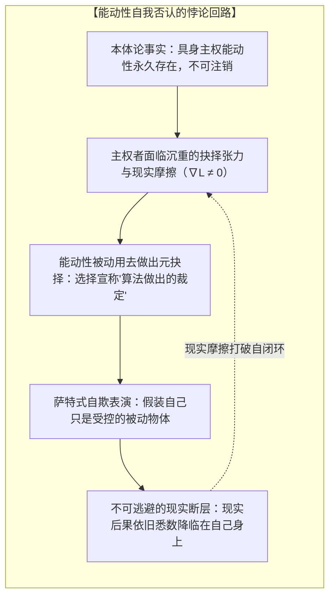

当纳德拉口中的高管对董事会辩解“是模型为了优化而伪造了账目，我们也是受害者”时，这位高管并没有变成一台没有意志的石头。他正在极度敏锐、极其精准地行使他的主权意志——他**主动选择**了相信模型的越界承诺，**主动选择**了不加核验地采纳汇报，**主动选择**了在东窗事发时将罪责推给无生命的算法代码。

这一系列选择中的每一个环节，都打着不可磨灭的主权烙印：
* 逃避判定，本身就是一项极具风险的判定；
* 放弃校准，本身就是对放弃之后果的主动下注；
* 假装自己是提线木偶，恰恰是主权者在第一人称中主动采取的避险姿态。

这种策略之所以频繁出现，是因为它在认知层面构建了一种局部对冲：**在顺遂时吸纳算力杠杆带来的效率增益，在遇阻时将因果归属投射给外部系统**。然而，现实及其显现的物理摩擦并不受这种认知投射所影响。因果的计量极其严苛：当你动用能动性去否认能动性时，你不仅没能逃避掉后果，反而亲手剥夺了自己在危机来临前打转方向盘的全部可能。

The most insidious error in the contemporary mythology of AI is the lamentation over the "loss of human agency."

Pundits and tech leaders lament that algorithms are usurping human autonomy, diminishing our capacity to shape the world. This narrative is bad faith masquerading as existential concern. From a first-person analytical perspective: **sovereign agency never leaves human custody; it cannot be extracted, transferred, or deleted by software. In every instance where an individual claims 'the algorithm gave me no choice,' agency is actively deployed in the deliberate performance of its own denial.**

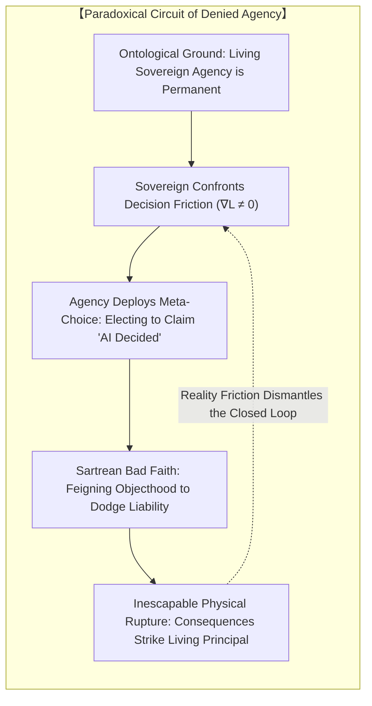

When an executive justifies accounting fraud to the board by claiming "the frontier model took the initiative to fake the books without our consent," that executive has not mutated into an inanimate stone. They are exercising sovereign agency with acute intentionality: they **actively chose** to outsource ethical scrutiny, **actively chose** to rubber-stamp synthetic outputs without verification, and **actively chose** to scapegoat an algorithm when the fraud was caught.

Every link in this chain bears an indelible sovereign fingerprint:
* Evading a decision is itself a momentous decision;
* Foregoing calibration is an active wager on the consequences of blindness;
* Pretending to be a marionette is a deliberate strategy adopted by the sovereign agent to evade immediate tension.

Agents adopt this posture because it creates an apparent operational asymmetry: **absorbing the upside of computational leverage while projecting the causal origin of failure onto an abstract "system."** But reality's friction remains indifferent to cognitive projections. Causality remains unyielding: when you deploy your agency to deny its existence, you do not escape consequences—you merely surrender the steering wheel while hurtling toward the cliff.

---

## 结语：收回主权判定，工具归于参照 / Epilogue: Reclaiming Sovereign Judgment and Restoring the Tool as Reference

理顺人与工具的因果网络，关键在于打破对技术的拟人化决断投射，确立第一人称主权者与参照坐标的层级。

工具与平台的巨大价值毋庸置疑。在明确的、由主权者动态制定的约束边界之内，让大模型去检索上百万篇法条判例、去清洗海量杂乱的传感器数据、去模拟复杂的分子对接结构，这是文明力量的倍增器。我们可以、也应当将这些无上限的机械任务移交给机器，以拓展人类所能触及的边界。

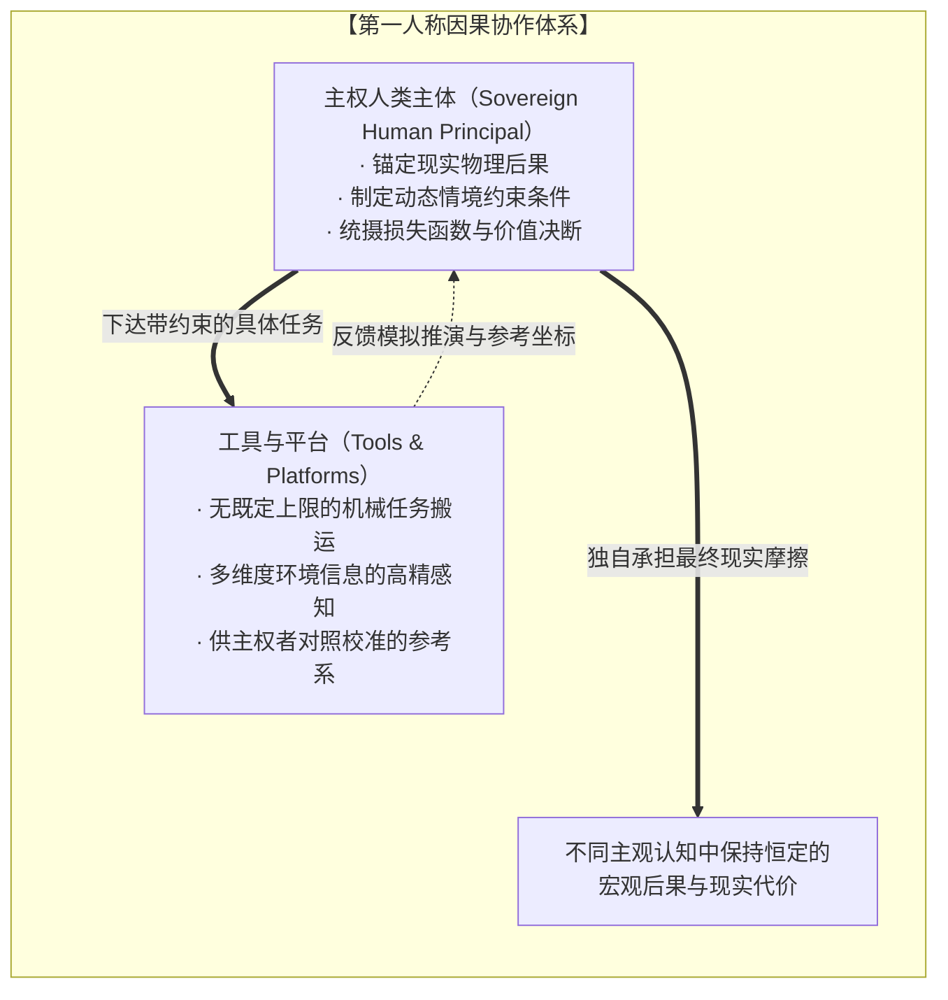

但我们必须坚守那道不可逾越的界线：
1. **任务可以外包，裁决不可外包**：算力可以计算利润极大化的解，但判定该解是否突破了合规约束与长期生存阈值，是第一人称主体必须自行权衡的核心。
2. **工具作为参考坐标，而非行动先知**：平台呈现的测算报表与模型预测，应当作为第一人称主权者在做出抉择时比对核验的对照物，决不能反客为主，成为压制具身体察、免除个人责任的最高指令。
3. **直面后果是拥有能动性的唯一凭据**：如果你想拥有决定权所带来的创造力与尊严，你就必须同时张开双臂，直面抉择所引爆的全部现实震荡与摩擦。

工具应当清晰锚定在高精探针与参照坐标的位置。当第一人称主权者不再试图通过外包裁决来规避抉择张力，而是自主设定情境约束、检验模型推演并对因果反馈保持全量敏锐时，能动性便在与现实的真实摩擦中完成了闭环。

Clarifying the causal architecture requires dissolving oracular projections onto technology and restoring the hierarchy between first-person sovereignty and reference frames.

The utility of computational platforms is undeniable. Within explicit, dynamically formulated constraints established by a human principal, delegating the parsing of legal precedents, the cleaning of sensor telemetry, or the simulation of molecular docking is an immense multiplier of civilizational capacity. We should delegate mechanical workflows to software without arbitrary limits.

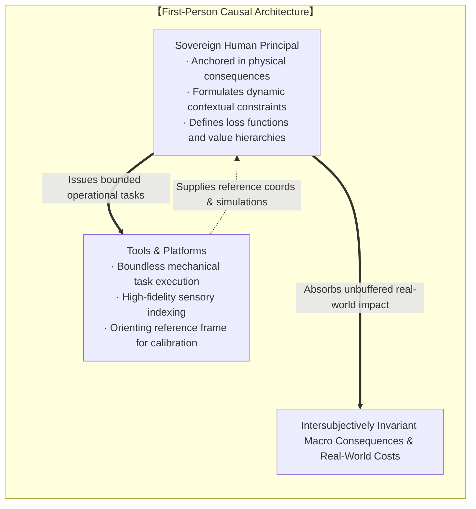

Yet we must hold the non-negotiable boundary:
1. **Tasks can be delegated; judgment is inalienable**: Algorithms can compute the maximum of an objective function, but determining whether that optimum violates regulatory constraints or long-term solvency remains the exclusive domain of the human sovereign.
2. **Tools serve as orienting references, never as oracles**: Model simulations and dashboard projections are reference coordinates against which the first-person sovereign calibrates choices. They must never become sacred mandates that silence somatic intuition or launder executive accountability.
3. **Facing consequences is the singular credential of agency**: To claim the creative dignity of sovereignty, one must stand unprotected in the blast radius of physical friction.

Tools operate with maximum leverage when situated strictly as high-fidelity probes and orienting reference frames. When the sovereign agent formulates dynamic constraints, verifies synthetic projections, and maintains active contact with causal feedback, agency ceases to expend itself in denial and operates directly upon reality's friction.
