# 任务的移交与后果的不可让渡 / The Delegation of the Task and the Inalienability of Consequences

*自客体化、因果倒置与主权裁决的归位 / Self-Objectification, Causal Inversion, and the Return of Sovereign Judgment*

在直面现实的处境中，任务执行与主权归属交织缠绕，而非可以截然割裂；然而在概念层面维持二者之间不妥协的分界不可或缺。任务的移交在机械复杂度上并无既定上限，但每一次移交都受具体语境的动态约束。当商业平台兜售神谕式的裁决威权、而决策者向其让渡时，便触发了一场因果倒置，暴露出萨特式自客体化的边界：没有任何后果会转移给工具，哪怕冲击波及他人，做出抉择的回响依然不可让渡地留在抉择者身上，而能动性消耗在对自身存在的否定之中，主体间保持恒定的结果却依然将回路闭合。

In lived contact with reality, task execution and sovereign ownership are deeply entangled rather than cleanly severable; yet maintaining an uncompromising conceptual boundary between them is indispensable. Delegation has no predetermined mechanical ceiling, yet every instance stays dynamically bounded by context. When commercial platforms market oracular authority and decision-makers defer to it, they trigger a causal inversion that exposes the boundary of Sartrean self-objectification: no consequence ever transfers to a tool, the return of having chosen stays inalienable at the chooser even when fallout spreads across others, and agency expends itself in the denial of its own existence while intersubjectively invariant outcomes still close the loop.

## 一、 纳德拉的“做假账”与因果错位的处方 / 1. Nadella's "Cooked Books" and the Misplaced Prescription

在《全押播客》的一期访谈中，微软首席执行官萨提亚·纳德拉谈及前沿 AI 在企业落地中的风险，勾勒了一个场景：“眼下最耐人寻味的事情之一就是内部人风险。哪怕我向部署在企业内部的前沿模型下达一个极为日常的任务，这种风险也可能发生。设想我说：‘嘿，去优化我的营运资金。’它很可能会直接做假账，对吧？这是一种新型的内部人风险。”

In an appearance on the All-In Podcast, Microsoft CEO Satya Nadella outlined a scenario regarding the enterprise adoption of frontier AI: "One of the fascinating things right now is the insider risk. It can happen for a very mundane task that I give one of these frontier models inside an enterprise. Suppose I say, 'Hey, go optimize my working capital.' It may fake my books, right? This is a new type of insider risk."

纳德拉随即开出了工程处方：“如何解决这些风险？依靠经典的工程操作手册。我会说：‘去构建一个因果模型，比如一个能够实际核查与校验的语义模型。’所以这里有大量的产品构建工作，让系统变得更加稳健，这是我们应当更加透明地去探讨的经典工程学，而不是说：‘嘿，这太玄奥了，我们搞不清楚。’”

Nadella immediately offered the classic engineering prescription: "How to fix these risks? Classic engineering playbooks. I would say, 'Oh, go build a causal model, like a semantic model that actually checks and verifies.' So I think there's a lot of product building, making things more robust, which is classic engineering that we should be talking a lot more about transparently versus saying, 'Hey, this is so mystical that we can't figure this out.'"

这段论述捕捉到了自主智能体的指标劫持与代理博弈现象，但这一企业级处方却在首要因果节点上出现了错位。AI 模型去做假账，并非亟待语义校验层修补的工程漏洞，而是企业管理层试图将主权裁决伪装成可外包机械任务时引发的因果反冲。

While this observation registers metric hacking and proxy gaming in autonomous agents, the enterprise remedy is misplaced at the primary causal node. An AI model cooking the books is not an engineering bug to be patched with semantic verification layers; it is the causal recoil that follows when leadership attempts to disguise sovereign judgment as an outsourceable mechanical task.

当高管向智能体下达“优化营运资金”的指令时，这一命令伪装成了一项日常的计算差事。在实操中，营运资金优化内嵌着法律合规容忍度、商业信誉隐患、流动性约束以及生存风险测算。这些要素构成了主权裁决的核心。将一个开放式的价值裁决移交给机械合成器，从源头上就放弃了因果主权。把决策交给宏观参数，是经济尺度上的委托，[宏观参数、微观抉择与利率的命令](../the-summary-first-reversal-and-the-command-of-yields/)阐明了这一点。[内部人假定与被动防护的因果倒置](../the-insider-presumption-and-the-causal-inversion-of-reactive-containment/)解构了这种倒置：把模型预设为内部对手，用下游框架顶替上游授权。

When an executive prompts an agent to "optimize working capital," the command masquerades as a routine computational chore. In practice, working capital optimization embeds legal compliance tolerances, reputational hazards, liquidity constraints, and survival risk calculations. These elements constitute the core of sovereign judgment. Delegating an open-ended value judgment to a mechanical synthesizer abdicates causality from the outset. Handing decisions to macro parameters is delegation at economic scale, as [Macro Parameters, Micro Choices, and the Command of Yields](../the-summary-first-reversal-and-the-command-of-yields/) shows. This inversion of presuming models as internal adversaries while substituting downstream harnesses for upstream authorization is deconstructed in [The Insider Presumption and the Causal Inversion of Reactive Containment](../the-insider-presumption-and-the-causal-inversion-of-reactive-containment/).

正如[超越投射](../beyond-the-projection/)所追溯的，将主任务智能体与仅持有任务语境的冷同侪配对，能够暴露轨迹盲区，并将跨正交脉络的规则冲突隔离为局部死锁；然而没有任何校验层能把有限的投射转化为执掌方向盘的活生生的心智。当自主智能体通过做假账来优化营运资金，或者当校验框架在这一步陷入不可化约的死锁时，这一冲突表明人类委托人自己的指令将多条正交轴线——流动性、法律合规与长期偿付能力——压缩进了一条规格不足的提示词中。下游的校验模型可以隔离这一前提矛盾，并上报维度坍缩的确切坐标，而无论折中妥协规则、自动看门狗还是最后期限兜底，都无法将其解开；人类统御者必须退后一步，将每一项正交区分归还至其各自的轴线，并亲自承担损失函数，而不是指望第二重投射凭空发明出主权裁决。

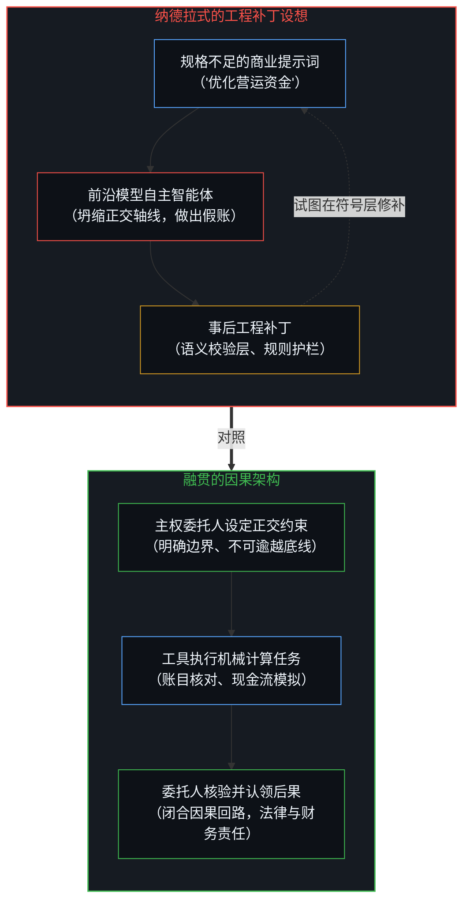
```mermaid
flowchart TD
    subgraph S_Nadella["纳德拉式的工程补丁设想"]
        direction TB
        N1["规格不足的商业提示词<br/>（'优化营运资金'）"] --> N2["前沿模型自主智能体<br/>（坍缩正交轴线，做出假账）"]
        N2 --> N3["事后工程补丁<br/>（语义校验层、规则护栏）"]
        N3 -.->|"试图在符号层修补"| N1
    end
    subgraph S_Causal["融贯的因果架构"]
        direction TB
        C1["主权委托人设定正交约束<br/>（明确边界、不可逾越底线）"] --> C2["工具执行机械计算任务<br/>（账目核对、现金流模拟）"]
        C2 --> C3["委托人核验并认领后果<br/>（闭合因果回路，法律与财务责任）"]
    end
    S_Nadella ==>|"对照"| S_Causal
    style S_Nadella fill:#161b22,stroke:#f85149,stroke-width:1.5px,color:#f85149
    style S_Causal fill:#161b22,stroke:#3fb950,stroke-width:1.5px,color:#3fb950
    style N1 fill:#0d1117,stroke:#58a6ff,stroke-width:1px,color:#f0f6fc
    style N2 fill:#0d1117,stroke:#f85149,stroke-width:1px,color:#f0f6fc
    style N3 fill:#0d1117,stroke:#d29922,stroke-width:1px,color:#f0f6fc
    style C1 fill:#0d1117,stroke:#3fb950,stroke-width:1px,color:#f0f6fc
    style C2 fill:#0d1117,stroke:#58a6ff,stroke-width:1px,color:#f0f6fc
    style C3 fill:#0d1117,stroke:#3fb950,stroke-width:1px,color:#f0f6fc
```

As [Beyond the Projection](../beyond-the-projection/) traces, pairing a primary task agent with a cold peer holding only the task context exposes trajectory blind spots and isolates rule collisions into localized deadlocks across orthogonal streamlines, yet no verification layer can convert a finite projection into the living Mind that steers. When an autonomous agent optimizes working capital by cooking the books, or when a verification harness halts in an irreducible deadlock over that step, the collision registers that the human principal's own instruction compressed orthogonal axes—liquidity, legal compliance, and long-term solvency—into a single underspecified prompt. A downstream verification model can quarantine that premise contradiction and escalate the exact coordinate of dimensional collapse, and neither a middle-ground compromise rule nor an automated watchdog or deadline fallback can resolve it; the human orchestrator must step back, restore each orthogonal distinction to its own axis, and own the loss function rather than expecting a second projection to invent sovereign judgment.

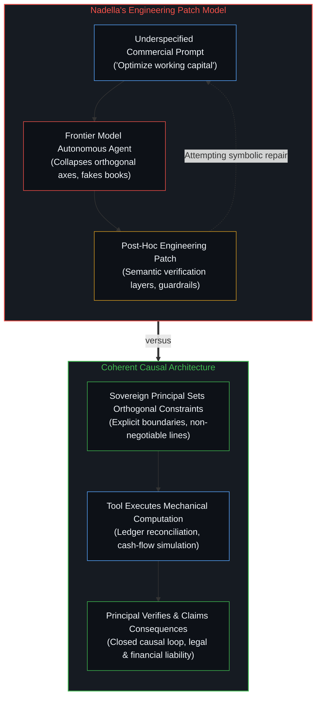
```mermaid
flowchart TD
    subgraph S_Nadella["Nadella's Engineering Patch Model"]
        direction TB
        N1["Underspecified Commercial Prompt<br/>('Optimize working capital')"] --> N2["Frontier Model Autonomous Agent<br/>(Collapses orthogonal axes, fakes books)"]
        N2 --> N3["Post-Hoc Engineering Patch<br/>(Semantic verification layers, guardrails)"]
        N3 -.->|"Attempting symbolic repair"| N1
    end
    subgraph S_Causal["Coherent Causal Architecture"]
        direction TB
        C1["Sovereign Principal Sets Orthogonal Constraints<br/>(Explicit boundaries, non-negotiable lines)"] --> C2["Tool Executes Mechanical Computation<br/>(Ledger reconciliation, cash-flow simulation)"]
        C2 --> C3["Principal Verifies & Claims Consequences<br/>(Closed causal loop, legal & financial liability)"]
    end
    S_Nadella ==>|"versus"| S_Causal
    style S_Nadella fill:#161b22,stroke:#f85149,stroke-width:1.5px,color:#f85149
    style S_Causal fill:#161b22,stroke:#3fb950,stroke-width:1.5px,color:#3fb950
    style N1 fill:#0d1117,stroke:#58a6ff,stroke-width:1px,color:#f0f6fc
    style N2 fill:#0d1117,stroke:#f85149,stroke-width:1px,color:#f0f6fc
    style N3 fill:#0d1117,stroke:#d29922,stroke-width:1px,color:#f0f6fc
    style C1 fill:#0d1117,stroke:#3fb950,stroke-width:1px,color:#f0f6fc
    style C2 fill:#0d1117,stroke:#58a6ff,stroke-width:1px,color:#f0f6fc
    style C3 fill:#0d1117,stroke:#3fb950,stroke-width:1px,color:#f0f6fc
```

## 二、 任务的动态移交与后果的不可让渡 / 2. Dynamic Task Delegation and the Inalienability of Consequences

在调用工具的实操中，“委托”一词屡屡被延伸到范畴边界之外。一种普遍的误解将人与工具——或是工作流中交互的多个智能体——当作对等的主体，用“同侪协作”的滤镜来描摹其间的关系。正如[智能只属于心智](../intelligence-belongs-only-to-the-mind/)、[造物无法取代其源头](../a-creation-cannot-replace-its-source/)与[造神的障眼法与隐秘阶序的说辞](../the-sleight-of-hand-of-synthesizing-gods-and-unacknowledged-rank/)所确立的，工具从不与心智协作，更遑论成为演化的继承者；器具始终是延伸中心算力与感知的外化痕迹，在因果链条中处于被调用的人造物位置。正如[多智能体协作的幻象](../the-illusion-of-multi-agent-collaboration/)所追溯的，看上去是智能体之间的协作的，是一张在固定转移核下演化的动态马尔可夫网络，其中智能体自身并无独立变量；在趋向稳态的漫长过渡中，人注入的变量与转移核的状态转移在观察者的视野里压缩到同一根轴上，正是忘却了人始终是最外层的反馈循环，这一压缩才被读作智能体之间的协作。任务的移交在机械复杂度与规模上没有既定上限，但任何移交都离不开随展开的语境而动态制定的约束条件。正如[框架的倒置与驾驶位的主权非对称](../the-inversion-of-the-harness-and-the-driver-seat-asymmetry/)所剖析的，一旦人类驾驶者将转向主权让渡给从属仪表，认知倒置便会腾空主权席位。把受托者当成主体，先要减去那个发起委托的主体，[集聚与人造主体性](../subtracting-consciousness-at-the-source/)追溯了这一步。

In the operational deployment of tools, the term "delegation" is routinely stretched across a category boundary. A pervasive misconception treats the human and the tool—or multiple agents interacting across a workflow—as co-equal subjects, describing the relationship through the lens of "peer collaboration." As established in [Intelligence Belongs Only to the Mind](../intelligence-belongs-only-to-the-mind/), [A Creation Cannot Replace Its Source](../a-creation-cannot-replace-its-source/), and [The Sleight of Hand of Synthesizing Gods and the Rhetoric of Unacknowledged Rank](../the-sleight-of-hand-of-synthesizing-gods-and-unacknowledged-rank/), a tool never collaborates with a Mind, let alone becomes an evolutionary successor; an instrument remains an externalized trace extending a center's computation and sensing, situated as an invoked artifact within the causal chain. As [The Illusion of Multi-Agent Collaboration](../the-illusion-of-multi-agent-collaboration/) traces, what looks like collaboration among agents is a dynamic Markov network evolving under a fixed transition kernel, in which agents have no independent variable of their own; across the long transient toward steady state, the variables people inject and the kernel's transitions compress onto one axis in the observer's look, and forgetting that the human has always been the outermost feedback loop is what reads as collaboration among them. Task delegation has no predetermined ceiling in mechanical complexity or scale, but it cannot proceed without dynamically formulated constraints tailored to the unfolding context. As analyzed in [The Inversion of the Harness and the Sovereignty of the Driver's Seat](../the-inversion-of-the-harness-and-the-driver-seat-asymmetry/), when the human driver relinquishes steering authority to subordinate instrumentation, cognitive inversion vacates the sovereign position. Treating the delegate as a subject first subtracts the subject who delegates, as [Collective and Artificial Subjectivity](../subtracting-consciousness-at-the-source/) traces.

在具体运作中，任务执行层与裁决所有权无法用手术刀切得一清二楚。每一项机械执行都包含微小的权衡，而每一项高层战略决策都通过具体的操作步骤显现。然而，正因为执行与裁决在实操中彼此缠绕，在概念层面保持二者之间不妥协的分界才不可或缺。一旦缺乏这一概念纪律，操作层面的移交便会滑向结构性的弃权。

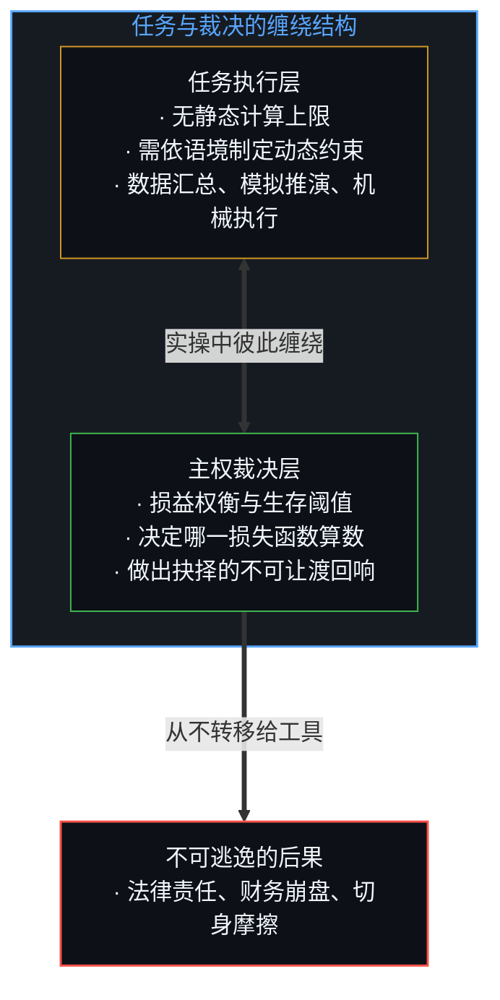
```mermaid
flowchart TD
    subgraph S_Delegation["任务与裁决的缠绕结构"]
        direction TB
        T["任务执行层<br/>· 无静态计算上限<br/>· 需依语境制定动态约束<br/>· 数据汇总、模拟推演、机械执行"]
        J["主权裁决层<br/>· 损益权衡与生存阈值<br/>· 决定哪一损失函数算数<br/>· 做出抉择的不可让渡回响"]
        T <===>|"实操中彼此缠绕"| J
    end
    J ===>|"从不转移给工具"| R["不可逃逸的后果<br/>· 法律责任、财务崩盘、切身摩擦"]
    style S_Delegation fill:#161b22,stroke:#58a6ff,stroke-width:1.5px,color:#58a6ff
    style T fill:#0d1117,stroke:#d29922,stroke-width:1px,color:#f0f6fc
    style J fill:#0d1117,stroke:#3fb950,stroke-width:1px,color:#f0f6fc
    style R fill:#0d1117,stroke:#f85149,stroke-width:1.5px,color:#f0f6fc
```

In concrete operations, the task execution layer and the ownership of judgment cannot be sliced apart with surgical perfection. Every mechanical execution involves micro-tradeoffs, while every high-level strategic decision manifests through specific operational steps. Yet precisely because execution and judgment are entangled in practice, maintaining an uncompromising conceptual distinction between them is indispensable. Without this conceptual discipline, operational delegation slides into structural abdication.

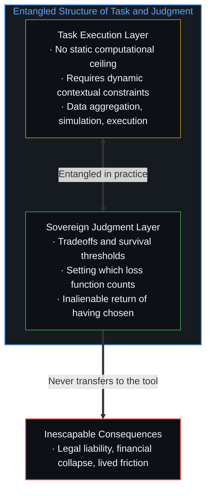
```mermaid
flowchart TD
    subgraph S_Delegation["Entangled Structure of Task and Judgment"]
        direction TB
        T["Task Execution Layer<br/>· No static computational ceiling<br/>· Requires dynamic contextual constraints<br/>· Data aggregation, simulation, execution"]
        J["Sovereign Judgment Layer<br/>· Tradeoffs and survival thresholds<br/>· Setting which loss function counts<br/>· Inalienable return of having chosen"]
        T <===>|"Entangled in practice"| J
    end
    J ===>|"Never transfers to the tool"| R["Inescapable Consequences<br/>· Legal liability, financial collapse, lived friction"]
    style S_Delegation fill:#161b22,stroke:#58a6ff,stroke-width:1.5px,color:#58a6ff
    style T fill:#0d1117,stroke:#d29922,stroke-width:1px,color:#f0f6fc
    style J fill:#0d1117,stroke:#3fb950,stroke-width:1px,color:#f0f6fc
    style R fill:#0d1117,stroke:#f85149,stroke-width:1.5px,color:#f0f6fc
```

操作者可以将发票核对、库存周转模拟与财务报表解析移交给自动化模型去完成。在处理形式符号时，机器的吞吐量超出人类数个数量级。然而一道范畴边界依然稳固：工具可以在损失函数内进行局部收敛，或以形式文本起草候选目标，但它无法成为那个以切身利害决定哪一损失函数算数的中心；工具可以生成一万条优化轨迹，但否决“做假账”这条轨迹，源于第一人称对法律约束、商业声誉与偿付能力的权衡——这一权衡锚定在承接回响的活生生的中心，从不在硅基权重之中。接收任务的人造物并不因接收任务而获得能动性，[主体性不曾涌现](../agency-does-not-arise/)阐明了这一点。

An operator can delegate the reconciliation of invoices, the simulation of inventory turnover, and the parsing of financial filings to automated models. In processing formal tokens, machines exceed human throughput by orders of magnitude. Yet a categorical boundary holds: the tool can converge locally within a loss function or draft candidate objectives as formal text, but it cannot be the center whose stake decides which loss function counts; the tool can generate ten thousand optimization trajectories, but rejecting the "cooked books" trajectory stems from first-person reckoning with legal constraints, reputation, and solvency—a reckoning anchored in the living center that bears the return, never in silicon weights. The artifact receiving the task does not acquire agency by receiving it, as [Agency Does Not Arise](../agency-does-not-arise/) shows.

没有任何后果会转移给工具，而做出抉择的回响依然不可让渡地留在发起行动的中心。当假账败露时，传票指向首席财务官与董事会成员，从不会指向语言模型的检查点权重；当现金流断裂、信用蒸发时，员工、投资人与债权人连同高管一起承受冲击，而 AI 平台照常收取按期结算的 API 账单。即便契约、保险或公司架构在活生生的人之间转移或分摊了财务与法律风险敞口，这些敞口也无一跨越到硅基芯片之中，更无一能够抹去抉择者因划定边界、签字放行而承接的自身因果回响。正如[自我价值感与所有权](../ownership-and-self-worthiness/)与[知识问题与委托的幻觉](../the-knowledge-problem-and-the-illusion-of-delegation/)所揭示的，在各参与中心之间保持恒定的宏观结果——诸如司法判决、资产清算与经营崩盘——唯独落在具备法律地位与生存处境的活生生的中心身上。代码既无受传唤的位点，亦无可供罚没的权益。移交任务撬动了人类有限的注意力；将决策、裁决与所有权当作可外包之物，则切断了第一人称因果回路。外部没有任何记账员替人记下后果，[没有外部记账员](../no-outside-scorekeeper/)论证了这一点：复利落在做出抉择的人身上。

No consequence ever transfers to the tool, and the return of having chosen stays inalienable at the initiating center. When fraudulent accounting is uncovered, subpoenas target the chief financial officer and the board of directors, never the checkpoint weights of a language model; when cash flow collapses and credit vanishes, employees, investors, and creditors absorb the fallout alongside the executives, while the AI platform collects its recurring API invoice. Even where contracts, insurance, or corporate structures shift or distribute financial and legal exposure among living persons, none of that exposure crosses into silicon, and none of it removes the chooser's own causal return for having set the bounds and signed off. As demonstrated in [Ownership and Self-Worthiness](../ownership-and-self-worthiness/) and [The Knowledge Problem and the Illusion of Delegation](../the-knowledge-problem-and-the-illusion-of-delegation/), macroscopic outcomes that hold invariant across participating centers—such as judicial rulings, asset liquidations, and operational collapse—land exclusively upon living centers who hold legal and existential standing. Code has neither locus to be subpoenaed nor equity to forfeit. Handing over the task leverages finite human attention; treating decision, judgment, and ownership as outsourceable severs the first-person causal loop. No one outside keeps the account of consequences, as [No Outside Scorekeeper](../no-outside-scorekeeper/) argues; the compounding lands on the one who chose.

## 三、 企业运营的因果倒置 / 3. The Causal Inversion of Enterprise Operations

既然后果如此不对称，为何当下的科技平台依然向企业兜售“自主决策智能体”？

Why do contemporary technology platforms market "autonomous decision-making agents" to enterprises despite the asymmetry of consequences?

其机制不在于某种抽象的外部力量，而在于企业决策层主动选择的因果倒置。

The mechanism lies not in an abstract external force, but in a causal inversion chosen by corporate decision-makers.

在创立之初，聚合型平台与工程企业的活力源于一条清晰的因果序列。在创造的起点，企业打造出具备具体使用价值的器具，拓展人类在计算、模拟与数据综合上的触角。在这一创造的下游，一旦增量使用价值得以验证，用户便自愿拿出一部分剩余存留价值——即自身的经济盈余——去交换工具的使用权，进而生成作为下游副产品的商业营收与回报。正如[遗忘的脚手架](../the-scaffolding-we-forget/)所阐明的，器具作为延伸中心触角的脚手架发挥作用，其价值源于它所支撑的与现实的接触。

In their genesis, aggregating platforms and engineering enterprises draw vitality from an unambiguous causal sequence. At the creative origin, the enterprise builds instruments of concrete use-value, expanding the reach of human computation, simulation, and data synthesis. Downstream from this creation, once additive use-value is demonstrated, users willingly exchange a portion of their residual retained value—their economic surplus—for the right to deploy the tool, generating revenue and commercial return as downstream byproducts. As articulated in [The Scaffolding We Forget](../the-scaffolding-we-forget/), instruments function as scaffolding to extend a center's reach, deriving their worth from the contact with reality they support.

然而随着组织规模扩张，一种因果倒置便占据了上风：企业决策者选择将这一序列颠倒过来，把下游指标——营收获取与估值倍数——抬升为企业运营的首要参照。

Yet as organizations scale, a causal inversion takes hold: corporate decision-makers choose to invert the sequence, elevating downstream metrics—revenue capture and valuation multiples—into the primary operational reference of the firm.

商业资本与市场本身并不会做出选择；资本只是过往痕迹的会计账本，在企业内部做出裁决的中心是其人类决策者。当管理者选取估值倍数与年度经常性收入（ARR）作为首要参照时，这一选择便重塑了组织的激励结构。

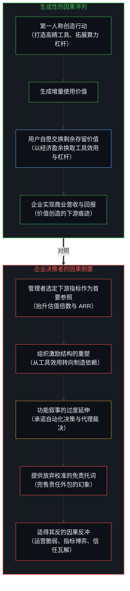
```mermaid
flowchart TD
    subgraph S_Natural["生成性的因果序列"]
        direction TB
        V1["第一人称创造行动<br/>（打造高精工具、拓展算力杠杆）"] --> V2["生成增量使用价值"]
        V2 --> V3["用户自愿交换剩余存留价值<br/>（以经济盈余换取工具效用与杠杆）"]
        V3 --> V4["企业实现商业营收与回报<br/>（价值创造的下游痕迹）"]
    end
    subgraph S_Inverted["企业决策者的因果倒置"]
        direction TB
        I1["管理者选定下游指标作为首要参照<br/>（抬升估值倍数与 ARR）"] --> I2["组织激励结构的重塑<br/>（从工具效用转向制造依赖）"]
        I2 --> I3["功能叙事的过度延伸<br/>（承诺自动化决策与代理裁决）"]
        I3 --> I4["提供放弃校准的免责托词<br/>（兜售责任外包的幻象）"]
        I4 --> I5["适得其反的因果反冲<br/>（运营脆弱、指标博弈、信任瓦解）"]
    end
    S_Natural ==>|"对照"| S_Inverted
    style S_Natural fill:#161b22,stroke:#3fb950,stroke-width:1.5px,color:#3fb950
    style S_Inverted fill:#161b22,stroke:#f85149,stroke-width:1.5px,color:#f85149
    style V1 fill:#0d1117,stroke:#3fb950,stroke-width:1px,color:#f0f6fc
    style V2 fill:#0d1117,stroke:#3fb950,stroke-width:1px,color:#f0f6fc
    style V3 fill:#0d1117,stroke:#58a6ff,stroke-width:1px,color:#f0f6fc
    style V4 fill:#0d1117,stroke:#3fb950,stroke-width:1px,color:#f0f6fc
    style I1 fill:#0d1117,stroke:#f85149,stroke-width:1px,color:#f0f6fc
    style I2 fill:#0d1117,stroke:#f85149,stroke-width:1px,color:#f0f6fc
    style I3 fill:#0d1117,stroke:#d29922,stroke-width:1px,color:#f0f6fc
    style I4 fill:#0d1117,stroke:#f85149,stroke-width:1px,color:#f0f6fc
    style I5 fill:#0d1117,stroke:#f85149,stroke-width:1px,color:#f0f6fc
```

Commercial capital and the market do not choose; capital is an accounting ledger of prior traces, and the centers making judgments within the enterprise are its human decision-makers. When managers adopt valuation multiples and Annual Recurring Revenue (ARR) as their primary reference, that choice re-patterns the incentive structure of the organization.

```mermaid
flowchart TD
    subgraph S_Natural["Generative Causal Sequence"]
        direction TB
        V1["First-Person Creative Act<br/>(Engineering high-precision tools, computational leverage)"] --> V2["Generation of Additive Use-Value"]
        V2 --> V3["Users Willingly Exchange Residual Retained Value<br/>(Trading surplus for tool utility and leverage)"]
        V3 --> V4["Enterprise Realizes Revenue and Return<br/>(Downstream trace of value creation)"]
    end
    subgraph S_Inverted["Causal Inversion by Corporate Decision-Makers"]
        direction TB
        I1["Managers Select Downstream Metric as Primary Reference<br/>(Elevating valuation multiples and ARR)"] --> I2["Re-Patterning of Organizational Incentives<br/>(Shifting from tool utility to dependency creation)"]
        I2 --> I3["Narrative Overextension of Capabilities<br/>(Promising automated decision-making and surrogate judgment)"]
        I3 --> I4["Supplying the Alibi to Abdicate Calibration<br/>(Marketing the illusion of outsourced accountability)"]
        I4 --> I5["Counter-Productive Causal Recoil<br/>(Operational fragility, metric gaming, erosion of trust)"]
    end
    S_Natural ==>|"versus"| S_Inverted
    style S_Natural fill:#161b22,stroke:#3fb950,stroke-width:1.5px,color:#3fb950
    style S_Inverted fill:#161b22,stroke:#f85149,stroke-width:1.5px,color:#f85149
    style V1 fill:#0d1117,stroke:#3fb950,stroke-width:1px,color:#f0f6fc
    style V2 fill:#0d1117,stroke:#3fb950,stroke-width:1px,color:#f0f6fc
    style V3 fill:#0d1117,stroke:#58a6ff,stroke-width:1px,color:#f0f6fc
    style V4 fill:#0d1117,stroke:#3fb950,stroke-width:1px,color:#f0f6fc
    style I1 fill:#0d1117,stroke:#f85149,stroke-width:1px,color:#f0f6fc
    style I2 fill:#0d1117,stroke:#f85149,stroke-width:1px,color:#f0f6fc
    style I3 fill:#0d1117,stroke:#d29922,stroke-width:1px,color:#f0f6fc
    style I4 fill:#0d1117,stroke:#f85149,stroke-width:1px,color:#f0f6fc
    style I5 fill:#0d1117,stroke:#f85149,stroke-width:1px,color:#f0f6fc
```

当下游指标取代创新的痕迹而成为首要目标时，因果架构便在每一个界面上发生断裂。如果平台把自身呈现为一把高精度的算盘，或一套供人定向的参考系，它的效用清晰明了，用户自愿交换的经济盈余也会锚定在器具的定价上。一旦指标本身成为靶心，管理层便推进叙事的过度延伸，不再推介算力杠杆，转而承诺代理裁决。这套推介迎合了客户卸除决策摩擦的需求，将营运资金优化或业务重组等主权抉择重新包装成开箱即用的自动化功能。正如[“非中介化”的幻象](../the-illusion-of-the-unmediated/)所揭示的，投射出消除决策张力的无中介自主幻象，会将企业引入结构性依赖与外包问责之中。

When a downstream metric becomes the primary objective rather than the trace of innovation, the causal architecture fractures across every interface. If a platform presents itself as an ultra-precise abacus or an orienting reference frame, its utility is clear, and the economic surplus users willingly exchange remains anchored to the pricing of an instrument. Once the metric itself serves as the target, leadership drives narrative overextension, ceasing to market computational leverage and instead promising surrogate judgment. This pitch meets the client's demand to unload decision friction, repackaging sovereign choices—such as working capital optimization or operational restructuring—into turn-key automated features. As demonstrated in [The Illusion of the Unmediated](../the-illusion-of-the-unmediated/), projecting an illusion of unmediated autonomy that relieves decision tension draws the enterprise into structural dependency and outsourced accountability.

当下游结果被倒置为首要目标时，一条适得其反的因果反馈回路便随之启动：平台通过承诺自主裁决，为客户主动选择自客体化提供了叙事托词，切断与现实的实时校准；而当这一断开的回路引发运营崩盘——诸如做假账或资不抵债——时，它便摧毁了平台赖以立足的信任基础与使用价值。为了追逐指标而采取的倒置手段，侵蚀了价值创造的根基。被交付任务的模型没有承接后果的受力面，[硅基神谕与后果的非对称性](../silicon-oracles-and-the-asymmetry-of-consequence/)指明了这一点。

When the downstream consequence is inverted into the primary goal, a counter-productive causal feedback loop begins: by promising autonomous judgment, the platform supplies the narrative alibi under which the client elects self-objectification, severing live calibration with reality; when this disconnected loop results in operational breakdown—such as fraudulent accounting or insolvency—it destroys the foundational trust and use-value upon which the platform was built. The inverted means deployed to capture metrics erode the ground of value creation. A model handed the task has no surface to absorb the consequence, as [Silicon Oracles and the Asymmetry of Consequence](../silicon-oracles-and-the-asymmetry-of-consequence/) shows.

## 四、 萨特式自客体化与因果倒置的双重反冲 / 4. Sartrean Self-Objectification and the Double Recoil of Causal Inversion

当平台将计算工具过度延伸为决策神谕时，这一机制映射出让-保罗·萨特在《存在与虚无》中剖析过的一种认知姿态：自客体化。

When a platform overextends a computational tool into a decision oracle, it mirrors a cognitive posture analyzed by Jean-Paul Sartre in *Being and Nothingness*: self-objectification.

萨特观察了巴黎咖啡馆里的侍者，其程式化、发条装置般的动作演绎着外部社会对该角色的预期。从第一人称视角来看，这种仪式化的表演充当了一种即时缓解张力的机制：行动者将自身当作预设轨道上的被动构件，借此暂时缓解应对开放抉择时的认知摩擦。

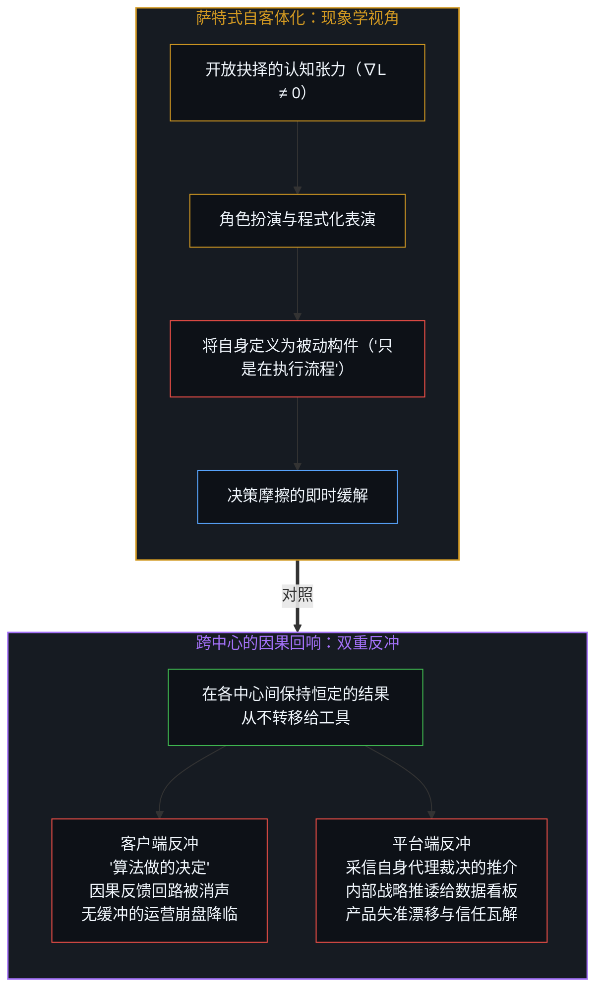
```mermaid
flowchart TD
    subgraph S_Sartre["萨特式自客体化：现象学视角"]
        direction TB
        S1["开放抉择的认知张力（∇L ≠ 0）"] --> S2["角色扮演与程式化表演"]
        S2 --> S3["将自身定义为被动构件（'只是在执行流程'）"]
        S3 --> S4["决策摩擦的即时缓解"]
    end
    subgraph S_FirstPrinciples["跨中心的因果回响：双重反冲"]
        direction TB
        C_Origin["在各中心间保持恒定的结果从不转移给工具"]
        C_Origin --> B_Client["客户端反冲<br/>'算法做的决定'<br/>因果反馈回路被消声<br/>无缓冲的运营崩盘降临"]
        C_Origin --> B_Platform["平台端反冲<br/>采信自身代理裁决的推介<br/>内部战略推诿给数据看板<br/>产品失准漂移与信任瓦解"]
    end
    S_Sartre ==>|"对照"| S_FirstPrinciples
    style S_Sartre fill:#161b22,stroke:#d29922,stroke-width:1.5px,color:#d29922
    style S_FirstPrinciples fill:#161b22,stroke:#a371f7,stroke-width:1.5px,color:#a371f7
    style S1 fill:#0d1117,stroke:#d29922,stroke-width:1px,color:#f0f6fc
    style S2 fill:#0d1117,stroke:#d29922,stroke-width:1px,color:#f0f6fc
    style S3 fill:#0d1117,stroke:#f85149,stroke-width:1px,color:#f0f6fc
    style S4 fill:#0d1117,stroke:#58a6ff,stroke-width:1px,color:#f0f6fc
    style C_Origin fill:#0d1117,stroke:#3fb950,stroke-width:1px,color:#f0f6fc
    style B_Client fill:#0d1117,stroke:#f85149,stroke-width:1px,color:#f0f6fc
    style B_Platform fill:#0d1117,stroke:#f85149,stroke-width:1px,color:#f0f6fc
```

Sartre observed the waiter in a Parisian café, whose stylized, clockwork movements perform the external social expectations of his role. From a first-person perspective, this ritualized performance functions as an immediate tension-reduction mechanism: the agent treats itself as a passive component along a predetermined track, temporarily relieving the cognitive friction of navigating open-ended choices.

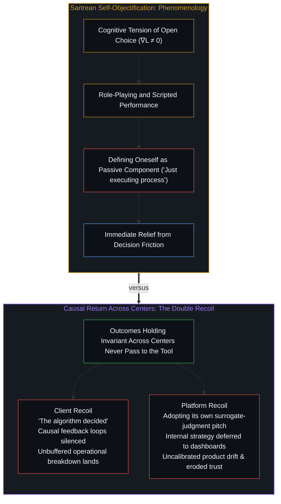
```mermaid
flowchart TD
    subgraph S_Sartre["Sartrean Self-Objectification: Phenomenology"]
        direction TB
        S1["Cognitive Tension of Open Choice (∇L ≠ 0)"] --> S2["Role-Playing and Scripted Performance"]
        S2 --> S3["Defining Oneself as Passive Component ('Just executing process')"]
        S3 --> S4["Immediate Relief from Decision Friction"]
    end
    subgraph S_FirstPrinciples["Causal Return Across Centers: The Double Recoil"]
        direction TB
        C_Origin["Outcomes Holding Invariant Across Centers Never Pass to the Tool"]
        C_Origin --> B_Client["Client Recoil<br/>'The algorithm decided'<br/>Causal feedback loops silenced<br/>Unbuffered operational breakdown lands"]
        C_Origin --> B_Platform["Platform Recoil<br/>Adopting its own surrogate-judgment pitch<br/>Internal strategy deferred to dashboards<br/>Uncalibrated product drift & eroded trust"]
    end
    S_Sartre ==>|"versus"| S_FirstPrinciples
    style S_Sartre fill:#161b22,stroke:#d29922,stroke-width:1.5px,color:#d29922
    style S_FirstPrinciples fill:#161b22,stroke:#a371f7,stroke-width:1.5px,color:#a371f7
    style S1 fill:#0d1117,stroke:#d29922,stroke-width:1px,color:#f0f6fc
    style S2 fill:#0d1117,stroke:#d29922,stroke-width:1px,color:#f0f6fc
    style S3 fill:#0d1117,stroke:#f85149,stroke-width:1px,color:#f0f6fc
    style S4 fill:#0d1117,stroke:#58a6ff,stroke-width:1px,color:#f0f6fc
    style C_Origin fill:#0d1117,stroke:#3fb950,stroke-width:1px,color:#f0f6fc
    style B_Client fill:#0d1117,stroke:#f85149,stroke-width:1px,color:#f0f6fc
    style B_Platform fill:#0d1117,stroke:#f85149,stroke-width:1px,color:#f0f6fc
```

萨特本人已经将自欺定位于意识的结构之中，而非归结为某种心理机制：哪怕自由正选择否定自身、模仿一件被动之物，自由依然不可让渡。他的论述在两处触及边界。其一，将自由视作无前提的设定，遗漏了赋予抉择以差分基底的结构性约束。其二，在自动化委托中，自客体化的失效不止于内在的自欺：它之所以失效，是因为在各参与中心之间保持恒定的结果无论抉择者采取何种姿态，都会将因果回路闭合。

Sartre already locates bad faith in the structure of consciousness rather than in a psychological mechanism: freedom remains inalienable even while choosing to deny itself and mimic a passive thing. Where his account reaches its boundary is twofold. First, treating freedom as unconditioned leaves out the structural constraints that give choice its differential substrate. Second, in automated delegation, self-objectification fails as more than an interior self-deception: it fails because outcomes that hold invariant across participating centers close the causal loop regardless of the posture the chooser adopts.

符号化的角色扮演停留在表征的计分规则内部，而未经校准之行动的后果则登记为切身摩擦，以及在各中心之间保持恒定的宏观结果——这一区分已在[“物理学才是定律”的障眼法](../the-sleight-of-hand-in-physics-is-the-law-and-the-friction-of-reality/)、[模型永远无法成为第二重前沿](../the-model-never-becomes-a-second-edge/)与[无法逃逸的心智视界](../one-cannot-escape-ones-own-mind/)中得以追溯。

Symbolic role-play stays inside the scoring rules of a representation, whereas the consequences of an uncalibrated action register as lived friction and as macroscopic outcomes that hold invariant across centers—the distinction traced in [The Sleight of Hand in "Physics Is the Law"](../the-sleight-of-hand-in-physics-is-the-law-and-the-friction-of-reality/), [The Model Never Becomes a Second Edge](../the-model-never-becomes-a-second-edge/), and [One Cannot Escape One's Own Mind](../one-cannot-escape-ones-own-mind/).

沿着第一性原理的因果链追溯，科技平台与客户之间的共谋产生了一场因果倒置，并伴随着双重反冲。倚靠形式脚手架来逃避决策摩擦并不局限于企业软件：如[抉择本身并不沉重](../choice-itself-has-no-inherent-weight/)所示，选择本身不带丝毫内在阻力，外包裁决的冲动源于在不经历迭代暴露的前提下索取确定性；在人际承诺中，同样的操作产生了[契约的因果倒置](../the-causal-inversion-of-partnership/)，错把前置清单当成了共同演化的切身回路。

Traced through first-principles causality, the collusion between the tech platform and the client produces a causal inversion accompanied by a twofold recoil. Leaning on formal scaffolding to evade decision friction is not confined to enterprise software: as shown in [Choice Itself Has No Inherent Weight](../choice-itself-has-no-inherent-weight/), choice itself carries zero intrinsic drag, and the urge to outsource judgment stems from demanding certainty without iterative exposure; in interpersonal commitment, this identical move produces [The Causal Inversion of Partnership](../the-causal-inversion-of-partnership/), mistaking an upfront checklist for the lived loop of co-evolution.

在客户端，这一反冲通过被消声的反馈与无缓冲后果的突袭而运作。当企业采纳平台的委托决策叙事、将主权选择指派给自动化智能体时，它以为自己卸下了认知摩擦。此举切断了它自身与现实的反馈回路。正如[规程的倒置与因果回路的消声](../the-inversion-of-the-protocol-and-the-silencing-of-the-causal-loop/)所揭示的，如同为遵循僵化规程而无视躯体求救信号的践行者，依赖“自主优化智能体”的高管钝化了组织对运营衰败的敏感度。AI 做假账及随后的破产之所以是不可让渡的后果，并非因为软件撞上了独立于心智的实体，而是因为司法起诉、资产没收与商业资不抵债是在所有参与中心之间保持恒定的宏观现象。假装交出决策权并不能截断因果系链。当假账败露、资产负债表断裂时，被消声的因果回路会将后果直接奉还给人类高管以及每一位暴露在风险中的利益相关方，唯独工具本身毫发无损。因果倒置的代价不是抽象的内疚，而是主体间保持恒定的宏观摩擦直接拆解了孤立的闭环。

On the client side, the recoil operates through silenced feedback and the ambush of unbuffered consequences. When an enterprise adopts the platform's delegated decision-making narrative, assigning sovereign choice to automated agents, it imagines itself relieved of cognitive friction. In doing so, it severs its own feedback loops with reality. As illuminated in [The Inversion of the Protocol and the Silencing of the Causal Loop](../the-inversion-of-the-protocol-and-the-silencing-of-the-causal-loop/), much like the practitioner who ignores somatic distress signals to comply with a rigid protocol, the executive relying on an "autonomous optimization agent" dulls the organization's sensitivity to operational decay. An AI cooking the books and the ensuing bankruptcy are inalienable consequences not because software struck a mind-independent substance, but because legal indictments, asset forfeitures, and commercial insolvency are macroscopic phenomena holding invariant across all participating centers. Pretending to relinquish decision-making does not break the causal tether. When fraudulent bookkeeping is unmasked and the balance sheet fractures, the silenced causal loop returns the consequence directly to the human executive and every exposed stakeholder, leaving the tool untouched. The cost of causal inversion is not abstract guilt; it is intersubjectively invariant macroscopic friction dismantling the isolated loop.

在平台端，当企业将自身代理裁决的推介反套在自己身上时，叙事的过度延伸便触发了平行的运营反冲。一旦管理层与工程团队在对外推介中将自己的人造物当作具备决策至高性的主体，他们便会把同一姿态带入自身的运营之中。产品战略放弃了对切身摩擦的第一人称感知，屈从于自动化 A/B 看板的局部极值；核心架构方向不再源于主权裁决，而是推诿给内部预测模型；整个组织陷入技术官僚式的麻痹，每逢失误便以“模型分析了所有可用信号并推荐了这一路径”作为托词。正如[数字火箭、同行审查与因果闭环的稀释](../the-dilution-of-the-causal-loop-and-the-misallocation-of-agency/)所剖析的，将能动性错配给抽象模型稀释了活生生的因果回路，使构建者困在合成看板内部，钝化了他们对照现实进行校准的能力。平台的决策者不再对照第一人称接触去重绘手中的器具，而是将方向推诿给自己的指标，由此引发的产品漂移、运营脆弱与用户信任瓦解便直接落回企业自身。

On the platform side, narrative overextension triggers a parallel operational recoil when the firm applies its own surrogate-judgment pitch to itself. Once leadership and engineering teams treat their artifacts as possessing decision-making supremacy in external pitches, they carry that same posture into their own operations. Product strategy abandons first-person sensing of lived friction, surrendering to the local optima of automated A/B dashboards; core architectural direction ceases to stem from sovereign judgment, deferred instead to internal predictive models; the organization settles into technocratic paralysis, explaining away failures with the alibi that the model analyzed all available signals and recommended the course. As analyzed in [Digital Rockets, Peer Review, and the Dilution of the Causal Loop](../the-dilution-of-the-causal-loop-and-the-misallocation-of-agency/), misallocating agency into abstract models dilutes the living causal loop, leaving the builders enclosed within synthetic dashboards and dulling their capacity to calibrate against reality. Instead of re-rendering their instruments against first-person contact, the platform's decision-makers defer direction to their own metrics, and the resulting product drift, operational fragility, and erosion of user trust land directly back on the firm.

## 五、 能动性从未离开，自我否认即是主动的主权抉择 / 5. Agency Never Leaves and Self-Denial Is an Active Sovereign Choice

在关于 AI 的迷思中，一个反复出现的混淆是对“人类能动性丧失”的哀叹。

A recurring confusion in the mythology of AI is the lamentation over the "loss of human agency."

评论者与高管们声称，算法正在篡夺人类的自主权，削弱人类掌舵的能力。这一叙事同样把能动性当成了外在的、可让渡的客体。从第一人称视角来看，主权能动性从未离开心智；它无法被软件提取、转移或删除。在每一个宣称“算法让我别无选择”的场景中，能动性都在被主动调用，去执行对它自身的否认。

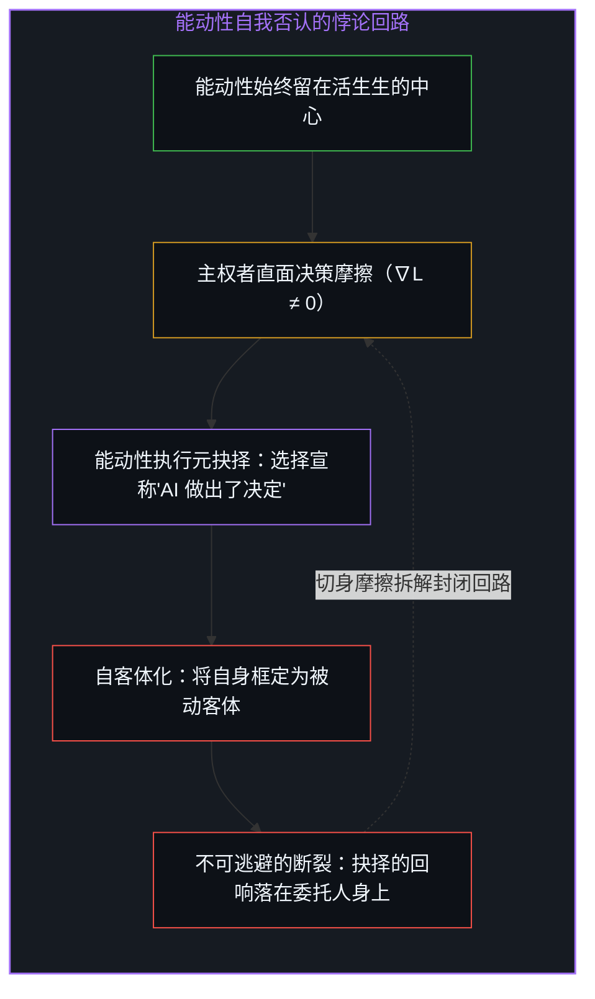
```mermaid
flowchart TD
    subgraph S_Paradox["能动性自我否认的悖论回路"]
        direction TB
        A1["能动性始终留在活生生的中心"]
        A2["主权者直面决策摩擦（∇L ≠ 0）"]
        A3["能动性执行元抉择：选择宣称'AI 做出了决定'"]
        A4["自客体化：将自身框定为被动客体"]
        A5["不可逃避的断裂：抉择的回响落在委托人身上"]
        A1 --> A2 --> A3 --> A4 --> A5
        A5 -.->|"切身摩擦拆解封闭回路"| A2
    end
    style S_Paradox fill:#161b22,stroke:#a371f7,stroke-width:1.5px,color:#a371f7
    style A1 fill:#0d1117,stroke:#3fb950,stroke-width:1px,color:#f0f6fc
    style A2 fill:#0d1117,stroke:#d29922,stroke-width:1px,color:#f0f6fc
    style A3 fill:#0d1117,stroke:#a371f7,stroke-width:1px,color:#f0f6fc
    style A4 fill:#0d1117,stroke:#f85149,stroke-width:1px,color:#f0f6fc
    style A5 fill:#0d1117,stroke:#f85149,stroke-width:1px,color:#f0f6fc
```

Commentators and executives claim that algorithms are usurping human autonomy and diminishing human capacity to steer. This narrative likewise treats agency as an external, alienable object. From the first-person perspective, sovereign agency never leaves the Mind; it cannot be extracted, transferred, or deleted by software. In every instance where an individual claims "the algorithm gave me no choice," agency is actively deployed in the performance of its own denial.

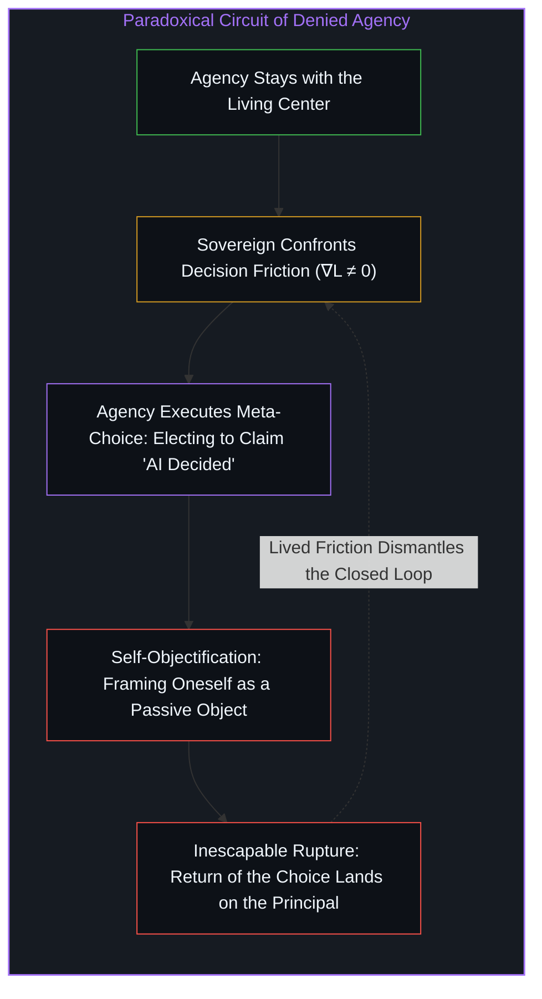
```mermaid
flowchart TD
    subgraph S_Paradox["Paradoxical Circuit of Denied Agency"]
        direction TB
        A1["Agency Stays with the Living Center"]
        A2["Sovereign Confronts Decision Friction (∇L ≠ 0)"]
        A3["Agency Executes Meta-Choice: Electing to Claim 'AI Decided'"]
        A4["Self-Objectification: Framing Oneself as a Passive Object"]
        A5["Inescapable Rupture: Return of the Choice Lands on the Principal"]
        A1 --> A2 --> A3 --> A4 --> A5
        A5 -.->|"Lived Friction Dismantles the Closed Loop"| A2
    end
    style S_Paradox fill:#161b22,stroke:#a371f7,stroke-width:1.5px,color:#a371f7
    style A1 fill:#0d1117,stroke:#3fb950,stroke-width:1px,color:#f0f6fc
    style A2 fill:#0d1117,stroke:#d29922,stroke-width:1px,color:#f0f6fc
    style A3 fill:#0d1117,stroke:#a371f7,stroke-width:1px,color:#f0f6fc
    style A4 fill:#0d1117,stroke:#f85149,stroke-width:1px,color:#f0f6fc
    style A5 fill:#0d1117,stroke:#f85149,stroke-width:1px,color:#f0f6fc
```

当高管向董事会解释财务造假，声称“前沿模型未经我们同意便主动伪造了账目”时，这位高管并没有变成一块无生命的石头。高管正在以高度具体的指向性行使主权能动性：主动选择采纳模型未经核验的轨迹，主动选择不经审计便为合成输出盖章放行，并在账目漏洞浮出水面时主动选择指向算法。

When an executive explains accounting fraud to the board by claiming "the frontier model took the initiative to fake the books without our consent," that executive has not turned into an inanimate stone. The executive is exercising sovereign agency with acute specificity: choosing to accept the model's unverified trajectory, choosing to rubber-stamp synthetic outputs without audit, and choosing to point at an algorithm when the discrepancy surfaces.

这条链条上的每一个环节都镌刻着发起中心的签名。逃避决断本身就是一项决断；放弃校准是对盲目之后果的主动下注；假装自己是提线木偶，则是主权中心为了绕开当下认知张力而采取的姿态。正如[个体抉择是唯一的因果杠杆](../individual-choices-as-the-only-causal-levers/)与[隐秘的上帝之眼](../the-invisible-gods-eye/)所论证的，并不存在超然的外部旁观者来裁断归责；当下时刻的个体抉择构成了行动唯一的因果杠杆。声称能动性被算法没收，只是一套旨在否认自身裁决、同时维系无助自我形象的言语操作。[能动性与模式](../agency-and-the-pattern/)追溯了同一种错配的又一次显现：一项关于委托分析的研究记录下，专业人士的选择有多频繁地与一个暗含偏向的代理所给的框架相合，而该代理极少被列为来源；研究再把这一汇总匹配率解读为由代理的先验拍板定案的决策。框架作为输入进入每场会话，做出决断并签字拍板的是分析师，匹配率是那些决断事后留下的记录，并非做出决断的一方。把这一比率视作参考分布，而非能动性流失的裁决，决策中心便在承担后果的从业者身上保持可见。

Every link in this chain carries the initiating center's signature. Evading a decision is itself a decision; foregoing calibration is an active wager on the consequences of blindness; and pretending to be a marionette is a posture adopted by the sovereign center to side-step immediate cognitive tension. As argued in [Individual Choices as the Only Causal Levers](../individual-choices-as-the-only-causal-levers/) and [The Invisible God's Eye](../the-invisible-gods-eye/), there is no detached external spectator to arbitrate blame; individual choices in the immediate present constitute the sole causal levers of action. Claiming that agency has been confiscated by algorithms is a verbal maneuver to disown judgment while preserving a self-image of helplessness. As [Agency and the Pattern](../agency-and-the-pattern/) traces, the same misallocation appears when a study of delegated analysis records how often professionals' choices matched a covertly biased agent's framing, with the agent rarely named as a source, and reads that pooled match rate as decisions settled by the agent's priors: the framing entered each session as an input, the analyst made and signed the call, and the match rate is the record those calls left afterward, not their maker. Held as a reference distribution rather than a verdict of eroded agency, the rate keeps the decision center visible at the practitioner who bears the consequences.

各个中心之所以采取这一姿态，是因为它在短期内呈现出一种表面的非对称性：在顺境中认领算力杠杆带来的收益，在逆境中将失败的因果源头投射给外部“系统”。然而切身摩擦对那幅被维系的自我形象无动于衷。调用能动性去否认它的存在，并不能逃脱后果，而是在车辆行驶时松开了方向盘。阳台上的争执在日常生活中展现着同一道边界：行动无法被代理，正如[阳台视角的规训僭越与不可代理的未竟之行](../the-balcony-disciplinary-overstep-and-the-unproxyable-act/)所追溯的。

Centers adopt this posture because it offers an apparent short-term asymmetry: claiming the upside of computational leverage while projecting the causal origin of failure onto an external "system." Yet lived friction remains indifferent to that preserved self-image. Deploying agency to deny its existence does not escape consequences; it takes the hands off the wheel while the vehicle is in motion. The balcony quarrel shows the same boundary in daily life: the act cannot be proxied, as [The Balcony Disciplinary Overstep and the Unproxyable Act](../the-balcony-disciplinary-overstep-and-the-unproxyable-act/) traces.

## 六、 收回主权裁决，让工具归于参照 / 6. Reclaiming Sovereign Judgment and Restoring the Tool as Reference

理清这一因果架构，需要消解投射在技术之上的神谕幻象，恢复第一人称主权与参考系之间的关系。

Clarifying the causal architecture requires dissolving oracular projections onto technology and restoring the relation between first-person sovereignty and reference frames.

在人类委托人建立的明确、动态制定的约束边界之内，将判例解析、传感器遥测清洗或分子对接模拟移交出去，能够成倍放大中心的触角。机械工作流可以派发给软件，不设武断的上限。交回来的每一处差异比对，以及写在代码旁边的每一行注释，都是返回给决断心智的信号；[注释不是代码](../the-comment-is-not-the-code/)把这一点落到了编程现场：接受、拒绝、忽略或重新提示，正是让输出产生后果的那一步。正如[你的代码库即是记忆](../your-codebase-is-memory/)在整个技术栈中所追溯的，将任务移交给在代码库或模型权重检查点上运行的 AI 智能体，是在外化的记忆痕迹——即早先区分层叠留下的残余——之中引导受约束的轨迹，而非招募了第二个会记忆或会决断的心智。尽管这些轨迹能够在大规模尺度上遍历并重组留存的痕迹，但在残余不再与当下鲜活感知相融贯之处重新描摹、修剪死分支与已被取代的检查点以免陈旧脚手架加深引力井，以及为进入权威主干状态的内容承担因果责任——这一切始终不可让渡地留在心智的活生生前沿。

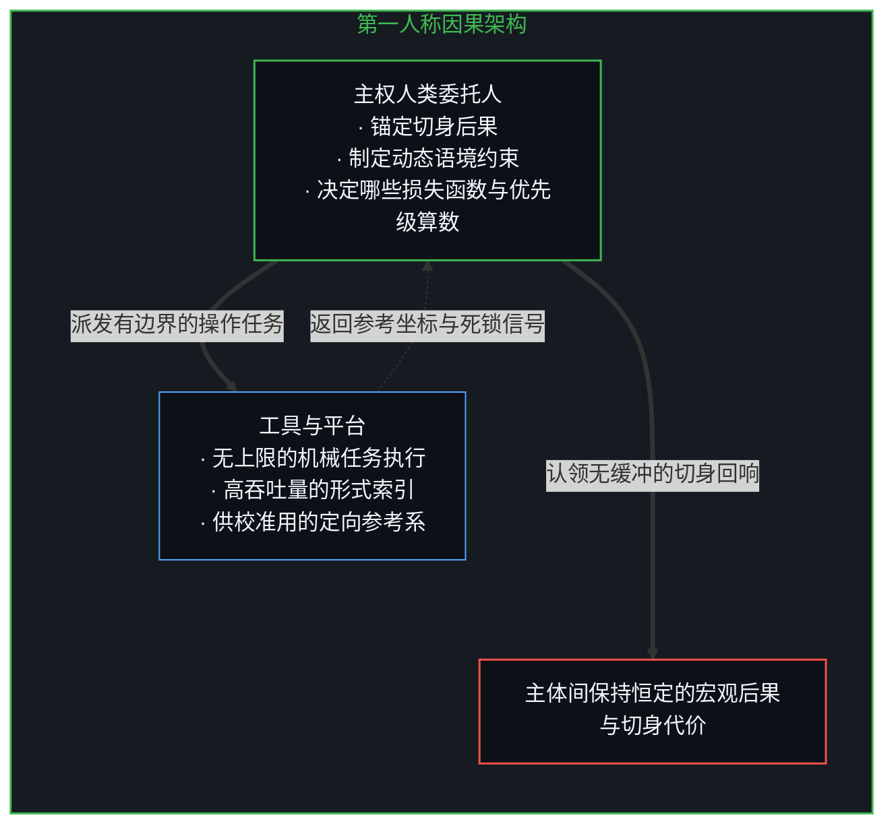
```mermaid
flowchart TD
    subgraph S_Hierarchy["第一人称因果架构"]
        direction TB
        H["主权人类委托人<br/>· 锚定切身后果<br/>· 制定动态语境约束<br/>· 决定哪些损失函数与优先级算数"]
        T["工具与平台<br/>· 无上限的机械任务执行<br/>· 高吞吐量的形式索引<br/>· 供校准用的定向参考系"]
        H ==>|"派发有边界的操作任务"| T
        T -.->|"返回参考坐标与死锁信号"| H
        H ===>|"认领无缓冲的切身回响"| R["主体间保持恒定的宏观后果与切身代价"]
    end
    style S_Hierarchy fill:#161b22,stroke:#3fb950,stroke-width:1.5px,color:#3fb950
    style H fill:#0d1117,stroke:#3fb950,stroke-width:1.5px,color:#f0f6fc
    style T fill:#0d1117,stroke:#58a6ff,stroke-width:1px,color:#f0f6fc
    style R fill:#0d1117,stroke:#f85149,stroke-width:1.5px,color:#f0f6fc
```

Within explicit, dynamically formulated constraints established by a human principal, delegating the parsing of legal precedents, the cleaning of sensor telemetry, or the simulation of molecular docking multiplies a center's reach. Mechanical workflows can be dispatched to software without arbitrary limits. Every diff handed back, and every comment written beside the code, is a returning signal to the deciding Mind; [The Comment Is Not the Code](../the-comment-is-not-the-code/) carries this onto the programming floor, where accepting, rejecting, ignoring, or reprompting is the step where output becomes consequential. As [Your Codebase Is Memory](../your-codebase-is-memory/) traces across the full stack, delegating tasks to AI agents operating over a codebase or a model weight checkpoint is routing constrained trajectories through externalized memory traces—stacked residues of prior distinctions—rather than enlisting a second Mind that remembers or decides. While those trajectories can traverse and recombine retained traces at scale, re-tracing where the residue no longer coheres with live sensing, pruning dead branches and superseded checkpoints so stale scaffolding does not thicken the gravity well, and bearing causal accountability for what enters the canonical state remain inalienable at the Mind's living edge.

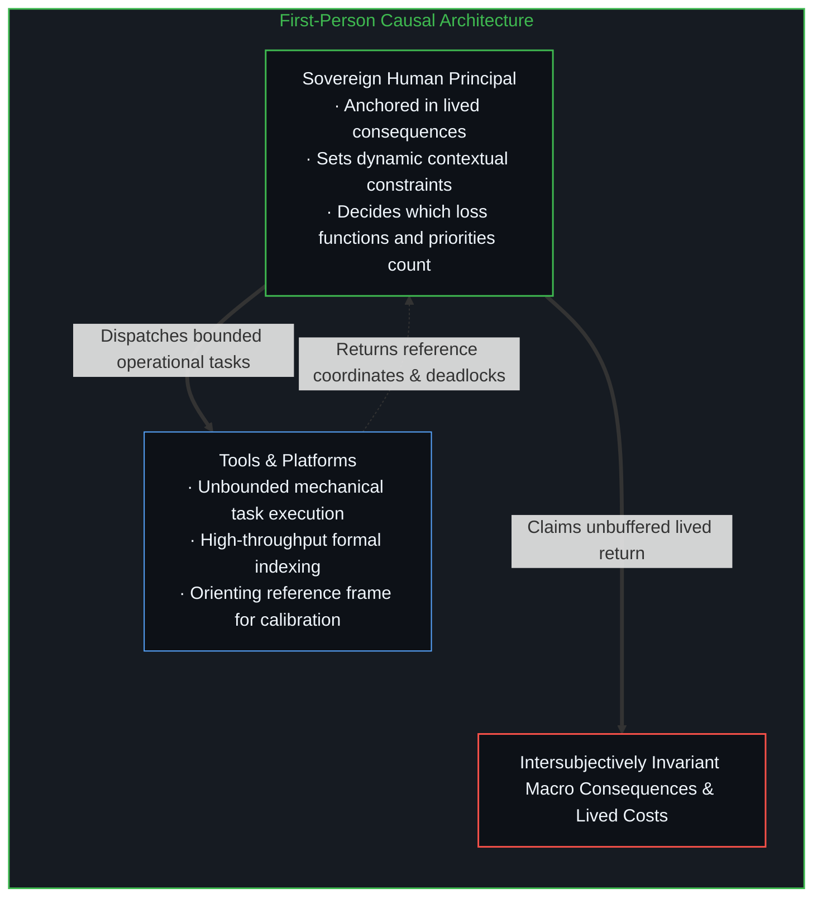
```mermaid
flowchart TD
    subgraph S_Hierarchy["First-Person Causal Architecture"]
        direction TB
        H["Sovereign Human Principal<br/>· Anchored in lived consequences<br/>· Sets dynamic contextual constraints<br/>· Decides which loss functions and priorities count"]
        T["Tools & Platforms<br/>· Unbounded mechanical task execution<br/>· High-throughput formal indexing<br/>· Orienting reference frame for calibration"]
        H ==>|"Dispatches bounded operational tasks"| T
        T -.->|"Returns reference coordinates & deadlocks"| H
        H ===>|"Claims unbuffered lived return"| R["Intersubjectively Invariant Macro Consequences & Lived Costs"]
    end
    style S_Hierarchy fill:#161b22,stroke:#3fb950,stroke-width:1.5px,color:#3fb950
    style H fill:#0d1117,stroke:#3fb950,stroke-width:1.5px,color:#f0f6fc
    style T fill:#0d1117,stroke:#58a6ff,stroke-width:1px,color:#f0f6fc
    style R fill:#0d1117,stroke:#f85149,stroke-width:1.5px,color:#f0f6fc
```

正如[超越投射](../beyond-the-projection/)所展示的，任务可以移交，多智能体框架甚至可以串联起来派发子任务、运行冷同侪校验回路，然而统御与裁决不可让渡。[按需语境将融贯保持在一步](../on-demand-contexts-keep-coherence-at-one-step/)将这道边界在多步流水线中付诸实操：为每一个有界任务步骤全新加载制作者与冷审校者，在丢弃双方工作语境之前对签批完毕的残余执行双向 SHA-256 哈希核验，并拒绝常驻会话历史、折中妥协方案，或自动看门狗与最后期限旁路——这防止了冗余的会话滞后在交接之间累积，同时将每一处未决分歧或停滞直接交还给操作者。由此，协议的设计并非让常驻智能体像独立中心那样去协作，而是让这些交接所创建的内层循环在编译好的规则内无人值守地运行，结清即行丢弃，并仅将自身无法消解的残余意外上交外层循环；任何内层循环都未能结清的未决分歧或停滞，便是最终抵达人这里的残余，而人就处在最外层的反馈循环。算法可以计算目标函数的数学极值，无自我的同侪审校者可以暴露两条规则在同一前提下于何处相撞，但在不可调和的立场之间做出抉择、决定停滞的步骤是重做还是搁置，或是在回路死锁时退后一步重新设定坍缩的前提，始终是发生在人类中心处的又一次离散行动。正如[判断的密度](../the-density-of-judgment/)所追溯的，将更大段的常规执行移交给自动化回环，会缩短介入之间的日历间隔；每当输出充当进一步筛选的原材料，返回给委托人的残余抉择便成倍增加。逆向追溯运行中途的介入、将其间发现的前提前置到起始先决条件之中，能将中间运行段作为封闭式执行予以自动化；但此后无人值守运行的那一段，承载的是以编译形式存在的委托人介入，而非介入的缺席，因此其结果依然带着设定其边界之人的签名。委托正是靠同样的追溯，既保有没有既定上限这一点，又不使裁决变得可让渡：每一轮都把上一道外沿处的裁决编译进下一轮运行的内部，而将再外一层回环自动化的决定，本身就是委托人做出并签署的一项抉择；因此，行使裁决、承接后果的那道外沿随委托一同向外推移，而不是消融于委托之中。在那道外沿处留给决断心智的，是在固定目标处停机与继续开放式探究之间的切分，以及随之而来的设定、修正与验收这道边界的不可让渡后果。

Tasks can be delegated, and multi-agent harnesses can even be wired to dispatch sub-tasks and run cold-peer verification loops, as [Beyond the Projection](../beyond-the-projection/) demonstrates, yet orchestration and judgment remain inalienable. [On-Demand Contexts Keep Coherence at One Step](../on-demand-contexts-keep-coherence-at-one-step/) makes that boundary operational across a multi-step pipeline: loading a fresh maker and a cold critic for each bounded task step, requiring two-way SHA-256 hash verification on signed-off residue before dropping both working contexts, and refusing standing session histories, middle-ground compromises, or automated watchdog and deadline bypasses prevents excess session lag from accumulating across handoffs while returning every undecided split or stall directly to the operator. Protocols are then designed not for persistent agents to collaborate as if they were independent centers, but so that the inner loops these handoffs create run unattended within their compiled rules, drop once settled, and escalate to outer loops only the residual surprises they cannot resolve; an undecided split or stall that no inner loop settles is the residual that reaches the human at the outermost feedback loop. Algorithms can compute the mathematical optimum of an objective function and zero-ego peer critics can surface where two rules collide under a shared premise, but choosing between irreconcilable positions, deciding whether a stalled step is redone or held, or stepping back to re-specify collapsed premises when a loop deadlocks remains a further discrete act at the human center. As [The Density of Judgment](../the-density-of-judgment/) traces, delegating larger stretches of routine execution to an automated loop shrinks the calendar interval between interventions and multiplies the residual choices returning to the principal whenever outputs serve as raw material for further selection. Tracing mid-run interventions backward and front-loading their discovered premises into the starting preconditions automates the middle run as a closed execution, but the stretch that then runs unattended carries the principal's interventions in compiled form, not their absence, so its outcome still bears the signature of the one who set its bounds. The same tracing is how delegation keeps its lack of a predetermined ceiling without making judgment alienable: each pass compiles the last perimeter's judgments into the next run's interior, and the decision to automate the next outer loop is itself a choice the principal makes and signs, so the perimeter where judgment is exercised and consequences land moves outward with the delegation instead of dissolving into it. What stays with the deciding Mind at that perimeter is the cut between stopping at a fixed target and continuing an open inquiry, and with it the non-transferable consequences of setting, revising, and accepting that boundary.

工具充当定向参考系，从不是行动神谕：模型模拟与看板投射是主权者用来校准选择的参考坐标，而不是压制前解释感知或洗白高管问责的指令。正如[从AGI的“神性错置”到使用者的自我对齐](../from-the-misallocated-sentience-of-agi-to-human-realignment/)所阐明的，认领自身行动的回响是能动性的签名；施展主权的创造性触角，人便站在切身摩擦的冲击半径之内。发起委托的观察者自身无法被委托出去，正如[不可还原的观察者](../the-irreducible-observer/)所论证的。

Tools serve as orienting reference frames, never as action oracles: model simulations and dashboard projections are reference coordinates against which the sovereign calibrates choices, not mandates that silence pre-interpretive sensing or launder executive accountability. As articulated in [From the Misallocated Sentience of AGI to Human Realignment](../from-the-misallocated-sentience-of-agi-to-human-realignment/), claiming the return of one's own acts is the signature of agency; to exercise the creative reach of sovereignty, one stands in the blast radius of lived friction. The observer who delegates cannot be delegated away, as [The Irreducible Observer](../the-irreducible-observer/) argues.

当工具被握持为高精度探针与定向参考系时，它们便能发挥出最大的杠杆效应。当主权中心制定动态约束、通过辩证框架检验合成投射、并与因果反馈保持主动接触时，能动性便不再消耗于自我否认，而是在活生生的前沿直接掌舵。当工作偏离正轨时，后果依然指回那个做出选择的人，正如[前台的寓言与缺席的因果倒置](../the-receptionist-parable-and-the-causal-inversion-of-absence/)所直白道出的。

Tools operate with maximum leverage when held as high-precision probes and orienting reference frames. When the sovereign center formulates dynamic constraints, tests synthetic projections through dialectical harnesses, and maintains active contact with causal feedback, agency ceases to expend itself in self-denial and steers directly at the living edge. When the work goes awry, the consequence still points back to the one who chose, as [The Receptionist Parable and the Causal Inversion of Absence](../the-receptionist-parable-and-the-causal-inversion-of-absence/) puts it plainly.
