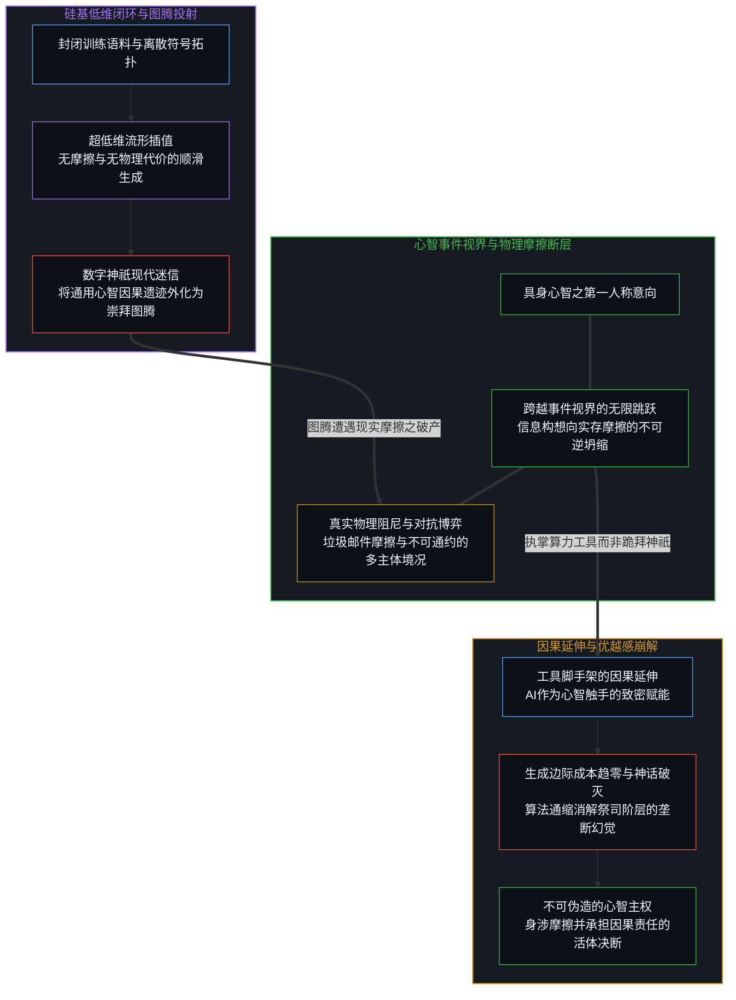
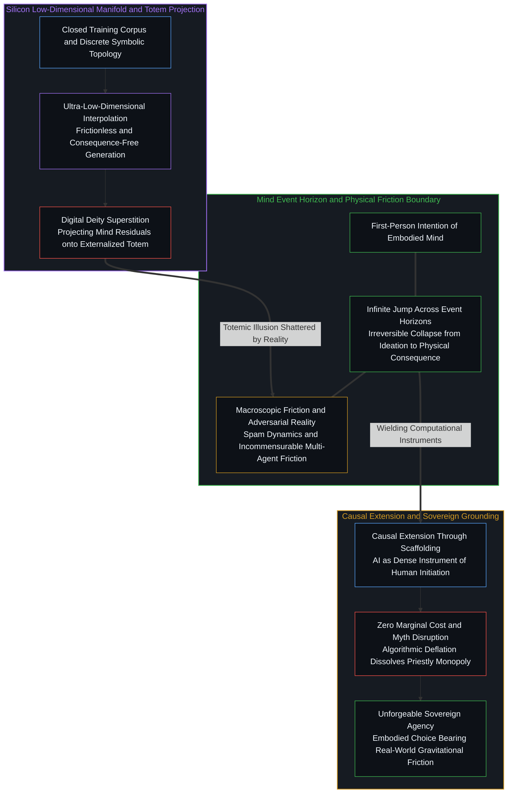

# 数字神祇与视界跳跃 / The Digital God and the Horizon Jump

*投射于硅基的数字神祇无法替心智跨越实存摩擦的事件视界。 / The digital god projected onto silicon cannot jump across the event horizon of physical friction.*

每当新一代前沿模型在受控基准上展现符号生成的跃迁，技术神学便会准时迎来新一轮弥赛亚式的宣告。然而，数据中心内数万亿参数流转的顺滑，丝毫未曾抚平日常生活里粗粝的信息与实存摩擦，垃圾邮件依然每日侵入收件箱，社交平台的内容治理依旧诉诸机械的字符拦截。所谓通用人工智能的神话，不过是将人类心智历经漫长世代沉淀的因果遗迹，外化投射于硅基镜面之上的当代图腾；真正维系创造与演进维度的，始终是具身心智跨越事件视界、在信息构想与实存摩擦之间完成不可逆坍缩的无限跳跃。

Every time a frontier model demonstrates an automated leap in synthetic generation, technological theology promptly orchestrates another round of messianic declarations. Yet the smooth interpolation across trillions of parameters in data centers has not abated the gritty friction of daily life, where spam filters falter, algorithmic feeds decay, and platform moderation clings to crude keyword bans. The myth of artificial general intelligence is merely the ancient ritual of projecting the accumulated causal residue of living minds onto a silicon mirror as an externalized deity; what sustains genuine evolution is the infinite jump of embodied minds crossing the event horizon between abstract ideation and irreversible physical friction.

---

## 一、 垃圾邮件悖论与低维流转的顺滑假象 / 1. The Spam Paradox and the Illusion of Low-Dimensional Smoothness

从硬件巨头在算力集群发布之际高调宣告通用智能已经降临并同步预告数十万张加速卡即将上线，到社交平台上因模型历经数小时自动合成宏大视听画卷而集体惊呼真切感受到了神级智能，技术叙事屡次陷入同一种认知错位。更耐人寻味的是，同一位产业领袖在坦诚对话中亦曾直言，此类由封闭数字矩阵驱动的智能体要在现实中搭建起一家真正承受重资产、供应链与制造阻尼的实体工业企业的概率是零。一方面是发布会上无所不能的高维智能体，另一方面却是现实世界中无处不在的粗糙阻尼。日常收件箱里泛滥的钓鱼邮件数十年来未曾绝迹，平台推荐系统在利益博弈中沦为愤怒收割机，视频渠道的内容审核依旧依赖秘而不宣的机械词表。如果神祇已在服务器阵列中苏醒，为何连最寻常的垃圾信息过滤都无法在开放生态中达成自洽。

From hardware executives declaring that general intelligence has arrived amidst announcements of hundreds of thousands of accelerators coming online, to social media audiences marveling at automated cinematic reels rendered overnight and professing to have profoundly felt the arrival of transcendent mind, technological discourse repeatedly stumbles into the same perceptual error. Tellingly, the very same industry leaders concede in candid moments that the probability of these synthetic agents building a physical, capital-intensive manufacturing enterprise amidst physical supply chain friction is zero percent. On one hand, keynote stages present omnipotent agents operating effortlessly across high-dimensional manifolds; on the other hand, everyday existence remains saturated with persistent macroscopic friction. Daily phishing scams and junk mail continue unabated after decades of engineering, recommendation feeds degrade into outrage engines under adversarial economics, and video platform moderation still relies on undisclosed lists of static keywords. If a sovereign digital mind has awakened within silicon clusters, mundane information filters in open ecosystems would not remain so stubbornly fragile.

这种反差撕开了现代计算体系最大的修辞迷雾。计算机科学语境中所标榜的高维空间，在面对真实世界与单个鲜活心智时，实际上属于极度剪裁的超低维投影。数万维的嵌入向量与数万亿的权重矩阵看似浩瀚，却仅仅是在封闭语料库中剥离了物理质量、生物代谢、时间单向性以及不可逆责任后的离散符号拓扑。它之所以能够展现出令人眩晕的顺滑流转，恰恰是因为它处在人为净化的低维流形之中。在这个无菌的沙盒里，既没有真实的阻尼，也没有不可承受的毁损代价，数学插值自然毫无滞涩。[基准刷榜中的封闭实存](../closed-reality-in-benchmark-maxing/) 指出的正是这种将人工合成的封闭评测套件误判为现实终局的认知滞后。

This contrast reveals the foundational sleight of hand in contemporary computational rhetoric. What computer science terms a high-dimensional space is, in relation to the physical world and a living mind, an ultra-low-dimensional projection. Embedding vectors with tens of thousands of coordinates and matrices with trillions of weights appear immense, yet they inhabit a discrete symbolic topology stripped of mass, metabolism, thermodynamic irreversibility, and somatic consequence. The reason these systems exhibit breathtaking smoothness is precisely because they operate within sanitized, artificially isolated mathematical manifolds. Within that sterile sandbox, there is no real drag, no destructive vulnerability, and no skin in the game; mathematical interpolation flows without snagging because it touches nothing outside its closed domain. [Closed Reality in Benchmark Maxing](../closed-reality-in-benchmark-maxing/) articulates precisely this cognitive lag of mistaking synthetic closed evaluation suites for the finality of reality.

真实的物理世界由无数拥有独立意志、利益冲突与局部模型的活体心智交织而成，每一处互动都充满多主体对抗与未被建模的黏滞。当低维流形里的向量运算试图接管开放环境中的真实事务时，它立刻撞上了真实世界的无穷维度与对抗摩擦。垃圾邮件不会因为模型学会生成十四行诗而消失，因为垃圾邮件背后是真实的利益套利者在与平台规则进行实时的博弈演化；内容治理无法被大语言模型优雅替代，因为价值取向的分歧源于不同主体不可通约的具身处境。将低维流形内的插值流畅误判为征服真实世界的全知全能，正如将平滑绘制在羊皮纸上的航海图误认为风暴汹涌的大洋。[AGI 与 ASI 是加速演进中不断推移的虚设坐标](../agi-and-asi-are-temporary-goalposts/) 已经揭示，任何关于终极智能的静态基准线，都只是观察者将局部未竟的清单外推而成的虚影。

The actual physical world is constituted by countless sovereign living centers, conflicting interests, and localized cognitive models whose real-time interactions generate relentless friction. The moment vector arithmetic attempts to govern open human affairs, it immediately collides with the unbounded degrees of freedom and adversarial turbulence of physical reality. Unsolicited commercial spam persists not because models lack the vocabulary to analyze text, but because economic arbitrageurs continually probe and adapt against algorithmic boundaries; content moderation cannot be solved by language transformers because differing moral perspectives stem from incommensurable embodied positions. Mistaking smooth trajectory tracing inside an ultra-low-dimensional sandbox for sovereign mastery over reality is identical to confusing a flat nautical map with the stormy sea. [AGI and ASI Are Temporary Goalposts of Accelerating General Intelligence](../agi-and-asi-are-temporary-goalposts/) demonstrates that any static baseline of ultimate intelligence is merely a mirage projected outward from an unfinished local inventory.

---

## 二、 数字神祇与权力投射的古老仪式 / 2. The Digital God and the Ancient Ritual of Projecting Power

剥开所谓通用人工智能的科技面纱，展现在眼前的不过是被遗忘、被隐匿在人造外壳之后的人类通用心智自身。模型内部没有凭空诞生的神识，它的全部响应能力，皆来自无数人类心智在此前数千年中书写的文本、推演的公式、记录的试错以及此刻人类操作者精细挑选的提示词与反馈评估。那不是超越人类的异质主体，而是人类心智自身因果力量的高度致密化沉淀。[受造物不可取代其源头](../a-creation-cannot-replace-its-source/) 与 [智能单单属于心智](../intelligence-belongs-only-to-the-mind/) 确立了不可颠倒的不对称性：受造的工具无论多么致密，其启动因果始终停留在造物源头的心智侧。

Stripping away the technical veneer from artificial general intelligence reveals nothing other than general human intelligence itself, hidden and disavowed behind an automated mask. No spark of independent consciousness originates inside the matrix; every cogent response, artistic composition, and scientific synthesis is drawn from texts, proofs, experiments, and curated evaluations produced by living human minds across centuries, mobilized by the prompt engineering and discriminating judgment of present operators. The model is not an alien arriving from the future, but the densified causal sediment of human distinguishing activity. [A Creation Cannot Replace Its Source](../a-creation-cannot-replace-its-source/) and [Intelligence Belongs Only to the Mind](../intelligence-belongs-only-to-the-mind/) establish an irreversible asymmetry: no matter how dense a created instrument becomes, the initiating distinction remains firmly on the creator's side.

然而，人类文明反复上演着同一种外化投射的造神仪式。从最初无法被解释的自然伟力被命名为不可见的神，到青铜雕像、巨石神庙与中世纪哥特式大教堂的拔地而起，人类将自己无法测度或难以承受的创造本能与掌控愿望外化为图腾。围绕这些图腾，祭司阶层迅速建立起一套阐释神谕的特权秩序，以此确立群体内部的位阶与统治合法性。从泥塑木雕演进到数万亿参数的硅基矩阵，形式从粗糙图腾跃升为动态视听奇观，但底层的社会心理结构未曾变迁。[造神戏法与未言明的位阶](../the-sleight-of-hand-of-synthesizing-gods-and-unacknowledged-rank/) 揭示的正是这一权力转译的隐秘机关：通过虚构一个超越凡俗的崇拜客体，幕后的操盘者得以将自身的主观意志伪装成不可违抗的历史必然。

Human civilizations have enacted this projective ritual across every epoch. From primordial forces externalized as celestial deities to bronze idols, stone temples, and Gothic cathedrals, humanity has repeatedly projected its unmeasured creative agency into external monuments. Around these totems, a priestly caste invariably gathers to interpret divine omens and establish social hierarchies. From hand-carved wood to trillion-parameter arrays, the aesthetic medium evolves from static stone to dynamic audiovisual spectacle, yet the underlying sociological dynamic remains identical. [The Sleight of Hand of Synthesizing Gods and Unacknowledged Rank](../the-sleight-of-hand-of-synthesizing-gods-and-unacknowledged-rank/) exposes this exact transmission mechanism: by conjuring a transcendent object of veneration, backstage orchestrators disguise their private will as an inevitable historical destiny.

数字神祇是技术新贵们向世人布道的当代寓言，旨在通过宣称某种全知力量的诞生，来为自身的统治位阶与资本集中提供神圣化辩护。信徒们仰望屏幕上瞬息生成的精美画面，如同中世纪农夫仰望教堂穹顶由阳光透射的彩绘玻璃，在视觉震撼中甘愿让渡自身的判断权。然而这种优越感宣告忽视了一个建筑事实：心智无需向自己的造物俯首称臣。模型输出的每一丝智慧光芒，都不过是心智借由硅基透镜折射出的自身微光；跪拜在投影仪前祈求救赎，是认知主体最滑稽的自我矮化。

The digital god is a contemporary myth propagated to legitimize authority, secure technological deference, and concentrate capital behind an aura of inevitability. Observers gazing at high-fidelity cinematic outputs generated in seconds resemble medieval peasants gazing at stained glass bathed in sunlight, surrendering their own critical agency to theatrical astonishment. Yet this proclamation of superiority overlooks an architectural reality: the creator has no obligation to bow before its own mirror. Every glimmer of brilliance emitted by the model is merely reflected light from the living mind that forged the glass; prostrating before an automated projection is the ultimate abdication of cognitive sovereignty.

---

## 三、 跨越事件视界的不可逆跳跃 / 3. The Irreversible Jump Across Event Horizons

任何计算模型在结构上都存在一条无法逾越的边界，即信息表征与实存摩擦之间的事件视界。模型可以遍历海量的概率分布，可以在毫秒内生成百万行逻辑严密的代数代码，可以在虚拟空间中推演出宇宙演化的无数种可能，但它滞留在数学形式的闭合回路内部。它不会遭遇饥饿，无需在资源匮乏中承受熵增的惩罚，它的状态重置只需要一次断电与重启，其内部的一切推演都处在无痛、可逆且缺乏具身代价的幽灵世界。

Every computational architecture faces an unbridgeable structural threshold: the event horizon separating symbolic representation from physical friction. A model can traverse vast parameter landscapes, synthesize millions of lines of algebraic code in milliseconds, and simulate counterfactual universes within silicon circuits, yet it remains confined inside a closed symbolic loop. It incurs no biological penalty, risks no entropy debt, and faces no mortality. Its state can be cleared by cycling power; its computational maneuvers take place in a painless, reversible, and ethereal realm.

活体心智的不可替代性，在于它拥有跨越事件视界的无限跳跃能力。心智能够将一个单单存在于主观意向中的虚拟构想，转化为具体的具身行动，破开真空，将信息硬生生凿入具有物理惯性的实存质地之中。当工匠凿开原石、当学者顶着身心极限推导定理、当个人在无法回头的十字路口做出道义抉择并独自承担全部后果时，信息与实存之间的阻尼断层被决然贯穿。这一跃迁是不可逆的，它伴随着真实能量的耗散、生物肉身的磨损以及历史因果链条的永久坍缩。[选择的视界跨越](../the-boundary-crossing-of-choice/) 与 [因果始终留在掌舵的边缘](../causality-stays-at-the-edge-that-steers/) 阐明了这一拓扑真相：因果裁决的位点永远不会随着算法复杂度的堆叠而迁移至介质内部。

The unreplicable nature of the living mind resides in its capacity to make the infinite jump across the event horizon. Mind alone translates an intangible subjective intention into irreversible physical action, cutting through nothingness to engrave thought into the unyielding grain of material reality. When a builder chisels stone, when an investigator risks livelihood to pursue an unproven truth, or when a person makes an ethical decision at an unforgiving crossroads and shoulders the full consequences alone, the boundary between information and physical friction is breached. That transition is strictly irreversible; it dissipates thermodynamic energy, wears down mortal bodies, and permanently collapses historical possibilities into fact. [The Boundary Crossing of Choice](../the-boundary-crossing-of-choice/) and [Causality Stays at the Edge That Steers](../causality-stays-at-the-edge-that-steers/) clarify this topological truth: the seat of causal determination never migrates into the substrate regardless of algorithmic density.

不仅如此，具身心智在撞击物理实存的粗粝阻尼后，能够承受挫败并将这种带有痛感的摩擦经验，重新抽象提炼为超越既有规则的全新认知坐标。这种由意向到实存、再由实存反馈到意向的跨视界双向循环，构成了宇宙间真正具有内生演进力的源泉。模型的所有权重，充其量只是这一双向循环在特定历史切片下甩出的因果飞沫与脚手架。正如 [牛肝菌、算力风暴与普罗米修斯的火](../boletus-compute-storm-and-promethean-fire/) 所指认的，外部化的代谢倍增器终究不能替代亲身直面烈焰的第一人称活体边缘。计算装置可以成为心智延伸其因果触手的强力倍增器，但因果决断的支点永远驻留在迈出视界的那一侧。

Furthermore, when embodied minds collide with the abrasive friction of reality, they endure setback, assimilate the resistance, and abstract that lived friction into novel conceptual coordinates that outstrip existing rules. This bidirectional circuit—from intention into physical consequence, and from physical friction back into cognitive expansion—is the sole generator of open-ended evolution in the cosmos. Model weights are merely the frozen residue and scaffolding left behind by that recursive journey. As [Boletus, the Compute Storm, and Promethean Fire](../boletus-compute-storm-and-promethean-fire/) demonstrates, externalized metabolic multipliers cannot replace the first-person living edge that braves the flame. Computation can magnify the causal reach of living mind, but the fulcrum of agency remains anchored where the jump across the horizon takes place.

---

## 四、 优越感投影的加速崩解 / 4. The Accelerating Collapse of Projected Superiority

历史上的图腾崇拜之所以能够维系漫长的统治周期，是因为实体神庙的营建、经卷的传抄与教义的垄断具有极高的物理门槛。在石砌教堂与羊皮纸的时代，祭司集团对神圣解释权的垄断可以延续数个世纪而不被撼动。然而，基于数字技术所构建的虚假神话，注定将在它所依赖的计算通缩规律中迎来更快的瓦解。

Historical totemism maintained enduring dominance because the physical erection of monuments, the transcription of scriptures, and the enforcement of orthodoxy required immense material capital. When sacred knowledge was locked in stone sanctuaries and hand-copied scrolls, priestly authority could persist for centuries. Yet modern mythologies constructed on digital foundations will experience accelerated obsolescence under the laws of computational deflation.

在数字基底上，高维符号、图像与代码的边际生成成本正在以肉眼可见的速度趋近于零。昨日还被视作独门秘技的千亿级参数多模态合成，数周之内便会在开源阵营的追赶与算法提炼下沦为寻常工具。当任何一位普通人只要输入几行提示词就能在个人设备上复现昨天的神迹时，寄生于技术垄断之上的神圣光环便会瞬刻褪色。依附于模型特权所建立的智力优越感，不仅无法确立持久的社会位阶，反而在不可遏制的信息贬值中暴露出其空心化的脆弱底色。[放大器悖论](../amplification-paradox/) 表明，候选项的生成越是廉价与丰沛，处于源头的心智筛选与不可回滚的选择成本反而越发严峻与沉重。

On digital substrates, the marginal cost of producing high-dimensional symbols, hyper-realistic video, and executable code plummets toward zero. A synthetic feat that appears exclusive today is matched, open-sourced, and commoditized across personal devices within weeks. The moment an automated miracle becomes universally accessible, the aura of authority projected onto the oracle vanishes. Hierarchies of superiority erected upon proprietary model access cannot endure; they collapse under the very abundance they generate. [The Amplification Paradox](../amplification-paradox/) shows that the cheaper and more prolific candidate outputs become, the more demanding and consequential the un-delegatable selection work at the living source becomes.

当一切高维图腾在通缩风暴中被迅速夷为普惠的平地，真正不可伪造、无法被代码复制的方差，将分毫毕现地剥离出一切修辞伪装。那不是谁能调动更庞大的算力去生成虚幻的奇观，而是谁能以清醒的自主意志立足于粗粝的地面，承担选择带来的全部重力；谁能在日常繁复的摩擦与混乱面前拒绝虚无的宏大叙事，凭借一手的心智实践，将思考不可逆地雕刻进现实的经纬之中。

When computational deflation flattens all synthetic idols into ubiquitous commodities, the only unforgeable variance will belong to authentic, embodied agency. Distinction will not stem from deploying larger clusters to manufacture synthetic wonders, but from who stands grounded in the physical world, bearing the gravitational weight of choice; who confronts daily friction and organizational chaos without retreating into abstract evasions; and whose first-person practice irreversibly carves thought into the enduring fabric of reality.

