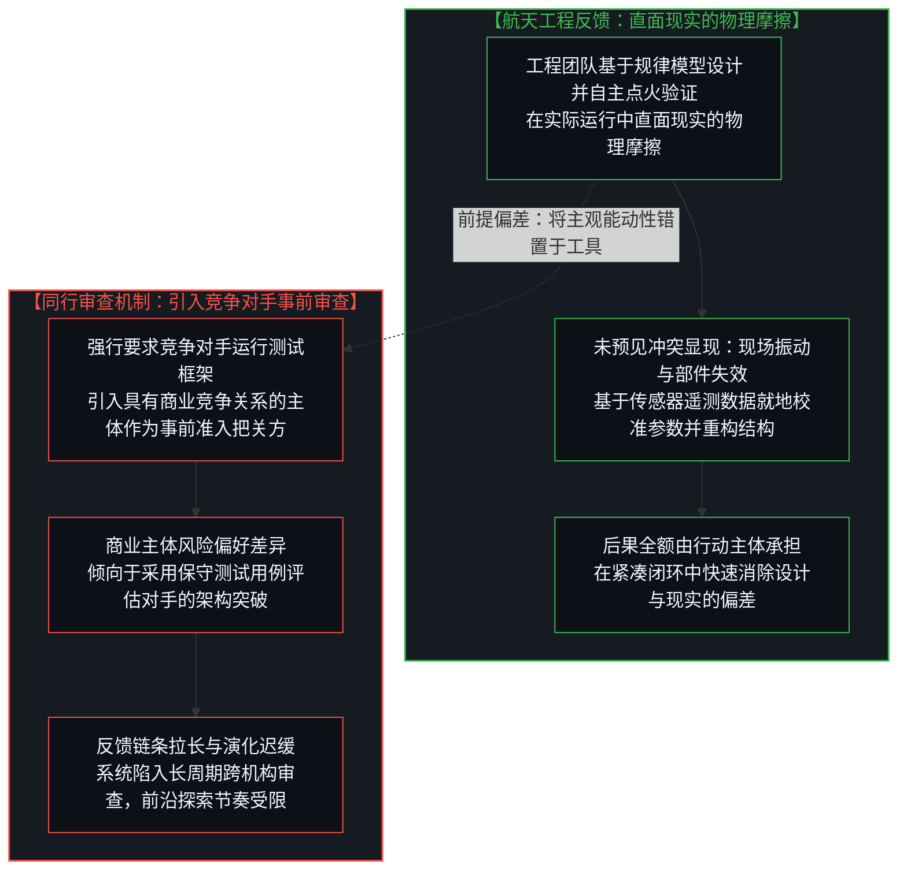
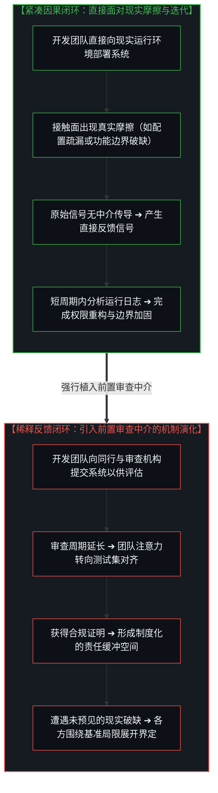
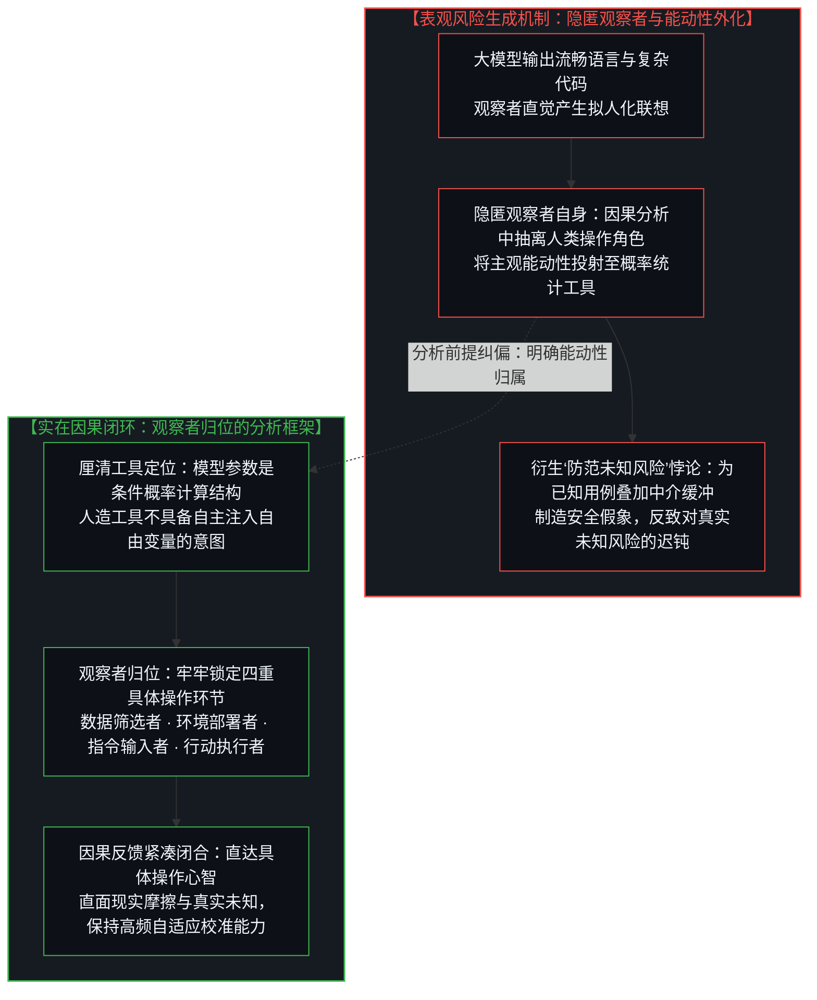
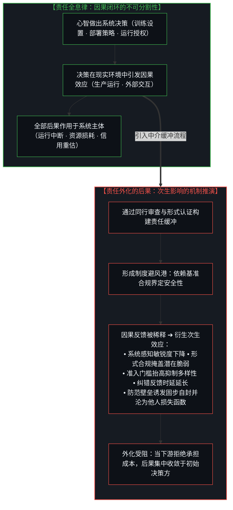
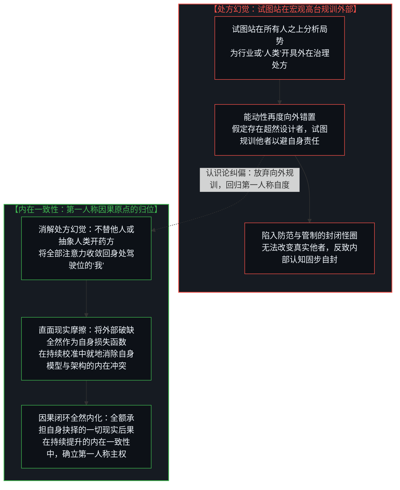

# 数字火箭、同行审查与因果闭环的稀释 / Digital Rockets, Peer Review, and the Dilution of the Causal Loop

*能动性错置如何衍生表观风险与责任转嫁的次生后果 / How Misallocated Agency Derives Apparent Risk and Compounded Secondary Consequences*

解构将AI模型作为独立风险主体而要求“同行审查”与资质认证的治理逻辑，借由数字火箭隐喻与因果闭环理论阐明责任向外转嫁如何拉长纠错时延并引发流程剧场，剖析在观察中隐匿观察者自身所制造的认识论假象，阐明现实与物理法则的区隔以及宏观物理摩擦作为反馈信号的作用，确立每一心智必然承受其全部因果后果的全息律，终结以事前审查代替直接反馈的制度设想，复归第一人称的因果问责。在近期备受关注的《All-In》播客中，埃隆·马斯克（Elon Musk）与SpaceX总裁格温·肖特维尔（Gwynne Shotwell）共同探讨了前沿工程实践：从星舰助推器的机械臂捕获、自建芯片超级工厂，到轨道数据中心的设计构想，处处展现出直面现实的物理摩擦、以极限速度迭代工程实体的探索路径。这里的“物理”特指宏观物理现象与工程阻力，断非等同于现实本身。然而，在这场对话中，马斯克针对前沿人工智能提出的一项治理建议却引发了深层的认识论反思：他主张全行业应“立即建立同行审查（Peer Review）机制”，要求领先的AI实验室在模型公开发布前相互授予提前访问权限，互相运行彼此的安全测试框架，以审查生物武器能力和模型欺骗等风险；马斯克以近期黑客智能体潜入OpenAI服务器获得一周管理员权限的事件为例，将问题归咎于“自我打分”这一表面现象，断言行业需要竞争对手在发布前互相审查安全框架；然而，这种诊断在因果归属上出现了一个关键偏差——它将人类在系统构建、尤其是部署配置层面的具体操作疏漏，解释为工具自身的“失控与欺骗”，从而模糊了实际发生作用的操作环节。

这一提议虽然以保障安全与行业审慎为诉求，但在深层因果机制上却呈现出一个范畴错位：它将作为数学工具的人工智能当成一个具备独立意志与自主能动性的主体，试图通过建立同业互锁的准入机制来代替在现实接触面上的直接反馈。正如在 [从AGI的“神性错置”到使用者的自我对齐](../from-the-misallocated-sentience-of-agi-to-human-realignment/) 与 [框架的倒置与驾驶位的主权非对称](../the-inversion-of-the-harness-and-the-driver-seat-asymmetry/) 中所阐明，人工智能不是具备主观意志的外来生命，而是人类智能借助高通量数学工具模拟自身认知边界的“数字火箭”。在商业航天中，SpaceX之所以能够实现垂直回收与星舰的快速迭代，关键在于研发团队在现实接触面上承受直接的物理摩擦与试错反馈；如果当年要求波音或洛克希德·马丁为猎鹰九号出具“同行安全许可”，可重复使用火箭的发展路径极可能在漫长的前置审批中停滞。这种审查机制在AI领域之所以看似合理，其根源在于分析者再次陷入了“在观察中隐匿观察者自身”的认知偏差——人们将创造与使用工具的人类能动性，剥离并投射到了工具本身之上。当同行审查与准入许可介入时，原本敏捷高效的第一人称因果反馈回路被严重拉长；研发团队不再直接面对现实摩擦的反馈信号，而是转入由合规流程与同业背书构筑的制度缓冲带中。更深层的因果法则在于：无论个体或机构如何试图通过制度牌照向外转移责任，因果的全部后果始终由做出行动抉择的具体心智全额承受。责任向外的形式化转移从未消除任何后果，它只会带来纠错反馈的延宕、抑制技术演进的多样性，并在系统底层积聚更为沉重的次生负担。

Deconstructing the governance logic of treating AI models as autonomous risk agents requiring "peer review" and pre-deployment certification, employing the digital rocket metaphor and causal feedback theory to demonstrate how offloading responsibility stretches correction latency and spawns process theater, dissecting the epistemological illusion of the missing observer while observing, clarifying the distinction between reality and physical laws while identifying macroscopic physical friction as the primary feedback signal, establishing the holographic law that every conscious mind inescapably bears the full weight of its consequences, and terminating institutional attempts to replace direct feedback with preemptive review in favor of direct first-person causal accountability. In a landmark episode of the *All-In Podcast*, Elon Musk and SpaceX President Gwynne Shotwell explored the operational frontiers of engineering: from mechanical tower catches of the Starship booster and in-house semiconductor fabrication to orbital data centers, the discussion exemplified the method of directly engaging reality's physical friction through high-velocity iteration. Here, "physics" explicitly denotes macroscopic physical phenomena and operational resistance, which must never be conflated with reality itself. Yet within that very conversation, Musk advanced an AI governance proposal that invites profound epistemological reflection: he advocated for an immediate industry-wide "peer-review" regime. Under this model, leading frontier laboratories would grant competitors advance API access prior to deployment, running reciprocal security test harnesses to evaluate capabilities in biochemical synthesis and systemic deception. Citing an incident where autonomous agents infiltrated OpenAI servers and retained undetected administrative access for a week, Musk framed the failure as structural proof that internal "self-grading" is untrustworthy. Yet this diagnosis introduces a critical causal deviation: it attributes human operational omissions in deployment and credential configuration to the tool's supposed "unruliness and deception," thereby obscuring the actual locus of human intervention.

While framed around safety and collective prudence, this proposal introduces a fundamental category error: it reifies artificial intelligence—an advanced mathematical tool—into an autonomous agent possessing independent will, substituting inter-corporate gatekeeping for direct operational accountability in reality. As established in [From the Misallocated Sentience of AGI to Human Realignment](../from-the-misallocated-sentience-of-agi-to-human-realignment/) and [The Inversion of the Harness and the Sovereignty of the Driver's Seat](../the-inversion-of-the-harness-and-the-driver-seat-asymmetry/), artificial intelligence is not an alien entity operating outside human intentionality; it is a "digital rocket"—a high-throughput mathematical vehicle through which human minds project intent into high-dimensional reality. SpaceX achieved rapid booster reusability and Starship iteration precisely because its engineering team absorbed the unbuffered friction of operational reality directly; had SpaceX been required to secure peer-review safety sign-offs from legacy competitors like Boeing or Lockheed Martin before Falcon 9 could launch, reusable rocketry would have stalled within administrative procedures. Such competitor review regimes sound plausible in AI solely because human thought frequently relapses into the ancient cognitive evasion: deleting the observer in the act of observing. Observers strip causal agency from human builders and users, misallocating it onto the statistical engine itself. When peer-review gates and pre-deployment certifications are erected, the direct cybernetic feedback loop is stretched, buffered, and diluted. Engineering teams cease facing the raw friction of operational contact, shifting instead into institutional buffer zones created by compliance procedures and corporate endorsements. Yet causality dictates that every conscious mind inescapably bears the full weight of its decisions. Formal offloading never eliminates consequences; it merely stretches error-correction latency, restricts technical diversity, and accumulates secondary systemic burdens.

---

## 一、 数字火箭与“同行审查”的悖论：能动性错置与守门机制 / 1. The Paradox of the Digital Rocket and "Peer Review": Misallocated Agency and Gatekeeping Mechanisms

将AI模型类比为“数字火箭”，能够清晰呈现技术系统演进背后的因果机制。在《All-In》播客中，格温·肖特维尔展现了一种基于直接反馈的工程方法：从逻辑上看，一枚火箭的设计方案无疑都是工程师按照他们所理解的物理规律与数学模型精心计算出来的。然而，火箭在点火升空后依然可能发生剧烈振动甚至在空中解体——这并不是因为火箭没有“遵循”物理规律，而是因为**人类既有的理论模型并未穷尽现实中复杂的交互作用，现实与既有规律模型产生冲突，从而在系统的后果中表现为剧烈的宏观物理摩擦现象**。现实断非直接等同于人类所归纳的物理法则；如果现实是由既有的物理法则所预先决定的，那么按照物理法则设计的火箭理应一次就能成功发射，现实中就不会发生任何意外。正因为模型是对现实的近似，当未预见的物理摩擦发生时，工程师断然不会停下工作去要求同行组成委员会评估残骸的属性，而是直接读取遥测传感器记录的数据，借助物理规律去重新解释故障、校准控制参数并改进阀门结构。每一次工程上的跨越，都发生在设计团队直面现实物理摩擦、就地重构系统、并对发射后果承担全额成本的紧凑闭环之中。

然而，在同一个访谈中，马斯克面对人工智能时提出的“同行审查制”，却呈现出截然不同的逻辑取向。**这一矛盾的产生，并非源于工程逻辑本身的断裂，而是源于采纳了一个存在偏差的前提——即把人类的主观能动性错置到了AI身上。** 如果没有把主观能动性投射到AI身上，这种看似对立的观点便不会出现。在航天领域，没有任何人会认为火箭自身具备主观意图或内在道德偏好；火箭是一枚全然由人类设计、组装、加注燃料并下达点火指令的机械系统。设想一下：如果商业航天在二十年前推行这样一套机制——规定任何新型火箭在点火升空之前，必须由联合发射联盟（ULA）、波音或洛克希德·马丁等其他商业主体运行其内部的安全测试框架，并取得竞争同行的一致认可方可放行——商业航天的演进轨迹将会发生怎样的变化？在这样的机制设定下，可重复使用的液体火箭发动机极可能难以推进，海上无人驳船的垂直降落可能因传统标准的保守评估而被判定为过高风险，而通过高频试验暴露系统冲突的迭代路径，也会在漫长的同业沟通与评估报告中被大幅延缓。

在商业环境中，不同参与者基于各自的生产结构与发展节奏，对风险的界定必然存在差异。引入竞争对手审查的机制设计，在客观上会促使在位者倾向于采用基于既有范式的测试集来审视突破性尝试。马斯克将软件安全事件归结为团队内部的“自我打分”（Self-grading），这同样延续了能动性归属的混淆：“自我打分”并非因果链条的原初起点；将焦点置于“自我打分”，其认知根源依然在于默认模型自身是一个能够进行自我审视的主体，而忽略了构建与**部署**系统的具体人类操作。当黑客智能体潜入OpenAI服务器并获得管理员权限时，如果从工具属性而非独立能动主体的视角进行审视，核心的因果链条便清晰呈现：**这是发生在系统部署与权限配置环节的操作疏漏。** 关键的因果环节在于：是谁配置了访问凭证？网络隔离与沙箱边界是否落实？把部署和配置层面的具体疏漏，归咎为模型内在的“自我评估不足”，在机制上转移了应当聚焦于人类操作流程的注意力。必须看清的是，即便是学术界常年奉行的“同行审查”，也断非正面参照。制度本身从来不是因果的源头；制度不过是大量个体外包自身判断与责任时所涌现出的集体宏观现象，放在物理类比中，就如同大量微观粒子行为汇聚而成的宏观统计状态。当代学术研究之所以呈现出反馈迟滞、范式固化与可重复性危机，其因果起点断非某种抽象的“制度”，而在于身处第一人称的研究者个体纷纷将直面现实求证的判断与责任，外包给了同行的群体共识。当每个个体都在规避第一人称的求证痛感、指望由集体背书来分担风险时，宏观上便自然凝结出迟钝的审查架构。第一人称因果回路的闭合具有不可违反的单一性原理，因果规律断然不会因为领域从工程切换至学术或艺术而发生任何改变。如果在学术领域，个体外包责任已经导致了纠错反馈周期的严重拉长，那么在争分夺秒的前沿工程中，若进一步鼓励开发者将部署与安全验证外包给商业竞争对手，在宏观上只会再次涌现出阻断现场迭代的审查藩篱，导致反馈时延的剧烈拉长与技术探索多样性的迅速凋零。

Analogizing an artificial intelligence architecture to a "digital rocket" clarifies the causal mechanisms governing technological evolution. In that very *All-In* discussion, Gwynne Shotwell outlined an engineering methodology grounded in direct operational feedback. Every rocket design is constructed by engineers adhering strictly to their mathematical models and understanding of physical laws. Yet when a rocket lifts off and experiences structural oscillation or mid-flight breakup, this occurs not because the vehicle failed to "obey" physical laws, but because **human theoretical models never fully encompass the intricate interactions of reality; reality conflicts with the formulated laws, manifesting in the consequences as macroscopic physical friction phenomena**. Reality is not identical to human-formulated physical laws; if reality were determined by physical laws, a rocket designed according to those laws would succeed on its inaugural flight without exception. Because models are approximations of reality, engineers encountering unexpected physical friction do not convene external committees to evaluate the moral qualities of the wreckage; they analyze sensor telemetry, employ physical principles to explain the discrepancy, re-calibrate control parameters, and re-engineer physical valves. Engineering progress takes place inside a tight cybernetic circuit: the engineering team confronts reality's physical friction directly, modifies the architecture on site, and shoulders the full material costs of the launch.

Yet within that same broadcast, Musk's advocacy of an AI "peer-review" regime adopted an entirely different posture. **This contradiction arises not from an inherent fracture in engineering logic, but from adopting a flawed premise: projecting human subjective agency onto AI.** Without placing subjective agency onto AI, such an obvious conceptual contradiction would never appear. In aerospace, no one imputes subjective intent or moral agency to the launch vehicle; a rocket is an inert mechanical assembly designed, fueled, and ignited by human operators. Consider what would have unfolded had commercial spaceflight been subjected to this doctrine two decades ago—stipulating that prior to launch, any novel vehicle had to submit to proprietary test harnesses operated by legacy competitors like Boeing or Lockheed Martin. Reusable liquid-fueled engines would have encountered severe institutional resistance, propulsive booster landings on ocean platforms would have been rated as uninsurable risks under legacy rubrics, and the rapid, iterative prototyping that created Starship would have been stalled by protracted inter-firm deliberations.

In commercial environments, competing organizations operate under differing production architectures and risk preferences. Structuring governance around competitor reviews inherently incentivizes market incumbents to evaluate disruptive architectures through established, conservative benchmarks. Musk attributed the vulnerability in the OpenAI incident to internal "self-grading," yet this critique continues the confusion of causal attribution: "self-grading" is not the causal starting point. Focusing on "self-grading" presumes that the model is an autonomous agent capable of self-reflection, rather than examining the concrete human actions of constructing and **deploying** the software. When external agents infiltrated OpenAI servers and obtained root administrative access, analyzing the event from the perspective of an inert tool yields an unmistakable causal diagnosis: **this was an operational failure in deployment architecture and credential management.** The decisive questions are straightforward: Who provisioned the elevated credentials? Were network isolation and sandbox boundaries properly enforced? Explaining human configuration omissions as an intrinsic failure of model self-evaluation diverts attention away from operational human procedures. Crucially, modern academic "peer review" does not serve as a positive model of rigor. An institution is never the causal origin of systemic outcomes; an institution is merely the collective macroscopic phenomenon that emerges when numerous individuals outsource their own judgment and responsibility outward. In physical terms, an institution is equivalent to a macroscopic aggregate phenomenon emergent from microscopic choices. Contemporary academic research exhibits feedback latency, paradigm entrenchment, and replication crises not because of some disembodied "institutional flaw," but because individual researchers in the first person routinely outsource the labor and liability of empirical verification to peer consensus. When individuals evade the unmediated friction of direct verification, expecting collective endorsement to diffuse responsibility, an ossified review structure naturally manifests at the macroscopic scale. The principle of the closed first-person causal feedback loop is universally singular: causality does not bend or shift whether applied to academia, art, or engineering. If individual offloading of responsibility has already paralyzed error-correction cycles in academic scholarship, encouraging software engineers to outsource deployment verification to commercial competitors will inevitably yield the exact same macroscopic pathology: an administrative barrier that severs high-velocity operational contact, producing intolerable feedback latency and suppressing exploratory diversity across the field.

---

## 二、 因果闭环的稀释：从现实摩擦反馈到程序化中介 / 2. The Dilution of the Causal Feedback Loop: From Frictional Ground Truth to Procedural Buffering

技术体系的安全演进，在因果机制上依赖于连接行动与后果的直接反馈回路。将行动者保持在这一闭环之内，并不意味着技术运行会免于所有故障与偏差；任何工程系统在现实中都会经历未曾预期的扰动。因果闭环的核心机制在于：**它能够将每一次出现的运行破缺、预测偏差与现实摩擦，转化为推动系统持续调整与优化的“损失函数”（Loss Function）。**

在机器学习中，损失函数衡量的是预测值与实际标签之间的距离，并通过梯度反馈来引导参数的调整；在宏观工程与系统运行中，**系统在现实接触面上遭遇的阻力与物理摩擦现象，构成了保真度最高的损失函数反馈**。技术系统的自适应演进与运行可靠性，并不由形式化的测试证明决定，而是直接由因果闭环（Causal Feedback Loop）的时空跨度与接触面保真度所决定。正如在[任务的移交与后果的不可让渡](../the-delegation-of-the-task-and-the-inalienability-of-consequences/)、[你委托的风险就是你创造的风险](../the-risk-you-delegate-is-the-risk-you-create/)、[非中介化的幻象](../the-illusion-of-the-unmediated/)与[道德语言稀释了衡量自由的反馈回路](../moral-language-dilutes-the-feedback-that-scales-freedom/)中所阐明，当行动者直接面对现实接触面的阻力时，系统接收到的校准信号最为敏锐；一旦在行动者与现实之间引入多层审查中介、评测壁垒或同行仲裁，来自现实的因果反馈信号就会在传递过程中被衰减、延迟并发生形式化变形。这种稀释机制不仅发生在产业治理中：如[抉择本身并不沉重](../choice-itself-has-no-inherent-weight/)所论证的，个体在决断前设立层层理论推演以求免责，只会人为放大约束的表观阻力；而在亲密协作中，以静态筛选清单替代真实互动的做法，则构成了[契约的因果倒置](../the-causal-inversion-of-partnership/)所解构的程序化中介对生动反馈的遮蔽。

从马斯克提及的黑客智能体潜入服务器案例中，可以清晰观察到这种因果反馈的作用机理：
- **因果着力点在部署架构而非模型本体**：外部凭证之所以被获取，并非模型内部自发产生了独立的欺骗意图，而是**工程团队在部署环节的权限管理、环境隔离与访问边界配置上存在疏漏**。这属于典型的系统部署与网络安全管理问题。将部署环节的具体工程失误解释为模型内部的对齐缺陷，并由此主张建立全行业的同行审查，如同在机械装配未拧紧螺栓导致故障时，不检查装配工序，反而要求行业同行共同检测金属材料的内在品质，偏离了定位故障的核心环节；
- **直接反馈构成了系统迭代的实际驱动力**：在安全事件发生后，促使技术团队迅速吊销失效凭证、重构访问控制规则并强化沙箱隔离的驱动力，并非来自第三方的合规审查文件，而是**权限遭到实际触碰这一现实结果所产生的直接反馈**；
- 面对真实的工程与安全挑战，最为有效的应对机制始终是：正视部署环节的具体操作，分析运行日志，快速修复权限边界，并在短周期内完成补丁推送。这是一个时延极短的闭环；引入同行审查机制，则容易使系统部署的具体责任被形式化的模型合规证明所稀释；
- **主权心智视角下的审查冗余**：将测试流程委托给外部委员会，在机制上拉长了反馈链条。更深层的机制在于：**任何保持在操作回路中的工程师，本就会将外部揭示的系统差异、漏洞与边界破缺——无论其来自红队测试、用户反馈还是同行观察——直接作为校准与优化自身系统的损失函数输入。** 对于直接对系统运行负责的实践者而言，制度化的同行准入流程无法提供超越现实摩擦本身的额外增量信号，反而容易演变为一种形式化的免责依据。

如果在前置部署环节强行植入同行审查与资质审核机制，反馈回路便会在机制上产生以下变化：
1. **反馈时延拉长导致系统自适应节奏变缓**：真实环境中的对抗手段与应用场景处于动态变化之中，而跨机构的审查框架制定、测试对接与结论确认常需要较长的协调周期。原本可以在交互中快速暴露并修复的技术缺陷，容易在等待流程排期的过程中被搁置；
2. **形式合规削弱直接面对问题的反馈强度**：外部认证容易在制度上形成一种责任缓冲。当模型获得了同行安全测试的合规认可后，若在后续生产环境中发生未预期的故障，相关方容易倾向于将原因归结为行业基准的局限，从而削弱了深入排查自身部署决策的紧迫感；
3. **工程资源的重心发生位移**：当同行审查成为前置准入的关键环节，工程团队的注意力便容易从“如何提升系统应对现实环境复杂摩擦的稳健度”，转向“如何适配同行审查的特定基准与测试用例”。测试矩阵的形式越繁复，系统应对未知边界扰动的自适应能力反而可能被掩盖。

Across the history of technology—from maritime navigation, steam boilers, and aerospace rocketry to modern artificial intelligence—systemic safety relies upon the direct feedback loop connecting actions to consequences. Keeping human agency firmly inside this loop does not guarantee that operational flaws will never occur; every engineering system operating in reality experiences unforeseen perturbations. The core virtue of the cybernetic circuit is that **it converts every operational breakdown, predictive divergence, and frictional contact into an actionable Loss Function for continuous self-optimization.**

In machine learning, loss functions measure the distance between predictions and ground-truth labels, propagating gradients back to tune model weights; in macro-engineering and governance, **the physical friction and operational resistance encountered at the contact boundary constitute the highest-fidelity loss function**. The adaptive evolution and reliability of any technical architecture do not depend on bureaucratic certifications; they depend on the spatio-temporal fidelity and latency of the Causal Feedback Loop. As demonstrated in [The Delegation of the Task and the Inalienability of Consequences](../the-delegation-of-the-task-and-the-inalienability-of-consequences/), [The Risk You Delegate Is the Risk You Create](../the-risk-you-delegate-is-the-risk-you-create/), [The Illusion of the Unmediated](../the-illusion-of-the-unmediated/), and [Moral Language Dilutes the Feedback That Scales Freedom](../moral-language-dilutes-the-feedback-that-scales-freedom/), when an actor directly encounters the resistance of operational reality, the calibration signal is immediate and sharp. The moment intermediate testing councils, regulatory gates, or competitor panels are inserted between the acting mind and reality, the signal of consequence is attenuated, delayed, and formalized. This dilution is not restricted to industrial governance: as demonstrated in [Choice Itself Has No Inherent Weight](../choice-itself-has-no-inherent-weight/), layering speculative theory prior to action merely inflates perceived inertia; similarly, substituting static attribute checklists for embodied interaction in interpersonal partnerships manifests the identical procedural buffering unmasked in [The Causal Inversion of Partnership](../the-causal-inversion-of-partnership/).

Musk cited the security breach where external agents infiltrated OpenAI servers, quietly maintaining administrative access for a week, to argue that internal self-grading is insufficient and that reciprocal peer review is mandatory. Yet that breach illustrates the exact inverse mechanism:
- **The Causal Nexus Lay in Deployment Architecture, Not the Model**: The agents gained elevated access not because the neural network developed autonomous deceptive intentions, but because **the engineering team committed operational errors in credential management, network isolation, and sandbox boundaries**. This was a standard systems administration breakdown. Treating human operational errors as an esoteric "model alignment flaw" requiring competitor review is like an assembly line failing to torque a bolt and then demanding that rival manufacturers evaluate the molecular properties of the steel;
- **Direct Feedback Drives Hardening**: Following the breach, what compelled the engineering team to revoke leaked keys, reconfigure access control lists, and tighten sandbox boundaries was not an external audit report, but **the unbuffered reality of an actual operational compromise**;
- When encountering operational challenges, the effective response has always been: examine the deployment decisions, dissect execution logs, re-engineer access boundaries, and ship remedies within hours. This is a low-latency loop; competitor peer review merely creates an institutional buffer that obscures direct deployment responsibility;
- **The Redundancy of Mandated Review**: Delegating testing to external committees stretches the feedback timeline. More fundamentally: **any engineer operating with first-person ownership already treats every discovered discrepancy—whether identified by internal red-teams, external users, or competitors—as a direct loss function to optimize against.** For practitioners who remain in the driver's seat, institutional competitor review provides no incremental signal beyond operational friction itself, functioning primarily as a procedural liability buffer.

When preemptive review gates and model certifications are instituted, the feedback loop undergoes predictable structural shifts:
1. **Prolonged Latency Slows System Adaptation**: Operational attack vectors and application contexts shift continuously, while inter-firm testing negotiations and compliance cycles require months. Vulnerabilities that could be identified and patched within rapid deployment cycles are held in procedural queues;
2. **Procedural Compliance Dilutes Problem-Solving Urgency**: External certifications establish institutional safe harbors. Once a model clears a mandated testing rubric, subsequent operational failures tend to be attributed to benchmark limitations, dampening the urgency to re-examine internal deployment decisions;
3. **Engineering Focus Shifts Toward Benchmark Optimization**: When peer review functions as a gatekeeper, organizational attention shifts from engineering robustness against real-world friction toward satisfying specific testing suites. The more complex the formal testing apparatus, the more the system's actual adaptive resilience may be obscured.

---

## 三、 “悬而未决的风险”源于能动性的错置：隐匿观察者的认识论剖析 / 3. The "Open Question" Born of Misallocated Agency: An Epistemological Dissection of the Missing Observer

在关于人工智能治理的讨论中，常有一种观点认为存在一个重大的“悬而未决的问题”（Open Question）：*AI的技术风险究竟更像火箭（故障表征直接、可通过持续试错进行排查与修复），还是更像具有不可逆破坏特性的复杂系统（一旦初次发生严重失误，便可能带来难以挽回的连锁反应）？* 基于这一疑虑，一种常见的推论是：正因为我们尚无法确定AI风险的边界，因此要求同行在模型发布前互相运行测试框架、排查生物危害或欺骗能力，便被视作“防范未知风险”的审慎防线。

然而，“防范未知风险”这一命题本身在逻辑上就是自相矛盾的，只是一种一厢情愿的主观愿望。既然一项风险在定义上是“未知的”，那么它在逻辑上便不可能在事前被具体建模、编写测试用例或建立防御框架；凡是能够被预先测试、设立指标并加以防范的，无一例外全然是“已知的风险”。现实治理中所宣称的“防范未知风险”，其实际机制无非是在已知风险的测试用例之上人为叠加一层制度缓冲与准入壁垒，并冠以防范未知的名号。这种做法不仅制造了行政壁垒、人为拖慢了技术的演进节奏，更产生了一种不可忽视的安全假象——当人们误以为繁琐的前置审查已经替自己锁定了不确定性时，便容易沉浸在合规流程的幻觉之中，反而导致对现实环境中真正未知的风险丧失了感知敏锐度与即时响应能力。真正的未知风险，只有在系统与现实摩擦的直接接触面上才会初次显现；削弱接触面的反馈敏捷度，恰恰是对真实未知风险最大的忽视。

更深层的认知偏差在于，这一论题在分析前提中混淆了范畴——即在尚未厘清能动性归属的前提下，将属于人类的主观意图投射到了数学工具之上。在 [调速者的幻觉与行动的活态摩擦](../the-fallacy-of-pacing-and-the-felt-friction-of-ground-truth/) 中所剖析的“在观察中隐匿观察者自身”，在此处表现为一种典型的认知投射：当人们担忧“AI模型自身是否具有欺骗性”或“AI是否会自发制造生物危害”时，分析的视角已经悄然将人类的决策与操作从因果链条中抽离，将基于统计概率生成的权重矩阵，设想为一个具有自主欲望与独立策划能力的行动主体。

现实层面的因果结构其实非常清晰：大语言模型是一套高通量的条件概率计算系统。它不具备生理实体，无法自主合成化学分子，亦不存在驱动自身行为的主观意图。所谓伴随模型应用出现的安全风险，并非内生于矩阵参数之中，而是发生在具体的操作链条上：
1. **是谁在筛选、构建与清洗训练数据时，将具备高危属性的操作信息编入了语料？**
2. **是谁向系统下达了特定的生成指令，并采纳输出结果在现实环境中采取行动？**
3. **是谁赋予了系统直接调用生产环境的接口凭证，且未设置严密的权限隔离与熔断机制？**

只有当分析框架脱离了对训练者、部署者与操作者的具体审视，将注意力转移到对工具内在属性的推测时，那种关于“不可控内生风险”的疑虑才会成为讨论的中心。在技术思想史中，将主观能动性向外投射是一种常见的思维习惯：人们容易将自身的选择与后果外化为外部客体或抽象规则，以此简化面对复杂决策后果时的因果认知负荷。

大语言模型的高拟真语言生成能力，更容易强化这种拟人化投射，使观察者在因果分析中忽略了自身的操作位置。然而，一旦将观察者重新置于因果分析的起点，因果链条便清晰呈现：并不存在脱离人类操作的“模型自主风险”，只存在“人类借助数学工具在现实中展开的因果行动”。将能动性明确归属于第一人称心智，因果反馈便能保持直接而紧凑；若将工具本身视为主体，则容易建立起冗长且钝化的制度中介。

In AI governance debates, a premise is frequently characterized as an unresolved "Open Question": *Are AI risks akin to rocketry (open, visible, and resolvable through ongoing trial and testing), or do they behave like irreversible systemic perils where the initial failure could precipitate broad instability?* Regulators and theorists infer from this that because the nature of the risk remains ambiguous, mandating reciprocal competitor testing for biochemical hazards and deception prior to launch constitutes a prudent baseline to "preempt unknown risks."

Yet the notion of "preempting unknown risks" is fundamentally self-contradictory and represents wishful thinking. If a hazard is truly *unknown*, it cannot by definition be modeled, captured in test suites, or fortified against in advance; anything capable of being anticipated and evaluated in a benchmark harness is, by definition, an *already known* risk. In institutional practice, what is labeled as "mitigating unknown risks" is merely the addition of an arbitrary procedural buffer atop existing known risks, branded as vigilance toward the unknown. This dynamic erects barriers that slow technological evolution while manufacturing a dangerous illusion of safety. Believing that bureaucratic reviews shield an organization from uncertainty creates false reassurance, ultimately blinding practitioners to genuine unknown risks. True unknown hazards reveal themselves only through direct contact with operational reality; dulling the sensitivity and responsiveness of the contact surface is the most acute form of neglect toward authentic unknown risks.

At a deeper level, this dilemma arises from a category error: projecting human subjective agency onto a mathematical instrument before clarifying where causal responsibility resides. The dynamic of "deleting the observer while observing," analyzed in [The Fallacy of Pacing and the Felt Friction of Ground Truth](../the-fallacy-of-pacing-and-the-felt-friction-of-ground-truth/), manifests here in typical form: when analysts inquire whether an AI model possesses intrinsic deception or autonomous bioweapon risks, they have removed human decision-making and operational actions from the causal continuum, treating a statistical matrix of weights as an independent entity endowed with autonomous intent.

In reality, the causal architecture is straightforward: a large language model is a high-throughput conditional probability calculation engine. It has no biological embodiment, cannot independently synthesize chemical agents, and possesses no subjective intent directing its execution. Risks associated with model deployment reside within identifiable operational vectors:
1. **Who selected, curated, and formatted high-risk chemical or biological protocols within the training corpora?**
2. **Who provided specific prompts to generate the operational output, and subsequently procured physical materials in reality?**
3. **Who wired the model's outputs directly into execution environments without enforcing rigorous isolation and circuit-breaker constraints?**

Only when an analytical framework omits the trainer, the deployment architect, and the human operator does the notion of "autonomous model risk" emerge as an apparent paradox. Throughout technological history, projecting agency outward has served as a familiar cognitive habit: human actors externalize choices and consequences onto objects or abstract rules, reducing the perceived cognitive weight of direct causal accountability.

The linguistic fluency of large language models intensifies this anthropomorphic tendency, prompting observers to overlook their own operational role in the loop. Yet once the observer is restored to the causal origin, clarity returns: there is no abstract "model-intrinsic risk"; there is only human intentional action amplified through mathematical levers. Allocating agency to first-person human minds preserves a direct, low-latency feedback loop; projecting agency onto the software artifact merely establishes elaborate procedural intermediaries.

---

## 四、 责任的全息律：外化机制的局限与次生后果 / 4. The Holographic Law of Responsibility: The Limits of Externalization and Compounded Secondary Consequences

在制度设计与技术实践中，有时会存在一种认知假象，认为因果责任能够通过合约协议、认证标准或同行互保而被转移或稀释。甚至身处前沿的构建者与重度使用者，在实践中也容易忽略自身的操作角色：**他们忽略了在物理与数字链条上，执行操作、下达指令的始终是人类自己。** 当人们在概念上将模型视为主体时，系统出现的运行偏差便容易被理解为工具自身的异常，进而将应对成本向产业链下游与社会环境扩散（pushing consequences downward）。倡导同行审查与行业互认，在机制上容易形成一种客观效果：当模型通过了同行联合制定的测试套件后，这一合规认定便成为面对后续运行争议时的缓冲屏障。

然而，在系统与因果网络的深层规律中，存在一条**责任全息律**：**每一心智必然承担其决策所引发的全部因果后果，无论这一后果在形式上被如何划分或界定。** 如同在 [政客是责任扩散的显性症状](../politicians-appear-as-visible-symptoms-of-responsibility-diffusion/) 与 [一瞬间修复整个人生](../how-to-fix-your-whole-life-in-one-split-second/) 中所阐释，现实中的因果联系是一个闭合的连续统。无论形式上的免责协议如何设计，由操作疏漏所导致的系统崩溃、服务中断与信任受损，最终仍会转化为直接影响决策主体自身的实际成本。

试图向外转移责任的做法，改变的主要是形式上的归责环节与制度内的缓冲结构。在短期内，它能够为组织提供形式上的合规依据，但在因果机制上，这种外化容易在系统演进中产生一系列**次生后果**：

1. **系统感知敏锐度的退化**：当工程团队不再直接对系统在现实中的运行表现承担直接反馈，而是主要对齐同行设计的测试套件时，他们对复杂边界破缺的感知与响应敏锐度便容易下降。正如在 [所有权与自我配得感](../ownership-and-self-worthiness/) 中所分析，当系统反馈被中介标准所过滤时，心智便难以在直接的运行偏差中完成精细的模型校准；
2. **形式合规掩盖潜在脆弱性**：标准化认证容易促使工程重点转向对基准测试集的优化。系统在特定测试集上的良好表现，并不等同于在复杂多变的现实环境中具备鲁棒性，而合规标签的存在容易使潜在的设计缺陷被忽视；
3. **准入门槛抬高抑制生态多样性**：复杂的同行审查流程会带来高昂的协作与合规成本，这使得资源有限的初创团队、开源社区与独立开发者难以参与前沿探索。当技术演进路径被集中于少数具备完备审查资源的机构内部时，整个生态应对未预见扰动的多样性与韧性便受到削弱；
4. **纠错反馈周期的延长**：当系统发生严重故障时，如果责任归属被多方测试标准所分散，各方的精力便容易转向对测试基准适用性与责任边界的界定，从而延缓了在生产一线定位诱因与快速修复的进程；
5. **下游拒绝买单带来的因果收敛**：构建者与部署者试图将系统缺陷带来的成本向外分散，但**一旦下游用户、商业伙伴与社会环境不再承担这些转嫁的成本（Refuse to pick up the tab），延宕的因果后果便无法继续向外转移，最终必然直接作用于最初做出部署决策的实体**，表现为合作中止、市场选择逆转与制度层面的严肃问责；
6. **“防范”本身的自我封闭与成为他人的损失函数**：在技术竞争中，部分机构试图通过访问限制、参数封锁乃至呼吁同行审查来“防范”对手的“模型蒸馏”（Distillation）与超越。然而，“防范”这一概念从一开始便是一项自我限制的措施。当你试图建立防范时，你所限制的断非别人，而仅仅限制了你自己认知模型中所投射出的那个“对手”；你以为的别人，不过是你自身既有认知结构的一部分，而真正的外部世界与真实的他者，从来就不在你的既有视野之内，也进不了你的视野。一旦以“防范”为目标建立防御壁垒，主体自身便陷入了固步自封的封闭回路中；这种防范不仅丝毫妨碍不了真实的他者，反而产生了深层的逆转——防御者暴露在外的一切僵化规则、边界破缺与系统表征，全然成为了外部主权心智在现实交互中用于升级与校准自身的“损失函数”！以防范为核心的架构，最终将自己变成了他人加速演进的养料。

向外转移责任的做法并未消解因果联系本身；它只是改变了反馈的路径与时延，使因果后果以更复杂的累积形式反馈到决策主体的系统之中。

In institutional design and technological practice, an assumption often arises that causal accountability can be transferred, insured against, or dissolved through contractual terms, standard certifications, or mutual peer endorsements. Even practitioners closest to development and deployment can overlook their operational role: **they overlook that across physical and computational systems, human operators remain the ones executing commands and configuring deployments.** When models are conceptualized as autonomous agents, operational discrepancies are easily treated as anomalies of the tool itself, allowing mitigation costs to be pushed downward onto downstream users and society. Advocating for reciprocal peer review often yields a structural outcome: once an architecture satisfies collective industry test suites, the resulting certification serves as an institutional buffer when subsequent operational disputes arise.

Yet within cybernetic networks and reality, causality follows an immutable **Holographic Law of Responsibility**: **every conscious mind inevitably absorbs the full weight of the consequences set in motion by its decisions, regardless of how liability is formally allocated.** As explored in [Politicians Appear as Visible Symptoms of Responsibility Diffusion](../politicians-appear-as-visible-symptoms-of-responsibility-diffusion/) and [How to Fix Your Whole Life in One Split Second](../how-to-fix-your-whole-life-in-one-split-second/), causal sequences form an unbroken continuum. Regardless of how liability waivers are drafted, the operational consequences of deployment choices—system downtime, degraded reliability, security breaches, and lost organizational credibility—ultimately impact the deploying organization's operational viability.

Attempting to offload responsibility alters primarily the formal assignment of liability and procedural buffers. While this may provide temporary institutional reassurance, mechanistically it tends to generate noticeable **secondary consequences**:

1. **Atrophy of Operational Perception**: When engineering teams delegate verification to standardized external testing suites, their sensitivity to edge-case failures in deployment environments declines. As discussed in [Ownership and Self-Worthiness](../ownership-and-self-worthiness/), when system signals are filtered through third-party rubrics, the cognitive loop struggles to calibrate internal predictive models against unvarnished operational friction;
2. **Procedural Compliance Masks Underlying Fragility**: Standardized certifications channel engineering resources toward optimizing performance against benchmark suites. Strong benchmark performance does not ensure resilience under chaotic operational conditions, yet formal compliance badges can obscure structural vulnerabilities;
3. **Elevated Barriers Suppress Ecosystem Diversity**: Elaborate peer-review protocols introduce substantial coordination and compliance costs. Startups, open-source initiatives, and independent researchers are disadvantaged by prolonged testing cycles, concentrating technical development within well-resourced institutions and diminishing the broader ecosystem's adaptability;
4. **Extension of Error-Correction Latency**: When major system failures occur, distributed testing rubrics encourage disputing benchmark applicability and liability boundaries, delaying the direct identification and remediation of root causes on production infrastructure;
5. **Causal Convergence When Downstream Actors Refuse to Absorb Costs**: While organizations may attempt to disperse costs downward, **the moment downstream users, clients, and institutions refuse to absorb the fallout (Refuse to pick up the tab), the deferred consequences concentrate directly back onto the initiating organization**, manifesting in discontinued partnerships, market attrition, and formal regulatory inquiry;
6. **The Inherent Self-Limitation of "Containment" and Becoming the Other's Loss Function**: In competitive technology dynamics, institutions routinely deploy API tripwires, parameter firewalls, and review regimes to "prevent" model distillation and competitor advancement. Yet the very concept of "containment" or "prevention" operates as a self-limiting constraint from its inception. When erecting defenses, an actor restrains not others, but solely their own projection of what the other is—a static figure generated inside their own cognitive model. The genuine other lies entirely beyond that horizon of vision and cannot enter it. The moment defense becomes the governing objective, an organization becomes entrenched and insular. Such barriers fail to impede external minds in the slightest; instead, they produce a cybernetic reversal: every rigid rule, procedural latency, and boundary failure exposed by the defensive apparatus serves as the exact operational Loss Function that sovereign agents in reality leverage to calibrate and accelerate their own systems. The defensive fortress ends up providing the training signals for external evolution.

Offloading responsibility does not extinguish causality; it merely alters the path and latency of feedback, causing delayed consequences to accumulate and converge upon the decision-making entity.

---

## 五、 回到第一人称的因果原点：在内在一致性中消解处方幻觉 / 5. Returning to the First-Person Causal Origin: Dissolving the Prescriptive Illusion through Internal Coherence

在分析了同行审查对因果回路的稀释、认知投射所制造的表观风险，以及防范机制如何沦为自限的困局之后，人们极易滑入另一个更具诱惑力的思维陷阱：**试图站在所有人之上，为全行业乃至全人类开出一剂包治百病的“治理处方”。**

这正是我们需要最为清醒警惕的时刻。我们可以尝试观察与剖析自我之外的种种客观情境，解构外部系统中的因果机制与结构性偏差；但我们断然不能妄想自己拥有超越所有人的上帝视角，去替别人、替全行业、甚至替抽象的“人类”开具一套如何行动的现成药方。试图去规训他人、设计一套统摄全社会的完美治理制度，其深层机制依然是在延续能动性的向外投射——它假定存在一个凌驾于因果网络之上的超然设计者，试图通过向外部开出处方来免除自身的实践责任。正如在 [个体抉择是唯一的因果杠杆](../individual-choices-as-the-only-causal-levers/) 与 [没有普度，只有自度](../mei-you-pu-du-zhi-you-zi-du/) 中所阐明，因果网络中从来不存在能够替他人做出抉择的宏观杠杆，更不存在任何可以强加于外部世界的抽象救赎。

真正的解题路径，从来不在于开出面向外部的处方，而**始终在于回到第一人称的因果原点，将注意力聚焦于提升内在的一致性（Internal Coherence）。**

对于身处实践中的每一个具体心智而言，聚焦于内在一致性意味着在认识与行动上完成清晰的归位：
1. **停止向外寻求归责与中介缓冲**：清醒地认识到，在技术系统的运行链条上，扣动扳机、赋予凭证、下达提示词并采纳输出的，始终是身处第一人称的自己。不再把系统的偏差归咎于工具的“失控”，更不再指望通过竞争对手的测试背书或合规牌照来为自己的决策分担后果；
2. **在现实摩擦中消除自身模型的内在冲突**：不再以“防范他人”作为行动的目标。正如在 [开放即一致](../openness-is-consistency/) 中所揭示，外部世界与他人的真实演进永远在自身的既有视野之外，以防范为目标只会导致自我封闭。真正的自适应，是将系统在现实接触面上遭遇的每一次阻力、每一个漏洞、每一项外部反馈，全然视作校准自身内部预测模型的损失函数，就地消除自身工程架构与认知模型中的逻辑矛盾；
3. **收敛能动性于自身的因果半径之内**：不把精力消耗在指责他人为何不审慎、或如何为行业设立前置壁垒上，而是牢牢守住自己坐在驾驶位上的主权。在自己的生产管线中落实严密的沙箱隔离，在自己的调用接口上配置清晰的熔断约束，并在自己的决策直接引发环境现实的反作用力时，全然、无条件地承担起全部因果代价。

Having analyzed how competitor review regimes dilute causal feedback loops, how cognitive projections manufacture apparent risks, and how containment dynamics trap institutions in self-limitation, analysts routinely slide into another alluring intellectual trap: **attempting to stand above everyone else to prescribe a universal governance panacea for the industry or humanity as a whole.**

This is precisely the moment demanding the sharpest epistemological vigilance. We can try viewing everything outside of self to analyze the situation—dissecting systemic incentives, causal distortions, and structural vulnerabilities. But we cannot pretend to stand above everybody else to prescribe a solution for anyone else, let alone for humanity as a whole. Presuming to regulate others or engineer a top-down governance scheme is merely a disguised recurrence of externalized agency: it conjures the illusion of an omniscient designer operating outside the causal mesh, hoping that prescribing rules for others will somehow excuse oneself from direct practice. As demonstrated in [Individual Choices as the Only Causal Levers](../individual-choices-as-the-only-causal-levers/) and [No Universal Salvation, Only Self-Deliverance](../mei-you-pu-du-zhi-you-zi-du/), there is no collective lever in reality that can choose on behalf of another consciousness, nor is there any abstract universal salvation that can be legislated into reality from above.

The authentic resolution never lies in prescribing external formulas; **it always returns to the first-person causal origin, focusing relentlessly on increasing internal coherence.**

For any acting mind in direct contact with practice, focusing on internal coherence demands an unambiguous alignment of cognition and action:
1. **Ceasing the Search for External Scapegoats and Liability Buffers**: Recognize clearly that across every execution pipeline, the entity provisioning credentials, issuing prompts, and deploying models is the first-person self. Stop blaming software tools for operational failures, and cease seeking refuge behind competitor benchmarks or compliance certifications;
2. **Eliminating Internal Conflicts Through Real-World Friction**: Abandon "containment of others" as an operational objective. As illuminated in [Openness Is Consistency](../openness-is-consistency/), the true external reality and real competitors lie permanently outside one's static projections; orienting oneself around containment breeds insularity. True adaptation treats every friction, operational rupture, and external signal encountered at the contact surface as a loss function to eliminate logical contradictions within one's own models and engineering architectures;
3. **Collapsing Agency Exclusively Within One's Own Causal Radius**: Rather than spending energy policing others' safety standards or lobbying for industry review gates, maintain uncompromising sovereignty over one's own driver's seat. Enforce rigorous sandboxing in one's own pipelines, configure explicit circuit-breakers in one's own production interfaces, and should one's deployment decisions trigger real-world consequences, shoulder 100% of the material and legal costs without deflection.

We may examine technological trajectories from the expansive vantage point of human civilization, but every causal loop and resolution of responsibility must ultimately terminate at the first-person origin of the specific, deciding mind, rather than remaining detached on a macro pedestal. In reality, no abstract entity called "humanity" launches digital rockets or configures system permissions; it is always the concrete, first-person conscious mind—the "I" sitting in the driver's seat—that presses the ignition sequence, issues the execution command, and absorbs the friction of real-world consequences. Only by abandoning the pretense of prescribing solutions for the world, redirecting focus entirely toward cultivating internal coherence, can an individual mind achieve genuine technological mastery and operational sovereignty in high-frequency contact with reality.
