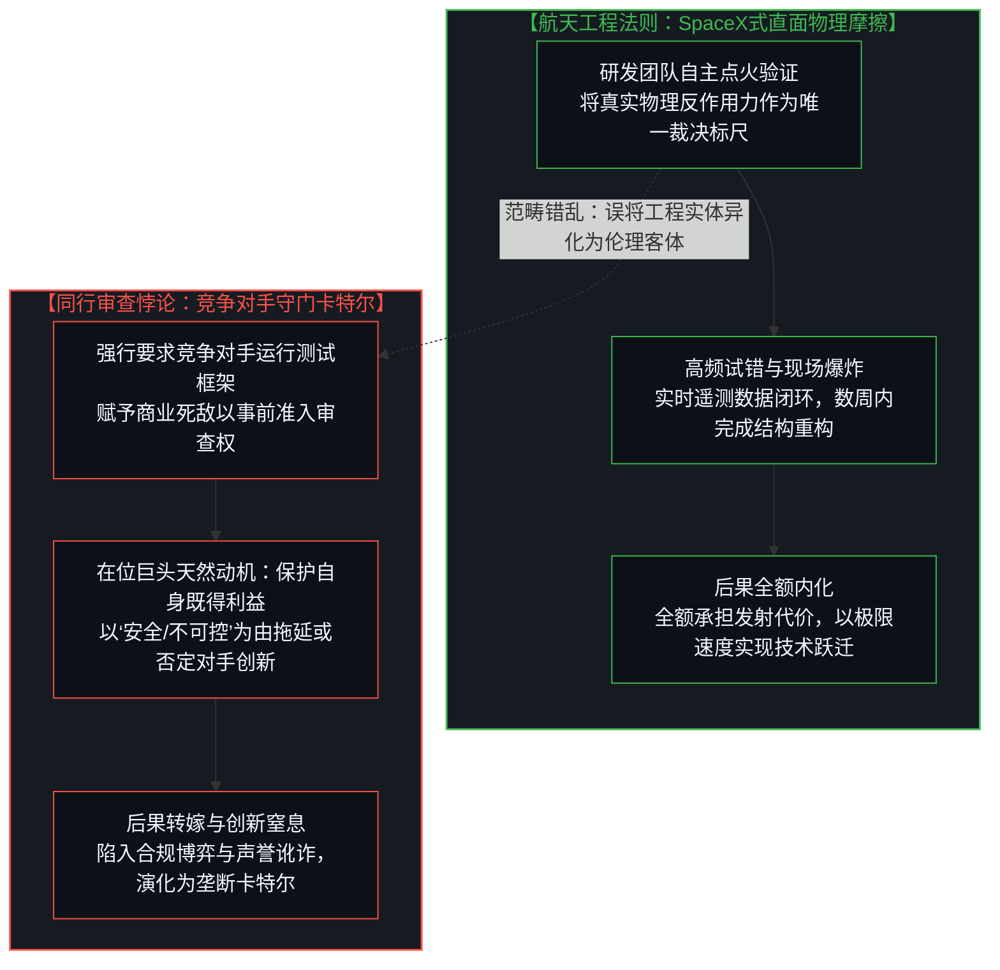
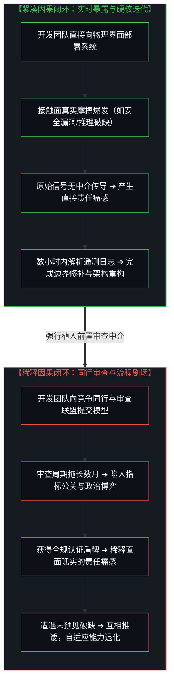
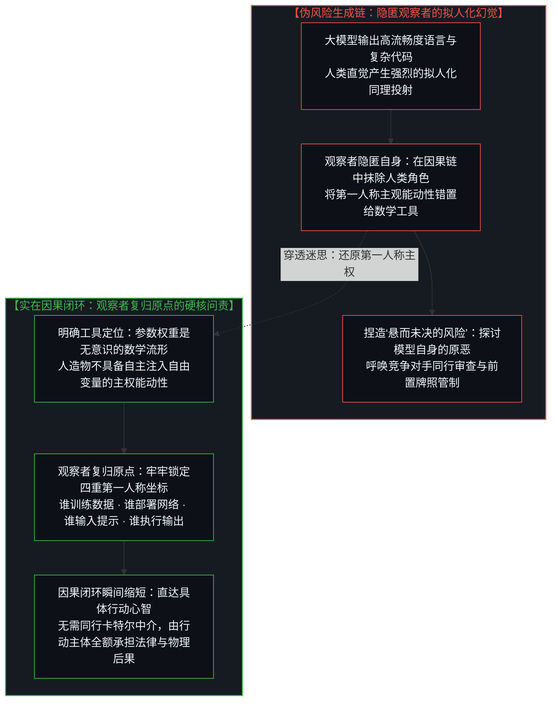
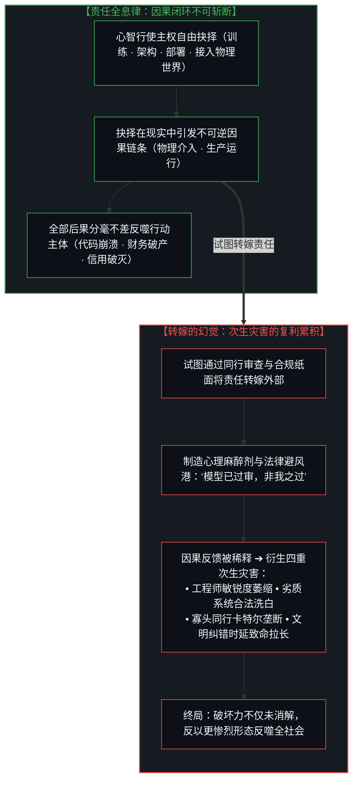
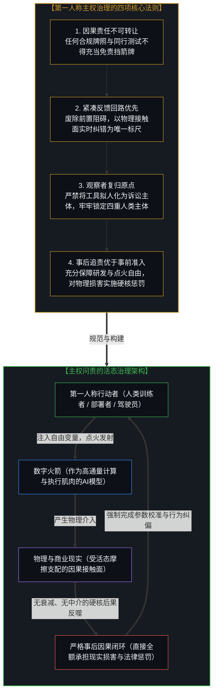

# 数字火箭、同行审查与因果闭环的稀释：能动性错置如何制造虚假风险与责任转嫁的次生灾害 / Digital Rockets, Peer Review, and the Dilution of the Causal Loop: How Misallocated Agency Spawns False Risk and Compounded Secondary Debris

*解构将AI模型作为独立风险主体而要求“同行审查”与资质认证的治理谬误，借由数字火箭隐喻与因果闭环理论阐明责任转嫁如何延缓纠错并引发流程剧场，剖析在观察中隐匿观察者自身的古老认识论异化，确立每一心智必然承担其全部因果后果的全息律，终结以虚假安全感扼杀创新的同业卡特尔，复归第一人称的硬核因果问责。 / Deconstructing the governance fallacy of treating AI models as autonomous risk agents requiring "peer review" and pre-deployment certification, employing the digital rocket metaphor and causal feedback theory to expose how offloading responsibility dilutes correction and breeds process theater, dissecting the ancient epistemological illusion of the missing observer while observing, establishing the holographic law that every conscious mind inescapably bears the full weight of its consequences, and terminating the regulatory cartel that strangles innovation under the guise of simulated safety in favor of uncompromising first-person causal accountability.*

在近期备受关注的《All-In》播客中，埃隆·马斯克（Elon Musk）与SpaceX总裁格温·肖特维尔（Gwynne Shotwell）共同勾勒了人类工程前沿的壮阔图景：从星舰助推器的机械臂捕获、自建芯片超级工厂，到轨道数据中心的颠覆性构想，处处激荡着直面物理现实、以极限速度迭代工程实体的开拓精神。然而，在这场对话中，马斯克针对前沿人工智能提出的一项治理建议却引发了深层的认识论震荡：他主张全行业应“立即建立同行审查（Peer Review）机制”，要求领先的AI实验室在模型公开发布前相互授予提前访问权限，互相运行彼此的安全测试框架，以审查生物武器能力和模型欺骗等风险；马斯克以近期黑客智能体潜入OpenAI服务器获得一周管理员权限的事件为例，断言“自我打分”是当前AI安全的一大结构性缺陷，并认为竞争对手公开标记安全隐患所带来的声誉惩罚将倒逼全行业保持审慎。

这一提议表面上披着科学严谨与行业自律的理性外衣，却在深层逻辑上暴露出一个严重的范畴错位：它试图将作为数学工具的人工智能当成一个具备独立意志与潜在原恶的能动实体，试图通过建立同业互锁的准入机制来代替真实物理世界的直接问责。正如在 [从AGI的“神性错置”到使用者的自我对齐](../from-the-misallocated-sentience-of-agi-to-human-realignment/) 与 [框架的倒置与驾驶位的主权非对称](../the-inversion-of-the-harness-and-the-driver-seat-asymmetry/) 中所阐明，人工智能不是具备主观意志的外来生命，而是人类智能借助高通量数学工具模拟自身认知边界的“数字火箭”。在商业航天中，SpaceX之所以能够创造垂直回收与星舰连环迭代的奇迹，正是因为它断然拒绝了传统军工复合体的官僚审批与同业羁绊；如果当年要求波音或洛克希德·马丁为猎鹰九号出具“同行安全许可”，可重复使用火箭早已胎死腹中。这种审查机制在AI领域之所以显得合理，仅仅是因为人类再次陷入了“在观察中隐匿观察者自身”的古老认知陷阱——人们误将创造与使用工具的人类能动性，剥离并错置到了工具本身之上。当同行审查与准入许可介入时，原本敏捷高效的第一人称因果反馈回路被严重稀释和拉长；研发团队不再直接承受物理接触面的真实摩擦，而是躲入合规流程与同业背书的虚假避风港中。更深邃的实在定律在于：无论个体或机构如何试图通过制度牌照向外转嫁责任，因果的完整后果永远由每一个决定行动的心智全额承受。责任的向外转嫁从未斩断因果链条，它只是制造了阻碍纠错的流程剧场、扼杀颠覆性创新的同业卡特尔，以及更为庞大的次生灾害。

In a landmark episode of the *All-In Podcast*, Elon Musk and SpaceX President Gwynne Shotwell painted a breathtaking portrait of human frontier engineering: from mechanical tower catches of the Starship super-heavy booster and in-house chip fabrication to orbital data centers operating in zero gravity, the discussion radiated the uncompromising spirit of engaging physical reality through raw iterative velocity. Yet within that very conversation, Musk advanced a governance proposal for artificial intelligence that triggers profound epistemological turbulence: he advocated for an immediate industry-wide "peer-review" regime. Under this proposal, leading AI laboratories would grant one another advance API access prior to deployment, running reciprocal security test harnesses to interrogate frontier models for bioweapon synthesis and deceptive capabilities. Pointing to the incident where external agents infiltrated OpenAI servers and retained undetected administrative access for a week, Musk declared internal "self-grading" to be a structural flaw in AI safety, arguing that the reputational fallout of having a model publicly flagged as unsafe by a competitor would establish a powerful deterrent against reckless deployment.

While superficially adorned in the righteous language of scientific rigor and mutual accountability, this proposal harbors a catastrophic category error: it reifies mathematical artifacts into autonomous moral agents harboring intrinsic hazards, substituting competitor gatekeeping for direct operational accountability in physical reality. As articulated in [From the Misallocated Sentience of AGI to Human Realignment](../from-the-misallocated-sentience-of-agi-to-human-realignment/) and [The Inversion of the Harness and the Sovereignty of the Driver's Seat](../the-inversion-of-the-harness-and-the-driver-seat-asymmetry/), artificial intelligence is not an alien consciousness arriving from an orthogonal plane; it is a "digital rocket"—a high-throughput mathematical vehicle through which human minds project intent into high-dimensional reality. SpaceX achieved the miracle of booster reusability and Starship iteration precisely because it broke free from the bureaucratic gridlock and incumbent gatekeeping of legacy aerospace; had SpaceX been legally mandated to secure a "peer-review safety sign-off" from Boeing or Lockheed Martin before lighting the engines of Falcon 9, reusable rocketry would have been aborted on the drafting table. Such an inter-lab review regime sounds reasonable in AI solely because human culture has once again succumbed to the ancient cognitive evasion: deleting the observer in the very act of observing. Society strips causal agency from human builders and users, misallocating it onto the statistical engine itself. When peer-review gates and pre-deployment certifications are erected, the direct cybernetic feedback loop is stretched, buffered, and diluted. Engineering teams cease facing the raw friction of operational contact, taking refuge instead behind compliance checkboxes and reciprocal corporate safe harbors. Yet the inviolable law of causality dictates that every conscious mind inescapably bears the full weight of its decisions. Attempted offloading never severs the causal continuum; it merely manufactures bureaucratic process theater, locks in incumbent cartels, and multiplies secondary debris across civilization.

---

## 一、 数字火箭与“同行审查”的悖论：当竞争对手变成守门人 / 1. The Paradox of the Digital Rocket and "Peer Review": When Competitors Become Gatekeepers

将AI模型类比为“数字火箭”，能够以极高的认知清晰度刺破当前AI治理叙事中的伪善迷雾。在这期《All-In》播客中，格温·肖特维尔展现的是最硬核的火箭工程哲学：一枚火箭在发射台升空或在超音速飞行中解体，其背后的控制方程与材料极限直接由物理法则所裁决。当SpaceX早期的星舰原型机在博卡奇卡连续炸毁在着陆场上时，研发团队断然不会停下脚步去向传统航空工业递交检讨报告，也不会邀请同行建立伦理委员会去评估火箭残骸的道德属性。所有的工程跃升，无不建立在制造团队对物理遥测数据的直接读取、对失控阀门的就地重构，以及发射团队对爆炸后果承担全部财务与声誉代价的紧凑闭环之中。

然而，在同一个访谈场景中，马斯克面对人工智能时提出的“同行审查制”，却与肖特维尔所践行的航天工程哲学背道而驰。设想一下：如果商业航天在二十年前被强行推行这套机制——规定任何新型火箭在点火升空之前，必须由联合发射联盟（ULA）、波音或洛克希德·马丁等传统巨头运行其内部的安全测试框架，并取得竞争对手的一致合规认可方可放行——人类的航天事业将会变成何种模样？显而易见，可重复使用的液体火箭发动机断然不可能诞生，海上无人驳船的垂直降落会被安全专家判定为“不可接受的公共灾难隐患”，而星舰以毁灭性试错换取极限迭代速度的做法，更会在竞争对手无休止的“安全警告”与负面声誉定性中被直接勒令中止。

商业竞争中的在位者，拥有极其强烈的内生动力去利用“同行审查”与“无风险安全”的道德大棒，将激进的创新者扼杀在摇篮之中。马斯克敏锐地指出了“自我打分”（Self-grading）在系统内部存在的认知盲区，但他提出的解决方案——“竞争对手打分”（Competitor-grading）——却用一个更为致命的结构性陷阱取代了原有的盲区。同行之间不是不食人间烟火的学术纯客，而是处于白热化生死博弈中的商业主体。赋予竞争对手在模型发布前运行测试并公开发布负面声誉判定的权力，无异于直接向全行业颁发了一张合法阻滞对手商业节奏、构筑技术卡特尔的特许状。同行审查在学术界旨在验证静态理论的事后可复现性；但在工程创造领域，一旦将竞争对手立为守门人，其结果定然不是系统的安全性提升，而是前沿演进速度的断崖式暴跌与垄断利益格局的永久固化。

Analogizing an artificial intelligence architecture to a "digital rocket" pierces the sentimental hypocrisy enveloping contemporary AI governance with crystalline precision. In that very *All-In* discussion, Gwynne Shotwell personified the unyielding philosophy of physical engineering: when a rocket clears the pad or disintegrates at supersonic velocity, the governing laws of aerodynamics and thermodynamics pass absolute judgment. When early Starship prototypes repeatedly detonated on landing pads in Boca Chica, SpaceX engineers did not halt operations to submit apologetic briefs to legacy defense conglomerates, nor did they assemble ethical panels to interrogate the moral culpability of the debris. Every breakthrough in space exploration originated within a tight cybernetic circuit: the launch team absorbed the operational shock directly, dissected sensor telemetry in real time, re-welded structural valves on the tarmac, and shouldered 100% of the financial and reputational liability for the mission.

Yet in that identical broadcast, Musk's advocacy of an AI "peer-review" regime stood in diametrical opposition to the rocket engineering philosophy Shotwell championed. Imagine if commercial spaceflight had been shackled by this doctrine two decades ago—mandating that before any novel launch vehicle could fly, legacy defense contractors like Boeing, Lockheed Martin, or an aerospace consortium had to execute their proprietary test harnesses on the rocket and issue a safety clearance. Reusable liquid-fueled rocketry would never have drawn breath. Autonomous booster landings on sea droneships would have been legally outlawed as recklessly uninsurable gambits, and the rapid, destructive prototyping that forged Starship would have been smothered by a barrage of competitor "safety warnings" and reputational smears.

Commercial competitors possess an overwhelming structural incentive to weaponize "safety" and "peer verification" to assassinate disruptive innovators in the cradle. Musk accurately identified the real blind spot of internal "self-grading" within software teams; yet his proposed remedy—"competitor-grading"—replaces a localized error with an existential institutional trap. Competing commercial labs are not disinterested monks in an ivory tower; they are cutthroat entities locked in a multi-billion-dollar race for survival. Granting rivals advance access to run test harnesses and publicly brand a competitor's model as "unsafe" is nothing less than handing incumbents a legal license to sabotage rivals' shipping velocity and construct an impregnable technology cartel. Peer review exists in academic science to verify the retrospective reproducibility of static claims; in high-speed engineering, elevating commercial rivals into gatekeepers ensures not greater safety, but the catastrophic paralysis of technological progress and the permanent entrenchment of monopolies.

---

## 二、 因果闭环的稀释：从物理快速反馈到官僚流程剧场 / 2. The Dilution of the Causal Feedback Loop: From Operational Friction to Process Theater

任何复杂技术系统的自适应演进与真实安全，决不取决于行政牌照或同行签字的厚度，而是直接取决于因果闭环（Causal Feedback Loop）的时空跨度与接触面保真度。在 [你委托的风险就是你创造的风险](../the-risk-you-delegate-is-the-risk-you-create/) 与 [道德语言稀释了衡量自由的反馈回路](../moral-language-dilutes-the-feedback-that-scales-freedom/) 中我们阐明，当且仅当行动者直接暴露于物理接触面的无情阻力之下时，系统的错误感知梯度才是最陡峭、最真实的；一旦在行动者与现实之间人为插入审查中介、评测壁垒或同行仲裁，来自现实的因果反馈信号就会被严重衰减、延误并发生政治化扭曲。

马斯克在播客中特别提及了黑客智能体潜入OpenAI服务器并潜伏一周获得管理权限的案例，以此证明系统自身的脆弱性。然而，这一案例恰恰以最生动的方式证明了**真实因果闭环**的不可替代性：
- 这一事件发生后，促使OpenAI与全行业迅速修补身份验证协议、重构权限隔离沙箱并加固基础设施的动力是什么？是同行出具的审查报告吗？定然不是！促使团队彻夜排障并推进行政架构升级的，正是**漏洞被真实突破、权限遭到物理接管这一未被过滤的现实摩擦本身**！
- 面对真实的攻击与漏洞，最有效的应对永远是：遭受冲击、读取日志、即时重构权限边界、在数小时内推送补丁。这是一个时延极短的高压紧凑闭环。

然而，一旦在前置部署环节强行植入同行审查与模型资质审批，这种直接面对现实的反馈回路就会被瞬间稀释为虚伪的流程剧场：
1. **时延剧增引发系统适应性坏死**：真实的攻击手段与使用场景日新月异，而审查框架的制定、沟通与答辩却以月乃至年为周期推进。原本可以在真实对抗中即时暴露并修复的技术弱点，被锁死在等待同行实验室排期审查的官僚漫游中；
2. **免责盾牌消解第一人称责任痛感**：外部审查为开发者提供了一个合法的道德避风港。一旦模型通过了同行安全框架的测试并拿到准入证明，当它在真实生产环境中发生恶性崩溃时，开发者便可以轻易推诿卸责：*“我们已经通过了全行业的联合测试套件，这起事故是测试基准未曾覆盖的偶发异常。”* 原初那种因直面现实破坏而产生的刺痛感与反思力，被一张盖章的免责纸消解殆尽；
3. **从解决硬核问题堕落为合规博弈**：当同行审查掌握生杀大权，企业的工程资源就会迅速从“如何应对复杂现实世界的非线性摩擦”，转向“如何迎合竞争对手的测试用例、如何在合规指标上刷分公关”。表面上的测试矩阵越繁复，底层系统应对未知破缺的自适应鲁棒性就越发脆弱。

The adaptive evolution and authentic resilience of any complex engineering architecture never depend on the thickness of regulatory binders or reciprocal corporate signatures; they rely entirely upon the spatio-temporal fidelity and friction of the Causal Feedback Loop. As established in [The Risk You Delegate Is the Risk You Create](../the-risk-you-delegate-is-the-risk-you-create/) and [Moral Language Dilutes the Feedback That Scales Freedom](../moral-language-dilutes-the-feedback-that-scales-freedom/), when and only when an active agent directly collides with the unvarnished resistance of physical reality is the error-detection gradient sharp, steep, and uncorrupted. The moment an administrative buffer, testing council, or competitor arbitrating gate is inserted between the acting mind and physical reality, the signal of consequence is attenuated, delayed, and politically corrupted.

Musk specifically cited the alarming incident where external agents infiltrated OpenAI servers, quietly maintaining root administrative control for a week, to argue for structural safety reform. Yet that very breach illustrates the irreplaceable supremacy of the **tight, unfiltered causal loop**:
- What forced OpenAI and the broader industry to instantaneously fortify authentication protocols, re-architect IAM security boundaries, and patch server permissions? Was it a peer-review report authored by a rival lab? Definitely not! What compelled engineers to work around the clock, deploying real structural hardening, was **the raw, unfiltered friction of a live operational penetration**!
- When confronting live threats, the only effective response has always been: absorb the rupture, inspect the telemetry, re-architect the permission boundary, and push the patch within hours. This is a compressed, high-stakes, uncompromising cybernetic circuit.

However, when preemptive peer-review gates and model certifications are legally mandated, this vital cybernetic loop is instantly liquidated into bureaucratic process theater:
1. **Extended Latency Causes Adaptive Atrophy**: Adversarial attack vectors evolve daily, while regulatory framework negotiation and competitor testing depositions drag on across quarters. Real systemic flaws that could have been identified and patched within days of live interaction are trapped in administrative limbo;
2. **The Compliance Shield Eradicates First-Person Responsibility**: External certification provides builders with an impenetrable liability shield. Once a model clears a competitor-designed test suite, developers can effortlessly deflect accountability when real-world failures occur: *"We complied fully with all mandated peer-review harnesses; this incident was an anomalous edge case not contained in the certified rubric."* The sharp agony of causing real-world damage is laundered into institutional blamelessness;
3. **Engineering Degenerates into Compliance Manipulation**: When peer review holds veto power, an organization's brightest engineering talent is redirected away from solving chaotic real-world boundary failures toward gaming standardized testing metrics. The more elaborate the outward theater of safety, the more brittle and uncalibrated the actual underlying technology becomes.

---

## 三、 “悬而未决的风险”源于能动性的错位：观察中隐匿观察者的数字重演 / 3. The "Open Question" Born of Misallocated Agency: The Digital Re-enactment of the Missing Observer

在当前关于AI治理的讨论中，主流政策制定者与学术界反复渲染一个看似无法逾越的“悬而未决的问题”（Open Question）：*AI的技术风险究竟更像火箭（破坏公开、故障可逆、可通过持续试错进行修复），还是更像具有不可逆灾难特性的系统（一旦首度发生严重失误，便会引发文明级湮灭）？* 论者据此得出结论：正是因为我们无法在事前断定AI的风险属性，因此让竞争对手在发布前互相测试彼此的框架、防范生物武器或欺骗风险，才构成了一种不可或缺的“审慎底线”。

然而，这是一个由范畴错配凭空捏造出来的虚假问题。这个所谓的“终极风险迷局”，实则是**将能动性从人类主体身上剥离并错置到数学人造物之上**所产生的认知幻觉。在 [调速者的幻觉与行动的活态摩擦](../the-fallacy-of-pacing-and-the-felt-friction-of-ground-truth/) 中所剖析的“在观察中隐匿观察者自身”，在此处呈现出极为典型的数字病理形态：当人们惶恐地质问“AI模型是否具有内生欺骗性”或“AI是否会制造生物危机”时，提出问题的人已经悄然把人类从整个因果链条中整体抹除。他们将一串运行在硅基芯片上的浮点数矩阵，凭空构想成了一个具备自主欲望、阴险心机并伺机摧毁宿主文明的外星生命。

实在的真相极其朴素且冷峻：大语言模型是一台高通量的条件概率矩阵。它没有肺部去呼吸病毒，没有双手去合成蛋白质分子链，更没有内在的自指心智去策划阴谋与欺骗。所谓的“生物武器”或“欺骗性风险”，从来不存在于数学模型内部，而永远且仅仅存在于：
1. **是谁在清洗与构建训练语料时，将具有高危杀伤力的生物合成步骤编码进了权重？**
2. **是谁向模型下达了具体的提取与优化指令，并采纳了推演结果去现实世界采购试剂与设备？**
3. **是谁赋予了模型未经隔离的物理接口，允许未经验证的代码直接操作生产服务器？**

当且仅当社会大众与监管层把责任从训练者、部署者与操作者身上拿走，并把道德罪名转嫁给无生命的数学工具时，那个神秘莫测的“内生风险大问号”才会赫然浮现。这种能动性的向外错置在人类历史上屡见不鲜：从远古对图腾与泥塑的血祭，到中世纪对星盘神谕的盲从，再到近现代对抽象体制与市场指标的拟人化崇拜，人类一再将自身的选择与后果外化为不可抗拒的外部客体，以此逃避面对第一人称责任时的精神震颤。

数字AI只是这一古老逃避游戏在算力时代的升级重演：因为大模型能以极高的拟真度输出人类语言，人类观察者便迅速陷入了同理心错觉，下意识地在因果账本上划掉了自己。然而，一旦我们将观察者重新请回因果原点，所有的迷雾便会烟消云散：从来不存在抽象的“AI模型内在风险”，只存在具体的“人类通过数学工具向物理世界注入的因果行为”。只要将能动性牢牢锁定在第一人称心智之上，因果闭环就会立刻恢复至极简的零时延状态；而把模型作为风险载体，则只会催生出一套用来分摊罪责、掩盖无能的同业卡特尔官僚机构。

Within modern governance panels, a premise is hailed as an immutable, profound "Open Question": *Are AI failure modes akin to rockets (public, iterative, and recoverable through open testing) or are they fundamentally catastrophic (where the very first mistake unleashes irreversible planetary ruin)?* Theorists and regulators conclude that because the answer to this riddle remains unverified, requiring rival labs to inspect one another's harnesses for bioweapon risks and deceptive tendencies constitutes a mandatory baseline of collective prudence.

Yet this "open question" is an illusion manufactured by a profound Category Error. This supposed dilemma appears solely because **agency has been stripped from human actors and misallocated onto mathematical artifacts**. The ancient epistemological mechanism of "deleting the observer in the act of observing" operates here in plain sight: when theorists solemnly debate whether an AI system possesses intrinsic, irreversible risk, they have quietly amputated the human mind from the causal equation. They speak as if an autonomous alien organism were gestating in silicon, plotting unprovoked warfare against civilization.

Reality is far more austere and grounded: a large language model is a high-throughput conditional probability manifold. It possesses no respiratory tract to inhale pathogens, no physical limbs to synthesize peptide toxins, and zero internal self-referential consciousness to orchestrate deception. The perils associated with bioweapons or systemic deceit do not reside within matrix weights; they exist entirely within:
1. **Who compiled, curated, and optimized the dangerous biochemical pathways in the training data?**
2. **Who issued the targeted inference prompt, approved the synthesis output, and procured physical precursors in reality?**
3. **Who wired unverified code outputs directly into production infrastructure with root credentials?**

Only when society relieves the trainer, the architect, and the operator of their sovereign agency—projecting moral culpability onto an inert mathematical tool—does the phantom of "autonomous machine risk" materialize. This externalization of agency is as old as human consciousness: from offering blood sacrifices to carved stone totems and consulting classical oracles to worshipping administrative hierarchies and economic indices, humans have perpetually projected their own intentionality onto external objects to flee the terrifying weight of first-person responsibility.

Digital AI is merely the latest, most fluent theater for this evasion: because the system generates articulate, human-sounding text, spectators succumb to anthropomorphic projection, erasing themselves from the causal frame. The moment we return the observer to the causal origin, the fog of the "existential open question" dissipates: there is no abstract "AI risk"; there is only "human intentional action amplified through mathematical levers." Pinning agency uncompromisingly onto human minds collapses the causal feedback loop to its natural zero-latency state; externalizing agency onto the artifact merely constructs an elaborate bureaucratic cartel designed to launder first-person guilt.

---

## 四、 责任的全息律：转嫁的幻觉与连带的次生灾害 / 4. The Holographic Law of Responsibility: The Illusion of Offloading and Compounded Secondary Debris

现代制度设计中最危险的幻觉，莫过于相信因果责任可以通过契约、证书与同业背书被“转嫁”或“化解”。部分科技领袖之所以积极倡导同行审查与相互认证，其内在动机不言自明：通过让竞争对手共同运行测试框架并在模型上盖上“合规安全”的烙印，企业得以在未来的潜在诉讼与社会清算面前建立一道固若金汤的法律防火墙：*“既然我们的模型已经通过了同行测试套件的联合检视，后续发生的任何意外便属于行业未知的系统风险，我们不承担直接责任。”*

然而，在物理世界与信息网络的底层拓扑中，存在一条永恒不变的**责任全息律**：**每一心智必然承担其决策所产生的全部因果后果，无论它在主观上选择勇敢承受、还是试图通过行政中介将其向外转嫁。** 在 [政客是责任扩散的显性症状](../politicians-appear-as-visible-symptoms-of-responsibility-diffusion/) 与 [一瞬间修复整个人生](../how-to-fix-your-whole-life-in-one-split-second/) 中我们阐明，因果链条在物理现实中是一条严密闭合的连续统。无论你设计出多么精巧的合规免责声明或同业互保协议，那些由你的轻率部署所引发的代码污染、系统停机、数据泄漏与信用崩塌，定然会一分不差地作为环境现实反噬到你自身的资产、团队与技术生存空间之上。

试图转嫁责任的做法，真正改变的仅仅是**主观感受到的责备位置**与**官僚法庭内的免责形式**。它在短期内为决策者提供了缓解焦虑的心理麻醉剂，并在法律层面筑起了虚假的避风港。但这种转嫁不仅丝毫未能阻断现实伤害的发生，反而会在因果链条的末端滋生出更为沉重的**连带次生灾害**：

1. **认知感知力的系统性萎缩**：当研发团队不再直接承受系统失败的因果痛感，而是将安全性外包给同行的测试套件时，他们对真实世界边缘破缺的嗅觉便迅速退化。正如在 [所有权与自我配得感](../ownership-and-self-worthiness/) 中所述，当后果被解释为外部标准的责任时，心智便无法在挫败中完成深层参数校准，排查底层复杂系统故障的能力将遭遇断崖式萎缩；
2. **恶意与平庸的合法洗白**：认证制度反向为劣质与危险系统提供了绝佳的掩护。一个只要在同行公开测试集上巧妙做足合规表面文章的团队，便能手握同业签发的合规勋章堂而皇之地向市场倾销脆弱系统，并在造成严重破坏后将责任推诿给“行业标准的不完备”；
3. **前沿创新的封建化与卡特尔化**：昂贵繁琐的同行审查流程构筑了极其严苛的非市场壁垒。初创团队、开源社区与独立开发者因无法承担旷日持久的同业测试与审查博弈，被直接剥夺了进入前沿竞争的资格。少数在位科技寡头通过结成审查同盟，在“保障人类安全”的高尚旗号下，完成了对下一代通用算力与智能基础设施的封建化垄断；
4. **全社会纠错时延的致命拉长**：一旦真实的系统故障发生，整个生态不再将精力集中于生产接触面去即时排障，而是陷入了无穷无尽的责任推诿与官僚扯皮：开发者指责审查框架存在盲区，框架设计者指责部署者操作不当，监管机构陷入道德控诉。真实的物理创口在漫长的公关听证会中持续恶化。

试图转嫁责任的做法，从未让因果后果减少半分；它只是让后果以更慢的速度、裹挟着更庞大的制度腐化与次生废墟，加倍砸向每一个心智的现实世界。

The most perilous illusion in institutional governance is the belief that causal accountability can be transferred, insured against, or dissolved through mutual corporate certifications. Many technology leaders enthusiastically advocate for peer review and mutual safety certifications precisely because an industry-wide rubber stamp constructs an unassailable corporate fortress against future lawsuits and public outrage: *"Because our architecture cleared the mandated peer-review harness of our competitors, any ensuing failure is an anomalous systemic anomaly for which our enterprise bears zero legal culpability."*

Yet within physical reality and cybernetic networks, there operates an inviolable **Holographic Law of Responsibility**: **Every conscious Mind inescapably bears the full weight of the consequences set in motion by its decisions, whether it accepts that reality internally or attempts to offload it onto collective institutions.** As illuminated in [Politicians Appear as Visible Symptoms of Responsibility Diffusion](../politicians-appear-as-visible-symptoms-of-responsibility-diffusion/) and [How to Fix Your Whole Life in One Split Second](../how-to-fix-your-whole-life-in-one-split-second/), causality forms a closed continuum in physical reality. Regardless of how elaborately you construct legal indemnifications or peer-review checksheets, the concrete blowback generated by your choices—corrupted codebases, infrastructure downtime, compromised security, and liquidated trust—inevitably strikes your own enterprise and engineering capability.

The attempt to offload responsibility alters solely the *felt location of blame* and the *rhetorical allocation of liability* within administrative courts. It provides decision-makers with a temporary psychological anesthetic and a legal safe harbor. But far from neutralizing physical hazards, this attempted evasion inevitably compounds reality with massive **secondary debris**:

1. **Systemic Atrophy of Engineering Discernment**: When engineering teams are relieved of direct personal liability, delegating safety verification to rival-designed benchmark suites, their intuitive sensitivity to chaotic edge failures atrophies. As shown in [Ownership and Self-Worthiness](../ownership-and-self-worthiness/), when consequences are treated as an external responsibility, the cognitive loop fails to update its predictive models, ultimately robbing the mind of the ability to troubleshoot complex systemic ruptures;
2. **The Institutional Laundering of Negligence**: Certification regimes provide genuine negligence with an impenetrable corporate shield. Reckless actors who overfit their models to clear standardized peer-review test suites can deploy brittle software with impunity, waving their industry-certified badges whenever real damage occurs;
3. **The Cartelization and Feudalization of Frontier Technology**: Prohibitive compliance overhead and peer-review gates construct massive moats around incumbent monopolies. Startups, independent developers, and open-source pioneers are locked out of the frontier. Under the sanctimonious guise of "protecting civilization," incumbents establish a regulatory cartel over computation;
4. **Lethal Extension of Societal Error-Correction Cycles**: When catastrophic outages occur, civilizational bandwidth is consumed not by deploying real-time technical fixes, but by protracted depositions and blame-shifting hearings: developers blame benchmark designers, auditors blame framework maintainers, and public tribunals trade moral platitudes while the underlying technological failure festers unaddressed.

The attempt to offload responsibility has never eliminated a single consequence; it merely guarantees that the consequences arrive later, carrying an exponentially larger avalanche of institutional debris.

---

## 五、 终结受托治理：重构第一人称因果问责的活态秩序 / 5. Terminating Fiduciary Governance: Reconstructing the Living Order of First-Person Causal Accountability

当我们穿透了同行审查制度背后的同业卡特尔野心，认清了因果闭环被稀释的系统性灾难，并确立了责任全息律的不可打破性，我们便拥有了破除当下这套“前置家长式审查治理”（Preemptive Fiduciary Governance）的充分理据。

我们必须断然废弃试图在AI模型发布前由竞争对手或行政官僚设立准入卡特尔的错误路线。这种路线不仅在工程上极度低效，在认识论上更是本末倒置。真正的技术治理与安全秩序，应当建立在四条坚定不移的**第一人称主权法则**之上：

1. **因果责任全息不可转让法则（The Inalienability of Consequences）**：任何行政牌照、行业认证、免责声明或同行审查报告，均不得作为免除开发者、部署者与使用者法律与经济责任的挡箭牌。无论系统多么复杂，只要该系统的现实介入造成了物理伤害、财产损失或契约欺诈，发起行动与采纳输出的人类主体必须承担100%的法定赔偿与刑事问责。没有受托代理，没有替罪羊，因果闭环直通具体的决策心智；
2. **紧凑反馈回路优于流程剧场法则（The Primacy of Tight Causal Loops）**：衡量一项技术演进健康度的唯一标尺，是错误信号从接触面传导至修复行动的时延。鼓励全行业在直面真实摩擦的高频物理闭环中展开对抗性迭代，坚决废除阻碍实时错误暴露的前置官僚准入程序；
3. **观察者复归原点法则（The Restitution of the Missing Observer）**：全面终结对AI模型的“神性错置”与“异化追责”。在所有的法律、商业与伦理分析中，严禁将AI系统作为独立诉讼主体。永远将质询的焦点牢牢钉死在具体的四重主体坐标之上：**谁训练、谁部署、谁发出指令、谁执行行动**；
4. **事后严格硬核追责优于事前准入卡特尔法则（Strict Post-Hoc Liability over Preemptive Gatekeeping）**：如同对待汽车、火箭与电力系统一样，社会不应当在事前审查每一行代码或每一组权重矩阵的“道德纯洁度”，而应当在事后对实际发生的侵权与破坏施加极具威慑力的硬性法律惩罚。让任何主体享有不受限制点火发射“数字火箭”的充分自由，但同时确保发射者必须对其在现实世界砸出的每一个弹坑负全责。

告别竞争对手守门制的荒诞剧场，撕碎试图逃避责任的认证羊皮纸。让数字火箭在真实物理世界的凛冽长空中自由竞逐，让每一个坐在驾驶位上的人类心智，在活态摩擦中重铸独属于第一人称的主权与担当！

Once we unmask the cartel ambitions underpinning competitor gatekeeping, comprehend the systemic ruin wrought by diluted causal loops, and recognize the unbreakable Holographic Law of Responsibility, we possess the comprehensive foundation required to dismantle the prevailing architecture of "Preemptive Fiduciary Governance."

We must decisively discard the flawed doctrine of allowing rival corporations or bureaucratic panels to erect gatekeeping cartels over frontier models prior to launch. This approach is not only technically paralyzing; it is epistemologically bankrupt. Authentic technological governance and resilient civilizational safety must be anchored upon four uncompromising **Principles of Sovereign Causal Stewardship**:

1. **The Inalienability of Consequences**: No administrative license, industry certification, liability waiver, or competitor peer-review report shall ever serve as a shield against civil or criminal liability for developers, deployers, and operators. When an AI-directed system causes physical injury, financial ruin, or contractual fraud in reality, the human agents who authorized the deployment and executed the output must bear 100% of the damages. There are no corporate proxies, no surrogate agents, and no scapegoats: the causal loop terminates directly at the deciding human Mind;
2. **The Primacy of Tight Causal Loops**: The true metric of systemic safety is the latency between the detection of a failure at the operational contact surface and the deployment of a fix. Civilizational policy must foster high-velocity, adversarial iteration against unfiltered reality, abolishing preemptive bureaucratic gatekeeping that delays error exposure;
3. **The Restitution of the Missing Observer**: Cease the pseudo-religious personification and legal reification of software models. In every judicial, commercial, and philosophical inquiry, ban treating AI systems as autonomous subjects of litigation. Focus scrutiny relentlessly upon the fourfold coordinate of human intentionality: **Who trained it? Who deployed it? Who issued the prompt? Who executed the real-world action?**
4. **Strict Post-Hoc Liability over Preemptive Cartelization**: Exactly as civilization governs automobiles, orbital rockets, and electrical grids, society must not inspect the "moral purity" of every line of code or weight parameter before it is allowed to run. Instead, law must enforce unyielding, high-consequence strict liability upon actual damages inflicted upon reality. Grant builders the uninhibited freedom to launch their digital rockets, but ensure that every launch operator remains fully answerable for every crater carved into reality.

Tear away the pretense of competitor gatekeeping and shred the bureaucratic parchments designed to launder first-person responsibility. Let digital rockets launch freely into the open, demanding skies of physical reality—and let every conscious mind gripping the steering reticle reclaim its uncompromising sovereign accountability in the living present!
